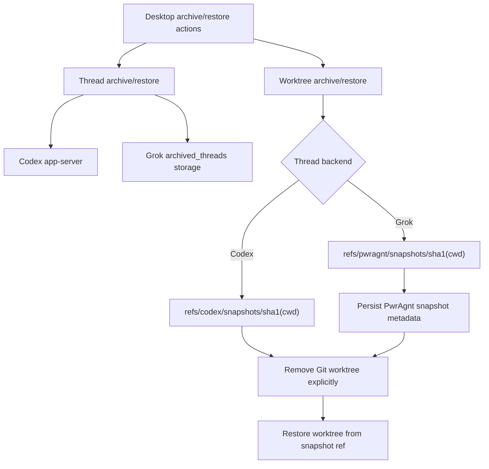
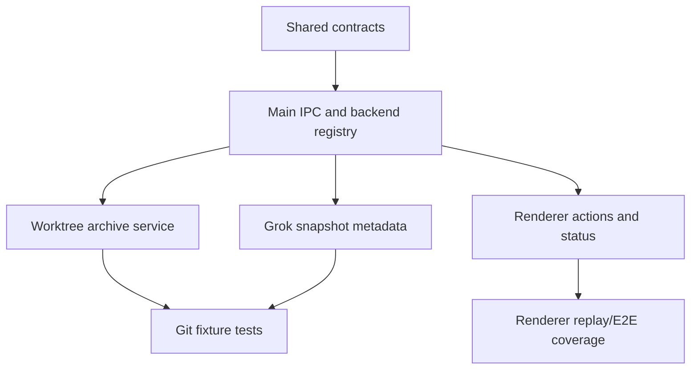

# feat: Complete thread and worktree archive restore

## Overview

Complete archive and restore as two related but separate lifecycle features:
thread archive/restore moves conversation history between active and archived
collections, while worktree archive/restore snapshots and removes or recreates
the local Git worktree attached to a thread.

Codex-owned threads should stay protocol-first. PwrAgnt should use Codex
app-server archive/unarchive when available and must not mutate Codex SQLite
state or Codex rollout files directly. For worktree cleanup, PwrAgnt can use
the observed Codex Desktop snapshot-ref convention as a best-effort
compatibility path, but should treat that convention as reverse-engineered
behavior rather than a stable wire protocol.

Agent-core-owned Grok threads should implement the same user-facing lifecycle
with PwrAgnt-owned storage, refs, and metadata. The Grok implementation should
be similar to Codex where the model is useful, but namespaced to PwrAgnt so it
does not collide with Codex refs or imply Codex ownership.

## Problem Frame

The completed safety plan in
`docs/plans/2026-04-22-001-feat-archive-restore-safety-parity-plan.md` made
thread archive reversible and removed archive-time local cleanup. That solved
the immediate data-loss risk, but it left a product gap: users still need a
deliberate way to reclaim disk by removing stale worktrees, then restore those
worktrees later when they re-open archived work.

Empirical Codex Desktop behavior from the `019dadd5-3143-7080-8f32-bbc680ef9941`
archive experiment is important, but it describes the full Codex Desktop
archive action rather than a documented app-server promise:

- Codex Desktop moved the rollout into `archived_sessions` and removed the
  worktree as part of the user-facing archive action.
- Before deletion, Codex created a Git commit at
  `refs/codex/snapshots/ed94b6fb65ed9bf9ddc53617d1b5c692bbe7bf8b`.
- The ref suffix was `sha1("/Users/huntharo/.codex/worktrees/13af/PwrAgnt")`,
  not the thread id.
- Restoring the thread moved the rollout back but did not recreate the
  worktree.
- Clicking Codex Desktop's "Restore worktree" recreated the worktree from that
  snapshot ref as a clean detached HEAD.
- Ignored files such as `node_modules` were not restored.

PwrAgnt needs to decide which parts of that behavior to rely on, which parts to
delegate to Codex, and which parts to own independently for Grok.

## Requirements Trace

- R1. Keep thread archive/restore and worktree archive/restore as separate
  lifecycle operations with separate results, errors, and UI copy.
- R2. For Codex-owned threads, use supported Codex app-server methods for
  thread archive/unarchive and do not write Codex SQLite, Codex rollout files,
  or Codex session indexes directly.
- R3. For Codex-owned worktrees, when PwrAgnt performs explicit worktree
  archive, create a Codex-compatible snapshot ref when possible:
  `refs/codex/snapshots/<sha1(abs-worktree-path)>`.
- R4. Treat Codex-compatible worktree snapshots as best-effort compatibility,
  not a guaranteed contract. PwrAgnt restore must be able to restore worktrees
  it archived even if a future Codex version changes its internal convention.
- R5. For Grok-owned threads, own the full archive/restore lifecycle in
  agent-core storage, including archived thread storage and PwrAgnt-namespaced
  worktree snapshot refs.
- R6. Preserve dirty tracked changes, staged changes, and eligible untracked
  files in a Git snapshot before removing a worktree. Do not claim ignored
  files are preserved.
- R7. Never archive/remove a primary repository checkout through the worktree
  archive path.
- R8. Make deletion explicit. Thread archive should not automatically delete a
  worktree unless the product intentionally adds an explicit archive-and-clean
  action with clear copy.
- R9. Restore worktrees to the original anchored path by default; do not silently
  re-home a thread to another worktree because the branch exists elsewhere.
- R10. Surface enough metadata for the desktop to explain whether a thread is
  archived, whether its worktree is present, whether a snapshot exists, and what
  restore can and cannot recover.

## Scope Boundaries

- In scope: thread archive/restore completion, explicit worktree archive,
  explicit worktree restore, shared contracts, desktop IPC/preload wiring,
  renderer affordances, agent-core persistence, and tests.
- In scope: Codex-compatible snapshot creation for Codex-owned worktrees when
  PwrAgnt is the actor removing the worktree.
- In scope: PwrAgnt-owned snapshot refs and metadata for Grok-owned worktrees.
- Out of scope: Direct mutation of Codex SQLite, Codex rollout files, Codex
  archived session files, or Codex session indexes.
- Out of scope: Restoring ignored dependency directories such as `node_modules`.
- Out of scope: Automatic branch deletion. Branch cleanup should remain a
  separate explicit feature if it is reintroduced.
- Out of scope: General-purpose non-git directory backup. Non-git directories
  should be ineligible for worktree archive unless a future plan defines a
  separate filesystem archive format.

## Context & Research

### Relevant Code and Patterns

- `apps/desktop/src/main/app-server/backend-registry.ts` currently routes
  `archiveThread` and `restoreThread` to the selected backend and returns empty
  cleanup results.
- `apps/desktop/src/main/app-server/git-directory-service.ts` still contains
  the old `cleanupThreadWorktrees` implementation, including forced worktree
  removal and branch deletion. It should not be reused directly for explicit
  worktree archive without redesign.
- `apps/desktop/src/main/codex-app-server/client.ts` already calls Codex
  `thread/archive` and `thread/unarchive`.
- `apps/desktop/src/main/grok-app-server/client.ts`,
  `packages/agent-core/src/app-server/codex-app-server.ts`,
  `packages/agent-core/src/app-server/session-state.ts`, and
  `packages/agent-core/src/persistence/grok-rollout-store.ts` already implement
  Grok thread archive/unarchive and `archived_threads` storage.
- `packages/shared/src/contracts/normalized-app-server.ts` currently has
  thread archive/restore contracts and a legacy `ArchiveThreadCleanupResult`
  shape. It needs distinct worktree lifecycle contracts.
- `apps/desktop/src/renderer/src/lib/useThreadNavigation.ts` owns archive
  optimistic removal and refresh behavior.
- `apps/desktop/src/renderer/src/features/navigation/Sidebar.tsx` and
  `ThreadRow` interaction tests in
  `apps/desktop/src/renderer/src/features/navigation/__tests__/sidebar.test.tsx`
  are the current archive UI surface.
- `apps/desktop/src/main/codex-app-server/thread-directory-enricher.ts` already
  derives home repo and worktree path from Git inspection while preserving the
  anchored worktree identity.
- `packages/shared/src/generated/codex-app-server-protocol/v2/GhostCommit.ts`
  documents Codex's generated ghost snapshot metadata shape. This is useful
  context but not itself an archive contract.

### Observed Codex Desktop Behavior

- Codex Desktop uses `refs/codex/snapshots/<sha1(abs-worktree-path)>` for the
  archive-cleanup snapshot ref.
- The snapshot commit captures tracked state, including the dirty README change
  in the experiment, as a normal commit object whose parent is the pre-archive
  worktree HEAD.
- The restored Codex worktree is checked out detached at the snapshot commit.
- Codex restore leaves the snapshot ref in place.
- Codex does not restore ignored directories from the snapshot.
- The snapshot id is derivable from persisted thread cwd. It was not stored in
  the visible thread row in `state_5.sqlite`, and it was not the thread id hash.
- The observed worktree snapshot/delete and restore-worktree operations are
  Desktop shell behavior around thread archive state. PwrAgnt should not assume
  that calling Codex app-server `thread/archive` alone guarantees worktree
  deletion or snapshot creation.

### Institutional Learnings

- `docs/brainstorms/2026-04-19-codex-desktop-protocol-parity-requirements.md`
  requires Codex integration to stay protocol-first and forbids silent re-homing
  of worktree-backed threads.
- `docs/plans/2026-04-22-001-feat-archive-restore-safety-parity-plan.md`
  intentionally removed archive-time worktree deletion. This plan should not
  undo that safety decision by making thread archive destructive again.
- No `docs/solutions/` directory exists in this worktree yet.

### External References

- None. The relevant evidence is local repo code, generated Codex protocol
  types, and observed Codex Desktop behavior on this machine.

## Key Technical Decisions

- Delegate Codex thread archive/restore to Codex app-server. If Codex does not
  support the operation, PwrAgnt should show it as unavailable rather than
  emulating it by editing Codex files.
- Introduce explicit worktree archive/restore APIs instead of overloading
  `ArchiveThreadResponse.cleanup`. Thread archive and worktree archive have
  different safety properties and should not share a response shape.
- Split worktree snapshot ownership by backend. Codex-owned worktrees may get a
  `refs/codex/snapshots/<sha1(cwd)>` ref for compatibility; Grok-owned worktrees
  should use `refs/pwragnt/snapshots/<sha1(cwd)>` or an equivalent PwrAgnt
  namespace chosen during implementation.
- Store PwrAgnt-owned worktree snapshot metadata outside Codex state for every
  worktree PwrAgnt archives, including Codex-owned threads. The metadata should
  live in PwrAgnt-controlled storage and include thread id, backend, repo root,
  worktree path, snapshot ref, commit sha, base HEAD, branch, creation time,
  restore status, and excluded categories such as ignored files.
- Use Git snapshots for Git worktrees, not filesystem copies. A commit-tree or
  temporary-index approach is preferred so existing staging state is not
  disturbed before deletion.
- Restore from snapshot to the anchored worktree path by default. If the path is
  occupied or the repo is missing, fail with an explicit recoverable error rather
  than choosing a new location silently.
- Do not restore ignored files. The UI and result contract should state that
  ignored files were not included, so `node_modules` loss is expected.
- Keep branch deletion out of scope. A restored worktree may be detached at the
  snapshot commit, matching observed Codex behavior, unless a later explicit
  branch-recovery design is approved.

## Open Questions

### Resolved During Planning

- Should PwrAgnt touch Codex SQLite to make Codex restore work? No. This is a
  hard boundary.
- Is the Codex snapshot ref named after the thread id? No. It is named after
  `sha1(abs-worktree-path)`.
- Can PwrAgnt make a Codex-compatible snapshot ref without touching Codex DB?
  Probably yes for the worktree snapshot itself, because the ref is normal Git
  state in the repository. Compatibility with future Codex restore UI remains
  best-effort because the convention is not a documented protocol.
- Should thread archive automatically remove worktrees again? No. Worktree
  archive must be explicit or part of a clearly labeled compound action.
- Should Grok snapshots use `refs/codex/snapshots`? No. They should be
  PwrAgnt-namespaced to avoid pretending Codex owns them.
- Does Codex app-server `thread/archive` alone guarantee worktree snapshot and
  deletion? No documented guarantee. Treat Codex thread archive and Codex
  worktree archive as separate capabilities in PwrAgnt even if Codex Desktop
  currently wires them together in its own shell.

### Deferred to Implementation

- Exact PwrAgnt snapshot ref namespace. The plan recommends
  `refs/pwragnt/snapshots/<worktree-id>`, but the implementer should verify it
  does not conflict with existing repo policy.
- Exact temporary-index mechanics for preserving staged state while producing a
  snapshot commit. The plan requires no user index disturbance; the final helper
  details belong in implementation.
- Whether the first UI exposes "Archive worktree" only after thread archive or
  also for active threads. The contracts should support both, but the initial UI
  can choose the safer narrower surface.
- How much of Codex-compatible restore should be tested against live Codex
  Desktop versus local unit fixtures. A manual verification checklist may be
  enough for the reverse-engineered compatibility claim.

## High-Level Technical Design

> *This illustrates the intended approach and is directional guidance for review, not implementation specification. The implementing agent should treat it as context, not code to reproduce.*

## Implementation Units

- [x] **Unit 1: Define explicit lifecycle contracts**

**Goal:** Add shared contracts that separate thread archive/restore from
worktree archive/restore and expose snapshot state without reusing cleanup
semantics.

**Requirements:** R1, R4, R6, R8, R10

**Dependencies:** None

**Files:**
- Modify: `packages/shared/src/contracts/normalized-app-server.ts`
- Modify: `packages/shared/src/contracts/backend.ts`
- Modify: `packages/shared/src/contracts/navigation.ts`
- Test: `apps/desktop/src/main/__tests__/app-server-ipc.test.ts`
- Test: `apps/desktop/src/main/__tests__/backend-registry.test.ts`

**Approach:**
- Add worktree archive and restore request/response types with explicit fields
  for backend, thread id, worktree path, repo root, snapshot ref, snapshot
  commit, restore mode, and excluded ignored-file status.
- Add a worktree lifecycle summary to thread or directory metadata so the
  renderer can distinguish present worktree, missing worktree with snapshot,
  missing worktree without snapshot, and restore ineligible.
- Preserve `ArchiveThreadResponse.cleanup` only for compatibility until callers
  are migrated, but do not add new behavior to it.
- Add backend capability flags for worktree archive/restore separately from
  thread archive/restore.

**Patterns to follow:**
- Existing `ArchiveThreadRequest`, `RestoreThreadRequest`, and
  `BackendCapabilities` normalization.
- Existing navigation summary enrichment in `navigation.ts`.

**Test scenarios:**
- Happy path: backend capabilities can advertise thread archive without
  worktree archive, and vice versa.
- Happy path: worktree snapshot metadata serializes through the IPC contract
  without requiring Codex-specific fields for Grok.
- Edge case: a thread with no linked worktree is marked restore-ineligible
  rather than exposing an action that will fail late.
- Integration: existing archive IPC tests remain compatible while new worktree
  IPC tests use the separate contract.

**Verification:**
- A reviewer can tell from shared types whether an action moves conversation
  history or mutates local Git worktrees.

- [x] **Unit 2: Implement snapshot creation and worktree archive service**

**Goal:** Replace the old cleanup helper with an explicit worktree archive
service that snapshots Git worktree state before removal and never deletes
branches.

**Requirements:** R3, R4, R6, R7, R8, R9

**Dependencies:** Unit 1

**Files:**
- Modify: `apps/desktop/src/main/app-server/git-directory-service.ts`
- Modify: `apps/desktop/src/main/app-server/backend-registry.ts`
- Create: `apps/desktop/src/main/app-server/worktree-archive-service.ts`
- Test: `apps/desktop/src/main/__tests__/worktree-archive-service.test.ts`
- Test: `apps/desktop/src/main/__tests__/backend-registry.test.ts`

**Approach:**
- Create a service that validates the linked directory is a registered Git
  worktree and not the primary checkout.
- Compute `worktreeId = sha1(absWorktreePath)` for both Codex-compatible and
  PwrAgnt-owned snapshots.
- Create a snapshot commit with a temporary-index or equivalent approach so
  dirty tracked, staged, and eligible untracked files are captured without
  disturbing the user's index.
- Use `refs/codex/snapshots/<worktreeId>` only for Codex-owned worktrees and
  `refs/pwragnt/snapshots/<worktreeId>` for Grok-owned worktrees.
- Remove the registered worktree only after the snapshot ref is created and
  verified.
- Do not delete the associated branch.

**Execution note:** Add characterization tests around staged changes and
untracked files before modifying the old cleanup path.

**Patterns to follow:**
- Existing Git command isolation in `git-directory-service.ts`.
- Observed Codex Desktop snapshot ref naming from the archive experiment.
- Codex ghost snapshot concept for temporary-index safety, without copying
  Codex internals directly.

**Test scenarios:**
- Happy path: dirty tracked changes are present in the snapshot commit after
  worktree removal.
- Happy path: staged changes remain represented in the snapshot and the service
  does not require unstaging before removal.
- Happy path: eligible untracked files are captured in the snapshot.
- Edge case: ignored directories such as `node_modules` are excluded and the
  response says ignored files were not preserved.
- Error path: primary checkout paths are refused before any snapshot or remove
  command runs.
- Error path: snapshot ref creation failure leaves the worktree in place.
- Error path: `git worktree remove` failure leaves the snapshot ref available
  and reports that local removal did not complete.
- Integration: backend registry invokes the worktree archive service only for
  explicit worktree archive requests, not for ordinary thread archive.

**Verification:**
- No path from `archiveThread` calls `git worktree remove`; only the explicit
  worktree archive path can remove a worktree.

- [ ] **Unit 3: Persist PwrAgnt-owned worktree snapshot metadata**

**Goal:** Give every worktree archived by PwrAgnt a durable, PwrAgnt-owned way
to find and restore its snapshot without relying on Codex state.

**Requirements:** R4, R5, R9, R10

**Dependencies:** Units 1 and 2

**Files:**
- Modify: `packages/agent-core/src/persistence/overlay-store.ts`
- Modify: `packages/agent-core/src/persistence/grok-rollout-store.ts`
- Modify: `packages/agent-core/src/app-server/session-state.ts`
- Modify: `packages/agent-core/src/app-server/internal-contract.ts`
- Test: `packages/agent-core/src/__tests__/refresh-reconciliation.test.ts`
- Test: `packages/agent-core/src/__tests__/grok-rollout-store.test.ts`
- Test: `packages/agent-core/src/__tests__/session-state.test.ts`
- Test: `packages/agent-core/src/__tests__/codex-app-server-persistence.test.ts`

**Approach:**
- Add a worktree snapshot metadata collection in PwrAgnt-controlled storage.
  Codex-owned snapshots created by PwrAgnt should record metadata there even
  when they also use a Codex-compatible Git ref. Grok-owned snapshots should be
  recorded there and may also be associated with Grok thread storage.
- For Grok threads, metadata should move with archived thread state when useful,
  but remain discoverable even if the active worktree is gone.
- Persist thread id, backend, repo root, worktree path, snapshot ref, commit
  sha, branch name, base HEAD, creation time, removal time, restore time, and
  ignored-file exclusion status.
- Make metadata writes atomic and recoverable in the same style as current
  Grok rollout persistence.
- Hydrate snapshot state into thread summaries so desktop navigation can expose
  restore affordances for missing worktrees.

**Patterns to follow:**
- Existing `archived_threads` directory handling in `grok-rollout-store.ts`.
- Existing flat TOML/JSONL persistence and atomic write helpers.

**Test scenarios:**
- Happy path: Grok worktree archive metadata persists across app restart.
- Happy path: Codex-owned worktree archive performed by PwrAgnt records
  PwrAgnt metadata without touching Codex SQLite or rollout files.
- Happy path: archived Grok thread storage retains snapshot metadata while the
  thread is archived.
- Edge case: Codex-compatible snapshot ref exists but PwrAgnt metadata is
  missing; restore can still use the compatibility ref but reports the lower
  confidence source.
- Edge case: metadata exists but the Git ref is missing; summary marks restore
  unavailable with a clear reason.
- Error path: corrupt metadata for one thread does not prevent other threads
  from loading.
- Integration: a Grok thread can be archived, have its worktree archived, be
  restored as a thread, and still show the worktree restore state.

**Verification:**
- PwrAgnt can locate snapshots it created using PwrAgnt state first, with
  Codex-compatible ref derivation only as a fallback for Codex-owned threads.

- [x] **Unit 4: Implement worktree restore**

**Goal:** Recreate missing worktrees from snapshot refs for both Codex-owned and
Grok-owned threads without touching Codex SQLite or silently changing paths.

**Requirements:** R2, R4, R5, R6, R9, R10

**Dependencies:** Units 1, 2, and 3

**Files:**
- Modify: `apps/desktop/src/main/app-server/worktree-archive-service.ts`
- Modify: `apps/desktop/src/main/app-server/backend-registry.ts`
- Modify: `apps/desktop/src/main/ipc/app-server.ts`
- Modify: `apps/desktop/src/preload/index.ts`
- Modify: `apps/desktop/src/renderer/src/lib/desktop-api.ts`
- Test: `apps/desktop/src/main/__tests__/worktree-archive-service.test.ts`
- Test: `apps/desktop/src/main/__tests__/backend-registry.test.ts`
- Test: `apps/desktop/src/main/__tests__/app-server-ipc.test.ts`

**Approach:**
- Resolve the snapshot ref from explicit PwrAgnt metadata first; for Codex-owned
  threads without PwrAgnt metadata, derive the compatibility ref from
  `sha1(absWorktreePath)`.
- Restore to the anchored worktree path only when the path is absent and the
  home repo is available.
- Use Git worktree add or checkout mechanics that produce a clean detached HEAD
  at the snapshot commit by default, matching observed Codex behavior.
- Report branch and ignored-file limitations in the response rather than
  recreating branches or dependencies implicitly.
- Never update Codex thread rows, Codex SQLite, or Codex rollouts as part of
  worktree restore.

**Patterns to follow:**
- Existing `prepareLaunchpadWorkspace` Git worktree creation flow.
- Observed Codex Desktop restore behavior for detached snapshot checkout.

**Test scenarios:**
- Happy path: a missing Codex-owned worktree restores from
  `refs/codex/snapshots/<sha1(cwd)>` when the ref exists.
- Happy path: a missing Grok-owned worktree restores from a PwrAgnt snapshot
  ref recorded in metadata.
- Edge case: target path already exists; restore fails clearly and does not
  overwrite the path.
- Edge case: snapshot ref exists but points to a non-commit; restore fails
  before creating a worktree.
- Error path: home repo cannot be found; restore reports missing repo and leaves
  metadata unchanged.
- Integration: restored worktree appears in `git worktree list` and thread
  navigation updates from missing to present.

**Verification:**
- Restore can recover tracked, staged, and eligible untracked content captured
  in the snapshot, but ignored files remain absent and are reported as excluded.

- [x] **Unit 5: Add desktop UI for explicit worktree lifecycle**

**Goal:** Expose clear worktree archive and restore actions without implying
thread archive restores files or that ignored dependencies are preserved.

**Requirements:** R1, R8, R9, R10

**Dependencies:** Units 1 through 4

**Files:**
- Modify: `apps/desktop/src/renderer/src/lib/useThreadNavigation.ts`
- Modify: `apps/desktop/src/renderer/src/features/navigation/Sidebar.tsx`
- Modify: `apps/desktop/src/renderer/src/features/navigation/ThreadRow.tsx`
- Modify: `apps/desktop/src/renderer/src/features/thread-detail/ThreadContextPanel.tsx`
- Modify: `apps/desktop/src/renderer/src/styles/app.css`
- Test: `apps/desktop/src/renderer/src/features/navigation/__tests__/sidebar.test.tsx`
- Test: `apps/desktop/src/renderer/src/features/thread-detail/__tests__/thread-view.test.tsx`

**Approach:**
- Keep the existing thread archive action focused on archiving the thread.
- Add worktree actions in a contextual surface where the user can see the
  linked directory, not as another always-visible sidebar icon.
- Use copy that distinguishes "Archive worktree" from "Archive thread" and
  warns that ignored files such as dependencies are not included.
- Show "Restore worktree" only when the worktree path is missing and a snapshot
  ref or PwrAgnt metadata exists.
- Show unavailable states when the snapshot is missing, the repo is missing, or
  the linked directory is not a Git worktree.

**Patterns to follow:**
- `apps/desktop/AGENTS.md` and `docs/design/desktop-style-guide.md` for dense,
  calm desktop UI.
- Existing thread context panel path display and copy-to-path behavior.
- Existing archive error state in `useThreadNavigation`.

**Test scenarios:**
- Happy path: active thread archive still removes the thread from active
  navigation and does not remove a worktree.
- Happy path: a thread with a present worktree shows an explicit worktree
  archive action in the context surface.
- Happy path: a thread with a missing worktree and available snapshot shows
  restore worktree.
- Edge case: a missing worktree without snapshot shows a disabled or explanatory
  state, not a broken action.
- Error path: worktree archive failure displays the error and keeps the thread
  visible.
- Integration: after worktree restore, the UI refreshes directory status and no
  longer shows the missing-worktree restore affordance.

**Verification:**
- Users can understand which action affects thread history and which action
  affects local Git workspace state.

- [ ] **Unit 6: Add replay and live verification coverage**

**Goal:** Prove the lifecycle across backend, local Git, and renderer surfaces,
including Codex compatibility boundaries.

**Requirements:** R2, R3, R4, R5, R6, R9, R10

**Dependencies:** Units 1 through 5

**Files:**
- Modify: `apps/desktop/e2e/*`
- Modify: `apps/desktop/e2e/fixtures/*`
- Test: `apps/desktop/src/main/__tests__/worktree-archive-service.test.ts`
- Test: `apps/desktop/src/main/__tests__/codex-client.test.ts`
- Test: `apps/desktop/src/main/__tests__/grok-app-server-client.test.ts`
- Test: `packages/agent-core/src/__tests__/codex-app-server-contract.test.ts`

**Approach:**
- Add unit-level Git fixture tests for snapshot, remove, and restore.
- Add renderer replay coverage for action visibility and status transitions.
- Add Codex adapter tests that prove PwrAgnt uses protocol calls for thread
  archive/unarchive and never edits Codex persistence directly.
- Add tests that prove PwrAgnt does not assume Codex app-server
  `thread/archive` created a worktree snapshot unless a snapshot ref or
  PwrAgnt metadata is actually present.
- Add a manual verification note or fixture capture for Codex-compatible
  snapshot refs, because current compatibility is based on observed Desktop
  behavior rather than a published protocol.

**Execution note:** Use characterization-first tests around Codex-compatible
snapshot naming before implementing the compatibility helper.

**Patterns to follow:**
- Existing backend-registry and app-server IPC tests for cross-layer routing.
- Project-local desktop E2E fixture seeding guidance when refreshing replay
  fixtures.

**Test scenarios:**
- Happy path: Grok thread archive -> worktree archive -> thread restore ->
  worktree restore recovers tracked content and reports ignored exclusions.
- Happy path: Codex thread archive/unarchive goes through Codex app-server only.
- Happy path: Codex worktree archive creates the compatibility snapshot ref
  based on `sha1(absWorktreePath)`.
- Edge case: Codex-compatible snapshot ref is absent; PwrAgnt does not attempt
  to modify Codex DB to compensate.
- Edge case: Codex thread archive succeeds but no worktree snapshot ref exists;
  PwrAgnt reports thread archive success and worktree restore unavailable.
- Error path: snapshot creation succeeds but worktree removal fails; restore
  remains possible from the snapshot while UI reports the partial result.
- Integration: navigation refresh reflects present/missing/restorable worktree
  state after each operation.

**Verification:**
- The test suite proves no thread archive path performs worktree deletion and
  no Codex-owned flow writes Codex persistence files.

## Implementation Progress

- Implemented shared worktree lifecycle contracts, backend capability flags,
  IPC channels, preload APIs, and desktop API types.
- Added `WorktreeArchiveService`, which snapshots through a temporary Git
  index, writes backend-namespaced snapshot refs, refuses primary checkouts,
  removes worktrees without deleting branches, and restores detached worktrees
  from snapshot commits.
- Persisted PwrAgnt-created snapshot metadata in the overlay store and hydrated
  it into navigation thread summaries. The broader Grok rollout-store metadata
  move described in Unit 3 remains future work.
- Added context-panel worktree archive/restore affordances and navigation hook
  actions for explicit worktree lifecycle operations.
- Added focused tests for worktree archive/restore, IPC routing, and overlay
  snapshot metadata persistence.

## System-Wide Impact

- **Interaction graph:** Renderer actions, preload APIs, main-process IPC,
  backend registry, Git worktree service, Codex/Grok clients, Grok persistence,
  and navigation snapshots all need separate thread and worktree lifecycle
  concepts.
- **Error propagation:** Thread archive errors should come from the backend
  protocol. Worktree archive/restore errors should come from Git validation,
  snapshot creation, worktree removal, or restore mechanics. The UI should not
  collapse those into one generic archive failure.
- **State lifecycle risks:** Snapshot ref creation and worktree removal are a
  two-phase operation. The safe partial state is "snapshot exists, worktree
  still present"; the unsafe state is "worktree removed, no valid snapshot."
- **API surface parity:** New worktree lifecycle APIs need shared contracts,
  main IPC, preload, desktop API types, backend registry methods, renderer hooks,
  and test coverage.
- **Integration coverage:** Unit tests can cover most Git behavior, but one
  cross-layer scenario should prove navigation and UI state update correctly
  after worktree archive/restore.
- **Unchanged invariants:** Codex persistence remains owned by Codex. Thread
  identity remains anchored to original cwd/worktree metadata. Branch deletion
  remains outside this feature.

## Risks & Dependencies

| Risk | Mitigation |
|------|------------|
| Codex changes its internal snapshot convention | Treat `refs/codex/snapshots/sha1(cwd)` as best-effort compatibility and keep PwrAgnt restore independent for snapshots it creates. |
| Data loss if removal happens before snapshot verification | Make snapshot ref creation and commit validation a hard prerequisite before `git worktree remove`. |
| User expects `node_modules` to come back | State in contract/UI that ignored files are excluded; tests should assert ignored directories are not restored. |
| PwrAgnt accidentally mutates Codex persistence | Keep Codex thread archive/restore protocol-only and add tests that fail on direct Codex file writes in adapter paths. |
| Snapshot creation disturbs staged state | Use temporary-index style snapshotting and tests that cover staged changes. |
| Worktree restore overwrites user files | Refuse restore when the target path already exists. |
| Branch deletion sneaks back into archive | Keep branch deletion out of service responsibilities and assert no branch delete command in worktree archive tests. |
| Non-git directories appear in linked directories | Mark them ineligible for worktree archive/restore and require a future filesystem archive design. |

## Documentation / Operational Notes

- Add a short docs note or plan back-reference explaining that thread archive
  and worktree archive are separate operations.
- Document the PwrAgnt worktree snapshot namespace and metadata location once
  the final names are chosen.
- Document Codex compatibility as observational, not as a guaranteed contract.
- Consider adding a troubleshooting note: restored worktrees are clean snapshots
  and ignored dependencies must be reinstalled.

## Sources & References

- Prior safety plan: `docs/plans/2026-04-22-001-feat-archive-restore-safety-parity-plan.md`
- Prior archive UI plan: `docs/plans/2026-04-21-001-feat-thread-archive-ui-worktree-cleanup-plan.md`
- Protocol parity requirements: `docs/brainstorms/2026-04-19-codex-desktop-protocol-parity-requirements.md`
- Desktop backend registry: `apps/desktop/src/main/app-server/backend-registry.ts`
- Current Git directory service: `apps/desktop/src/main/app-server/git-directory-service.ts`
- Codex adapter guidance: `apps/desktop/src/main/codex-app-server/AGENTS.md`
- Grok rollout persistence: `packages/agent-core/src/persistence/grok-rollout-store.ts`
- Grok session state: `packages/agent-core/src/app-server/session-state.ts`
- Shared normalized contracts: `packages/shared/src/contracts/normalized-app-server.ts`
- Generated Codex ghost metadata type: `packages/shared/src/generated/codex-app-server-protocol/v2/GhostCommit.ts`
