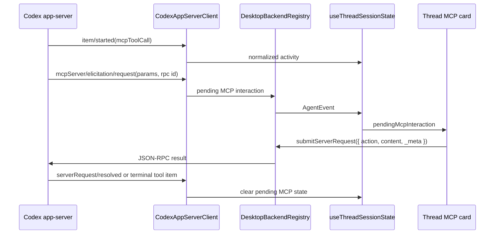
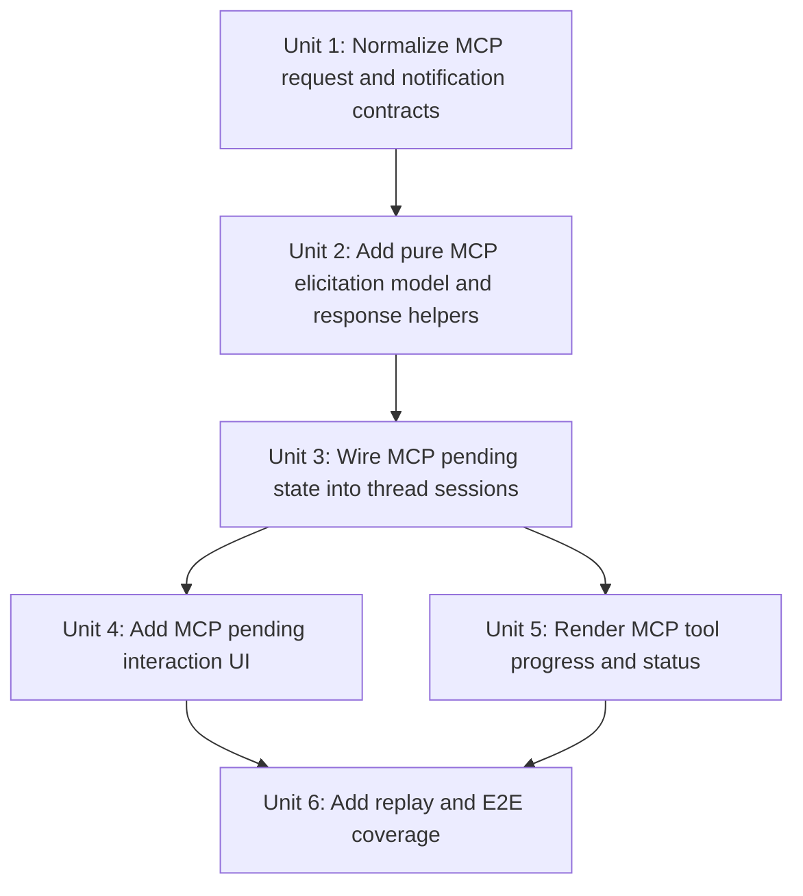

# feat: Add desktop MCP request support

## Overview

Add first-class desktop support for Codex app-server MCP request flows, starting with the observed `mcpServer/elicitation/request` approval for the Playwright `browser_tabs` MCP tool and extending the same path to structured form elicitations, URL-mode elicitations, MCP tool-call progress, OAuth/login status, and status metadata. The implementation should make the desktop app a correct Codex app-server client for MCP interactions without implementing a full MCP runtime inside the Electron app.

## Problem Frame

The desktop app currently receives Codex MCP activity but does not complete the protocol loop. A live Codex turn emitted an `item/started` notification for an `mcpToolCall`, then sent a JSON-RPC request with method `mcpServer/elicitation/request` asking whether the `playwright` MCP server could run tool `browser_tabs`. The Codex adapter recognized the method as part of the generated protocol, but logged it as an unhandled inbound request and the renderer did not surface it as pending user action.

This is a protocol-parity issue, not a request to build Playwright MCP inside PwrAgnt. For the Codex backend, Codex app-server owns MCP server startup and tool execution; PwrAgnt must act as the client/UI that displays approvals or input requests, submits the right response shape, and renders MCP progress. For the Grok app-server, MCP can remain status-shape-compatible until a separate plan adds a real MCP runtime.

## Requirements Trace

- R1, R2, R4 from the origin protocol-parity requirements: use supported Codex app-server request/notification behavior as the source of truth for desktop behavior.
- R6 from the origin requirements: mirror the Codex Desktop protocol contract instead of approximating with local heuristics.
- R15, R16 from the origin requirements: verify runtime behavior with targeted unit, replay, and E2E coverage while keeping fixture refresh targeted.
- RM1. Surface `mcpServer/elicitation/request` as a pending MCP interaction instead of logging it as unhandled.
- RM2. Preserve Codex response compatibility by returning `McpServerElicitationRequestResponse` with `action`, `content`, and `_meta`, not approval-shaped `{ decision }`.
- RM3. Support form-mode elicitations for both empty-schema approvals and structured non-secret input.
- RM4. Support URL-mode elicitations by showing the server, message, URL, and elicitation id, then allowing accept/decline/cancel without passing credentials through the client.
- RM5. Render MCP tool-call items and progress notifications with enough context for the user to understand which server/tool is waiting or running.
- RM6. Keep command/file approvals, Plan questionnaires, permissions approvals, and MCP elicitations separated so response shapes cannot cross.
- RM7. Maintain stable empty-or-derived MCP status metadata for backends that do not yet implement an MCP runtime.

## Scope Boundaries

- In scope: desktop handling for Codex `mcpServer/elicitation/request`, `item/mcpToolCall/progress`, `mcpServer/startupStatus/updated`, `mcpServer/oauthLogin/completed`, and MCP tool-call activity normalization.
- In scope: normalized shared contracts, renderer state, thread UI, response formatting, replay fixtures, and E2E coverage.
- In scope: preserving `mcpServerStatus/list` as stable metadata for Codex and Grok, with richer rendering when data is available.
- Out of scope: implementing a real MCP server runtime in `packages/agent-core` or the Electron app.
- Out of scope: storing third-party credentials, OAuth tokens, or browser-session secrets in PwrAgnt.
- Out of scope: changing Codex app-server generated protocol types by hand; generated files remain generated.
- Out of scope: automatic allow rules for MCP tools. This pass should be explicit and user-visible.

## Context & Research

### Relevant Code and Patterns

- `apps/desktop/src/main/codex-app-server/client.ts` owns JSON-RPC request normalization. It lists `mcpServer/elicitation/request` in `GENERATED_CODEX_SERVER_REQUEST_METHODS`, but `isHandledServerRequestMethod` currently handles only `*requestApproval` and `item/tool/requestUserInput`.
- `apps/desktop/src/main/codex-app-server/json-rpc.ts` already passes the JSON-RPC id into the request handler and returns the handler result to Codex, which is the right transport seam for MCP elicitation responses.
- `apps/desktop/src/main/app-server/backend-registry.ts` already stores pending server requests and resolves them through `submitServerRequest`, so MCP should reuse that pending-request bridge rather than adding a new transport.
- `packages/shared/src/contracts/normalized-app-server.ts` has generic `AppServerPendingRequestNotification` plus dedicated `AppServerToolRequestUserInputNotification` types. MCP needs the same dedicated typed shape because its response contract is not approval-shaped.
- `apps/desktop/src/renderer/src/lib/useThreadSessionState.ts` intentionally separates supported approval requests from `item/tool/requestUserInput`; MCP should extend this pattern with a third pending state instead of widening approval matching.
- `apps/desktop/src/renderer/src/features/thread-detail/questionnaire.ts` is good prior art for pure response builders and request-state helpers that are testable without React or Electron.
- `apps/desktop/src/renderer/src/features/thread-detail/ThreadView.tsx` currently has separate submit paths for approvals and Plan questionnaires. MCP should add a separate submit path and not call `buildPendingRequestResponse`.
- `apps/desktop/src/renderer/src/features/thread-detail/TranscriptList.tsx` renders pending approvals and pending questionnaires in the transcript. MCP needs a compact thread-native pending card following the same UI density.
- `apps/desktop/e2e/request-user-input.spec.ts` and `apps/desktop/e2e/fixtures/request-user-input/replay.fixture.json` provide the closest replay-backed pattern for inbound JSON-RPC requests that are not approvals.
- `packages/agent-core/src/app-server/metadata-service.ts` already returns `{ data: [] }` for `mcpServerStatus/list`; this is acceptable for Grok until a separate MCP runtime exists.

### Institutional Learnings

- No `docs/solutions/` artifacts exist yet for MCP request support.
- The completed Plan questionnaire plan (`docs/plans/2026-04-20-001-feat-plan-questionnaire-navigation-plan.md`) established the important local pattern: requests with distinct response contracts should have distinct renderer state, pure response builders, and explicit regression coverage proving they do not render approval controls.
- The active app-server compatibility plan (`docs/plans/2026-04-16-002-feat-app-server-protocol-compatibility-plan.md`) treats `mcpServerStatus/list` as a stable metadata endpoint even before a real MCP subsystem exists.

### External References

- MCP 2025-11-25 Elicitation spec: form mode supports structured user input, URL mode supports sensitive out-of-band interactions, clients should provide clear server context and approval controls.
- MCP 2025-11-25 Authorization spec: MCP authorization is transport-level and optional; stdio transports should generally obtain credentials from environment rather than the HTTP OAuth flow.
- MCP 2025-11-25 changelog: URL-mode elicitation and updated `ElicitResult`/enum schema behavior are current protocol features, so the desktop plan should not assume form-only elicitation.

## Key Technical Decisions

- **Treat MCP elicitations as their own pending interaction type.** Approval cards return `{ decision }`, Plan questionnaires return `{ answers }`, and MCP elicitations return `{ action, content, _meta }`. The UI state and response builders must make those impossible to mix accidentally.
- **Handle empty-schema form elicitations as approvals.** The observed Playwright request has `mode: "form"` and an empty object schema. The user-facing affordance can be Approve/Decline/Cancel, but the submitted payload must still be MCP-shaped.
- **Handle non-empty form schemas as structured MCP input.** MCP form elicitations can request non-secret structured fields. The first implementation should support the generated schema primitives already present in `@pwragnt/shared/codex-app-server-protocol/v2`, with validation helpers kept pure and narrowly tested.
- **Handle URL mode as out-of-band user action.** URL mode should display the URL and allow the user to open it externally, but PwrAgnt must not ask for or collect credentials. Accept means the user has completed or wants to continue the out-of-band flow; decline/cancel remain available.
- **Keep MCP runtime ownership explicit.** Codex app-server runs MCP servers and tools. PwrAgnt desktop displays status, approvals, and progress. Grok app-server keeps shape-compatible metadata until a separate plan adds a real MCP client/server runtime.
- **Preserve generated protocol ownership.** Use generated Codex app-server protocol types as inputs at the adapter boundary. Add normalized PwrAgnt contracts in `packages/shared/src/contracts/normalized-app-server.ts`; do not hand-edit generated protocol files.
- **Prefer replay-backed verification over live-only MCP runs.** A live Playwright MCP request is useful for capture, but CI should use deterministic replay fixtures for the request/response UI path.

## Open Questions

### Resolved During Planning

- **Are MCPs implemented by the desktop client or the app server?** For the Codex backend, Codex app-server owns MCP server lifecycle and tool execution. The desktop client owns request presentation, approval/input collection, response submission, and status/progress rendering.
- **Should `mcpServer/elicitation/request` be handled?** Yes. It is a known generated Codex server request and currently blocks because PwrAgnt does not surface or answer it correctly.
- **Can the observed empty-schema elicitation use approval buttons?** Yes, as UI language, as long as the wire response is MCP-shaped.
- **Should Grok gain a real MCP runtime in this plan?** No. Keep stable empty status metadata for Grok; real MCP runtime support is a larger provider/runtime project.

### Deferred to Implementation

- The exact first-pass coverage of every generated `McpElicitationPrimitiveSchema` variant after inspecting representative Codex captures.
- The final compact UI copy for URL mode after a screenshot pass.
- Whether Codex returns additional `_meta.persist` rules that should later drive remembered approvals. This plan should preserve `_meta`, but not implement persistence rules automatically.
- Whether `mcpServer/oauthLogin/completed` needs a visible toast, transcript item, or only state cleanup in the first pass.

## High-Level Technical Design

> *This illustrates the intended approach and is directional guidance for review, not implementation specification. The implementing agent should treat it as context, not code to reproduce.*

The pending request surfaces should stay intentionally separate:

| Method family | Renderer state | User action shape | JSON-RPC response shape |
|---|---|---|---|
| `item/commandExecution/requestApproval`, `item/fileChange/requestApproval`, legacy approval aliases | `pendingRequest` | approve / decline / cancel | `{ decision: string }` |
| `item/tool/requestUserInput` | `pendingUserInput` | answer questionnaire | `{ answers: Record<string, { answers: string[] }> }` |
| `mcpServer/elicitation/request` | `pendingMcpInteraction` | accept / decline / cancel plus optional content | `{ action: "accept" | "decline" | "cancel", content: JsonValue | null, _meta: JsonValue | null }` |

## Phased Delivery

### Phase 1: Unblock observed MCP approvals

- Handle `mcpServer/elicitation/request` in the Codex adapter without unhandled-request logging.
- Support empty-schema form-mode MCP approvals end to end with MCP-shaped accept/decline/cancel responses.
- Add isolated pending MCP session state, a compact pending card, and replay-backed coverage for the observed Playwright `browser_tabs` flow.
- Preserve existing approval and Plan questionnaire behavior unchanged.

### Phase 2: Complete elicitation mode coverage

- Add structured non-secret form input support for generated MCP primitive schema variants.
- Add URL-mode rendering and response handling for sensitive out-of-band interactions.
- Strengthen redaction and fixture hygiene for URLs, `_meta`, and tool parameters.

### Phase 3: Broaden MCP activity visibility

- Render MCP tool-call progress, startup status, OAuth completion, and metadata in the thread view.
- Keep Grok shape-compatible but empty for MCP status until a separate runtime plan adds real MCP support.

## Implementation Units

- [x] **Unit 1: Normalize MCP request and notification contracts**

**Goal:** Represent MCP elicitations and progress explicitly across shared contracts and the Codex adapter.

**Requirements:** RM1, RM2, RM5, RM6, RM7

**Dependencies:** None

**Files:**
- Modify: `packages/shared/src/contracts/normalized-app-server.ts`
- Modify: `apps/desktop/src/main/codex-app-server/client.ts`
- Test: `apps/desktop/src/main/__tests__/codex-client.test.ts`
- Test: `apps/desktop/src/main/__tests__/backend-registry-replay.test.ts`

**Approach:**
- Add normalized shared types for `AppServerMcpElicitationRequestNotification`, MCP form/url modes, MCP elicitation response, and MCP progress/status notifications.
- Update `isHandledServerRequestMethod` so `mcpServer/elicitation/request` is handled rather than logged as unhandled.
- Preserve `threadId`, nullable `turnId`, `serverName`, `mode`, `_meta`, `message`, `requestedSchema`, `url`, and `elicitationId` from the generated Codex payload.
- Add `item/mcpToolCall/progress`, `mcpServer/oauthLogin/completed`, and any missing MCP status notification methods to known notification handling so important MCP events are not downgraded to unknown logs.
- Keep `AppServerPendingRequestNotification` generic enough for the registry bridge, but add discriminated types and helpers so the renderer can branch safely.

**Patterns to follow:**
- `apps/desktop/src/main/codex-app-server/client.ts`
- `apps/desktop/src/main/__tests__/codex-client.test.ts`
- `packages/shared/src/contracts/normalized-app-server.ts`

**Test scenarios:**
- Happy path: an inbound `mcpServer/elicitation/request` with JSON-RPC id `0`, server `playwright`, form mode, and empty schema emits a pending MCP notification with request id `0`.
- Happy path: a URL-mode elicitation preserves `url`, `elicitationId`, `message`, `serverName`, and `_meta`.
- Happy path: the request handler returns the exact MCP response object from the registered listener to the JSON-RPC transport.
- Regression: command/file approval requests and `item/tool/requestUserInput` continue to normalize unchanged.
- Regression: permissions approvals remain excluded from generic approval UI unless a dedicated permissions implementation exists.
- Edge case: nullable `turnId` stays nullable in normalized MCP params rather than being coerced to an invalid string.

**Verification:**
- Main-process tests prove MCP elicitations are no longer logged as unhandled and can round-trip a valid MCP response through the existing request bridge.

- [x] **Unit 2: Add pure MCP elicitation model and response helpers**

**Goal:** Build testable helpers for turning MCP elicitation params into renderer state, validating user input, and formatting protocol-correct responses.

**Requirements:** RM2, RM3, RM4, RM6

**Dependencies:** Unit 1

**Files:**
- Create: `apps/desktop/src/renderer/src/features/thread-detail/mcp-elicitation.ts`
- Test: `apps/desktop/src/renderer/src/features/thread-detail/__tests__/mcp-elicitation.test.ts`

**Approach:**
- Create a `PendingMcpInteractionState` model with method, request id, thread id, turn id, server name, message, mode, `_meta`, and mode-specific form/url details.
- Treat form mode with an empty `properties` object as an approval-style confirmation that needs no `content` on accept beyond `{}`.
- For non-empty form schemas, derive fields from generated MCP primitive schema variants. Support string, number, boolean, single-select enum, multi-select enum, required fields, defaults, descriptions, min/max where the generated type exposes them, and a validation result that can be rendered without React-specific state.
- For URL mode, preserve URL and elicitation id and build responses without collecting credentials or tokens.
- Build `buildMcpElicitationResponse` so accept/decline/cancel always return `{ action, content, _meta }`, with `content: null` for decline/cancel.
- Preserve request `_meta` only where the protocol expects client metadata; do not invent persistence or auto-approval behavior.

**Patterns to follow:**
- `apps/desktop/src/renderer/src/features/thread-detail/questionnaire.ts`
- `apps/desktop/src/renderer/src/features/thread-detail/__tests__/questionnaire.test.ts`

**Test scenarios:**
- Happy path: empty-schema form approval accepts with `action: "accept"`, `content: {}`, and `_meta: null`.
- Happy path: declining or cancelling any mode returns `content: null`.
- Happy path: a required string field with user input appears in the accepted `content`.
- Happy path: a boolean field and enum field preserve typed values rather than converting everything to display strings.
- Happy path: URL mode accepts without embedding URL contents, tokens, or credentials in `content`.
- Edge case: required form fields block accept until valid.
- Edge case: unsupported schema variants render a safe unsupported-field message and block accept for required unsupported fields.
- Error path: malformed params produce no pending MCP state and leave the turn available for server-side failure handling.

**Verification:**
- MCP response formatting is fully testable without React or Electron and cannot accidentally call approval or questionnaire response builders.

- [x] **Unit 3: Wire MCP pending state into thread session lifecycle**

**Goal:** Store pending MCP interactions in thread session state and clear them on response, terminal turn state, or matching server resolution.

**Requirements:** RM1, RM2, RM6

**Dependencies:** Units 1 and 2

**Files:**
- Modify: `apps/desktop/src/renderer/src/lib/useThreadSessionState.ts`
- Test: `apps/desktop/src/renderer/src/lib/__tests__/useThreadSessionState.test.tsx`

**Approach:**
- Add `pendingMcpInteraction?: PendingMcpInteractionState` to `ThreadSessionEntry`.
- Add `isMcpElicitationNotification` beside the existing approval and request-user-input guards.
- On `mcpServer/elicitation/request`, create pending MCP state and set pending status text to a short waiting-for-MCP status.
- Clear only the matching MCP request when `serverRequest/resolved` arrives, when the user submits successfully, or when the active turn fails, cancels, or completes.
- Keep composer disabled while MCP input is pending, matching existing pending approval/user-input behavior.
- Ensure events for another backend, thread, or request id do not clear the selected thread's MCP interaction.

**Patterns to follow:**
- `apps/desktop/src/renderer/src/lib/useThreadSessionState.ts`
- `apps/desktop/src/renderer/src/lib/__tests__/useThreadSessionState.test.tsx`

**Test scenarios:**
- Happy path: `mcpServer/elicitation/request` creates `pendingMcpInteraction` and does not create `pendingRequest` or `pendingUserInput`.
- Happy path: matching `serverRequest/resolved` clears only the MCP interaction with the same request id.
- Regression: command/file approval still creates `pendingRequest`.
- Regression: Plan questionnaire still creates `pendingUserInput`.
- Edge case: nullable `turnId` MCP requests still attach to the thread and can be submitted.
- Edge case: events for another thread or backend do not alter the current pending MCP state.
- Edge case: turn failure/cancellation clears stale MCP pending state.

**Verification:**
- Hook tests prove MCP pending lifecycle is isolated from approval and questionnaire lifecycle.

- [x] **Unit 4: Add MCP pending interaction UI and submit path**

**Goal:** Render MCP elicitations in the thread view and submit MCP-shaped responses through `submitServerRequest`.

**Requirements:** RM1, RM2, RM3, RM4, RM6

**Dependencies:** Units 2 and 3

**Files:**
- Create: `apps/desktop/src/renderer/src/features/thread-detail/PendingMcpInteraction.tsx`
- Modify: `apps/desktop/src/renderer/src/features/thread-detail/ThreadView.tsx`
- Modify: `apps/desktop/src/renderer/src/features/thread-detail/TranscriptList.tsx`
- Modify: `apps/desktop/src/renderer/src/lib/desktop-api.ts` only if stronger response typing is useful
- Modify: `apps/desktop/src/renderer/src/styles/app.css`
- Test: `apps/desktop/src/renderer/src/features/thread-detail/__tests__/pending-mcp-interaction.test.tsx`
- Test: `apps/desktop/src/renderer/src/features/thread-detail/__tests__/thread-view.test.tsx`
- Test: `apps/desktop/src/renderer/src/features/thread-detail/__tests__/transcript-list.test.tsx`

**Approach:**
- Render a compact pending card that identifies the MCP server, user-facing message, optional tool description, and displayed tool parameters from `_meta.tool_params_display` when present.
- Redact credential-like keys, URL query strings, bearer-looking values, and long opaque tokens before displaying `_meta`, tool parameters, arguments, or URLs in compact transcript summaries.
- For empty-schema form mode, show Accept, Decline, and Cancel controls with user-facing copy appropriate to allowing an MCP tool call.
- For structured form mode, render compact field controls based on the pure model helpers and show validation feedback only where required to proceed.
- For URL mode, show the URL as an explicit external destination and provide an Open control plus Accept/Decline/Cancel. The UI should not ask for credentials or imply PwrAgnt can inspect the out-of-band result.
- Add a `submitPendingMcpInteraction` handler separate from approval and questionnaire handlers.
- Preserve the pending card and entered form values if `submitServerRequest` rejects.
- Follow the desktop style guide: dense thread-native surface, no browser-default controls in shipped UI, radius at or below 8px, no scaffold narration.

**Patterns to follow:**
- `apps/desktop/src/renderer/src/features/thread-detail/ThreadView.tsx`
- `apps/desktop/src/renderer/src/features/thread-detail/TranscriptList.tsx`
- `apps/desktop/src/renderer/src/features/thread-detail/PendingQuestionnaire.tsx`
- `docs/design/desktop-style-guide.md`
- `docs/UI-THEME.md`

**Test scenarios:**
- Happy path: the observed Playwright `browser_tabs` request renders as an MCP approval card with server, message, and no Plan questionnaire UI.
- Happy path: Accept submits `{ action: "accept", content: {}, _meta: null }` for empty-schema form mode.
- Happy path: Decline submits `{ action: "decline", content: null, _meta: null }`.
- Happy path: URL mode renders the external URL and submits an MCP-shaped response after accept.
- Happy path: structured form mode collects a required string value and submits it in `content`.
- Edge case: required structured fields disable Accept until valid.
- Error path: bridge failure leaves the card visible with values preserved and shows an inline error.
- Regression: Approve/Decline command approval tests still submit approval-shaped decisions.
- Accessibility: controls expose stable role/name selectors suitable for Testing Library and Playwright.

**Verification:**
- Renderer tests prove MCP UI renders and submits protocol-correct responses without affecting existing approvals or questionnaires.

- [x] **Unit 5: Render MCP tool progress, startup status, OAuth completion, and metadata**

**Goal:** Make MCP activity visible and understandable during live turns, even when no elicitation is pending.

**Requirements:** RM5, RM7

**Dependencies:** Unit 1

**Files:**
- Modify: `apps/desktop/src/main/codex-app-server/client.ts`
- Modify: `apps/desktop/src/main/ipc/agent-ipc.ts`
- Modify: `apps/desktop/src/renderer/src/lib/useThreadSessionState.ts`
- Modify: `apps/desktop/src/renderer/src/features/thread-detail/TranscriptList.tsx`
- Modify: `apps/desktop/src/renderer/src/features/thread-detail/ThreadView.tsx`
- Test: `apps/desktop/src/main/__tests__/codex-client.test.ts`
- Test: `apps/desktop/src/renderer/src/lib/__tests__/useThreadSessionState.test.tsx`
- Test: `apps/desktop/src/renderer/src/features/thread-detail/__tests__/transcript-list.test.tsx`

**Approach:**
- Ensure `mcpToolCall` thread items normalize into activity entries with server, tool, status, arguments, result/error summary, and duration where available.
- Handle `item/mcpToolCall/progress` as a live progress update tied to item id and turn id.
- Handle `mcpServer/startupStatus/updated` and `mcpServer/oauthLogin/completed` as non-fatal status notifications that can update live state or append compact activity where useful.
- Keep `mcpServerStatus/list` stable for both Codex and Grok; Grok may still return empty data, while Codex should pass through whatever the app-server provides.
- Avoid exposing raw credential-like values from arguments, `_meta`, or URL query strings in transcript summaries.

**Patterns to follow:**
- Existing activity normalization for `commandExecution`, `dynamicToolCall`, and `webSearch` in `apps/desktop/src/main/codex-app-server/client.ts`
- Message-phase eliding plan: `docs/plans/2026-04-22-001-feat-message-phase-eliding-plan.md`

**Test scenarios:**
- Happy path: an in-progress `mcpToolCall` item renders as live work-bearing activity with server/tool labels.
- Happy path: `item/mcpToolCall/progress` updates the matching activity status/message.
- Happy path: a completed MCP tool call with result renders as completed activity.
- Error path: a failed MCP tool call with error renders failure state without crashing the transcript.
- Edge case: progress for an unknown item id is ignored or stored safely without corrupting current state.
- Security regression: URL query strings or credential-like values are not displayed verbatim in compact summaries.
- Metadata: `mcpServerStatus/list` empty data still renders/flows without errors.

**Verification:**
- Live MCP activity is visible in the thread as work in progress, and MCP status notifications no longer look like mysterious protocol noise.

- [x] **Unit 6: Add replay-backed E2E coverage and capture guidance**

**Goal:** Lock the full Electron path for MCP elicitation and progress with deterministic replay fixtures, plus document how to refresh live MCP captures.

**Requirements:** R15, R16, RM1, RM2, RM3, RM4, RM5, RM6

**Dependencies:** Units 1-5

**Files:**
- Create: `apps/desktop/e2e/fixtures/mcp-elicitation/replay.fixture.json`
- Create: `apps/desktop/e2e/mcp-elicitation.spec.ts`
- Modify: `apps/desktop/src/main/__tests__/fixture-derivation.test.ts` if fixture derivation needs MCP request support
- Modify: `apps/desktop/e2e/fixtures/README.md`
- Create or update: `apps/desktop/e2e/fixtures/mcp-elicitation/capture-recipe.md`

**Approach:**
- Build a replay fixture around the observed Playwright `browser_tabs` request: user prompt, turn start, `item/started` for `mcpToolCall`, `mcpServer/elicitation/request`, accepted response, progress or completion, and terminal turn state.
- Add a second replay path or fixture step for URL mode if a representative payload is available; otherwise include unit coverage for URL mode and document the capture gap.
- E2E should verify the MCP card appears, existing approval/questionnaire controls do not appear, Accept submits and clears the pending request, and MCP tool progress renders.
- Document how to capture a live MCP run using existing protocol capture tooling without adding secrets or private tokens to fixtures.
- Use the project-local desktop E2E fixture seeding skill when refreshing replay-backed desktop fixtures from a live captured session.

**Patterns to follow:**
- `apps/desktop/e2e/request-user-input.spec.ts`
- `apps/desktop/e2e/fixtures/request-user-input/replay.fixture.json`
- `apps/desktop/e2e/fixtures/request-user-input/capture-recipe.md`
- `.agents/skills/desktop-e2e-fixture-seeding/SKILL.md`

**Test scenarios:**
- Full path: MCP elicitation appears, Accept resolves the pending request, and the thread resumes.
- Regression: no Plan questionnaire or command/file approval card appears for `mcpServer/elicitation/request`.
- Full path: MCP tool progress or completion activity appears in the transcript.
- Edge case: Decline keeps the app stable and sends an MCP-shaped decline response.
- Fixture hygiene: raw captures used for fixtures do not include tokens, credentials, or private URL query strings.

**Verification:**
- Electron E2E can exercise the real renderer/main-process bridge for MCP elicitations without relying on a live MCP server in CI.

## System-Wide Impact

- **Interaction graph:** Codex app-server JSON-RPC requests flow through `CodexAppServerClient`, `DesktopBackendRegistry`, IPC, `useThreadSessionState`, and thread-detail UI. MCP support should reuse this graph instead of adding a parallel bridge.
- **Error propagation:** JSON-RPC handler errors still return JSON-RPC errors to Codex. User decline/cancel is not an exception; it is a valid MCP response. Bridge submission failures should remain visible in the pending card.
- **State lifecycle risks:** Pending MCP interactions must be keyed by backend, thread id, and request id so a request from one thread cannot clear another. Stale requests clear on matching resolution or terminal turn state.
- **API surface parity:** Generated Codex request/notification types stay at the adapter boundary. Normalized PwrAgnt contracts gain MCP-specific discriminated types so downstream UI does not parse generated blobs.
- **Integration coverage:** Unit tests cover response builders and session lifecycle; replay/E2E covers JSON-RPC request through renderer submit and pending-state cleanup.
- **Unchanged invariants:** Command/file approvals still use approval responses, Plan questionnaires still use answer-map responses, permissions approvals remain excluded until separately implemented, and Grok does not claim a real MCP runtime.
- **Security handling:** MCP interactions cross a third-party tool boundary. The desktop should show enough context for informed consent while redacting secret-like values, avoiding credential collection in form mode, and treating URL mode as an out-of-band action whose credentials never pass through PwrAgnt.

## Risks & Dependencies

| Risk | Mitigation |
|------|------------|
| Response shape drift blocks Codex turns | Use generated `McpServerElicitationRequestResponse` semantics and exact main-process tests for `{ action, content, _meta }`. |
| Approval, questionnaire, and MCP request paths get mixed | Maintain separate state fields, type guards, response builders, submit handlers, and regression tests. |
| Form-mode elicitations accidentally collect secrets | Follow MCP guidance: form mode should not be used for secrets; URL mode is the supported sensitive-flow path. UI copy and validation should not ask for credentials. |
| URL mode leaks sensitive URLs or tokens into logs/fixtures | Redact query strings or credential-like values in compact summaries and fixture recipes; do not store live private URLs in checked-in fixtures. |
| MCP progress creates noisy transcript output | Render compact work-bearing activity and reuse existing message-phase eliding/activity grouping patterns. |
| Grok users infer MCP support that does not exist | Keep Grok `mcpServerStatus/list` shape-compatible but empty, and avoid UI that claims available MCP servers for Grok until a real runtime lands. |
| Current MCP spec continues to evolve | Keep protocol-specific handling at the Codex adapter boundary and rely on generated types after running protocol regeneration when needed. |

## Documentation / Operational Notes

- Update fixture capture docs with a short MCP section once replay coverage lands.
- Do not document an MCP runtime for Grok in user-facing copy until a separate runtime plan implements it.
- If implementation discovers Codex `_meta.persist` semantics for remembered MCP approvals, record them as a follow-up requirement rather than silently enabling automatic approvals.

## Sources & References

- Origin document: [docs/brainstorms/2026-04-19-codex-desktop-protocol-parity-requirements.md](../brainstorms/2026-04-19-codex-desktop-protocol-parity-requirements.md)
- Related plan: [docs/plans/2026-04-20-001-feat-plan-questionnaire-navigation-plan.md](2026-04-20-001-feat-plan-questionnaire-navigation-plan.md)
- Related plan: [docs/plans/2026-04-16-002-feat-app-server-protocol-compatibility-plan.md](2026-04-16-002-feat-app-server-protocol-compatibility-plan.md)
- Codex adapter guidance: [apps/desktop/src/main/codex-app-server/AGENTS.md](../../apps/desktop/src/main/codex-app-server/AGENTS.md)
- MCP Elicitation specification: https://modelcontextprotocol.io/specification/2025-11-25/client/elicitation
- MCP Authorization specification: https://modelcontextprotocol.io/specification/2025-11-25/basic/authorization
- MCP 2025-11-25 changelog: https://modelcontextprotocol.io/specification/2025-11-25/changelog
