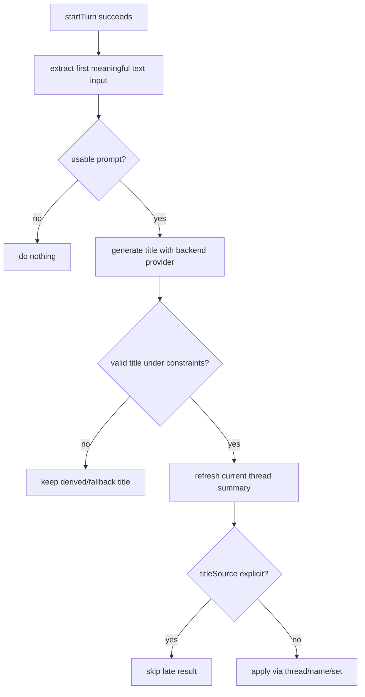

# feat: Add desktop-owned out-of-band thread naming

## Overview

Add a desktop-owned out-of-band title generation flow for new thread prompts. The desktop app should use the same provider family as the active backend, choose an appropriate lightweight model, generate a short title with the shared title prompt, and apply the result through the existing `thread/name/set` capability. The app-server protocol should not grow a "generate a title" method; app servers only need to support the already-existing "apply this name" mutation.

## Problem Frame

PwrAgnt currently has two different naming behaviors in play. The desktop can derive a local title from the first prompt, and Codex Desktop appears to make a separate ephemeral generation call that later applies a polished name through `thread/name/set`. The existing PwrAgnt code now has a shared title prompt, but no code sends that prompt to a model or applies the generated title.

There is also an existing desktop out-of-band model-call pattern in the focused-diff feature. That path is xAI-specific today, possibly underused, but it already demonstrates the right desktop ownership boundary: a renderer or desktop workflow asks the main process for an ephemeral model decision, the main process uses a short timeout, validates structured output, caches/falls back conservatively, and does not expose that decision as app-server protocol.

## Requirements Trace

- R1. Generate thread titles out of band from the user's first meaningful prompt, without blocking the user turn.
- R2. Keep ownership in the desktop app; do not add an app-server protocol method for title generation.
- R3. Apply generated names only through existing backend rename support, especially `thread/name/set`.
- R4. Use the same provider family as the selected backend: Codex/OpenAI for Codex-backed threads and xAI/Grok for Grok-backed threads.
- R5. Use appropriate lightweight defaults: `gpt-5.4-mini` with low reasoning and fast service tier for Codex; `grok-4-1-fast-non-reasoning` for Grok title generation unless implementation-time model availability says otherwise.
- R6. Use the shared desktop thread-title prompt and enforce a 50-character, 6-word output limit with validation.
- R7. Preserve user intent and ticket references, including JIRA keys, GitHub issue/PR numbers, bare numeric references, and textual references.
- R8. Do not overwrite a user-supplied or already explicit thread name if the out-of-band request completes late.
- R9. Fail soft: if title generation is unavailable, times out, returns invalid JSON, or returns an unusable title, keep the existing derived/fallback title behavior.
- R10. Keep protocol capture and desktop tests able to distinguish user-visible backend traffic from desktop-owned ephemeral helper traffic.

## Scope Boundaries

- In scope: desktop main-process title generation orchestration, provider-specific generation adapters, race guards, structured output validation, and tests.
- In scope: extending the existing desktop Codex client with a private helper for ephemeral generation using supported app-server fields such as `ephemeral` and `outputSchema`.
- In scope: reusing or extracting focused-diff's xAI object-call pattern so Grok title generation is not a one-off.
- Out of scope: adding a public app-server `thread/title/generate` method or changing the normalized desktop app-server contract for normal thread turns.
- Out of scope: renderer UI controls for enabling/disabling automatic naming.
- Out of scope: replacing local derived title fallback behavior; generated names improve the title when available but should not become a hard dependency.
- Out of scope: changing the already-written title prompt beyond implementation-time fixes needed for schema compatibility.

## Context & Research

### Relevant Code and Patterns

- `apps/desktop/src/main/app-server/thread-title-prompt.md` and `apps/desktop/src/main/app-server/thread-title-prompt.ts` now hold the shared desktop title prompt and builder.
- `apps/desktop/src/main/diff-focus/focused-diff-service.ts` is the current desktop-owned out-of-band model-call pattern. It uses `XaiAiSdkObjectClient`, a prompt version, a short timeout, a JSON schema, a prompt-cache key, a deterministic test override, validation, cache keys, and soft fallback.
- `apps/desktop/src/main/__tests__/focused-diff-service.test.ts` proves the focused-diff path with injected clients and with xAI runtime config.
- `packages/agent-core/src/providers/xai-ai-sdk-object-client.ts` wraps `generateObject` from the AI SDK, injects xAI prompt cache keys into Responses API calls, accepts a schema, and returns parsed object output plus cache token metadata.
- `packages/agent-core/src/config/grok-app-server-config.ts` is already exported through `packages/agent-core/src/index.ts`, so desktop code can load the same xAI API key and base URL as the Grok app server without adding new config plumbing.
- `apps/desktop/src/main/codex-app-server/client.ts` already centralizes Codex JSON-RPC requests, notification filtering, model defaults, `thread/start`, `turn/start`, and `thread/name/set`.
- `packages/shared/src/generated/codex-app-server-protocol/v2/ThreadStartParams.ts` includes `ephemeral`, and `TurnStartParams.ts` includes `outputSchema`, `model`, `serviceTier`, and `effort`.
- `apps/desktop/src/main/grok-app-server/client.ts`, `packages/agent-core/src/app-server/codex-app-server.ts`, and `packages/agent-core/src/app-server/session-state.ts` already support `thread/name/set` and `thread/name/updated`.
- `apps/desktop/src/main/app-server/backend-registry.ts` is the desktop composition boundary for `startTurn`, backend model defaults, backend client selection, rename routing, and agent-event broadcasting.
- `docs/plans/2026-04-16-004-feat-thread-naming-parity-plan.md` established `explicit`, `derived`, and `fallback` title states and kept app-server naming semantics separate from desktop normalization.

### Institutional Learnings

- No `docs/solutions/` artifacts exist yet for reusable desktop ephemeral model calls or automatic thread naming.

### External References

- None. Local Codex protocol bindings and the existing focused-diff pattern are sufficient for planning.

## Key Technical Decisions

- Desktop-owned orchestration: implement title generation from `DesktopBackendRegistry` or a service it owns, not from `packages/agent-core` app-server methods. The desktop has the user prompt, selected backend, model settings, and rename routing context.
- Provider-specific generation adapters behind one title service: use a common `ThreadTitleGenerationService` API with Codex and Grok adapters underneath. This keeps provider details isolated while giving the registry one place to schedule, validate, and apply titles.
- Codex uses the Codex app-server as the OpenAI transport: start an ephemeral helper thread with `gpt-5.4-mini`, `serviceTier: fast`, and low reasoning, then start a structured-output turn using the title prompt. This avoids requiring separate OpenAI API credentials in the desktop app.
- Grok uses the existing xAI structured object-call pattern: adapt or share the focused-diff object-call infrastructure with a default `grok-4-1-fast-non-reasoning` model, short timeout, schema validation, and soft fallback.
- Keep provider adapters injected, not globally discovered: the registry should construct the title service with access to the same Codex default/full-access clients and Grok config helpers it already owns, so tests can inject deterministic adapters and replay mode can disable or stub generation.
- Apply through rename only after validation and freshness checks: the generated title becomes user-visible only through the selected backend client's `renameThread` path, which maps to `thread/name/set`.
- Do not override explicit names: before applying, refresh or inspect the current thread summary and skip if `titleSource` is `explicit`, if the name no longer looks like the prompt-derived placeholder, or if a newer pending generation superseded this request.
- Suppress ephemeral helper noise: Codex helper threads and turns must not leak normal agent events into the renderer or thread list. The Codex client should route helper-thread notifications to the waiting generation request and keep them out of `onNotification` subscribers.
- Keep fallback deterministic: if any model call fails, the current derived-title behavior remains the only visible result.

## Open Questions

### Resolved During Planning

- Should title generation live in `packages/agent-core`? No. The user explicitly wants this owned by the desktop app and not exposed by the app-server protocol except through the existing name-apply mutation.
- Should Grok title generation use the main Grok turn runner? No for the first implementation. The focused-diff pattern already provides a lighter object-call path that avoids creating transcript items or app-server turns.
- Should Codex title generation call OpenAI directly? No for the first implementation. The desktop Codex integration should reuse the Codex app server so it uses the user's existing Codex provider/auth context.
- Should generated names replace the explicit/derived/fallback title model? No. They become explicit names only after `thread/name/set`; derived/fallback remains the safety net.

### Deferred to Implementation

- Exact Codex notification shape for capturing the final structured title from an ephemeral `turn/start` response. The generated protocol types show the needed input fields, but implementation should verify the terminal notification path against captured traffic or focused tests.
- Whether `gpt-5.4-mini` supports `serviceTier: fast` in all current Codex app-server environments. If the app server rejects the combination, fall back to the same model with no service tier before abandoning generation.
- Whether `grok-4-1-fast-non-reasoning` is always available in configured xAI accounts. If unavailable, the implementation may fall back to another fast non-reasoning Grok model from backend metadata.
- Whether title generation should be triggered only for the first user turn or also for previously created empty threads when their first turn arrives after app restart. The first implementation should cover first meaningful turn in the live desktop path and can broaden after tests expose a clean persisted-state signal.

## High-Level Technical Design

> *This illustrates the intended approach and is directional guidance for review, not implementation specification. The implementing agent should treat it as context, not code to reproduce.*

```mermaid
sequenceDiagram
    participant Renderer
    participant Registry as DesktopBackendRegistry
    participant Title as ThreadTitleGenerationService
    participant Backend as Backend client
    participant Model as Lightweight provider call

    Renderer->>Registry: startTurn(threadId, backend, input)
    Registry->>Backend: turn/start
    Backend-->>Registry: threadId + turnId
    Registry-->>Renderer: startTurn response
    Registry->>Title: schedule title generation
    Title->>Model: ephemeral structured title request
    Model-->>Title: { title }
    Title->>Registry: valid title candidate
    Registry->>Backend: thread/name/set
    Backend-->>Renderer: thread/name/updated event
```



## Implementation Units

- [x] **Unit 1: Characterize and extract the ephemeral object-call pattern**

**Goal:** Make the focused-diff out-of-band call pattern reusable enough for title generation without breaking focused diff.

**Requirements:** R2, R4, R9, R10

**Dependencies:** None

**Files:**
- Modify: `apps/desktop/src/main/diff-focus/focused-diff-service.ts`
- Create: `apps/desktop/src/main/app-server/ephemeral-object-call.ts`
- Test: `apps/desktop/src/main/__tests__/focused-diff-service.test.ts`
- Test: `apps/desktop/src/main/__tests__/ephemeral-object-call.test.ts`

**Approach:**
- Start with characterization coverage around focused-diff's current client injection, timeout fallback, prompt-cache key, schema forwarding, and config loading.
- Extract only the common xAI object-call plumbing that title generation actually needs: runtime config resolution, injected client support, timeout handling, model override, prompt cache key, schema forwarding, and soft error mapping.
- Keep focused-diff-specific eligibility, cache keys, hunk normalization, confidence thresholds, and test override behavior inside `FocusedDiffService`.
- Do not generalize Codex app-server helper turns into this xAI object-call helper; Codex needs a separate adapter because its provider access comes through the Codex app server.

**Execution note:** Characterization-first. Preserve focused-diff behavior before extracting shared plumbing because this path may be stale.

**Patterns to follow:**
- `apps/desktop/src/main/diff-focus/focused-diff-service.ts`
- `apps/desktop/src/main/__tests__/focused-diff-service.test.ts`
- `packages/agent-core/src/providers/xai-ai-sdk-object-client.ts`

**Test scenarios:**
- Happy path: focused diff still sends the configured schema, prompt cache key, and model after the extraction.
- Happy path: the extracted helper returns parsed object output and cached-token metadata from an injected client.
- Edge case: missing xAI API key returns a soft unavailable result without throwing to the caller.
- Error path: timeout or rejected model call becomes a typed failure result that focused diff can convert to its existing fallback response.
- Regression: focused-diff cache behavior remains owned by `FocusedDiffService` and does not move into the generic helper.

**Verification:**
- Focused diff tests still pass, and the new helper has direct tests proving the reusable call boundary.

- [x] **Unit 2: Add a desktop thread-title generation service**

**Goal:** Centralize prompt construction, model selection, structured-output validation, and title cleanup behind one desktop-owned service.

**Requirements:** R1, R2, R4, R5, R6, R7, R9

**Dependencies:** Unit 1 for the Grok/xAI helper path

**Files:**
- Modify: `apps/desktop/src/main/app-server/thread-title-prompt.ts`
- Create: `apps/desktop/src/main/app-server/thread-title-generation-service.ts`
- Test: `apps/desktop/src/main/__tests__/thread-title-generation-service.test.ts`
- Test: `apps/desktop/src/main/__tests__/thread-title-prompt.test.ts`

**Approach:**
- Define a small service API that accepts backend kind, first user prompt text, and optional provider/client overrides for tests.
- Model provider adapters explicitly, for example as Codex and Grok generator dependencies passed to the service constructor. The service should not reach into singleton registries or create backend clients on its own.
- Use `buildThreadTitlePrompt()` as the prompt source and require structured JSON with a single `title` field.
- Add output normalization that trims whitespace and quotes, rejects empty titles, strips trailing punctuation when needed, and enforces 50 characters and 6 words by rejecting or conservatively truncating only when doing so does not corrupt ticket references.
- Preserve ticket references by validating that known references present in the prompt and title are not damaged by cleanup; if cleanup would break a reference, keep fallback derived behavior instead of applying a bad generated name.
- Return a result object that distinguishes `generated`, `unavailable`, `invalid`, and `failed`, so the registry can log useful state without throwing.

**Patterns to follow:**
- `apps/desktop/src/main/app-server/thread-title-prompt.ts`
- `packages/shared/src/contracts/normalized-app-server.ts` for `AppServerBackendKind`
- Focused-diff's structured response validation style

**Test scenarios:**
- Happy path: a valid `{ "title": "PROJECT-123 checkout crash" }` result is accepted.
- Happy path: a title preserving `#123`, `issue 123`, `PR 456`, and a bare `456` reference survives normalization.
- Edge case: output over 50 characters or over 6 words is rejected or safely normalized according to the service rule.
- Edge case: title cleanup removes wrapper quotes and trailing punctuation without changing meaningful text.
- Error path: malformed JSON, missing `title`, non-string `title`, or empty title returns `invalid` and does not throw.
- Error path: adapter failure returns `failed` or `unavailable` with a reason.

**Verification:**
- Title prompt constraints are tested at the service boundary, not only by checking prompt file contents.

- [x] **Unit 3: Implement Codex app-server ephemeral title generation**

**Goal:** Use Codex/OpenAI for Codex-backed thread naming without adding a direct OpenAI dependency or new app-server protocol method.

**Requirements:** R2, R3, R4, R5, R9, R10

**Dependencies:** Unit 2

**Files:**
- Modify: `apps/desktop/src/main/codex-app-server/client.ts`
- Test: `apps/desktop/src/main/__tests__/codex-client.test.ts`

**Approach:**
- Add a private or narrowly exposed Codex client method for ephemeral structured generation that the title service can call through an injected Codex title adapter. This can be represented as an optional capability on the desktop `BackendClient` type or as a separate adapter object owned by the registry; the key boundary is that normal app-server consumers still do not see a title-generation protocol method.
- Start a helper thread with `ephemeral: true`, `model: "gpt-5.4-mini"`, `serviceTier: "fast"`, `experimentalRawEvents: false`, and `persistExtendedHistory: false`.
- Start a helper turn with the built title prompt, `effort: "low"`, and an `outputSchema` requiring `{ "title": "string" }`.
- Correlate terminal notifications for the helper thread/turn and resolve the waiting generation request with the final assistant text or structured object payload.
- Suppress helper-thread notifications from normal `onNotification` subscribers so ephemeral generation does not create visible transcript activity or protocol-capture confusion in the main thread.
- Apply fallback attempts conservatively: if the app server rejects `serviceTier: "fast"`, try once without `serviceTier`; if `ephemeral` or `outputSchema` is unsupported, return `unavailable` and leave local derived naming intact.
- Keep generated title application outside this client method; the client should generate a candidate, and the registry should decide whether to call `thread/name/set` on the real thread.

**Patterns to follow:**
- `apps/desktop/src/main/codex-app-server/client.ts` request fallback helpers and notification listener management
- `packages/shared/src/generated/codex-app-server-protocol/v2/ThreadStartParams.ts`
- `packages/shared/src/generated/codex-app-server-protocol/v2/TurnStartParams.ts`
- `apps/desktop/src/main/__tests__/codex-client.test.ts` mock transport assertions

**Test scenarios:**
- Happy path: Codex title generation sends `thread/start` with `ephemeral: true`, `model: "gpt-5.4-mini"`, and fast service tier.
- Happy path: Codex title generation sends `turn/start` with low effort, the title prompt, and an output schema.
- Happy path: a helper turn completion resolves to the generated title candidate.
- Edge case: helper-thread notifications are consumed by the pending generation and not forwarded to desktop event subscribers.
- Error path: unsupported fast service tier falls back once without fast tier.
- Error path: helper turn timeout or malformed completion returns a soft failure and cleans up pending waiters.

**Verification:**
- Codex-backed title generation uses the Codex app server and never requires separate OpenAI credentials.

- [x] **Unit 4: Implement Grok fast-model title generation**

**Goal:** Use a lightweight Grok model for Grok-backed thread naming through the reusable desktop xAI object-call path.

**Requirements:** R2, R3, R4, R5, R6, R7, R9

**Dependencies:** Units 1-2

**Files:**
- Modify: `apps/desktop/src/main/app-server/thread-title-generation-service.ts`
- Modify: `apps/desktop/src/main/app-server/ephemeral-object-call.ts`
- Test: `apps/desktop/src/main/__tests__/thread-title-generation-service.test.ts`
- Test: `apps/desktop/src/main/__tests__/ephemeral-object-call.test.ts`

**Approach:**
- Add a Grok adapter that uses the extracted xAI object-call helper with `grok-4-1-fast-non-reasoning` as the default model.
- Use `resolveGrokAppServerRuntimeConfig()` so the desktop-owned call uses the same configured xAI API key and base URL as the Grok app server.
- Use a title-specific prompt cache key such as the prompt version, pass the title JSON schema, and keep timeout short so naming cannot stall the desktop.
- Allow tests to inject an object client and model override without mutating global config.
- Return unavailable when xAI credentials are absent; do not surface this as a user-visible error.

**Patterns to follow:**
- `apps/desktop/src/main/diff-focus/focused-diff-service.ts`
- `packages/agent-core/src/providers/xai-ai-sdk-object-client.ts`
- `packages/agent-core/src/providers/xai-model-selection.ts`
- `packages/agent-core/src/app-server/metadata-service.ts`

**Test scenarios:**
- Happy path: Grok generation calls xAI with `grok-4-1-fast-non-reasoning`, title schema, and prompt cache key.
- Happy path: configured base URL and API key are read from the existing Grok runtime config.
- Edge case: injected model override is used for tests or future model availability fallback.
- Error path: missing xAI credentials returns unavailable and does not throw.
- Error path: xAI rejection or invalid object output returns soft failure and leaves title application to fallback behavior.

**Verification:**
- Grok-backed title generation uses an xAI fast model and does not create transcript items or app-server turns.

- [x] **Unit 5: Schedule generation after first turn and apply names safely**

**Goal:** Trigger provider-specific title generation from the desktop start-turn flow and apply valid names without races or user-name clobbering.

**Requirements:** R1, R2, R3, R8, R9, R10

**Dependencies:** Units 2-4

**Files:**
- Modify: `apps/desktop/src/main/app-server/backend-registry.ts`
- Test: `apps/desktop/src/main/__tests__/backend-registry.test.ts`
- Test: `apps/desktop/src/main/__tests__/agent-ipc.test.ts`

**Approach:**
- Add a registry-owned `ThreadTitleGenerationService` dependency with constructor injection for tests.
- After `startTurn` succeeds, extract the first meaningful text input and decide whether generation is eligible. Skip scheduling when the thread already has an explicit title, when another generation is already pending for the same first prompt, or when replay/test configuration disables background generation.
- Schedule title generation asynchronously. Do not await it before returning the user's `startTurn` response.
- Track pending generations by `backend:threadId` plus an input hash or generation token so older completions cannot apply after a newer prompt.
- Before applying a generated title, refresh the current thread summary through the selected backend and skip if the title is already explicit, if the thread is archived or missing, or if a newer pending generation token exists.
- Apply with the existing `renameWithClient` route so Codex and Grok both use their backend `renameThread` implementations and emit normal `thread/name/updated` notifications.
- Log debug-level generation outcomes with backend, thread id, model family, elapsed time, and skip/failure reason, without logging the full prompt text.

**Patterns to follow:**
- `apps/desktop/src/main/app-server/backend-registry.ts` dependency injection and client selection
- `apps/desktop/src/main/app-server/backend-registry.ts` `renameWithClient`
- `apps/desktop/src/main/ipc/agent-ipc.ts` event broadcast behavior

**Test scenarios:**
- Happy path: starting the first Codex turn returns immediately, then a valid generated title is applied through the Codex client's `renameThread`.
- Happy path: starting the first Grok turn returns immediately, then a valid generated title is applied through the Grok client's `renameThread`.
- Edge case: empty, image-only, or whitespace-only input does not schedule title generation.
- Edge case: if the current thread summary reports `titleSource: "explicit"` before generation completes, the generated title is skipped.
- Edge case: two quick turns on the same thread allow only the newest pending generation token to apply.
- Error path: generation failure does not reject `startTurn` and does not emit a user-visible error event.
- Integration: `thread/name/updated` from the backend still reaches the renderer through the existing event pipeline after generated title application.

**Verification:**
- Automatic naming improves thread titles after the first prompt while preserving normal turn latency and explicit user rename behavior.

- [x] **Unit 6: Capture and replay provider-specific naming behavior**

**Goal:** Keep protocol capture, replay fixtures, and future debugging clear about what was user-thread traffic versus desktop-owned ephemeral naming traffic.

**Requirements:** R9, R10

**Dependencies:** Units 3-5

**Files:**
- Modify: `apps/desktop/src/main/testing/protocol-capture.ts`
- Modify: `apps/desktop/src/main/testing/replay-client.ts`
- Modify: `apps/desktop/src/main/testing/replay-runtime.ts`
- Test: `apps/desktop/src/main/__tests__/protocol-capture.test.ts`
- Test: `apps/desktop/src/main/__tests__/replay-client.test.ts`
- Test: `apps/desktop/src/main/__tests__/backend-registry-replay.test.ts`

**Approach:**
- Preserve raw capture of Codex app-server helper traffic for debugging, but tag or classify it as desktop-owned ephemeral title generation when enough metadata is available.
- Ensure replay fixtures can either include deterministic title generation results or disable generation so existing replay tests are not made flaky by background model calls.
- Add a test hook or injected title service for replay runtime rather than relying on live provider calls.
- Make sure helper-thread suppression in the Codex client applies to renderer event broadcasting but does not hide raw protocol capture when capture is explicitly enabled.

**Patterns to follow:**
- `apps/desktop/src/main/testing/protocol-capture.ts`
- `apps/desktop/src/main/testing/replay-client.ts`
- `apps/desktop/src/main/testing/replay-runtime.ts`
- `.agents/skills/desktop-e2e-fixture-seeding/SKILL.md`

**Test scenarios:**
- Happy path: protocol capture records Codex helper requests with an ephemeral/title-generation classification.
- Happy path: replay runtime can inject deterministic generated names without network calls.
- Edge case: existing fixtures without title-generation records continue to replay with generation disabled or stubbed.
- Error path: malformed helper records do not break replay of the main user thread.

**Verification:**
- Captures remain useful for debugging title generation without contaminating normal thread transcript behavior or making replay tests network-dependent.

## System-Wide Impact

- **Interaction graph:** renderer `startTurn` -> `DesktopBackendRegistry.startTurn` -> backend `turn/start` -> `ThreadTitleGenerationService` -> provider-specific ephemeral call -> backend `thread/name/set` -> existing `thread/name/updated` event pipeline.
- **Error propagation:** generation errors stay inside desktop main logs and service result objects. They must not reject `startTurn`, fail the user turn, or create renderer error toasts.
- **State lifecycle risks:** background generation must clean up pending waiters and tokens on success, timeout, registry close, and backend client close. Codex helper threads must not enter normal thread lists or renderer transcript state.
- **API surface parity:** the app-server protocol remains unchanged except for using existing `thread/name/set`; Codex-specific ephemeral generation uses already-generated protocol fields internally in the desktop Codex adapter.
- **Integration coverage:** backend-registry tests need to prove asynchronous application and race guards because unit tests for adapters alone will not catch user-name clobbering.
- **Unchanged invariants:** explicit user renames always win; derived/fallback titles remain available; missing provider credentials or unsupported helper fields degrade silently.

## Risks & Dependencies

| Risk | Mitigation |
|------|------------|
| Codex ephemeral helper notifications leak into the real thread UI. | Track helper thread/turn ids in the Codex client and route those notifications only to the pending generator while still allowing raw protocol capture. |
| Generated title overwrites a user rename. | Refresh current thread summary before apply, require non-explicit title state, and use generation tokens to skip stale completions. |
| Title generation slows normal turn submission. | Schedule after successful `startTurn` response and never await generation before returning to the renderer. |
| Grok config is missing or xAI rejects the fast model. | Return unavailable/failure and keep derived titles; optionally fall back to another fast non-reasoning model when backend metadata supports it. |
| Shared helper extraction breaks focused diff. | Start with characterization coverage and keep focused-diff-specific logic in `FocusedDiffService`. |
| Protocol capture becomes confusing because helper traffic appears unrelated to the user turn. | Add capture classification and replay controls for desktop-owned title generation traffic. |

## Documentation / Operational Notes

- No user-facing documentation is required for the first implementation because automatic naming should be transparent.
- Developer notes should mention that title generation is desktop-owned and provider-specific, while the only backend mutation is `thread/name/set`.
- If replay fixtures are refreshed for title generation, use the project-local desktop E2E fixture seeding workflow so captured helper traffic is classified consistently.

## Sources & References

- Related prompt: `apps/desktop/src/main/app-server/thread-title-prompt.md`
- Related prompt reader: `apps/desktop/src/main/app-server/thread-title-prompt.ts`
- Existing out-of-band pattern: `apps/desktop/src/main/diff-focus/focused-diff-service.ts`
- Existing out-of-band tests: `apps/desktop/src/main/__tests__/focused-diff-service.test.ts`
- xAI object-call wrapper: `packages/agent-core/src/providers/xai-ai-sdk-object-client.ts`
- Grok runtime config: `packages/agent-core/src/config/grok-app-server-config.ts`
- Codex client boundary: `apps/desktop/src/main/codex-app-server/client.ts`
- Grok client boundary: `apps/desktop/src/main/grok-app-server/client.ts`
- Desktop orchestration boundary: `apps/desktop/src/main/app-server/backend-registry.ts`
- Existing title-state plan: `docs/plans/2026-04-16-004-feat-thread-naming-parity-plan.md`
