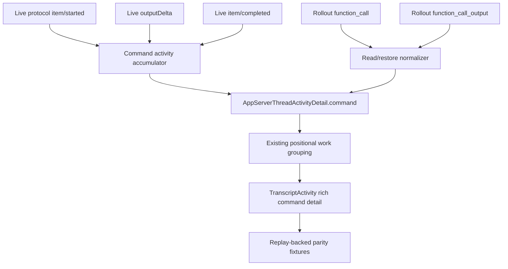
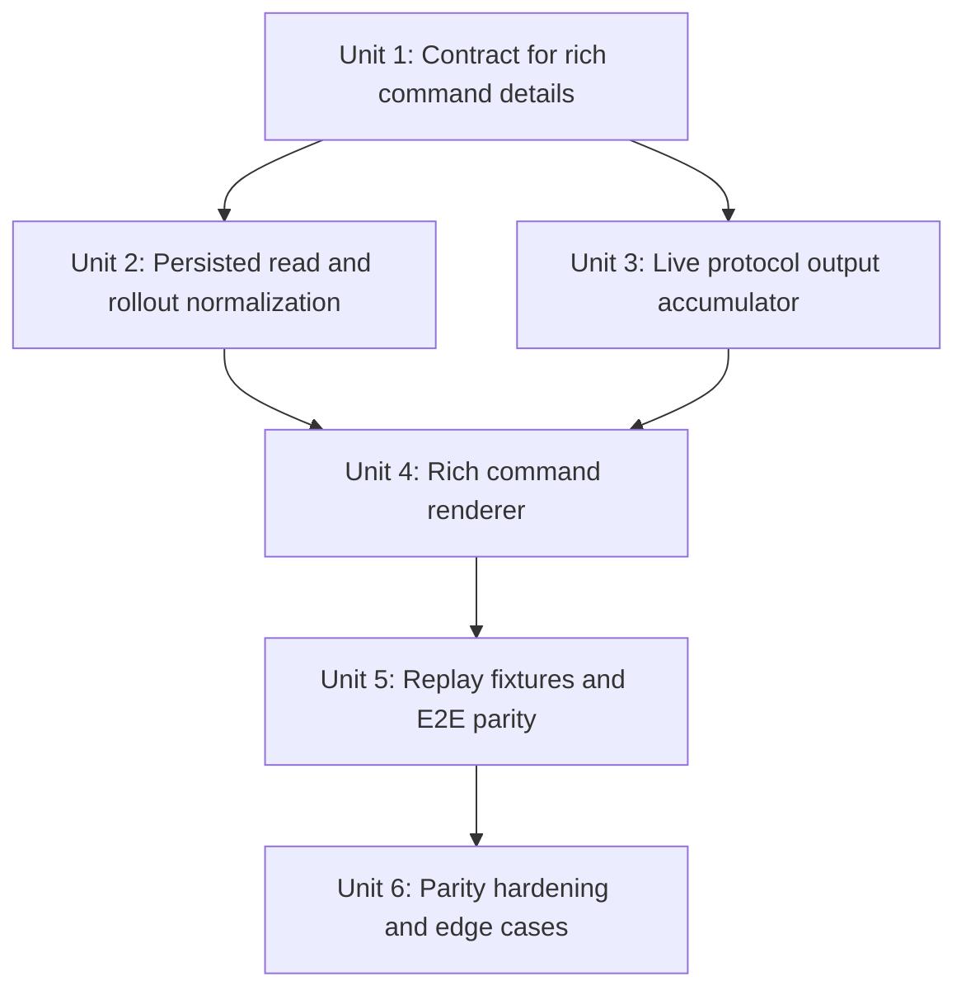

# feat: Add rich command output to transcripts

## Overview

Improve transcript parity with Codex Desktop by preserving and rendering command output as first-class transcript data. The immediate observed failure is thread `019ddaa3-60c1-7160-95f3-14744bdfabb7`: PwrAgnt shows only a single `npm view dive` line, while Codex Desktop exposes a command block with the shell command, captured output, duration, and success state.

The fix should not move transcript items or loosen the ordering work already landed. It should enrich the existing activity entries where command items occur, then render richer command details inside the existing work groups.

## Problem Frame

The protocol and rollout surfaces already contain the missing information, but PwrAgnt currently normalizes command activity down to a summary label:

- The live protocol capture `apps/desktop/.local/protocol-captures/2026-04-29T19-05-24-712Z-codex-full-access.jsonl` includes `item/commandExecution/outputDelta` for `npm view dive`, followed by `item/completed` with `aggregatedOutput`, `exitCode: 0`, and `durationMs: 373`.
- The rollout for the same thread stores the command invocation as a `function_call` and the full captured terminal result as `function_call_output`.
- The post-turn `thread/read` responses for that thread contain only the user message and final assistant answer, so any implementation that treats the final `thread/read` snapshot as complete will erase command output.
- Codex's TUI keeps command output as first-class command-cell state: it appends output deltas by call id, completes the command with `aggregated_output`, and renders the command plus a bounded output preview. Reference repo: `codex`; relevant files include `codex-rs/tui/src/exec_cell/model.rs`, `codex-rs/tui/src/exec_cell/render.rs`, and `codex-rs/tui/src/chatwidget.rs`.
- This continues the broader protocol-parity direction from `docs/brainstorms/2026-04-19-codex-desktop-protocol-parity-requirements.md` while narrowing the implementation target to rich command transcript data and rendering.

## Requirements Trace

- R1. Preserve command output from live protocol notifications, including output deltas, aggregated output, exit code, duration, status, cwd, and display command.
- R2. Preserve command output when restoring from rollout files, especially `function_call` plus `function_call_output` pairs.
- R3. Keep command activity anchored at the exact transcript position where the command item occurred; enriching output must not reorder work groups, final replies, or messages.
- R4. Render command details in a Codex-like command block: command line, shell/source label where useful, bounded output preview, status, duration, and a way to inspect more output when truncated.
- R5. Keep collapsed completed work groups collapsed by default; rich output is revealed when the user expands the relevant work group and command detail.
- R6. Add regression fixtures and tests based on `019ddaa3-60c1-7160-95f3-14744bdfabb7` so live protocol replay and rollout restoration both prove the same ordering and richness.
- R7. Degrade safely when output is missing, huge, binary-like, or only available as final aggregated output without streamed deltas.

## Scope Boundaries

- This plan does not redesign transcript ordering. It assumes the current positional grouping rules remain the source of truth.
- This plan does not require pixel-perfect Codex Desktop visuals. The target is behavioral parity and a comparable inspection affordance using PwrAgnt's desktop style.
- This plan does not make `thread/read` the sole source of transcript truth. It explicitly treats live protocol capture and rollout restoration as required sources for command details that `thread/read` can omit.
- This plan does not add arbitrary terminal emulation. Output should be rendered as text with ANSI handling or safe plain-text fallback, not as a live pseudo-terminal.
- This plan does not expose absolute local paths in persisted replay fixtures beyond existing fixture conventions.

## Context & Research

### Relevant Code and Patterns

- `packages/shared/src/contracts/normalized-app-server.ts` defines `AppServerThreadActivityDetail`; today it has `label`, `status`, and optional `fileDiff`, but no structured command output field.
- `apps/desktop/src/main/codex-app-server/client.ts` normalizes `commandExecution` and `function_call` items into activity details. It currently formats commands as labels and drops `aggregatedOutput` and `function_call_output` content.
- `apps/desktop/src/main/app-server/thread-activity.ts` provides shared activity summarization patterns for app-server tool items and should stay aligned with Codex/Grok normalization.
- `apps/desktop/src/renderer/src/features/thread-detail/ThreadView.tsx` builds live pending tool activity from `item/started`, `item/completed`, and related notifications. It does not currently merge `item/commandExecution/outputDelta` into the command detail.
- `apps/desktop/src/renderer/src/features/thread-detail/TranscriptActivity.tsx` renders activity details and diffs. It is the natural place to add a rich command detail component, not to overload `TranscriptDiff`.
- `apps/desktop/src/renderer/src/features/thread-detail/TranscriptWorkPhaseGroup.tsx`, `TranscriptList.tsx`, and `transcript-render-items.ts` already own grouping and collapse behavior; rich command output should work within that model.
- `apps/desktop/e2e/fixtures/transcript-activity-order/` provides the existing replay-backed fixture pattern for transcript ordering.
- Existing tests in `apps/desktop/src/main/__tests__/codex-client.test.ts`, `apps/desktop/src/main/__tests__/grok-app-server-client.test.ts`, `apps/desktop/src/renderer/src/features/thread-detail/__tests__/thread-view.test.tsx`, `apps/desktop/src/renderer/src/features/thread-detail/__tests__/transcript-list.test.tsx`, and `apps/desktop/e2e/transcript-activity-order.spec.ts` cover adjacent behavior.

### Institutional Learnings

- No `docs/solutions/` directory exists in this worktree, so there are no durable solution notes to carry forward.
- Recent transcript work established that ordering must be event-position based, not timestamp-only sorting or end-of-turn collection.
- Recent collapse work established that completed work groups collapse by default, even if live overlay state is still present.

### External References

- Codex reference repo `codex`: `codex-rs/app-server/src/bespoke_event_handling.rs` emits `CommandExecution` start/completion notifications with `aggregated_output`.
- Codex reference repo `codex`: `codex-rs/tui/src/exec_cell/model.rs` models command output separately from the command label.
- Codex reference repo `codex`: `codex-rs/tui/src/exec_cell/render.rs` renders bounded command output with head/tail truncation and an omitted-lines marker.
- Codex reference repo `codex`: `codex-rs/tui/src/chatwidget.rs` routes output deltas and completed output by call id.

## Key Technical Decisions

- **Extend the normalized activity contract instead of encoding output in labels.** Labels are for summaries; command output needs structured fields so the renderer can truncate, copy, expand, and test it without parsing display text.
- **Use call id as the merge key.** Live `item/started`, `item/commandExecution/outputDelta`, `item/completed`, rollout `function_call`, and rollout `function_call_output` all identify the same command by item id or call id. The pipeline should merge by that key.
- **Preserve item position, enrich in place.** Command output belongs to the command activity entry where the command item occurred. Final `thread/read` snapshots may confirm messages, but they must not erase live command detail just because the read result omitted command items.
- **Render bounded previews by default.** Full command output can be large. The UI should show a compact, useful preview first and provide expansion or a details view for full output.
- **Keep backend normalization and renderer rendering separate.** Main-process normalization should preserve structured output, status, and duration; the renderer should decide how to present and truncate it.

## Open Questions

### Resolved During Planning

- **Does the protocol capture contain the richer command output?** Yes. The capture contains an output delta and a completed `commandExecution` item with `aggregatedOutput`, `exitCode`, and `durationMs`.
- **Does rollout restoration contain enough output for this thread?** Yes. The rollout contains `function_call` plus `function_call_output` with the full `npm view dive` output.
- **Can `thread/read` alone restore this richness?** No. The observed post-turn `thread/read` result for the target thread contains only the user message and final assistant answer.
- **Should rich command output change completed group collapse behavior?** No. Completed groups stay collapsed by default.

### Deferred to Implementation

- Exact output size thresholds and truncation counts should be tuned while implementing against the existing desktop layout.
- Whether ANSI coloring is preserved or stripped can be decided after checking current CSS and renderer safety; plain text is acceptable for the first pass.
- Whether full output opens inline or in a modal/panel can be decided during UI implementation, as long as the collapsed transcript remains compact and inspectable.

## High-Level Technical Design

> This illustrates the intended approach and is directional guidance for review, not implementation specification. The implementing agent should treat it as context, not code to reproduce.

The important invariant is that `A` is attached to the same activity entry position that the command item already occupies. Output enrichment should never be implemented as a later synthetic transcript row unless the original command position is unavailable.

## Implementation Units

- [x] **Unit 1: Add a structured command-output activity contract**

**Goal:** Extend the normalized transcript activity model so a command detail can carry command metadata and output without overloading the display label.

**Requirements:** R1, R2, R4, R7

**Dependencies:** None

**Files:**
- Modify: `packages/shared/src/contracts/normalized-app-server.ts`
- Modify: `apps/desktop/src/main/app-server/thread-activity.ts`
- Modify: `apps/desktop/src/main/__tests__/codex-client.test.ts`
- Modify: `apps/desktop/src/main/__tests__/grok-app-server-client.test.ts`

**Approach:**
- Add an optional structured field to `AppServerThreadActivityDetail` for command execution display data. It should cover display command, raw command when different, cwd when available, output text, exit code, duration, and source/status metadata.
- Keep `label` as a compact fallback and accessibility summary. Do not require every command detail to have output.
- Prefer a shape that can also represent `function_call_output` restored from rollout and Grok command/tool results, even if Grok does not fill every field initially.
- Keep existing file diff details unchanged.

**Execution note:** Start with characterization tests for the contract shape before changing renderer behavior.

**Patterns to follow:**
- `AppServerThreadActivityDetail.fileDiff` in `packages/shared/src/contracts/normalized-app-server.ts`
- `summarizeActivityItems` in `apps/desktop/src/main/app-server/thread-activity.ts`

**Test scenarios:**
- Happy path: a command detail with output, exit code `0`, and duration still has the existing label and now carries structured command output.
- Happy path: a command detail without output remains valid and renders through the existing label path.
- Edge case: a failed command can carry non-zero exit code and output without changing the top-level activity type.
- Integration: Codex and Grok normalization tests compile against the shared contract without needing renderer-specific fields.

**Verification:**
- The shared transcript contract can represent the `npm view dive` command, output, duration, and success state as data rather than label text.

- [x] **Unit 2: Normalize persisted command output from `thread/read` and rollout items**

**Goal:** Preserve command output when reading completed threads from app-server snapshots or rollout-style response items.

**Requirements:** R2, R3, R6, R7

**Dependencies:** Unit 1

**Files:**
- Modify: `apps/desktop/src/main/codex-app-server/client.ts`
- Modify: `apps/desktop/src/main/__tests__/codex-client.test.ts`
- Modify: `apps/desktop/src/main/grok-app-server/client.ts`
- Modify: `apps/desktop/src/main/__tests__/grok-app-server-client.test.ts`
- Create or update: `apps/desktop/e2e/fixtures/transcript-command-output/`

**Approach:**
- Teach the Codex normalizer to pair `function_call` items with later `function_call_output` items by call id before summarizing the pending activity group.
- Preserve `commandExecution.aggregatedOutput`, `exitCode`, `durationMs`, `cwd`, and `commandActions` when present in app-server `thread/read` items.
- Treat missing command items in final `thread/read` as incomplete, not authoritative erasure, when live or fixture data has already captured richer command detail.
- Keep item flushing positional: a command followed by an assistant message must remain before that assistant message after enrichment.
- Mirror the same command-output contract in Grok restore paths where command output is available.

**Patterns to follow:**
- `extractActivityItemFromReplayItem` and `summarizeActivityItems` in `apps/desktop/src/main/codex-app-server/client.ts`
- Existing rollout restoration tests in `apps/desktop/src/main/__tests__/grok-app-server-client.test.ts`

**Execution note:** Add characterization tests from the target protocol and rollout snippets before changing the normalizer.

**Test scenarios:**
- Happy path: a `function_call` for `exec_command` followed by matching `function_call_output` becomes one command activity detail with full output.
- Happy path: a `commandExecution` item with `aggregatedOutput` becomes a command activity detail with output and duration.
- Edge case: a `function_call_output` without a matching call id is ignored or represented as an explicit fallback activity without breaking message order.
- Edge case: output that appears after an assistant commentary item does not move above that commentary unless the original command item was before it.
- Integration: target-thread fixture data for `019ddaa3-60c1-7160-95f3-14744bdfabb7` restores `npm view dive` output from rollout-style records.

**Verification:**
- Completed-thread replay entries contain rich command details for `npm view dive` without relying on the assistant's final summary text.

- [x] **Unit 3: Accumulate live command output from protocol notifications**

**Goal:** Merge live `item/started`, `item/commandExecution/outputDelta`, and `item/completed` notifications into one pending command detail that survives final read refreshes.

**Requirements:** R1, R3, R5, R6, R7

**Dependencies:** Unit 1

**Files:**
- Modify: `apps/desktop/src/renderer/src/features/thread-detail/ThreadView.tsx`
- Modify: `apps/desktop/src/renderer/src/features/thread-detail/__tests__/thread-view.test.tsx`
- Modify: `apps/desktop/src/renderer/src/lib/useThreadSessionState.ts`
- Modify: `apps/desktop/src/renderer/src/lib/__tests__/useThreadSessionState.test.tsx`

**Approach:**
- Add live command-output accumulation keyed by command item id or call id.
- On `item/started`, create or update the command detail with command metadata and in-progress status.
- On `item/commandExecution/outputDelta`, append output to the matching detail without creating a separate transcript row.
- On `item/completed`, merge final status, exit code, duration, and aggregated output. Prefer final `aggregatedOutput` when present, but preserve accumulated deltas if the final item lacks output.
- When a final `thread/read` response omits command items, keep the live enriched pending activity until it is safely represented in the transcript entries or deliberately retained as a same-turn overlay in the correct position.

**Patterns to follow:**
- `buildLiveToolDetails`, `mergeActivityDetails`, and pending activity state in `ThreadView.tsx`
- First-seen pending message ordering in `useThreadSessionState.ts`

**Execution note:** Start with a failing live-protocol replay test that reproduces the output appearing and then disappearing after the final read refresh.

**Test scenarios:**
- Happy path: live `npm view dive` start, output delta, completed item, and final assistant answer render a command activity detail with output.
- Happy path: output deltas arriving before `item/completed` are visible when the user expands the active work group.
- Edge case: `item/completed` with `aggregatedOutput` replaces duplicate accumulated delta text instead of doubling output.
- Edge case: `turn/completed` followed by `thread/read` that omits command items does not erase the rich command detail.
- Integration: command output remains below/above the same neighboring messages it had during live protocol replay.

**Verification:**
- The live target-thread sequence produces an inspectable `npm view dive` command block before the final assistant summary, and that block remains after the final read refresh.

- [x] **Unit 4: Render rich command details in the transcript UI**

**Goal:** Replace the one-line command detail with an inspectable command block inside activity details.

**Requirements:** R4, R5, R7

**Dependencies:** Units 1, 2, and 3

**Files:**
- Modify: `apps/desktop/src/renderer/src/features/thread-detail/TranscriptActivity.tsx`
- Create: `apps/desktop/src/renderer/src/features/thread-detail/TranscriptCommandOutput.tsx`
- Create: `apps/desktop/src/renderer/src/features/thread-detail/__tests__/transcript-command-output.test.tsx`
- Modify: `apps/desktop/src/renderer/src/features/thread-detail/__tests__/transcript-list.test.tsx`
- Modify: `apps/desktop/src/renderer/src/styles.css`

**Approach:**
- Add a dedicated command-output renderer for details that carry command data.
- Display a compact header using the existing activity detail label plus status and duration.
- Show the command line and a bounded output preview using a monospace block. Preserve readable whitespace and wrap long lines safely.
- Add an affordance to expand truncated output. The first pass can keep this inline within the expanded activity detail.
- Keep completed work groups collapsed by default; the user expands the work group first, then sees the richer command detail.
- Apply the desktop style guide: dense, utilitarian, no decorative card nesting, stable dimensions, and no marketing copy.

**Patterns to follow:**
- `TranscriptDiff.tsx` for structured detail rendering within an activity item
- `TranscriptActivity.tsx` for collapsible activity behavior
- Codex reference repo `codex`: `codex-rs/tui/src/exec_cell/render.rs` for bounded head/tail output preview behavior

**Test scenarios:**
- Happy path: a command detail with output renders command text and output preview after expanding the activity.
- Happy path: a successful command shows a success state and duration without changing the activity summary.
- Edge case: empty output renders a concise no-output state only when the command detail is expanded.
- Edge case: very long output is truncated with an explicit omitted-lines or omitted-content indicator and can be expanded.
- Edge case: long URLs and long unbroken tokens do not overflow their container.
- Accessibility: command detail toggles expose stable accessible names and expanded/collapsed state.

**Verification:**
- The screenshot scenario no longer shows only `npm view dive (373ms)`; expanding the relevant activity reveals a shell-like command block with the captured `dive@0.5.0` output.

- [x] **Unit 5: Add replay-backed fixtures and E2E coverage for protocol and rollout parity**

**Goal:** Make the target regression reproducible at the fixture and E2E layers.

**Requirements:** R3, R5, R6

**Dependencies:** Units 2, 3, and 4

**Files:**
- Create: `apps/desktop/e2e/fixtures/transcript-command-output/raw.protocol.jsonl`
- Create: `apps/desktop/e2e/fixtures/transcript-command-output/raw.rollout.jsonl`
- Create: `apps/desktop/e2e/fixtures/transcript-command-output/replay.fixture.json`
- Create: `apps/desktop/e2e/transcript-command-output.spec.ts`
- Modify: `apps/desktop/e2e/fixtures/README.md`

**Approach:**
- Derive a small protocol snippet from `019ddaa3-60c1-7160-95f3-14744bdfabb7` that includes user input, command start, output delta, command completed, final assistant message, turn completion, and final `thread/read` omission.
- Derive a matching rollout snippet containing `function_call` and `function_call_output`.
- Build a replay fixture that proves both sources normalize to the same transcript shape.
- In E2E, assert that completed work is collapsed initially, then expands to show the command block and output.
- Assert ordering relative to the final assistant message and MCP status group so this does not regress the previous ordering fixes.

**Patterns to follow:**
- `apps/desktop/e2e/fixtures/transcript-activity-order/replay.fixture.json`
- `apps/desktop/e2e/transcript-activity-order.spec.ts`
- `.agents/skills/desktop-e2e-fixture-seeding/SKILL.md`

**Execution note:** Seed the fixture as a regression first; it should fail on the current one-line command rendering before the rich command work lands.

**Test scenarios:**
- Happy path: protocol replay renders `npm view dive` with output containing `dive@0.5.0`.
- Happy path: rollout replay renders the same command output even when `thread/read` lacks command items.
- Edge case: final `thread/read` omission does not remove the command output after the turn completes.
- Integration: command block remains in the same work group position and does not move above user input or below the final assistant message incorrectly.

**Verification:**
- Replay-backed E2E fails on the current single-line behavior and passes only when command output is inspectable from both protocol and rollout restoration paths.

- [x] **Unit 6: Harden truncation, copying, and failure presentation**

**Goal:** Round out command output inspection so it behaves well for real-world command output beyond the `npm view dive` case.

**Requirements:** R4, R7

**Dependencies:** Unit 4

**Files:**
- Modify: `apps/desktop/src/renderer/src/features/thread-detail/TranscriptCommandOutput.tsx`
- Modify: `apps/desktop/src/renderer/src/features/thread-detail/__tests__/transcript-command-output.test.tsx`
- Modify: `apps/desktop/src/renderer/src/styles.css`

**Approach:**
- Add copy affordances for command text and output if the existing desktop UI patterns support it.
- Ensure failure state is visually distinguishable without relying only on color.
- Cap memory/rendering cost for huge output. Store full output in state if already available, but render only a bounded preview until expanded.
- Treat binary-like or control-heavy output defensively by replacing unsafe control characters and preserving newlines.
- Keep the component usable at narrow desktop widths.

**Patterns to follow:**
- Existing icon/button styling in thread-detail components
- Existing transcript diff overflow and zoom behavior in `TranscriptDiff.tsx`

**Test scenarios:**
- Happy path: copy command copies only the display command, not the full output.
- Happy path: copy output copies the full captured output when present.
- Edge case: failed command with stderr-like output shows failed state and output.
- Edge case: output with ANSI/control sequences does not break rendering or inject markup.
- Edge case: large output remains performant and does not expand the transcript unexpectedly while collapsed.

**Verification:**
- Rich command output is useful for common shell commands, failures, long output, and small viewports without making transcripts noisy by default.

## System-Wide Impact

- **Interaction graph:** Codex app-server notifications, rollout restoration, shared normalized contracts, renderer pending state, transcript grouping, and E2E replay fixtures all participate in the final transcript shape.
- **Error propagation:** Missing or malformed command output should degrade to the existing command label path. A bad output payload must not block transcript rendering.
- **State lifecycle risks:** The main risk is losing live command output when `turn/completed` triggers a final `thread/read` that omits command items. The implementation must treat command output as overlay state until it is safely merged.
- **API surface parity:** Codex and Grok activity normalization should share the same command-output contract even if Codex has the primary parity requirement.
- **Integration coverage:** Unit tests alone are not enough because the bug spans live notifications, final reads, rollout restoration, and collapse behavior. Replay-backed E2E is required.
- **Unchanged invariants:** Work groups remain positional; completed groups remain collapsed by default; activity summaries remain compact.

## Risks & Dependencies

| Risk | Mitigation |
|------|------------|
| `thread/read` omission erases command output after a turn | Preserve live command detail by call id and test the exact omission sequence from `019ddaa3-60c1-7160-95f3-14744bdfabb7`. |
| Output fields bloat transcript rendering | Store structured output but render bounded previews by default, with expansion only on user action. |
| Rollout `function_call_output` pairing is ambiguous | Pair strictly by call id and add fallback tests for orphan outputs. |
| Rich command UI reintroduces transcript noise | Keep completed groups collapsed and render command blocks only inside expanded activity details. |
| Existing activity tests assume labels only | Update tests to assert labels remain while richer fields and rendering are available. |
| ANSI/control output creates UI issues | Sanitize unsafe control characters and avoid injecting output as HTML. |

## Documentation / Operational Notes

- Update fixture documentation to describe how the protocol and rollout snippets were derived from `019ddaa3-60c1-7160-95f3-14744bdfabb7`.
- No user-facing docs are required for the first pass; this is a transcript fidelity improvement.
- The PR should call out that `thread/read` can omit command items and that the client now preserves richer live/restored command data intentionally.

## Sources & References

- Related requirements: `docs/brainstorms/2026-04-19-codex-desktop-protocol-parity-requirements.md`
- Related prior plan: `docs/plans/2026-04-19-003-fix-codex-desktop-protocol-parity-plan.md`
- Target protocol capture: `apps/desktop/.local/protocol-captures/2026-04-29T19-05-24-712Z-codex-full-access.jsonl`
- Existing ordering fixture: `apps/desktop/e2e/fixtures/transcript-activity-order/replay.fixture.json`
- Shared contract: `packages/shared/src/contracts/normalized-app-server.ts`
- Codex client normalization: `apps/desktop/src/main/codex-app-server/client.ts`
- Grok client normalization: `apps/desktop/src/main/grok-app-server/client.ts`
- Live renderer pipeline: `apps/desktop/src/renderer/src/features/thread-detail/ThreadView.tsx`
- Activity renderer: `apps/desktop/src/renderer/src/features/thread-detail/TranscriptActivity.tsx`
- Codex reference repo `codex`: `codex-rs/tui/src/exec_cell/model.rs`
- Codex reference repo `codex`: `codex-rs/tui/src/exec_cell/render.rs`
- Codex reference repo `codex`: `codex-rs/tui/src/chatwidget.rs`
- Codex reference repo `codex`: `codex-rs/app-server/src/bespoke_event_handling.rs`
