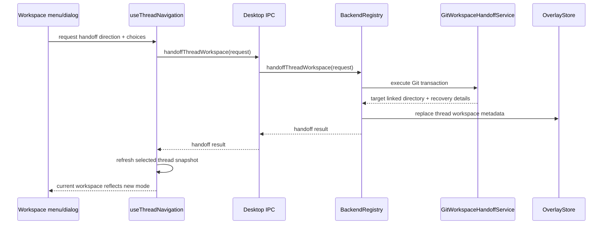
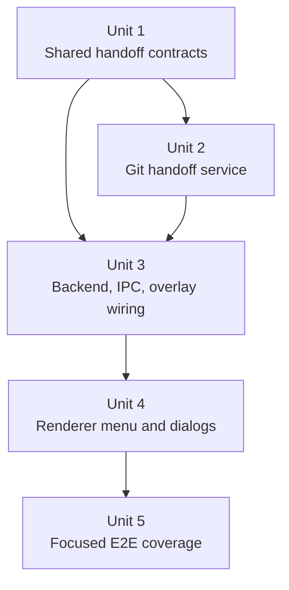

# feat: Add thread workspace handoff

## Overview

Always expose the thread workspace control, not only during new-thread creation, and add explicit handoff actions that move an existing thread between the local checkout and a Git worktree.

The control should show only the current workspace value first, then a separator, then the applicable handoff action:

| Current thread workspace | Current menu value | Action below separator |
|---|---|---|
| Local checkout | `Local (<branch>)` when branch is known, otherwise `Local` | `Handoff to New Worktree` |
| Worktree | `Worktree` | `Handoff to Local` |

Handoff is a real Git state transition. The implementation should treat it as a main-process transaction: capture dirty non-ignored source changes in a named stash when needed, move the branch to the target checkout, apply the source stash on the target, update PwrAgent-owned thread metadata, and report the final workspace clearly.

## Problem Frame

Local/worktree choice currently belongs to directory launchpad/new-thread setup. Existing threads show workspace state as a disabled composer control and expose worktree archive/restore from the context panel, but they do not let a user move active work between the local checkout and a worktree after a thread exists.

The requested product behavior is more direct:

- Local threads should offer `Handoff to New Worktree`.
- Worktree threads should offer `Handoff to Local`.
- Local-to-worktree needs a branch picker for the branch that local should be left on before the original branch is checked out in the new worktree.
- Worktree-to-local should detach the source worktree, move its branch into local, then archive the old worktree.
- Dirty non-ignored source changes should be preserved through a stash-and-apply flow instead of requiring perfectly clean workspaces in the first version.

## Requirements Trace

- R1. The workspace control is always present for existing threads when the thread has a linked Git directory or project key that can support handoff.
- R2. The control presents the current value, a visual separator, and exactly one handoff action appropriate to the current workspace.
- R3. Local-to-worktree handoff lets the user choose the branch to leave in the local checkout before moving the thread's current branch into a new worktree.
- R4. Worktree-to-local handoff moves the worktree branch back into local, leaves the old worktree detached, archives the old worktree, and updates the thread to Local.
- R5. Dirty tracked and untracked non-ignored source changes are preserved by creating a named stash before branch movement and applying that stash in the target checkout.
- R6. The transaction refuses unsafe ambiguous states instead of silently losing work: missing Git metadata, branch conflicts, stash apply conflicts, missing checkouts, and occupied target paths must surface recoverable errors.
- R7. Thread metadata and navigation summaries reflect the new workspace immediately after success.
- R8. Existing worktree archive/restore remains a separate lifecycle feature; handoff may call worktree archive internally after successful worktree-to-local movement, but the user-facing thread is not archived.

## Scope Boundaries

- In scope: existing desktop threads backed by a Git local checkout or Git worktree.
- In scope: Codex and Grok threads as represented through PwrAgent shared contracts and overlay metadata.
- In scope: tracked changes, staged changes, and non-ignored untracked files through `git stash --include-untracked` semantics.
- Out of scope: ignored files such as `node_modules`; they are not stashed and should be called out in completion/error copy when relevant.
- Out of scope: non-Git directories and PwrAgent scratch workspaces without enough Git metadata to move branches safely.
- Out of scope: branch deletion, branch rename, or PR retargeting.
- Out of scope: mutating Codex SQLite, rollout files, or private Codex thread indexes.

## Context & Research

### Relevant Code and Patterns

- `apps/desktop/src/renderer/src/features/composer/Composer.tsx` currently renders launchpad `Workspace mode` as an editable select, while existing threads get a disabled workspace select from `formatThreadWorkspaceLabel`.
- `apps/desktop/src/renderer/src/lib/useThreadNavigation.ts` owns renderer orchestration for materializing launchpads, archiving/restoring worktrees, refreshing snapshots, and surfacing operation errors.
- `apps/desktop/src/main/app-server/backend-registry.ts` is the correct main-process boundary for desktop operations that combine backend, overlay, and Git work.
- `apps/desktop/src/main/app-server/git-directory-service.ts` already reads directory status, branch lists, and creates detached launchpad worktrees under `.worktrees`.
- `apps/desktop/src/main/app-server/worktree-archive-service.ts` already snapshots tracked and untracked worktree state, stores snapshot refs, and removes/restores worktrees.
- `packages/shared/src/contracts/navigation.ts` defines `LaunchpadWorkMode`, `NavigationThreadSummary`, `ThreadOverlayState`, and directory summaries used by the renderer.
- `packages/shared/src/contracts/normalized-app-server.ts` defines `LinkedDirectorySummary`, `ArchiveWorktreeRequest`, `RestoreWorktreeRequest`, and `WorktreeSnapshotSummary`.
- `packages/agent-core/src/persistence/overlay-store.ts` persists desktop-owned thread overlay data, extra linked directories, execution/model settings, and worktree snapshots.
- `packages/agent-core/src/domain/navigation-state.ts` merges backend thread summaries with overlay data before the renderer receives navigation state.
- `apps/desktop/src/main/__tests__/git-directory-service.test.ts`, `apps/desktop/src/main/__tests__/worktree-archive-service.test.ts`, `apps/desktop/src/main/__tests__/backend-registry.test.ts`, `apps/desktop/src/main/__tests__/app-server-ipc.test.ts`, `apps/desktop/src/renderer/src/features/composer/__tests__/composer.test.tsx`, and `apps/desktop/src/renderer/src/lib/__tests__/useThreadNavigation.test.tsx` are the closest existing test patterns.
- `apps/desktop/AGENTS.md`, `docs/UI-THEME.md`, and `docs/design/desktop-style-guide.md` require renderer UI to avoid browser-default controls in shipped UI and to keep the desktop shell dense, calm, and thread-first.

### Institutional Learnings

- `docs/brainstorms/2026-04-16-thread-centric-agent-desktop-requirements.md` establishes that threads are first-class and may link to local and worktree directories.
- `docs/brainstorms/2026-04-19-codex-desktop-protocol-parity-requirements.md` requires anchored thread/worktree identity and forbids silently re-homing a thread just because the same branch exists elsewhere.
- `docs/plans/2026-04-18-001-feat-directories-launchpad-plan.md` introduced launchpad-local work mode selection and overlay-backed draft state; this feature should extend that model to existing threads rather than duplicate it.
- `docs/plans/2026-04-22-003-feat-thread-worktree-archive-restore-plan.md` separated thread archive from worktree archive/restore; handoff should preserve that boundary.
- No `docs/solutions/` directory exists in this worktree yet.

### External References

- None. Git worktree, stash, and branch behavior is well-known, and the repo already has direct local patterns for the relevant desktop IPC, overlay, and Git-service boundaries.

## Key Technical Decisions

- Build handoff as a main-process transaction, not a renderer-side sequence. The operation must coordinate Git branch occupancy, stash refs, worktree creation/removal, and overlay updates atomically enough to be recoverable.
- Use named, implementation-owned stashes for dirty non-ignored source changes. Stashing keeps the first version useful for active work while preserving a clear recovery artifact if applying the stash fails.
- Apply stashes with an apply-then-drop policy, not a pop policy. The stash should remain available until the target checkout is verified to contain the expected changes and the overlay update has succeeded.
- Apply source stashes only after the branch is checked out in the target workspace. This keeps dirty source changes attached to the same logical branch after movement.
- Split handoff into an explicit preflight phase and a mutation phase. Preflight should resolve repository root, primary checkout, registered worktrees, branch occupancy, branch choices, default-branch fallback, source dirtiness, destination dirtiness, and target path availability before creating any stash or changing checkout state.
- Treat destination checkout dirtiness conservatively. For local-to-worktree the target is newly created and should be clean. For worktree-to-local, if the local checkout has dirty non-ignored changes, create a separate named local-protection stash before switching branches; do not auto-apply that protection stash onto the moved branch because it belongs to the branch local was leaving.
- Add explicit handoff contracts instead of overloading launchpad materialization or worktree archive/restore contracts. Handoff has different preconditions, progress, and errors.
- Update PwrAgent overlay metadata after Git succeeds. Backend-owned thread identity stays the same; PwrAgent's navigation overlay records the new linked directory relationship so the UI reflects Local or Worktree without mutating Codex private state.
- Keep worktree-to-local archive cleanup internal to the successful handoff flow. If branch movement or stash application fails, do not archive/remove the source worktree.
- Use a custom menu/popover for the workspace control. Native selects cannot reliably render the requested separator/action structure and conflict with the desktop UI guidance against browser-default controls.

## Open Questions

### Resolved During Planning

- Should dirty source changes block the initial version? No. Preserve tracked, staged, and non-ignored untracked changes with a named stash and apply it in the target checkout.
- Should ignored files be preserved? No. Git stash with non-ignored untracked files does not preserve ignored files, and this feature should not add filesystem backup semantics.
- Should handoff mutate Codex private files? No. Use PwrAgent overlay metadata for desktop navigation and supported backend contracts for thread identity.
- Should worktree archive remain available independently? Yes. Handoff can reuse the service internally, but archive/restore remains separate user-facing lifecycle behavior.
- Should Local-to-Worktree use the launchpad detached-worktree pattern? No. Existing thread handoff is branch-moving behavior, not detached scratch creation; the target worktree should check out the moved branch so subsequent work stays on that branch.

### Deferred to Implementation

- Exact stash naming format and retention policy after successful application: implementation should choose a deterministic label that includes backend, thread id, direction, branch, and timestamp, then drop only stashes it proves were applied successfully.
- Exact branch fallback when the local checkout currently sits on the repository default branch and the user is moving that default branch to a worktree: implementation should offer available local branches and, if needed, a detached fallback option with explicit dialog copy.
- Exact completion copy and conflict recovery affordance: implementation should settle copy once the error objects expose enough structured detail.

## High-Level Technical Design

> *This illustrates the intended approach and is directional guidance for review, not implementation specification. The implementing agent should treat it as context, not code to reproduce.*

## Implementation Units

- [x] **Unit 1: Add shared handoff contracts and overlay mutation support**

**Goal:** Define the handoff request/response shape and add overlay-store support for replacing a thread's active workspace metadata.

**Requirements:** R1, R2, R6, R7

**Dependencies:** None

**Files:**
- Modify: `packages/shared/src/contracts/normalized-app-server.ts`
- Modify: `packages/shared/src/contracts/agent.ts`
- Modify: `packages/shared/src/contracts/navigation.ts`
- Modify: `apps/desktop/src/shared/ipc.ts`
- Modify: `packages/agent-core/src/persistence/overlay-store.ts`
- Modify: `packages/agent-core/src/persistence/migrations.ts`
- Modify: `packages/agent-core/src/domain/navigation-state.ts`
- Test: `packages/agent-core/src/__tests__/overlay-store.test.ts`
- Test: `packages/agent-core/src/__tests__/directory-navigation.test.ts`

**Approach:**
- Add a `ThreadWorkspaceHandoffDirection` style contract with `local-to-worktree` and `worktree-to-local`.
- Include request fields for backend, thread id, repository path, source worktree/local path, source branch, selected local-leave branch for local-to-worktree, and optional user confirmation flags for dirty-workspace handling.
- Include response fields for final work mode, final linked directory summary, branch, target path, created worktree path when applicable, archived source worktree snapshot when applicable, stash outcomes, protection-stash outcomes, and warnings.
- Add overlay-store functionality to replace the effective active linked directory for a thread while preserving unrelated extra linked directories and worktree snapshots.
- Keep metadata additive and PwrAgent-owned; do not remove backend-provided historical information unless the overlay helper owns that exact relationship.

**Patterns to follow:**
- `packages/shared/src/contracts/normalized-app-server.ts`
- `packages/shared/src/contracts/navigation.ts`
- `packages/agent-core/src/persistence/overlay-store.ts`
- `packages/agent-core/src/domain/navigation-state.ts`

**Test scenarios:**
- Happy path: replacing a local linked directory with a worktree linked directory makes the materialized navigation thread report `Worktree`.
- Happy path: replacing a worktree linked directory with a local linked directory makes the materialized navigation thread report `Local (<branch>)` when branch metadata is present.
- Edge case: existing worktree snapshots remain attached after replacing the linked directory metadata.
- Edge case: unrelated extra linked directories for a multi-directory thread are preserved.
- Error path: invalid handoff direction or missing required path fields fails contract validation before any Git operation is attempted.

**Verification:**
- Shared contracts describe handoff without reusing archive-thread cleanup fields, and navigation snapshots can reflect the new workspace from overlay data.

- [x] **Unit 2: Implement Git workspace handoff transactions**

**Goal:** Add a focused main-process Git service that can safely move a thread branch between local and worktree checkouts while preserving source dirty state.

**Requirements:** R3, R4, R5, R6, R8

**Dependencies:** Unit 1

**Files:**
- Create: `apps/desktop/src/main/app-server/git-workspace-handoff-service.ts`
- Modify: `apps/desktop/src/main/app-server/git-directory-service.ts`
- Modify: `apps/desktop/src/main/app-server/worktree-archive-service.ts`
- Test: `apps/desktop/src/main/__tests__/git-workspace-handoff-service.test.ts`
- Test: `apps/desktop/src/main/__tests__/git-directory-service.test.ts`
- Test: `apps/desktop/src/main/__tests__/worktree-archive-service.test.ts`

**Approach:**
- Reuse the existing `gitDirectoryService` Git helpers where sensible, but keep handoff as a separate service because it is transactional and branch-state heavy.
- Represent the operation internally as preflight, stash, branch-move, stash-apply, overlay-ready, and cleanup/archive phases. Each phase should return enough detail to explain what happened if a later phase fails.
- Preflight should fail before mutation when required paths, branches, registered worktree entries, default-branch fallback, or target worktree paths are ambiguous or unsafe.
- Local-to-worktree flow:
  - Resolve repository root, local path, current branch, default branch, branch list, and dirty non-ignored status.
  - If source local has dirty tracked or non-ignored untracked changes, create a named source stash.
  - Switch local to the user-selected leave-local branch or explicit detached fallback.
  - Create a new worktree under the repository `.worktrees` convention and check out the moved branch there.
  - Apply, verify, then drop the source stash in the new worktree; retain recovery details and leave the stash in place if conflicts occur.
- Worktree-to-local flow:
  - Resolve repository root, local checkout path, source worktree path, worktree branch, and dirty non-ignored status.
  - If source worktree has dirty tracked or non-ignored untracked changes, create a named source stash from the worktree.
  - If local has dirty non-ignored changes, create a named local-protection stash before switching branches and surface it in the response.
  - Detach the source worktree so the branch can be checked out in local.
  - Check out the source branch in local, then apply, verify, and drop the source stash there.
  - Archive/remove the old worktree only after the branch checkout and source stash application succeed.
- Refuse branch movement when Git reports that another worktree still has the target branch checked out and the service cannot resolve that occupancy safely.
- Return structured recovery information for stash apply conflicts, checkout failures, and archive failures.

**Execution note:** Start with real temporary Git repository tests because branch occupancy and stash behavior are easy to get subtly wrong with mocks.

**Patterns to follow:**
- `apps/desktop/src/main/app-server/git-directory-service.ts`
- `apps/desktop/src/main/app-server/worktree-archive-service.ts`
- `apps/desktop/src/main/__tests__/worktree-archive-service.test.ts`

**Test scenarios:**
- Happy path: local on `feature`, clean workspace, leave local on `main` -> new worktree checks out `feature`, local is on `main`.
- Happy path: local on `main`, user selects detached fallback -> new worktree checks out `main`, local is detached at the selected fallback commit.
- Happy path: local source has modified tracked file and non-ignored untracked file -> both appear in the new worktree after handoff.
- Happy path: after a clean stash application, the source stash is dropped only after target verification succeeds.
- Happy path: worktree on `feature`, clean workspace, local clean -> local checks out `feature`, source worktree is archived/removed.
- Happy path: worktree source has dirty tracked and non-ignored untracked changes -> both appear in local after handoff.
- Edge case: ignored files in source do not appear in target, and the result warns that ignored files were excluded.
- Edge case: local checkout has dirty changes during worktree-to-local -> local-protection stash is created and reported, while source stash applies to the moved branch.
- Error path: stash apply conflict leaves the target checkout in place, does not archive/remove the source worktree, and returns the stash ref for recovery.
- Error path: checkout preflight detects target branch occupancy in another registered worktree and fails before creating a stash.
- Error path: selected leave-local branch is the same branch being moved and no detached fallback was chosen -> operation fails before stashing.
- Error path: target branch is checked out in a third worktree -> operation fails before mutating source state.

**Verification:**
- Temporary-repo tests prove the service preserves source changes, respects Git branch occupancy, and only removes/archives a source worktree after successful branch movement.

- [x] **Unit 3: Wire handoff through backend registry, IPC, preload, and navigation refresh**

**Goal:** Expose handoff as a desktop operation and update thread navigation state after successful Git movement.

**Requirements:** R1, R6, R7, R8

**Dependencies:** Units 1 and 2

**Files:**
- Modify: `apps/desktop/src/main/app-server/backend-registry.ts`
- Modify: `apps/desktop/src/main/ipc/app-server.ts`
- Modify: `apps/desktop/src/main/ipc/agent-ipc.ts`
- Modify: `apps/desktop/src/preload/index.ts`
- Modify: `apps/desktop/src/renderer/src/lib/desktop-api.ts`
- Modify: `apps/desktop/src/renderer/src/lib/useThreadNavigation.ts`
- Test: `apps/desktop/src/main/__tests__/backend-registry.test.ts`
- Test: `apps/desktop/src/main/__tests__/app-server-ipc.test.ts`
- Test: `apps/desktop/src/main/__tests__/agent-ipc.test.ts`
- Test: `apps/desktop/src/renderer/src/lib/__tests__/useThreadNavigation.test.tsx`

**Approach:**
- Add `handoffThreadWorkspace` to the desktop API surface parallel to archive/restore worktree operations.
- Have `BackendRegistry` resolve the current thread summary and candidate linked directory before calling the Git service, so the service receives concrete paths and branch metadata.
- After Git succeeds, update overlay linked-directory metadata to represent the new active workspace and upsert any archived worktree snapshot from worktree-to-local.
- Refresh the selected thread after success, preserving optimistic selection behavior similar to launchpad materialization and worktree restore.
- Keep errors in the same renderer state family as workspace/worktree errors so users see the failure near the control that caused it.

**Patterns to follow:**
- `apps/desktop/src/main/app-server/backend-registry.ts`
- `apps/desktop/src/main/ipc/app-server.ts`
- `apps/desktop/src/preload/index.ts`
- `apps/desktop/src/renderer/src/lib/useThreadNavigation.ts`

**Test scenarios:**
- Happy path: IPC request for local-to-worktree reaches the registry with backend, thread id, selected leave-local branch, and source directory metadata.
- Happy path: successful registry handoff updates overlay metadata and returns final workspace summary.
- Happy path: renderer handoff callback refreshes the selected thread and keeps selection on the same thread id.
- Edge case: thread has no eligible Git linked directory -> registry returns a recoverable unavailable error.
- Error path: Git service throws a stash conflict error -> renderer surfaces the message and does not mutate optimistic thread state.
- Integration: worktree-to-local response containing an archived source snapshot is persisted so the context panel can still show archive/restore history for the old worktree.

**Verification:**
- The operation is callable from renderer to main through typed preload contracts, and navigation refresh shows the moved thread in its new workspace mode.

- [x] **Unit 4: Replace the existing-thread workspace select with a handoff menu and dialogs**

**Goal:** Make workspace handoff visible and usable from the composer/control area for existing threads while preserving launchpad behavior.

**Requirements:** R1, R2, R3, R4, R6, R7

**Dependencies:** Unit 3

**Files:**
- Modify: `apps/desktop/src/renderer/src/features/composer/Composer.tsx`
- Modify: `apps/desktop/src/renderer/src/features/thread-detail/ThreadView.tsx`
- Modify: `apps/desktop/src/renderer/src/App.tsx`
- Modify: `apps/desktop/src/renderer/src/styles/app.css`
- Test: `apps/desktop/src/renderer/src/features/composer/__tests__/composer.test.tsx`
- Test: `apps/desktop/src/renderer/src/features/thread-detail/__tests__/thread-view.test.tsx`

**Approach:**
- Keep launchpad `Workspace mode` editing behavior intact for unsent directory launchpads.
- For existing threads, replace the disabled native workspace select with a custom menu button/popover that can render:
  - one disabled/current value row
  - a visible separator
  - one enabled handoff action row
- For local threads, action opens a confirmation dialog with a branch picker for where to leave local. Default to the repository default branch when it is not the branch being moved; otherwise require the user to pick another branch or explicit detached fallback.
- For worktree threads, action opens a confirmation dialog explaining that the branch will move to local, dirty source changes will be stashed and applied in local, and the old worktree will be archived after success.
- Show structured warnings for dirty source changes, ignored files not preserved, and local-protection stash creation.
- Disable handoff while a turn is actively running, while a pending approval/user-input request blocks the thread, or while another workspace operation is in flight.
- Use the existing desktop theme tokens, compact control sizing, and tooltip patterns rather than adding a large modal or marketing-style explanation.

**Patterns to follow:**
- `apps/desktop/src/renderer/src/features/composer/Composer.tsx`
- `apps/desktop/src/renderer/src/features/thread-detail/ThreadView.tsx`
- `apps/desktop/src/renderer/src/styles/app.css`
- `docs/UI-THEME.md`
- `docs/design/desktop-style-guide.md`

**Test scenarios:**
- Happy path: existing local thread menu shows `Local (feature)`, separator, and `Handoff to New Worktree`.
- Happy path: existing worktree thread menu shows `Worktree`, separator, and `Handoff to Local`.
- Happy path: clicking local handoff action opens a dialog with eligible leave-local branch options and submits the selected branch.
- Happy path: clicking worktree handoff action opens a dialog and submits the worktree-to-local request.
- Edge case: branch list is unavailable -> local-to-worktree action is disabled with an explanatory tooltip or inline error.
- Edge case: thread has no eligible Git directory -> workspace value is visible but handoff action is unavailable.
- Error path: handoff request rejects -> dialog remains open or error is shown near the control without clearing the user's chosen branch.
- Accessibility: menu button, menu items, separator, dialog title, and confirmation buttons have stable accessible names and keyboard behavior.

**Verification:**
- Existing-thread workspace control is actionable, launchpad workspace selection still works, and the UI matches the requested current-value/separator/action structure.

- [ ] **Unit 5: Add end-to-end and regression coverage for handoff flows**

**Goal:** Cover the multi-layer behavior that unit tests cannot fully prove, especially visible menu state and navigation refresh after handoff.

**Requirements:** R1, R2, R3, R4, R5, R7, R8

**Dependencies:** Units 1-4

**Files:**
- Create: `apps/desktop/e2e/thread-workspace-handoff.spec.ts`
- Modify: `apps/desktop/e2e/fixtures/smoke/replay.fixture.json` or create a dedicated fixture if replay coverage is needed
- Test: `apps/desktop/e2e/thread-workspace-handoff.spec.ts`

**Approach:**
- Add focused desktop E2E coverage for the renderer-visible state transitions. Prefer replay-backed coverage for menu/dialog affordances and targeted live temporary-repo coverage only where actual Git movement is needed.
- Use the project-local desktop fixture seeding workflow only if a new replay fixture is required.
- Keep E2E assertions at the user-observable boundary: menu rows, dialog branch choices, completion state, and final workspace label.

**Patterns to follow:**
- `apps/desktop/e2e/directory-launchpad-workspace.spec.ts`
- `apps/desktop/e2e/thread-row-status.spec.ts`
- `apps/desktop/e2e/fixtures/electron-app.ts`
- `.agents/skills/desktop-e2e-fixture-seeding/SKILL.md`

**Test scenarios:**
- Happy path: a local-backed thread exposes `Handoff to New Worktree`, completes the handoff, and then shows `Worktree`.
- Happy path: a worktree-backed thread exposes `Handoff to Local`, completes the handoff, and then shows `Local (<branch>)`.
- Integration: after worktree-to-local handoff, the context panel no longer treats the active workspace as a worktree but still shows old worktree snapshot/archive metadata when returned by the backend.
- Error path: simulated handoff failure leaves the visible workspace value unchanged and displays a recoverable error.
- Regression: launchpad `Workspace mode` still allows `Local` and `New worktree` selection before thread materialization.

**Verification:**
- Desktop E2E coverage proves the visible workflow survives full renderer/main/preload integration and does not regress launchpad workspace selection.

## System-Wide Impact

- **Interaction graph:** The feature crosses `Composer`, `ThreadView`, `useThreadNavigation`, preload IPC, `BackendRegistry`, Git services, and overlay-store navigation materialization.
- **Error propagation:** Git and stash failures should propagate as structured recoverable errors to the handoff dialog/control, not as generic app crashes or silent refresh failures.
- **State lifecycle risks:** Handoff may leave named stashes, detached source worktrees, or partially moved branches if a Git operation fails. Every failure after mutation must return enough recovery detail for the UI and logs.
- **API surface parity:** Renderer, preload, main IPC, shared contracts, and tests all need the same handoff request/response fields.
- **Integration coverage:** Unit tests can prove Git mechanics; renderer and E2E tests must prove the visible current-value/separator/action control and post-refresh workspace label.
- **Unchanged invariants:** Thread ids, transcripts, backend ownership, model/access settings, thread archive state, and independent worktree archive/restore behavior remain unchanged by handoff.

## Risks & Dependencies

| Risk | Mitigation |
|------|------------|
| Stash apply conflicts leave the operation half-finished. | Return source stash ref and target path, do not archive/remove the source worktree after failed apply, and keep UI state recoverable. |
| Git branch occupancy rules block checkout in the target. | Detach or switch the source checkout before checking out the branch in the target; detect third-worktree occupancy before mutating. |
| A stash is dropped before the target state is proven. | Use apply-then-verify-then-drop semantics; never use pop for handoff stashes. |
| Local dirty changes get incorrectly applied to the moved branch. | Create a separate local-protection stash for destination local dirtiness and do not auto-apply it onto the incoming branch. |
| Overlay metadata diverges from backend-reported linked directories. | Store handoff metadata in PwrAgent overlay only after Git success and materialize it through the existing navigation snapshot merge path. |
| Native select cannot display the requested separator/action menu. | Use a custom menu/popover control for existing threads while leaving launchpad select behavior for this pass unless the implementation naturally extracts a shared control. |
| Worktree-to-local archive accidentally removes the primary checkout. | Reuse or extend `WorktreeArchiveService` guards that refuse to archive primary checkouts. |

## Documentation / Operational Notes

- Add a short user-facing note only if the completion/error surface needs to explain stash recovery or ignored-file exclusion; avoid broad docs churn.
- Developer comments should stay close to the Git transaction code where branch occupancy and stash recovery rules are non-obvious.
- No migration should rewrite existing threads proactively. Handoff metadata is created only when the user performs a handoff.

## Sources & References

- User request in this thread.
- Related requirements: `docs/brainstorms/2026-04-16-thread-centric-agent-desktop-requirements.md`
- Related requirements: `docs/brainstorms/2026-04-19-codex-desktop-protocol-parity-requirements.md`
- Related plan: `docs/plans/2026-04-18-001-feat-directories-launchpad-plan.md`
- Related plan: `docs/plans/2026-04-22-003-feat-thread-worktree-archive-restore-plan.md`
- Related code: `apps/desktop/src/renderer/src/features/composer/Composer.tsx`
- Related code: `apps/desktop/src/renderer/src/lib/useThreadNavigation.ts`
- Related code: `apps/desktop/src/main/app-server/backend-registry.ts`
- Related code: `apps/desktop/src/main/app-server/git-directory-service.ts`
- Related code: `apps/desktop/src/main/app-server/worktree-archive-service.ts`
- Related code: `packages/agent-core/src/persistence/overlay-store.ts`
- Related code: `packages/shared/src/contracts/navigation.ts`
- Related code: `packages/shared/src/contracts/normalized-app-server.ts`
