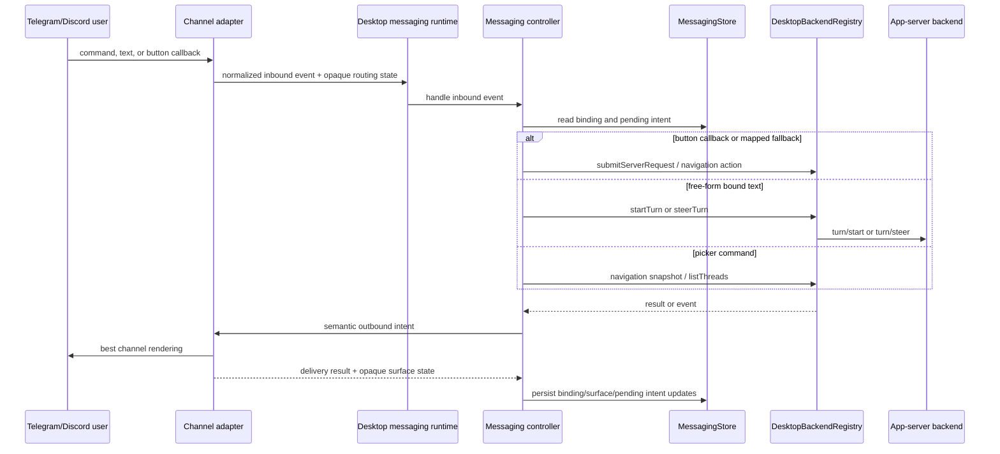
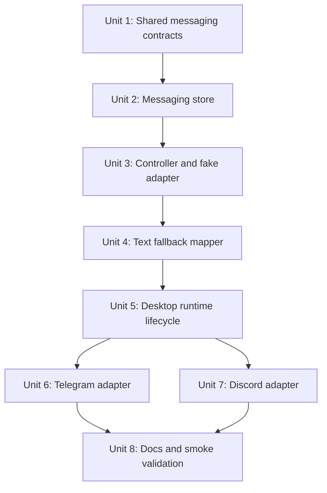
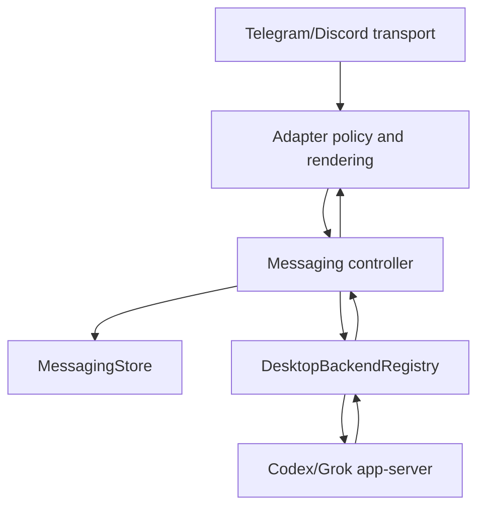

# feat: Add messaging platform integration

## Overview

Add a PwrAgent-owned messaging integration layer that lets Telegram and Discord conversations enumerate projects and threads, bind a channel or DM to a thread, send free-form text into the bound agent thread, and complete rich workflows such as thread/project selection, Plan questionnaires, approvals, status updates, markdown responses, code formatting, images, and button-driven navigation.

The core design is deliberately not a Chat SDK wrapper. PwrAgent should define a semantic conversation surface and channel binding model, then implement Telegram and Discord as direct adapters behind that boundary. The same workflow/controller code must remain reusable for future Mattermost, Feishu/Lark, Slack, Matrix, mobile, or voice-call style adapters (see origin: `docs/brainstorms/2026-04-30-messaging-platform-integration-requirements.md`).

## Problem Frame

The product goal is remote agent control from messaging surfaces, eventually good enough for CarPlay/Siri voice-driven use. That means buttons are helpful but optional: every interactive surface must have a text fallback, and free-form responses during pending interactions must be interpreted against the pending intent before being routed as ordinary agent input.

Existing PwrAgent code already has the agent-side control plane: thread listing, directory/project navigation, `thread/start`, `turn/start`, `turn/steer`, `submitServerRequest`, Plan questionnaires, MCP interactions, markdown, images, and transcript rendering. The missing piece is a channel-agnostic surface controller plus channel adapters that can translate those existing workflows into messaging platforms without leaking platform IDs, callback formats, or markdown dialect rules into workflow logic.

## Requirements Trace

- R1-R6. Define and own a channel-agnostic conversation surface, outbound intent model, inbound event model, opaque adapter state, and best-effort update/dismissal semantics.
- R7-R12. Support project/thread enumeration, new-thread start, channel-to-thread binding, free-form text routing, restart recovery, and detachable/rebindable conversations.
- R13-R17. Prove full workflow parity on Telegram and Discord for rich workflows, including pagination, approvals, questionnaires, markdown, code blocks, images, and long-response handling.
- R18-R22. Provide text fallback and a scoped light mapper that normalizes likely control selections or passes new instructions through to the bound agent thread.
- R23-R27. Start with Telegram and Discord while preserving a contract that can support the broader OpenClaw-style channel set later.
- R28-R30. Do not depend on Vercel Chat SDK for the MVP runtime; keep it as research input only.
- R31-R36. Authorize channel bindings, preserve actor identity and audit context, treat inbound payloads as untrusted, keep secrets out of logs/transcripts/callbacks, and support revocation/stale-intent invalidation.
- R37-R39. Do not build the iOS app now, but keep the surface reusable by a future normal channel adapter or richer remote-view client.

## Scope Boundaries

- In scope: shared semantic messaging contracts, binding/pending-intent persistence, channel-agnostic workflow controller, scoped text fallback mapper, desktop main-process runtime, direct Telegram adapter, direct Discord adapter, adapter tests, controller tests, operational setup docs, and manual smoke checklist.
- In scope: first-release authorization that explicitly allowlists channel users and refuses unbound or unauthorized senders.
- In scope: local desktop runtime for the first milestone. The reusable core must not assume Electron so it can move to an always-on service later.
- Out of scope: using Vercel Chat SDK as the runtime abstraction.
- Out of scope: implementing every OpenClaw channel in the first milestone.
- Out of scope: a first-party iOS app, CarPlay-specific UI, or full remote-view protocol.
- Out of scope: building a public webhook hosting service. The MVP should work from a local desktop process using Telegram long polling and the Discord Gateway; webhook mode can be added later behind the same adapter interface.

## Context & Research

### Relevant Code and Patterns

- `packages/shared/src/contracts/agent.ts` already exposes thread and turn operations used by the renderer: `StartThreadRequest`, `StartTurnRequest`, `SteerTurnRequest`, and `SubmitServerRequestRequest`.
- `packages/shared/src/contracts/navigation.ts` and `packages/agent-core/src/domain/navigation-state.ts` already provide the project/thread browsing model the messaging picker should reuse rather than inventing a second directory browser.
- `packages/shared/src/contracts/normalized-app-server.ts` already models transcript entries, text/image message parts, plans, pending requests, MCP interactions, and notification shapes. Messaging surface content should mirror these normalized concepts where possible.
- `packages/agent-core/src/persistence/overlay-store.ts` and `packages/agent-core/src/persistence/migrations.ts` provide the local JSON store pattern: versioned data, migration on read, queued writes, and atomic temp-file rename.
- `apps/desktop/src/main/app-server/backend-registry.ts` is the right first-runtime bridge. It centralizes `listThreads`, navigation snapshots, `startThread`, `startTurn`, `steerTurn`, `submitServerRequest`, backend events, and overlay state.
- `apps/desktop/src/main/app-server/desktop-state-root.ts` already resolves `PWRAGNT_STATE_ROOT` and the default desktop state root. Messaging persistence should add a sibling store under that state root, not a separate ad hoc location.
- `apps/desktop/src/main/index.ts` owns Electron lifecycle setup and teardown. The messaging runtime should register after backend IPC and dispose before app shutdown.
- `apps/desktop/src/renderer/src/features/thread-detail/questionnaire.ts`, `PendingQuestionnaire.tsx`, `mcp-elicitation.ts`, and `PendingMcpInteraction.tsx` are useful behavioral references for pure interaction state, Back/Next navigation, response builders, and keeping distinct request response shapes separated.
- `apps/desktop/src/renderer/src/features/thread-detail/ThreadMarkdown.tsx`, `TranscriptMessage.tsx`, and `TranscriptImage.tsx` define the current desktop interpretation of markdown, mixed text/image parts, and data URL image handling. Messaging should reuse the same normalized content model, while adapters own platform-specific rendering.

### Institutional Learnings

- No relevant `docs/solutions/` artifacts exist yet for messaging channel integration.
- The Plan questionnaire plan (`docs/plans/2026-04-20-001-feat-plan-questionnaire-navigation-plan.md`) established the local pattern that distinct interactive request contracts should have distinct state and pure response builders.
- The MCP request plan (`docs/plans/2026-04-28-001-feat-desktop-mcp-request-support-plan.md`) reinforced the same pattern for security-sensitive request handling: separate state per response shape, preserve protocol data, and verify replay/adapter bridges explicitly.
- The OpenClaw source brainstorm copied into `docs/brainstorms/2026-04-30-openclaw-codex-conversation-ui-intent-interface-source.md` is valid prior art for semantic intents, opaque renderer-owned surface IDs, and best-effort update semantics, but its channel-coupled implementation shape should not be copied.

### External References

- Telegram Bot API supports `getUpdates` long polling and documents that it cannot be used while a webhook is set; this makes long polling the right local-desktop MVP transport.
- Telegram `sendMessage` supports 1-4096 character text, `parse_mode`, and `reply_markup`; `sendPhoto` supports photo messages with captions and inline keyboards.
- Telegram inline keyboard buttons have `callback_data` limited to 1-64 bytes, so adapter-owned callback indirection is required rather than embedding workflow state directly.
- Telegram MarkdownV2/HTML formatting supports inline code and preformatted code blocks, but escaping rules are strict. The Telegram adapter should own markdown conversion or conservative fallback.
- Discord messages can be sent through the Create Message API with content, embeds, components, attachments, and files; message content is limited to 2000 characters and total request size is limited.
- Discord message components and interactions support buttons, select-like controls, modals, and follow-up responses. Interactions received over Gateway must still be answered over HTTP, and interaction tokens require an initial response within 3 seconds.
- Discord Gateway connections require heartbeat/resume handling, so the adapter lifecycle must own reconnect behavior and not expose Gateway mechanics to messaging workflows.

## Key Technical Decisions

- **Put shared contracts in `packages/shared` and reusable behavior in `packages/agent-core`.** The semantic surface is an exported contract, while persistence, navigation/picker state, text fallback mapping, and controller orchestration belong in agent-core so a future always-on process or iOS-facing bridge can reuse them.
- **Run the first integration from the Electron main process.** The desktop main process already owns backend registry access, app lifecycle, state-root resolution, logging, and local credentials. This keeps the MVP testable with the user-configured Telegram and Discord credentials while avoiding a premature daemon/service split.
- **Use direct platform APIs for the MVP, not Chat SDK.** Telegram can be implemented against Bot API methods with `fetch`; Discord should use Gateway plus REST directly or with a minimal WebSocket helper only if native runtime support is inadequate. Chat SDK remains prior art, not an abstraction boundary.
- **Prefer local pull transports for MVP.** Telegram long polling and Discord Gateway avoid requiring a public HTTPS endpoint or tunnel for local desktop validation. Webhook support can be added later under adapter transport policy without changing the semantic surface.
- **Treat adapter state as opaque and compact.** Core workflow code stores adapter-returned routing and surface handles but does not parse Telegram message IDs, Discord interaction tokens, callback payloads, or permission details.
- **Use callback indirection for interactive controls.** Channel callback payloads should contain only short opaque handles. Full pending intent state lives in the PwrAgent messaging store with TTL, binding, actor, and surface context.
- **Make text fallback deterministic-first, model-second.** Exact option IDs, labels, numbers, yes/no/cancel synonyms, and Back/Next/Submit words should resolve without a model. A lightweight mapper can handle ambiguous voice-dictated phrasing only when a pending intent exists and the deterministic mapper is uncertain.
- **Authorize before binding and before sensitive actions.** First release should require an explicit allowlist of stable platform user IDs and should reject attempts from unauthorized senders even if they are in the same channel. Usernames/display names may be logged or shown after redaction, but they must not be the primary authorization key. Approval decisions must carry acting-user audit context.
- **Do not store secrets in binding state.** Channel tokens stay in env/config; binding state stores channel type, authorized actor identity, opaque routing state, thread binding, pending intent handles, and audit metadata.
- **Use explicit PwrAgent-prefixed config for first-release adapters.** Prefer `PWRAGNT_MESSAGING_TELEGRAM_BOT_TOKEN`, `PWRAGNT_MESSAGING_DISCORD_BOT_TOKEN`, `PWRAGNT_MESSAGING_DISCORD_APPLICATION_ID`, and per-channel authorized actor lists. If compatibility aliases are added for locally configured bots, they should be read as fallback only and normalized into redacted runtime config.

## Open Questions

### Resolved During Planning

- **Where should the surface contract live?** In `packages/shared/src/contracts/messaging.ts`, exported through `packages/shared/src/index.ts`. Reusable controller/store/mapper logic belongs in `packages/agent-core/src/messaging/`.
- **Where should the first runtime live?** In `apps/desktop/src/main/messaging/`, started and stopped by `apps/desktop/src/main/index.ts`, because the desktop main process already owns the backend registry and state root.
- **What persistence model should store bindings and pending intents?** A versioned JSON `MessagingStore` following `OverlayStore` patterns, stored under the desktop state root as `messaging-state.json` for the first runtime.
- **Which transports should Telegram and Discord use first?** Telegram long polling and Discord Gateway plus REST. Webhooks are deferred because local desktop validation should not depend on a public endpoint.
- **What is the first authorization policy?** A local allowlist of stable platform user IDs plus explicit bind confirmation. Unbound conversations may browse only after authorization; bound conversations may control only their stored thread binding. Usernames are display metadata, not authority.
- **What should first-release config look like?** PwrAgent-prefixed environment variables for secrets and allowlists, with optional non-secret local config later. This avoids coupling the new runtime to OpenClaw or generic bot env var names.
- **How should the light mapper behave first?** Deterministic matching first, optional low-latency model-backed disambiguation only for pending intents, and pass-through to the bound thread when the response is a new instruction.
- **How should future iOS reuse this?** The iOS app can either implement the adapter interface as a normal channel or consume the same semantic surface from a richer remote-view protocol later; this plan does not choose the remote-view shape.

### Deferred to Implementation

- The exact Discord dependency choice if native WebSocket support in the Electron runtime is insufficient after implementation starts.
- The final message chunk sizes and truncation thresholds per adapter after exercising real Telegram and Discord behavior.
- The exact wording of bot commands and setup copy after manual smoke tests with voice dictation.
- Whether the optional model-backed fallback mapper should use an existing provider path immediately or start as deterministic-only behind the mapper interface if latency/config is not ready.
- The exact storage redaction format for audit records after representative platform payloads are captured.
- Safe inbound media ingestion from messaging channels. The MVP should not download or forward user-supplied channel media into agent turns by default; unsupported inbound media should receive a clear text response until a separate plan defines validation, size limits, storage, scanning, and attachment normalization.

## High-Level Technical Design

> *This illustrates the intended approach and is directional guidance for review, not implementation specification. The implementing agent should treat it as context, not code to reproduce.*

The surface contract should keep platform concerns at the edge:

| Layer | Owns | Must not own |
| --- | --- | --- |
| Workflow/controller | thread/project logic, pending intent semantics, authorization decisions, fallback mapping, audit envelope | Telegram/Discord payload formats, markdown dialects, button limits, callback tokens |
| Channel adapter | platform transport, rendering policy, callback payload allocation, media upload, markdown conversion, best-effort update/dismissal | thread/project selection logic, Plan response shapes, approval semantics |
| Store | binding records, pending intent records, opaque adapter state, audit metadata, TTL cleanup | bot tokens, webhook secrets, raw unredacted platform payload dumps |

## Phased Delivery

### Phase 1: Contract, Store, and Fake Adapter

- Add shared messaging contracts, store, controller interfaces, and deterministic fallback mapping.
- Exercise thread/project pickers, binding, text routing, and pending intent flow with a fake adapter in unit tests.
- No live platform dependency yet.

### Phase 2: Telegram MVP

- Add Telegram long-polling adapter with text, MarkdownV2/HTML-safe rendering, images, inline keyboards, callback query handling, and binding commands.
- Validate end to end manually with the user's configured Telegram bot.

### Phase 3: Discord MVP

- Add Discord Gateway/REST adapter with message rendering, components, interaction acknowledgement, attachments, and binding commands.
- Validate end to end manually with the user's configured Discord bot/application.

### Phase 4: Hardening and Docs

- Add operational setup docs, smoke checklist, redaction/audit checks, and explicit adapter extension guidance for Mattermost and Feishu/Lark.

## Implementation Units

- [x] **Unit 1: Define shared messaging surface contracts**

**Goal:** Add the portable TypeScript contract for channel-agnostic outbound intents, inbound events, binding records, opaque surface state, delivery results, and actor/audit envelopes.

**Requirements:** R1-R6, R13-R17, R23-R27, R31-R36, R37-R39

**Dependencies:** None

**Files:**
- Create: `packages/shared/src/contracts/messaging.ts`
- Modify: `packages/shared/src/index.ts`
- Modify: `packages/shared/package.json`
- Test: `packages/agent-core/src/__tests__/messaging-contract.test.ts`

**Approach:**
- Model outbound surface requests as semantic intents: message, status, progress, thread picker, project picker, single select, multi select, questionnaire, approval, confirmation, error, and dismiss.
- Reuse normalized content concepts from `normalized-app-server.ts`: text parts, image parts, roles, app-server thread summaries, navigation summaries, pending request metadata, and transcript-safe timestamps.
- Define inbound events as normalized text, command, callback, media, and lifecycle events with actor identity and opaque adapter routing state.
- Mark inbound media events as unsupported-by-default in the shared contract so adapters can acknowledge them without downloading or forwarding untrusted media into agent turns.
- Define adapter results as best-effort outcomes: presented, updated, presented-new, dismissed, unsupported, failed.
- Define opaque `surfaceRef`, `bindingRef`, and `interactionRef` values as adapter-owned strings plus channel type; core code can store and echo them but not parse them.
- Include explicit redaction/audit fields so security-sensitive decisions can record platform actor, channel, binding, thread id, and action without storing bot tokens or raw callback payloads.

**Patterns to follow:**
- `packages/shared/src/contracts/normalized-app-server.ts`
- `packages/shared/src/contracts/navigation.ts`
- `packages/shared/src/contracts/agent.ts`

**Test scenarios:**
- Happy path: a thread picker intent can carry a navigation snapshot page, action IDs for Back/Next/Bind, and fallback text without any Telegram or Discord fields.
- Happy path: a message intent can carry mixed text and image parts plus markdown policy hints.
- Happy path: an approval intent carries action metadata and audit context without choosing Telegram/Discord button payloads.
- Edge case: a dismiss intent can target an opaque surface ref or explicitly represent an unmanaged no-surface case.
- Regression: shared exports expose the new contract without changing existing app-server, navigation, or agent contract exports.

**Verification:**
- The shared package exposes messaging types that are platform-neutral, and downstream code can build rich intents without importing adapter modules.

- [x] **Unit 2: Add persistent messaging binding and pending-intent store**

**Goal:** Persist authorized channel bindings, opaque routing state, pending intent handles, surface refs, delivery metadata, and audit records across desktop restarts.

**Requirements:** R5, R8, R10-R12, R18-R22, R31-R36

**Dependencies:** Unit 1

**Files:**
- Create: `packages/agent-core/src/messaging/messaging-store.ts`
- Create: `packages/agent-core/src/messaging/messaging-migrations.ts`
- Modify: `packages/agent-core/src/index.ts`
- Create: `apps/desktop/src/main/messaging/desktop-messaging-store.ts`
- Test: `packages/agent-core/src/__tests__/messaging-store.test.ts`
- Test: `apps/desktop/src/main/__tests__/desktop-messaging-store.test.ts`

**Approach:**
- Follow the `OverlayStore` pattern: versioned JSON, migration-on-read, queued updates, atomic write via temporary file and rename, and read-only methods that do not rewrite files.
- Store binding records keyed by channel type plus adapter-owned conversation identity, with bound backend/thread id, actor allowlist, opaque routing state, created/updated timestamps, and revoked timestamp.
- Store pending intents keyed by short opaque handles used by adapter callback payloads. Include binding id, surface ref, intent kind, allowed actor ids, expiry, and enough semantic intent data for text fallback mapping.
- Store compact delivery records for recent surfaces so updates/dismissals can be attempted after restart when the adapter supports it.
- Keep bot tokens, webhook secrets, access tokens, and full raw inbound payloads out of the store.
- Store actor authorization by stable platform user ID; mutable usernames/display names may be retained only as redacted metadata for human-readable audit trails.
- Add cleanup helpers for expired pending intents and revoked bindings.

**Patterns to follow:**
- `packages/agent-core/src/persistence/overlay-store.ts`
- `packages/agent-core/src/persistence/migrations.ts`
- `apps/desktop/src/main/app-server/desktop-state-root.ts`
- `apps/desktop/src/main/app-server/desktop-overlay-store.ts`

**Test scenarios:**
- Happy path: creating a binding and pending intent persists them and a new store instance can read them after restart.
- Happy path: revoking a binding prevents future lookups from returning it as active while preserving audit metadata.
- Edge case: expired pending intents are ignored and removed by cleanup without deleting active intents.
- Edge case: malformed or older-version store data migrates to the current version with safe defaults.
- Error path: concurrent store updates serialize without losing either binding or pending-intent changes.
- Error path: secrets accidentally passed in adapter config fields are not serialized into the store.
- Security: authorization lookup succeeds for a stable platform user ID and does not trust a matching mutable username from a different actor.

**Verification:**
- Binding and pending state survive process restart, stale state expires, and store writes remain atomic under concurrent update pressure.

- [x] **Unit 3: Build the channel-agnostic messaging controller with a fake adapter**

**Goal:** Implement the core workflow engine that handles inbound channel events, authorization, project/thread navigation, binding, free-form text routing, pending interaction resolution, and outbound semantic intents without platform-specific branches.

**Requirements:** R1-R22, R31-R36

**Dependencies:** Units 1 and 2

**Files:**
- Create: `packages/agent-core/src/messaging/messaging-controller.ts`
- Create: `packages/agent-core/src/messaging/messaging-adapter.ts`
- Create: `packages/agent-core/src/messaging/messaging-renderer.ts`
- Create: `packages/agent-core/src/messaging/messaging-audit.ts`
- Modify: `packages/agent-core/src/index.ts`
- Test: `packages/agent-core/src/__tests__/messaging-controller.test.ts`
- Test: `packages/agent-core/src/__tests__/messaging-fake-adapter.test.ts`

**Approach:**
- Define a `MessagingAdapter` interface around normalized inbound events and semantic outbound intents. The adapter handles platform transport and rendering; the controller handles business workflow.
- Define a backend bridge interface that mirrors the registry operations the controller needs: navigation snapshot, list threads, read thread summaries where necessary, start thread, start/steer turn, submit pending request, and subscribe to backend events.
- Implement project/thread picker state as semantic intents that use existing navigation data and action IDs for pagination, filtering, bind, start thread, detach, and cancel.
- Implement binding commands as controller flows: authorize actor, show bind target picker, confirm binding, persist binding, and route future free-form text to the bound backend/thread.
- Treat inbound media as unsupported unless a future explicit media-ingestion policy is present; acknowledge it with a safe text intent rather than downloading or forwarding by default.
- Implement app-server event handling so assistant messages, status/progress, pending questionnaires, approvals, MCP interactions, and image parts become outbound surface intents for the right binding.
- Use the fake adapter to prove the controller can run full workflows without Telegram or Discord modules.

**Patterns to follow:**
- `packages/agent-core/src/domain/navigation-state.ts`
- `packages/agent-core/src/domain/directory-navigation.ts`
- `apps/desktop/src/main/app-server/backend-registry.ts`
- `apps/desktop/src/renderer/src/features/thread-detail/questionnaire.ts`
- `apps/desktop/src/renderer/src/features/thread-detail/mcp-elicitation.ts`

**Test scenarios:**
- Happy path: authorized `/threads` input emits a thread picker intent with page actions and text fallback.
- Happy path: selecting a thread from the picker creates a binding and emits a confirmation intent.
- Happy path: free-form text in a bound conversation calls the backend bridge with the bound thread id and emits turn status.
- Happy path: an app-server assistant message with text and image parts is routed back to the bound conversation as a message intent.
- Happy path: a pending questionnaire request emits a questionnaire intent with Back/Next/Submit controls and text fallback.
- Edge case: an unbound conversation receiving ordinary text gets a bind/help intent instead of starting an arbitrary thread.
- Edge case: a revoked binding refuses further control and asks the actor to bind again.
- Error path: unauthorized actor input is rejected without revealing thread names or project paths.
- Error path: inbound media in a bound conversation receives an unsupported-media response and does not call `startTurn`.
- Error path: backend turn-start failure emits a safe error intent and does not mutate the binding.
- Integration: fake adapter callback handles are resolved through the store into the same controller path as text fallback choices.

**Verification:**
- The fake adapter can complete project/thread selection, binding, text routing, and pending request workflows with no channel-specific code in the controller.

- [x] **Unit 4: Add deterministic-first text fallback and optional light mapper**

**Goal:** Normalize free-form replies during pending prompts into control actions when likely, or pass them through as new user instructions when not.

**Requirements:** R14, R18-R22, R27

**Dependencies:** Units 1-3

**Files:**
- Create: `packages/agent-core/src/messaging/interaction-mapper.ts`
- Create: `packages/agent-core/src/messaging/deterministic-interaction-mapper.ts`
- Create: `packages/agent-core/src/messaging/model-interaction-mapper.ts`
- Test: `packages/agent-core/src/__tests__/messaging-interaction-mapper.test.ts`

**Approach:**
- First try deterministic matching scoped to the pending intent: exact action id, visible option label, numeric choice, yes/no/decline/cancel synonyms, Back/Next/Submit words, and common voice dictation variants.
- Return a three-way result: matched control action, pass-through instruction, or ambiguous.
- Use a small model-backed mapper only for ambiguous input and only with pending-intent context. It should receive the displayed prompt/options and the user's text, not full transcripts or secrets.
- Keep the model-backed mapper behind an interface so the first implementation can disable it when provider config is unavailable without breaking the deterministic path.
- Log only redacted mapper decisions and confidence categories, never full sensitive prompts or secrets.

**Patterns to follow:**
- `apps/desktop/src/renderer/src/features/thread-detail/questionnaire.ts`
- `apps/desktop/src/renderer/src/features/thread-detail/mcp-elicitation.ts`
- `packages/agent-core/src/providers/xai-ai-sdk-object-client.ts`

**Test scenarios:**
- Happy path: "2", "B", and an exact option label all resolve to the same single-select action.
- Happy path: "go back", "next", and "submit" resolve to navigation actions only when those actions are valid for the pending intent.
- Happy path: "yes for this session" resolves to the approval action variant when the approval intent offers that choice.
- Edge case: "actually make the tests pass first" during a picker is treated as pass-through instruction, not a picker action.
- Edge case: ambiguous text returns ambiguous when the model mapper is disabled.
- Error path: model mapper timeout or malformed response falls back to deterministic/pass-through behavior without blocking the conversation.
- Security: mapper prompts exclude secrets, bot tokens, raw callback payloads, and unrelated transcript content.

**Verification:**
- Voice-like fallback phrases work for expected controls, while unrelated instructions still reach the bound agent thread.

- [x] **Unit 5: Wire the desktop main-process messaging runtime**

**Goal:** Start and stop messaging adapters from Electron main, connect the controller to `DesktopBackendRegistry`, resolve local config/state paths, and expose safe lifecycle behavior for local MVP use.

**Requirements:** R7-R17, R23, R31-R36

**Dependencies:** Units 1-4

**Files:**
- Create: `apps/desktop/src/main/messaging/messaging-runtime.ts`
- Create: `apps/desktop/src/main/messaging/messaging-config.ts`
- Create: `apps/desktop/src/main/messaging/desktop-backend-bridge.ts`
- Modify: `apps/desktop/src/main/index.ts`
- Modify: `apps/desktop/src/main/app-server/desktop-state-root.ts`
- Test: `apps/desktop/src/main/__tests__/messaging-runtime.test.ts`
- Test: `apps/desktop/src/main/__tests__/messaging-config.test.ts`
- Test: `apps/desktop/src/main/__tests__/index.test.ts`

**Approach:**
- Add config loading for enabled channels, credentials, and authorized platform users. Use environment variables for secrets in the MVP and allow non-secret defaults from a local config file if needed.
- Require authorized actors to be configured by stable platform user IDs. Optional usernames/display names can help operators identify entries, but they must not authorize control by themselves.
- Normalize first-release config around PwrAgent-prefixed env names, while allowing explicitly documented fallback aliases only when they are useful for local migration from an existing bot setup.
- Resolve messaging state as a sibling of `overlay-state.json` under the existing desktop state root.
- Build a desktop backend bridge around `getDesktopBackendRegistry()` rather than routing through renderer IPC.
- Subscribe to backend events in the runtime and route thread notifications to the messaging controller so bound conversations receive assistant responses, status, pending input, and errors.
- Start adapters only when configured. Missing Telegram/Discord credentials should produce a development log/status entry, not a desktop crash.
- Dispose adapters and controller subscriptions during app shutdown.

**Patterns to follow:**
- `apps/desktop/src/main/index.ts`
- `apps/desktop/src/main/app-server/backend-registry.ts`
- `apps/desktop/src/main/app-server/desktop-state-root.ts`
- `apps/desktop/src/main/log.ts`
- `apps/desktop/src/main/__tests__/index.test.ts`

**Test scenarios:**
- Happy path: configured Telegram and Discord adapters are started after app ready and receive a backend bridge.
- Happy path: no configured adapters leaves the runtime disabled without failing bootstrap.
- Happy path: backend assistant events are delivered to the controller and adapter for the matching binding.
- Edge case: adapter startup failure logs a redacted error and does not prevent other adapters from starting.
- Error path: shutdown disposes adapter loops and backend subscriptions exactly once.
- Security: config logs do not include bot tokens, application secrets, or authorized user tokens.

**Verification:**
- The desktop app can run with messaging disabled by default and can start configured adapters without involving renderer UI state.

- [x] **Unit 6: Implement the Telegram long-polling adapter**

**Goal:** Add a direct Telegram Bot API adapter that supports local long polling, inbound text/commands/callbacks, outbound rich intents, inline keyboards, MarkdownV2/HTML-safe formatting, images, and best-effort update/dismissal.

**Requirements:** R3-R6, R7-R18, R23, R26-R27, R31-R36

**Dependencies:** Units 1-5

**Files:**
- Create: `apps/desktop/src/main/messaging/telegram-adapter.ts`
- Create: `apps/desktop/src/main/messaging/telegram-formatting.ts`
- Create: `apps/desktop/src/main/messaging/telegram-api.ts`
- Test: `apps/desktop/src/main/__tests__/telegram-adapter.test.ts`
- Test: `apps/desktop/src/main/__tests__/telegram-formatting.test.ts`

**Approach:**
- Use `getUpdates` long polling with explicit allowed update types for messages and callback queries. Detect an existing webhook and surface a clear setup error because Telegram does not allow `getUpdates` while a webhook is active.
- Normalize inbound messages into channel events with chat id, optional forum topic/thread id, Telegram user id/username, text, command, and opaque routing state.
- Treat the Telegram numeric user id as the authorization key. Usernames are mutable display metadata only.
- Return an unsupported-media response for inbound Telegram photos/documents/voice/video until a future ingestion plan exists.
- Normalize callback queries by resolving the short callback handle through the controller/store, then call `answerCallbackQuery` promptly so Telegram clients stop showing progress.
- Render message/status/progress/error intents with text chunking and Telegram-safe formatting. Prefer HTML or MarkdownV2 only through adapter-owned escaping; fall back to plain text if conversion is unsafe.
- Render buttons through inline keyboards using short opaque `callback_data` handles. Store the full semantic action state in `MessagingStore` because callback data is byte-limited.
- Render images via `sendPhoto` for supported URLs/data converted to uploadable payloads, otherwise send a text fallback or document-style attachment according to adapter policy.
- Attempt edits/dismissals for managed surfaces when the stored Telegram message state supports it; otherwise post a fresh message and report `presented-new`.

**Patterns to follow:**
- `apps/desktop/src/main/grok-app-server/client.ts` for focused HTTP-client tests and config failure behavior.
- `apps/desktop/src/main/codex-app-server/json-rpc.ts` for request/response loop testing style.
- `apps/desktop/src/main/messaging/messaging-runtime.ts` from Unit 5.

**Test scenarios:**
- Happy path: `/threads` from an authorized Telegram user emits a normalized command event and receives a thread picker message with inline keyboard rows.
- Happy path: callback query with a stored handle resolves the pending action and calls `answerCallbackQuery`.
- Happy path: a markdown response with inline code and fenced code block renders with escaped Telegram formatting.
- Happy path: an image message intent uses `sendPhoto` when size/source policy allows.
- Edge case: a long assistant response splits into multiple messages without splitting inside an active code block when avoidable.
- Edge case: callback payloads never exceed Telegram's `callback_data` limit because they carry only opaque handles.
- Error path: Telegram API 429 or transient network failure backs off without dropping pending binding state.
- Error path: unauthorized Telegram user receives a refusal/help message and no thread/project data.
- Security: a Telegram sender with a matching username but different user id is rejected.
- Security: inbound Telegram media is not downloaded or forwarded into an agent turn in the MVP.
- Integration: after restart, a persisted binding can route a new Telegram text message to the same bound thread.

**Verification:**
- Telegram can complete bind, thread picker navigation, free-form turn routing, approval/questionnaire actions, markdown/code rendering, and image response delivery against mocked Bot API tests plus manual smoke validation.

- [x] **Unit 7: Implement the Discord Gateway/REST adapter**

**Goal:** Add a direct Discord adapter that supports Gateway inbound events, REST message delivery, components/interactions, attachments, markdown-safe content, interaction acknowledgement, and binding commands.

**Requirements:** R3-R6, R7-R18, R23, R26-R27, R31-R36

**Dependencies:** Units 1-5

**Files:**
- Create: `apps/desktop/src/main/messaging/discord-adapter.ts`
- Create: `apps/desktop/src/main/messaging/discord-gateway.ts`
- Create: `apps/desktop/src/main/messaging/discord-api.ts`
- Create: `apps/desktop/src/main/messaging/discord-formatting.ts`
- Test: `apps/desktop/src/main/__tests__/discord-adapter.test.ts`
- Test: `apps/desktop/src/main/__tests__/discord-gateway.test.ts`
- Test: `apps/desktop/src/main/__tests__/discord-formatting.test.ts`

**Approach:**
- Connect to Discord Gateway with heartbeat, reconnect, and resume handling owned inside the adapter. Do not expose Gateway sequence/session state to the controller.
- Normalize message create events and interaction create events into channel events with guild id, channel id, thread id when present, user/member identity, text/command, and opaque routing state.
- Treat the Discord user id as the authorization key. Guild nicknames and global display names are mutable display metadata only.
- Return an unsupported-media response for inbound Discord attachments until a future ingestion plan exists.
- Use REST Create Message/Edit Message for outbound intents. Use allowed mentions defensively so rendered agent output cannot ping everyone or arbitrary roles.
- Render buttons/select-like controls with Discord components and short opaque custom IDs. Acknowledge component interactions within Discord's deadline, then edit or follow up according to adapter policy.
- Preserve markdown/code blocks where Discord supports them, while chunking content to respect message content limits and attachment size limits.
- Use attachments for image/file parts when possible; fall back to text links or summaries when the source cannot be uploaded.
- Respect the message content privileged-intent constraint: if the adapter cannot receive ordinary message content, expose a clear startup/config error because free-form thread control depends on content.

**Patterns to follow:**
- `apps/desktop/src/main/testing/replay-client.ts` for deterministic event sequence testing style.
- `apps/desktop/src/main/__tests__/backend-registry.test.ts` for fake client lifecycle and failure tests.
- `apps/desktop/src/main/messaging/messaging-runtime.ts` from Unit 5.

**Test scenarios:**
- Happy path: Discord message command from an authorized user emits a normalized command and receives a picker message with components.
- Happy path: component interaction resolves an opaque custom ID and is acknowledged before follow-up/update behavior.
- Happy path: assistant markdown with inline code and fenced code block is preserved across message chunks.
- Happy path: image parts become attachments when source and size policy allow.
- Edge case: content longer than Discord's message limit is chunked and preserves continuation markers.
- Edge case: missing Discord Developer Portal message content intent produces a clear runtime diagnostic rather than silently treating all messages as empty.
- Error path: Gateway heartbeat miss triggers reconnect/resume without duplicate pending intent creation.
- Error path: REST rate limit response backs off and records failed/pending delivery without exposing secrets.
- Security: `allowed_mentions` prevents agent output from pinging everyone, roles, or arbitrary users unless a future explicit policy allows it.
- Security: a Discord sender with a matching display name but different user id is rejected.
- Security: inbound Discord attachments are not downloaded or forwarded into an agent turn in the MVP.
- Integration: after restart, a persisted Discord channel/thread binding routes free-form text to the same PwrAgent thread.

**Verification:**
- Discord can complete bind, picker navigation, free-form turn routing, approval/questionnaire actions, markdown/code rendering, and image response delivery against mocked Gateway/REST tests plus manual smoke validation.

- [x] **Unit 8: Add docs, adapter extension guidance, and manual smoke validation**

**Goal:** Document setup, security posture, troubleshooting, manual Telegram/Discord validation, and the adapter contract for future Mattermost/Feishu/Lark implementations.

**Requirements:** R23-R30, R31-R39

**Dependencies:** Units 1-7

**Files:**
- Create: `docs/messaging-platform-integration.md`
- Create: `docs/messaging-adapter-contract.md`
- Modify: `README.md`
- Test: `apps/desktop/src/main/__tests__/messaging-docs-links.test.ts`

**Approach:**
- Document required env/config keys for Telegram and Discord without embedding real token examples.
- Document how authorization allowlists work, how to bind/detach conversations, and how to revoke stale bindings.
- Include a manual smoke checklist for Telegram and Discord: authorize, list projects, list threads, bind, start new thread, send free-form text, complete questionnaire, approve/decline/cancel, render markdown/code, render image, detach, restart and verify binding recovery.
- Document adapter responsibilities and extension guidance for future channels: rendering policy, text fallback, opaque state, callback indirection, media policy, update/dismiss support, and capability degradation.
- Include the Chat SDK decision and the conditions under which it could be reconsidered as an internal implementation detail later.

**Patterns to follow:**
- `docs/brainstorms/2026-04-30-messaging-platform-integration-requirements.md`
- `docs/brainstorms/2026-04-30-openclaw-codex-conversation-ui-intent-interface-source.md`
- Existing `docs/plans/` structure for traceability and operational notes.

**Test scenarios:**
- Happy path: docs link checker or lightweight static test verifies newly referenced docs exist and important internal links resolve.
- Security: docs avoid real tokens, callback secrets, or user-specific channel identifiers.
- Manual validation: checklist covers both Telegram and Discord for bind, route, rich intent, fallback text, restart recovery, and revoke.

**Verification:**
- A developer can configure the MVP adapters from docs, validate the full workflow manually, and understand how to add the next adapter without modifying controller workflow logic.

## System-Wide Impact

- **Interaction graph:** inbound channel event -> adapter normalization -> desktop runtime -> agent-core messaging controller -> messaging store -> backend registry -> app-server backend -> backend event -> controller -> adapter rendering -> persisted delivery result.
- **Error propagation:** adapter transport errors become delivery results or runtime health logs; backend errors become safe channel error intents; authorization failures become refusal/help intents without exposing project/thread data.
- **State lifecycle risks:** bindings and pending intents must be versioned, expirable, revocable, and safe under restart. Adapter callback payloads are invalid unless the store has a live pending intent for that binding and actor.
- **API surface parity:** renderer UI, messaging channels, and future mobile clients should consume the same semantic app-server/navigation concepts, but renderer components are not reused directly by the messaging runtime.
- **Integration coverage:** fake-adapter controller tests prove channel-neutral workflow; Telegram/Discord adapter tests prove platform mapping; manual smoke tests prove real credentials and platform permissions.
- **Unchanged invariants:** existing desktop renderer IPC, transcript rendering, app-server request handling, and navigation behavior should continue to work without requiring Telegram/Discord configuration.

## Risks & Dependencies

| Risk | Likelihood | Impact | Mitigation |
| --- | --- | --- | --- |
| The semantic surface is too narrow for Feishu/Lark or Mattermost later | Medium | High | Shape the MVP around full workflows, not plain text; document adapter extension rules; keep new channel features behind generic intent extensions. |
| Telegram/Discord limits force channel-specific branches in workflow logic | Medium | High | Keep limits in adapter policy and use opaque callback handles, text fallback, chunking, and best-effort delivery results. |
| Unauthorized users gain thread control from a shared channel | Medium | High | Require allowlisted actor identity, binding confirmation, per-binding allowed actors, and audit context on sensitive actions. |
| Callback handles outlive their intended prompt | Medium | Medium | Store pending intents with TTL, binding id, actor scope, and revocation cleanup; reject stale callbacks with a safe expired prompt. |
| Markdown conversion breaks code-heavy agent output | High | Medium | Adapter-owned formatting tests for inline code, fenced code blocks, escaping, chunking, and plain-text fallback. |
| Discord message content intent is missing | Medium | High | Surface a clear runtime diagnostic when Discord withholds message content; do not silently run a free-form control channel that cannot read text. |
| Local desktop runtime is not always-on enough for CarPlay use | High | Medium | Accept for MVP; keep controller/store/contract outside Electron-specific files so an always-on service can host the same core later. |
| Model-backed fallback adds latency or bad interpretations | Medium | Medium | Deterministic-first mapping, model only for scoped ambiguous pending intents, pass-through on timeout/low confidence, and tests for "new instruction" cases. |

## Documentation / Operational Notes

- Messaging should be disabled by default unless channel credentials and authorized users are configured.
- The MVP should use PwrAgent-prefixed environment variables for bot tokens, application secrets, and authorized actor allowlists; non-secret adapter options may live in local config later.
- Logs must redact tokens, callback handles where they could be sensitive, raw payloads, and user-provided media URLs when needed.
- Adapter health should be visible in development logs first; a renderer settings/status surface can be planned later if the runtime proves useful.
- Manual smoke validation should be treated as required for Telegram and Discord because mocked tests cannot prove platform permissions, message rendering, or mobile/voice ergonomics.

## Alternative Approaches Considered

- **Use Vercel Chat SDK as the runtime abstraction:** rejected for MVP. It has relevant adapter ideas, but the origin requirements call out maturity concerns around markdown and media behavior, and the strategic need is a PwrAgent-owned semantic surface.
- **Port OpenClaw's channel/plugin shape directly:** rejected. OpenClaw proves the broad channel horizon and intent direction, but PwrAgent should not inherit channel-coupled Codex plugin behavior.
- **Start with text-only Telegram/Discord:** rejected. A text-only MVP would not validate the hard parts: binding, navigation, approval/questionnaire workflows, markdown/code/media rendering, and voice-friendly fallback.
- **Build webhook-first:** deferred. Webhooks are useful for hosted always-on deployment, but local desktop validation is simpler with Telegram long polling and Discord Gateway.
- **Build a first-party iOS app first:** deferred. The messaging surface solves remote conversation control now and can inform whether iOS should be a normal adapter or richer remote-view client.

## Success Metrics

- An authorized Telegram user can bind a conversation to a thread, send free-form text, receive assistant markdown/images, complete a Plan questionnaire, and approve/decline/cancel a pending action.
- An authorized Discord user can complete the same workflow using message components where available and text fallback where needed.
- The controller tests prove the same workflow path drives Telegram and Discord through a fake adapter with no channel-specific branches.
- Restarting the desktop app preserves bindings and rejects expired pending callbacks cleanly.
- Adding a future Mattermost or Feishu/Lark adapter requires implementing adapter transport/rendering policy, not rewriting thread/project/questionnaire/approval workflows.

## Sources & References

- **Origin document:** `docs/brainstorms/2026-04-30-messaging-platform-integration-requirements.md`
- **Source prior art:** `docs/brainstorms/2026-04-30-openclaw-codex-conversation-ui-intent-interface-source.md`
- **Related plan:** `docs/plans/2026-04-20-001-feat-plan-questionnaire-navigation-plan.md`
- **Related plan:** `docs/plans/2026-04-28-001-feat-desktop-mcp-request-support-plan.md`
- **Telegram Bot API:** https://core.telegram.org/bots/api
- **Discord Gateway docs:** https://docs.discord.com/developers/events/gateway
- **Discord message components docs:** https://docs.discord.com/developers/components/using-message-components
- **Discord interactions docs:** https://docs.discord.com/developers/interactions/receiving-and-responding
- **Discord message resource docs:** https://docs.discord.com/developers/resources/message
