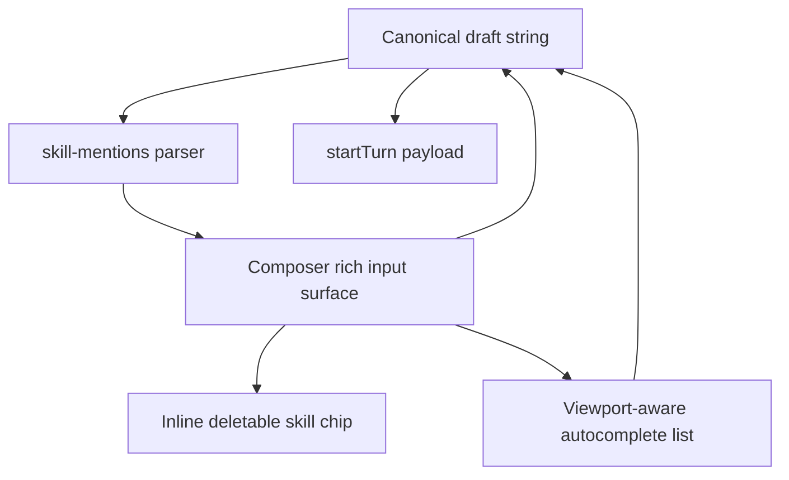

# fix: Repair composer skill autocomplete interactions

## Overview

Make desktop skill autocomplete behave like a real composer affordance: selected skills become deletable chips inside the text-entry surface, each chip exposes the backing `SKILL.md` path in its tooltip, keyboard selection reliably commits the focused autocomplete item, and long autocomplete lists stay within the visible Electron window with internal scrolling.

## Problem Frame

The current composer treats skill selection mostly as plain text. Selecting `$ce:plan` inserts a `$ce:plan` token into the textarea, then `composer__mentioned-skills` mirrors the detected skill as a chip above the text entry. That misses the intended interaction: the selected skill should be visible as a chip within the entry itself, removable as one unit, and inspectable without leaving the composer.

The current autocomplete list is also fragile around keyboard focus. Enter works when the textarea owns focus and `Composer.tsx` sees the key event, but the user-visible failure is that pressing Enter while navigating the autocomplete option itself does not reliably select the skill and close the popup. The list is styled with a capped `max-height`, but placement is only CSS-anchored above the textarea; it should be measured against the actual viewport so it cannot extend outside the window.

## Requirements Trace

- R1. Selecting a skill from autocomplete renders a compact, deletable skill chip inside the composer text-entry surface, not in a separate row above it.
- R2. Skill chips expose a tooltip that includes the selected skill's backing path, including examples such as `SKILL.md`.
- R3. Deleting a skill chip removes the whole skill mention from the composer draft without leaving partial markdown, stale `$name` text, or broken send payloads.
- R4. Pressing Enter while autocomplete navigation or an autocomplete option has focus selects the active skill and closes the popup.
- R5. Arrow key navigation, Escape dismissal, pointer selection, and textarea submission continue to work without regressing `/review` slash command autocomplete.
- R6. The autocomplete popup stays within the visible desktop window, caps its height from available space, and scrolls internally for long skill lists.
- R7. Existing send semantics remain intact: selected skills still reach `startTurn` as markdown links with the skill path, and plain text/image composer behavior does not change.
- R8. The rich composer keeps the existing accessible labels, exposes a multiline textbox interaction, and provides keyboard-reachable chip deletion and tooltip inspection.

## Scope Boundaries

- This plan only covers desktop renderer composer interactions.
- This plan does not change app-server skill discovery, `skills/list`, skill metadata shape, or lazy skill loading behavior.
- This plan does not redesign transcript-rendered skill chips; it may reuse their tooltip styling and parsing helpers.
- This plan does not introduce a general-purpose rich text editor dependency unless implementation proves the native approach cannot meet the tests cleanly.

## Context & Research

### Relevant Code and Patterns

- `apps/desktop/src/renderer/src/features/composer/Composer.tsx` owns the textarea, autocomplete filtering, active option indexes, skill insertion, send payload construction, slash command autocomplete, and the current `composer__mentioned-skills` mirror row.
- `apps/desktop/src/renderer/src/lib/skill-mentions.ts` is the canonical helper for skill trigger detection, mention markdown, draft hydration, parsing, and tooltips.
- `apps/desktop/src/renderer/src/features/composer/SkillChip.tsx` already renders a compact skill chip with `buildSkillTooltip`, but it is non-deletable and optimized for transcript/sidebar-style display rather than editor tokens.
- `apps/desktop/src/renderer/src/styles/app.css` already defines `composer__autocomplete` with a capped scroll container and shared tooltip/chip styles. The implementation should extend these styles rather than adding a separate visual language.
- `apps/desktop/src/renderer/src/features/composer/__tests__/composer.test.tsx` covers current skill insertion, send payload hydration, keyboard Enter submission, slash command autocomplete, and focused skill option activation.
- `apps/desktop/e2e/directory-launchpad-skills.spec.ts` covers directory launchpad skill autocomplete with user and local skills, which is the closest browser-level scenario for viewport and keyboard regressions.
- `docs/UI-THEME.md` and `docs/design/desktop-style-guide.md` require compact, stable, black-first desktop controls, restrained tangerine focus state, no browser-default shipped controls, and no layout shift on hover/focus/selection.

### Institutional Learnings

- No `docs/solutions/` directory exists in this worktree, so there are no indexed institutional learnings to apply.
- `docs/plans/2026-04-18-003-fix-desktop-thread-refresh-model-plan.md` established that skill loading should remain lazy and thread-scoped. This plan preserves that boundary and only changes what happens after skills are available.
- `docs/plans/2026-04-20-001-feat-tangerine-terminal-visual-system-plan.md` already called out autocomplete as part of the composer visual system. This plan narrows that broad visual requirement into concrete interaction behavior.

### External References

- External research is not needed. The work is bounded to existing React renderer behavior, existing CSS tokens, and known browser/editor constraints.

## Key Technical Decisions

- Use a tokenized composer input surface for selected skills instead of the current detached mirror row: native textareas cannot contain real child chips, so the implementation needs a small composer-owned rich input layer that renders text segments and skill mentions while keeping a canonical draft string for send behavior.
- Keep `skill-mentions.ts` as the canonical parser/formatter: selected skills should still serialize to markdown links with paths, parse back into `SkillMentionPart` segments, and use `buildSkillTooltip` for path-bearing tooltips.
- Prefer a focused composer-specific editor over a general rich text dependency: the needed semantics are narrow enough -- plain text, newline support, skill tokens, caret-aware `$` autocomplete, paste/drop handoff, and deletion -- that a dependency would add more surface area than value for this fix.
- Centralize autocomplete selection into one commit path: textarea Enter, option Enter, option click, and option pointer activation should all call the same skill/slash selection function, which clears the trigger state and returns focus to the composer.
- Make autocomplete placement measured, not purely CSS anchored: use the composer input bounds and window dimensions to choose above/below placement and set a max height that fits the available viewport while preserving internal scroll.

## Open Questions

### Resolved During Planning

- Should the path tooltip live on the chip or only in autocomplete detail? It should live on the selected chip. The user specifically asked for the `SKILL.md` path on a tooltip once the chip exists in the text entry.
- Should the current above-input `composer__mentioned-skills` row remain? No. It is the source of the reported mismatch and should be removed for composer-selected skill display once chips are rendered inside the entry.
- Should the selected skill be stored as bare `$name` or markdown? Store the canonical draft as markdown for selected autocomplete skills so the path is preserved immediately and duplicate skill names do not rely on later hydration guesses. Existing bare `$name` typing can still hydrate on send for compatibility.

### Deferred to Implementation

- Exact caret restoration mechanics after chip deletion or insertion: implementation should choose the simplest reliable contenteditable/hidden-textarea synchronization once tests define the behavior.
- Whether the first implementation can keep a native textarea underneath the visual token layer or should fully replace it with a contenteditable textbox: decide during implementation based on which path preserves multiline editing, paste/drop behavior, and selection tests with the least complexity.

## High-Level Technical Design

> *This illustrates the intended approach and is directional guidance for review, not implementation specification. The implementing agent should treat it as context, not code to reproduce.*

The important boundary is that `Draft` remains the source of truth. The visual editor may render chips, but send behavior, tests, draft persistence, launchpad hydration, and thread-scoped draft storage should still read/write one canonical draft value.

## Implementation Units

- [x] **Unit 1: Introduce inline skill tokens in the composer input**

**Goal:** Replace the detached `composer__mentioned-skills` mirror row with inline, deletable skill chips inside the composer text-entry surface while preserving canonical draft state.

**Requirements:** R1, R2, R3, R7, R8

**Dependencies:** None

**Files:**
- Create: `apps/desktop/src/renderer/src/features/composer/ComposerRichInput.tsx`
- Modify: `apps/desktop/src/renderer/src/features/composer/Composer.tsx`
- Modify: `apps/desktop/src/renderer/src/features/composer/SkillChip.tsx`
- Modify: `apps/desktop/src/renderer/src/lib/skill-mentions.ts`
- Modify: `apps/desktop/src/renderer/src/styles/app.css`
- Test: `apps/desktop/src/renderer/src/features/composer/__tests__/ComposerRichInput.test.tsx`
- Test: `apps/desktop/src/renderer/src/features/composer/__tests__/composer.test.tsx`

**Approach:**
- Add a composer-specific inline token rendering path that parses the canonical draft into text and skill mention parts, renders skill mentions as compact chips inside the input chrome, and keeps text editing synchronized back to the same draft state used today.
- Keep the rich input boundary small and composer-owned. A `ComposerRichInput` helper is justified because token rendering, chip deletion, caret restoration, and autocomplete trigger reporting should be isolated from turn submission, attachment, workspace, and review-command logic in `Composer.tsx`.
- Make selected autocomplete skills insert a path-bearing markdown mention into the canonical draft, displayed as a `$name` chip rather than raw markdown.
- Add a delete affordance to composer-rendered skill chips. Keep transcript and thread chip usage non-deletable by making deletion optional rather than changing every `SkillChip` consumer.
- Preserve the existing `Reply` and `New thread` accessible names by giving the rich input a textbox role, multiline semantics, focus-visible styling, and keyboard access to chip delete controls.
- Remove or retire `composer__mentioned-skills` for selected composer mentions once the inline token surface is active.
- Preserve plain text, newline, image attachment, launchpad prompt hydration, thread draft persistence, `/review`, and send/steer flows.

**Execution note:** Start characterization-first around current skill insertion/send behavior, then add failing tests for inline chip deletion before changing the input surface.

**Patterns to follow:**
- `skill-mentions.ts` for mention parsing, markdown formatting, and tooltip text.
- `SkillChip.tsx` and `thread-row__chip` styling for compact chip visuals.
- Existing draft persistence and send code in `Composer.tsx`.

**Test scenarios:**
- Happy path: selecting `ce:plan` from autocomplete renders one `$ce:plan` chip inside the composer input surface with a tooltip containing `SKILL.md`.
- Happy path: sending a draft with the inline `$ce:plan` chip calls `startTurn` with `[$ce:plan](...)` markdown containing the skill path.
- Edge case: clicking the chip delete control removes the whole mention from the canonical draft and leaves neighboring text with sensible spacing.
- Edge case: pressing Backspace or Delete when the caret is adjacent to a chip removes the whole chip rather than stepping through raw markdown characters.
- Edge case: keyboard focus can reach a chip delete control and return to the rich input without losing the draft selection context.
- Edge case: typing plain `$ce:plan` manually without selecting autocomplete remains compatible with existing send-time hydration when the skill is known.
- Edge case: switching threads or launchpad directories preserves/restores drafts without duplicating chips or losing selected skill paths.
- Error path: a malformed markdown-shaped skill mention in the draft does not crash the editor and falls back to safe editable text or a non-deletable parsed mention.

**Verification:**
- The selected skill appears inside the composer input border, not above it.
- Deleting a chip updates the visible input and subsequent send payload.
- Screen-reader-oriented queries still find the composer as `Reply` or `New thread`, and chip delete controls have stable accessible names.
- Existing composer tests for send, steer, slash command, image paste/drop, and draft persistence still pass.

- [x] **Unit 2: Make autocomplete keyboard selection focus-safe**

**Goal:** Ensure Enter selects the active autocomplete item and closes the popup whether focus is on the textarea, listbox, or option button.

**Requirements:** R4, R5, R7, R8

**Dependencies:** Unit 1

**Files:**
- Modify: `apps/desktop/src/renderer/src/features/composer/Composer.tsx`
- Test: `apps/desktop/src/renderer/src/features/composer/__tests__/composer.test.tsx`

**Approach:**
- Extract shared autocomplete commit helpers for skill and slash command selection so all input modes use one code path.
- Use a predictable focus model for autocomplete navigation: either roving `tabIndex` on options or textarea-owned focus with `aria-activedescendant`, but do not split active index and DOM focus in a way that lets Enter fall through.
- Add option/listbox `onKeyDown` handling for Enter, Space where appropriate, Escape, ArrowUp, and ArrowDown. Prevent default submission when autocomplete is open.
- After a skill or slash command is committed, close the popup, reset active index for the next trigger, and restore focus to the composer input.
- Keep `/review` behavior intact, including the current rule that a bare `/review` opens the review configuration instead of endlessly reselecting autocomplete.

**Patterns to follow:**
- Existing `activeSkillIndex`, `activeSlashIndex`, and `scrollIntoView({ block: "nearest" })` behavior in `Composer.tsx`.
- Current slash command tests near the skill autocomplete tests.

**Test scenarios:**
- Happy path: type `$ce:pl`, move focus to the `ce:plan` option, press Enter -> the chip is inserted and the Skills listbox is gone.
- Happy path: type `$`, press ArrowDown then Enter while the textarea owns focus -> the active skill is inserted.
- Happy path: pointer selecting a skill uses the same commit behavior as keyboard selection and closes the popup.
- Edge case: pressing Escape while an option has focus closes the popup and returns focus to the composer input without changing the draft.
- Regression: pressing Enter with no autocomplete open still sends the reply; Shift+Enter still inserts a newline.
- Regression: slash command autocomplete still inserts `/review ` and opens review configuration as it does today.

**Verification:**
- There is no focus state where Enter submits the whole turn or does nothing while an autocomplete option is visually active.

- [x] **Unit 3: Make autocomplete placement viewport-aware and scrollable**

**Goal:** Keep the autocomplete popup inside the Electron window and internally scrollable across desktop and narrow viewports.

**Requirements:** R5, R6

**Dependencies:** Unit 2

**Files:**
- Modify: `apps/desktop/src/renderer/src/features/composer/Composer.tsx`
- Modify: `apps/desktop/src/renderer/src/styles/app.css`
- Test: `apps/desktop/src/renderer/src/features/composer/__tests__/composer.test.tsx`
- Test: `apps/desktop/e2e/directory-launchpad-skills.spec.ts`

**Approach:**
- Measure the composer input wrapper and viewport when autocomplete opens, when the active option changes, and when the window resizes.
- Choose above or below placement based on available space, preferring the current above-input placement when it fits.
- Set max height from available viewport space with a small margin so the popup never extends beyond the window edge.
- Keep the list internally scrollable and keep active option scrolling with `block: "nearest"`.
- Preserve existing Tangerine Terminal styling while tightening layout constraints for long descriptions and long skill names.

**Patterns to follow:**
- Current `.composer__autocomplete` scroll container and `scrollbar-color`.
- Existing context rail tooltip measurement in `apps/desktop/src/renderer/src/features/thread-detail/ThreadContextPanel.tsx` as a local example of viewport-aware overlay placement.

**Test scenarios:**
- Happy path: with a normal number of skills and enough space, the popup appears adjacent to the composer and all visible rows are selectable.
- Edge case: with many skills, the popup has a bounded height, exposes internal scrolling, and does not enlarge the page or overlap outside the app window.
- Edge case: when the composer is near the bottom edge, the popup flips or shrinks to stay visible.
- Edge case: long skill descriptions and long paths truncate or wrap within the popup without horizontal overflow.
- Integration: the directory launchpad skill autocomplete E2E scenario uses enough skills to prove scrolling and active-option visibility.

**Verification:**
- Visual inspection or Playwright screenshots show the popup fully within the app bounds at desktop and narrow viewport sizes.
- Keyboard navigation can reach offscreen items through internal popup scrolling.

- [x] **Unit 4: Add focused E2E coverage for the reported interaction contract**

**Goal:** Prove the full user-reported flow in an Electron-backed scenario rather than relying only on component tests.

**Requirements:** R1, R2, R3, R4, R6, R7

**Dependencies:** Units 1-3

**Files:**
- Modify: `apps/desktop/e2e/directory-launchpad-skills.spec.ts`
- Create or modify: `apps/desktop/e2e/skill-autocomplete-interactions.spec.ts`
- Create or modify: `apps/desktop/e2e/fixtures/*` only if an existing fixture cannot express the needed skill list

**Approach:**
- Reuse the replay fixture style from `directory-launchpad-skills.spec.ts` so tests can run deterministically without a live Codex backend.
- Cover both an existing thread composer and a directory launchpad composer if fixture setup remains modest. If the work must choose one, prioritize the existing thread composer because that matches the screenshot and most frequent reply flow.
- Assert geometry by comparing the autocomplete bounding box against the app viewport, not by snapshotting exact pixels.
- Assert the selected chip is inside the composer input container and no detached mentioned-skill row is rendered above it.
- Assert the tooltip exposes the skill path on hover or focus, and deleting the chip removes the mention before send.

**Patterns to follow:**
- `apps/desktop/e2e/directory-launchpad-skills.spec.ts` for replay-backed skill data.
- `apps/desktop/e2e/provider-model-selectors.spec.ts` and related composer E2E tests for interacting with composer controls.

**Test scenarios:**
- Integration: type `$ce:pl`, focus/navigate the autocomplete item, press Enter -> popup closes, inline chip appears, and the textarea/rich input remains focused for continued typing.
- Integration: hover or focus the chip -> tooltip includes the `SKILL.md` path.
- Integration: delete the chip -> the composer no longer contains the skill mention and send payload omits it.
- Integration: seed a long skill list -> popup fits within the viewport and scrolls internally while ArrowDown keeps the active option visible.
- Regression: after inserting a chip, typing additional text and sending still creates one text input payload with the skill markdown and the surrounding prose.

**Verification:**
- The targeted desktop E2E coverage passes for the skill autocomplete interaction contract.
- The desktop app visually matches the intended contract from the user report: chip inside entry, popup closed after Enter, popup bounded and scrollable.

## System-Wide Impact

- **Interaction graph:** `useThreadSkills` remains the loader; `Composer.tsx` consumes loaded skills, renders the rich input, owns autocomplete state, and serializes the canonical draft to `startTurn`.
- **Error propagation:** Skill loading errors remain `props.skillError`; rich input parse/render failures should degrade to editable text rather than blocking send.
- **State lifecycle risks:** Thread-scoped drafts, launchpad hydration, active turn queueing, and image attachment paste/drop all share `Composer.tsx`; the inline token work must not reset or fork those state paths.
- **Accessibility:** The composer must remain discoverable as a multiline textbox with the existing accessible names, while inline chip delete buttons and tooltips must be reachable by keyboard and not trap focus.
- **API surface parity:** No app-server, preload, IPC, or shared contract changes are planned.
- **Integration coverage:** Component tests cover canonical draft and keyboard state; E2E coverage proves actual focus, tooltip, geometry, and popup scrolling behavior in Electron.
- **Unchanged invariants:** Enter submits when no autocomplete is open, Shift+Enter inserts a newline, slash command autocomplete keeps working, image attachments still send with text, and selected skills still serialize as markdown links with paths.

## Risks & Dependencies

| Risk | Mitigation |
|------|------------|
| Replacing a textarea with a richer input surface could regress caret behavior, multiline editing, or paste/drop behavior. | Keep the canonical draft model unchanged, write characterization tests first, and scope the editor to plain text plus skill tokens only. |
| Contenteditable behavior can be inconsistent across browsers and tests. | Keep a narrow command surface, avoid arbitrary rich formatting, isolate it in `ComposerRichInput`, and prove key operations through both component and Electron E2E tests. |
| Replacing the textarea could regress screen-reader or keyboard affordances. | Preserve the existing accessible names, multiline textbox semantics, focus-visible styling, and keyboard-reachable chip deletion in tests. |
| Keyboard focus could still diverge between visual active state and DOM focus. | Pick one focus model and route every Enter/Escape/Arrow path through shared commit/dismiss helpers. |
| Tooltip and popup overlays could collide visually. | Reuse existing tooltip patterns and measure autocomplete against viewport; keep tooltip behavior limited to hover/focus on the chip. |
| Long skill lists or descriptions could reintroduce viewport overflow. | Use measured max height, internal scrolling, wrapping/truncation, and E2E geometry assertions. |

## Documentation / Operational Notes

- No user-facing documentation is required.
- If a new reusable rich input helper is introduced, keep it private to composer until another surface needs the same behavior.
- If fixture capture is refreshed from a live session, use `.agents/skills/desktop-e2e-fixture-seeding/SKILL.md`; otherwise prefer deterministic replay fixture construction.

## Sources & References

- User report: inline deletable skill chip desired inside the composer entry; tooltip should include `SKILL.md`; Enter should select and close autocomplete; long autocomplete lists should fit in the window and scroll.
- Related code: `apps/desktop/src/renderer/src/features/composer/Composer.tsx`
- Related code: `apps/desktop/src/renderer/src/features/composer/SkillChip.tsx`
- Related code: `apps/desktop/src/renderer/src/lib/skill-mentions.ts`
- Related styles: `apps/desktop/src/renderer/src/styles/app.css`
- Related tests: `apps/desktop/src/renderer/src/features/composer/__tests__/composer.test.tsx`
- Related E2E: `apps/desktop/e2e/directory-launchpad-skills.spec.ts`
- Theme guidance: `docs/UI-THEME.md`
- Desktop guidance: `docs/design/desktop-style-guide.md`
- Related plan: `docs/plans/2026-04-18-003-fix-desktop-thread-refresh-model-plan.md`
- Related plan: `docs/plans/2026-04-20-001-feat-tangerine-terminal-visual-system-plan.md`
