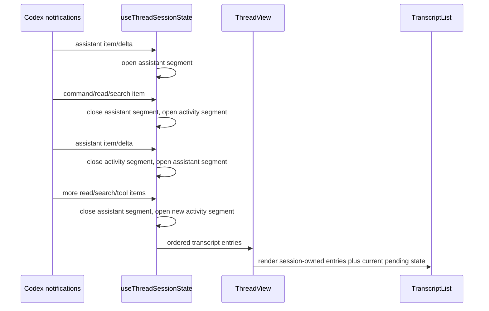
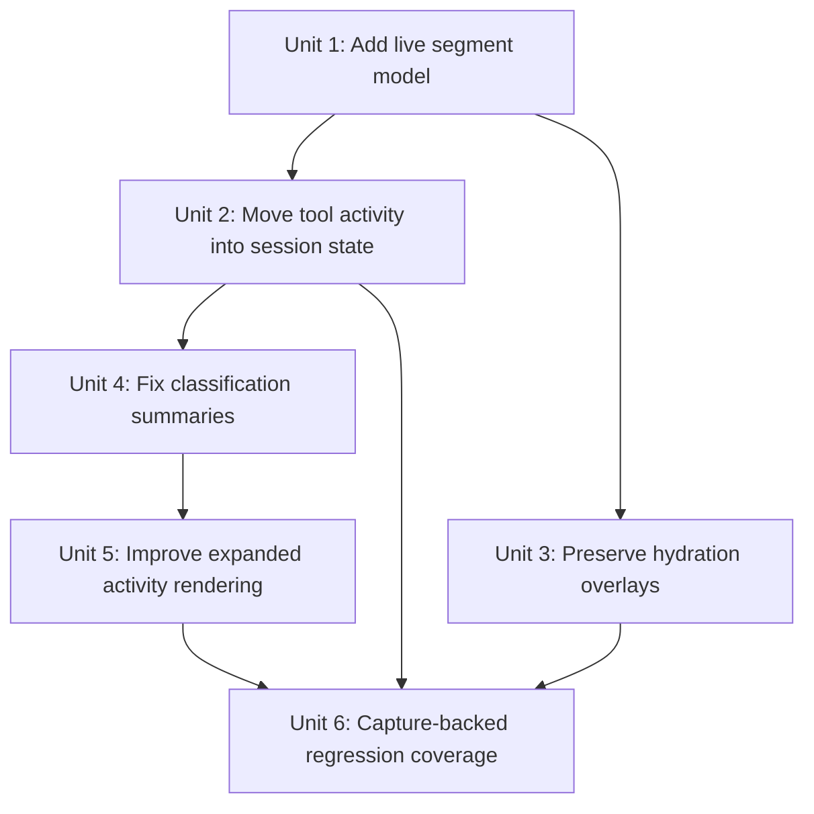

# fix: Preserve live transcript event order

## Overview

Fix the remaining desktop transcript bug where live tool activity is grouped above later assistant text, file reads are counted as "tools used", expanded activity sections become unusably large, and rich live activity disappears after navigating away from a thread and back.

The concrete regression thread is `019dde4b-4979-7220-938e-ca79eb4e34c4`. Its capture shows this event order in the first turn: assistant commentary, several discovery commands, assistant commentary beginning "The first scan shows this is a deep brainstorm", then more reads/searches. The UI must preserve that order as separate transcript segments rather than growing one old "Used N tools" bucket above the newer assistant message.

## Problem Frame

The active implementation splits live transcript state across two owners:

- `apps/desktop/src/renderer/src/lib/useThreadSessionState.ts` owns pending assistant text and persisted optimistic entries for the selected thread.
- `apps/desktop/src/renderer/src/features/thread-detail/ThreadView.tsx` owns pending tool/activity state locally through `pendingToolActivityEntry`, `pendingActivityEntry`, and `pendingProtocolActivityEntry`.

That split loses the actual event sequence. `ThreadView.tsx` keeps merging later tool items into the same activity entry created when the first command starts. `TranscriptList.tsx` then sorts pending entries by `createdAt`, so the activity bucket keeps its earlier timestamp and appears above assistant text that actually arrived before the later tools. Separately, `ThreadView.tsx` publishes rich live activity to the session only on `turn/completed`, so navigation during or after hydration can fall back to the app-server `thread/read` snapshot and lose richer live-only activity.

This work is a continuation of the thread refresh model requirement that selected-thread updates should be append-driven and session-owned during active work (see origin: `docs/brainstorms/2026-04-18-desktop-thread-refresh-model-requirements.md`). It also carries forward protocol parity constraints from `docs/brainstorms/2026-04-19-codex-desktop-protocol-parity-requirements.md` and the completed rich command work in `docs/plans/2026-04-29-001-feat-rich-command-transcripts-plan.md`.

## Requirements Trace

- R1. Preserve live event order exactly enough that `assistant -> tools -> assistant -> tools -> final` renders as separate transcript segments in that order.
- R2. Do not classify file reads, file searches, or list-only exploration as "Used tools"; they should summarize as exploration and stay outside the tool-used section.
- R3. Keep expanded activity usable by grouping repeated read/search/list details behind a compact nested disclosure while exposing command details only when the user asks for them.
- R4. Preserve rich live activity for threads started or resumed in the current app process when navigating away and back, even if `thread/read` cannot reconstruct the activity from persisted server data.
- R5. Allow final hydration from `thread/read` to merge durable messages and server-backed items without erasing current-process live activity that is not present in the snapshot.
- R6. Add regression coverage from thread `019dde4b-4979-7220-938e-ca79eb4e34c4`, including the "The first scan shows this is a deep brainstorm" boundary and the 9-to-12 tool count drift.

## Scope Boundaries

- This plan does not redesign all transcript rendering. It fixes live ordering, classification, expansion, and current-process retention.
- This plan does not remove rich command output added by `docs/plans/2026-04-29-001-feat-rich-command-transcripts-plan.md`; it changes where that output is grouped and when it is visible.
- This plan does not make file reads disappear from the transcript entirely. They remain useful as exploration details, but they do not count as tools and should be compact by default.
- This plan does not require app-server protocol changes. Event order can be preserved using renderer receipt order unless a later implementation discovers that main-process event metadata is already available.
- This plan does not rely on rollout files as the runtime source of truth.

## Context & Research

### Relevant Code and Patterns

- `apps/desktop/src/renderer/src/features/thread-detail/ThreadView.tsx` builds live activity in `buildLiveToolDetails`, merges it with `mergeActivityDetails`, accumulates command output with `appendCommandOutputDelta`, and only publishes activity through `onLiveTranscriptEntry` on `turn/completed`.
- `apps/desktop/src/renderer/src/features/thread-detail/TranscriptList.tsx` orders pending entries with `pendingEntriesInEventOrder` and inserts non-final pending activity before a matching final assistant message. It does not know about boundaries between multiple assistant messages in the same turn.
- `apps/desktop/src/renderer/src/lib/useThreadSessionState.ts` already owns per-thread session retention, optimistic entries, hydration, and navigation-safe state. It is the right owner for live transcript segments that must survive thread switches.
- `apps/desktop/src/renderer/src/lib/useThreadSessionState.ts` currently inserts non-message optimistic entries before a terminal final message by turn id in `mergeTranscriptEntries`; this is too coarse once one turn contains multiple assistant commentary messages and multiple activity groups.
- `packages/shared/src/contracts/normalized-app-server.ts` already has `AppServerThreadActivityDetail.kind` and `AppServerThreadCommandDetail`, so the fix can use existing normalized concepts before adding new contract shape.
- `apps/desktop/src/renderer/src/features/thread-detail/TranscriptActivity.tsx` renders all expanded details flat, which makes read-heavy activity unusable.
- `apps/desktop/e2e/transcript-activity-order.spec.ts` proves persisted activity order, but not live segment boundaries.
- `apps/desktop/e2e/transcript-command-output.spec.ts` proves command output inspection, but not read-heavy expansion or current-process navigation preservation.

### Institutional Learnings

- No `docs/solutions/` directory exists in this worktree.
- The recent rich command plan correctly established that `thread/read` may omit live-rich activity and must not be treated as complete when current-process live data exists.
- The existing thread refresh requirements explicitly favor cached thread state and append-driven active-turn updates over repeated full rereads.

### External References

- External research is not needed. The failure is in local renderer/session state ownership and is grounded by protocol capture evidence.

## Key Technical Decisions

- **Move live transcript segment ownership into `useThreadSessionState.ts`.** The session store already survives navigation and owns hydration decisions. Live activity that must survive thread switches should not live only in `ThreadView.tsx` component state.
- **Track live transcript segments in receipt order, not by turn id alone.** A turn id is too coarse; the target capture has multiple assistant messages and multiple activity groups inside one turn. The implementation should assign a monotonically increasing local order per received agent event or per live segment.
- **Flush activity segments at assistant-message boundaries.** When a new assistant message starts after tools have run, the current activity segment should be closed and retained before the assistant segment. Later tools start a new activity segment after that assistant message.
- **Classify exploration separately from tools.** Details with `kind: "read"` and command actions of `read`, `search`, or `listFiles` should summarize as exploration, not tool use. Mixed activity may show both summaries, but read-only groups should never say "Used N tools".
- **Make activity expansion two-level for noisy reads.** Expanding a work group should show compact subgroups such as "Read 6 files" or "Searched 3 locations"; individual paths and command strings are revealed by a second click.
- **Treat current-process live entries as authoritative overlays until equivalent persisted entries exist.** Hydration may add durable messages, but it must not prune live activity merely because `thread/read` lacks the same entry id.

## Open Questions

### Resolved During Planning

- **Is there a real event boundary before "The first scan shows this is a deep brainstorm"?** Yes. The capture shows an assistant commentary item completed, four discovery commands, then a second assistant commentary item starting at the deep-brainstorm text. Later reads/searches occur after that second assistant message.
- **Why can the tool count above that response grow from 9 to 12?** Current live activity merges later tool details into the first pending activity entry, whose `createdAt` remains earlier than the assistant message, so the visual group above the response keeps growing.
- **Why can rich live activity vanish after navigation?** Rich tool activity is stored in `ThreadView.tsx` local state until turn completion and then as optimistic entries subject to hydration pruning. Thread switches and final `thread/read` responses can therefore replace the visible data with a less-rich snapshot.
- **Should "Reading files" be shown under Tools Used?** No. Reads/searches/listing are exploration activity, not tool-use activity, even if the protocol represents them through command execution items.

### Deferred to Implementation

- Exact helper names for live segment state should be chosen while refactoring `useThreadSessionState.ts`.
- The exact nested disclosure labels for read/search/list groups should be tuned against the desktop visual style during implementation.
- If main-process agent events already carry a stable sequence number by the time implementation starts, use it; otherwise a renderer-local monotonic order is sufficient for one process.

## High-Level Technical Design

> This illustrates the intended approach and is directional guidance for review, not implementation specification. The implementing agent should treat it as context, not code to reproduce.

The important invariant is that live transcript entries are segmented when the protocol crosses between assistant text and activity. Later activity never mutates an earlier segment that has already been ordered before an assistant message.

## Implementation Units

- [x] **Unit 1: Add a session-owned live segment model**

**Goal:** Represent current-process live transcript entries in event order inside `useThreadSessionState.ts`.

**Requirements:** R1, R4, R5

**Dependencies:** None

**Files:**
- Modify: `apps/desktop/src/renderer/src/lib/useThreadSessionState.ts`
- Modify: `apps/desktop/src/renderer/src/lib/__tests__/useThreadSessionState.test.tsx`
- Modify: `packages/shared/src/contracts/normalized-app-server.ts` only if a small optional ordering field is needed

**Approach:**
- Add a per-session live entry collection that can hold assistant message entries, activity entries, plan entries, and review entries with stable local ordering.
- Assign an order value when the event is received or when a segment is first opened.
- Keep turn metadata on each segment, but do not use turn id as the only ordering primitive.
- Make merge logic order response entries plus live entries by explicit live order when available, falling back to existing entry order for persisted data.
- Keep existing optimistic user-message behavior separate from live transcript segments so composer sends and live server events remain easy to reason about.

**Execution note:** Add characterization tests before moving any `ThreadView.tsx` logic: one turn with assistant commentary, activity, assistant commentary, activity, final answer must render in that exact order.

**Patterns to follow:**
- Existing per-thread retention and hydration state in `apps/desktop/src/renderer/src/lib/useThreadSessionState.ts`
- Existing `mergeTranscriptEntries` behavior, but with finer live ordering than turn-id terminal insertion

**Test scenarios:**
- Happy path: within one turn, assistant commentary A, activity group 1, assistant commentary B, activity group 2, final answer render in that order.
- Happy path: a thread switch away and back during an active turn keeps the session-owned live segments visible.
- Edge case: two activity items with no assistant message between them remain grouped when consecutive.
- Edge case: a later activity item after an assistant message creates a new segment instead of mutating the earlier segment.
- Integration: hydrated persisted messages combine with current-process live activity without duplicate assistant messages.

**Verification:**
- The session state can express the target capture order without relying on `ThreadView.tsx` local pending activity buckets.

- [x] **Unit 2: Move live tool/activity accumulation out of `ThreadView.tsx`**

**Goal:** Ensure live tool, command, read/search, MCP status, file-change, and plan activity is accumulated by the session owner and rendered as ordered entries.

**Requirements:** R1, R4, R5

**Dependencies:** Unit 1

**Files:**
- Modify: `apps/desktop/src/renderer/src/features/thread-detail/ThreadView.tsx`
- Modify: `apps/desktop/src/renderer/src/lib/useThreadSessionState.ts`
- Modify: `apps/desktop/src/renderer/src/features/thread-detail/__tests__/thread-view.test.tsx`
- Modify: `apps/desktop/src/renderer/src/lib/__tests__/useThreadSessionState.test.tsx`

**Approach:**
- Move the live activity-building helpers or their state mutations from `ThreadView.tsx` to the session hook, keeping pure formatting helpers close to the renderer only if they are presentation-only.
- On `item/started`, `item/completed`, `item/commandExecution/outputDelta`, `item/mcpToolCall/progress`, `item/fileChange/outputDelta`, and MCP status notifications, update the current session segment for that event position.
- On assistant message start/delta, close any current activity segment before appending or updating assistant text.
- On later activity after assistant text, open a new activity segment with a new order value.
- Reduce `ThreadView.tsx` to rendering transcript props and handling UI-only interactions.

**Patterns to follow:**
- Existing `buildLiveToolDetails`, `mergeActivityDetails`, and `appendCommandOutputDelta` behavior in `apps/desktop/src/renderer/src/features/thread-detail/ThreadView.tsx`
- Existing `upsertLiveTranscriptEntry` intent in `apps/desktop/src/renderer/src/lib/useThreadSessionState.ts`

**Test scenarios:**
- Happy path: command output deltas update the correct command detail within the correct segment.
- Happy path: MCP status updates remain visible but do not steal ordering from tool/activity segments tied to a thread turn.
- Edge case: `item/completed` for a command with `aggregatedOutput` replaces or completes the accumulated output without duplicating it.
- Edge case: activity for a non-selected retained thread is stored in that thread's session and appears when selected.
- Integration: `ThreadView.tsx` no longer needs `pendingToolActivityEntry` to preserve live order.

**Verification:**
- Live activity no longer grows an old activity entry above newer assistant text.

- [x] **Unit 3: Preserve current-process live activity through hydration**

**Goal:** Prevent `thread/read` refreshes and navigation reselects from wiping rich live entries that cannot be restored from app-server snapshots.

**Requirements:** R4, R5

**Dependencies:** Unit 1

**Files:**
- Modify: `apps/desktop/src/renderer/src/lib/useThreadSessionState.ts`
- Modify: `apps/desktop/src/renderer/src/lib/__tests__/useThreadSessionState.test.tsx`

**Approach:**
- Distinguish server-hydrated response entries from current-process live entries.
- Prune a current-process live activity only when the hydrated response contains an equivalent activity, not merely when the thread was reread.
- Define equivalence for activities by stable detail ids and, where needed, command display/output or file diff content.
- When `expectOwnUpdate` is true for an interacted thread, prefer merging fresh response data into the existing session over replacing the session-visible transcript.
- Ensure view-only cache eviction does not evict interacted or active-turn threads that own live-rich data.

**Patterns to follow:**
- `pruneOptimisticEntries`, `mergeTranscriptEntries`, and interacted-thread retention in `apps/desktop/src/renderer/src/lib/useThreadSessionState.ts`
- Thread refresh requirements R5, R7, R19, and R20 in `docs/brainstorms/2026-04-18-desktop-thread-refresh-model-requirements.md`

**Test scenarios:**
- Happy path: after turn completion, `thread/read` returns messages but no activity; the current-process live activity remains visible.
- Happy path: after navigation away and back, the same live activity and command output are still visible for an interacted thread.
- Edge case: if a later `thread/read` includes equivalent activity, the live overlay is pruned without duplicate rendering.
- Edge case: a stale response from an older request version cannot remove newer live entries.
- Integration: the selected transcript and sidebar update can hydrate messages without repainting away live-rich activity.

**Verification:**
- Clicking away from `019dde4b-4979-7220-938e-ca79eb4e34c4` and back does not remove live activity segments captured in the current app process.

- [x] **Unit 4: Correct activity classification and summaries**

**Goal:** Stop counting file reads/searches/listing as "Used tools" and produce summaries that match the user's mental model.

**Requirements:** R2

**Dependencies:** Unit 2

**Files:**
- Modify: `apps/desktop/src/renderer/src/features/thread-detail/ThreadView.tsx`
- Modify: `apps/desktop/src/main/codex-app-server/client.ts`
- Modify: `apps/desktop/src/main/app-server/thread-activity.ts`
- Modify: `apps/desktop/src/renderer/src/features/thread-detail/__tests__/thread-view.test.tsx`
- Modify: `apps/desktop/src/main/__tests__/codex-client.test.ts`

**Approach:**
- Treat `commandActions` of `read`, `search`, and `listFiles` as exploration details.
- Make read-only groups summarize as "Read N files", "Searched N locations", or "Explored N items" rather than "Used N tools".
- Keep true external tool calls, MCP tool calls, dynamic tool calls, web search, and commands with side effects in tool/command summaries.
- For mixed groups, include both exploration and tool/command summary parts in event order without collapsing them into a single misleading count.

**Patterns to follow:**
- `summarizeLiveToolActivity` in `apps/desktop/src/renderer/src/features/thread-detail/ThreadView.tsx`
- `summarizeActivityItems` in `apps/desktop/src/main/codex-app-server/client.ts`
- `summarizeActivityEntries` patterns in `apps/desktop/src/main/app-server/thread-activity.ts`

**Test scenarios:**
- Happy path: three `sed` reads render as exploration and do not produce "Used 3 tools".
- Happy path: one MCP tool call still renders as tool use.
- Happy path: a shell command with unknown or write-like action renders as a command.
- Edge case: a command item with multiple read actions counts files, not command count.
- Integration: persisted `thread/read` activity and live activity use the same classification vocabulary.

**Verification:**
- The target capture no longer shows read-file work as a growing "Used 12 tools" group.

- [x] **Unit 5: Make expanded activity sections compact and inspectable**

**Goal:** Make read-heavy activity expansion usable by adding nested grouped disclosures and keeping command output hidden until the specific command detail is expanded.

**Requirements:** R3

**Dependencies:** Unit 4

**Files:**
- Modify: `apps/desktop/src/renderer/src/features/thread-detail/TranscriptActivity.tsx`
- Modify: `apps/desktop/src/renderer/src/features/thread-detail/TranscriptCommandOutput.tsx`
- Modify: `apps/desktop/src/renderer/src/features/thread-detail/__tests__/transcript-list.test.tsx`
- Modify: `apps/desktop/src/renderer/src/features/thread-detail/__tests__/transcript-command-output.test.tsx`
- Modify: `apps/desktop/src/renderer/src/styles/app.css`

**Approach:**
- Keep the top-level work group collapsed by default.
- When expanded, group homogeneous read/search/list details behind compact rows. The expanded work group should not immediately dump every `Read File.ts` row.
- Provide a second-level disclosure for a read/search/list subgroup to reveal individual paths and the underlying command label if useful.
- Keep command output blocks collapsed at the command-detail level, not automatically open when the parent activity expands.
- Preserve existing command copy and bounded-output affordances from `TranscriptCommandOutput.tsx`.
- Follow desktop style constraints: dense layout, no nested decorative cards, stable row sizes, radius at 8px or below.

**Patterns to follow:**
- Existing disclosure behavior in `TranscriptActivity.tsx`
- Existing rich command output component in `TranscriptCommandOutput.tsx`
- Desktop UI guidance in `apps/desktop/AGENTS.md`, `docs/UI-THEME.md`, and `docs/design/desktop-style-guide.md`

**Test scenarios:**
- Happy path: expanding a work group with 12 reads shows a compact subgroup row first, not 12 full rows.
- Happy path: clicking the read subgroup reveals individual file paths and short command labels.
- Happy path: a command detail remains collapsed until clicked and then shows command/output details.
- Edge case: a mixed group of reads and one command keeps both sections scannable.
- Accessibility: top-level and second-level disclosures have stable accessible names and expanded state.

**Verification:**
- Expanding the target thread's read-heavy activity is usable rather than a wall of `Read File.ts` rows.

- [ ] **Unit 6: Add capture-backed regression coverage for the target thread**

**Goal:** Lock the reported bug into tests so ordering, classification, expansion, and navigation preservation cannot regress.

**Requirements:** R1, R2, R3, R4, R5, R6

**Dependencies:** Units 1 through 5

**Files:**
- Create: `apps/desktop/e2e/fixtures/live-transcript-ordering/capture-recipe.md`
- Create: `apps/desktop/e2e/fixtures/live-transcript-ordering/raw.capture.jsonl`
- Create: `apps/desktop/e2e/fixtures/live-transcript-ordering/replay.fixture.json`
- Create: `apps/desktop/e2e/live-transcript-ordering.spec.ts`
- Modify: `apps/desktop/e2e/fixtures/README.md`
- Modify: `apps/desktop/src/renderer/src/features/thread-detail/__tests__/thread-view.test.tsx`
- Modify: `apps/desktop/src/renderer/src/lib/__tests__/useThreadSessionState.test.tsx`

**Approach:**
- Derive the smallest useful fixture from the protocol capture for thread `019dde4b-4979-7220-938e-ca79eb4e34c4`.
- Include the exact sequence around the first turn: first assistant commentary, initial exploration commands, "The first scan shows this is a deep brainstorm", later reads/searches, final answer, final `thread/read`.
- Add a replay scenario that clicks away from the thread and back before asserting that live-rich activity remains present.
- Assert ordering by text indices, not snapshots: initial assistant text before first exploration group, deep-brainstorm assistant text before later exploration group, final answer after later activity.
- Assert classification: read-only activity does not expose "Used N tools".
- Assert expansion ergonomics: first expansion shows grouped exploration; second expansion reveals individual read labels.

**Patterns to follow:**
- `apps/desktop/e2e/transcript-activity-order.spec.ts`
- `apps/desktop/e2e/transcript-command-output.spec.ts`
- Project-local fixture seeding guidance in `.agents/skills/desktop-e2e-fixture-seeding/SKILL.md`

**Execution note:** Build the fixture as a failing regression before changing implementation behavior.

**Test scenarios:**
- Happy path: "The first scan shows this is a deep brainstorm" appears before the activity generated after that message.
- Happy path: the activity above that response does not grow when later read/search items arrive.
- Happy path: read-only work does not render as "Used 12 tools".
- Happy path: navigating away and back preserves the same activity groups and command output.
- Edge case: final `thread/read` lacks enough rich live data but does not erase current-process live entries.
- Integration: completed work groups still collapse by default.

**Verification:**
- The screenshot complaint is covered end to end: correct order, no read-file tool count, compact expansion, and no loss after reselecting the thread.

## System-Wide Impact

- **Interaction graph:** Codex app-server notifications, renderer session state, thread hydration, transcript list ordering, activity rendering, and E2E replay fixtures all affect the final transcript shape.
- **Error propagation:** Malformed activity items should degrade to existing labels without breaking transcript rendering or corrupting live order.
- **State lifecycle risks:** The main risk is duplicate or stale live entries after hydration. Equivalence-based pruning should remove only entries proven durable in the hydrated response.
- **API surface parity:** The normalized contract should still support Codex and Grok. Codex is the regression source, but shared activity summaries should not diverge without reason.
- **Integration coverage:** Unit tests are not enough because the bug spans live event order, navigation, final hydration, and rendering. Replay-backed E2E is required.
- **Unchanged invariants:** Completed work remains collapsed by default; final messages remain visible as messages; command output remains inspectable but not noisy; rollout files are not runtime source of truth.

## Risks & Dependencies

| Risk | Mitigation |
|------|------------|
| Moving live activity into session state makes `useThreadSessionState.ts` too large | Move pure activity-normalization helpers into a small renderer-local module such as `apps/desktop/src/renderer/src/features/thread-detail/live-transcript-activity.ts` while keeping ownership and mutation in the session hook. |
| Hydration merge creates duplicate entries | Define equivalence tests for activity details, assistant messages, plan entries, and reviews before changing pruning. |
| Renderer-local ordering is lost after app restart | This requirement is current-process only; after restart, the app can only show what `thread/read` persists. Document this boundary in tests and PR notes. |
| Read/search classification hides useful detail | Keep exploration visible as compact groups with second-level expansion instead of removing it. |
| UI nesting becomes card-heavy | Use simple disclosure rows and indented lists, not nested cards. Follow `apps/desktop/AGENTS.md` and theme guidance. |

## Documentation / Operational Notes

- Update fixture docs to identify the target capture path in developer notes, but keep repo fixtures portable and scrub absolute paths where fixture conventions require it.
- The PR should explicitly say that current-process live transcript data is intentionally preserved over incomplete `thread/read` snapshots.
- No user-facing docs are required.

## Sources & References

- Origin requirements: `docs/brainstorms/2026-04-18-desktop-thread-refresh-model-requirements.md`
- Related requirements: `docs/brainstorms/2026-04-19-codex-desktop-protocol-parity-requirements.md`
- Prior plan: `docs/plans/2026-04-29-001-feat-rich-command-transcripts-plan.md`
- Target thread evidence: `019dde4b-4979-7220-938e-ca79eb4e34c4`
- Target capture evidence: `.local/protocol-captures/2026-04-30T02-23-08-345Z-codex-full-access.jsonl`
- Live renderer pipeline: `apps/desktop/src/renderer/src/features/thread-detail/ThreadView.tsx`
- Session retention and hydration: `apps/desktop/src/renderer/src/lib/useThreadSessionState.ts`
- Transcript ordering: `apps/desktop/src/renderer/src/features/thread-detail/TranscriptList.tsx`
- Activity renderer: `apps/desktop/src/renderer/src/features/thread-detail/TranscriptActivity.tsx`
- Command renderer: `apps/desktop/src/renderer/src/features/thread-detail/TranscriptCommandOutput.tsx`
- Shared transcript contract: `packages/shared/src/contracts/normalized-app-server.ts`
- Existing ordering E2E: `apps/desktop/e2e/transcript-activity-order.spec.ts`
- Existing command output E2E: `apps/desktop/e2e/transcript-command-output.spec.ts`
