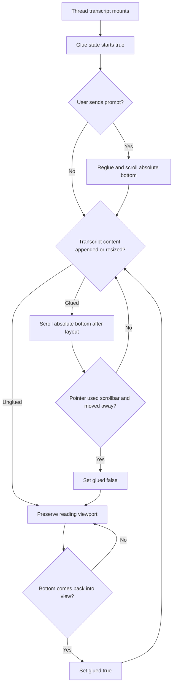

# fix: Make transcript bottom glue explicit

## Overview

Replace the transcript's implicit "near bottom" follow behavior with an explicit
bottom-glue state. When a thread is glued, the transcript should keep chasing the
absolute bottom through prompt sends, streamed replies, thinking indicators, and
content height changes. The only action that unglues the transcript is explicit
scrollbar interaction that moves the user away from the bottom.

## Problem Frame

The current transcript scroll logic can stop following live content after a user
sends a prompt even though the user did not intentionally scroll away from the
bottom. `docs/brainstorms/2026-04-30-transcript-bottom-glue-requirements.md`
sharpens the earlier refresh-model requirements into a concrete state rule:
threads are born glued, prompt send reglues, bottom content growth stays pinned,
and true-to-false happens only through scrollbar interaction.

## Requirements Trace

- R1-R5. Add explicit `isGluedToBottom` behavior and make the existing
  jump-to-latest control reglue the transcript.
- R6-R8. Treat prompt send as an explicit reglue event, including sends with image
  attachments and queued/follow-up prompts.
- R9-R13. Keep following appended and bottom-growing content while glued; preserve
  reader position while intentionally unglued; preserve older-page prepend
  anchoring.
- R14-R15. Give bottom-following one transcript-level owner so callers only signal
  high-level intent.
- R16-R18. Add regression coverage for send-plus-live-following, bottom content
  growth, and explicit scrollbar escape behavior.

## Scope Boundaries

- Do not redesign thread refresh, transcript storage, app-server events, markdown
  rendering, image rendering, or approval/user-input rendering.
- Do not add transcript virtualization in this fix.
- Do not add a new scroll-management dependency unless implementation proves the
  local controller cannot satisfy the requirements.
- Do not add new user-facing copy beyond preserving the existing jump-to-latest
  affordance.

## Context & Research

### Relevant Code and Patterns

- `apps/desktop/src/renderer/src/features/thread-detail/TranscriptList.tsx`
  currently owns scroll refs, saved viewport snapshots, bottom detection, prepend
  anchoring, pending transcript item insertion, and the jump-to-latest button.
- `apps/desktop/src/renderer/src/features/thread-detail/ThreadView.tsx` passes the
  selected thread key, restored viewport, pending items, and composer callbacks into
  `TranscriptList`.
- `apps/desktop/src/renderer/src/features/composer/Composer.tsx` owns user send
  lifecycle and already calls into thread state for optimistic user messages.
- `apps/desktop/src/renderer/src/lib/useThreadSessionState.ts` stores the selected
  thread viewport as renderer-local session state.
- `apps/desktop/src/renderer/src/features/thread-detail/__tests__/transcript-list.test.tsx`
  already has scroll anchoring tests for initial bottom open, saved viewport
  restore, append while bottom-pinned, and append while reading older content.
- `apps/desktop/e2e/live-agent-messages.spec.ts` reproduces the live replay shape
  shown in the screenshot: prompt send, thinking status, multiple live replies, and
  final turn completion.
- `apps/desktop/e2e/thread-open-scroll-stability.spec.ts` and
  `apps/desktop/e2e/thread-scroll-restore.spec.ts` cover long-transcript opening
  and saved viewport stability.

### Institutional Learnings

- No matching `docs/solutions/` entry was found for transcript scroll or viewport
  behavior.

### External References

- React Virtuoso supports `followOutput` and bottom-state callbacks, but adopting it
  would be a larger list rewrite than this bug needs.
- `use-stick-to-bottom` is purpose-built for AI chat and ResizeObserver-based
  bottom sticking, but its default cancellation behavior treats general user
  scrolling as unglue intent, which is broader than this product requirement.
- `react-scroll-to-bottom` exposes sticky state and scroll-to-bottom hooks, but it
  is also position/stickiness driven rather than the explicit scrollbar-only intent
  rule required here.

## Key Technical Decisions

- Keep the fix local to the transcript surface: implement a small transcript-scroll
  controller or hook used by `TranscriptList` instead of adopting a new list
  package.
- Persist glue state with the saved viewport state so switching threads preserves
  the difference between "glued, restore to bottom" and "intentionally unglued,
  restore this older viewport."
- Detect unglue intent from pointer interaction with the transcript scrollbar
  region, then confirm the resulting scroll position is away from the bottom.
  Wheel, trackpad, keyboard, programmatic scroll, and layout-induced scroll events
  should update visibility affordances but not flip glue from true to false.
- Use a bottom content observer, likely `ResizeObserver` on an inner content wrapper
  plus existing layout effects, so streamed text, image loading, markdown wrapping,
  and pending-status growth keep pinned while glued without every caller issuing
  scroll commands.
- Introduce one high-level "reglue now" signal for user-send events. The composer or
  thread view should trigger that signal when the user starts a turn, but low-level
  live update handling stays inside the transcript controller.

## Open Questions

### Resolved During Planning

- Should this use a third-party scroll widget? No. The local controller is a better
  first fix because the required unglue rule is stricter than the researched
  packages' default user-scroll cancellation behavior.
- Should prompt send rely on the next appended optimistic message to scroll? No.
  Sending must be an explicit reglue event because it must override a previously
  unglued viewport.
- Should older-page prepend anchoring be replaced? No. It already has targeted
  coverage and should be preserved as an invariant.

### Deferred to Implementation

- The exact scrollbar-hit test for Electron overlay and non-overlay scrollbars:
  implementation should validate the coordinate heuristic against the renderer
  behavior and adjust without changing the product rule.
- The exact shape of the controller API: implementation may choose a local hook,
  helper object, or small component-local reducer as long as `TranscriptList`
  remains the owner.

## High-Level Technical Design

> *This illustrates the intended approach and is directional guidance for review, not implementation specification. The implementing agent should treat it as context, not code to reproduce.*

## Implementation Units

- [x] **Unit 1: Lock the failure down with focused scroll tests**

**Goal:** Add tests that express the stricter bottom-glue contract before changing
implementation behavior.

**Requirements:** R1-R5, R9-R13, R16-R18

**Dependencies:** None

**Files:**
- Modify: `apps/desktop/src/renderer/src/features/thread-detail/__tests__/transcript-list.test.tsx`
- Modify or create: `apps/desktop/e2e/live-agent-messages.spec.ts`
- Optional create: `apps/desktop/e2e/thread-bottom-glue.spec.ts`

**Approach:**
- Extend the existing unit scroll tests to distinguish "scroll position changed"
  from "user explicitly unglued with the scrollbar."
- Add a unit test where non-scrollbar scroll or layout growth moves the element
  away from bottom, then a live append/resize still snaps back because glue stayed
  true.
- Add a unit test where a scrollbar pointer interaction moves away from bottom,
  then live append preserves the older viewport and shows jump-to-latest.
- Add or extend E2E coverage around the live-agent replay so each reply advance
  verifies the transcript is still at the absolute bottom.

**Execution note:** Start test-first. At least one test should fail against the
current implementation before Unit 2 changes behavior.

**Patterns to follow:**
- Scroll sampling helpers in `apps/desktop/e2e/thread-open-scroll-stability.spec.ts`.
- Replay advancement pattern in `apps/desktop/e2e/live-agent-messages.spec.ts`.
- Mocked scroll metrics in
  `apps/desktop/src/renderer/src/features/thread-detail/__tests__/transcript-list.test.tsx`.

**Test scenarios:**
- Happy path: newly opened transcript starts at bottom and has no jump-to-latest
  button.
- Happy path: after send plus multiple live reply advances, `scrollHeight -
  clientHeight - scrollTop` remains within the bottom threshold.
- Edge case: changing `scrollTop` and dispatching a generic scroll event while glued
  does not unglue; the next append returns to the bottom.
- Edge case: pointer interaction in the scrollbar region followed by a scroll away
  unglues; the next append preserves `scrollTop`.
- Edge case: bottom content height increases after initial render while glued; the
  viewport moves to the new absolute bottom.

**Verification:**
- The new unit or E2E test suite demonstrates the current regression before the
  implementation change and describes the desired behavior without relying on
  arbitrary timeouts.

- [x] **Unit 2: Add explicit bottom-glue ownership to the transcript list**

**Goal:** Replace implicit bottom-following with a transcript-owned glue state and
content growth observer.

**Requirements:** R1-R5, R9-R15, R18

**Dependencies:** Unit 1

**Files:**
- Modify: `apps/desktop/src/renderer/src/features/thread-detail/TranscriptList.tsx`
- Modify: `apps/desktop/src/renderer/src/features/thread-detail/__tests__/transcript-list.test.tsx`
- Modify: `apps/desktop/src/renderer/src/styles/app.css` only if an inner content
  wrapper needs styling to preserve current layout.

**Approach:**
- Introduce an explicit glued state/ref initialized to true per thread.
- Separate "is content below visible?" from "is the transcript glued?" The former
  drives the jump button; the latter drives whether appends/resizes force bottom.
- Add a content wrapper or equivalent observable bottom surface so resize events
  caused by image load, markdown layout, or streaming text can request bottom
  pinning while glued.
- Preserve existing prepend anchoring by handling older-message prepends before
  bottom-follow decisions.
- Ensure the jump-to-latest button scrolls to bottom and sets glue true.
- Treat generic scroll events as metric updates only. They may set glue true when
  the bottom comes into view, but they do not set glue false unless a prior
  scrollbar pointer interaction marked that scroll as explicit unglue intent.

**Patterns to follow:**
- Existing `captureSnapshot`, saved viewport, and prepend anchoring flow in
  `TranscriptList.tsx`.
- Current tests around `hasContentBelow` and smooth scrolling only for explicit
  jump-to-latest.

**Test scenarios:**
- Happy path: append and resize while glued update `scrollTop` to the latest
  `scrollHeight`.
- Happy path: jump-to-latest smooth-scrolls and marks the transcript glued.
- Edge case: prepending older messages preserves scroll position and does not
  accidentally force bottom when unglued.
- Edge case: thread switch restores a glued thread to bottom and restores an
  intentionally unglued thread to its saved older viewport.
- Edge case: pending request, pending user input, pending activity, and pending
  assistant message all participate in item count/growth tracking.

**Verification:**
- Existing transcript-list tests still pass, and the new bottom-glue tests pass
  without weakening the older viewport preservation assertions.

- [x] **Unit 3: Wire prompt send to reglue without scattering scroll calls**

**Goal:** Make user send explicitly reglue and scroll bottom before live reply
content begins, including prompts with image attachments.

**Requirements:** R6-R8, R14-R15

**Dependencies:** Unit 2

**Files:**
- Modify: `apps/desktop/src/renderer/src/features/thread-detail/ThreadView.tsx`
- Modify: `apps/desktop/src/renderer/src/features/composer/Composer.tsx`
- Modify: `apps/desktop/src/renderer/src/lib/useThreadSessionState.ts`
- Modify: `apps/desktop/src/renderer/src/App.tsx` if the reglue signal belongs in
  session state props.
- Test: `apps/desktop/src/renderer/src/features/thread-detail/__tests__/thread-view.test.tsx`
- Test: `apps/desktop/src/renderer/src/features/thread-detail/__tests__/transcript-list.test.tsx`

**Approach:**
- Add a single high-level reglue signal, such as a monotonically increasing request
  key or explicit viewport state update, that `TranscriptList` consumes.
- Trigger that signal from the user-send path when a turn starts or when the
  optimistic user message is added.
- Keep live event handlers and pending item rendering free of direct scroll calls;
  they should rely on the transcript controller once glue is true.
- Extend renderer-local viewport state to carry glue intent if needed for thread
  switching and reselect behavior.

**Patterns to follow:**
- Existing composer callbacks for optimistic messages and pending status updates.
- `useThreadSessionState.setViewport` as the current renderer-session persistence
  point for transcript viewport state.

**Test scenarios:**
- Happy path: sending a prompt while already at bottom keeps the prompt visible and
  follows the pending "Thinking" state.
- Happy path: sending a prompt while intentionally unglued reglues and follows the
  new turn.
- Edge case: prompt with image attachment remains fully visible after send and does
  not require a second caller-level scroll after image sizing.
- Edge case: queued/follow-up send reglues the transcript before its assistant reply
  grows.

**Verification:**
- User-send behavior works through a single reglue signal, not repeated low-level
  scroll calls spread across composer, thread view, and live event handlers.

- [x] **Unit 4: Prove the live desktop regression end to end**

**Goal:** Verify the fixed behavior in the Electron replay harness against the
actual send/live-update flow that exposed the bug.

**Requirements:** R6-R18

**Dependencies:** Units 1-3

**Files:**
- Modify: `apps/desktop/e2e/live-agent-messages.spec.ts`
- Optional create: `apps/desktop/e2e/thread-bottom-glue.spec.ts`
- Optional modify: `apps/desktop/e2e/fixtures/live-agent-messages/replay.fixture.json`
- Optional create: `apps/desktop/e2e/fixtures/thread-bottom-glue/replay.fixture.json`

**Approach:**
- Prefer extending `live-agent-messages.spec.ts` if it can assert bottom position
  without making the existing transcript-order test brittle.
- If the spec becomes too dense, create a focused `thread-bottom-glue.spec.ts` that
  uses the same replay patterns and keeps assertions only about scroll behavior.
- Include a bottom-growing visual item in the E2E path where practical. If image
  loading is too nondeterministic in replay, cover image growth at unit level and
  use live pending/markdown growth in E2E.
- Add the explicit scrollbar escape E2E only if Playwright can drive the scrollbar
  deterministically in Electron. Otherwise keep that path covered in unit tests and
  document the limitation in the plan notes during implementation.

**Patterns to follow:**
- `apps/desktop/e2e/thread-open-scroll-stability.spec.ts` for stable scroll metric
  sampling.
- `apps/desktop/e2e/live-agent-messages.spec.ts` for replay turn advancement.
- `apps/desktop/e2e/thread-image-fit.spec.ts` for transcript image rendering setup.

**Test scenarios:**
- Integration: send prompt, see optimistic user prompt at bottom, see Thinking at
  bottom, advance several assistant/tool steps, and verify bottom distance remains
  within threshold after each step.
- Integration: final turn completion collapses work activity as today without
  leaving the final answer below the viewport.
- Integration: explicit jump-to-latest after unglue returns to bottom and resumes
  following.
- Integration: if supported by Playwright, scrollbar drag away from bottom prevents
  automatic pull-down on the next live append.

**Verification:**
- Targeted desktop E2E passes and would have failed against the screenshot failure
  mode.

## System-Wide Impact

- **Interaction graph:** Composer sends and live thread updates become high-level
  inputs to a transcript-owned scroll controller. They should not gain direct
  ownership of bottom-following.
- **Error propagation:** Scroll controller failures should degrade to existing
  visible transcript behavior, not block prompt sending or live event rendering.
- **State lifecycle risks:** Saved viewport state must distinguish glued and
  intentionally unglued threads so thread reselect does not erase user reading
  position or fail to restore bottom-following.
- **API surface parity:** This is renderer-local; no app-server or shared backend
  contract changes are expected.
- **Integration coverage:** Unit tests prove state transitions; Electron E2E proves
  the real replay/send/live path.
- **Unchanged invariants:** Older-message prepend anchoring, thread cache behavior,
  pending approval rendering, pending user input rendering, and transcript item
  ordering remain unchanged.

## Risks & Dependencies

| Risk | Mitigation |
|------|------------|
| Scrollbar hit testing differs across macOS overlay scrollbar settings. | Keep the product rule stable, isolate the heuristic in one helper, and cover what can be simulated in unit tests plus Playwright where deterministic. |
| ResizeObserver timing causes flaky tests. | Keep unit tests deterministic by exposing or mocking observer callbacks; in E2E, assert eventual bottom position with existing polling helpers. |
| Reglue signal gets coupled to composer internals. | Route send intent through one prop/session signal and keep low-level scrolling inside `TranscriptList`. |
| Fix regresses older viewport restore. | Preserve and extend existing restore tests before changing behavior. |

## Documentation / Operational Notes

- No user-facing documentation changes are required.
- Keep the requirements doc and this plan linked in the PR body so future scroll
  regressions have an explicit product contract to reference.

## Sources & References

- **Origin document:** `docs/brainstorms/2026-04-30-transcript-bottom-glue-requirements.md`
- Prior related requirements: `docs/brainstorms/2026-04-18-desktop-thread-refresh-model-requirements.md`
- Related code: `apps/desktop/src/renderer/src/features/thread-detail/TranscriptList.tsx`
- Related code: `apps/desktop/src/renderer/src/features/thread-detail/ThreadView.tsx`
- Related code: `apps/desktop/src/renderer/src/features/composer/Composer.tsx`
- Related tests: `apps/desktop/src/renderer/src/features/thread-detail/__tests__/transcript-list.test.tsx`
- Related tests: `apps/desktop/e2e/live-agent-messages.spec.ts`
- External docs: https://virtuoso.dev/react-virtuoso/api-reference/virtuoso/
- External docs: https://github.com/stackblitz-labs/use-stick-to-bottom
- External docs: https://app.unpkg.com/react-scroll-to-bottom-updated%404.2.1-main.b8336f2/files/README.md
