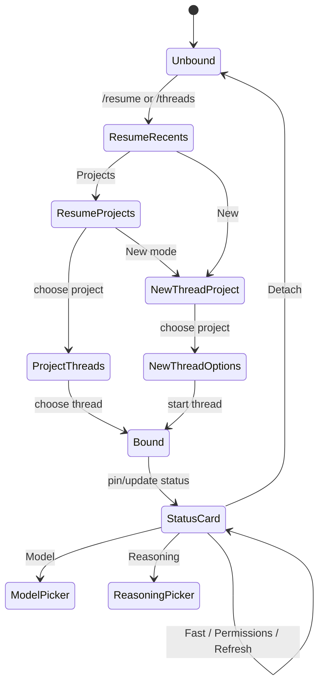
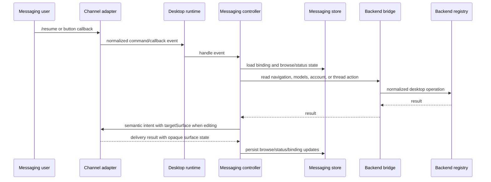
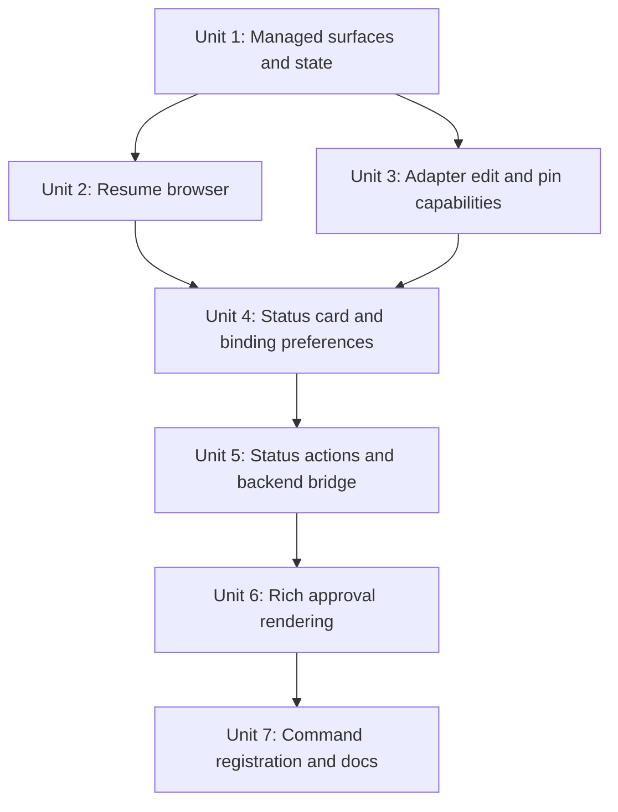

# feat: Add messaging command surfaces

## Overview

Deepen the messaging integration from a basic `/threads` binding flow into the command surfaces that made the previous Codex Telegram integration useful: `/resume` for browsing and binding threads, `/status` for a pinned per-chat control card, richer approval prompts, and button-driven configuration for model, reasoning, fast mode, permissions, compact, stop, refresh, and detach.

The existing PR already establishes the right foundation: shared messaging contracts, an agent-core controller and store, desktop runtime configuration, Telegram and Discord adapters, opaque Telegram callback handles, authorization by stable platform user IDs, and basic markdown/image rendering. This plan adds the missing product behavior without turning workflow code into Telegram-specific code.

## Problem Frame

The current implementation answers Telegram messages and can bind a conversation to a thread, but it does not yet recreate the old browser-like Telegram UX. The symptoms are visible in manual testing: the bot can present a Threads button, but the flow is too shallow, actions can expire into generic errors, and the command menu still feels unlike the intended PwrAgent surface.

The user wants the old Codex/OpenClaw behavior as the baseline:

- `/resume` opens recent threads by default, can switch to Projects, can browse project-specific thread lists, can start a new thread, and should support Local and New Worktree choices.
- `/status` renders and pins a binding status card after a thread is resumed, updates it in place where the channel supports editing, and unpins it on detach.
- Status buttons should repaint the same managed surface for model and reasoning pickers, and directly toggle fast mode and Default Access / Full Access.
- Approval prompts should make the command clear with markdown/code formatting and preserve button plus text fallback decisions.

This remains a messaging-surface problem, not a Telegram one-off. Telegram is the first parity target because it is configured and testable, but the added abstractions should also let Discord and future adapters expose the same flow with their own rendering policy.

## Requirements Trace

- R1-R6. Extend the channel-agnostic surface contract with managed surface lifecycle, update/pin/dismiss capabilities, and opaque adapter-owned state for rewritten and pinned messages.
- R7-R12. Support project/thread enumeration, new-thread start, binding replacement, detach, and restart recovery with status surface state attached to the binding.
- R13-R17. Deliver rich Telegram/Discord workflow parity for resume browsing, project filtering, pagination, status panels, approvals, markdown, code formatting, and button navigation.
- R18-R22. Preserve text fallback for buttons, including numeric picker choices, Back/Next, approval words, and free-form instruction pass-through.
- R23-R27. Keep Telegram and Discord as the first adapters while expressing edit, pin, component, markdown, and fallback differences as adapter capability handling.
- R31-R36. Preserve stable actor authorization, reject untrusted callbacks/text, avoid secrets in stored state, and keep audit context for approval decisions and binding mutations.

## Scope Boundaries

- In scope: `/resume`, `/threads` aliasing, `/status`, `/detach`, recent thread browsing, project browsing, project-specific thread browsing, new-thread launch from a project, Local/New Worktree launch choices when supported by existing navigation metadata, managed message update semantics, pinned status surfaces, status action callbacks, and improved approval rendering.
- In scope: Telegram edit/pin/unpin command-surface parity first, plus channel-neutral contracts and controller logic that Discord can use as its adapter grows.
- In scope: using existing backend registry capabilities for thread start, turn start, interruption, compaction, model lists, account/rate-limit reads, and directory navigation where those are already exposed or naturally bridged.
- Out of scope: every historical OpenClaw command, including skills, MCP browsers, review, rename, diff, init, and sync-topic behavior.
- Out of scope: a settings screen. Configuration remains environment/1Password driven for now.
- Out of scope: webhook transport, hosted bot infrastructure, the future iOS app, CarPlay UI, and a remote-view protocol.
- Out of scope: forwarding inbound Telegram/Discord media as agent attachments. This plan only improves outbound rich rendering and command approvals.

## Context & Research

### Relevant Code and Patterns

- `docs/plans/2026-04-30-001-feat-messaging-platform-integration-plan.md` defines and completed the first integration layer. This plan is a follow-up, not a replacement.
- `packages/shared/src/contracts/messaging.ts` already defines semantic surface intents, inbound events, delivery outcomes, opaque adapter state, and `targetSurface`.
- `packages/agent-core/src/messaging/messaging-controller.ts` currently handles `/threads`, `/thread`, `/bind`, free-form text routing, simple binding callbacks, assistant output, questionnaires, and approvals.
- `packages/agent-core/src/messaging/messaging-store.ts` persists bindings, pending intents, and deliveries with redaction, but not browse sessions, binding preferences, active turn metadata, or pinned status surface refs.
- `packages/agent-core/src/messaging/messaging-renderer.ts` builds the current simple thread picker, status, confirmation, error, questionnaire, and approval intents.
- `apps/desktop/src/main/messaging/desktop-backend-bridge.ts` currently exposes navigation snapshots, `startTurn`, and `submitServerRequest`; richer command surfaces need additional bridge operations from the backend registry.
- `apps/desktop/src/main/app-server/backend-registry.ts` already has useful methods for thread start, turn start, turn interrupt, submit server request, model/account/rate-limit data, and directory/status overlays.
- `apps/desktop/src/main/messaging/telegram-api.ts` already has `setMyCommands`, `getUpdates`, `sendMessage`, `editMessageText`, `sendPhoto`, and `answerCallbackQuery`, but not pin/unpin or reply-markup-only edits.
- `apps/desktop/src/main/messaging/telegram-adapter.ts` already clears configured webhooks for local polling, registers only `threads` and `bind`, stores in-memory short callback handles, and always sends new messages instead of editing target surfaces.
- `apps/desktop/src/main/messaging/telegram-formatting.ts` already converts light markdown to Telegram HTML, chunks long messages, and builds inline keyboard rows.
- `apps/desktop/src/main/__tests__/telegram-adapter.test.ts`, `apps/desktop/src/main/__tests__/telegram-formatting.test.ts`, and `packages/agent-core/src/__tests__/messaging-controller.test.ts` provide the existing test harnesses to expand.

### Institutional Learnings

- `docs/brainstorms/2026-04-30-openclaw-codex-conversation-ui-intent-interface-source.md` is valid source material for semantic intents, opaque surface IDs, and best-effort lifecycle semantics.
- `docs/plans/2026-04-20-001-feat-plan-questionnaire-navigation-plan.md` established that interactive request flows should use pure state and response builders rather than platform-specific UI code.
- `docs/plans/2026-04-28-001-feat-desktop-mcp-request-support-plan.md` reinforced that security-sensitive pending requests need distinct response shapes, preserved request context, and explicit cross-layer tests.
- External prior art from the local OpenClaw App Server checkout shows useful behavior to borrow conceptually: parsed `/resume` flags, project grouping, paginated picker sessions, pinned binding messages, status-card subviews, permissions mode persistence, and approval command display cleanup. The implementation shape should not be copied wholesale because PwrAgent already has a cleaner shared surface boundary.

### External References

- Telegram Bot API supports removing webhooks before `getUpdates`, and notes that `getUpdates` cannot be used while a webhook is configured: https://core.telegram.org/bots/api
- Telegram Bot API supports editing message text and reply markup, including inline keyboards, through `editMessageText` and `editMessageReplyMarkup`: https://core.telegram.org/bots/api
- Telegram Bot API supports bot command registration through `setMyCommands` and chat pinning through `pinChatMessage` / `unpinChatMessage`: https://core.telegram.org/bots/api
- Telegram inline keyboard callback data remains limited, so adapter-owned short callback handles must continue to back stored PwrAgent interaction state: https://core.telegram.org/bots/api
- Discord supports message editing, pins, and interactive message components with developer-defined `custom_id` values: https://docs.discord.com/developers/resources/message and https://docs.discord.com/developers/components/reference
- Discord interactions carry the user/channel/message/component context needed to authorize and route button callbacks: https://docs.discord.com/developers/interactions/receiving-and-responding

## Key Technical Decisions

- **Make `/resume` the primary command surface and keep `/threads` as an alias.** `/threads` proved useful for the MVP, but the richer workflow should match the old muscle memory and current user ask. Aliasing keeps existing testers unblocked.
- **Model browser state separately from pending request state.** Resume/project navigation should use a durable `browseSession` or equivalent record with page, mode, filters, selected project, launch action, target surface, and actor/channel scope. It should not overload approval/questionnaire pending intents.
- **Treat managed message editing as a surface capability, not a controller branch.** The controller should request "update this managed surface" by passing the previous `surfaceRef` or a richer delivery policy. Telegram can call edit APIs; weaker adapters can send a new message and report `presented_new`.
- **Persist callback handle resolution outside transient adapters.** Telegram callback payloads and Discord component IDs must remain short, but their mapping to action IDs, values, actor/channel scope, and expiration needs to survive process restart. The adapter may allocate handles, but the messaging store must be able to resolve them or invalidate them deterministically.
- **Store pinned status refs on bindings.** A binding owns the durable status card for that chat/thread pair. Detach should revoke the binding, dismiss or unpin the status card best-effort, and invalidate browse/status callbacks scoped to that binding.
- **Store binding preferences beside the binding.** Preferred model, reasoning effort, fast mode, execution mode, permissions mode, and launch defaults should survive restart and apply to future turns or new threads from that binding.
- **Use backend registry as the desktop bridge, not a direct app-server client.** Existing registry methods already normalize Codex/Grok differences and overlay state. The messaging bridge should expose the small command-surface operations it needs from that registry.
- **Keep Telegram first but generic enough for Discord.** Telegram gets edit/pin/unpin first because it is manually testable. Contracts should still name the generic capability: update, pin, unpin, answer callback, and fallback rendering.
- **Use deterministic text fallback before any model mapper.** Numeric choices, labels, yes/no/cancel, Back/Next, Model/Reasoning/Fast/Permissions words, and common voice variants should map without a model. Ambiguous free-form replies should still pass through to the bound agent when they are clearly new instructions.
- **Improve approval rendering without changing approval semantics.** The renderer should display command/file context clearly, strip display-only shell wrappers when safe, preserve the original request IDs and decisions, and submit exactly the backend response expected by the pending request.

## Open Questions

### Resolved During Planning

- **Should Chat SDK be reconsidered for this richer command surface?** No. The user explicitly wants to skip it, and the first PR already chose a PwrAgent-owned surface contract.
- **Should this be a settings-screen feature?** No. Bot setup and allowlists remain config/1Password driven for now. The command surfaces operate after the bot is configured.
- **Should `/resume` replace or complement `/threads`?** Complement. `/resume` becomes the documented primary command, while `/threads`, `/thread`, and `/bind` remain aliases into the same browse surface where reasonable.
- **Should status cards be Telegram-only?** No. The controller should own a generic status intent and stored status surface. Telegram implements pinning first; Discord can implement pinning/editing behind the same adapter methods.

### Deferred to Implementation

- Exact Local/New Worktree launch behavior should be mapped against current `NavigationDirectorySummary`, launchpad defaults, and backend registry worktree APIs during implementation.
- Exact model/reasoning option labels should come from backend model metadata, with conservative fallbacks only where registry data is unavailable.
- Exact Discord edit/pin behavior can follow Telegram after the generic contracts land; Discord-specific permission failures should degrade to unpinned updated/new messages.
- Exact approval body extraction must be validated against representative Codex pending request payloads, especially command execution, file change, and managed-network approvals.
- Whether status-card Skills/MCP buttons should render as disabled placeholders or be omitted is deferred. They are visible in prior art but are not in the current scope.

## High-Level Technical Design

> *This illustrates the intended approach and is directional guidance for review, not implementation specification. The implementing agent should treat it as context, not code to reproduce.*

## Implementation Units

- [x] **Unit 1: Add managed surface, browse session, and binding preference state**

**Goal:** Extend the shared/store model so command surfaces can be edited, pinned, resumed after process restart, and scoped to the correct actor/channel/binding.

**Requirements:** R1-R6, R11-R12, R16, R31-R36

**Dependencies:** Existing messaging contract and store from the first integration plan.

**Files:**
- Modify: `packages/shared/src/contracts/messaging.ts`
- Modify: `packages/agent-core/src/messaging/messaging-migrations.ts`
- Modify: `packages/agent-core/src/messaging/messaging-store.ts`
- Test: `packages/agent-core/src/__tests__/messaging-contract.test.ts`
- Test: `packages/agent-core/src/__tests__/messaging-store.test.ts`

**Approach:**
- Add explicit managed surface lifecycle concepts for update, dismiss, pin, and unpin outcomes, while preserving best-effort fallback for adapters that cannot edit or pin.
- Add browse-session records scoped by actor, channel, surface, mode, page, query/filter, selected project/directory, launch action, and expiration.
- Add callback-handle records scoped by actor, channel, intent/session, action ID, optional value, surface, and expiration. These records are the restart-safe source of truth when a platform callback arrives.
- Extend binding records with optional status surface ref, pinned status ref, active turn summary, preferences, permissions mode, and last known thread display metadata.
- Keep adapter state opaque. Store Telegram chat/message IDs and Discord channel/message IDs only inside adapter-owned state objects.
- Add migrations that preserve current bindings/pending intents/deliveries.

**Patterns to follow:**
- `packages/agent-core/src/messaging/messaging-store.ts`
- `packages/agent-core/src/messaging/messaging-migrations.ts`
- `packages/agent-core/src/persistence/migrations.ts`

**Test scenarios:**
- Happy path: an existing v1 messaging store migrates with current bindings and pending intents intact.
- Happy path: a browse session stores page, selected project, target surface, actor allowlist, and expiry without platform-specific fields in workflow-owned properties.
- Happy path: a short callback handle resolves to an action after store reload, including action ID, value, actor scope, channel scope, and expiry.
- Happy path: a binding stores preferred model, reasoning, fast mode, permissions mode, status surface, and pinned surface.
- Edge case: revoking a binding removes status/browse callbacks scoped to that binding without deleting unrelated channel sessions.
- Edge case: an expired or actor-mismatched callback handle fails closed and returns a refresh message.
- Error path: secret-looking keys inside opaque adapter state are redacted before persistence.
- Integration: a delivery result with a managed surface can be recorded and later used as the target surface for an update.

**Verification:**
- Store snapshots are restart-safe, redacted, and can represent both an unpinned browser surface and a pinned status surface.

- [x] **Unit 2: Build the channel-neutral `/resume` browser**

**Goal:** Replace the simple first-page thread picker with a browser-like resume flow for recents, projects, project-specific threads, and new-thread starts.

**Requirements:** R7-R12, R13, R16, R18-R22

**Dependencies:** Unit 1 browse-session state.

**Files:**
- Modify: `packages/agent-core/src/messaging/messaging-controller.ts`
- Modify: `packages/agent-core/src/messaging/messaging-renderer.ts`
- Create: `packages/agent-core/src/messaging/messaging-resume-browser.ts`
- Modify: `packages/agent-core/src/messaging/deterministic-interaction-mapper.ts`
- Test: `packages/agent-core/src/__tests__/messaging-controller.test.ts`
- Test: `packages/agent-core/src/__tests__/messaging-resume-browser.test.ts`

**Approach:**
- Parse `/resume` and `/threads` into the same command flow, including `--projects`, `--new`, `--cwd`, `--model`, `--fast`, `--no-fast`, `--yolo`, `--no-yolo`, and positional filters where the current data model can support them.
- Normalize Unicode dash variants before flag parsing so voice/dictation or rich clients do not break command flags.
- Use navigation snapshots as the source of truth for Recents and Directories. Group project choices by directory/project label and show thread counts.
- Preserve project context in the thread-list text after a project is selected.
- Use browse-session callbacks for Previous, Next, Projects, Recent Threads, New, Local, New Worktree, Cancel, and item selection.
- Bind an existing selected thread to the conversation and hand off status-card creation to Unit 4.
- For new thread start, select a directory/project first, then start the thread through the backend bridge with stored launch preferences.
- Keep text fallback behavior: numbers choose visible items, "next"/"back"/"projects"/"recent"/"new"/"cancel" activate controls, and unrelated text passes through if already bound.

**Patterns to follow:**
- `packages/shared/src/contracts/navigation.ts`
- `apps/desktop/src/main/messaging/desktop-backend-bridge.ts`
- `packages/agent-core/src/messaging/deterministic-interaction-mapper.ts`

**Test scenarios:**
- Happy path: `/resume` shows recent threads with item buttons, Next, Projects, New, and Cancel.
- Happy path: `/threads` and `/bind` alias to the same recent-thread browser.
- Happy path: Projects switches the same browse session into project mode and renders project labels plus thread counts.
- Happy path: selecting a project renders threads only for that project and includes the project name in the message body.
- Happy path: selecting a thread binds the conversation and requests a status-card render.
- Happy path: `/resume --new` opens a project picker for new-thread start.
- Happy path: selecting a project in new-thread mode starts a thread with the selected directory and saved preferences.
- Edge case: empty recents renders a useful empty state and still offers Projects/New/Cancel where possible.
- Edge case: stale browse callbacks return a refreshable expired-action message that points to `/resume`, not `/threads`.
- Error path: unauthorized users cannot enumerate threads or use browse callbacks.
- Integration: button callbacks and text replies for the same visible option produce the same binding or navigation outcome.

**Verification:**
- The controller can drive the complete resume browser with a fake adapter, without Telegram or Discord fields leaking into rendered intents.

- [x] **Unit 3: Add adapter edit, pin, unpin, and command registration capabilities**

**Goal:** Let adapters render command surfaces as managed messages instead of one-off messages, with Telegram implementing edit/pin/unpin first.

**Requirements:** R5-R6, R13, R23-R27, R35

**Dependencies:** Unit 1 managed surface state.

**Files:**
- Modify: `packages/agent-core/src/messaging/messaging-adapter.ts`
- Modify: `apps/desktop/src/main/messaging/telegram-api.ts`
- Modify: `apps/desktop/src/main/messaging/telegram-adapter.ts`
- Modify: `apps/desktop/src/main/messaging/telegram-formatting.ts`
- Modify: `apps/desktop/src/main/messaging/discord-api.ts`
- Modify: `apps/desktop/src/main/messaging/discord-adapter.ts`
- Test: `apps/desktop/src/main/__tests__/telegram-adapter.test.ts`
- Test: `apps/desktop/src/main/__tests__/telegram-formatting.test.ts`
- Test: `apps/desktop/src/main/__tests__/discord-adapter.test.ts`

**Approach:**
- Extend the adapter interface with generic surface operations or delivery policies for update, pin, unpin, and dismiss. Use capability-driven best effort so adapters can degrade to a fresh message.
- Telegram should use `editMessageText` for text+keyboard updates, add `editMessageReplyMarkup` when only buttons need repainting, and add `pinChatMessage` / `unpinChatMessage` for status cards.
- If Telegram edit fails because the message is gone, too old, or no longer editable, send a fresh message and return `presented_new` with the new surface ref.
- If pin/unpin fails because the bot lacks permission, keep the status surface functional but report the pin outcome as unsupported/failed without killing the binding.
- Register PwrAgent commands on startup: `resume`, `threads`, `status`, `detach`, and `bind` at minimum. Avoid old OpenClaw command names.
- Keep callback payloads short and opaque; do not put thread IDs, project paths, model IDs, or decisions directly into Telegram `callback_data`.
- Replace or wrap the current in-memory Telegram callback map with persisted callback-handle records so buttons on edited or pinned messages still resolve after app restart.
- Add Discord edit/pin methods behind the same adapter capability where straightforward, but allow Telegram to be the first complete implementation.

**Patterns to follow:**
- `apps/desktop/src/main/messaging/telegram-adapter.ts`
- `apps/desktop/src/main/messaging/telegram-api.ts`
- `apps/desktop/src/main/messaging/discord-adapter.ts`
- `apps/desktop/src/main/messaging/discord-api.ts`

**Test scenarios:**
- Happy path: Telegram delivers a targeted update by calling edit APIs instead of sending a new message.
- Happy path: Telegram pins a status surface and stores the returned surface state.
- Happy path: Telegram unpins the stored status surface on detach.
- Happy path: startup registers `resume`, `threads`, `status`, `detach`, and `bind`.
- Edge case: callback handles remain within Telegram's callback byte limit and do not contain raw thread or project identifiers.
- Error path: edit failure falls back to `sendMessage` and returns a new surface.
- Error path: pin permission failure does not fail the binding or status render.
- Integration: clicking a button on an edited Telegram message still resolves to the stored action.
- Integration: clicking a button after adapter restart resolves through the persisted callback-handle record or fails closed with the intended expired-action copy.

**Verification:**
- Telegram can support browser-like message rewriting and pinned status cards with graceful fallback when a client/server rejects an operation.

- [x] **Unit 4: Add pinned `/status` card and binding preference rendering**

**Goal:** Render the current binding as a durable control card that can be pinned, refreshed, updated in place, and unpinned on detach.

**Requirements:** R8-R13, R15, R31-R36

**Dependencies:** Units 1-3.

**Files:**
- Modify: `packages/shared/src/contracts/messaging.ts`
- Modify: `packages/agent-core/src/messaging/messaging-controller.ts`
- Modify: `packages/agent-core/src/messaging/messaging-renderer.ts`
- Create: `packages/agent-core/src/messaging/messaging-status-card.ts`
- Modify: `packages/agent-core/src/messaging/messaging-store.ts`
- Test: `packages/agent-core/src/__tests__/messaging-controller.test.ts`
- Test: `packages/agent-core/src/__tests__/messaging-status-card.test.ts`

**Approach:**
- Add `/status` command handling that requires an active binding unless it is being used to report "not bound".
- Automatically render and pin the status card after a successful resume/bind/new-thread start.
- Store the status surface ref and pinned ref on the binding. Later refreshes should update that surface where supported.
- Include binding title, project/directory/worktree context, model, reasoning, fast mode, plan mode when known, context usage when known, permissions mode, account summary, rate-limit summary, thread ID, and active turn state where available.
- Subscribe to backend events that materially affect status: turn started/completed/failed/interrupted, thread status changes, pending requests, compaction progress, and rate-limit/account updates where available.
- Render buttons for Model, Reasoning, Fast toggle, Permissions toggle, Compact, Stop, Refresh, and Detach. Skills/MCPs remain out of scope until those browsers are planned.
- On detach, revoke the binding, unpin/dismiss the status card best-effort, and stop routing plain text from that conversation.
- Keep status text useful even when account, rate-limit, or context usage data is unavailable.

**Patterns to follow:**
- `packages/agent-core/src/messaging/messaging-renderer.ts`
- `apps/desktop/src/main/app-server/backend-registry.ts`
- `packages/shared/src/contracts/backend.ts`

**Test scenarios:**
- Happy path: selecting a thread through `/resume` creates a binding, renders a status card, and requests pinning.
- Happy path: `/status` updates the existing status surface instead of posting a duplicate when a surface ref exists.
- Happy path: `/detach` revokes the binding and unpins or dismisses the status card.
- Happy path: status text includes thread title/id, project context, model, reasoning, fast mode, permissions, and account/rate-limit data when present.
- Edge case: missing account/rate-limit/context data renders a clear unavailable value, not an exception or blank card.
- Edge case: unbound `/status` explains how to use `/resume`.
- Error path: unauthorized actors cannot refresh, detach, or toggle status controls.
- Integration: process restart can reload a binding with a status surface ref and update it on the next `/status`.
- Integration: backend turn lifecycle events update active-turn status on the pinned card without requiring a user command.

**Verification:**
- A bound Telegram chat has one durable status card, not a trail of duplicated status messages, while still falling back safely if edits or pins fail.

- [x] **Unit 5: Implement status action callbacks through the backend bridge**

**Goal:** Make the status card controls actually change binding/thread behavior and repaint the same card or subview.

**Requirements:** R10-R13, R18-R22, R31-R36

**Dependencies:** Unit 4 status card.

**Files:**
- Modify: `packages/agent-core/src/messaging/messaging-adapter.ts`
- Modify: `packages/agent-core/src/messaging/messaging-controller.ts`
- Modify: `packages/agent-core/src/messaging/messaging-status-card.ts`
- Modify: `apps/desktop/src/main/messaging/desktop-backend-bridge.ts`
- Modify: `apps/desktop/src/main/app-server/backend-registry.ts`
- Test: `packages/agent-core/src/__tests__/messaging-controller.test.ts`
- Test: `apps/desktop/src/main/__tests__/backend-registry.test.ts`

**Approach:**
- Extend the messaging backend bridge with only the operations the status card needs: start thread, read models, read account, read rate limits, interrupt active turn, start compaction, and update thread/binding model settings where existing registry methods support it.
- Model and Reasoning buttons should rewrite the status card into a picker subview. Selecting an option stores the binding preference, applies it to the thread/overlay where available, and rewrites back to status.
- Fast mode should toggle directly if supported by the current/selected model, otherwise report why it is unavailable.
- Permissions should toggle between Default Access and Full Access by mapping to existing execution mode/sandbox/approval policy concepts. Store a first-class permissions mode on the binding rather than only raw backend policy strings.
- Compact should start the existing compaction flow when available and update status/progress as events arrive.
- Stop should interrupt the active turn only when a known turn is running; otherwise it should refresh status with an inactive explanation.
- Refresh should reread thread/account/rate-limit/model state and repaint the status card.
- Apply saved binding preferences to future free-form `startTurn` calls and new threads started from `/resume --new`.

**Patterns to follow:**
- `apps/desktop/src/main/app-server/backend-registry.ts`
- `packages/shared/src/generated/codex-app-server-protocol/v2/ThreadStartParams.ts`
- `packages/shared/src/generated/codex-app-server-protocol/v2/TurnStartParams.ts`
- `packages/shared/src/generated/codex-app-server-protocol/v2/AskForApproval.ts`

**Test scenarios:**
- Happy path: Model opens a model picker and selecting a model stores the preference and repaints status.
- Happy path: Reasoning opens a reasoning picker and selecting high/medium/low stores the preference and repaints status.
- Happy path: Fast toggles on/off and future bound text turns include the chosen fast setting where supported.
- Happy path: Permissions toggles Default Access to Full Access and back, preserving a simple binding-level mode.
- Happy path: Stop calls the backend interrupt path for the active turn.
- Happy path: Compact calls the backend compaction path and reflects started/completed/failed state.
- Edge case: a model without fast support disables or explains Fast rather than storing an impossible preference.
- Edge case: missing full-access backend mode leaves permissions unchanged and reports the limitation.
- Error path: stale status action callbacks report expiration and point to `/status`.
- Integration: preferences set through status actions are applied to a later free-form text turn from the bound chat.

**Verification:**
- Status controls mutate real PwrAgent binding/thread behavior and the visible card remains coherent after each callback.

- [x] **Unit 6: Improve rich approval prompt rendering and action handling**

**Goal:** Make approval prompts usable from Telegram/Discord with clear markdown/code display, decision buttons, and text fallback.

**Requirements:** R13-R15, R18-R22, R31-R36

**Dependencies:** Unit 3 adapter update capabilities are useful but not strictly required.

**Files:**
- Modify: `packages/agent-core/src/messaging/messaging-renderer.ts`
- Create: `packages/agent-core/src/messaging/messaging-approval-renderer.ts`
- Modify: `packages/agent-core/src/messaging/deterministic-interaction-mapper.ts`
- Modify: `apps/desktop/src/main/messaging/telegram-formatting.ts`
- Modify: `apps/desktop/src/main/messaging/discord-formatting.ts`
- Test: `packages/agent-core/src/__tests__/messaging-controller.test.ts`
- Test: `packages/agent-core/src/__tests__/messaging-approval-renderer.test.ts`
- Test: `apps/desktop/src/main/__tests__/telegram-formatting.test.ts`
- Test: `apps/desktop/src/main/__tests__/discord-formatting.test.ts`

**Approach:**
- Render command execution approvals with a clear title, short reason/prompt, code block for the command, and choices.
- Preserve file change approval context, writable-root context, and available decision labels where the backend request includes them.
- Strip display-only shell wrappers only for presentation; never alter the request context or submitted decision.
- Prefer backend-provided decisions where available. Otherwise provide conservative Allow, Allow for session, Decline, and Cancel choices.
- Keep text fallback explicit: "1", "2", "yes", "yes for this session", "no", "cancel", and reasonable voice variants.
- After a decision, update or reply with a short confirmation and invalidate the pending approval.
- Make expired approval copy say to retry the command/request, not to refresh `/threads`.

**Patterns to follow:**
- `packages/agent-core/src/messaging/messaging-renderer.ts`
- `packages/agent-core/src/messaging/deterministic-interaction-mapper.ts`
- `apps/desktop/src/main/messaging/telegram-formatting.ts`
- `apps/desktop/src/main/messaging/discord-formatting.ts`

**Test scenarios:**
- Happy path: a command approval with prompt plus command renders a code block and buttons.
- Happy path: a file change approval renders changed file context without pretending it is a shell command.
- Happy path: backend-provided decision labels are preserved in button labels and fallback text.
- Happy path: "yes for this session" maps to the session approval decision when available.
- Edge case: long commands are clipped or chunked without breaking Telegram HTML or Discord markdown.
- Edge case: missing prompt/request details still renders a safe generic approval message.
- Error path: expired approval callbacks do not submit to the backend and show retry guidance.
- Integration: button and text fallback decisions both call `submitServerRequest` with the same request ID, turn ID, thread ID, and decision shape.

**Verification:**
- Approval prompts are readable in Telegram, preserve audit/request context, and support both driving-friendly text replies and button clicks.

- [x] **Unit 7: Update operational docs, manual smoke checklist, and PR notes**

**Goal:** Document how the new command surfaces are configured and manually verified, including Telegram command registration behavior.

**Requirements:** R23-R27, R31-R36

**Dependencies:** Units 1-6.

**Files:**
- Modify: `docs/MESSAGING.md`
- Test expectation: none - documentation-only unit.

**Approach:**
- Update messaging docs with the intended command set: `/resume`, `/threads`, `/status`, `/detach`, and `/bind`.
- Document that Telegram command menus can cache stale commands in clients; startup calls `setMyCommands`, but the user may need to restart/open the bot menu to see updates.
- Document the 1Password/env shape only if it changes from the current setup.
- Add a manual smoke checklist for Telegram: start app, confirm commands registered, run `/resume`, use Projects, select project, bind thread, verify pinned status, change model/reasoning/fast/permissions, send text, approve a command, detach and verify unpin.
- Note Discord parity expectations and any known adapter limitations after implementation.

**Patterns to follow:**
- `docs/MESSAGING.md`

**Test scenarios:**
- Test expectation: none - documentation-only unit.

**Verification:**
- A tester can configure the bot and walk through the command surfaces without reading source code.

## System-Wide Impact

- **Interaction graph:** Commands, text fallback, callback queries/interactions, backend events, pending requests, adapter delivery results, and store updates all participate in command surface state.
- **Error propagation:** Adapter edit/pin failures must return structured delivery outcomes and remain visible in logs without breaking bindings. Backend action failures should repaint status with a recoverable error.
- **State lifecycle risks:** Browse sessions and status callbacks need TTLs, binding-scoped invalidation, restart recovery, and stale callback messages that direct users to `/resume` or `/status` as appropriate.
- **API surface parity:** Telegram should implement edit/pin first. Discord should use the same capability names even if some operations degrade initially. Future Mattermost/Feishu adapters should not need resume/status controller changes.
- **Integration coverage:** Unit tests should cover controller/store behavior with fake adapters; adapter tests should cover platform payloads; manual smoke should prove Telegram end to end because pins and client command menus are platform behavior.
- **Unchanged invariants:** Bot tokens stay in config/env only. Workflow code does not parse platform message IDs. Unauthorized actors cannot enumerate threads, bind chats, submit approvals, or press status buttons.

## Risks & Dependencies

| Risk | Likelihood | Impact | Mitigation |
| --- | --- | --- | --- |
| Telegram edit/pin calls fail due to permissions, age, deleted messages, or chat type | Medium | Medium | Treat edit/pin as best effort, fall back to a new message, and keep the binding usable. |
| Browser callbacks expire while the visual button remains in Telegram | Medium | Medium | Use browse-session TTLs long enough for real use, answer callbacks promptly, and tailor expiration copy to `/resume` or `/status`. |
| Callback handles are lost on restart if they remain adapter-local | Medium | High | Persist callback-handle records with actor/channel/session scope and let adapters resolve through the store or fail closed. |
| Status preferences do not map cleanly onto backend fields | Medium | High | Store a simple binding-level mode and map to backend registry capabilities conservatively; surface unsupported states in status copy. |
| New thread Local/New Worktree behavior is underspecified against current navigation metadata | Medium | Medium | Implement from existing directory/launchpad APIs first and defer exact UX details that require runtime discovery. |
| Approval rendering accidentally changes approval semantics | Low | High | Separate display normalization from request context and test submitted backend responses exactly. |
| Discord parity lags Telegram | Medium | Medium | Keep contracts generic, test fake adapter behavior, and document any Discord adapter gaps explicitly. |
| Bot command menus appear stale in Telegram clients | Medium | Low | Register PwrAgent commands on startup and document client caching behavior in the smoke checklist. |

## Documentation / Operational Notes

- `docs/MESSAGING.md` should remain the setup source of truth for env/1Password configuration and the command list.
- Manual Telegram smoke is required after implementation because command menus, pins, edits, and callbacks depend on live platform behavior.
- Do not add a settings screen as part of this plan.
- Do not add webhook transport as part of this plan; local polling remains the default development/runtime posture.

## Sources & References

- Origin document: [docs/brainstorms/2026-04-30-messaging-platform-integration-requirements.md](../brainstorms/2026-04-30-messaging-platform-integration-requirements.md)
- Prior plan: [docs/plans/2026-04-30-001-feat-messaging-platform-integration-plan.md](2026-04-30-001-feat-messaging-platform-integration-plan.md)
- Copied OpenClaw source brainstorm: [docs/brainstorms/2026-04-30-openclaw-codex-conversation-ui-intent-interface-source.md](../brainstorms/2026-04-30-openclaw-codex-conversation-ui-intent-interface-source.md)
- Existing shared contract: `packages/shared/src/contracts/messaging.ts`
- Existing controller/store: `packages/agent-core/src/messaging/messaging-controller.ts`, `packages/agent-core/src/messaging/messaging-store.ts`
- Existing Telegram adapter: `apps/desktop/src/main/messaging/telegram-adapter.ts`, `apps/desktop/src/main/messaging/telegram-api.ts`, `apps/desktop/src/main/messaging/telegram-formatting.ts`
- Existing Discord adapter: `apps/desktop/src/main/messaging/discord-adapter.ts`, `apps/desktop/src/main/messaging/discord-api.ts`, `apps/desktop/src/main/messaging/discord-formatting.ts`
- Existing backend bridge: `apps/desktop/src/main/messaging/desktop-backend-bridge.ts`
- Existing backend registry: `apps/desktop/src/main/app-server/backend-registry.ts`
- Telegram Bot API: https://core.telegram.org/bots/api
- Telegram bot tutorial for editable inline menus: https://core.telegram.org/bots/tutorial
- Discord Message Resource: https://docs.discord.com/developers/resources/message
- Discord Component Reference: https://docs.discord.com/developers/components/reference
- Discord Interaction payloads: https://docs.discord.com/developers/interactions/receiving-and-responding
