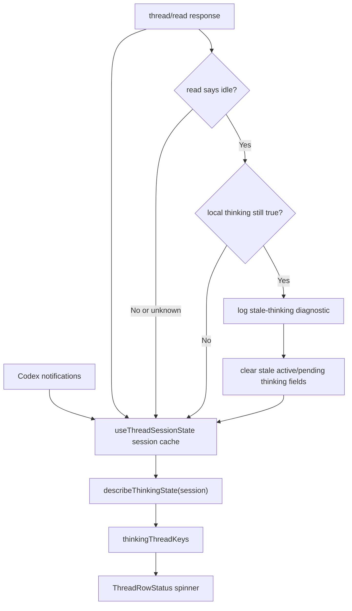

# fix: Diagnose and clear stale thread thinking indicators

## Overview

Fix the desktop bug where a thread row in the directory/thread list can keep the
"thinking" indicator after the underlying Codex thread is idle. The current live
evidence is thread `019dde61-c9d6-70d2-9023-28669e27a63b`, where protocol capture
shows the turn completing and later `thread/read` responses returning idle, while
the list still presented the thread as thinking until the user opened it.

The previous fix in PR #106 addressed late request-resolution notifications, but
the issue still reproduces. This plan treats the bug as a state-machine and
observability problem: first codify the captured failure in a replay-backed E2E
case, then add targeted stale-thinking diagnostics, then fix the thinking-state
derivation and selected-thread reconciliation without regressing the intentional
"premature idle before turn/completed" behavior.

## Problem Frame

The list spinner is driven by `thinkingThreadKeys`, which is derived from
`hasThinkingState(session)` in `apps/desktop/src/renderer/src/lib/useThreadSessionState.ts`.
That helper currently treats several session fields as proof of live work:
`activeTurnId`, pending status/message/request/user input fields, and
`expectOwnUpdate && optimisticEntries.length > 0`.

Recent live transcript work introduced richer optimistic activity entries. A
turn can now complete while retained activity entries remain in
`optimisticEntries`, and `turn/completed` can leave `expectOwnUpdate` true. That
means completed activity can keep `hasThinkingState` true even after
`activeTurnId` and `pendingStatusText` are cleared. Separately, `loadLatest()`
hydrates the transcript from `thread/read` but does not currently use the raw
thread status from that response to reconcile stale renderer-local thinking
state.

The protocol capture for the target thread supports both concerns:

- `thread/status/changed` reported idle immediately before `turn/completed` for
  the final completed turn.
- Later `thread/read` responses for the same thread returned idle.
- The stale UI was observed from the list, and opening the thread made it obvious
  the thread was not active and had not been active for a while.

## Requirements Trace

- R1. Use the captured protocol traffic for thread
  `019dde61-c9d6-70d2-9023-28669e27a63b` to reproduce and explain the stale
  list thinking indicator.
- R2. Commit a replay fixture pair for the regression: raw capture plus derived
  replay fixture under `apps/desktop/e2e/fixtures/stale-thinking-indicator/`.
- R3. Add a replay-backed E2E test that proves the list row keeps thinking during
  a real active turn and clears after `turn/completed` plus idle `thread/read`
  evidence.
- R4. Preserve the existing rule that an early `thread/status/changed` idle event
  must not hide thinking before `turn/completed`.
- R5. Add noisy but bounded diagnostics when the renderer believes a row is still
  thinking while stronger selected-thread evidence says the thread is idle.
- R6. Include enough diagnostic state to identify the stale cause: thread key,
  active turn id, pending status text, pending request/user input state,
  `expectOwnUpdate`, optimistic entry counts by type and turn status, last
  thinking age, read response status, and relevant event or request sequence
  metadata when available.
- R7. Fix `hasThinkingState` so completed retained optimistic activity does not
  count as live thinking.
- R8. Add unit coverage for late request resolution, completed optimistic
  activity, premature idle ordering, and idle-read reconciliation.

## Scope Boundaries

- This plan does not change Codex protocol semantics or app-server behavior.
- This plan does not remove the list thinking indicator; it fixes stale
  derivation and adds diagnostics for future missed edges.
- This plan does not make idle `thread/status/changed` authoritative on its own.
  The current premature-idle guard remains intentional.
- This plan does not add persistent product telemetry. Diagnostics should use the
  existing app logging path and should be gated, one-shot, or otherwise bounded.
- This plan does not redesign thread refresh globally. It adds one narrow
  reconciliation path for selected-thread reads that prove idleness.

## Context & Research

### Relevant Code and Patterns

- `apps/desktop/src/renderer/src/lib/useThreadSessionState.ts` owns retained
  thread sessions, selected-thread hydration, pending turn state, optimistic
  entries, and `thinkingThreadKeys`.
- `hasThinkingState(session)` currently returns true for
  `expectOwnUpdate && optimisticEntries.length > 0`, regardless of whether those
  entries represent completed activity.
- `thread/status/changed` idle handling intentionally preserves thinking if
  `activeTurnId` or `pendingStatusText` is present, so idle cannot win before
  `turn/completed`.
- `turn/completed`, `turn/failed`, `turn/cancelled`, and `thread/compacted` clear
  active turn and pending status state, but they may retain non-message
  optimistic entries.
- `apps/desktop/src/renderer/src/features/thread-list/ThreadRow.tsx` and
  `ThreadRowStatus` use `thinkingThreadKeys` for the list indicator.
- `apps/desktop/e2e/turn-lifecycle.spec.ts` already validates the important
  premature-idle behavior using `apps/desktop/e2e/fixtures/turn-lifecycle/`.
- `packages/shared/src/contracts/normalized-app-server.ts` defines
  `AppServerReadThreadResponse` without a thread status field today, even though
  Codex `thread/read` responses contain a raw thread status.
- `apps/desktop/src/main/codex-app-server/client.ts` extracts replay entries from
  `thread/read` but discards the raw thread status.
- `apps/desktop/src/preload/index.ts` already sends preload logs over
  `PRELOAD_LOG_CHANNEL`, and `apps/desktop/src/main/ipc/preload-log.ts` writes
  those logs through `electron-log`. The diagnostics can extend this path or add
  a small renderer log API without introducing a new logging stack.
- `apps/desktop/scripts/export-session-capture.ts` and
  `apps/desktop/scripts/derive-replay-fixture.ts` already support exporting a
  session capture and deriving replay fixtures with sequence windows, labels, and
  redactions.

### Protocol Evidence

The target capture includes the key event shape needed for a regression:

- A resumed thread transitions through active status and `turn/started`.
- Live item activity and token updates occur during the turn.
- A final `thread/status/changed` idle notification arrives just before
  `turn/completed`.
- Follow-up `thread/read` responses for the same thread return idle with a newer
  `updatedAt`.

The important UI flow is not just "turn completed"; it is "the row still looks
active, the user clicks it, and the fresh read says idle." The replay should
therefore include enough list and read behavior to exercise the row indicator and
selected-thread reconciliation together.

### Institutional Learnings

- No matching `docs/solutions/` entry was present for this bug class.
- The thread refresh model requires selected thread updates to be append-driven
  during active work, but also requires reselecting a cached inactive thread to
  perform a freshness check rather than trusting stale local state forever.
- The desktop replay requirements require raw capture and derived fixture pairs,
  with capture recipes explaining how the fixture was produced.

### External References

External research is not needed. This failure is grounded in local protocol
captures, renderer session state, and the existing replay harness.

## User Flow Analysis

1. **Directory list stale row flow**
   - Entry point: the user is browsing the Directories thread list.
   - System state: a thread row still has `thinkingThreadKeys` even though the
     backend thread is idle.
   - User action: the user sees the thinking indicator and clicks the row.
   - Expected outcome: opening the thread triggers a freshness read, the stale
     row indicator clears, and diagnostics record why the renderer thought the
     row was still active.

2. **Legitimate active-turn flow**
   - Entry point: a thread is actively running or just started.
   - System state: `activeTurnId`, pending status, or genuinely in-progress live
     entries exist.
   - User action: the user watches list and detail surfaces.
   - Expected outcome: the list indicator and detail thinking status remain
     visible.

3. **Premature idle flow**
   - Entry point: Codex emits `thread/status/changed` idle before
     `turn/completed`.
   - System state: an active turn is still locally pending.
   - User action: no action required; events arrive in protocol order.
   - Expected outcome: thinking stays visible until the completion/cancellation
     terminal event arrives.

4. **Completed retained activity flow**
   - Entry point: a turn completes after emitting rich live activity entries.
   - System state: retained optimistic activity remains for transcript richness,
     but its turn status is completed and there is no pending request/status.
   - User action: the user sees the row in any thread list.
   - Expected outcome: retained activity remains renderable in the transcript, but
     it no longer counts as thinking.

## Key Technical Decisions

- **Reproduce before fixing.** Start from the live capture for thread
  `019dde61-c9d6-70d2-9023-28669e27a63b`, derive a tight fixture, and add an E2E
  that fails against the current state machine.
- **Make thinking reasons explicit.** Replace the boolean-only helper with a
  reason-producing helper such as `describeThinkingState(session)`. The boolean
  can be derived from reasons, and diagnostics can log those same reasons.
- **Only count live optimistic entries as thinking.** Optimistic entries should
  contribute to thinking only when they represent pending text, pending
  interaction, or activity tied to an in-progress turn. Completed retained
  activity is transcript state, not activity state.
- **Keep early idle non-authoritative.** The existing guard around
  `thread/status/changed` idle should remain. Stronger evidence comes from a
  terminal turn event or an explicit selected-thread `thread/read` response that
  includes idle status.
- **Extend `thread/read` normalization with optional status.** Add an optional
  `threadStatus` field to `AppServerReadThreadResponse` or the replay metadata so
  the renderer can distinguish "fresh read says idle" from "fresh read did not
  carry status." Keep it optional for backend compatibility.
- **Log stale reconciliation through existing desktop logging.** Use the existing
  preload/main logging bridge or a small renderer diagnostic IPC wrapper. The log
  should be development/noisy-debug oriented, structured, and deduplicated per
  thread/turn/reason.

## Open Questions

### Resolved During Planning

- **Is PR #106 present in the branch being planned from?** Yes. `origin/main`
  contains the squashed fix as `14ccccc Fix stale thinking state after late
  request resolution (#106)`.
- **Does the new capture still show idle proof after completion?** Yes. The
  target thread capture includes idle status, terminal completion, and later
  idle `thread/read` responses.
- **Is there an obvious remaining stale source in renderer state?** Yes.
  Completed retained optimistic activity can satisfy the current
  `expectOwnUpdate && optimisticEntries.length > 0` thinking rule.
- **Can the renderer currently see `thread/read` idle status?** Not through the
  normalized response shape. The raw Codex response has thread status, but the
  normalized `AppServerReadThreadResponse` currently exposes only replay data.

### Deferred to Implementation

- The exact stale age threshold for noisy diagnostics. Default to logging on
  explicit idle-read mismatch immediately, and use a conservative threshold such
  as 5 minutes for age-only warnings if implementation adds an age poll.
- The exact diagnostic IPC shape. Prefer the smallest extension to the existing
  preload log path that can be safely called from renderer code.
- The exact fixture sequence window. The implementation should keep the fixture
  tight enough for deterministic E2E replay while preserving the observed
  idle-before-completed and idle-read sequence.

## High-Level Technical Design

The invariant is that stale diagnostics and reconciliation only run when the
renderer has stronger evidence than local pending state: a terminal turn event or
a selected-thread read that explicitly says the backend thread is idle. A
premature idle notification alone remains insufficient.

## Implementation Units

- [x] **Unit 1: Derive the stale-thinking replay fixture**

**Goal:** Convert the live protocol capture for
`019dde61-c9d6-70d2-9023-28669e27a63b` into a replay fixture that can reproduce
the stale row state.

**Requirements:** R1, R2, R3, R4

**Dependencies:** None

**Files:**
- Create: `apps/desktop/e2e/fixtures/stale-thinking-indicator/capture-recipe.md`
- Create: `apps/desktop/e2e/fixtures/stale-thinking-indicator/raw.capture.jsonl`
- Create: `apps/desktop/e2e/fixtures/stale-thinking-indicator/replay.fixture.json`
- Optional modify: `apps/desktop/e2e/fixtures/README.md`

**Approach:**
- Use `pnpm --filter @pwragent/desktop export:session-capture` to export the
  target Codex session from the runtime protocol capture root.
- Use `pnpm --filter @pwragent/desktop derive:replay-fixture` with a sequence
  window covering active status, `turn/started`, live activity, premature idle,
  `turn/completed`, and the later idle `thread/read`.
- Label replay steps for the assertions: list seed, thread open/read,
  active status, premature idle, terminal completion, stale-check read.
- Redact machine-specific path fragments and keep the fixture focused on the
  minimum event sequence that reproduces the list-row state.

**Test scenarios:**
- Fixture contains a row-visible thread summary before selection.
- Fixture includes premature idle before `turn/completed`.
- Fixture includes an explicit idle `thread/read` response after completion.

**Verification:**
- The derived fixture can be loaded by `launchElectronApp` and advanced step by
  step without hand-editing the raw capture.

- [x] **Unit 2: Add thinking-state reasons and bounded diagnostics**

**Goal:** Make the renderer able to explain why it thinks a thread is active and
log that explanation when selected-thread evidence proves otherwise.

**Requirements:** R5, R6, R8

**Dependencies:** None

**Files:**
- Modify: `apps/desktop/src/renderer/src/lib/useThreadSessionState.ts`
- Modify: `apps/desktop/src/renderer/src/lib/desktop-api.ts`
- Modify: `apps/desktop/src/preload/index.ts`
- Modify: `apps/desktop/src/main/ipc/preload-log.ts` or add a focused renderer
  diagnostic IPC next to it
- Modify: `apps/desktop/src/renderer/src/lib/__tests__/useThreadSessionState.test.tsx`

**Approach:**
- Replace or wrap `hasThinkingState(session)` with a helper that returns reason
  records, for example `activeTurn`, `pendingStatus`, `pendingRequest`,
  `pendingUserInput`, `pendingAssistantMessage`, and `liveOptimisticEntry`.
- Track the timestamp when a session first becomes thinking and when each reason
  was last updated.
- Add a diagnostic function that logs once per thread and stale proof event when
  a selected-thread `thread/read` says idle but thinking reasons still exist.
- Include a compact optimistic entry summary rather than full transcript content:
  total count, counts by entry type, turn ids, turn statuses, activity statuses,
  and whether any entries are still in progress.
- Gate or dedupe the noisy diagnostics so repeated renders do not spam logs.

**Patterns to follow:**
- Existing app-server IPC debug logging in `apps/desktop/src/main/ipc/app-server.ts`
- Existing preload logging bridge in `apps/desktop/src/preload/index.ts` and
  `apps/desktop/src/main/ipc/preload-log.ts`

**Test scenarios:**
- No diagnostic is emitted for a genuinely active thread.
- A diagnostic is emitted when idle read evidence conflicts with local thinking.
- Repeated renders with the same stale reason emit only one diagnostic.
- Diagnostic summaries include completed optimistic activity as a distinct reason
  if it is what kept thinking true.

**Verification:**
- Developers can inspect one structured log entry and see why the stale spinner
  existed.

- [x] **Unit 3: Normalize read-thread status for reconciliation**

**Goal:** Preserve the raw `thread/read` status through the normalized desktop API
so renderer reconciliation can rely on explicit idle evidence.

**Requirements:** R5, R6, R8

**Dependencies:** None

**Files:**
- Modify: `packages/shared/src/contracts/normalized-app-server.ts`
- Modify: `apps/desktop/src/main/codex-app-server/client.ts`
- Modify: `apps/desktop/src/main/grok-app-server/client.ts` if Grok exposes an
  equivalent status, otherwise leave the new field absent
- Modify: `apps/desktop/src/main/app-server/backend-registry.ts`
- Modify: `apps/desktop/src/main/ipc/app-server.ts`
- Modify or add: related main-process normalization tests
- Modify: `apps/desktop/src/renderer/src/lib/__tests__/useThreadSessionState.test.tsx`

**Approach:**
- Add an optional status field to `AppServerReadThreadResponse`, such as
  `threadStatus?: "idle" | "active" | "notLoaded" | "unknown"`.
- Extract Codex thread status from raw `thread/read` results before converting
  them to `AppServerThreadReplay`.
- Keep the field optional and backend-neutral so older or non-Codex responses do
  not force unsafe assumptions.
- Include status in debug logging for `readThread`.

**Test scenarios:**
- Codex `thread/read` with raw idle status yields `threadStatus: "idle"`.
- Missing status leaves `threadStatus` undefined or `"unknown"` and does not
  trigger reconciliation.
- Existing read replay extraction remains unchanged.

**Verification:**
- Renderer tests can simulate a fresh idle read without relying on private raw
  protocol shape.

- [x] **Unit 4: Fix thinking-state derivation and idle-read reconciliation**

**Goal:** Clear stale list thinking without hiding real active work.

**Requirements:** R4, R7, R8

**Dependencies:** Unit 2, Unit 3

**Files:**
- Modify: `apps/desktop/src/renderer/src/lib/useThreadSessionState.ts`
- Modify: `apps/desktop/src/renderer/src/lib/__tests__/useThreadSessionState.test.tsx`

**Approach:**
- Change optimistic-entry thinking logic so only live pending entries count:
  pending assistant text, pending request/user input, or activity entries whose
  turn/activity status is still in progress.
- Ensure completed retained activity can remain in transcript state without
  contributing a `thinkingThreadKeys` entry.
- On `loadLatest()` completion, if the selected read response says idle and the
  local session has no still-active proof, clear stale pending thinking
  fields and log the diagnostic from Unit 2.
- Do not clear on a bare `thread/status/changed` idle notification when
  `activeTurnId` or pending status exists.
- Keep PR #106 coverage for late request resolution and add a regression where
  request resolution arrives after `turn/completed`.

**Test scenarios:**
- Completed optimistic activity retained after `turn/completed` does not keep
  the list spinner.
- Activity with in-progress turn metadata does keep the list spinner.
- Premature idle before `turn/completed` keeps thinking visible.
- Idle `thread/read` after completion clears stale thinking and logs once.
- Late request resolution after completion does not reintroduce thinking.

**Verification:**
- `thinkingThreadKeys` reflects active work only, not retained transcript
  richness.

- [x] **Unit 5: Add replay-backed E2E coverage for the row indicator**

**Goal:** Prove the full desktop flow: list row thinking appears while active,
survives premature idle, and clears after terminal completion plus idle read.

**Requirements:** R1, R2, R3, R4, R7

**Dependencies:** Unit 1, Unit 4

**Files:**
- Create: `apps/desktop/e2e/stale-thinking-indicator.spec.ts`
- Use: `apps/desktop/e2e/fixtures/stale-thinking-indicator/replay.fixture.json`
- Optional modify: `apps/desktop/e2e/fixtures/electron-app.ts` only if a small
  replay helper is needed for cleaner assertions

**Approach:**
- Launch Electron with the stale-thinking replay fixture.
- Assert the target thread row is present in the list and has no thinking
  indicator before active events.
- Advance active-turn steps and assert the row indicator appears.
- Advance premature idle and assert the row indicator remains visible.
- Advance terminal completion and idle read/open behavior, then assert the row
  indicator disappears and the detail view has no thinking status.
- If the original capture cannot deterministically reproduce the stale state
  after Unit 4, add a narrow fixture variant that includes completed retained
  activity entries to cover the identified state-machine bug.

**Patterns to follow:**
- Step advancement in `apps/desktop/e2e/turn-lifecycle.spec.ts`
- Fixture structure in `apps/desktop/e2e/fixtures/turn-lifecycle/`

**Test scenarios:**
- Row spinner visible during active turn.
- Row spinner still visible after premature idle.
- Row spinner gone after `turn/completed` and idle read.
- Opening a previously stale thread triggers diagnostic reconciliation if local
  state still claims thinking.

**Verification:**
- `pnpm test:desktop-e2e -- stale-thinking-indicator` fails against the current
  stale derivation before the fix and passes after the fix.

## System-Wide Impact

- Renderer session state becomes more inspectable because thinking reasons are
  explicit instead of buried in one boolean.
- The desktop API gains optional read-thread status metadata, which is backward
  compatible for non-Codex backends.
- Replay fixtures gain one more scenario rooted in a real captured thread.
- Diagnostics add temporary noise when the stale condition is detected, but they
  should be bounded to avoid high-volume logs during normal rendering.

## Risks and Mitigations

- **Risk: false clearing during a real active turn.** Mitigation: never let bare
  idle status clear thinking while an active turn or pending interaction is still
  present; use terminal events or idle `thread/read` evidence.
- **Risk: diagnostics spam logs.** Mitigation: dedupe by thread id, turn id, and
  stale reason signature; log compact summaries instead of transcript content.
- **Risk: fixture becomes too large or contains local paths.** Mitigation: derive
  a tight sequence window, use redactions, and document the capture recipe.
- **Risk: optional status field creates backend ambiguity.** Mitigation: treat
  missing status as unknown and do not reconcile from unknown.
- **Risk: retained transcript activity is accidentally pruned.** Mitigation:
  separate "is this displayable transcript state?" from "is this active work?"
  in helper names and tests.

## Verification Plan

- Run focused renderer tests:
  `pnpm --filter @pwragent/desktop test -- useThreadSessionState`
- Run focused main-process normalization tests for Codex read status extraction.
- Run focused E2E:
  `pnpm test:desktop-e2e -- stale-thinking-indicator`
- Run the existing lifecycle replay:
  `pnpm test:desktop-e2e -- turn-lifecycle`
- Before PR, run the desktop package test target or the repo-preferred desktop
  E2E path if the implementation touches shared replay behavior.

## PR Notes

- The PR should call out that the fix preserves the existing premature-idle
  behavior.
- The PR should include the target thread id and fixture path so future debugging
  can connect the code change back to the live incident.
- If diagnostics are gated by an environment variable or development flag, the PR
  should name the flag and show an example stale-thinking log payload.
