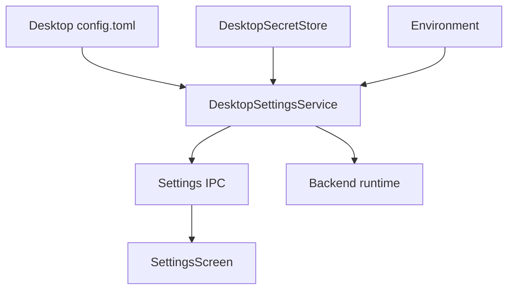

# feat: Add Desktop Settings And Config

## Overview

Add a desktop app settings system backed by a PwrAgent TOML config file, keychain-backed secret storage, environment-variable overrides, and a dedicated settings screen. The first slice establishes durable app-level configuration for Experimental, Messaging, and Models without implementing Telegram or Discord bot runtime behavior.

## Problem Frame

The desktop app currently has thread/draft controls in the composer and separate runtime config paths for Grok and Codex, but it does not have an app-level settings contract or UI. This work creates the persistent settings layer and visible screen described in the origin document, while preserving the existing composer ownership of thread-specific model and execution settings (see origin: `docs/brainstorms/2026-04-30-desktop-settings-config-requirements.md`).

## Requirements Trace

- R1-R6. Desktop TOML config, environment override precedence, no secret writes to TOML, and effective value metadata.
- R7-R12. Gear entrypoint, settings screen with left-side section bar, desktop style-guide alignment, and explicit loading/save/error/unavailable states.
- R13-R16. Experimental Chat Reply Composer setting with `textarea`, `TipTap with chips`, and `custom widget with chips`; `textarea` remains default and current behavior.
- R17-R26. Telegram and Discord settings groups, list fields, masked token state, incomplete-credential support, and runtime override names.
- R27-R33. Models settings for Codex path discovery/override and Grok API key handling.
- R34-R38. Secret source metadata, environment override secrecy, clear semantics, and no secret leakage through logs, config snapshots, or general IPC responses.

## Scope Boundaries

- Do not implement Telegram or Discord bot connection, message receive, message send, or token validation against external services.
- Do not redesign composer-owned thread/draft provider, model, reasoning, service-tier, fast-mode, or access-mode controls.
- Do not migrate or remove the current Grok app-server `~/.config/grok-app-server/config.toml` path in this pass.
- Do not expose saved raw secret values after write.
- Do not require TipTap or the custom rich composer to be feature-complete in this pass; the setting exists and the current textarea remains the runtime fallback until richer composers land.

## Context & Research

### Relevant Code and Patterns

- `packages/agent-core/src/config/grok-app-server-config.ts` and `packages/agent-core/src/config/simple-toml.ts` establish XDG-aware config path resolution, env-first precedence, and small TOML helpers for the current Grok runtime config.
- `apps/desktop/src/main/app-server/desktop-state-root.ts` already resolves XDG-aware desktop state paths under `pwragent` and supports `PWRAGNT_STATE_ROOT`.
- `apps/desktop/src/shared/ipc.ts`, `apps/desktop/src/preload/index.ts`, `apps/desktop/src/renderer/src/lib/desktop-api.ts`, and `apps/desktop/src/main/ipc/*` are the established path for shared contracts, IPC channel constants, preload exposure, renderer API typing, and main-process handlers.
- `packages/shared/src/contracts/*.ts` is where desktop-facing request/response contracts live before export from `packages/shared/src/index.ts`.
- `apps/desktop/src/main/codex-app-server/stdio-transport.ts` already handles Codex command auto-discovery, version detection, `PWRAGNT_CODEX_COMMAND`, Codex.app paths, and version ordering.
- `apps/desktop/src/main/app-server/backend-registry.ts` constructs Codex and Grok clients and is the right runtime integration point for effective model-provider settings.
- `apps/desktop/src/main/grok-app-server/client.ts`, `apps/desktop/src/main/app-server/ephemeral-object-call.ts`, `apps/desktop/src/main/diff-focus/focused-diff-service.ts`, and `apps/desktop/src/main/app-server/thread-title-generation-service.ts` consume Grok/xAI credentials today through env and Grok app-server config.
- `apps/desktop/src/renderer/src/App.tsx`, `apps/desktop/src/renderer/src/features/navigation/Sidebar.tsx`, and `apps/desktop/src/renderer/src/styles/app.css` define the current shell, sidebar masthead, and visual token system to extend.
- Existing tests in `apps/desktop/src/main/__tests__/app-server-ipc.test.ts`, `apps/desktop/src/main/__tests__/runtime-identity-ipc.test.ts`, `apps/desktop/src/main/__tests__/stdio-transport.test.ts`, `apps/desktop/src/renderer/src/__tests__/app-shell.test.tsx`, and `apps/desktop/src/renderer/src/features/navigation/__tests__/sidebar.test.tsx` show the preferred Vitest and Testing Library patterns.

### Institutional Learnings

- No `docs/solutions/` directory exists in this worktree, so there are no additional institutional learnings to carry forward.

### External References

- Electron `safeStorage` is a main-process API for encrypting strings for local storage using OS-provided cryptography. Electron documents macOS keys as stored in Keychain Access, Windows as DPAPI-backed, and Linux as secret-store-dependent, with `basic_text` indicating an unsafe fallback.
- `keytar` directly targets macOS Keychain, Linux Secret Service, and Windows Credential Vault, but the upstream repository is archived and its latest GitHub release is `v7.9.0` from February 17, 2022, making it risky to add as a new native Electron dependency.

## Key Technical Decisions

- Desktop config path: use `~/.config/pwragent/config.toml` by default, honoring `XDG_CONFIG_HOME`; add `PWRAGNT_CONFIG_PATH` for explicit override and tests. This mirrors the Grok app-server XDG direction without reusing the Grok-specific config file.
- TOML shape: use readable TOML tables for user-facing configuration, not flat keys. Implement a small desktop-specific TOML codec for the known settings shape rather than expanding the current agent-core flat TOML helper or adding a broad parser dependency.
- Secret storage: use a `DesktopSecretStore` abstraction with an Electron `safeStorage` production adapter for the first pass. Store encrypted secret records outside TOML under the desktop state root and put only non-secret presence/source metadata in settings snapshots. This avoids the archived `keytar` dependency while using Electron's OS-backed cryptography.
- Unsafe secret backend handling: if `safeStorage.isEncryptionAvailable()` is false or Linux reports `basic_text`, mark secret writes unavailable and surface that state in Settings instead of silently falling back to weak storage.
- Runtime precedence: resolve effective values in the main process as `env > secret/config > product default`; renderer snapshots receive values for non-secrets, metadata for secrets, and override source information.
- Env naming: use the origin-provided messaging env names, add missing PwrAgent names for non-secret messaging flags/lists and composer selection, keep `XAI_API_KEY` as the canonical Grok API-key env override, and keep `PWRAGNT_CODEX_COMMAND` as the Codex path env override.
- Composer implementation boundary: introduce a lightweight composer implementation preference that currently selects the existing textarea runtime implementation for all modes unless a richer implementation is present. This lets the setting ship without pretending TipTap/custom composers are complete.

## Open Questions

### Resolved During Planning

- Desktop config path and TOML shape: `~/.config/pwragent/config.toml` with tables `[experimental]`, `[messaging.telegram]`, `[messaging.discord]`, `[models.codex]`, and `[models.grok]`.
- Secret backend choice: use Electron `safeStorage` behind a `DesktopSecretStore` boundary for this pass; avoid `keytar` unless implementation proves `safeStorage` cannot satisfy the app's actual security requirement.
- Env overrides: use the complete set documented in the Environment Contract section below.
- Codex discovery order: explicit env override, explicit config path, PATH `codex`, then Codex.app candidates, with executable checks and version detection using short timeouts.
- Composer boundary: persist and expose the selected implementation now; keep textarea as the only guaranteed runtime implementation until richer composers are built.

### Deferred to Implementation

- Exact TOML codec helper names: choose during implementation based on how the desktop config module is organized.
- Exact encrypted secret file format: define inside the secret-store adapter; it must not leak plaintext and must be replaceable without changing renderer contracts.
- Final settings copy for unavailable/overridden states: write during UI implementation against the desktop style guide, keeping copy compact and non-narrative.

## Environment Contract

| Setting | Config table/key | Env override | Secret? |
| --- | --- | --- | --- |
| Chat Reply Composer | `experimental.chat_reply_composer` | `PWRAGNT_EXPERIMENTAL_CHAT_REPLY_COMPOSER` | No |
| Telegram Enabled | `messaging.telegram.enabled` | `PWRAGNT_MESSAGING_TELEGRAM_ENABLED` | No |
| Telegram Bot Token | keychain-backed secret | `PWRAGNT_MESSAGING_TELEGRAM_BOT_TOKEN` | Yes |
| Telegram Authorized User IDs | `messaging.telegram.authorized_user_ids` | `PWRAGNT_MESSAGING_TELEGRAM_AUTHORIZED_USER_IDS` | No |
| Telegram Authorized Supergroups | `messaging.telegram.authorized_supergroups` | `PWRAGNT_MESSAGING_TELEGRAM_AUTHORIZED_SUPERGROUPS` | No |
| Discord Enabled | `messaging.discord.enabled` | `PWRAGNT_MESSAGING_DISCORD_ENABLED` | No |
| Discord Bot Token | keychain-backed secret | `PWRAGNT_MESSAGING_DISCORD_BOT_TOKEN` | Yes |
| Discord Application ID | `messaging.discord.application_id` | `PWRAGNT_MESSAGING_DISCORD_APPLICATION_ID` | No |
| Discord Authorized User IDs | `messaging.discord.authorized_user_ids` | `PWRAGNT_MESSAGING_DISCORD_AUTHORIZED_USER_IDS` | No |
| Discord Authorized Guilds | `messaging.discord.authorized_guilds` | `PWRAGNT_MESSAGING_DISCORD_AUTHORIZED_GUILDS` | No |
| Codex Path | `models.codex.path` | `PWRAGNT_CODEX_COMMAND` | No |
| Grok API Key | keychain-backed secret | `XAI_API_KEY` | Yes |

## Config Shape

> *This illustrates the intended config shape and is directional guidance for review, not implementation specification. The implementing agent should treat it as context, not code to reproduce.*

```toml
[experimental]
chat_reply_composer = "textarea"

[messaging.telegram]
enabled = false
authorized_user_ids = ["111111111", "222222222"]
authorized_supergroups = []

[messaging.discord]
enabled = false
application_id = "123456789012345678"
authorized_user_ids = ["333333333333333333"]
authorized_guilds = []

[models.codex]
path = "codex"
```

Secrets are intentionally absent from this file. Telegram bot token, Discord bot token, and Grok API key are written through the secret-store path only.

## High-Level Technical Design

> *This illustrates the intended approach and is directional guidance for review, not implementation specification. The implementing agent should treat it as context, not code to reproduce.*



The main process owns all config parsing, secret reads/writes, override precedence, and runtime injection. The renderer only receives redacted settings snapshots and can send explicit config patches or secret replace/clear requests.

## Implementation Units

- [x] **Unit 1: Shared Settings Contracts**

**Goal:** Define the typed desktop settings API surface used by main, preload, and renderer.

**Requirements:** R1-R6, R13-R38

**Dependencies:** None

**Files:**
- Create: `packages/shared/src/contracts/settings.ts`
- Modify: `packages/shared/src/index.ts`
- Test: `packages/shared/src/contracts/__tests__/settings.test.ts`

**Approach:**
- Add settings snapshot types with separate representations for non-secret effective values and secret state metadata.
- Include request/response contracts for reading settings, writing non-secret patches, replacing a secret, clearing a secret, and reading Codex discovery status.
- Model source metadata explicitly: `default`, `config`, `keychain`, `env`, and unavailable/error states where relevant.
- Keep raw secret values out of read responses by construction; only write requests may carry a raw secret value.

**Patterns to follow:**
- `packages/shared/src/contracts/agent.ts`
- `packages/shared/src/contracts/backend.ts`
- `packages/shared/src/contracts/navigation.ts`

**Test scenarios:**
- Happy path: a settings snapshot can represent config-backed non-secret fields, keychain-backed secret presence, and env-overridden fields without exposing raw secret values.
- Edge case: list fields can represent empty lists distinctly from unset/default values.
- Error path: unavailable keychain state can be represented without requiring a secret value.

**Verification:**
- Shared contracts compile and are exported through `@pwragent/shared`.
- Contract tests prove raw secret values are absent from read response shapes.

- [x] **Unit 2: Desktop Config And Secret Services**

**Goal:** Add main-process services for reading/writing desktop TOML config, resolving env overrides, and storing secrets through an isolated secret-store adapter.

**Requirements:** R1-R6, R20-R25, R31-R38

**Dependencies:** Unit 1

**Files:**
- Create: `apps/desktop/src/main/settings/desktop-config.ts`
- Create: `apps/desktop/src/main/settings/desktop-settings-service.ts`
- Create: `apps/desktop/src/main/settings/desktop-secret-store.ts`
- Create: `apps/desktop/src/main/settings/desktop-settings-env.ts`
- Test: `apps/desktop/src/main/__tests__/desktop-settings-service.test.ts`
- Test: `apps/desktop/src/main/__tests__/desktop-secret-store.test.ts`

**Approach:**
- Resolve the config path as `PWRAGNT_CONFIG_PATH` when set, otherwise `XDG_CONFIG_HOME/pwragent/config.toml` or `~/.config/pwragent/config.toml`.
- Store encrypted secret records under `resolveDesktopStateRoot()` rather than in TOML; TOML stores only non-secret config.
- Implement the first secret-store adapter with Electron `safeStorage`; reject writes when encryption is unavailable or when Linux selects `basic_text`.
- Parse TOML tables for the known settings shape and write stable, sorted config output to keep diffs reviewable.
- Normalize booleans, list values, empty strings, composer enum values, and path values before producing an effective snapshot.
- Ensure service-level logging never includes raw secret values or encrypted payloads.

**Patterns to follow:**
- `packages/agent-core/src/config/grok-app-server-config.ts`
- `packages/agent-core/src/config/simple-toml.ts`
- `apps/desktop/src/main/app-server/desktop-state-root.ts`
- `apps/desktop/src/main/log.ts`

**Test scenarios:**
- Happy path: TOML values load from a temp XDG config path and produce config-sourced effective values.
- Happy path: env values override TOML/keychain values and mark overridden settings as env-sourced.
- Happy path: replacing and clearing Telegram, Discord, and Grok secrets updates secret state metadata without writing plaintext to TOML.
- Edge case: missing config file returns defaults and creates parent directories only on write.
- Edge case: empty comma-separated env/list values resolve to empty lists, not a single blank entry.
- Error path: malformed TOML returns a readable config error state.
- Error path: unavailable or unsafe secret storage blocks secret writes and reports unavailable state.
- Error path: clearing a keychain value does not alter env-sourced effective values.

**Verification:**
- Main-process tests cover config path resolution, precedence, list parsing, secret redaction, unavailable secret storage, and write behavior.

- [x] **Unit 3: Settings IPC And Preload Bridge**

**Goal:** Expose settings read/write operations to the renderer through the established desktop IPC pattern.

**Requirements:** R2, R5, R7-R12, R23, R30-R38

**Dependencies:** Units 1 and 2

**Files:**
- Modify: `apps/desktop/src/shared/ipc.ts`
- Modify: `apps/desktop/src/main/index.ts`
- Create: `apps/desktop/src/main/ipc/settings.ts`
- Modify: `apps/desktop/src/preload/index.ts`
- Modify: `apps/desktop/src/renderer/src/lib/desktop-api.ts`
- Test: `apps/desktop/src/main/__tests__/settings-ipc.test.ts`
- Test: `apps/desktop/src/renderer/src/lib/__tests__/desktop-api.test.tsx`

**Approach:**
- Add channels for reading the redacted settings snapshot, writing non-secret config patches, replacing secrets, clearing secrets, and refreshing Codex discovery.
- Register and dispose settings IPC handlers alongside the existing app-server, agent, image, and diagnostic handlers.
- Keep raw secret values constrained to the replace-secret IPC request path; never include them in read responses, logs, or diagnostic payloads.
- Expose typed preload methods in `window.pwragent` and optional renderer API methods in `DesktopApi`.

**Patterns to follow:**
- `apps/desktop/src/main/ipc/app-server.ts`
- `apps/desktop/src/main/ipc/runtime-identity.ts`
- `apps/desktop/src/preload/index.ts`
- `apps/desktop/src/renderer/src/lib/desktop-api.ts`

**Test scenarios:**
- Happy path: `settings:read` returns a redacted snapshot from the service.
- Happy path: non-secret patch requests call the settings service and return a refreshed snapshot.
- Happy path: secret replace/clear requests call dedicated service methods and never log or return the submitted value.
- Error path: service errors propagate through IPC as rejected calls without corrupting registered handlers.
- Integration: preload exposes all settings methods on the desktop API shape.

**Verification:**
- IPC tests prove handlers register/dispose cleanly and secret values are not present in read responses.

- [x] **Unit 4: Runtime Integration For Models**

**Goal:** Make effective settings influence Codex command selection and Grok/xAI credential consumers while preserving env-first behavior.

**Requirements:** R2, R24-R33, R34-R38

**Dependencies:** Units 1-3

**Files:**
- Modify: `apps/desktop/src/main/app-server/backend-registry.ts`
- Modify: `apps/desktop/src/main/codex-app-server/client.ts`
- Modify: `apps/desktop/src/main/codex-app-server/stdio-transport.ts`
- Modify: `apps/desktop/src/main/grok-app-server/client.ts`
- Modify: `apps/desktop/src/main/app-server/ephemeral-object-call.ts`
- Modify: `apps/desktop/src/main/diff-focus/focused-diff-service.ts`
- Modify: `apps/desktop/src/main/app-server/thread-title-generation-service.ts`
- Test: `apps/desktop/src/main/__tests__/backend-registry.test.ts`
- Test: `apps/desktop/src/main/__tests__/grok-app-server-client.test.ts`
- Test: `apps/desktop/src/main/__tests__/focused-diff-service.test.ts`
- Test: `apps/desktop/src/main/__tests__/stdio-transport.test.ts`

**Approach:**
- Feed effective Codex command settings into both default and full-access Codex clients, while preserving `PWRAGNT_CODEX_COMMAND` as the top-precedence override.
- Refactor Codex command discovery helpers enough to return all discovered candidates and the selected candidate for Settings without changing launch semantics.
- Provide a main-process Grok credential resolver that checks `XAI_API_KEY`, then keychain-backed Grok API key, then the existing Grok app-server config fallback.
- Ensure `GrokAppServerClient`, focused diff object calls, and Grok thread-title generation can receive the effective API key without relying only on global process env.
- Keep existing Grok app-server config compatibility for `grok_model`, `xai_base_url`, and legacy fallback values.

**Patterns to follow:**
- `apps/desktop/src/main/app-server/backend-registry.ts`
- `apps/desktop/src/main/codex-app-server/stdio-transport.ts`
- `apps/desktop/src/main/grok-app-server/client.ts`
- `apps/desktop/src/main/app-server/ephemeral-object-call.ts`

**Test scenarios:**
- Happy path: config Codex path is passed into both Codex clients when no env override exists.
- Happy path: `PWRAGNT_CODEX_COMMAND` beats config Codex path and is reported as env-sourced.
- Happy path: Grok keychain API key makes Grok backend available when `XAI_API_KEY` and Grok config key are absent.
- Happy path: `XAI_API_KEY` beats keychain and config values for all Grok/xAI consumers.
- Edge case: invalid configured Codex path is represented in discovery status without crashing backend listing.
- Error path: Grok keychain read failure produces unavailable/error metadata and keeps existing env/config fallback behavior.
- Integration: focused diff and thread title paths use the same effective Grok API key source as Grok app-server client.

**Verification:**
- Existing backend behavior remains unchanged when no desktop settings file exists.
- Tests prove model runtime consumers honor the new precedence rules.

- [x] **Unit 5: Codex Discovery Surface**

**Goal:** Expose discovered Codex paths, versions, selected path, and source metadata to Settings.

**Requirements:** R24-R30, R34-R36

**Dependencies:** Units 2-4

**Files:**
- Create: `apps/desktop/src/main/settings/codex-discovery.ts`
- Modify: `apps/desktop/src/main/codex-app-server/stdio-transport.ts`
- Test: `apps/desktop/src/main/__tests__/codex-discovery.test.ts`
- Test: `apps/desktop/src/main/__tests__/stdio-transport.test.ts`

**Approach:**
- Share discovery logic with the existing transport path rather than creating a second search order.
- Return candidate records with path/command, source, executable status, optional version, optional failure reason, and selected flag.
- Apply short timeouts to version checks and preserve partial results when one candidate fails.
- Include configured path and env override candidates even when they are not executable so Settings can explain why a choice is ineffective.

**Patterns to follow:**
- `apps/desktop/src/main/codex-app-server/stdio-transport.ts`
- `apps/desktop/src/main/__tests__/stdio-transport.test.ts`

**Test scenarios:**
- Happy path: PATH `codex` and Codex.app candidates are discovered and sorted by version.
- Happy path: configured explicit path is selected over auto-discovered candidates when no env override is present.
- Happy path: env override is selected over configured path.
- Edge case: version command timeout leaves the candidate visible with no version.
- Error path: non-executable configured path appears with an explanatory failure reason.

**Verification:**
- Settings can render both successful and failed discovery results from a single snapshot.

- [x] **Unit 6: Settings Screen Shell**

**Goal:** Add the gear entrypoint, app-level settings view, and section navigation.

**Requirements:** R7-R12

**Dependencies:** Units 1 and 3

**Files:**
- Modify: `apps/desktop/src/renderer/src/App.tsx`
- Modify: `apps/desktop/src/renderer/src/features/navigation/Sidebar.tsx`
- Create: `apps/desktop/src/renderer/src/features/settings/SettingsScreen.tsx`
- Create: `apps/desktop/src/renderer/src/features/settings/useDesktopSettings.ts`
- Modify: `apps/desktop/src/renderer/src/styles/app.css`
- Test: `apps/desktop/src/renderer/src/__tests__/app-shell.test.tsx`
- Test: `apps/desktop/src/renderer/src/features/navigation/__tests__/sidebar.test.tsx`
- Test: `apps/desktop/src/renderer/src/features/settings/__tests__/settings-screen.test.tsx`

**Approach:**
- Add an icon-only Settings button in the sidebar masthead actions with a clear accessible label.
- Track app view state in `App.tsx` so the main region can render either `ThreadView` or `SettingsScreen`.
- Keep the thread sidebar visible and unchanged; Settings owns its own left-side section bar inside the main surface.
- Provide a clear exit path back to the selected thread surface, and make selecting a thread from the sidebar leave Settings and open that thread.
- Implement section navigation for Experimental, Messaging, and Models with keyboard-reachable controls and stable layout.
- Use existing theme tokens, grouped settings surfaces, no nested cards, no browser-default controls, and compact utility typography.

**Patterns to follow:**
- `apps/desktop/src/renderer/src/App.tsx`
- `apps/desktop/src/renderer/src/features/navigation/Sidebar.tsx`
- `apps/desktop/src/renderer/src/features/composer/Composer.tsx`
- `apps/desktop/src/renderer/src/styles/app.css`
- `docs/UI-THEME.md`
- `docs/design/desktop-style-guide.md`

**Test scenarios:**
- Happy path: clicking the Settings button opens the settings screen without changing selected thread state.
- Happy path: section buttons switch between Experimental, Messaging, and Models content.
- Happy path: selecting a thread while Settings is open returns to thread view with that thread selected.
- Happy path: the Settings screen close/back control returns to the previously selected thread view.
- Edge case: settings loading state renders without overlapping shell content.
- Error path: settings read failure renders a compact error state and retry affordance.
- Accessibility: settings entrypoint has an accessible name, section navigation exposes the active section, and focus remains usable.

**Verification:**
- App shell tests cover opening, closing/returning to thread view, section navigation, loading, and error states.

- [x] **Unit 7: Settings Forms And Composer Preference Consumption**

**Goal:** Implement the initial Experimental, Messaging, and Models settings groups and consume the composer implementation preference safely.

**Requirements:** R13-R38

**Dependencies:** Units 1-6

**Files:**
- Create: `apps/desktop/src/renderer/src/features/settings/ExperimentalSettings.tsx`
- Create: `apps/desktop/src/renderer/src/features/settings/MessagingSettings.tsx`
- Create: `apps/desktop/src/renderer/src/features/settings/ModelsSettings.tsx`
- Create: `apps/desktop/src/renderer/src/features/settings/settings-fields.ts`
- Modify: `apps/desktop/src/renderer/src/features/composer/Composer.tsx`
- Modify: `apps/desktop/src/renderer/src/features/thread-detail/ThreadView.tsx`
- Modify: `apps/desktop/src/renderer/src/App.tsx`
- Test: `apps/desktop/src/renderer/src/features/settings/__tests__/settings-screen.test.tsx`
- Test: `apps/desktop/src/renderer/src/features/composer/__tests__/composer.test.tsx`
- Test: `apps/desktop/e2e/smoke.spec.ts`

**Approach:**
- Experimental: render a three-way segmented control for Chat Reply Composer, defaulting to `textarea`.
- Messaging: render Telegram and Discord grouped settings with enabled toggles, masked token states, replace/clear actions, list fields, Discord Application ID, and Discord Authorized Servers / Guilds label.
- Models: render Codex auto-discovery results, selected path/version/source, explicit path override controls, and Grok API key secret state with replace/clear actions.
- For secret fields, use local input state only for replacement; clear the local raw value immediately after a successful write and never populate it from a settings snapshot.
- For list fields, support comma-separated entry and normalize display into stable chips or rows without requiring messaging runtime validation.
- Pass the composer setting into the composer boundary. The current textarea implementation remains the fallback for all modes until TipTap/custom implementations exist, and tests should prove message send semantics do not change.

**Patterns to follow:**
- `apps/desktop/src/renderer/src/features/composer/Composer.tsx`
- `apps/desktop/src/renderer/src/features/composer/SkillChip.tsx`
- `apps/desktop/src/renderer/src/features/thread-detail/ThreadView.tsx`
- `apps/desktop/src/renderer/src/styles/app.css`

**Test scenarios:**
- Happy path: changing Chat Reply Composer saves the selected enum and the current composer still sends textarea content correctly.
- Happy path: Telegram and Discord non-secret fields save through settings patch calls and display saved state.
- Happy path: replacing a Telegram, Discord, or Grok secret sends the raw value only through the replace-secret API and then clears the input.
- Happy path: clearing a secret updates the field to unset unless an env override still controls it.
- Happy path: Codex discovery renders multiple candidates, versions when present, and the selected source.
- Edge case: empty authorized-user/guild/supergroup lists save as empty lists.
- Edge case: env-overridden secret fields show override status without revealing the value and disable misleading clear semantics for the env value.
- Error path: save failure leaves the user's edited field visible and shows an inline error state.
- Error path: unavailable keychain disables secret replace actions while keeping non-secret settings editable.
- Integration: e2e smoke coverage proves the Settings screen opens from the gear, renders all three sections, and can return to the thread surface.

**Verification:**
- Renderer tests cover form state, save/replace/clear behavior, override badges, and composer fallback.
- E2E coverage confirms the settings route is usable in the real shell.

## System-Wide Impact

- **Interaction graph:** `App` opens `SettingsScreen`; `SettingsScreen` calls `DesktopApi`; preload invokes settings IPC; main settings service reads TOML, env, secret store, and Codex discovery; backend registry and Grok/xAI callers consume effective model settings.
- **Error propagation:** config parse, secret-store, and discovery errors should remain localized to Settings snapshots and inline UI states unless they affect backend availability, where they should surface through existing backend unavailable reasons.
- **State lifecycle risks:** settings writes must be atomic enough to avoid partial TOML corruption; secret writes and config writes should be separate operations so a failed secret write cannot imply a saved secret in TOML.
- **API surface parity:** new settings contracts must be exported from `@pwragent/shared`, exposed through preload, typed in `DesktopApi`, and tested in main and renderer.
- **Integration coverage:** unit tests prove contracts and services; renderer tests prove UI flows; one E2E smoke path proves the real shell entrypoint and section navigation.
- **Unchanged invariants:** thread history, existing composer thread/draft model controls, Grok app-server config compatibility, Codex auto-discovery fallback, and messaging runtime behavior remain unchanged except where model runtime settings are intentionally consumed.

## Risks & Dependencies

| Risk | Mitigation |
|------|------------|
| `safeStorage` on Linux may fall back to `basic_text`, which is not acceptable for secrets. | Detect unsafe backend and surface secret storage as unavailable; do not write secrets in that state. |
| Renderer accidentally receives or logs a secret through a broad settings snapshot. | Separate secret write contracts from read snapshots and assert redaction in contract, service, IPC, and renderer tests. |
| Keychain-backed Grok setting diverges from the existing Grok app-server config path. | Keep existing Grok config as fallback, keep `XAI_API_KEY` highest precedence, and route new keychain value through main-process runtime construction. |
| Codex discovery logic forks between Settings and actual launch. | Refactor discovery into shared helper used by both Settings and `StdioJsonRpcTransport`. |
| Settings UI becomes a generic dashboard instead of matching the desktop product. | Reuse existing shell tokens and grouped settings surfaces; test through App shell and Settings screen rendering. |
| TipTap/custom composer options imply unavailable behavior. | Persist the preference but keep textarea runtime fallback explicit in implementation and tests until richer composers are built. |

## Documentation / Operational Notes

- Update `AGENTS.md` runtime config guidance if the desktop config path becomes a durable user-facing convention.
- Add concise comments in the config module documenting env precedence and why secrets are not stored in TOML.
- Do not add user-facing narration that explains implementation status; unavailable states should be short and actionable.

## Sources & References

- **Origin document:** `docs/brainstorms/2026-04-30-desktop-settings-config-requirements.md`
- Related code: `packages/agent-core/src/config/grok-app-server-config.ts`
- Related code: `apps/desktop/src/main/app-server/desktop-state-root.ts`
- Related code: `apps/desktop/src/main/codex-app-server/stdio-transport.ts`
- Related code: `apps/desktop/src/main/app-server/backend-registry.ts`
- Related code: `apps/desktop/src/preload/index.ts`
- Related code: `apps/desktop/src/renderer/src/App.tsx`
- External docs: [Electron safeStorage](https://www.electronjs.org/docs/latest/api/safe-storage)
- External docs: [keytar README](https://github.com/atom/node-keytar)
