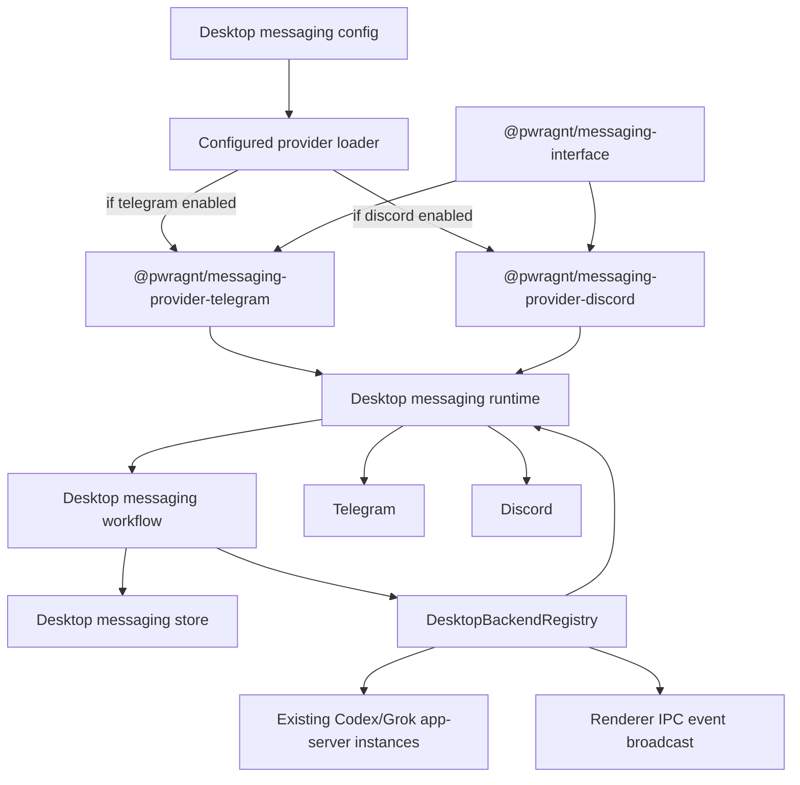
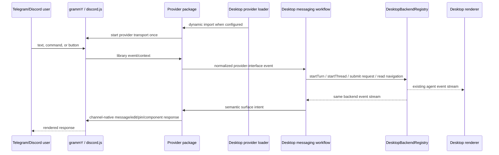
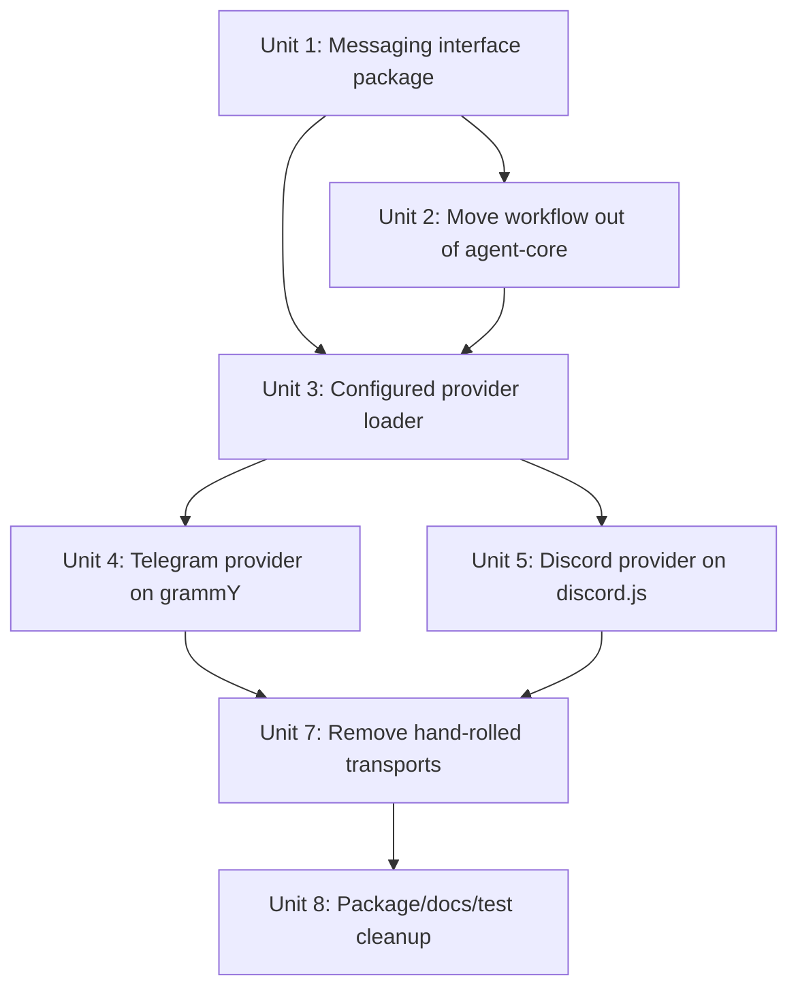

# refactor: Move messaging integration into desktop

## Overview

Refactor the messaging platform integration so the Electron desktop app hosts the messaging gateway, owns channel adapters, and mirrors messages between Telegram/Discord and the same desktop-managed app-server threads the renderer already uses.

This plan corrects the current implementation direction in two ways:

- The messaging controller/store/workflow code should not live in `packages/agent-core`. `agent-core` is the app-server/model runtime layer and will eventually have Default Access and Full Access instances; it should not also become a messaging gateway.
- Telegram and Discord should live in isolated messaging provider packages that use maintained platform libraries, not hand-rolled Bot API/Gateway clients, unless a library proves unusable for a specific behavior.
- The desktop app should depend on a generic messaging provider interface and dynamically load only the configured providers at startup.

## Problem Frame

The desired product behavior is desktop mirroring, not a separate remote agent service. If a user types in Telegram, that input should enter the existing desktop-owned thread. If the agent responds, the response should appear both in the desktop thread and in the bound messaging conversation because both surfaces observe the same backend event stream.

Messaging should therefore be a desktop main-process integration:

- It uses the desktop app's existing `DesktopBackendRegistry` and overlay/navigation state.
- It does not spin up independent app servers.
- It does not duplicate thread/project state outside the desktop runtime.
- It presents channel-neutral workflows through a generic messaging interface, but desktop owns orchestration and configured provider loading.

## Requirements Trace

- R1-R6. Preserve a channel-agnostic surface contract, but locate it at the desktop messaging boundary unless a broader package consumer exists.
- R7-R12. Continue supporting project/thread enumeration, binding, detach, restart recovery, and free-form text routing through desktop-owned backend registry operations.
- R13-R17. Use proper Telegram and Discord libraries to improve rich rendering, edits, buttons, callbacks/interactions, markdown, images, and long-response handling.
- R18-R22. Keep deterministic text fallback and the future light mapper as desktop messaging workflow behavior.
- R23-R27. Keep Telegram and Discord as first adapters while making future Feishu/Lark, Mattermost, Slack, and other adapters implement the same desktop adapter interface.
- R28-R30. Continue not using Vercel Chat SDK as the runtime abstraction.
- R31-R36. Keep channel auth, actor identity, callback TTLs, redaction, binding revocation, and audit context in the desktop messaging layer.

## Scope Boundaries

- In scope: moving messaging controller/store/rendering/browser/status logic out of `packages/agent-core`; replacing hand-written Telegram/Discord transport code with isolated provider packages backed by `grammy` and `discord.js`; ensuring Telegram/Discord input and output mirror the existing desktop thread state.
- In scope: creating a generic messaging interface workspace package and provider workspace packages under `packages/messaging/`.
- In scope: dynamically importing provider packages from desktop startup only when the corresponding provider is configured/enabled.
- In scope: keeping or narrowing `packages/shared` exports only where they are true app-wide DTOs. Messaging provider contracts should live in the messaging interface package instead.
- In scope: preserving current environment/1Password configuration shape unless a dependency needs an additional value.
- Out of scope: a settings screen, hosted webhook service, public bot backend, first-party iOS app, CarPlay UI, remote-view protocol, and full media ingestion from inbound channels.
- Out of scope: changing the desktop renderer's thread model or app-server protocol.

## Context & Research

### Relevant Code and Patterns

- `apps/desktop/src/main/app-server/backend-registry.ts` is the desktop source of truth for thread lists, navigation snapshots, thread starts, turn starts, settings changes, approvals, compaction, interruption, and backend event emission.
- `apps/desktop/src/main/ipc/agent-ipc.ts` already broadcasts backend events to renderer windows. Messaging should subscribe to the same registry event source so Telegram/Discord and the renderer see the same agent outputs.
- `apps/desktop/src/renderer/src/lib/desktop-api.ts` shows the renderer contract already routes through desktop IPC into the backend registry; messaging should use an analogous in-process desktop bridge, not direct app-server clients.
- `apps/desktop/src/main/messaging/desktop-backend-bridge.ts` already points in the right direction by delegating to `DesktopBackendRegistry`.
- `packages/agent-core/src/messaging/*` currently contains messaging controller, store, renderers, resume browser, status card, approval rendering, and mapper logic. This is the main architecture mismatch to correct.
- `apps/desktop/src/main/messaging/telegram-adapter.ts`, `telegram-api.ts`, `discord-adapter.ts`, `discord-api.ts`, and `discord-gateway.ts` currently hand-roll platform transport and payload handling. These are candidates to replace or sharply shrink around library usage.
- `apps/desktop/src/main/messaging/messaging-config.ts` and `scripts/op-run.mjs` already provide a workable 1Password/env entry point for local bot credentials and allowlists.
- `pnpm-workspace.yaml` currently includes `packages/*`, so nested provider packages under `packages/messaging/*` or `packages/messaging/providers/*` will need workspace globs updated explicitly.
- Existing package exports use `src/index.ts` directly during development. New messaging packages can follow that source-export pattern first, then move to built `dist` outputs if packaging demands it.

### Institutional Learnings

- No `docs/solutions/` directory exists yet for messaging integration learnings.
- `docs/plans/2026-04-30-001-feat-messaging-platform-integration-plan.md` and `docs/plans/2026-04-30-002-feat-messaging-command-surfaces-plan.md` captured useful product behavior, but their agent-core ownership decision should be superseded by this plan.
- `docs/brainstorms/2026-04-30-openclaw-codex-conversation-ui-intent-interface-source.md` remains useful prior art for command surfaces, managed messages, pinning, and fallback UX. Its plugin/server split should not drive PwrAgnt's package boundaries.

### External References

- grammY supports both long polling and webhooks, with long polling as the default and simplest local-development deployment: https://grammy.dev/guide/deployment-types.html
- Telegram Bot API semantics still matter under grammY for long polling, webhooks, inline keyboards, edits, pins, callback payloads, and media limits: https://core.telegram.org/bots/api
- Discord Gateway connections require intents, heartbeat/resume handling, and message content intent awareness; Discord's own docs recommend community libraries for the complex Gateway pieces: https://docs.discord.com/developers/events/gateway
- `discord.js` is a maintained TypeScript Discord API library with Gateway, REST, messages, interactions, and component support: https://www.npmjs.com/package/discord.js
- The discord.js guide documents button/component interactions and the 3-second interaction response requirement: https://discordjs.guide/message-components/interactions.html
- pnpm's `workspace:` protocol refuses to resolve to anything other than a local workspace package, which is useful for enforcing provider/interface package relationships: https://pnpm.io/workspaces
- TypeScript project references are intended to split a program into smaller logical projects; referenced projects require `composite`, and `rootDir` defaults to the tsconfig directory when `composite` is enabled: https://www.typescriptlang.org/docs/handbook/project-references.html
- Node package `exports` defines package entry points and encapsulates unexported internals, while dynamic `import()` is supported for asynchronously loading modules in CommonJS and ESM: https://nodejs.org/api/packages.html and https://nodejs.org/api/esm.html

## Key Technical Decisions

- **Desktop owns messaging.** Messaging runtime, workflow controller, binding store, adapters, fallback mapper, and platform setup live under `apps/desktop/src/main/messaging`. The desktop app hosts the gateway and uses its existing registry state.
- **`agent-core` owns app-server/model behavior only.** Remove messaging exports and implementation from `packages/agent-core`. No Telegram/Discord/channel modules should import from `@pwragnt/agent-core` after this refactor except for unrelated app-server APIs that remain valid.
- **Create isolated messaging packages.** Add `packages/messaging/interface`, `packages/messaging/providers/telegram`, and `packages/messaging/providers/discord` as separate pnpm workspace packages. Provider packages import only the interface package, their own files, and their platform SDK dependencies.
- **Use package boundaries as enforcement.** Each messaging package gets its own `package.json`, `tsconfig.json`, `rootDir`, `exports`, and test targets. Provider packages should not be able to import arbitrary `apps/desktop` or `packages/agent-core` source by relative path.
- **Use `grammy` inside the Telegram provider.** Add `grammy` to `packages/messaging/providers/telegram/package.json`. Use long polling for local desktop by default and keep webhook support as a later transport mode. Let grammY own update dispatch, Bot API calls, command registration, callback query handling, and error boundaries.
- **Use `discord.js` inside the Discord provider.** Add `discord.js` to `packages/messaging/providers/discord/package.json`. Let discord.js own Gateway lifecycle, REST calls, message events, interactions, components, and reconnect behavior rather than maintaining a local Gateway implementation.
- **Load providers dynamically.** Desktop startup builds a provider list from config, then imports only enabled provider packages once. If Telegram is not configured, the Telegram provider module is not imported or started. Same for Discord and future providers.
- **Keep channel-neutral workflow, but desktop-local.** Resume browser, status card, approvals, bindings, and fallback mapping remain channel-neutral within the desktop messaging module. Future adapters implement the desktop adapter interface; they do not require code in `agent-core`.
- **Mirror through backend events.** User text from messaging calls `DesktopBackendRegistry.startTurn` for the bound thread. Agent output is delivered to messaging from `DesktopBackendRegistry.onEvent`, the same source used by renderer IPC.
- **Do not duplicate app-server instances.** Messaging must never create its own Codex/Grok app-server client. It talks only to the desktop bridge/registry already running in the Electron app.
- **Treat Message Content as an explicit Discord mode.** Discord DMs, mentions, slash commands, and component interactions can work without broad guild message content access. Free-form guild channel text requires the Message Content privileged intent and should stay gated by config and docs.

## Open Questions

### Resolved During Planning

- **Should `agent-core` contain messaging logic?** No. Move it to `apps/desktop/src/main/messaging` because the desktop app is the integration host and state owner.
- **Should Telegram/Discord remain hand-written API clients?** No for normal transport. Use `grammy` and `discord.js`; keep tiny formatting/policy helpers where they express PwrAgnt rendering choices.
- **Should messaging spin up independent app servers?** No. Messaging mirrors the desktop app's already-running app-server backends through `DesktopBackendRegistry`.
- **Should a settings screen be added now?** No. 1Password/env config remains the setup surface for this PR.
- **Should provider code live directly in `apps/desktop`?** No. The desktop app should own orchestration, but provider implementations should be isolated packages under `packages/messaging/providers/*`.
- **Should providers be statically imported?** No. Use a small configured-provider loader with literal dynamic imports so unconfigured providers are not evaluated or started at app boot.

### Deferred to Implementation

- Whether any current shared messaging types are still needed in `packages/shared` after moving desktop-internal workflow types.
- Exact file move strategy: pure move versus recreate under `apps/desktop/src/main/messaging/core` and `packages/messaging/interface` and delete old files after tests pass.
- Exact workspace/package naming, with `@pwragnt/messaging-interface`, `@pwragnt/messaging-provider-telegram`, and `@pwragnt/messaging-provider-discord` as the planned default unless implementation reveals a repo naming constraint.
- Exact Electron packaging behavior for dynamic provider imports. Use literal specifiers first; if electron-vite packaging cannot retain provider chunks, add an explicit provider manifest or packaging include rule.
- Whether Discord should initially support free-form guild channel text or limit MVP text entry to DMs/mentions unless the bot has Discord's privileged message content intent enabled in the Developer Portal.
- Whether the current JSON messaging store format can be preserved as-is under the desktop module or needs a version migration after moving ownership.

## High-Level Technical Design

> *This illustrates the intended approach and is directional guidance for review, not implementation specification. The implementing agent should treat it as context, not code to reproduce.*

## Implementation Units

- [x] **Unit 1: Create the messaging interface package**

**Goal:** Define the generic provider contract in an isolated workspace package that desktop and provider packages can import without depending on `agent-core` or arbitrary desktop source.

**Requirements:** R1-R6, R23-R27, R31-R36

**Dependencies:** None

**Files:**
- Create: `packages/messaging/interface/package.json`
- Create: `packages/messaging/interface/tsconfig.json`
- Create: `packages/messaging/interface/src/index.ts`
- Modify: `pnpm-workspace.yaml`
- Modify: `tsconfig.json` or workspace TypeScript references if this repo uses a root build graph
- Test: `packages/messaging/interface/src/__tests__/messaging-interface.test.ts`

**Approach:**
- Create a package named `@pwragnt/messaging-interface`.
- Move or recreate provider-facing DTOs here: provider lifecycle, inbound events, outbound semantic surface intents, delivery results, provider capabilities, opaque routing/surface state, callback/action envelopes, actor identity, and audit-safe metadata.
- Keep app-server/navigation DTO dependencies minimal. Prefer importing stable shared contracts only when needed for thread identifiers or content parts; avoid depending on desktop or agent-core modules.
- Configure `tsconfig.json` with `composite`, explicit `rootDir`, narrow `include`, and declaration output if package references are adopted.
- Configure package `exports` to expose only `src/index.ts` or the built entry point, not internal files.

**Patterns to follow:**
- `packages/shared/package.json`
- `packages/shared/src/index.ts`
- `packages/shared/src/contracts/messaging.ts`

**Test scenarios:**
- Happy path: a fake provider can implement the exported provider interface without importing desktop or agent-core code.
- Happy path: a fake desktop host can consume provider capabilities, inbound events, and delivery results through the interface package.
- Regression: the interface package exports one public entry point and does not expose internal modules through package exports.
- Regression: the package typecheck fails if source files outside its `rootDir` are included by relative import.

**Verification:**
- The interface package is the only compile-time contract between desktop orchestration and provider packages.

- [x] **Unit 2: Move messaging workflow ownership to desktop**

**Goal:** Relocate messaging controller/store/renderers/browser/status/fallback logic out of `packages/agent-core` and into desktop main-process messaging modules.

**Requirements:** R1-R6, R7-R22, R31-R36

**Dependencies:** Unit 1

**Files:**
- Create/Modify: `apps/desktop/src/main/messaging/core/*`
- Modify: `apps/desktop/src/main/messaging/messaging-runtime.ts`
- Modify: `apps/desktop/src/main/messaging/desktop-messaging-store.ts`
- Modify/Delete: `packages/shared/src/contracts/messaging.ts`
- Modify: `packages/shared/src/index.ts`
- Modify: `packages/agent-core/src/index.ts`
- Delete/Move: `packages/agent-core/src/messaging/*`
- Move/Update tests: `packages/agent-core/src/__tests__/messaging-*.test.ts` to `apps/desktop/src/main/__tests__/messaging-*.test.ts`

**Approach:**
- Treat the existing messaging code as desktop integration code and move it under `apps/desktop/src/main/messaging/core`.
- Keep channel-neutral types and helpers desktop-local unless another package genuinely consumes them.
- Remove `packages/shared` messaging exports unless a type is still needed by a real cross-package boundary. Existing app-server, navigation, and transcript contracts remain shared.
- Preserve the current behavior while changing ownership; avoid feature changes in this unit except import/path updates.
- Remove messaging exports from `packages/agent-core/src/index.ts`.
- Ensure `packages/agent-core` no longer imports or exports Telegram/Discord/channel concepts.

**Patterns to follow:**
- `apps/desktop/src/main/messaging/messaging-runtime.ts`
- `apps/desktop/src/main/messaging/desktop-backend-bridge.ts`
- `apps/desktop/src/main/ipc/agent-ipc.ts`

**Test scenarios:**
- Happy path: the moved controller can bind a fake channel event to a thread and route text through a fake desktop backend bridge.
- Happy path: the moved store persists bindings and callback handles under the desktop state root.
- Regression: `packages/agent-core` typecheck succeeds with no messaging exports.
- Regression: desktop messaging runtime tests still cover authorization, binding, status rendering, and backend event delivery after import moves.

**Verification:**
- Messaging code is owned by `apps/desktop`; `packages/agent-core` remains focused on app-server/model runtime behavior.

- [x] **Unit 3: Add configured provider loading**

**Goal:** Let desktop load only enabled messaging provider packages once during startup, rather than statically importing every future provider.

**Requirements:** R23-R27, R31-R36

**Dependencies:** Unit 1, Unit 2

**Files:**
- Create: `apps/desktop/src/main/messaging/provider-loader.ts`
- Modify: `apps/desktop/src/main/messaging/messaging-runtime.ts`
- Modify: `apps/desktop/src/main/messaging/messaging-config.ts`
- Modify: `apps/desktop/package.json`
- Modify: `pnpm-lock.yaml`
- Test: `apps/desktop/src/main/__tests__/messaging-provider-loader.test.ts`
- Test: `apps/desktop/src/main/__tests__/messaging-runtime.test.ts`

**Approach:**
- Add desktop dependencies on the interface and provider workspace packages with `workspace:*`.
- Represent configured providers as explicit config entries: provider id, enabled flag, credential/config object, authorized actor ids, and provider-specific optional flags.
- Implement a provider registry with literal dynamic imports for known provider package names. Literal specifiers keep the import graph discoverable while still avoiding module evaluation until selected.
- Cache each loaded provider module for the process lifetime so Telegram/Discord are loaded once and started once.
- Make unconfigured providers invisible at startup: do not import, construct, register handlers, or initialize their SDK clients.
- Add startup logging that names enabled provider ids and counts authorized actors, without logging tokens.

**Patterns to follow:**
- `apps/desktop/src/main/messaging/messaging-config.ts`
- `apps/desktop/src/main/messaging/messaging-runtime.ts`
- Node dynamic `import()` with explicit package specifiers

**Test scenarios:**
- Happy path: Telegram config causes exactly one dynamic import of `@pwragnt/messaging-provider-telegram` and starts one provider instance.
- Happy path: Discord config causes exactly one dynamic import of `@pwragnt/messaging-provider-discord` and starts one provider instance.
- Edge case: no provider config starts the runtime without importing Telegram or Discord provider modules.
- Edge case: disabling Discord while Telegram is configured imports only Telegram.
- Error path: a provider import failure logs the provider id and keeps other configured providers running.
- Regression: provider configs are redacted in startup logs.

**Verification:**
- Adding a future provider requires adding a package and a loader registry entry, not changing desktop workflow logic.

- [x] **Unit 4: Make desktop registry mirroring explicit**

**Goal:** Ensure messaging input/output is a mirror of desktop thread state, using the same registry and event source as the renderer.

**Requirements:** R7-R12, R13-R17

**Dependencies:** Unit 2, Unit 3

**Files:**
- Modify: `apps/desktop/src/main/messaging/desktop-backend-bridge.ts`
- Modify: `apps/desktop/src/main/messaging/messaging-runtime.ts`
- Modify: `apps/desktop/src/main/ipc/agent-ipc.ts` only if a shared event summary helper should be extracted
- Test: `apps/desktop/src/main/__tests__/messaging-runtime.test.ts`
- Test: `apps/desktop/src/main/__tests__/desktop-backend-bridge.test.ts`

**Approach:**
- Document and enforce that messaging uses `DesktopBackendRegistry` only; it should not construct app-server clients.
- Subscribe messaging to `registry.onEvent` and deliver assistant output from the same events the renderer receives.
- Preserve active binding/status updates from backend events without treating messaging as the owner of thread truth.
- Add defensive error handling so one failed channel delivery does not create unhandled promise rejections or break renderer event delivery.

**Patterns to follow:**
- `apps/desktop/src/main/ipc/agent-ipc.ts`
- `apps/desktop/src/main/app-server/backend-registry.ts`

**Test scenarios:**
- Integration: a text event from a bound fake channel calls `startTurn` for the existing thread id.
- Integration: an `item/completed` agent message event is delivered to a bound fake channel and remains independent of renderer IPC.
- Error path: adapter delivery failure is logged and isolated; backend event processing continues for other adapters/bindings.
- Regression: no tests instantiate Codex/Grok app-server clients from messaging.

**Verification:**
- Telegram/Discord behavior is traceable to existing desktop registry operations and backend events.

- [x] **Unit 5: Implement the Telegram provider package with grammY**

**Goal:** Use `grammy` for Telegram bot lifecycle, updates, command registration, callbacks, and Bot API calls while preserving the desktop adapter boundary.

**Requirements:** R13-R17, R23, R26-R27, R31-R36

**Dependencies:** Unit 1, Unit 3, Unit 4

**Files:**
- Create: `packages/messaging/providers/telegram/package.json`
- Create: `packages/messaging/providers/telegram/tsconfig.json`
- Create/Modify: `packages/messaging/providers/telegram/src/*`
- Modify: `pnpm-lock.yaml`
- Modify/Delete: `apps/desktop/src/main/messaging/telegram-adapter.ts`
- Modify/Delete: `apps/desktop/src/main/messaging/telegram-api.ts`
- Move/Modify: `apps/desktop/src/main/messaging/telegram-formatting.ts` to `packages/messaging/providers/telegram/src/telegram-formatting.ts`
- Test: `packages/messaging/providers/telegram/src/__tests__/telegram-provider.test.ts`
- Test: `packages/messaging/providers/telegram/src/__tests__/telegram-formatting.test.ts`

**Approach:**
- Add `grammy` as a provider package dependency.
- Build the provider around a grammY `Bot` instance injected for tests and constructed from provider config in production.
- Use grammY long polling for local desktop by default.
- Continue deleting or clearing an existing webhook before local polling if needed, but treat that as a Telegram transport setup policy.
- Use grammY context APIs for messages, callback queries, command registration, replies, edits, pins, and unpins.
- Keep PwrAgnt formatting policy in local helpers: markdown-to-Telegram conversion, chunking, media/image policy, button layout, callback-handle allocation.
- Ignore Telegram service updates such as pin notifications deliberately, not by blanket-dropping all bot-originated events.
- Import only `@pwragnt/messaging-interface` and local provider files from PwrAgnt packages.

**Patterns to follow:**
- Current `apps/desktop/src/main/messaging/telegram-adapter.ts` behavior tests
- `apps/desktop/src/main/messaging/telegram-formatting.ts`
- `packages/messaging/interface/src/index.ts`

**Test scenarios:**
- Happy path: `/resume` command from grammY message context normalizes to a desktop messaging command event.
- Happy path: grammY callback query resolves a stored callback handle and answers the callback.
- Happy path: status intent with target surface edits and pins the Telegram message where supported.
- Edge case: Telegram pin service update is ignored without dropping unrelated bot-authored messages from other bot accounts.
- Error path: Telegram API errors produce failed delivery results or logs without crashing the desktop runtime.
- Regression: callback payloads remain short handles and do not embed thread ids, tokens, or full workflow state.

**Verification:**
- Telegram adapter code uses grammY for platform transport and Bot API calls; PwrAgnt logic remains in desktop workflow/formatting helpers.

- [x] **Unit 6: Implement the Discord provider package with discord.js**

**Goal:** Use `discord.js` for Discord Gateway, REST, messages, interactions, components, reconnects, and intent handling.

**Requirements:** R13-R17, R23, R26-R27, R31-R36

**Dependencies:** Unit 1, Unit 3, Unit 4

**Files:**
- Create: `packages/messaging/providers/discord/package.json`
- Create: `packages/messaging/providers/discord/tsconfig.json`
- Create/Modify: `packages/messaging/providers/discord/src/*`
- Modify: `pnpm-lock.yaml`
- Modify/Delete: `apps/desktop/src/main/messaging/discord-adapter.ts`
- Modify/Delete: `apps/desktop/src/main/messaging/discord-api.ts`
- Modify/Delete: `apps/desktop/src/main/messaging/discord-gateway.ts`
- Move/Modify: `apps/desktop/src/main/messaging/discord-formatting.ts` to `packages/messaging/providers/discord/src/discord-formatting.ts`
- Test: `packages/messaging/providers/discord/src/__tests__/discord-provider.test.ts`
- Test: `packages/messaging/providers/discord/src/__tests__/discord-formatting.test.ts`

**Approach:**
- Add `discord.js` as a provider package dependency.
- Build the provider around an injected discord.js client for tests and a production client from provider config.
- Register message, interaction, ready/error, and lifecycle handlers through discord.js.
- Use discord.js message components for buttons and stored callback handles for `custom_id`.
- Use discord.js message edit/pin APIs where available; degrade to new messages when permissions or channel type prevent edits/pins.
- Gate free-form guild channel text behind explicit config and Discord Message Content intent documentation. DMs, mentions, slash commands, and component interactions should be the lower-friction MVP path.
- Delete or quarantine the local Gateway implementation once discord.js covers the needed lifecycle.
- Import only `@pwragnt/messaging-interface` and local provider files from PwrAgnt packages.

**Patterns to follow:**
- Current `apps/desktop/src/main/messaging/discord-adapter.ts` behavior tests
- `apps/desktop/src/main/messaging/discord-formatting.ts`
- `packages/messaging/interface/src/index.ts`

**Test scenarios:**
- Happy path: Discord DM message normalizes to a desktop text event for an authorized actor.
- Happy path: Discord button interaction resolves a stored callback handle and responds within the interaction contract.
- Happy path: assistant/status intent renders to Discord content plus components, with chunking for long content.
- Edge case: guild message with empty content due to missing Message Content intent produces a clear diagnostic or is ignored according to adapter policy.
- Error path: missing permissions for pin/edit degrade to posted message or logged failed delivery without breaking the runtime.
- Regression: the adapter does not use the deleted hand-written Gateway class.

**Verification:**
- Discord adapter behavior is driven by discord.js, with PwrAgnt-specific formatting and workflow still isolated.

- [x] **Unit 7: Remove hand-rolled platform transports and tighten boundaries**

**Goal:** Delete now-obsolete raw Telegram/Discord API and Gateway code, leaving only library-backed adapters and desktop-local channel policy helpers.

**Requirements:** R1-R6, R23-R30

**Dependencies:** Unit 5, Unit 6

**Files:**
- Delete: `packages/messaging/providers/telegram/src/telegram-api.ts`
- Delete: `packages/messaging/providers/discord/src/discord-api.ts`
- Delete: `packages/messaging/providers/discord/src/discord-gateway.ts`
- Modify: `packages/messaging/providers/telegram/src/telegram-adapter.ts`
- Modify: `packages/messaging/providers/discord/src/discord-adapter.ts`
- Modify: `apps/desktop/src/main/__tests__/telegram-adapter.test.ts`
- Modify: `apps/desktop/src/main/__tests__/discord-adapter.test.ts`
- Delete: `packages/messaging/providers/discord/src/__tests__/discord-gateway.test.ts`
- Test: `apps/desktop/src/main/__tests__/messaging-provider-loader.test.ts`

**Approach:**
- Remove raw clients that duplicate library responsibilities.
- Keep small local type guards only when needed to normalize library events into PwrAgnt desktop events.
- Keep formatting helpers separate from transport helpers so adapter rendering policy remains testable.
- Ensure dependency direction is one-way: adapters depend on desktop messaging workflow contracts, not the reverse.
- Add import-boundary checks through package boundaries and TypeScript config rather than relying on convention in a shared directory.

**Patterns to follow:**
- Existing adapter test harness style using injected dependencies

**Test scenarios:**
- Regression: no imports remain from deleted raw API/Gateway modules.
- Regression: adapter tests cover the same user-visible behavior through injected library-like mocks.
- Error path: unknown library event shapes are ignored or logged without throwing.

**Verification:**
- Platform transport ownership is delegated to grammY/discord.js, and the remaining code expresses PwrAgnt policy only.

- [ ] **Unit 8: Update package metadata, docs, and setup guidance**

**Goal:** Make the dependency and architecture choices visible to maintainers and testers.

**Requirements:** R23-R30, R31-R36

**Dependencies:** Units 1-7

**Files:**
- Modify: `docs/plans/2026-04-30-001-feat-messaging-platform-integration-plan.md` or add a note linking to this superseding refactor plan
- Modify: `docs/plans/2026-04-30-002-feat-messaging-command-surfaces-plan.md` or add a note linking to this superseding refactor plan
- Modify: `README.md` if it already contains local dev setup, otherwise create/update an appropriate docs page under `docs/`
- Modify: `scripts/op-run.mjs` only if new Discord/Telegram config fields are required
- Test expectation: none -- documentation and package metadata only, covered by package install/typecheck in implementation.

**Approach:**
- Document that Telegram uses grammY long polling locally and webhooks are deferred.
- Document that Discord uses discord.js and may require Message Content intent for free-form guild text.
- Document the provider package contract: interface package, provider package exports, dynamic provider loading, and import restrictions.
- Document that `PWRAGNT_MESSAGING_TELEGRAM_AUTHORIZED_USER_IDS` and Discord allowlists are stable platform user IDs as strings.
- Add a short architecture note: desktop hosts messaging; `agent-core` remains app-server/model runtime; messaging mirrors existing desktop threads.
- Keep current 1Password secret field names unless implementation proves a new field is necessary.

**Verification:**
- A maintainer can tell from docs and package metadata why `grammy` and `discord.js` are present and why messaging code is desktop-owned.

## System-Wide Impact

- **Interaction graph:** Messaging will sit beside renderer IPC as another consumer of `DesktopBackendRegistry`. It must not become a parallel app-server owner.
- **Error propagation:** Adapter/library errors should be logged through `pwragnt:messaging`, converted to failed delivery results when possible, and isolated per adapter/binding.
- **State lifecycle risks:** Moving store ownership requires preserving existing `messaging-state.json` data or adding a clear migration if the shape changes.
- **Package boundary risks:** Provider packages must not reach back into desktop internals or `agent-core`. Enforce this with workspace package dependencies, package exports, TypeScript `rootDir`/project references, and tests that import providers only through `@pwragnt/messaging-interface`.
- **Startup lifecycle:** Provider packages should be imported, constructed, and started only when configured. Adding many future providers should not add startup side effects for unconfigured providers.
- **API surface parity:** Renderer and messaging should observe the same thread events. If an agent response is visible in Telegram but not the desktop renderer, or vice versa, the event source is wrong.
- **Integration coverage:** Unit tests should prove fake registry events deliver to messaging, and fake messaging input calls registry methods. Live manual Telegram/Discord smoke tests remain necessary because bot libraries and platform permissions are external.
- **Unchanged invariants:** App-server protocol contracts, renderer thread state, and backend registry ownership do not change. This refactor changes messaging package boundaries and platform adapter implementation.

## Risks & Dependencies

| Risk | Mitigation |
| --- | --- |
| Moving code from `agent-core` breaks tests by import churn rather than behavior | Move ownership first with minimal behavior changes and preserve focused messaging tests under desktop. |
| `grammy` abstractions obscure Telegram details needed for managed surfaces | Keep Telegram formatting/callback policy helpers local and use grammY's raw API access where needed. |
| `discord.js` adds a larger dependency than the hand-rolled Gateway | Accept the dependency because Gateway lifecycle, reconnect, interactions, REST, and component behavior are exactly what a maintained library should own. |
| Provider packages import desktop or agent-core internals and recreate the boundary problem | Put providers in separate workspace packages with narrow dependencies, explicit exports, TypeScript `rootDir`, and provider tests that compile without desktop source access. |
| Dynamic imports are optimized or bundled incorrectly by Electron packaging | Use literal dynamic import specifiers first, verify packaged startup behavior, and add a provider manifest or electron-vite packaging include rule if implementation proves it is needed. |
| Unconfigured provider packages still execute startup side effects | Require providers to export inert factories only; SDK clients are constructed only after the desktop loader calls the factory with config. |
| Discord free-form text does not work in guild channels without privileged intent | Document and gate guild text; prefer DMs, mentions, slash commands, and component interactions for the MVP. |
| Existing stored bindings/callbacks are invalidated by moving modules | Preserve store file shape where practical; if not, add a store migration that keeps active bindings. |
| Future iOS reuse becomes harder if everything is desktop-local | Defer extraction until a second host exists. A premature shared package already caused boundary confusion. |

## Documentation / Operational Notes

- The PR description should explicitly call out `grammy` and `discord.js` as provider package dependencies loaded by the desktop runtime when configured.
- Package metadata should make the actual dependency location clear: `grammy` belongs to the Telegram provider package, `discord.js` belongs to the Discord provider package, and desktop depends on provider packages through workspace dependencies.
- Setup docs should name the 1Password item and fields, including Telegram user id versus bot id.
- Discord docs should mention Message Content intent as optional/privileged and explain the fallback interaction modes.
- Existing plans `2026-04-30-001` and `2026-04-30-002` should be treated as behavior plans, with this plan superseding their package-boundary decisions.

## Sources & References

- Origin document: `docs/brainstorms/2026-04-30-messaging-platform-integration-requirements.md`
- Prior plan: `docs/plans/2026-04-30-001-feat-messaging-platform-integration-plan.md`
- Prior plan: `docs/plans/2026-04-30-002-feat-messaging-command-surfaces-plan.md`
- Desktop registry: `apps/desktop/src/main/app-server/backend-registry.ts`
- Desktop renderer IPC: `apps/desktop/src/main/ipc/agent-ipc.ts`
- Current desktop messaging runtime: `apps/desktop/src/main/messaging/messaging-runtime.ts`
- Current agent-core messaging location to remove: `packages/agent-core/src/messaging/`
- Planned messaging interface package: `packages/messaging/interface/`
- Planned Telegram provider package: `packages/messaging/providers/telegram/`
- Planned Discord provider package: `packages/messaging/providers/discord/`
- grammY deployment docs: https://grammy.dev/guide/deployment-types.html
- Telegram Bot API: https://core.telegram.org/bots/api
- Discord Gateway docs: https://docs.discord.com/developers/events/gateway
- discord.js package docs: https://www.npmjs.com/package/discord.js
- discord.js component interaction guide: https://discordjs.guide/message-components/interactions.html
- pnpm workspace protocol docs: https://pnpm.io/workspaces
- TypeScript project references docs: https://www.typescriptlang.org/docs/handbook/project-references.html
- Node package exports docs: https://nodejs.org/api/packages.html
- Node dynamic import docs: https://nodejs.org/api/esm.html
