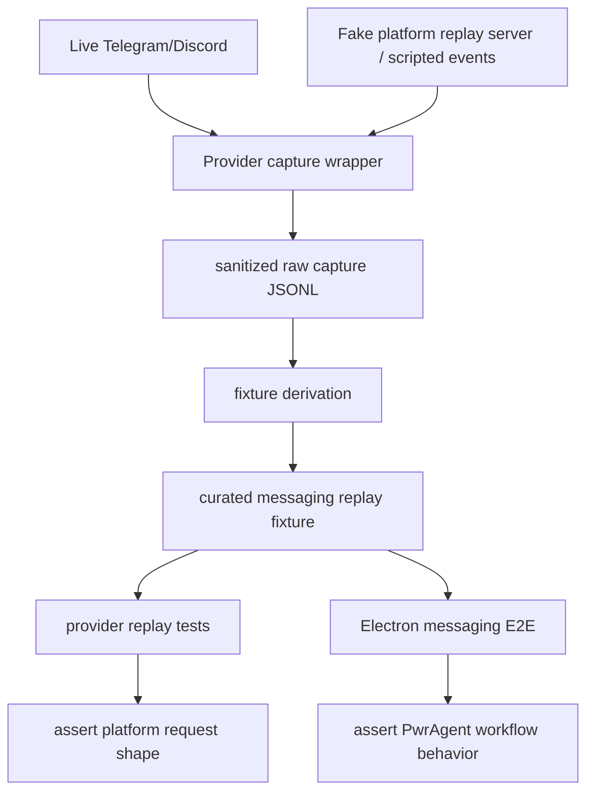

# feat: Add messaging provider replay harness

## Overview

Add a capture, inspection, sanitization, and replay harness for Telegram and
Discord messaging providers. The goal is to lock down rich messaging behavior
without relying only on hand-built mocks or manual live smoke tests.

The recommended pattern is not to point Telegram Web or Discord clients at a
fake backend. Telegram and Discord consumer clients talk to their own platform
infrastructure, not to the Bot API or bot REST endpoints directly. Instead, the
harness should record and replay the provider boundary that PwrAgent actually
owns:

- inbound platform events that our providers normalize into
  `MessagingInboundEvent`
- outbound SDK/API requests that our providers send to Telegram or Discord
- sanitized raw captures kept as evidence
- curated replay fixtures that drive deterministic provider and Electron tests

This mirrors the existing desktop protocol replay pattern, but the boundary is
the messaging provider/platform edge rather than the Codex/Grok app-server
edge.

## Problem Frame

The messaging integration now has unit coverage and manual smoke guidance, but
the tests are still mostly synthetic. They prove selected normalization and
formatting paths, not that real SDK transport layers produce the expected
Telegram Bot API calls, Discord REST requests, callback handles, pagination
surfaces, pinned status flows, and rich button navigation over time.

The user need is practical: when `/resume`, `/status`, approvals, plan
questionnaires, images, markdown, or button callbacks regress, we should be able
to replay a captured interaction and see exactly which platform request or
normalized event changed. This is especially important because the product goal
includes mobile and voice-driven operation where manual debugging is slower
(see origin: `docs/brainstorms/2026-04-30-messaging-platform-integration-requirements.md`).

## Requirements Trace

- R1. Capture provider-boundary traffic for Telegram and Discord, including
  outbound platform requests and inbound platform updates/interactions.
- R2. Store raw captures as sanitized evidence and derive smaller replay
  fixtures for CI, following the existing desktop replay-harness principle
  (see related origin: `docs/brainstorms/2026-04-18-desktop-integration-test-replay-harness-requirements.md`).
- R3. Preserve enough request details to inspect method/route, normalized body,
  reply markup/components, markdown/HTML output, images, callback handles, and
  delivery outcomes.
- R4. Redact bot tokens, interaction tokens, user IDs, chat/channel IDs, local
  paths, message text marked sensitive, and other configured secrets before
  checked-in fixtures are produced.
- R5. Replay must drive rich workflows: `/resume`, project/thread navigation,
  binding, status refresh/update, approval buttons, questionnaire choices,
  text fallback, markdown/code rendering, long-response chunking, images, and
  unsupported media.
- R6. Tests must remain channel-generic at the workflow layer. Assertions that
  inspect Telegram `reply_markup` or Discord components belong in provider
  tests or provider-aware replay expectations, not in `MessagingController`
  business logic.
- R7. The harness must work for Discord too, but with a different transport
  shape: Discord REST requests are recordable like Telegram Bot API calls,
  while Gateway events should be replayed as scripted events unless a later
  full fake Gateway server earns its complexity.
- R8. Live platform smoke tests remain useful but optional. They should seed
  captures and catch platform drift; CI should primarily run deterministic
  replay fixtures.

## Scope Boundaries

- In scope: provider-boundary capture, sanitization, fixture derivation,
  replay, focused provider integration tests, Electron E2E tests backed by fake
  messaging providers, and documentation for capture recipes.
- In scope: Telegram Bot API request inspection through grammY client hooks,
  local fake Bot API responses, and direct `handleUpdate`-style replay.
- In scope: Discord REST request inspection and scripted Gateway/interaction
  replay through provider seams.
- Out of scope: replacing manual smoke tests against real Telegram or Discord.
- Out of scope: faking the Telegram Web app, Discord desktop app, or full
  consumer-client protocols.
- Out of scope: a complete fake MTProto Telegram server, a complete Discord
  Gateway implementation, or pixel-perfect screenshots of external messaging
  clients.
- Out of scope: changing the user-facing messaging product behavior.

## Context & Research

### Relevant Code and Patterns

- `packages/messaging/providers/telegram/src/telegram-adapter.ts` already owns
  grammY startup, command registration, long polling, callback normalization,
  and Bot API delivery.
- `packages/messaging/providers/discord/src/discord-adapter.ts` already owns
  Discord REST delivery, Gateway event normalization, and component callback
  handling.
- `apps/desktop/src/main/messaging/provider-loader.ts` dynamically loads only
  configured provider packages, which is the right runtime boundary for enabling
  capture/replay wrappers.
- `apps/desktop/e2e/fixtures/README.md` documents the existing raw-capture plus
  derived-fixture workflow for app-server protocol traffic.
- `apps/desktop/src/main/testing/fixture-derivation.ts` and
  `apps/desktop/src/main/__tests__/fixture-derivation.test.ts` provide the
  repo pattern for selecting raw capture windows, redacting strings, deriving
  checked-in fixtures, and preserving unknown events.
- `apps/desktop/e2e/fixtures/electron-app.ts` launches Electron with a replay
  fixture and exposes a driver for deterministic advancement. Messaging replay
  should reuse that style rather than create a second E2E harness philosophy.

### grammY Prior Art

The local grammY checkout uses mostly synthetic integration-style tests rather
than live Telegram tests:

- grammY stubs `globalThis.fetch` in `test/core/client.test.ts` to inspect raw
  Bot API request behavior.
- grammY stubs `bot.api.getUpdates`, `deleteWebhook`, and related methods in
  `test/bot.test.ts` to exercise polling lifecycle, errors, retries, and
  update ordering.
- grammY drives inbound behavior directly with `bot.handleUpdate` in
  `test/bot.test.ts`.
- grammY uses `bot.api.config.use` transformers in `test/bot.test.ts` to
  inspect API method/payload after middleware has gone through the grammY API
  layer.
- grammY tests webhook adapters synthetically in `test/convenience/webhook.test.ts`
  by invoking webhook callbacks with fake updates and fake response functions.

The main lesson is that we should lean on SDK-supported seams: fake `fetch`,
API transformers, direct update handling, and controlled long-polling responses
before attempting live platform UI automation.

### Institutional Learnings

- No `docs/solutions/` directory exists yet.
- The desktop replay harness requirements and existing fixture implementation
  are the strongest local institutional pattern: capture at the boundary the app
  owns, keep raw evidence, derive compact fixtures, and make replay
  deterministic.

### External References

- Telegram Bot API: `getUpdates`, `setWebhook`, `deleteWebhook`,
  `getWebhookInfo`, and the local Bot API server shape are documented at
  https://core.telegram.org/bots/api.
- grammY advanced client options include custom `apiRoot`, custom `fetch`,
  custom URL building, and API transformers. The local source shows this in
  grammY `src/core/client.ts` and `src/bot.ts`.
- Discord Developer Documentation covers REST, Gateway events, message
  components, and interactions at https://discord.com/developers/docs.
- discord.js REST and Gateway abstractions are the SDK layer PwrAgent already
  depends on through `@pwragent/messaging-provider-discord`.

## Key Technical Decisions

- Capture the provider/platform boundary, not the external chat UI:
  Telegram Web and Discord clients cannot be redirected to a small fake Bot API
  backend in a way that proves bot behavior. Provider-boundary capture is the
  controllable and portable contract.
- Keep two artifact tiers: raw sanitized captures and curated replay fixtures.
  Raw captures preserve evidence and platform drift; replay fixtures stay small
  and readable for CI.
- Use SDK seams before proxies. grammY provides `apiRoot`, custom `fetch`, API
  transformers, and `handleUpdate`; Discord already has provider seams for REST
  and Gateway injection. A fake HTTP server is useful, but only after the
  provider-level hooks exist.
- Make Telegram and Discord share capture schema and fixture workflows, not
  identical transport emulation. Telegram Bot API is HTTP long polling; Discord
  is REST plus Gateway/interaction events.
- Treat live platform capture as a seeding workflow. CI replay should not depend
  on real Telegram/Discord credentials unless a test is explicitly marked as
  live smoke.
- Sanitize by structured fields first and string redaction second. Tokens,
  interaction tokens, user IDs, chat IDs, channel IDs, file IDs, and local paths
  need deterministic placeholders so fixtures are diffable and safe.

## Open Questions

### Resolved During Planning

- Can we point Telegram Web at a fake backend for E2E? No. Telegram clients
  communicate with Telegram infrastructure; our bot talks to the Bot API. A
  fake Bot API can test PwrAgent and grammY calls, but it does not become a
  Telegram consumer client.
- Does the pattern work for Discord too? Yes, with asymmetry. Discord REST
  requests can be captured and replayed similarly. Gateway events should start
  as scripted provider events because a full fake Discord Gateway is higher
  complexity than the first test need.
- Should replay replace manual Telegram/Discord smoke tests? No. Manual smoke
  remains the platform drift and capture-seeding path; replay is the CI and
  regression path.

### Deferred to Implementation

- Exact capture JSON schema names and fixture field names: implementation
  should align with existing replay fixture naming once the shared testing
  package is created.
- Whether Discord REST capture should use a configurable `discord.js` REST base
  URL, a custom REST request handler, or our existing injected `DiscordApi`
  seam: choose the smallest SDK-compatible seam after checking the installed
  `discord.js` APIs in code.
- Whether to store messaging replay fixtures beside desktop replay fixtures or
  under provider packages: this plan defaults to provider fixtures for
  provider-only tests and desktop fixtures for Electron E2E, but final naming
  can follow implementation ergonomics.

## High-Level Technical Design

> *This illustrates the intended approach and is directional guidance for
> review, not implementation specification. The implementing agent should treat
> it as context, not code to reproduce.*

## Implementation Units

- [ ] **Unit 1: Define shared messaging capture artifacts**

**Goal:** Create the common capture schema, redaction model, and fixture
derivation foundation used by both Telegram and Discord provider tests.

**Requirements:** R1, R2, R3, R4, R6, R8

**Dependencies:** None

**Files:**
- Create: `packages/messaging/testing/package.json`
- Create: `packages/messaging/testing/tsconfig.json`
- Create: `packages/messaging/testing/src/index.ts`
- Create: `packages/messaging/testing/src/capture-schema.ts`
- Create: `packages/messaging/testing/src/redaction.ts`
- Create: `packages/messaging/testing/src/fixture-derivation.ts`
- Create: `packages/messaging/testing/src/__tests__/redaction.test.ts`
- Create: `packages/messaging/testing/src/__tests__/fixture-derivation.test.ts`
- Modify: `pnpm-lock.yaml`

**Approach:**
- Model capture records around direction, provider, sequence, timestamp,
  scenario/capture id, platform event kind, method/route, normalized request
  body, normalized response body, and raw sanitized payload when useful.
- Keep provider-specific payloads inside typed `platform` or `payload` fields
  rather than forcing Telegram and Discord into identical request shapes.
- Implement structured redactors for token-like fields and deterministic ID
  mapping before generic string replacement.
- Preserve unknown platform events in raw captures and derived fixtures.

**Execution note:** Characterization-first against the existing desktop
fixture-derivation style.

**Patterns to follow:**
- `apps/desktop/src/main/testing/fixture-derivation.ts`
- `apps/desktop/src/main/__tests__/fixture-derivation.test.ts`
- `apps/desktop/e2e/fixtures/README.md`

**Test scenarios:**
- Happy path: a raw Telegram capture with `sendMessage` and a callback update
  derives a smaller fixture preserving sequence order.
- Happy path: a raw Discord capture with a REST message and a Gateway
  interaction derives a fixture preserving route, method, and component IDs.
- Edge case: unknown provider event kinds survive derivation.
- Error path: a capture containing an unredacted bot token fails sanitization
  validation.
- Error path: configured string redactions replace local paths and user-chosen
  sensitive values before fixture writing.

**Verification:**
- Both providers can share one capture artifact package without importing
  desktop internals.

- [ ] **Unit 2: Add Telegram capture and fake Bot API replay**

**Goal:** Capture grammY Bot API calls and replay Telegram updates through
SDK-supported seams so tests exercise grammY layers, callback handles, and
request payloads.

**Requirements:** R1, R3, R4, R5, R6, R8

**Dependencies:** Unit 1

**Files:**
- Modify: `packages/messaging/providers/telegram/src/telegram-adapter.ts`
- Create: `packages/messaging/providers/telegram/src/testing/telegram-capture.ts`
- Create: `packages/messaging/providers/telegram/src/testing/fake-telegram-bot-api.ts`
- Create: `packages/messaging/providers/telegram/src/__tests__/telegram-capture.test.ts`
- Modify: `packages/messaging/providers/telegram/src/index.ts`

**Approach:**
- Add a testing-only helper that builds a grammY `Bot` with capture hooks,
  custom `apiRoot` or custom `fetch`, and optional API transformers.
- Keep production construction simple; the testing helper should adapt to the
  existing `TelegramBotLike` seam rather than pushing capture code into normal
  runtime paths.
- Implement a fake Telegram Bot API surface that can respond to
  `getWebhookInfo`, `deleteWebhook`, `setMyCommands`, `getUpdates`,
  `sendMessage`, `editMessageText`, `sendPhoto`, `answerCallbackQuery`,
  `pinChatMessage`, and `unpinChatMessage`.
- Support an update queue so replay tests can feed `/resume`, callback queries,
  media messages, and bot service updates through long polling or direct
  `handleUpdate`.

**Patterns to follow:**
- grammY `test/core/client.test.ts` for fetch stubbing.
- grammY `test/bot.test.ts` for `getUpdates` stubbing and `handleUpdate`.
- `apps/desktop/src/main/__tests__/telegram-adapter.test.ts`

**Test scenarios:**
- Happy path: `/resume` update enters through the fake Bot API queue and
  results in a captured `sendMessage` with expected text and inline keyboard.
- Happy path: a captured callback query results in `answerCallbackQuery` and
  the expected normalized callback event.
- Happy path: a status update uses `editMessageText` when a target message id
  is present and falls back when the fake API returns a non-editable error.
- Edge case: Telegram callback data remains a short opaque handle and does not
  embed thread ids or tokens.
- Edge case: a pin service update from the bot is ignored while unrelated
  human text is still processed.
- Error path: fake Bot API 429 or 5xx responses are captured with sanitized
  details and do not leak the bot token.

**Verification:**
- Telegram replay tests exercise grammY request construction, not only a hand
  mocked `TelegramBotApi`.

- [ ] **Unit 3: Add Discord capture and scripted Gateway replay**

**Goal:** Capture Discord REST requests and replay Gateway/interaction events
through provider seams while keeping Discord transport complexity bounded.

**Requirements:** R1, R3, R4, R5, R6, R7, R8

**Dependencies:** Unit 1

**Files:**
- Modify: `packages/messaging/providers/discord/src/discord-adapter.ts`
- Create: `packages/messaging/providers/discord/src/testing/discord-capture.ts`
- Create: `packages/messaging/providers/discord/src/testing/fake-discord-rest.ts`
- Create: `packages/messaging/providers/discord/src/testing/scripted-discord-gateway.ts`
- Create: `packages/messaging/providers/discord/src/__tests__/discord-capture.test.ts`
- Modify: `packages/messaging/providers/discord/src/index.ts`

**Approach:**
- Keep REST capture focused on route, method, body, allowed mentions,
  embeds, component rows, and interaction callback responses.
- Use the existing `DiscordGatewayConnection` seam to script
  `MESSAGE_CREATE` and `INTERACTION_CREATE` events in replay tests.
- Defer a complete fake Discord Gateway server until a failing test proves we
  need websocket-level behavior such as reconnect, resume, identify, or
  heartbeat assertions.
- Preserve the ability to capture production SDK REST output without requiring
  a real Discord bot token in CI.

**Patterns to follow:**
- `packages/messaging/providers/discord/src/discord-adapter.ts`
- `apps/desktop/src/main/__tests__/discord-adapter.test.ts`
- Discord Developer Documentation for REST route and interaction response
  semantics.

**Test scenarios:**
- Happy path: `/threads` message event produces a captured Discord REST message
  with defensive `allowed_mentions` and expected components.
- Happy path: button interaction replay produces an interaction callback
  acknowledgement before the semantic callback reaches the controller.
- Happy path: image output produces content plus an image embed.
- Edge case: guild message with missing content produces the existing message
  content intent diagnostic.
- Error path: REST failure capture includes route and sanitized response but no
  bot token or interaction token.
- Regression: agent output containing `@everyone` remains neutralized.

**Verification:**
- Discord replay proves both outbound REST request shape and inbound Gateway
  event normalization without reintroducing a hand-written production Gateway.

- [ ] **Unit 4: Wire desktop capture and replay configuration**

**Goal:** Let the Electron main process enable messaging capture/replay in
development and E2E without loading unconfigured live providers.

**Requirements:** R1, R2, R4, R5, R6, R8

**Dependencies:** Units 1-3

**Files:**
- Modify: `apps/desktop/src/main/messaging/provider-loader.ts`
- Modify: `apps/desktop/src/main/messaging/messaging-config.ts`
- Modify: `apps/desktop/src/main/messaging/messaging-runtime.ts`
- Create: `apps/desktop/src/main/messaging/testing/messaging-capture-runtime.ts`
- Create: `apps/desktop/src/main/__tests__/messaging-capture-runtime.test.ts`
- Modify: `apps/desktop/src/main/__tests__/messaging-provider-loader.test.ts`

**Approach:**
- Add explicit test/development configuration for messaging capture root,
  replay fixture path, provider selection, and live-provider disablement.
- Ensure capture wrappers are applied only when configured; normal startup
  should still dynamically load only configured providers.
- Record messaging capture files under a separate root from app-server protocol
  captures, but follow the same index-plus-jsonl convention.
- Redact config in logs and never print capture file contents that may include
  user text or platform IDs.

**Patterns to follow:**
- `apps/desktop/src/main/testing/capture-store.ts`
- `apps/desktop/src/main/messaging/messaging-runtime.ts`
- `apps/desktop/src/main/messaging/provider-loader.ts`

**Test scenarios:**
- Happy path: with capture enabled and Telegram configured, provider output is
  written to a messaging capture JSONL file.
- Happy path: with replay fixture configured, no live Telegram or Discord
  credentials are required.
- Edge case: capture is disabled by default even when messaging providers are
  configured.
- Error path: invalid replay fixture path fails clearly without starting a live
  provider accidentally.
- Regression: provider module cache still loads each configured provider once.

**Verification:**
- Desktop messaging capture/replay can be enabled from E2E without changing
  production provider loading behavior.

- [ ] **Unit 5: Add messaging replay fixture derivation and E2E scenarios**

**Goal:** Turn captured provider/platform interactions into deterministic
Electron tests for rich messaging workflows.

**Requirements:** R2, R4, R5, R6, R8

**Dependencies:** Units 1-4

**Files:**
- Create: `apps/desktop/src/main/testing/messaging-fixture-derivation.ts`
- Create: `apps/desktop/src/main/__tests__/messaging-fixture-derivation.test.ts`
- Create: `apps/desktop/scripts/derive-messaging-replay-fixture.ts`
- Create: `apps/desktop/e2e/fixtures/messaging/README.md`
- Create: `apps/desktop/e2e/fixtures/messaging/telegram-resume/capture-recipe.md`
- Create: `apps/desktop/e2e/fixtures/messaging/telegram-resume/replay.fixture.json`
- Create: `apps/desktop/e2e/fixtures/messaging/discord-resume/capture-recipe.md`
- Create: `apps/desktop/e2e/fixtures/messaging/discord-resume/replay.fixture.json`
- Create: `apps/desktop/e2e/messaging-telegram-resume.spec.ts`
- Create: `apps/desktop/e2e/messaging-discord-resume.spec.ts`

**Approach:**
- Keep provider-only replay fixtures close to provider packages when they do
  not need Electron.
- Put cross-layer Electron scenarios under `apps/desktop/e2e/fixtures/messaging/`.
- Start with two proof scenarios: Telegram `/resume` through thread binding,
  and Discord `/threads` through thread binding.
- Include expected outbound platform request checkpoints in the replay fixture,
  not just final desktop state.
- Reuse the app-server replay fixture driver so a messaging inbound event can
  start a turn and the backend response can be advanced deterministically.

**Patterns to follow:**
- `apps/desktop/e2e/approval-pending.spec.ts`
- `apps/desktop/e2e/fixtures/electron-app.ts`
- `apps/desktop/e2e/fixtures/README.md`

**Test scenarios:**
- Happy path: Telegram `/resume` replay renders a thread picker request,
  replays a callback click, binds the chat, and captures the pinned status
  request.
- Happy path: Discord `/threads` replay renders component buttons, replays a
  component interaction, and binds the channel.
- Happy path: bound free-form text starts a turn in the desktop backend and the
  assistant response is delivered back to the messaging provider.
- Edge case: replayed stale callback returns the existing expired-action
  message without crashing.
- Error path: replayed unauthorized actor emits a rejected authorization log
  and does not start a backend turn.
- Regression: expected outbound platform payload snapshots remain stable for
  thread pagination, project navigation, and status controls.

**Verification:**
- CI can run messaging E2E workflows without Telegram or Discord credentials.

- [ ] **Unit 6: Document capture workflow and live smoke boundaries**

**Goal:** Make it clear how to create, sanitize, review, and promote messaging
captures without confusing replay tests with live platform smoke tests.

**Requirements:** R2, R4, R8

**Dependencies:** Units 1-5

**Files:**
- Modify: `docs/messaging-platform-integration.md`
- Modify: `docs/messaging-adapter-contract.md`
- Create: `docs/messaging-provider-replay.md`
- Modify: `apps/desktop/e2e/fixtures/README.md`

**Approach:**
- Document why external chat UIs are not the fake-backend target.
- Document the three test tiers: provider unit tests, provider capture/replay,
  and Electron replay E2E.
- Document manual live smoke as a capture-seeding and platform-drift activity,
  not as the default CI contract.
- Include a fixture review checklist: token redaction, ID mapping, user text,
  local paths, media URLs, callback handles, and platform error bodies.

**Patterns to follow:**
- `docs/messaging-platform-integration.md`
- `apps/desktop/e2e/fixtures/README.md`

**Test scenarios:**
- Test expectation: none -- documentation-only unit.

**Verification:**
- A maintainer can follow docs to capture a Telegram or Discord interaction,
  derive a replay fixture, and understand what remains manual.

## System-Wide Impact

- **Interaction graph:** Messaging providers, `MessagingController`,
  `DesktopMessagingRuntime`, app-server replay, Electron E2E, and provider
  packages are all affected. The workflow contract should stay unchanged; only
  the test/capture boundary expands.
- **Error propagation:** Fake platform failures should surface through the same
  adapter delivery outcomes and logs as real SDK failures. Replay should not
  add special production error paths.
- **State lifecycle risks:** Captures can include callback handles, pending
  binding state, and IDs that become stale. Sanitized fixtures must use
  deterministic placeholders and must not be treated as real user/channel
  state.
- **API surface parity:** Telegram and Discord should share artifact tooling,
  redaction, and replay driver expectations. Provider-specific request
  assertions remain provider-specific.
- **Integration coverage:** Unit tests alone cannot prove that a replayed
  messaging event starts a desktop turn and receives backend output. Electron
  E2E should cover that cross-layer handoff.
- **Unchanged invariants:** PwrAgent workflow logic still targets
  `MessagingSurfaceIntent` and `MessagingInboundEvent`; no thread/project/status
  flow should import Telegram or Discord test helpers.

## Risks & Dependencies

| Risk | Mitigation |
|------|------------|
| Capture fixtures leak tokens, IDs, or private user text | Structured redaction, deterministic ID mapping, fixture validation, and documented review checklist before check-in |
| Fake platform becomes a second implementation of Telegram or Discord | Keep fake servers minimal and scenario-driven; prefer SDK seams and scripted events |
| Tests assert brittle platform payload details | Snapshot only stable semantic payload portions and keep platform-limit assertions focused |
| Discord Gateway emulation grows too large | Start with scripted `DiscordGatewayConnection`; add websocket-level fake only for a concrete failing need |
| Replay confidence diverges from live platform behavior | Keep manual smoke/capture recipes and optional live tests for platform drift |
| Capture wrappers accidentally run in production | Gate by explicit test/development config and keep capture logs redacted |

## Documentation / Operational Notes

- Add a docs section explaining that `apiRoot` and fake Bot API are for bot API
  calls, not for Telegram client UI automation.
- Keep live capture roots under `.local/` or another ignored path by default.
- Checked-in raw captures should be sanitized and small enough for review; large
  or sensitive captures stay local until curated.
- Include one capture recipe per messaging E2E fixture, matching the desktop
  replay fixture convention.

## Sources & References

- **Origin document:** [docs/brainstorms/2026-04-30-messaging-platform-integration-requirements.md](../brainstorms/2026-04-30-messaging-platform-integration-requirements.md)
- **Related origin document:** [docs/brainstorms/2026-04-18-desktop-integration-test-replay-harness-requirements.md](../brainstorms/2026-04-18-desktop-integration-test-replay-harness-requirements.md)
- Existing docs: [docs/messaging-platform-integration.md](../messaging-platform-integration.md)
- Existing docs: [docs/messaging-adapter-contract.md](../messaging-adapter-contract.md)
- Existing replay pattern: [apps/desktop/e2e/fixtures/README.md](../../apps/desktop/e2e/fixtures/README.md)
- Existing fixture derivation: [apps/desktop/src/main/testing/fixture-derivation.ts](../../apps/desktop/src/main/testing/fixture-derivation.ts)
- Local grammY prior art: grammY `test/core/client.test.ts`,
  `test/bot.test.ts`, `test/convenience/webhook.test.ts`,
  `src/core/client.ts`, and `src/bot.ts`
- Telegram Bot API: https://core.telegram.org/bots/api
- Discord Developer Documentation: https://discord.com/developers/docs
