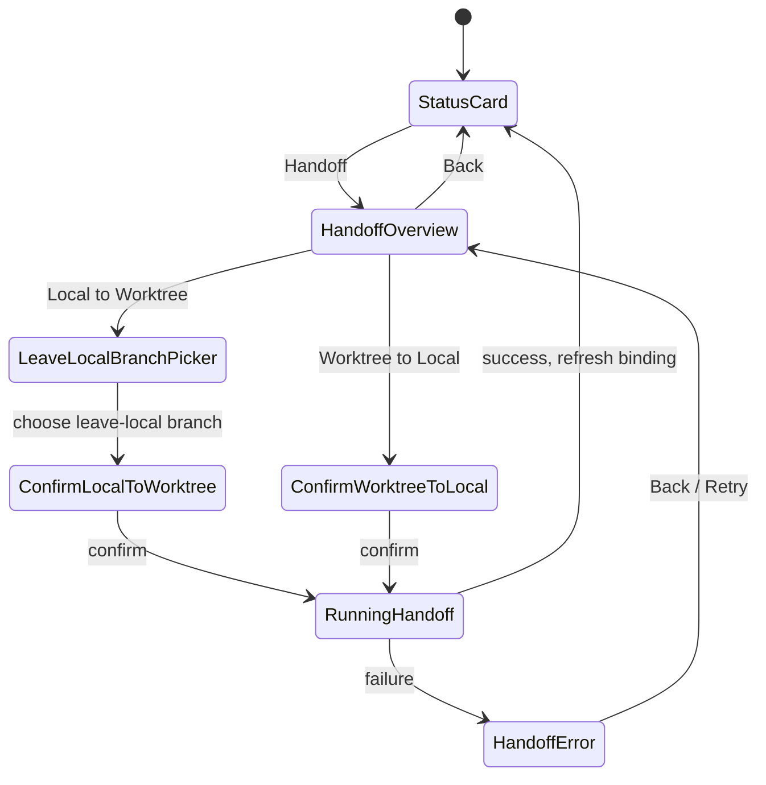
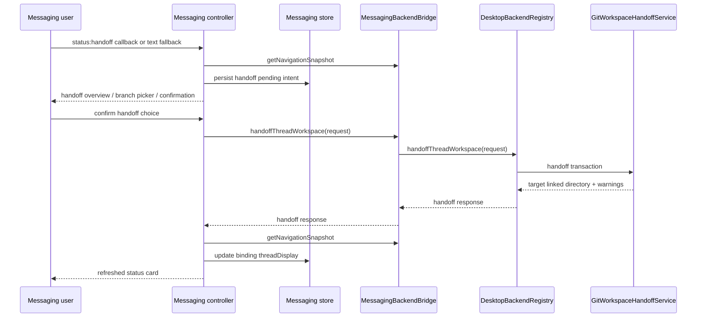
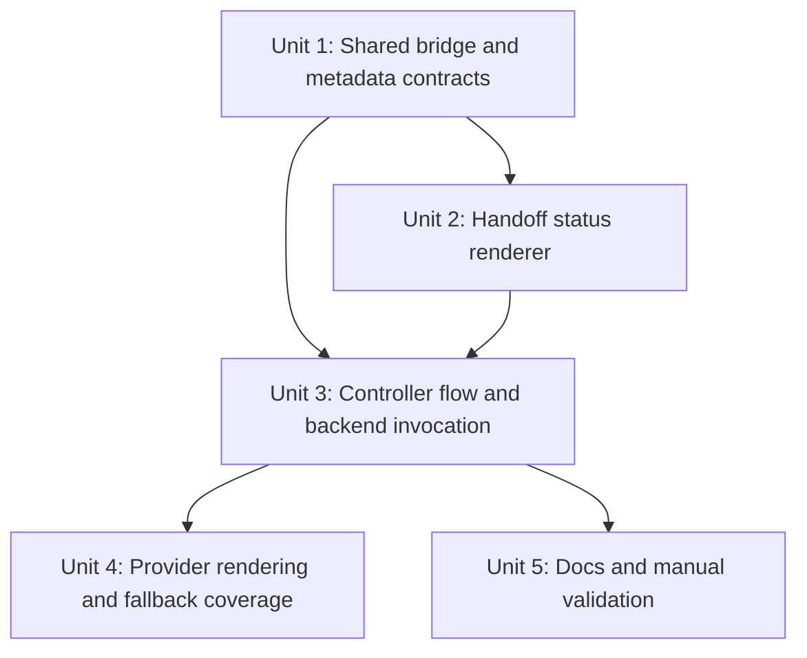
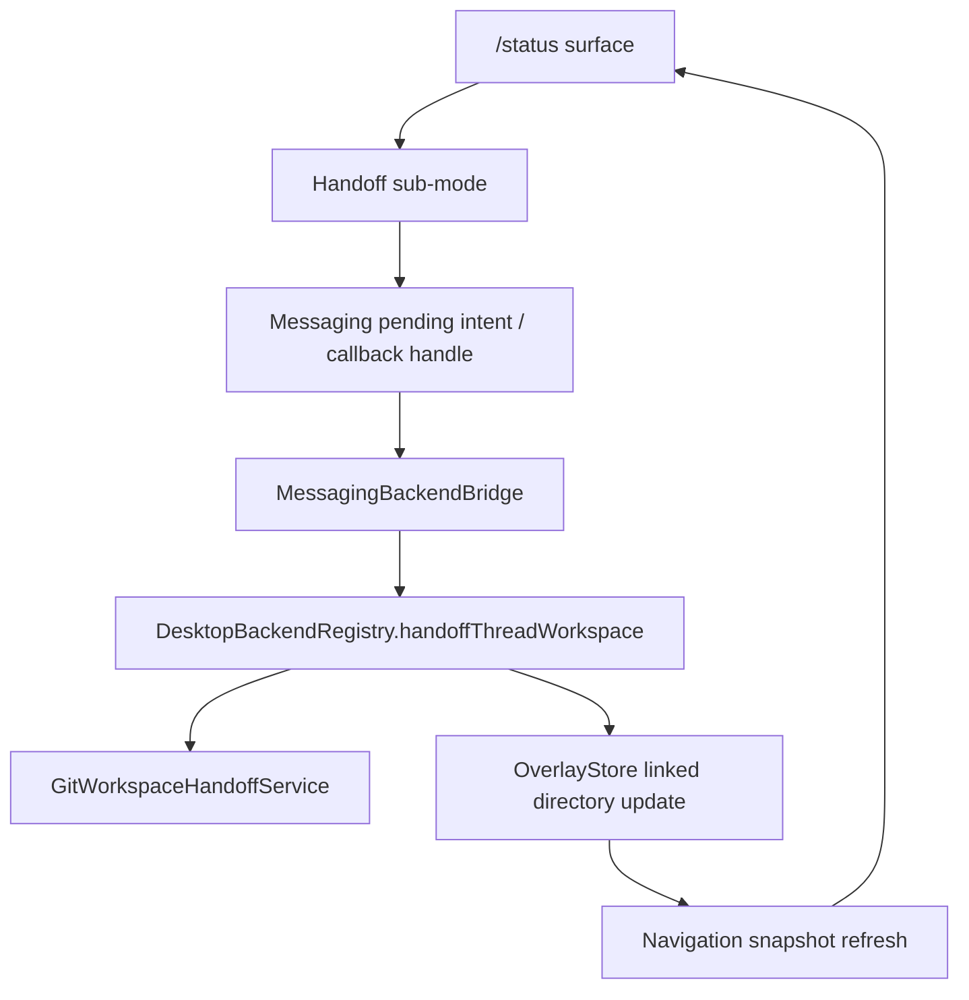

# feat: Add messaging workspace handoff surface

## Overview

Add a channel-neutral messaging handoff flow that lets a bound Telegram or Discord conversation move its current PwrAgnt thread between Local and Worktree from the `/status` surface.

The first slice should add a `Handoff` action to the status card, then repaint the managed status surface into a handoff mode that explains the current project directory, current working directory, current branch, and valid handoff direction. It should call the existing desktop `handoffThreadWorkspace` operation rather than reimplementing Git movement in messaging code.

The `/resume` New Local / New Handoff button split and broader low-button-count versus high-button-count rendering policy are intentionally deferred. The current plan keeps the feature useful through the status card and free-form fallback without forcing a premature platform capability model.

## Problem Frame

Messaging users can already resume threads, start threads, bind conversations, and use the status card for model, reasoning, fast mode, permissions, stop, compact, refresh, and detach. Separately, the desktop app already has thread workspace handoff contracts and a main-process Git handoff service. The missing behavior is the bridge between those systems: a remote user in Telegram or Discord cannot ask the bound thread to move from Local to a new worktree, or from a worktree back to Local.

This matters most when the user is away from the desktop but still controlling real local development state from messaging. The flow must be explicit enough to avoid moving the wrong checkout and conservative enough to preserve the handoff safety rules from the desktop implementation.

## Requirements Trace

- R1. A bound messaging conversation can discover whether its current thread is eligible for workspace handoff from `/status`.
- R2. The status card exposes a `Handoff` action only when the bound thread has enough navigation and Git metadata to present a safe handoff flow.
- R3. Handoff mode states the project repository path, active working directory path, active workspace kind, and observed/current branch before asking for a decision.
- R4. Local-to-worktree handoff asks which branch should remain checked out in Local before invoking the handoff.
- R5. Worktree-to-local handoff presents a confirmation before invoking the handoff.
- R6. Successful handoff updates the binding display metadata and repaints the status card with the new Local/Worktree state.
- R7. Handoff failures surface recoverable error text, including warnings and stash recovery details when the backend returns them.
- R8. The flow remains channel-neutral: controller, store, and renderer code must not branch on Telegram or Discord except through existing adapter delivery behavior.
- R9. Text fallback can complete the same handoff steps by replying with visible option numbers or labels.
- R10. `/resume` arguments and the New Local / New Handoff button split are not part of this implementation slice.
- R11. Handoff confirmation preserves acting-user audit context because it mutates local Git state and thread workspace metadata.

## Scope Boundaries

- In scope: `/status` Handoff button, handoff overview mode, branch picker for local-to-worktree, confirmation for worktree-to-local, backend bridge invocation, binding display refresh, text fallback, and focused Telegram/Discord rendering coverage through the existing generic intent tests.
- In scope: existing desktop handoff behavior, including dirty-workspace stash preservation, Git branch occupancy checks, archive-on-worktree-to-local, and overlay metadata updates.
- Out of scope: new Git handoff transaction behavior; `apps/desktop/src/main/app-server/git-workspace-handoff-service.ts` is the source of truth for Git movement.
- Out of scope: splitting `/resume` New into New Local and New Handoff buttons.
- Out of scope: `/resume` flags or slash-command args for handoff. Discord presents args poorly for this use case, so the first slice should avoid new command arguments.
- Out of scope: a generic low-button-count/high-button-count variation system across all messaging surfaces. This plan should leave compatible hooks where natural, but not design that larger abstraction now.
- Out of scope: provider-specific callback payload formats, Telegram chat IDs, Discord message IDs, or channel-specific permission logic in workflow code.

## Context & Research

### Relevant Code and Patterns

- `packages/messaging/AGENTS.md` requires workflow semantics to stay channel-neutral and platform limitations to be represented through generic interface extensions, provider capabilities, delivery results, or fallback behavior.
- `apps/desktop/src/main/messaging/core/messaging-status-card.ts` builds the current status card and already uses managed status surface updates for model and reasoning picker modes.
- `apps/desktop/src/main/messaging/core/messaging-controller.ts` routes `status:*` callbacks, updates binding preferences, repaints status surfaces, handles text fallback through pending intents, and persists browse/status session state.
- `apps/desktop/src/main/messaging/core/messaging-resume-browser.ts` shows the pattern for channel-neutral picker actions, fallback text, pagination, and action values.
- `apps/desktop/src/main/messaging/core/messaging-adapter.ts` defines `MessagingBackendBridge`; it already exposes status-card backend operations but not `handoffThreadWorkspace`.
- `apps/desktop/src/main/messaging/desktop-backend-bridge.ts` is the desktop implementation of the bridge and delegates to `DesktopBackendRegistry`.
- `apps/desktop/src/main/app-server/backend-registry.ts` already exposes `handoffThreadWorkspace`, resolves thread workspace metadata, invokes `GitWorkspaceHandoffService`, updates overlay linked-directory state, and records archived source worktree snapshots.
- `packages/shared/src/contracts/normalized-app-server.ts` already defines `HandoffThreadWorkspaceRequest`, `HandoffThreadWorkspaceResponse`, `ThreadWorkspaceHandoffDirection`, and stash summary types.
- `packages/shared/src/contracts/navigation.ts` exposes directory Git status including `currentBranch`, `branches`, and `handoffBranches`, which should drive branch choices for local-to-worktree.
- `packages/shared/src/contracts/messaging.ts` is the desktop messaging controller's current type surface, while `packages/messaging/interface/src/index.ts` is the provider-facing generic interface. The two are intentionally similar today, so any messaging contract change must either keep them mirrored or deliberately converge one on the other in a separate refactor.
- `packages/messaging/interface/src/index.ts` already supports `status`, `single_select`, `confirmation`, generic actions, action layout hints, managed delivery policies, and restart-safe callback handles for provider packages.
- `packages/messaging/providers/telegram/src/telegram-formatting.ts` and `packages/messaging/providers/discord/src/discord-formatting.ts` render generic actions with `layoutMessagingActionRows`.
- `apps/desktop/src/main/__tests__/messaging-controller.test.ts`, `packages/messaging/interface/src/__tests__/messaging-contract.test.ts`, `packages/messaging/providers/telegram/src/__tests__/telegram-formatting.test.ts`, and `packages/messaging/providers/discord/src/__tests__/discord-formatting.test.ts` are the primary tests to extend.

### Institutional Learnings

- `docs/plans/2026-04-29-001-feat-thread-workspace-handoff-plan.md` established that handoff is a main-process transaction that preserves dirty non-ignored changes through named stashes and updates PwrAgnt overlay metadata after Git succeeds.
- `docs/plans/2026-04-30-002-feat-messaging-command-surfaces-plan.md` established the current messaging status-card pattern: managed status surfaces should repaint in place when possible, keep text fallback, and keep Telegram/Discord differences behind adapters.
- `docs/brainstorms/2026-04-19-codex-desktop-protocol-parity-requirements.md` requires anchored thread/worktree identity and forbids silently re-homing a thread just because the same branch exists elsewhere.
- No `docs/solutions/` directory exists in this worktree yet.

### External References

- Telegram Bot API inline keyboard callback data is limited to 1-64 bytes, which confirms that callback indirection and store-backed action records must remain the workflow pattern: https://core.telegram.org/bots/api
- Discord message components support button action rows with up to 5 buttons per row and 5 rows per message, which is enough for this first status-card Handoff action but still argues against overloading `/resume` before a generic variation policy exists: https://docs.discord.com/developers/docs/interactions/message-components

## Key Technical Decisions

- **Use `/status` as the entry point.** Status already represents the bound thread and has a managed surface that can repaint into sub-modes. This avoids new slash-command arguments and avoids deciding the `/resume` New Local / New Handoff split before the button variation policy is clear.
- **Model handoff as a status sub-mode, not a separate command.** The user is acting on the currently bound thread, so the flow should inherit the binding, actor authorization, target surface, and callback lifecycle from the status card.
- **Call the existing desktop handoff operation through `MessagingBackendBridge`.** Messaging owns user interaction and audit context; `DesktopBackendRegistry` and `GitWorkspaceHandoffService` own Git correctness, overlay mutation, stash details, archive behavior, and recovery data.
- **Derive eligibility from navigation snapshots and linked directories.** A bound thread should offer Handoff only when the current navigation snapshot can identify an eligible local or worktree linked directory plus enough branch data to create a safe request.
- **Keep provider limitations out of workflow branches for now.** Telegram and Discord both support enough buttons for this first slice. Low-button-count platforms should rely on fallback text until a broader capability policy is designed.
- **Persist handoff choices as pending intents/callback handles, not adapter memory.** Branch choices and confirmation actions must survive process restart or fail closed with a refresh message.
- **Make branch selection explicit for local-to-worktree.** The existing handoff request requires `leaveLocalBranch`; the messaging UI should present the `handoffBranches` list and not silently guess.
- **Refresh binding display from the post-handoff navigation state.** The response contains the target linked directory, but the status card should also re-read navigation after success so binding metadata and status text reflect the same state the rest of desktop will show.
- **Treat handoff as a sensitive state-changing action.** Confirmation must be scoped to the binding's authorized actor, carry an audit context with actor/channel/backend/thread/direction, and avoid logging or persisting raw provider payloads. Displaying local paths is acceptable in the authorized conversation because status already exposes directory context, but errors should not include secrets or raw adapter state.

## Open Questions

### Resolved During Planning

- **Should this start on `/resume`?** No. `/resume` may eventually split New into New Local and New Handoff on platforms with enough buttons, but the first implementation should use `/status` where the bound-thread context is already explicit.
- **Should this be a slash-command argument?** No. Discord's slash-command argument presentation is a poor fit for this flow, and the user specifically dislikes that direction.
- **Should messaging implement Git handoff logic?** No. It should call the existing desktop handoff operation and surface its success, warnings, and errors.
- **Should platform button limits block this slice?** No. The first status-card flow is small enough for Telegram and Discord. The generic variation model is deferred.

### Deferred to Implementation

- Exact status-card copy for handoff warnings and stash recovery details should be finalized once the implementation sees the actual error shapes emitted through the bridge.
- Exact branch ordering should follow `gitStatus.handoffBranches` when available, with implementation-time fallback to `branches` only if the status service does not provide handoff-specific choices for a valid local checkout.
- Whether a channel with very few buttons should show `Handoff` on the primary status card or require a text-only command is deferred to a future provider capability plan.

## High-Level Technical Design

> *This illustrates the intended approach and is directional guidance for review, not implementation specification. The implementing agent should treat it as context, not code to reproduce.*

The user-visible states are: normal status, unavailable, overview, leave-local branch picker, confirmation, running, success/status refresh, recoverable failure, stale-action refresh, and canceled/back. These states should be represented by existing generic `status`, `single_select`, `confirmation`, and `error` intents rather than new provider-specific surfaces.

## Implementation Units

- [x] **Unit 1: Expose handoff through the messaging backend bridge**

**Goal:** Give messaging controller code a channel-neutral way to invoke the existing desktop handoff operation and to capture enough handoff metadata in binding display state.

**Requirements:** R1, R3, R6, R7, R8, R11

**Dependencies:** Existing desktop handoff contracts and `DesktopBackendRegistry.handoffThreadWorkspace`.

**Files:**
- Modify: `apps/desktop/src/main/messaging/core/messaging-adapter.ts`
- Modify: `apps/desktop/src/main/messaging/desktop-backend-bridge.ts`
- Modify: `packages/shared/src/contracts/messaging.ts`
- Modify: `packages/messaging/interface/src/index.ts`
- Test: `apps/desktop/src/main/__tests__/messaging-controller.test.ts`
- Test: `apps/desktop/src/main/__tests__/messaging-status-card.test.ts`
- Test: `packages/messaging/interface/src/__tests__/messaging-contract.test.ts`

**Approach:**
- Add optional `handoffThreadWorkspace` support to `MessagingBackendBridge` using the existing `HandoffThreadWorkspaceRequest` and `HandoffThreadWorkspaceResponse` shared types.
- Keep the bridge optional so non-desktop or future hosted runtimes can report Handoff unavailable without pretending to support local Git movement.
- Extend `MessagingThreadDisplaySummary` only if the existing `directoryPath`, `projectLabel`, `threadTitle`, and `worktreePath` fields cannot describe the post-handoff state clearly enough. Prefer using existing fields plus branch/workspace text in the status renderer before adding new contract shape.
- Keep `packages/shared/src/contracts/messaging.ts` and `packages/messaging/interface/src/index.ts` aligned for any messaging intent, binding, or display metadata changes. If implementation finds the duplication too risky, split that cleanup into a separate preparatory refactor instead of quietly changing only one side.
- Do not import provider packages or provider SDKs from bridge or controller code.

**Patterns to follow:**
- `apps/desktop/src/main/messaging/desktop-backend-bridge.ts`
- `apps/desktop/src/main/messaging/core/messaging-adapter.ts`
- `apps/desktop/src/main/app-server/backend-registry.ts`
- `packages/messaging/AGENTS.md`

**Test scenarios:**
- Happy path: a messaging bridge backed by `DesktopBackendRegistry` forwards `handoffThreadWorkspace` with backend, thread id, direction, source path, repository path, source branch, and leave-local branch.
- Edge case: a controller harness without `handoffThreadWorkspace` treats Handoff as unavailable rather than throwing.
- Regression: `packages/messaging/interface` remains provider-neutral and does not import Telegram, Discord, desktop main-process modules, or sibling providers.
- Regression: shared desktop messaging types and provider-facing interface types stay compatible for the handoff-related fields.

**Verification:**
- Messaging code can call desktop handoff through a typed bridge, and package boundary lint remains compatible with the messaging package guidance.

- [x] **Unit 2: Add channel-neutral handoff status intents**

**Goal:** Build the status-card Handoff entry point and the handoff sub-mode intents that explain current workspace state, present valid choices, and provide text fallback.

**Requirements:** R1, R2, R3, R4, R5, R8, R9, R10, R11

**Dependencies:** Unit 1 bridge types.

**Files:**
- Modify: `apps/desktop/src/main/messaging/core/messaging-status-card.ts`
- Modify: `apps/desktop/src/main/messaging/core/messaging-resume-browser.ts`
- Test: `apps/desktop/src/main/__tests__/messaging-controller.test.ts`
- Test: `apps/desktop/src/main/__tests__/messaging-status-card.test.ts`

**Approach:**
- Add a `status:handoff` action to `buildBindingStatusIntent` only when the caller provides an eligible handoff context. Keep the default status card unchanged for ineligible threads.
- Add helper logic that derives a handoff context from the bound thread in a navigation snapshot:
  - Current linked directory and workspace kind: local or worktree.
  - Repository/project directory path.
  - Active working directory path.
  - Current or observed branch.
  - Available leave-local branches from `gitStatus.handoffBranches`.
- Create a handoff overview as a `single_select` or `confirmation` intent that reuses the managed status surface and includes fallback text listing numbered choices.
- For local-to-worktree, present a branch picker before confirmation. The branch picker choices should be branch names that can remain in Local after the current branch moves to a worktree.
- For worktree-to-local, present a direct confirmation that names the source worktree path and target local repository path.
- The confirmation copy should identify the acting thread, backend, direction, repository path, working directory path, and branch before any Git mutation starts.
- Include Back/Refresh/Cancel actions so the user can return to the normal status card without changing Git state.
- Keep the status-card helper pure: it should receive a handoff context from the controller or a small selector helper, then produce intents without reading backend state itself.

**Patterns to follow:**
- `apps/desktop/src/main/messaging/core/messaging-status-card.ts`
- `apps/desktop/src/main/messaging/core/messaging-resume-browser.ts`
- `apps/desktop/src/main/messaging/core/deterministic-interaction-mapper.ts`

**Test scenarios:**
- Happy path: a bound local thread with repository path, current branch, and handoff branches renders status with a `Handoff` action.
- Happy path: selecting Handoff for a local thread renders a handoff overview naming project directory, working directory, branch, and `Handoff to New Worktree`.
- Happy path: selecting local-to-worktree renders branch choices from `handoffBranches` plus Back/Cancel.
- Happy path: confirmation text includes backend/thread identity, direction, repository path, working directory path, branch, and selected leave-local branch when applicable.
- Happy path: a bound worktree thread renders a handoff overview naming project directory, worktree path, branch, and `Handoff to Local`.
- Edge case: a directory without Git metadata or without an eligible linked directory omits the Handoff action and keeps the rest of the status card intact.
- Edge case: no `handoffBranches` for a local thread renders a recoverable unavailable explanation rather than guessing a branch.
- Integration: fallback text includes numbers/labels that the deterministic mapper can resolve to the same action IDs as button callbacks.
- Regression: existing status-card tests still prove model, reasoning, fast mode, permissions, compact, stop, refresh, and detach actions render when handoff is absent.

**Verification:**
- Handoff sub-mode can be rendered and navigated with generic messaging intents, without provider-specific branches and without changing `/resume` behavior.

- [x] **Unit 3: Execute handoff from messaging callbacks and refresh binding state**

**Goal:** Wire `status:handoff` callbacks through branch selection, confirmation, backend invocation, success refresh, and failure reporting.

**Requirements:** R4, R5, R6, R7, R8, R9, R11

**Dependencies:** Units 1 and 2.

**Files:**
- Modify: `apps/desktop/src/main/messaging/core/messaging-controller.ts`
- Modify: `apps/desktop/src/main/messaging/core/messaging-store.ts`
- Modify: `apps/desktop/src/main/messaging/core/messaging-migrations.ts`
- Test: `apps/desktop/src/main/__tests__/messaging-controller.test.ts`
- Test: `apps/desktop/src/main/__tests__/messaging-store.test.ts`
- Test: `apps/desktop/src/main/__tests__/messaging-interaction-mapper.test.ts`

**Approach:**
- Add status callback handling for `status:handoff`, `handoff:local-to-worktree`, `handoff:worktree-to-local`, `handoff:select-leave-branch`, `handoff:confirm`, and `handoff:cancel` style actions.
- Store the in-progress handoff choice in existing pending intent or callback-handle records if the current shape can carry it. Add a small store field only if needed to survive restart across the multi-step branch picker.
- Validate actor, channel, binding id, and current thread before invoking handoff. If the binding changed since the handoff prompt was rendered, fail closed and ask the user to refresh `/status`.
- Validate the source path, repository path, source branch, and selected leave-local branch against the latest navigation snapshot immediately before invoking the bridge. Do not trust stale values stored in callback handles as authority.
- Build `HandoffThreadWorkspaceRequest` from the latest navigation snapshot, selected direction, source directory/worktree, source branch, repository path, and selected leave-local branch.
- Attach audit context to handoff prompts and result/error messages, including actor id, channel, backend, thread id, direction, and occurred-at timestamp. Do not store raw Telegram/Discord callback payloads or raw provider routing state in workflow-owned fields.
- Deliver a short progress/status message before invoking the backend if the operation may take noticeable time.
- On success, re-read navigation, update binding display metadata, delete stale handoff pending state, and repaint the status card.
- On failure, keep the binding unchanged, preserve the status surface, and render a recoverable error that includes the backend message plus any returned warnings/stash refs when available.

**Execution note:** Add controller tests before implementation for the local-to-worktree and worktree-to-local callback sequences; the Git transaction itself is already tested in the app-server service.

**Patterns to follow:**
- `apps/desktop/src/main/messaging/core/messaging-controller.ts`
- `apps/desktop/src/main/messaging/core/messaging-store.ts`
- `apps/desktop/src/main/__tests__/messaging-controller.test.ts`
- `docs/plans/2026-04-29-001-feat-thread-workspace-handoff-plan.md`

**Test scenarios:**
- Happy path: local status Handoff -> choose local-to-worktree -> choose leave-local branch -> confirm invokes `handoffThreadWorkspace` with `direction: local-to-worktree` and repaints status with worktree display metadata.
- Happy path: worktree status Handoff -> confirm invokes `handoffThreadWorkspace` with `direction: worktree-to-local` and repaints status without stale worktree path.
- Happy path: after success, the binding keeps model/reasoning/fast/permissions preferences while updating thread display metadata.
- Edge case: actor mismatch on a handoff callback fails closed and does not call backend handoff.
- Edge case: binding changes between prompt and confirmation fails closed with a refresh message.
- Error path: unauthorized or actor-mismatched text fallback cannot confirm handoff even if it matches the visible option label.
- Error path: bridge lacks `handoffThreadWorkspace` and Handoff mode reports unavailable.
- Error path: backend handoff rejects due to branch occupancy or stash conflict and messaging renders a recoverable error without deleting binding or stale status surface.
- Integration: successful and failed handoff results preserve audit context without persisting raw provider payloads or secrets.
- Integration: text fallback replies such as `1`, branch label, `confirm`, `back`, and `cancel` route to the same controller paths as callbacks.

**Verification:**
- A bound messaging conversation can complete both handoff directions through generic callbacks or text fallback, and status reflects the final desktop navigation state after success.

- [x] **Unit 4: Keep provider rendering and button limits honest**

**Goal:** Ensure Telegram and Discord render the new Handoff flow cleanly with existing generic actions and do not regress current status-card layouts.

**Requirements:** R2, R8, R9, R10

**Dependencies:** Units 2 and 3.

**Files:**
- Modify: `packages/messaging/providers/telegram/src/__tests__/telegram-formatting.test.ts`
- Modify: `packages/messaging/providers/discord/src/__tests__/discord-formatting.test.ts`
- Modify: `packages/messaging/interface/src/__tests__/messaging-contract.test.ts`

**Approach:**
- Prefer existing `MessagingActionLayoutHint` and `actionLayout.columns` before adding any new layout contract.
- Verify that the status card with Handoff still fits Discord's component limits and Telegram's inline keyboard model.
- Avoid provider-specific workflow logic. If a provider cannot render the full action set later, the provider should omit/degrade actions through generic capability or delivery policy work in a separate plan.

**Patterns to follow:**
- `packages/messaging/interface/src/index.ts`
- `packages/messaging/providers/telegram/src/telegram-formatting.ts`
- `packages/messaging/providers/discord/src/discord-formatting.ts`

**Test scenarios:**
- Happy path: Telegram keyboard for handoff overview honors explicit rows and emits opaque callback handles, not semantic payloads.
- Happy path: Discord components for status plus Handoff remain within 5 rows and 25 buttons.
- Edge case: disabled or unavailable handoff actions are not rendered as active provider buttons.
- Regression: current status-card model/reasoning/fast/permissions/compact/stop/refresh/detach actions still render after adding Handoff.
- Integration: fallback text for handoff intents remains complete when rendered text-only.

**Verification:**
- Telegram and Discord provider tests prove the first handoff slice fits the current adapter rendering contract, with no new platform-specific branches in workflow code.

- [x] **Unit 5: Update docs and manual validation checklist**

**Goal:** Document the new messaging handoff flow, its boundaries, and how to validate it end to end.

**Requirements:** R1, R6, R7, R9, R10

**Dependencies:** Units 1-4.

**Files:**
- Modify: `docs/messaging-platform-integration.md`
- Modify: `docs/messaging-adapter-contract.md`
- Test expectation: none -- documentation-only unit; behavior is covered by controller, store, and provider tests above.

**Approach:**
- Add a `/status` Handoff section explaining what the bot shows before handoff and which directions are supported.
- State that `/resume` New Local/New Handoff split is deferred and that users should use `/status` on a bound thread for workspace movement.
- State that low-button-count variation is deferred and that all handoff steps must remain operable through fallback text.
- Add manual smoke steps for Telegram and Discord:
  - Bind a local thread, use `/status`, hand off to a new worktree, verify status shows the new worktree.
  - Bind a worktree thread, use `/status`, hand off to Local, verify status shows Local.
  - Exercise a text fallback path for at least one handoff step.
  - Confirm failures are recoverable by attempting handoff when required branch metadata is missing or stale.
- Keep setup docs clear that no additional bot credentials or slash-command args are required.

**Patterns to follow:**
- `docs/messaging-platform-integration.md`
- `docs/messaging-adapter-contract.md`

**Test scenarios:**
- Test expectation: none -- docs-only change.

**Verification:**
- A maintainer can follow the docs to validate the feature manually on Telegram and Discord without reading implementation code.

## System-Wide Impact

- **Interaction graph:** `/status` now branches into a managed Handoff sub-flow that touches messaging controller state, persistent callback handles, desktop backend bridge, backend registry, Git handoff service, overlay store, and status-card refresh.
- **Error propagation:** Git and overlay errors must travel from `GitWorkspaceHandoffService` / `DesktopBackendRegistry` through `DesktopMessagingBackendBridge` into a recoverable messaging error. Messaging should not swallow stash refs or branch-conflict messages that help the user recover.
- **State lifecycle risks:** Multi-step handoff prompts can go stale if the binding changes, the thread moves, or Git state changes before confirmation. Confirmation must re-read navigation and fail closed when state no longer matches.
- **Security boundary:** A messaging handoff is a remote request to mutate local Git state. It must require the same authorized actor/binding checks as status actions, preserve audit context, and keep provider payloads, adapter state, and secrets out of workflow-owned logs and persisted fields.
- **API surface parity:** Desktop IPC already exposes handoff; messaging should use the same shared request/response contracts through its backend bridge. No provider-specific API should be added for this workflow.
- **Integration coverage:** Unit tests must cover controller-to-bridge request construction and post-success binding refresh; existing app-server handoff tests cover Git mechanics.
- **Unchanged invariants:** Adapter state remains opaque, authorization remains based on stable actor IDs, `/resume` behavior remains unchanged, and Git branch/worktree mutation remains owned by the app-server handoff service.

## Risks & Dependencies

| Risk | Mitigation |
|------|------------|
| Handoff prompt uses stale thread or Git state | Re-read navigation at confirmation time and fail closed when binding/thread/source metadata no longer matches. |
| Local-to-worktree branch choice is wrong or guessed | Require an explicit leave-local branch from `gitStatus.handoffBranches`; render unavailable when safe choices are absent. |
| Messaging hides important Git recovery data | Include backend error text, warnings, and stash refs in recoverable error output where available. |
| Messaging handoff becomes an unaudited remote Git mutation | Require binding-scoped actor authorization at confirmation and attach audit context to handoff prompts/results. |
| Status card becomes too crowded | Add only one `Handoff` entry to the main card and keep branch/direction choices in sub-modes; defer broad button-variation work. |
| Channel-specific button limits leak into controller code | Use generic intent actions, row hints, delivery results, and fallback text; provider-specific degradation belongs in adapter policy. |
| Users confuse starting a new thread with handing off an existing thread | Keep this slice on `/status` for bound existing threads, and document that `/resume` New behavior is unchanged. |

## Documentation / Operational Notes

- Update messaging docs after implementation so users know Handoff lives under `/status`.
- The manual validation checklist should use real local repositories/worktrees because the important behavior crosses messaging, desktop bridge, Git, and overlay state.
- No new secrets, environment variables, bot commands, or Discord slash-command options are required for this slice.

## Sources & References

- **Origin document:** [docs/brainstorms/2026-04-30-messaging-platform-integration-requirements.md](../brainstorms/2026-04-30-messaging-platform-integration-requirements.md)
- Related requirements: [docs/brainstorms/2026-04-16-thread-centric-agent-desktop-requirements.md](../brainstorms/2026-04-16-thread-centric-agent-desktop-requirements.md)
- Related requirements: [docs/brainstorms/2026-04-19-codex-desktop-protocol-parity-requirements.md](../brainstorms/2026-04-19-codex-desktop-protocol-parity-requirements.md)
- Related plan: [docs/plans/2026-04-29-001-feat-thread-workspace-handoff-plan.md](2026-04-29-001-feat-thread-workspace-handoff-plan.md)
- Related plan: [docs/plans/2026-04-30-002-feat-messaging-command-surfaces-plan.md](2026-04-30-002-feat-messaging-command-surfaces-plan.md)
- Related code: `apps/desktop/src/main/messaging/core/messaging-controller.ts`
- Related code: `apps/desktop/src/main/messaging/core/messaging-status-card.ts`
- Related code: `apps/desktop/src/main/messaging/desktop-backend-bridge.ts`
- Related code: `apps/desktop/src/main/app-server/backend-registry.ts`
- Related code: `apps/desktop/src/main/app-server/git-workspace-handoff-service.ts`
- External docs: https://core.telegram.org/bots/api
- External docs: https://docs.discord.com/developers/docs/interactions/message-components
