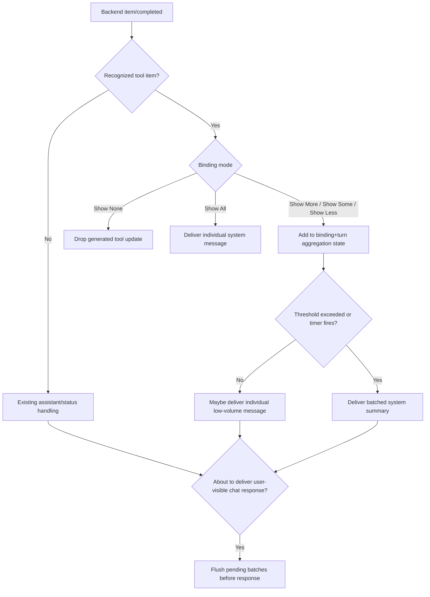
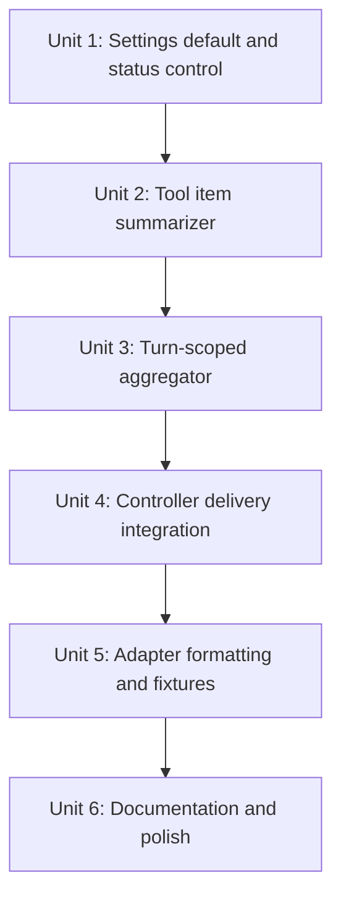

# feat: Add messaging tool update verbosity controls

## Overview

Add channel-neutral messaging controls for agent tool-use updates so Telegram, Discord, and future messaging adapters can show useful progress without flooding the chat. The Desktop Settings `Messaging` section should expose the app-level default as `Tool usage notifications`, and bound conversations should also get a status-card control named `Tool updates: <mode>` that cycles through `Show None`, `Show Less`, `Show Some`, `Show More`, and `Show All`. `Show Some` is the default when neither config nor a binding override chooses otherwise.

Tool updates are code-generated messaging messages, not assistant-authored responses. They summarize completed tool activity such as shell commands, MCP tool calls, web searches, dynamic tools, file reads, and file writes. The desktop transcript can still show live tool notifications independently; this plan only governs what the messaging integration forwards to remote chat surfaces.

Follow-up: `docs/plans/2026-05-02-002-fix-grok-tool-update-summaries-plan.md` tightens Grok `dynamicToolCall` summaries after live Telegram testing showed the batching policy worked well for Codex but Grok needed better path/query title extraction.

## Problem Frame

The messaging integration currently forwards assistant text, typing activity, status-card updates, approvals, and questionnaires, but it does not intentionally forward tool-use notifications. When a turn performs many small reads or shell commands, forwarding every notification to chat would be noisy. Suppressing all of them would make remote use feel opaque, especially from mobile or voice-driven contexts where the user cannot see the desktop transcript.

The desired behavior is a middle path: default to a compact but useful summary, allow users to opt into every tool event when debugging, and allow quieter modes for high-volume channels. Because this affects remote messaging behavior generally, the durable default belongs in the Desktop Settings `Messaging` area alongside Telegram and Discord setup. The status-card control is a fast per-binding override for a specific chat/thread binding.

## Requirements Trace

- R1-R6. Preserve the channel-agnostic messaging surface by expressing tool updates as semantic messaging intents and binding preferences, not Telegram/Discord branches.
- R10, R13, R17. Keep bound conversations usable during active turns by showing progress without swamping assistant responses.
- R18-R22. Expose the control through Desktop Settings, status-card buttons, and text fallback so remote and voice-driven users can change the mode.
- R23-R27. Keep behavior generic for Telegram, Discord, and future adapters; adapters only render the resulting message/status intents.
- R31-R36. Keep generated tool text transcript-safe, avoid secrets and raw command output by default, and preserve actor/binding audit context through existing delivery paths.

## Scope Boundaries

- In scope: Desktop Settings `Messaging` default for tool usage notifications, per-binding tool update override, status-card cycle action, turn-scoped tool event aggregation, generated messaging messages for individual and batched tool titles, tests for settings/controller behavior and formatting.
- In scope: completed tool-like app-server notifications from active bound turns, including `commandExecution`, `mcpToolCall`, `dynamicToolCall`, `webSearch`, `fileChange`, and command actions that represent reads/searches/writes.
- Out of scope: changing the desktop transcript UI, changing app-server protocol notifications, replaying historical tool activity into old messaging chats, showing raw command output by default, or adding provider-specific tool controls.
- Out of scope: a new top-level settings screen from scratch. This plan extends the existing Desktop Settings `Messaging` area rather than inventing another settings surface.

## Context & Research

### Relevant Code and Patterns

- `apps/desktop/src/main/messaging/core/messaging-controller.ts` is the orchestration point for backend events, assistant message forwarding, typing activity, and status-card actions.
- `apps/desktop/src/main/messaging/core/messaging-status-card.ts` builds the pinned status card and existing status actions for model, reasoning, fast mode, permissions, compact, stop, refresh, and detach.
- `apps/desktop/src/main/messaging/core/messaging-renderer.ts` builds semantic message/status intents.
- `packages/shared/src/contracts/messaging.ts` and `packages/messaging/interface/src/index.ts` define `MessagingBindingPreferences`, `MessagingMessageIntent`, and `MessagingStatusIntent`.
- `apps/desktop/src/main/messaging/core/messaging-store.ts` persists binding preferences and delivery records with redaction and restart-safe JSON writes.
- `apps/desktop/src/main/codex-app-server/client.ts` and `apps/desktop/src/renderer/src/features/thread-detail/live-transcript-activity.ts` already contain local examples for normalizing app-server tool item shapes into human-readable activity labels.
- `packages/messaging/providers/telegram/src/telegram-formatting.ts` and `packages/messaging/providers/discord/src/discord-formatting.ts` render generic message/status intents without needing workflow-specific knowledge.
- `docs/brainstorms/2026-04-30-desktop-settings-config-requirements.md` defines the Desktop Settings `Messaging` section as the app-level configuration area for messaging behavior.
- `docs/plans/2026-04-30-003-feat-desktop-settings-config-plan.md` and current settings code already establish settings contracts, main-process config service, IPC, and renderer settings sections.
- `packages/shared/src/contracts/settings.ts`, `apps/desktop/src/main/settings/desktop-settings-service.ts`, and `apps/desktop/src/renderer/src/features/settings/MessagingSettings.tsx` are the expected paths for adding the global default control.
- `apps/desktop/src/main/__tests__/messaging-controller.test.ts` already covers binding, status actions, backend events, approvals, and tool-use capability metadata.

### Institutional Learnings

- `docs/plans/2026-04-30-001-feat-messaging-platform-integration-plan.md` established that messaging workflow logic should target the PwrAgent semantic surface, while adapters own platform rendering limits.
- `docs/plans/2026-04-30-002-feat-messaging-command-surfaces-plan.md` established pinned status cards as the right place for bound-conversation controls.
- `docs/plans/2026-04-30-003-feat-desktop-settings-config-plan.md` established that app-level Messaging configuration belongs in Desktop Settings, while composer/status surfaces can own thread or binding-level controls.
- No `docs/solutions/` learnings exist yet for messaging tool-update behavior.

### External References

- External research is not needed for this slice. The work is fully inside PwrAgent's existing messaging contract, controller, store, and adapter-rendering patterns.

## Key Technical Decisions

- **Use Desktop Settings as the durable default and binding preferences as overrides.** The app-level default belongs in Desktop Settings `Messaging`; a bound chat can override that default from its status card when a specific conversation needs more or less noise.
- **Resolve the effective mode with clear precedence.** Effective mode should be binding override first, then Desktop Settings `Messaging` default, then hardcoded `Show Some` for old config/store state.
- **Make `Show Some` the default.** The default should prove the remote user that work is happening, but only promote batching after a turn becomes noisy.
- **Cycle modes in quiet-to-loud order.** The status action should use the order `Show None -> Show Less -> Show Some -> Show More -> Show All -> Show None`. Because the default is `Show Some`, one click increases visibility to `Show More`, and two clicks reaches `Show All`.
- **Deliver completed tool items, not start events.** Completed events have stable titles, status, and duration, and avoid double-counting start/completion pairs. Long-running turn visibility remains covered by typing/status updates.
- **Represent generated updates as `message` intents with `role: "system"`.** This reuses the existing adapter rendering path while making the message source distinct from assistant output.
- **Batch by turn and binding.** Multiple bound channels may point at the same thread but have different preferences; each binding needs its own aggregation state.
- **Flush before any user-visible chat response.** Timed batches should not be lost if a turn ends before the next window boundary, and queued tool summaries must not arrive after a later response. Any controller path that is about to send assistant text, command output, approval prompts, questionnaire prompts, status replies, or terminal activity should first flush pending tool updates for the same binding/turn.
- **Do not include raw command output in generated tool summaries.** The first version should show concise titles, status, and durations only. Raw output can contain secrets, be huge, or duplicate the final assistant answer.

## Open Questions

### Resolved During Planning

- **Should the mode control be adapter-specific?** No. It belongs in the generic status-card workflow and binding preferences.
- **Should there be a Desktop Settings control too?** Yes. The Desktop Settings `Messaging` section owns the general default for tool usage notifications; the status-card control owns per-binding overrides.
- **Should batching happen in adapters?** No. Adapters should only render intents; batching depends on active turns and app-server notifications.
- **Should `Show Less` emit individual messages before batching?** No. It starts in batch mode with a 60-second window because its purpose is low-noise operation.
- **Should failed tools be hidden?** No. Failed completed tools should be summarized with a failed marker because remote users need to know that progress hit a problem.

### Deferred to Implementation

- Exact title formatting for every app-server tool item shape should be finalized while porting existing activity-normalization helpers.
- Whether to include file counts such as `+N, -M` for `fileChange` items depends on the normalized item fields available in backend events.
- Whether command output excerpts should become an opt-in future setting is deferred until users have tried title-only summaries.

## High-Level Technical Design

> *This illustrates the intended approach and is directional guidance for review, not implementation specification. The implementing agent should treat it as context, not code to reproduce.*

| Mode | Window | Individual messages before noisy mode | Batching behavior |
| --- | ---: | ---: | --- |
| Show All | none | unlimited | every completed tool item is delivered immediately |
| Show More | 15s | 5 per window | low-volume windows stay individual; after threshold, remaining and future items batch every 15s |
| Show Some | 30s | 3 per window | default; low-volume windows stay individual; after threshold, remaining and future items batch every 30s |
| Show Less | 60s | 0 | starts batched; flushes every 60s and at turn end |
| Show None | none | 0 | suppress generated tool update messages |

Effective mode precedence:

| Source | Purpose |
| --- | --- |
| Binding override | Per-chat/thread override from the status card |
| Desktop Settings `Messaging` default | Durable app-level default for new and uncustomized bindings |
| Hardcoded fallback | `Show Some` for missing config or old stores |

## Implementation Units

- [x] **Unit 1: Add settings default, binding override, and status control**

**Goal:** Add an app-level default in Desktop Settings, support per-binding overrides, and expose the effective mode on the messaging status card.

**Requirements:** R1-R6, R18-R22, R23-R27

**Dependencies:** None

**Files:**
- Modify: `packages/shared/src/contracts/messaging.ts`
- Modify: `packages/messaging/interface/src/index.ts`
- Modify: `packages/shared/src/contracts/settings.ts`
- Modify: `apps/desktop/src/main/settings/desktop-config.ts`
- Modify: `apps/desktop/src/main/settings/desktop-settings-env.ts`
- Modify: `apps/desktop/src/main/settings/desktop-settings-service.ts`
- Modify: `apps/desktop/src/renderer/src/features/settings/MessagingSettings.tsx`
- Modify: `apps/desktop/src/main/messaging/core/messaging-status-card.ts`
- Modify: `apps/desktop/src/main/messaging/core/messaging-controller.ts`
- Test: `packages/shared/src/contracts/__tests__/settings.test.ts`
- Test: `apps/desktop/src/main/__tests__/desktop-settings-service.test.ts`
- Test: `apps/desktop/src/renderer/src/features/settings/__tests__/settings-screen.test.tsx`
- Test: `packages/messaging/interface/src/__tests__/messaging-contract.test.ts`
- Test: `apps/desktop/src/main/__tests__/messaging-controller.test.ts`

**Approach:**
- Add a `MessagingToolUpdateMode` style union with the five labels represented as stable lowercase values.
- Add the same mode type, or a deliberately shared equivalent, to desktop settings contracts so `Messaging` settings can store a default.
- Add a `Tool usage notifications` control to `MessagingSettings.tsx`, above or before provider-specific Telegram/Discord groups, because it is general messaging behavior rather than a provider credential.
- Add an optional override field to `MessagingBindingPreferences`; treat missing as "use the Desktop Settings default" rather than immediately materializing a binding value.
- Resolve the effective mode as binding override -> Desktop Settings default -> `show_some`.
- Add a status-card line such as `Tool updates: Show Some`, with copy that can indicate an override when useful without making the card verbose.
- Add a `status:tool-updates` action that cycles in quiet-to-loud order and re-renders the status card.
- Keep text fallback simple: `tools` or the status button should change the setting; exact free-form mode selection can be added later through a picker if needed.

**Patterns to follow:**
- `apps/desktop/src/main/messaging/core/messaging-status-card.ts`
- `apps/desktop/src/main/messaging/core/messaging-controller.ts`
- `apps/desktop/src/renderer/src/features/settings/MessagingSettings.tsx`
- `apps/desktop/src/main/settings/desktop-settings-service.ts`
- `apps/desktop/src/main/__tests__/messaging-controller.test.ts`

**Test scenarios:**
- Happy path: a binding with no preference renders `Tool updates: Show Some`.
- Happy path: changing `Tool usage notifications` in Desktop Settings updates the messaging default in the redacted settings snapshot and persists it to config.
- Happy path: a binding without an override uses the Desktop Settings default.
- Happy path: clicking the tool update status action cycles from `Show Some` to `Show More`, persists the preference, and re-renders the status card.
- Happy path: a binding override continues to win after the Desktop Settings default changes.
- Happy path: repeated clicks cycle through all five modes and wrap to `Show None` after `Show All`.
- Edge case: an old binding record without the preference still starts turns and renders status without migration errors.
- Edge case: an old desktop config without the default setting resolves to `Show Some`.
- Integration: `/status` after changing the mode shows the persisted mode for the active binding.

**Verification:**
- Desktop users can configure the general default in Settings, and messaging users can override a specific bound conversation from the status card without provider-specific code.

- [x] **Unit 2: Add channel-neutral tool item summarization**

**Goal:** Convert app-server tool-like notifications into concise, transcript-safe titles that can be delivered as generated messaging messages.

**Requirements:** R1-R6, R13-R17, R31-R36

**Dependencies:** Unit 1

**Files:**
- Create: `apps/desktop/src/main/messaging/core/messaging-tool-activity.ts`
- Modify: `apps/desktop/src/main/messaging/core/messaging-renderer.ts`
- Test: `apps/desktop/src/main/__tests__/messaging-tool-activity.test.ts`

**Approach:**
- Recognize completed tool-like items from `item/completed` notifications: `commandExecution`, `mcpToolCall`, `dynamicToolCall`, `webSearch`, `fileChange`, and relevant command actions.
- Produce a compact normalized record with id, title, status, duration, kind, and optional path basename.
- Reuse the display decisions from existing transcript activity code conceptually, but keep this helper in main-process messaging code so renderer modules are not imported into main.
- Strip shell wrappers for command titles the same way existing transcript labels do.
- Avoid raw outputs, arguments that look secret, full file diffs, and long command strings.
- Add renderer helpers that can build either a single system message or a batched system message from normalized tool activity records.

**Patterns to follow:**
- `apps/desktop/src/main/codex-app-server/client.ts`
- `apps/desktop/src/renderer/src/features/thread-detail/live-transcript-activity.ts`
- `apps/desktop/src/main/messaging/core/messaging-renderer.ts`

**Test scenarios:**
- Happy path: a completed `commandExecution` for `/bin/zsh -lc 'npm view dive'` summarizes as `npm view dive` with duration.
- Happy path: failed tool items retain a failed status marker without including raw output.
- Happy path: multiple `fileChange` entries summarize as edited file titles without embedding diffs.
- Edge case: unknown item types return no summary and do not affect existing assistant/status behavior.
- Error path: command arguments containing token-like or secret-like keys are redacted or omitted from generated titles.

**Verification:**
- The summarizer produces stable, short, safe labels for the tool event shapes already used by desktop transcripts.

- [x] **Unit 3: Implement turn-scoped batching policy**

**Goal:** Add a deterministic batching engine that applies each binding's selected mode across a single active turn.

**Requirements:** R10, R13, R17, R18-R22

**Dependencies:** Units 1 and 2

**Files:**
- Create: `apps/desktop/src/main/messaging/core/messaging-tool-update-policy.ts`
- Modify: `apps/desktop/src/main/messaging/core/messaging-controller.ts`
- Test: `apps/desktop/src/main/__tests__/messaging-tool-update-policy.test.ts`

**Approach:**
- Track aggregation state by binding id, turn id, and effective mode.
- Deduplicate by normalized tool item id so repeated backend notifications do not generate duplicate chat messages.
- For `Show All`, return an immediate individual message for each completed recognized item.
- For `Show None`, return no generated messages.
- For `Show More` and `Show Some`, deliver individual messages while the current window stays below its threshold; once the threshold is exceeded, mark the turn noisy and batch remaining and future activity on the mode's window boundary.
- For `Show Less`, start in noisy mode and batch immediately, with a 60-second window.
- Flush any pending batch when the turn completes, fails, is cancelled/interrupted, or before any later user-visible message for the same binding/turn is delivered.
- Expose the flush as a single policy/controller helper so every outbound chat path can enforce ordering without duplicating batching logic.
- Keep timers cancellable and clean them up when the controller is disposed or the turn ends.

**Patterns to follow:**
- `apps/desktop/src/main/messaging/core/messaging-controller.ts`
- Existing injected `now` usage in messaging controller tests

**Test scenarios:**
- Happy path: `Show Some` delivers the first three tool updates in a quiet 30-second window as individual messages.
- Happy path: the fourth `Show Some` update in the same window flips that turn into noisy mode and batches undelivered updates at the boundary.
- Happy path: `Show More` uses a 15-second window and higher individual threshold.
- Happy path: `Show Less` emits one batch on flush and no individual messages.
- Happy path: `Show All` emits every recognized completed tool immediately.
- Happy path: `Show None` emits no generated tool messages while still allowing assistant final delivery.
- Edge case: a turn that ends before the timer fires flushes pending batched updates exactly once.
- Edge case: a queued batch flushes before the next user-visible message, even when the next message is not the assistant final.
- Edge case: two bindings for the same thread can use different modes without sharing aggregation state.
- Error path: duplicate item ids are ignored after the first processed notification.

**Verification:**
- The policy is deterministic under fake time and can be tested without Telegram, Discord, or live app-server processes.

- [x] **Unit 4: Wire tool update delivery into backend event handling**

**Goal:** Use the summarizer and batching policy from the controller's backend event path to deliver generated tool messages to bound channels.

**Requirements:** R10, R13-R17, R31-R36

**Dependencies:** Units 1-3

**Files:**
- Modify: `apps/desktop/src/main/messaging/core/messaging-controller.ts`
- Modify: `apps/desktop/src/main/messaging/core/messaging-renderer.ts`
- Test: `apps/desktop/src/main/__tests__/messaging-controller.test.ts`

**Approach:**
- In `handleBackendEvent`, after locating bindings for the thread, pass recognized completed tool events to the per-binding tool update policy.
- Resolve the effective tool update mode for each binding before applying the policy, using the Desktop Settings default when no binding override exists.
- Deliver generated system messages through the existing `deliver` path so audit context, binding routing, delivery recording, and permanent failure handling remain unchanged.
- Ensure assistant messages still dedupe independently through the existing assistant message key.
- Flush pending tool batches before every user-visible outbound chat response for the same binding/turn, including assistant text, status command replies, approval prompts, questionnaire prompts, and terminal activity signaling.
- Keep generated tool messages separate from assistant-authored text by using `role: "system"` and generated copy such as `Tool updates` or `Ran 3 tools`.
- Prefer a small controller-level `flushToolUpdatesBeforeUserMessage(...)` style helper so new outbound response paths naturally preserve ordering.

**Patterns to follow:**
- `apps/desktop/src/main/messaging/core/messaging-controller.ts`
- `apps/desktop/src/main/messaging/core/messaging-renderer.ts`
- `apps/desktop/src/main/__tests__/messaging-controller.test.ts`

**Test scenarios:**
- Happy path: a bound channel in default mode receives generated messages for a quiet sequence of completed command executions.
- Happy path: a noisy sequence in default mode produces a batch message containing all undelivered titles.
- Happy path: terminal `turn/completed` flushes remaining batch items before controller state is cleaned up.
- Happy path: assistant final text is still delivered once and remains assistant role, while tool updates are system role.
- Happy path: queued tool updates are delivered before a subsequent status or command response for the same bound conversation.
- Happy path: queued tool updates are delivered before approval or questionnaire prompts that appear after tool activity.
- Edge case: an unbound thread event does not generate messaging deliveries.
- Error path: a failed generated delivery records the delivery result and follows existing permanent failure revocation behavior.
- Integration: a real-ish sequence of `turn/started`, three command completions, assistant final, and `turn/completed` produces the expected status/activity/message order.

**Verification:**
- Messaging output now includes controlled tool progress without changing adapter-specific delivery APIs.

- [x] **Unit 5: Verify provider rendering and callback behavior**

**Goal:** Ensure Telegram and Discord render generated tool update messages and the new status-card control acceptably through their existing generic intent paths.

**Requirements:** R13-R17, R23-R27, R31-R36

**Dependencies:** Units 1-4

**Files:**
- Modify: `packages/messaging/providers/telegram/src/telegram-formatting.ts`
- Modify: `packages/messaging/providers/discord/src/discord-formatting.ts`
- Test: `packages/messaging/providers/telegram/src/__tests__/telegram-formatting.test.ts`
- Test: `packages/messaging/providers/discord/src/__tests__/discord-formatting.test.ts`
- Test: `packages/messaging/providers/telegram/src/__tests__/telegram-adapter.test.ts`
- Test: `packages/messaging/providers/discord/src/__tests__/discord-adapter.test.ts`

**Approach:**
- Prefer no adapter behavior change if `message` and `status` intents already render the new text and action labels correctly.
- Add focused tests that generated system messages render as ordinary chat text, not empty activity or pinned status.
- Confirm the new status-card action appears in action rows and callback payloads resolve through the existing generic callback mapping.
- Keep provider-specific markdown escaping inside provider formatting tests.

**Patterns to follow:**
- `packages/messaging/providers/telegram/src/telegram-formatting.ts`
- `packages/messaging/providers/discord/src/discord-formatting.ts`
- `packages/messaging/providers/telegram/src/telegram-adapter.ts`
- `packages/messaging/providers/discord/src/discord-adapter.ts`

**Test scenarios:**
- Happy path: Telegram renders a single generated tool message containing code-ish command titles without malformed HTML.
- Happy path: Discord renders a batched generated tool message without losing line breaks.
- Happy path: both providers expose the `Tool updates: <mode>` status action through existing action-row logic.
- Edge case: a long batched tool message follows existing provider chunking/truncation behavior.
- Error path: provider callback handle resolution for the new status action fails closed when expired or unknown.

**Verification:**
- The feature remains adapter-neutral, and Telegram/Discord only need normal formatting/adapter coverage.

- [x] **Unit 6: Document behavior and add manual validation notes**

**Goal:** Capture the mode semantics and manual validation flow so future messaging adapters can match the same behavior.

**Requirements:** R23-R27, R31-R36

**Dependencies:** Units 1-5

**Files:**
- Modify: `docs/plans/2026-04-30-001-feat-messaging-platform-integration-plan.md` or add a follow-up note if that plan is already complete
- Modify: `README.md` or messaging setup docs if present
- Modify: `docs/plans/2026-04-30-003-feat-desktop-settings-config-plan.md` only if the implementation team wants the older settings plan to mention this follow-up setting
- Test: `apps/desktop/src/main/__tests__/messaging-controller.test.ts`

**Approach:**
- Document the five modes, default behavior, and batching windows.
- Document that Desktop Settings `Messaging` owns the app-level default while the status card can override a specific binding.
- Note that generated tool messages are title-only and intentionally exclude raw output.
- Add manual validation notes for a bound Telegram or Discord chat: run a quiet tool sequence, then a noisy sequence, then cycle to `Show All`, `Show Less`, and `Show None`.
- Keep this as product/operation documentation, not implementation choreography.

**Patterns to follow:**
- Existing messaging plans under `docs/plans/`
- Existing README/setup tone

**Test scenarios:**
- Test expectation: none for documentation content itself; behavioral coverage belongs to Units 1-5.

**Verification:**
- A future implementer or adapter author can understand how each mode should behave without reading controller internals.

## System-Wide Impact

- **Interaction graph:** Backend events now feed assistant delivery, typing/status activity, and generated tool update delivery. The new path must not interfere with approval/questionnaire pending request delivery.
- **Error propagation:** Tool summarization failures should drop only the affected generated tool update and log debug context; they must not prevent assistant messages or status updates from being delivered.
- **State lifecycle risks:** Turn aggregation state is in memory and must be cleaned up on terminal turn events, assistant final flush, binding revocation, and controller disposal.
- **API surface parity:** `packages/shared` and `packages/messaging/interface` need matching preference and intent type updates unless implementation confirms one is generated from the other.
- **Integration coverage:** Controller tests should prove end-to-end delivery order from app-server notifications through adapter intents; provider tests should only prove rendering and callback behavior.
- **Unchanged invariants:** App-server protocol notifications, desktop transcript behavior, approval semantics, and adapter routing state remain unchanged.

## Risks & Dependencies

| Risk | Mitigation |
| --- | --- |
| Chat spam from noisy turns | Default to `Show Some`, batch after threshold, and provide `Show Less` / `Show None`. |
| Users miss useful progress in quiet turns | Emit low-volume individual messages in `Show Some` and `Show More`. |
| Secret leakage through command output or args | Send titles only, redact suspicious command fragments, and avoid raw outputs/diffs. |
| Timer leaks or late messages after turn end | Centralize batching state with explicit terminal flush and cleanup. |
| Late batch arrives after another chat response | Flush pending tool updates before any user-visible outbound message for the same binding/turn. |
| Duplicate tool updates | Deduplicate by binding, turn, and tool item id. |
| Adapter-specific behavior creeping into workflow | Keep mode policy and summarization in `apps/desktop/src/main/messaging/core`; adapters render generic intents only. |

## Documentation / Operational Notes

- The default should require no user configuration. Existing desktop configs and bindings without the new fields behave as `Show Some`.
- Desktop Settings `Messaging` should show this as a general messaging behavior setting, not inside the Telegram or Discord credential groups.
- Status-card copy should stay compact because Telegram and Discord buttons have limited space.
- Manual validation should include one low-volume command sequence and one high-volume file-read/search sequence.

## Sources & References

- **Origin document:** `docs/brainstorms/2026-04-30-messaging-platform-integration-requirements.md`
- Related plan: `docs/plans/2026-04-30-001-feat-messaging-platform-integration-plan.md`
- Related plan: `docs/plans/2026-04-30-002-feat-messaging-command-surfaces-plan.md`
- Related plan: `docs/plans/2026-04-30-003-feat-desktop-settings-config-plan.md`
- Related requirements: `docs/brainstorms/2026-04-30-desktop-settings-config-requirements.md`
- Related code: `apps/desktop/src/main/messaging/core/messaging-controller.ts`
- Related code: `apps/desktop/src/main/messaging/core/messaging-status-card.ts`
- Related code: `apps/desktop/src/main/messaging/core/messaging-renderer.ts`
- Related code: `apps/desktop/src/renderer/src/features/settings/MessagingSettings.tsx`
- Related code: `apps/desktop/src/main/settings/desktop-settings-service.ts`
- Related code: `packages/shared/src/contracts/messaging.ts`
- Related code: `packages/shared/src/contracts/settings.ts`
- Related code: `packages/messaging/interface/src/index.ts`
