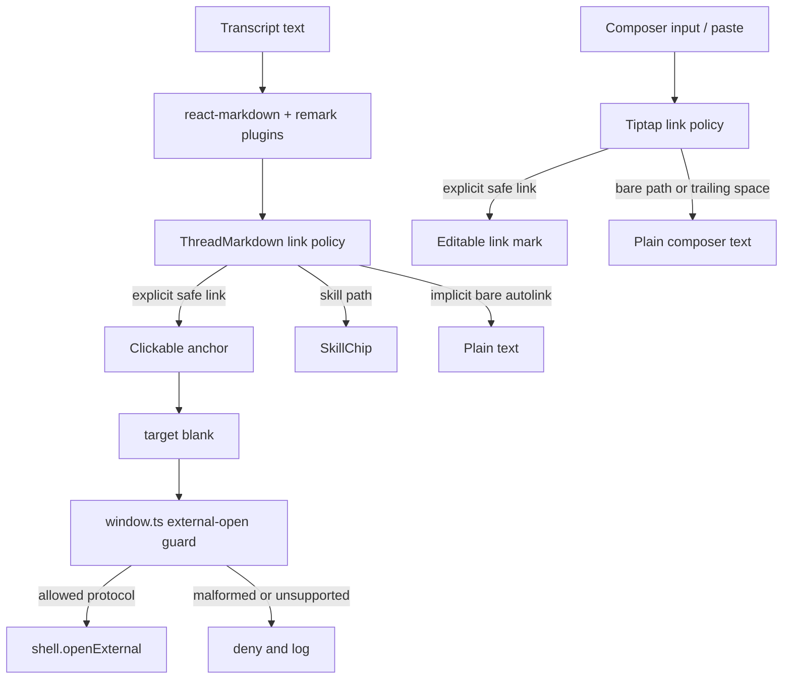

# fix: Make transcript and composer hyperlinks safer

## Overview

Tighten desktop chat hyperlink behavior in both transcript rendering and the Tiptap reply composer. Pasted repo-relative paths such as `docs/plans/2026-05-02-001-feat-messaging-tool-update-verbosity-plan.md` should remain plain text unless the user explicitly wrote a markdown link or pasted a URL with a safe protocol. In the composer, users must also be able to place the caret at the end of a hyperlink, type spaces or more text, and have that new text exit the link instead of extending it. Add a main-process external-open guard as defense in depth so renderer-created windows cannot send arbitrary URLs straight to `shell.openExternal`.

## Problem Frame

The thread detail renderer uses `react-markdown` with `remark-gfm` in `apps/desktop/src/renderer/src/features/thread-detail/ThreadMarkdown.tsx`. `remark-gfm` intentionally adds GFM autolink literals, which can treat domain-looking text as a link even when it is just part of a repo path. A plan path ending in `.md` can be misread as a bare domain because `.md` is a real top-level domain, producing an unintended HTTP link from untrusted transcript text.

That is a security-sensitive footgun in an Electron app. The renderer currently creates `target="_blank"` anchors, and `apps/desktop/src/main/window.ts` sends every window-open URL to `shell.openExternal(url)`. Electron's own security guidance warns against passing untrusted content to `shell.openExternal`; the app should validate both link creation and link opening.

There is a second user-visible problem in the Tiptap composer. When using the `tiptap-wysiwyg-markdown-chips` composer, a hyperlink can be sticky at its trailing edge: moving the caret to the end of the link and typing spaces continues the hyperlink instead of letting the user get off the end of it. That makes accidental links harder to escape and can cause unrelated follow-up text to inherit the link mark.

## Requirements Trace

- R1. Bare repo-relative paths, local-looking paths, and bare domain-looking `.md` suffixes in transcript text must not become clickable external links.
- R2. Explicit URLs with safe protocols should still work when the source text clearly contains the protocol.
- R3. Explicit markdown links should keep working for safe HTTPS targets, loopback/local development HTTP targets when intentionally allowed, existing skill chips, and existing explicit local-path links supported by the renderer.
- R4. Electron main-process external opening must validate renderer-requested URLs before calling `shell.openExternal`.
- R5. The change must preserve the existing thread-detail markdown stack, visual styling, skill chips, inert image behavior, and code-block literal behavior.
- R6. The Tiptap composer must not auto-create hyperlinks for bare repo-relative paths, local-looking paths, or bare `.md` domain-looking text.
- R7. The Tiptap composer must let users exit a hyperlink at the trailing edge; spaces and normal text typed after a link must not inherit the link mark.
- R8. Tiptap composer markdown serialization must not emit markdown link syntax for text the user did not intentionally make a link.

## Scope Boundaries

- In scope: desktop thread-detail transcript and summary markdown rendered through `ThreadMarkdown`.
- In scope: the desktop Tiptap reply composer path selected by `tiptap-wysiwyg-markdown-chips`.
- In scope: main-process external-open handling for renderer-created windows.
- In scope: focused regression tests for false-positive autolinks and allowed explicit links.
- Out of scope: replacing `react-markdown` or removing `remark-gfm` entirely.
- Out of scope: preventing Telegram, Discord, or a user's browser from applying their own native client-side autolink rules to plain text after PwrAgent sends it.
- Out of scope: adding a new in-app confirmation dialog for every external link click.

## Context & Research

### Relevant Code and Patterns

- `apps/desktop/src/renderer/src/features/thread-detail/ThreadMarkdown.tsx` owns markdown plugins, URL transformation, anchor rendering, skill-chip conversion, and inert image rendering.
- `apps/desktop/src/renderer/src/features/thread-detail/__tests__/thread-markdown.test.tsx` already covers markdown formatting, explicit local file links, skill chips, raw HTML literal rendering, fenced code blocks, and inert images.
- `apps/desktop/src/renderer/src/features/thread-detail/__tests__/transcript-list.test.tsx` proves transcript messages consume `ThreadMarkdown`.
- `apps/desktop/src/main/window.ts` installs the current `webContents.setWindowOpenHandler`.
- `apps/desktop/src/main/__tests__/app-bootstrap.test.ts` mocks `setWindowOpenHandler` and is the closest existing place to add window-open behavior coverage.
- `apps/desktop/src/renderer/src/features/composer/ComposerTiptapInput.tsx` owns the Tiptap composer setup. It uses `StarterKit`, enables Tiptap input and paste rules when markdown conversion is active, and serializes active text marks back into markdown.
- `apps/desktop/src/renderer/src/features/composer/Composer.tsx` selects `ComposerTiptapInput` for `tiptap-wysiwyg-markdown-chips`.
- `apps/desktop/src/renderer/src/features/composer/__tests__/composer.test.tsx` covers composer behavior and should add the regression for typing after a link.
- `pnpm-lock.yaml` already contains `@tiptap/extension-link` through the Tiptap dependency graph, so implementation must verify whether `StarterKit` is enabling the link extension implicitly before deciding whether to add a direct dependency/import.
- `packages/messaging/providers/telegram/src/telegram-formatting.ts` and `packages/messaging/providers/discord/src/discord-formatting.ts` do not currently add HTML anchors for bare paths; remote platform-native autolinking remains adapter/client behavior, not desktop renderer behavior.

### Institutional Learnings

- No `docs/solutions/` directory exists in this repo, so there is no prior local solution note for markdown autolink safety.
- `docs/plans/2026-04-17-001-feat-thread-detail-markdown-rendering-plan.md` established that thread-detail markdown should use a maintained renderer but keep link handling safe and local to the thread-detail surface.

### External References

- `remark-gfm` documents that it enables GFM autolink literals as part of the plugin's feature set: https://github.com/remarkjs/remark-gfm
- `react-markdown` documents `urlTransform` as the URL safety hook and its default safe protocol behavior: https://github.com/remarkjs/react-markdown
- Electron security guidance recommends limiting new-window creation and not passing untrusted content to `shell.openExternal`: https://www.electronjs.org/docs/latest/tutorial/security
- Electron's window-open API documents `webContents.setWindowOpenHandler` as the main-process control point for `target=_blank` links and `window.open`: https://www.electronjs.org/docs/latest/api/window-open

## Key Technical Decisions

- Keep `remark-gfm`, but make link rendering source-aware. GFM tables, strikethrough, task lists, and explicit links remain valuable; the bug is specifically optimistic bare autolinks, not GFM as a whole.
- Treat protocol-bearing URLs as intentional only after protocol allowlisting. A pasted `https://example.com/path` can remain clickable because the user supplied a clear URL scheme; a non-loopback `http://` URL should not be treated as safe just because it has a scheme.
- Treat bare domain autolinks as text in chat transcripts. Strings like `example.com`, `foo.md`, or `docs/plans/foo.md` should not become external browser launches unless written as explicit markdown links.
- Treat the composer as a text-entry surface first, not a link editor. Auto-linking in the composer should be disabled or narrowed enough that pasted paths remain editable text by default.
- Configure or override Tiptap link marks so they are non-sticky at the trailing edge. If a user positions the caret after a link, typing spaces or normal text should clear the stored link mark before insertion.
- Preserve explicit markdown links. `[label](https://example.com)`, `<https://example.com>`, explicit skill links, and the existing explicit local-path link behavior should continue through the safe-link path.
- Put external-open validation in the main process as defense in depth. Renderer filtering can regress; `window.ts` should still refuse unsupported protocols and malformed URLs before calling `shell.openExternal`.
- Keep local file opening narrow and intentional. Existing explicit local-path links may continue, but plain pasted paths should not silently become file or HTTP links.

## Open Questions

### Resolved During Planning

- Should the fix remove `remark-gfm`? No. The repository already relies on GFM behavior, and the false positive can be contained at the link policy boundary.
- Should plain repo-relative paths become file links? No. Without an explicit base directory and user intent, repo-relative text should render as text.
- Should the composer keep sticky link behavior as a normal rich-text convention? No. In this app the composer primarily sends instructions and paths; extending a link after trailing spaces is surprising and makes accidental links harder to escape.
- Should the main-process guard be skipped if renderer filtering is fixed? No. Electron treats external-open as privileged enough that main-process validation should be the final gate.

### Deferred to Implementation

- The exact helper shape for identifying implicit autolink source spans is deferred until implementation inspects the `react-markdown` node data available in the anchor override.
- The exact Tiptap implementation path is deferred until implementation confirms whether `StarterKit` is enabling `@tiptap/extension-link` implicitly. Likely approaches are disabling StarterKit's built-in link extension and adding an explicitly configured Link extension, or intercepting text input near a trailing link to clear the stored mark.
- Whether local file links should eventually use a dedicated IPC opener instead of `shell.openExternal(file://...)` is deferred to a separate hardening pass.
- Any remote messaging adapter neutralization for platform-native autolinks is deferred until a concrete Telegram or Discord reproduction exists.

## High-Level Technical Design

> *This illustrates the intended approach and is directional guidance for review, not implementation specification. The implementing agent should treat it as context, not code to reproduce.*

## Implementation Units

- [x] **Unit 1: Make `ThreadMarkdown` reject implicit bare autolinks**

**Goal:** Prevent GFM autolink literals from converting repo-relative paths and bare `.md` domain-looking text into clickable links, while preserving explicit safe links and skill chips.

**Requirements:** R1, R2, R3, R5

**Dependencies:** None

**Files:**
- Modify: `apps/desktop/src/renderer/src/features/thread-detail/ThreadMarkdown.tsx`
- Modify: `apps/desktop/src/renderer/src/features/thread-detail/__tests__/thread-markdown.test.tsx`
- Modify: `apps/desktop/src/renderer/src/features/thread-detail/__tests__/transcript-list.test.tsx`

**Approach:**
- Add a small source-aware link classifier inside `ThreadMarkdown` or a nearby feature-local helper.
- Use the markdown node/source context available to the anchor renderer to distinguish explicit markdown links and angle/protocol URLs from GFM bare autolink literals.
- Render implicit bare autolink literals as plain text rather than anchors.
- Keep `normalizeMarkdownUrl` focused on protocol/path allowlisting after the source-intent classification has decided a link is allowed.
- Preserve skill-chip conversion for explicit skill markdown links before falling back to regular anchor rendering.
- Make `rel` explicit as `noopener noreferrer` for surviving external anchors.

**Patterns to follow:**
- Existing `ThreadMarkdown` component override pattern for anchors, images, code, and paragraphs.
- Existing `thread-markdown.test.tsx` style of direct component tests for renderer behavior.

**Test scenarios:**
- Happy path: `https://example.com/docs` in transcript text renders as a clickable link.
- Happy path: `[docs](https://example.com/docs)` renders as a clickable link.
- Happy path: a loopback/local development HTTP URL renders as a clickable link only if the chosen policy intentionally allows that host class.
- Happy path: an explicit local-path markdown link that currently works still renders with the expected safe href.
- Happy path: a recognized explicit skill markdown link still renders as a `SkillChip`.
- Edge case: `docs/plans/2026-05-02-001-feat-messaging-tool-update-verbosity-plan.md` renders as text with no link role.
- Edge case: `2026-05-02-001-feat-messaging-tool-update-verbosity-plan.md` renders as text with no HTTP href.
- Edge case: `example.com` or `notes.md` renders as text unless explicitly wrapped as a markdown link.
- Edge case: markdown-looking link text inside fenced code remains literal and does not produce anchors or chips.
- Error path: unsupported protocols such as `javascript:`, custom schemes, and non-loopback `http:` URLs remain inert even when written as explicit markdown links.
- Integration: `TranscriptList` displays the pasted plan path in a user message without creating a clickable browser-opening link.

**Verification:**
- The thread-detail markdown tests prove only intentional links are clickable, and the transcript-list regression covers the user-visible chat path.

- [x] **Unit 2: Guard external URL opening in the Electron main process**

**Goal:** Ensure renderer-created windows cannot pass arbitrary or malformed URLs to `shell.openExternal`.

**Requirements:** R4

**Dependencies:** None

**Files:**
- Modify: `apps/desktop/src/main/window.ts`
- Modify: `apps/desktop/src/main/__tests__/app-bootstrap.test.ts`

**Approach:**
- Extract a small `isSafeExternalOpenUrl` or equivalent helper near `createMainWindow`.
- Parse the candidate URL with the platform `URL` parser and deny malformed values.
- Allow only the protocols PwrAgent intentionally supports for renderer links. Prefer `https:` and `mailto:` for external browser/mail links; allow `http:` only for loopback/local development hosts if implementation preserves that workflow; include `file:` only if preserving the current explicit local-link behavior requires it.
- Keep returning `{ action: "deny" }` from `setWindowOpenHandler` so the renderer never creates a new Electron window.
- Log denied URLs at debug level with enough context to diagnose regressions without dumping full untrusted transcript content.

**Patterns to follow:**
- Current `createMainWindow` lifecycle in `apps/desktop/src/main/window.ts`.
- Existing Electron mocks in `apps/desktop/src/main/__tests__/app-bootstrap.test.ts`.

**Test scenarios:**
- Happy path: `https://github.com/pwrdrvr/PwrAgent` is passed to `shell.openExternal` and the new window is denied.
- Happy path: loopback/local development HTTP URLs are allowed only if the implementation explicitly keeps that host class.
- Happy path: an allowed explicit `file:` URL still follows the intended current behavior if file links remain supported.
- Error path: `javascript:alert(1)`, `pwragent-test://payload`, non-loopback `http://example.com`, and malformed URL strings are denied without calling `shell.openExternal`.
- Error path: a bare or generated `http://2026-05-02-001-feat-messaging-tool-update-verbosity-plan.md` is denied by the main-process HTTP policy and also blocked earlier by Unit 1.
- Integration: `setWindowOpenHandler` continues to be installed exactly once during window creation.

**Verification:**
- Main-process tests prove `shell.openExternal` is only called for explicitly allowed URLs and never for unsupported protocols.

- [x] **Unit 3: Make Tiptap composer links intentional and exitable**

**Goal:** Prevent the WYSIWYG markdown composer from auto-linking bare paths and stop link marks from sticking when the user types spaces or text after an existing hyperlink.

**Requirements:** R6, R7, R8

**Dependencies:** None

**Files:**
- Modify: `apps/desktop/src/renderer/src/features/composer/ComposerTiptapInput.tsx`
- Modify: `apps/desktop/src/renderer/src/features/composer/__tests__/composer.test.tsx`
- Modify: `apps/desktop/package.json` only if a direct `@tiptap/extension-link` import is needed
- Modify: `pnpm-lock.yaml` only if package metadata changes

**Approach:**
- Inspect whether Tiptap `StarterKit` is enabling `@tiptap/extension-link` in the active `tiptap-wysiwyg-markdown-chips` path.
- If Link is enabled implicitly, disable it in `StarterKit.configure(...)` and add an explicitly configured Link extension so options are local and reviewable.
- Disable or narrowly constrain composer autolinking/link-on-paste for scheme-less text so `docs/plans/...plan.md`, `notes.md`, and `example.com` remain plain text unless the user intentionally creates a link.
- Configure link marks to be non-inclusive/non-sticky at the trailing edge when the extension supports that directly.
- Add an input guard for the concrete reported case if extension configuration alone is insufficient: when the selection is at the end of a link mark and the user types a space or normal character, clear the stored link mark before inserting text.
- Ensure composer markdown serialization only emits markdown link syntax for actual link marks that survived the safe link policy. Plain paths should serialize as plain paths.

**Patterns to follow:**
- Current `ComposerTiptapInput.tsx` extension setup, input rules, paste rules, and markdown serialization helpers.
- Existing `composer.test.tsx` user-flow tests for composer implementation variants and skill-chip markdown serialization.

**Test scenarios:**
- Happy path: an intentionally explicit safe HTTPS link, if supported in the composer, serializes as markdown link syntax.
- Edge case: pasting or typing `docs/plans/2026-05-02-001-fix-chat-markdown-autolinks-plan.md` into the Tiptap composer leaves it as plain text with no link mark.
- Edge case: typing `notes.md` or `example.com` leaves the text plain unless the user explicitly creates a link.
- Edge case: placing the caret at the end of a hyperlink and typing a space inserts a plain space outside the link.
- Edge case: after exiting the link with a space, subsequent words remain plain text and do not inherit the hyperlink.
- Error path: unsupported protocols such as `javascript:` and custom schemes cannot be serialized or sent as active links.
- Integration: sending the composer contents after the reported sequence produces plain markdown text for the added spaces/follow-up text, not one extended markdown link.

**Verification:**
- Composer tests reproduce the reported "can't get off the end of a hyperlink" behavior and prove it is fixed for the Tiptap WYSIWYG markdown composer.

- [x] **Unit 4: Keep messaging adapter link behavior explicit**

**Goal:** Confirm PwrAgent messaging adapters do not add their own optimistic linkification for bare paths, and document the boundary where Telegram/Discord clients may still autolink plain text.

**Requirements:** R1, R5

**Dependencies:** Units 1 and 3 for the desktop-owned policy vocabulary.

**Files:**
- Modify: `packages/messaging/providers/telegram/src/__tests__/telegram-formatting.test.ts`
- Modify: `packages/messaging/providers/discord/src/__tests__/discord-formatting.test.ts`
- Modify: `docs/messaging-adapter-contract.md`

**Approach:**
- Add provider formatting tests that render the exact repo-relative plan-path shape and assert PwrAgent does not produce explicit anchor markup or transformed HTTP URLs.
- Keep Telegram's markdownish HTML renderer conservative: code spans and code blocks are formatted, but bare paths remain escaped text.
- Keep Discord formatting free of PwrAgent-generated markdown links for bare paths; mention that Discord may still apply client-native autolinking outside PwrAgent's control.
- Update the adapter contract to state that channel adapters must not turn scheme-less bare paths into explicit HTTP links. If a platform autolinks plain text anyway, adapters may neutralize later only with a platform-specific policy and tests.

**Patterns to follow:**
- `packages/messaging/providers/telegram/src/telegram-formatting.ts`
- `packages/messaging/providers/discord/src/discord-formatting.ts`
- `docs/messaging-adapter-contract.md`

**Test scenarios:**
- Happy path: Telegram formatting preserves `docs/plans/...plan.md` as escaped text and does not emit an `<a>` tag.
- Happy path: Discord formatting preserves `docs/plans/...plan.md` as plain content and does not rewrite it to `http://...`.
- Edge case: explicit markdown/code syntax already supported by each adapter keeps its current behavior.
- Error path: mention sanitization in Discord still neutralizes broad mentions while leaving the path text unlinked.

**Verification:**
- Provider tests prove PwrAgent does not introduce new explicit links for bare repo paths, and documentation states the remaining platform-native autolink limitation.

## System-Wide Impact

- **Interaction graph:** User or assistant transcript text flows through `ThreadMarkdown`; intentional anchors flow through the Electron window-open handler before reaching the OS browser or file opener.
- **Error propagation:** Unsafe or accidental links should degrade to visible text, not crashes, hidden drops, or surprise browser launches.
- **State lifecycle risks:** No persisted state changes are involved.
- **API surface parity:** Desktop renderer behavior and messaging adapter policy should share the same product rule: scheme-less bare paths are text, not HTTP links.
- **Integration coverage:** Unit tests are sufficient for the parser/link policy and window-open guard; a later browser/E2E test is useful if this regresses visually.
- **Unchanged invariants:** Markdown emphasis, code blocks, GFM strikethrough/task-list behavior, skill chips, and intentionally explicit links remain supported.

## Risks & Dependencies

| Risk | Mitigation |
|------|------------|
| The anchor renderer cannot reliably tell implicit GFM autolinks from explicit links | Use the markdown node position/source slice when available; if unavailable, add a small remark plugin that marks explicit versus implicit link nodes before React rendering |
| Tiptap Link configuration does not fully stop sticky trailing marks | Add a targeted input handler that clears stored link marks when typing at the trailing edge of a link, and cover the exact space-after-link sequence in tests |
| Tightening link policy breaks useful explicit local links | Preserve explicit markdown links in tests and keep plain paths text-only |
| Main-process validation gives a false sense of safety for accidental HTTP links | Deny non-loopback `http:` in the main process and still keep renderer source-intent filtering, because some accidental links may be syntactically valid `https:` or `file:` URLs |
| Remote messaging clients still autolink bare text | Document the boundary and avoid PwrAgent-generated explicit links; neutralize per-platform only after concrete reproductions |

## Documentation / Operational Notes

- Add a short adapter-contract note because messaging providers should not repeat the same over-eager linkification mistake.
- No user-facing documentation is required for desktop users; the intended behavior is simply that pasted paths remain text unless explicitly linked.

## Sources & References

- Origin document: [docs/brainstorms/2026-04-17-thread-detail-markdown-rendering-requirements.md](docs/brainstorms/2026-04-17-thread-detail-markdown-rendering-requirements.md)
- Related plan: [docs/plans/2026-04-17-001-feat-thread-detail-markdown-rendering-plan.md](2026-04-17-001-feat-thread-detail-markdown-rendering-plan.md)
- Related code: `apps/desktop/src/renderer/src/features/thread-detail/ThreadMarkdown.tsx`
- Related code: `apps/desktop/src/renderer/src/features/composer/ComposerTiptapInput.tsx`
- Related code: `apps/desktop/src/renderer/src/features/composer/Composer.tsx`
- Related code: `apps/desktop/src/main/window.ts`
- Related code: `packages/messaging/providers/telegram/src/telegram-formatting.ts`
- Related code: `packages/messaging/providers/discord/src/discord-formatting.ts`
- User report: Tiptap composer hyperlink remains active when typing spaces at the trailing edge of the link.
- External docs: https://github.com/remarkjs/remark-gfm
- External docs: https://github.com/remarkjs/react-markdown
- External docs: https://www.electronjs.org/docs/latest/tutorial/security
- External docs: https://www.electronjs.org/docs/latest/api/window-open
