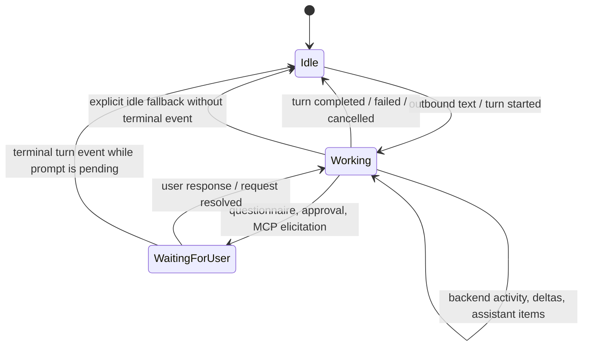

# fix: Keep messaging typing indicators alive for active turns

## Overview

Fix the messaging-platform bug where Telegram and Discord typing indicators can stop immediately after the first assistant response or update in a turn, even though the agent is still connected and working.

The messaging controller should treat typing/activity as a turn-lifecycle signal, not as a message-delivery side effect. Assistant message chunks or `item/completed` agent-message events may be visible user-facing output, but they do not prove the turn is terminal. The typing indicator should remain active through normal backend activity and stop only when the turn reaches a terminal state or when the agent is intentionally waiting on user input, such as a Plan questionnaire, approval prompt, or future MCP elicitation.

## Problem Frame

The current controller flow in `apps/desktop/src/main/messaging/core/messaging-controller.ts` sets `activeTurn.status = "completed"` when `assistantTextForBackendEvent()` finds text on a non-lifecycle backend event. In practice, an `item/completed` event for an assistant message can arrive before `turn/completed`. That path logs `assistant_final`, sends a `MessagingActivityIntent` with `state: "idle"`, and causes providers to stop the renewable typing lease while the backend turn can still continue with more work.

Telegram and Discord providers already have the right adapter primitive: `activity: "typing"` with `state: "active"` starts or refreshes a renewable lease, and `state: "idle"` stops it. The bug is in when the desktop messaging workflow emits the idle signal.

## Requirements Trace

- R1. After free-form messaging text starts a bound agent turn, the channel typing indicator stays active while the turn is working.
- R2. Delivering the first assistant message or assistant item completion does not mark the turn completed or stop typing unless a terminal turn event is also present.
- R3. Backend activity during a working turn refreshes the typing lease at the existing bounded cadence.
- R4. Terminal turn states stop typing: `turn/completed`, `turn/failed`, `turn/cancelled`, `turn/interrupted` where supported, and explicit idle thread status used as a fallback when no terminal turn event arrives.
- R5. User-input breaks stop typing while the agent is waiting on the user: Plan questionnaires, approval prompts, and future MCP elicitation requests that carry the active `turnId`.
- R6. When a waiting prompt is resolved and the same turn resumes work, typing can become active again without requiring a new user message.
- R7. The behavior remains channel-neutral. Telegram and Discord adapter code should not learn agent lifecycle semantics beyond the generic `activity` intent.

## Scope Boundaries

- In scope: desktop messaging controller lifecycle logic, typing activity intent emission, controller tests, Telegram/Discord provider lease regression tests, and documentation of typing lifecycle semantics.
- In scope: preserving current provider lease behavior and existing `TYPING_ACTIVITY_REFRESH_MS` / `TYPING_ACTIVITY_LEASE_MS` policy unless tests expose a direct mismatch.
- Out of scope: changing Telegram Bot API or Discord REST/Gateway integration mechanics.
- Out of scope: adding a new hosted webhook mode, public bot service, or messaging replay harness.
- Out of scope: implementing full MCP elicitation support in messaging if it is not already surfaced through the messaging pending-request path. This plan only establishes the lifecycle rule it should follow when wired.

## Context & Research

### Relevant Code and Patterns

- `apps/desktop/src/main/messaging/core/messaging-controller.ts` owns inbound text routing, backend event handling, pending request handling, active turn state, and `signalTurnActivity()`.
- `signalTurnActivity()` already maps `activeTurn.status === "working"` to `MessagingActivityIntent.state = "active"` and all other statuses to `idle`, with refresh suppression through `TYPING_ACTIVITY_REFRESH_MS`.
- `assistantTextForBackendEvent()` extracts assistant text from both `item/completed` and `turn/completed`. The current non-lifecycle `item/completed` path is the likely early-idle source.
- `handleBackendPendingRequest()` already sets `activeTurn.status = "waiting"` for pending requests with a `turnId`, which intentionally sends idle and updates status.
- `apps/desktop/src/main/messaging/messaging-runtime.ts` currently classifies `item/tool/requestUserInput` and `*requestApproval*` notifications as messaging pending requests. MCP elicitation is not in this classifier today.
- `packages/messaging/interface/src/index.ts` and `packages/shared/src/contracts/messaging.ts` define the generic `MessagingActivityIntent` contract with `activity: "typing"`, `state: "active" | "idle"`, and optional `leaseMs`.
- `packages/messaging/providers/telegram/src/telegram-adapter.ts` starts, refreshes, expires, and stops Telegram `sendChatAction` typing signals from generic activity intents.
- `packages/messaging/providers/discord/src/discord-adapter.ts` starts, refreshes, expires, and stops Discord typing requests from generic activity intents.
- `apps/desktop/src/main/__tests__/messaging-controller.test.ts`, `apps/desktop/src/main/__tests__/telegram-adapter.test.ts`, and `apps/desktop/src/main/__tests__/discord-adapter.test.ts` already cover the closest controller and provider typing paths.
- `docs/messaging-adapter-contract.md` is the right place to document provider lifecycle expectations without leaking controller implementation details.

### Institutional Learnings

- No relevant `docs/solutions/` artifacts exist for messaging typing lifecycle bugs.
- `docs/plans/2026-04-30-001-feat-messaging-platform-integration-plan.md` established the channel-neutral surface boundary and the rule that adapters own platform rendering while controller workflow owns thread, approval, questionnaire, and fallback semantics.
- `docs/plans/2026-04-30-003-refactor-desktop-hosted-messaging-plan.md` superseded earlier package ownership and confirmed desktop main-process messaging is the integration host.
- `docs/plans/2026-04-20-001-feat-plan-questionnaire-navigation-plan.md` established that Plan questionnaires are active-turn pending-input breaks, not terminal turn completion.
- `docs/plans/2026-04-28-001-feat-desktop-mcp-request-support-plan.md` established that MCP elicitation is also a request/response pause in an active turn, with separate response semantics from approvals and questionnaires.

### External References

- External research is not needed for this fix. The provider APIs already support renewable typing indicators in the current code; the issue is local turn-state classification.

## Key Technical Decisions

- **Typing follows turn lifecycle, not assistant message delivery.** Assistant text should be delivered as a `message` intent without changing `activeTurn.status` unless the same backend event is a terminal lifecycle event.
- **Keep waiting states idle.** Presenting a questionnaire, approval prompt, or MCP elicitation is a user-input break. The indicator should stop while the agent is waiting for the user, even though the larger turn may continue afterward.
- **Let resolved prompts resume typing for the same turn.** Once the user responds to a pending request or the backend reports `serverRequest/resolved` for the active waiting turn, the controller should treat the turn as waiting on the agent again and move it back to `working` unless a terminal event has already settled the turn. Subsequent backend activity can refresh the same lease, and provider lease expiry remains the fallback if no more activity arrives.
- **Centralize event-to-turn-state classification.** Add or refactor toward a small helper that describes whether a backend or pending-request event starts work, refreshes work, pauses for user input, or terminates the turn. Tests should target the behavior rather than scattered incidental branches.
- **Keep provider behavior generic.** Telegram and Discord should continue to respond only to `MessagingActivityIntent`; they should not parse `turn/completed`, `item/completed`, questionnaires, approvals, or MCP events.
- **Preserve fallback idle behavior.** `thread/status/changed` idle can still stop typing when no terminal turn completion arrives, but it should be treated as lifecycle evidence, not as a consequence of a rendered assistant message.

## Open Questions

### Resolved During Planning

- **Do Plan questionnaires end the turn?** No for messaging lifecycle purposes. They are a pending-input break inside an active turn and should stop typing until the user responds.
- **Should assistant `item/completed` be treated as final output?** No. It is message output for delivery/deduplication, not terminal turn-state evidence.
- **Should adapters own the decision about when typing stops?** No. Adapters own platform typing mechanics; the controller owns semantic activity state.
- **Is external API research required?** No. Existing Telegram and Discord providers already implement start/refresh/stop leases from generic activity intents.

### Deferred to Implementation

- Whether MCP elicitation is currently exposed to messaging through `isMessagingPendingRequest()`. If not, this fix should document the rule and avoid sneaking MCP support into scope.
- Whether `turn/interrupted` appears as `turn/cancelled`, `turn/failed`, or another concrete method in the current app-server event stream. Match existing normalized event names rather than inventing a new protocol string.

## High-Level Technical Design

> *This illustrates the intended approach and is directional guidance for review, not implementation specification. The implementing agent should treat it as context, not code to reproduce.*

The important separation is that `message` delivery is orthogonal to `activity` state:

| Event shape | Message delivery | Typing state |
| --- | --- | --- |
| User sends bound text | none | active |
| `item/completed` agent message | deliver assistant message | keep or refresh active |
| `turn/completed` with output | deliver deduped assistant message | idle |
| Plan questionnaire / approval | deliver pending prompt | idle |
| Future MCP elicitation | deliver pending prompt when supported | idle |
| User response or request resolved for same active turn | optional status update | active |

## Implementation Units

- [x] **Unit 1: Characterize current early-idle lifecycle behavior**

**Goal:** Add failing controller-level coverage that proves an assistant `item/completed` event should not stop typing before terminal turn completion.

**Requirements:** R1, R2, R3, R4

**Dependencies:** None

**Files:**
- Modify: `apps/desktop/src/main/__tests__/messaging-controller.test.ts`
- Modify: `apps/desktop/src/main/__tests__/telegram-adapter.test.ts`
- Modify: `apps/desktop/src/main/__tests__/discord-adapter.test.ts`

**Approach:**
- Update the existing controller test that currently expects `item/completed` assistant text to emit idle. It should instead expect message delivery while the binding remains `activeTurn.status = "working"` until a terminal turn event arrives.
- Add a sequence that starts a turn, delivers an assistant `item/completed` message, emits follow-up backend activity, then emits `turn/completed`; typing should be active before completion and idle after completion.
- Update provider-oriented tests that currently encode "do not re-issue typing after final assistant text" so "final" means a terminal turn event, not the first assistant item text.
- Keep current tests that prove explicit terminal or idle fallback events stop typing.

**Execution note:** Start with failing characterization tests before changing lifecycle code.

**Patterns to follow:**
- Existing typing lifecycle tests in `apps/desktop/src/main/__tests__/messaging-controller.test.ts`
- Existing Telegram timer/lease tests in `apps/desktop/src/main/__tests__/telegram-adapter.test.ts`
- Existing Discord timer/lease tests in `apps/desktop/src/main/__tests__/discord-adapter.test.ts`

**Test scenarios:**
- Happy path: inbound text starts a turn and emits one active typing intent.
- Regression: `item/completed` with `item.type = "agentMessage"` and text delivers a message but does not emit idle and does not mark the binding completed.
- Happy path: a later backend activity event during the same turn refreshes or preserves typing according to `TYPING_ACTIVITY_REFRESH_MS`.
- Happy path: `turn/completed` after earlier assistant item delivery emits idle and updates the binding status to completed.
- Edge case: `turn/completed` with duplicate output text does not double-deliver the assistant message because delivery deduplication still keys by backend/thread/turn/text.
- Error path: `thread/status/changed` idle without a terminal turn event still emits idle as the existing fallback.

**Verification:**
- Tests fail on the current early-idle implementation and describe the desired lifecycle in channel-neutral terms.

- [x] **Unit 2: Separate assistant message delivery from turn terminal state**

**Goal:** Refactor controller backend-event handling so assistant text delivery does not complete the active turn unless terminal lifecycle evidence is present.

**Requirements:** R1, R2, R3, R4, R7

**Dependencies:** Unit 1

**Files:**
- Modify: `apps/desktop/src/main/messaging/core/messaging-controller.ts`
- Test: `apps/desktop/src/main/__tests__/messaging-controller.test.ts`

**Approach:**
- Remove the non-lifecycle `assistant_final` transition that marks a working active turn as completed solely because `assistantTextForBackendEvent()` returned text.
- Keep `deliverAssistantMessage()` and `assistantMessageDeliveryKey()` so assistant output still reaches the messaging channel and duplicate terminal output remains suppressed.
- Ensure non-terminal backend activity while `activeTurn.status === "working"` can still call `signalTurnActivity()` at the existing refresh cadence.
- Keep terminal lifecycle handling authoritative for completion, failure, cancellation, and fallback idle status.
- Prefer a small event-classification helper if it makes the state transitions explicit enough to avoid future accidental coupling between message output and activity state.

**Patterns to follow:**
- `turnLifecycleForBackendEvent()` in `apps/desktop/src/main/messaging/core/messaging-controller.ts`
- `assistantTextForBackendEvent()` and `assistantMessageDeliveryKey()` in the same file
- `buildActivityIntent()` in `apps/desktop/src/main/messaging/core/messaging-renderer.ts`

**Test scenarios:**
- Regression: first assistant item text during a working turn leaves `activeTurn.status = "working"`.
- Happy path: terminal `turn/completed` changes the same binding to completed and emits exactly one idle activity intent.
- Happy path: terminal `turn/failed` or cancellation changes typing to idle without requiring assistant text.
- Edge case: an assistant text event for an unknown or unbound thread does not create a binding or typing signal.
- Integration: status-card rendering after non-terminal assistant text still shows the turn as working; after terminal completion it shows completed/idle.

**Verification:**
- Messaging controller behavior expresses turn activity from lifecycle state, and assistant output can be delivered mid-turn without stopping provider typing leases.

- [x] **Unit 3: Preserve user-input break semantics and resumed-work behavior**

**Goal:** Keep typing off while the agent is waiting on user input, and make the lifecycle robust when the same turn resumes after a questionnaire, approval, or future MCP elicitation.

**Requirements:** R5, R6, R7

**Dependencies:** Unit 2

**Files:**
- Modify: `apps/desktop/src/main/messaging/core/messaging-controller.ts`
- Modify: `apps/desktop/src/main/messaging/messaging-runtime.ts` only if current pending-request classification needs a narrow lifecycle hook
- Test: `apps/desktop/src/main/__tests__/messaging-controller.test.ts`
- Test: `apps/desktop/src/main/__tests__/messaging-runtime.test.ts` only if runtime pending-request classification changes

**Approach:**
- Preserve `handleBackendPendingRequest()` behavior that sets `activeTurn.status = "waiting"` and emits idle for pending requests with a `turnId`.
- Add or adjust tests proving Plan questionnaires and approval prompts stop typing while they are visible.
- Move `waiting -> working` when a pending request response is submitted for the active turn or when `serverRequest/resolved` arrives for that same turn, unless a terminal event has already settled it.
- Ensure subsequent backend activity for a waiting active turn can also resume the status to `working` instead of being ignored because only `working` currently refreshes typing.
- Treat MCP elicitation as a documented pending-input lifecycle category, but do not broaden runtime classification unless current messaging code already has enough request shape to render it correctly.

**Patterns to follow:**
- `handleBackendPendingRequest()` and `handleBackendRequestResolved()` in `apps/desktop/src/main/messaging/core/messaging-controller.ts`
- Plan questionnaire separation from `docs/plans/2026-04-20-001-feat-plan-questionnaire-navigation-plan.md`
- MCP request separation from `docs/plans/2026-04-28-001-feat-desktop-mcp-request-support-plan.md`

**Test scenarios:**
- Happy path: `item/tool/requestUserInput` with `turnId` presents a questionnaire intent, sets active turn waiting, and emits idle.
- Happy path: approval request with `turnId` presents an approval intent, sets active turn waiting, and emits idle.
- Regression: while a waiting prompt is visible, periodic backend noise does not restart typing unless it is classified as resumed work.
- Happy path: after a questionnaire or approval response is submitted for the same active turn, typing returns to active while preserving the same `turnId`.
- Happy path: if `serverRequest/resolved` arrives for the same waiting turn without a local response path, typing returns to active while preserving the same `turnId`.
- Happy path: subsequent explicit backend activity for a waiting turn can also return typing to active.
- Edge case: a terminal turn event while waiting emits idle and clears/settles status without restarting typing.
- Deferred integration: MCP elicitation follows the same waiting-state lifecycle when it is surfaced as a messaging pending request.

**Verification:**
- The controller distinguishes working, waiting-for-user, and terminal states without treating visible prompts as completed turns.

- [x] **Unit 4: Lock provider lease behavior to generic activity intents**

**Goal:** Ensure Telegram and Discord providers keep renewing typing while active intents continue, stop only on idle intents or lease expiry, and remain unaware of turn protocol details.

**Requirements:** R1, R3, R4, R7

**Dependencies:** Unit 2

**Files:**
- Modify: `apps/desktop/src/main/__tests__/telegram-adapter.test.ts`
- Modify: `apps/desktop/src/main/__tests__/discord-adapter.test.ts`
- Modify: `packages/messaging/providers/telegram/src/__tests__/telegram-grammy-adapter.test.ts` if provider-package coverage needs the same assertion
- Modify: `packages/messaging/providers/discord/src/__tests__/discord-adapter.test.ts` if provider-package coverage needs the same assertion

**Approach:**
- Keep provider implementation unchanged unless tests reveal a lease-refresh bug. The expected fix is primarily controller-side.
- Add provider assertions that repeated active typing activity refreshes the lease without rendering a visible message.
- Add provider assertions that idle activity stops the lease, and no further `sendChatAction` / Discord typing request fires after stop.
- Keep lease-expiry behavior as a fallback when no idle signal arrives.

**Patterns to follow:**
- `startTypingSignal()`, `refreshTypingSignalLease()`, and `stopTypingSignal()` in `packages/messaging/providers/telegram/src/telegram-adapter.ts`
- `startTypingSignal()`, `refreshTypingSignalLease()`, and `stopTypingSignal()` in `packages/messaging/providers/discord/src/discord-adapter.ts`

**Test scenarios:**
- Happy path: an active intent starts Telegram/Discord typing without sending a visible message.
- Happy path: a second active intent for the same target refreshes the lease instead of creating duplicate intervals.
- Happy path: an idle intent stops the existing lease.
- Edge case: if no idle arrives, the lease expires and no interval keeps running indefinitely.
- Regression: provider tests do not mention `item/completed`, `turn/completed`, Plan questionnaires, approvals, or MCP events.

**Verification:**
- Provider tests prove the adapters obey the generic activity contract while lifecycle semantics remain in the controller.

- [x] **Unit 5: Document typing lifecycle semantics**

**Goal:** Capture the controller/provider boundary so future adapter work does not reintroduce message-delivery-driven typing state.

**Requirements:** R5, R7

**Dependencies:** Units 2-4

**Files:**
- Modify: `docs/messaging-adapter-contract.md`
- Modify: `docs/messaging-platform-integration.md`
- Test: `apps/desktop/src/main/__tests__/messaging-docs-links.test.ts`

**Approach:**
- Add a short section to the adapter contract explaining that `activity: "typing"` is a semantic lease signal from the controller: providers start/refresh on active, stop on idle, and do not infer lifecycle from message content.
- Add a short operational note to the messaging platform docs explaining user-visible behavior: typing stays on during active agent work, stops for pending user input, and stops on terminal turn completion/failure/cancellation.
- Keep documentation channel-neutral and avoid platform-specific protocol claims beyond existing Telegram/Discord sections.

**Patterns to follow:**
- Existing boundary language in `docs/messaging-adapter-contract.md`
- Existing manual smoke checklist in `docs/messaging-platform-integration.md`

**Test scenarios:**
- Test expectation: none for behavior -- docs-only. Existing docs link tests should still pass.

**Verification:**
- Messaging docs explain the lifecycle rule in terms that provider authors can follow without reading controller internals.

## System-Wide Impact

- **Interaction graph:** Bound messaging text flows through provider inbound normalization, `MessagingController.handleInboundEvent()`, `DesktopBackendBridge.startTurn()`, backend events, controller delivery, and provider activity leases. This plan changes only the controller's lifecycle classification and tests provider lease behavior at the generic intent boundary.
- **Error propagation:** Provider delivery failures should continue to be isolated by `DesktopMessagingRuntime`; this fix should not make typing failures abort assistant message delivery or status-card updates.
- **State lifecycle risks:** `MessagingBindingRecord.activeTurn` remains the source of messaging activity status. The key risk is stale `working` after a missed terminal event; preserving the explicit idle-status fallback mitigates that.
- **API surface parity:** `MessagingActivityIntent` should remain channel-neutral. No Telegram/Discord-specific contract fields are needed.
- **Integration coverage:** Unit coverage should exercise controller event ordering and provider timers. Manual smoke can verify Telegram/Discord client behavior, but deterministic tests should prove the lifecycle.
- **Unchanged invariants:** Authorization, binding lookup, pending intent TTLs, callback handle opacity, message deduplication, and provider package boundaries do not change.

## Risks & Dependencies

| Risk | Mitigation |
| --- | --- |
| Typing remains active forever if a terminal event is missed | Preserve explicit idle thread-status fallback and provider lease expiry. |
| Waiting prompts restart typing too early | Keep pending-request state as `waiting` and require explicit resolution or resumed-work evidence before returning to `working`. |
| Assistant messages duplicate when both `item/completed` and `turn/completed` carry the same text | Keep `assistantMessageDeliveryKey()` deduplication and add a regression test. |
| Provider tests accidentally encode controller lifecycle semantics | Assert only generic active/idle activity intents in provider tests. |
| MCP elicitation scope expands the fix | Document MCP lifecycle expectations but defer full messaging MCP support unless current runtime classification already supports it cleanly. |

## Documentation / Operational Notes

- Update messaging docs after code behavior is locked so live smoke testers know typing should persist through intermediate assistant updates.
- Manual Telegram/Discord smoke validation should include a prompt that produces an early assistant message or update followed by more work before completion.

## Sources & References

- **Origin document:** [docs/brainstorms/2026-04-30-messaging-platform-integration-requirements.md](../brainstorms/2026-04-30-messaging-platform-integration-requirements.md)
- Related plan: [docs/plans/2026-04-30-001-feat-messaging-platform-integration-plan.md](2026-04-30-001-feat-messaging-platform-integration-plan.md)
- Related plan: [docs/plans/2026-04-30-003-refactor-desktop-hosted-messaging-plan.md](2026-04-30-003-refactor-desktop-hosted-messaging-plan.md)
- Related plan: [docs/plans/2026-04-20-001-feat-plan-questionnaire-navigation-plan.md](2026-04-20-001-feat-plan-questionnaire-navigation-plan.md)
- Related plan: [docs/plans/2026-04-28-001-feat-desktop-mcp-request-support-plan.md](2026-04-28-001-feat-desktop-mcp-request-support-plan.md)
- Related code: `apps/desktop/src/main/messaging/core/messaging-controller.ts`
- Related code: `packages/messaging/providers/telegram/src/telegram-adapter.ts`
- Related code: `packages/messaging/providers/discord/src/discord-adapter.ts`
- Related docs: [docs/messaging-adapter-contract.md](../messaging-adapter-contract.md)
