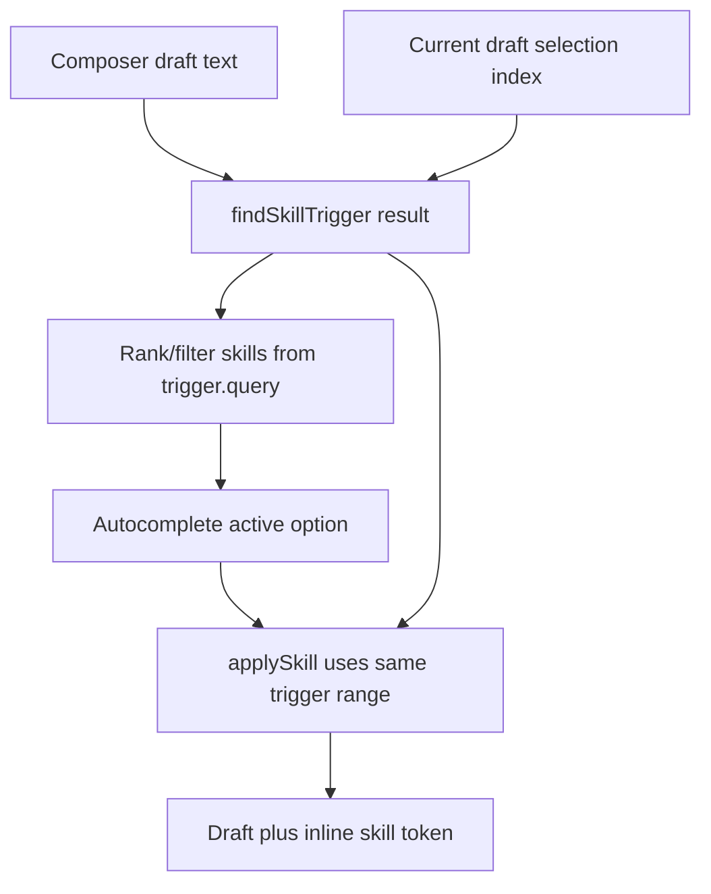

# fix: Repair skill autocomplete filtering and insertion regressions

## Overview

Fix the desktop composer skill autocomplete regressions seen when inserting a skill into the body of a multi-line reply. The implementation should add failing coverage first, then make `$ce`, `$ce:p`, and `$ce:plan` open and filter correctly, make keyboard insertion replace the full typed trigger without leaving suffix text or adding blank lines, improve popup contrast against the transcript, and add PageUp/PageDown navigation while autocomplete is open.

## Problem Frame

The current composer autocomplete can lose the real caret/query context in multi-line drafts. In the reported flow, typing `$ce` after a long paragraph did not open autocomplete, typing `$ce:p` opened a list that was effectively unfiltered, typing `$ce:plan` still highlighted `$ce:brainstorm`, and committing `$ce:plan` inserted a chip while leaving `plan` as raw text and adding one or two blank lines above the insertion line. The visual list also blends into the transcript behind it, making the overlay boundary hard to read.

## Requirements Trace

- R1. Typing `$ce` in the body of a multi-line composer draft opens skill autocomplete when matching skills exist.
- R2. Typing namespace prefixes such as `$ce:p` filters by the complete typed prefix so `$ce:plan` ranks ahead of unrelated or description-only matches.
- R3. Typing the full skill label `$ce:plan` keeps `$ce:plan` as the active/top match instead of selecting `$ce:brainstorm`.
- R4. Keyboard selection with Arrow keys and Enter replaces the entire active trigger range and leaves no raw suffix text such as `plan`.
- R5. Skill insertion into a multi-line draft preserves existing line breaks exactly and does not add blank lines above the insertion line.
- R6. The autocomplete popup has a clearer visual boundary against transcript/content behind it while staying within the Tangerine Terminal theme.
- R7. PageUp and PageDown move the active autocomplete selection by approximately one visible page while the popup is open, for both skill and slash autocomplete where the shared handler applies.
- R8. Existing inline chip serialization remains intact: selected skills still send as markdown links with the skill path.

## Scope Boundaries

- This plan only covers desktop renderer composer autocomplete behavior and styling.
- This plan does not change app-server skill discovery, lazy skill loading, skill metadata shape, or `skills/list` responses.
- This plan does not redesign transcript rendering or thread message layout.
- This plan does not refresh replay fixtures unless existing deterministic E2E fixture builders cannot express the reported flow.

## Context & Research

### Relevant Code and Patterns

- `apps/desktop/src/renderer/src/features/composer/Composer.tsx` owns skill filtering, active autocomplete indexes, keyboard handling, `applySkill`, and popup rendering.
- `apps/desktop/src/renderer/src/lib/skill-mentions.ts` owns `findSkillTrigger`, mention markdown construction, and trigger insertion helpers.
- `apps/desktop/src/renderer/src/features/composer/ComposerRichInput.tsx` maps contenteditable DOM selection and zero-width skill chips back to draft indexes.
- `apps/desktop/src/renderer/src/features/composer/ComposerTiptapInput.tsx` maps TipTap selections and mention nodes back to draft indexes for the TipTap composer path.
- `apps/desktop/src/renderer/src/features/composer/__tests__/composer.test.tsx` already covers basic skill insertion, prefix ranking, inline chip rendering, and focused option activation.
- `apps/desktop/e2e/directory-launchpad-skills.spec.ts` already covers skill autocomplete in Electron, active keyboard selection, long-list scrolling, and both custom-widget and TipTap composer implementations.
- `apps/desktop/src/renderer/src/styles/app.css` contains `.composer__autocomplete` and option styling. The theme source of truth is `docs/UI-THEME.md`; the desktop layout source is `docs/design/desktop-style-guide.md`.
- `docs/plans/2026-04-30-001-fix-composer-skill-autocomplete-plan.md` is the completed predecessor plan. This follow-up preserves its inline chip and path-bearing markdown decisions while fixing the newly reported regression.

### Reported Draft Fixture

Tests should use this exact multi-line draft body before the typed skill trigger:

```text
Oh shoot... I was wrong about this I think. I thought the desktop app didn't show the tool use but I was looking at a version of the desktop app that didn't start the turn. I just now looked at the instance that started the turn and it does indeed have the tool use notifications.


Let's use $ce
```

The `$ce` suffix should be varied to `$ce:p` and `$ce:plan` in trigger/filtering tests. Commit tests should start from the `$ce:plan` variant and assert the selected chip replaces the whole trigger.

### Institutional Learnings

- No `docs/solutions/` entries were present in this worktree for this topic.

### External References

- External research is not needed. The issue is grounded in local React renderer state, contenteditable/TipTap selection mapping, CSS token usage, and existing Playwright coverage.

## Key Technical Decisions

- Treat trigger detection and trigger replacement as one shared contract: the same start/end/query range used to filter autocomplete must be the range used by `applySkill` when committing a skill. This prevents the UI from filtering on one query while insertion replaces a different range.
- Prefer exact and prefix skill-name matches over description matches for namespaced skills. Description fallback remains useful for discovery, but it should never outrank a name that exactly equals or starts with the typed `$` query.
- Add regression tests around the reported multi-line text before implementation. This is a user-visible editor regression with several interacting symptoms, so tests should lock the observed contract before changing helpers.
- Improve the autocomplete boundary with theme-consistent contrast rather than a light-gray slab. Use `--bg-panel-elevated`, `--border-strong`, a subtle inner outline, and active-row tangerine cues so the popup reads as an overlay while preserving the black-first workstation feel.
- Implement PageUp/PageDown through the existing active-index path, not through native page scrolling. When autocomplete is open, these keys should be captured like ArrowUp/ArrowDown and keep the active option visible with the existing `scrollIntoView` behavior.

## Open Questions

### Resolved During Planning

- Should this update the completed 2026-04-30 plan? No. That plan is marked `status: complete` and describes the previous implementation. This is a follow-up regression plan with new requirements and should remain separate.
- Should the autocomplete list use a lighter gray background? Not as the primary design move. A lighter border/outline and slightly elevated near-black panel better match `docs/UI-THEME.md` while making the overlay boundary clearer.
- Should PageUp/PageDown affect the page behind the composer while autocomplete is open? No. While the popup is open, autocomplete owns those keys, just like it already owns ArrowUp/ArrowDown.

### Deferred to Implementation

- Exact page-step size for PageUp/PageDown: implementation should derive this from visible options or popup height if straightforward; otherwise use a small constant that approximates one visible page and is covered by tests.
- Exact root cause of the blank-line insertion: implementation should determine whether the issue comes from trigger fallback to draft end, stale selection index, TipTap paragraph conversion, contenteditable hard-break handling, or programmatic change reconciliation.

## High-Level Technical Design

> *This illustrates the intended approach and is directional guidance for review, not implementation specification. The implementing agent should treat it as context, not code to reproduce.*



The key invariant is that `Trigger` is computed from the current draft and current selection, then carried through filtering and commit. Falling back to a different trigger, or recomputing against stale selection, is where partial replacement and leftover suffix text can occur.

## Implementation Units

- [x] **Unit 1: Lock down trigger detection and filtering regressions**

**Goal:** Add failing coverage for `$ce`, `$ce:p`, and `$ce:plan` in the reported multi-line composer text, then make skill filtering use the full typed prefix consistently.

**Requirements:** R1, R2, R3

**Dependencies:** None

**Files:**
- Modify: `apps/desktop/src/renderer/src/lib/skill-mentions.ts`
- Modify: `apps/desktop/src/renderer/src/features/composer/Composer.tsx`
- Test: `apps/desktop/src/renderer/src/features/composer/__tests__/composer.test.tsx`

**Approach:**
- Add component tests using the exact reported draft fixture before `Let's use $ce`, `Let's use $ce:p`, and `Let's use $ce:plan`.
- Include skills in the same relative order as the screenshots and fixture data: `ce:brainstorm`, `ce:compound`, `ce:plan`, and at least one description-only adversarial match.
- Verify `$ce` opens the Skills listbox from a multi-line draft.
- Verify `$ce:p` and `$ce:plan` put `$ce:plan` before `$ce:brainstorm` and description-only matches.
- Review `findSkillTrigger` and selection-index sources for both textarea/custom-widget and TipTap paths. The fix should preserve existing valid trigger boundaries while accepting the reported inline body case.
- Keep description matching as fallback discovery only after exact, colon-prefix, and plain prefix name matches.

**Execution note:** Add the failing tests before changing trigger or ranking behavior.

**Patterns to follow:**
- Existing "prioritizes skill name prefix matches over description-only matches" coverage in `apps/desktop/src/renderer/src/features/composer/__tests__/composer.test.tsx`.
- Existing `rankSkillAutocompleteMatch` scoring in `apps/desktop/src/renderer/src/features/composer/Composer.tsx`.

**Test scenarios:**
- Happy path: with the reported multi-line draft ending in `Let's use $ce`, the Skills listbox opens and contains `ce:` skills.
- Happy path: with the draft ending in `Let's use $ce:p`, `$ce:plan` is the first skill option.
- Happy path: with the draft ending in `Let's use $ce:plan`, `$ce:plan` remains the first skill option.
- Edge case: a description-only match containing `ce` does not rank above a skill whose name starts with `ce:`.
- Regression: existing slash command autocomplete still filters and inserts independently of skill trigger changes.

**Verification:**
- The component tests fail on the current behavior and pass after the trigger/filtering fix.
- No app-server or skill loading behavior changes are needed.

- [x] **Unit 2: Make skill commit replace the active trigger without text or line-break damage**

**Goal:** Ensure keyboard commit replaces the full typed trigger range in a multi-line draft, inserts one inline skill chip, leaves no raw suffix text, and preserves existing newlines exactly.

**Requirements:** R4, R5, R8

**Dependencies:** Unit 1

**Files:**
- Modify: `apps/desktop/src/renderer/src/features/composer/Composer.tsx`
- Modify: `apps/desktop/src/renderer/src/features/composer/ComposerRichInput.tsx`
- Modify: `apps/desktop/src/renderer/src/features/composer/ComposerTiptapInput.tsx`
- Test: `apps/desktop/src/renderer/src/features/composer/__tests__/composer.test.tsx`
- Test: `apps/desktop/e2e/directory-launchpad-skills.spec.ts`
- Test: `apps/desktop/e2e/skill-autocomplete-interactions.spec.ts`

**Approach:**
- Add tests that type or set the exact reported draft fixture with `Let's use $ce:plan`, commit with Enter, and assert the draft text around the chip is exactly the original text with the trigger removed.
- Assert the rich input contains one `$ce:plan` chip and does not contain a raw trailing `plan` text node.
- Assert the line count and blank-line structure before `Let's use` are unchanged after insertion.
- Remove or constrain the current fallback in `applySkill` that can recompute `findSkillTrigger(draft, draft.length)` when the selection trigger is missing. That fallback is useful only if it cannot replace the wrong trigger in multi-line bodies.
- If the root cause is stale selection reporting, align `selectionStart`/`selectionEnd` updates in `ComposerRichInput.tsx` and `ComposerTiptapInput.tsx` so `Composer.tsx` sees the caret location that produced the popup.
- Keep token insertion zero-width in the canonical draft, preserving send-time markdown serialization from existing inline chip logic.
- Add or extend a thread reply composer E2E spec for this regression. `directory-launchpad-skills.spec.ts` remains useful for long-list and implementation-mode coverage, but the user-reported failure happened in the thread reply composer under the transcript.

**Execution note:** Add characterization coverage for the exact reported draft before changing `applySkill` or selection mapping.

**Patterns to follow:**
- Existing inline chip tests in `apps/desktop/src/renderer/src/features/composer/__tests__/composer.test.tsx`.
- Existing `typeSkillChip` helper and TipTap/custom-widget coverage in `apps/desktop/e2e/directory-launchpad-skills.spec.ts`.

**Test scenarios:**
- Happy path: committing `$ce:plan` with Enter in the reported multi-line draft inserts exactly one `$ce:plan` chip.
- Happy path: after commit, the serialized send payload contains the original prose plus one `[$ce:plan](...)` mention and no duplicate `plan` text.
- Edge case: the text before `Let's use` has the same number of newline characters before and after commit.
- Edge case: committing from a focused option and committing from input-owned focus behave the same.
- Integration: the same flow passes in the Electron E2E composer path used by the desktop app, not only in jsdom component tests.
- Integration: the thread reply composer E2E path reproduces the reported context with transcript content above the composer and verifies no extra blank lines appear after selecting `$ce:plan`.
- Regression: inserting a skill at the end of a one-line draft still works.

**Verification:**
- The reported leftover `plan` suffix and added blank lines are covered by failing tests and fixed.
- Existing chip deletion, draft persistence, and send payload tests remain green.

- [x] **Unit 3: Add PageUp/PageDown autocomplete navigation**

**Goal:** Capture PageUp and PageDown while autocomplete is open and move the active option by a visible page, keeping the option in view.

**Requirements:** R7

**Dependencies:** Unit 1

**Files:**
- Modify: `apps/desktop/src/renderer/src/features/composer/Composer.tsx`
- Test: `apps/desktop/src/renderer/src/features/composer/__tests__/composer.test.tsx`
- Test: `apps/desktop/e2e/directory-launchpad-skills.spec.ts`
- Test: `apps/desktop/e2e/skill-autocomplete-interactions.spec.ts`

**Approach:**
- Extend `handleAutocompleteKeyDown` for `PageDown` and `PageUp`.
- Share the index update helper between skill and slash autocomplete so the behavior is consistent and bounded to `0..autocompleteLength - 1`.
- Derive a page step from visible option count when available, or choose a stable fallback step that matches the E2E long-list viewport.
- Prevent default page scrolling while autocomplete is open and the key is handled.
- Rely on the existing active option scroll effect to keep the selected item visible.

**Patterns to follow:**
- Existing ArrowUp/ArrowDown handling in `handleAutocompleteKeyDown`.
- Existing long-list scrolling E2E coverage in `apps/desktop/e2e/directory-launchpad-skills.spec.ts`.

**Test scenarios:**
- Happy path: with a long skill list and the first option active, PageDown moves active selection past the next single ArrowDown position.
- Happy path: PageUp after PageDown moves selection back toward the top without going negative.
- Edge case: PageDown at the end clamps to the last option; PageUp at the beginning clamps to the first option.
- Regression: ArrowUp/ArrowDown still move by one option.
- Regression: slash command autocomplete also honors PageUp/PageDown through the shared handler when multiple slash options are available, or the test documents why slash paging is intentionally not applicable.
- Regression: when autocomplete is closed, PageUp/PageDown are not captured by composer autocomplete logic.

**Verification:**
- Component tests prove active-index behavior.
- E2E coverage proves the visible list scrolls to keep the paged option reachable.

- [x] **Unit 4: Strengthen autocomplete overlay visual contrast**

**Goal:** Make the autocomplete list boundary legible against the transcript and composer area without drifting from the black-first Tangerine Terminal visual system.

**Requirements:** R6

**Dependencies:** None

**Files:**
- Modify: `apps/desktop/src/renderer/src/styles/app.css`
- Test: `apps/desktop/src/renderer/src/styles/__tests__/theme-contract.test.tsx`
- Test: `apps/desktop/e2e/directory-launchpad-skills.spec.ts`
- Test: `apps/desktop/e2e/skill-autocomplete-interactions.spec.ts`

**Approach:**
- Change `.composer__autocomplete` from a near-identical panel surface to a clearly elevated overlay using theme tokens: `--bg-panel-elevated`, `--border-strong`, and a subtle inner outline or separator.
- Keep the active row as the strongest tangerine cue and avoid large orange fills or a generic light-gray panel.
- Keep radius at 8px or below and preserve stable dimensions for hover/focus states.
- Add a small style contract assertion if current tests already cover shared theme classes; otherwise rely on E2E CSS assertions near the existing active-option visual checks.
- In thread reply composer E2E, assert the popup border/background differ from the transcript/input background enough to make the overlay boundary measurable, without snapshotting exact pixels.

**Patterns to follow:**
- `docs/UI-THEME.md` token contract and anti-patterns.
- Existing active option CSS checks in `apps/desktop/e2e/directory-launchpad-skills.spec.ts`.

**Test scenarios:**
- Happy path: the autocomplete listbox uses an elevated near-black background and non-transparent border.
- Happy path: active option styling remains tangerine-led and visually distinct inside the improved container.
- Edge case: long descriptions remain readable against the new surface.
- Regression: popup dimensions and internal scrolling do not change when visual contrast changes.

**Verification:**
- Playwright assertions confirm the popup has a distinguishable background/border from the underlying transcript/composer surface.
- The visual treatment still follows the theme guide: no light-gray slab, no gradient, no orange-dominant panel.

## System-Wide Impact

- **Interaction graph:** The affected flow is `ComposerRichInput` or `ComposerTiptapInput` selection state -> `findSkillTrigger` -> `filteredSkills` -> `handleAutocompleteKeyDown` -> `applySkill` -> inline token serialization -> `startTurn`.
- **Error propagation:** No new error surface is expected. If a trigger cannot be found at commit time, the implementation should leave the draft unchanged and keep focus predictable rather than replacing an inferred range.
- **State lifecycle risks:** Stale selection indexes and stale trigger ranges are the primary risk. Tests should cover both text entry and keyboard commit because state can shift between render, keydown, and programmatic insertion.
- **API surface parity:** The composer has textarea, custom-widget, and TipTap modes. Fixes should cover the active shipped mode and preserve compatibility with the other tested modes where existing E2E coverage exercises them.
- **Integration coverage:** Component tests are required for exact string and ranking assertions; thread reply composer E2E tests are required for the reported transcript-adjacent flow; launchpad E2E tests remain useful for long-list scrolling and alternate composer implementations.
- **Unchanged invariants:** Skill discovery remains lazy/thread-scoped; selected skills still serialize to markdown links; slash command autocomplete remains independent; plain Enter without autocomplete still submits the reply.

## Risks & Dependencies

| Risk | Mitigation |
|------|------------|
| Fixing selection in one composer implementation regresses another implementation path. | Add targeted coverage for the active rich input path and preserve existing custom-widget and TipTap tests in `directory-launchpad-skills.spec.ts`. |
| A fallback trigger at draft end masks missing caret state and causes wrong-range replacement. | Treat missing active trigger as a no-op or explicitly carry the trigger range from filtering to commit instead of recomputing against draft end. |
| PageUp/PageDown step size becomes brittle under different row heights. | Prefer visible-row calculation from DOM metrics; if using a fallback, test behavior semantically rather than exact index count. |
| Visual contrast fix drifts into an off-theme light panel. | Use existing theme tokens and verify against `docs/UI-THEME.md`: elevated near-black surface, stronger border, restrained tangerine focus. |

## Documentation / Operational Notes

- No user-facing documentation is required.
- The screenshots in the user report are the primary acceptance reference; the implementation should not add explanatory UI copy to describe autocomplete behavior.

## Sources & References

- Related plan: `docs/plans/2026-04-30-001-fix-composer-skill-autocomplete-plan.md`
- Theme guide: `docs/UI-THEME.md`
- Desktop style guide: `docs/design/desktop-style-guide.md`
- Related code: `apps/desktop/src/renderer/src/features/composer/Composer.tsx`
- Related code: `apps/desktop/src/renderer/src/features/composer/ComposerRichInput.tsx`
- Related code: `apps/desktop/src/renderer/src/features/composer/ComposerTiptapInput.tsx`
- Related helper: `apps/desktop/src/renderer/src/lib/skill-mentions.ts`
- Related tests: `apps/desktop/src/renderer/src/features/composer/__tests__/composer.test.tsx`
- Related E2E tests: `apps/desktop/e2e/directory-launchpad-skills.spec.ts`
- Related E2E tests: `apps/desktop/e2e/skill-autocomplete-interactions.spec.ts`
