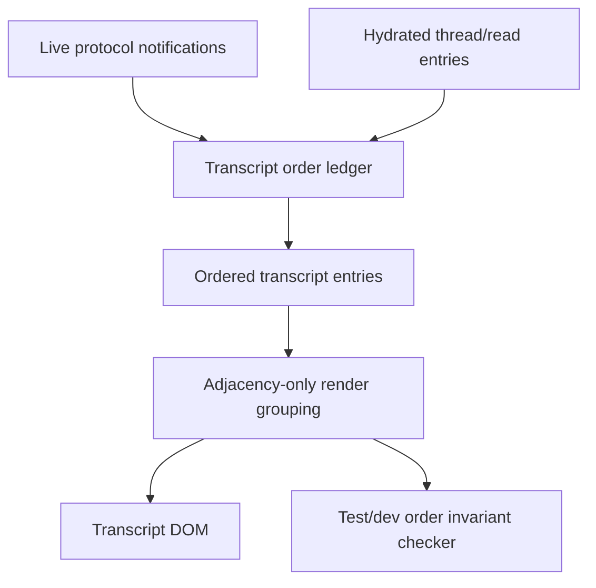
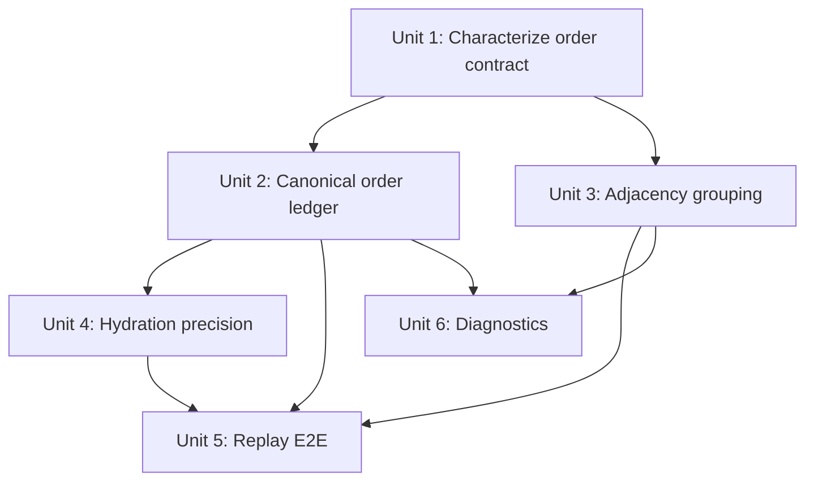

# Fix: Enforce Transcript Temporal Order Invariant

## Overview

The transcript must render in canonical temporal order at all times. Tool activity grouping, turn affinity, hydration, duplicate suppression, collapse state, and role styling are all subordinate to that invariant.

The failure captured for thread `019de585-735e-7aa0-82d7-469a6a32eb80` showed later tool groups rendered above earlier assistant messages. That means the renderer did not have one authoritative order for visible transcript entries. It allowed grouping and merge convenience to reassemble the transcript after the fact.

This plan makes transcript order explicit before rendering:

1. Normalize live and hydrated transcript entries into one ordered ledger.
2. Preserve precise observed live order when hydration provides only coarse turn timestamps.
3. Make work grouping adjacency-only, including active turn grouping.
4. Add unit and E2E invariants that fail on any visible out-of-order transcript item.
5. Add diagnostics that explain the exact item, order key, and grouping decision when the invariant breaks.

## Problem Frame

The transcript is the user-facing record of agent work. When a later tool group renders above an earlier assistant message, the app tells a false story even if every individual message is present. The May 2 failure happened because multiple subsystems had partial ordering authority:

- live session state tracked optimistic messages and activity entries
- hydrated `thread/read` entries carried coarse turn-level timestamps
- merge logic tried to reconcile entries after the fact
- render grouping collected work entries by turn affinity

That split means no layer could guarantee the visible transcript stayed in canonical event order. The fix is to make ordering a first-class invariant before grouping or rendering.

## Requirements Trace

| Requirement | Covered By |
| --- | --- |
| R1-R4 hard temporal ordering | Units 1, 2, 4, 6 |
| R5-R8 grouping only adjacent/bottom-contiguous work | Units 1, 3, 5, 6 |
| R9-R12 live and hydrated merge semantics | Units 2, 4 |
| R13-R17 unit, integration, E2E, and fixture coverage | Units 1, 3, 4, 5 |
| R18-R20 diagnostics and protocol order reporting | Unit 6 |
| R21-R23 durable edited-file diff retention and final change summary | Unit 2, Unit 4, follow-up test |
| R24 single active elapsed indicator | Unit 3, follow-up test |
| R25-R26 current-turn top-level edited-file summaries | Unit 3, Unit 4, follow-up test |

## Scope Boundaries

In scope:

- Renderer transcript ordering for live optimistic entries, hydrated `thread/read` entries, and merged sessions.
- Work group construction for active and completed turns.
- Replay-backed E2E coverage for the May 2 failure shape.
- Test/dev diagnostics that make ordering failures actionable.
- Extending existing protocol analysis utilities where useful.

Out of scope:

- Visual redesign of the transcript.
- Backend protocol changes unless implementation discovers an existing per-item sequence field that should be consumed.
- Broad transcript storage rewrites.
- Checking in raw `.local` protocol captures.
- Changing unrelated typing indicator, review card, or navigation behavior beyond what is necessary to preserve transcript order.

## Context And Research

### Origin Requirements

The requirements document is `docs/brainstorms/2026-05-02-transcript-temporal-order-invariant-requirements.md`.

Important evidence from the origin:

- Protocol capture `apps/desktop/.local/protocol-captures/2026-05-02T02-31-52-380Z-codex-full-access.jsonl` showed the protocol stream in the expected chronological order.
- The in-app transcript rendered later "Explored 4 items" and "Explored 8 items" tool groups above earlier assistant messages.
- The failure is unacceptable for demos because the transcript is the user's source of truth for what happened.

### Existing Plans And Patterns

- `docs/plans/2026-04-30-001-fix-live-transcript-ordering-plan.md` already moved toward session-owned live transcript state and fixed narrower live grouping issues. This plan builds on that work but tightens the invariant across live, hydrated, merged, and rendered states.
- `docs/plans/2026-04-18-003-fix-desktop-thread-refresh-model-plan.md` established `useThreadSessionState.ts` as the right owner for append-driven active thread state.
- `docs/plans/2026-04-18-001-feat-desktop-replay-harness-plan.md` established replay-backed desktop E2E fixtures as the right way to make protocol-driven UI regressions reproducible.

No durable `docs/solutions/` writeup exists yet for this class of failure.

### Relevant Code

- `apps/desktop/src/renderer/src/lib/useThreadSessionState.ts`
  - Owns session state, live optimistic entries, pending assistant messages, turn completion, hydration merge, and duplicate suppression.
  - `mergeTranscriptEntries(responseEntries, optimisticEntries)` currently merges hydrated response entries and live optimistic entries using timestamps, terminal same-turn entries, and append fallback. It does not use one canonical order ledger.
  - `upsertLiveActivityEntry` assigns live activity timestamps and sequences, but that precision is not carried through a durable visible-order contract.
  - `turn/completed` moves optimistic messages into response entries while retaining some non-message optimistic entries, which is a high-risk point for reshuffling.

- `apps/desktop/src/renderer/src/features/thread-detail/transcript-render-items.ts`
  - Builds render items and work groups.
  - Completed groups are mostly adjacency-aware because they scan contiguous entries.
  - Active work grouping currently selects all work-phase entries for the active turn, which can group non-contiguous activity above intervening text.

- `apps/desktop/src/main/codex-app-server/client.ts`
  - `extractThreadEntries` preserves `thread/read` item order, but assigns a turn-level timestamp to each extracted entry when item-level timing is absent.
  - That timestamp is useful as a fallback but must not be treated as precise enough to reorder live-observed entries.

- `apps/desktop/e2e/transcript-activity-order.spec.ts`
  - Covers persisted activity order for a narrow fixture.
  - Does not cover the May 2 live-plus-hydration failure shape or collapsed/expanded DOM order after refresh churn.

### External Research

Skipped. This is a local transcript state and rendering invariant with sufficient project-specific evidence, existing plans, and code patterns. External UI ordering guidance would not change the implementation shape.

## Key Decisions

### 1. Canonical order belongs in the renderer session ledger first

Start with a renderer-owned order ledger in or near `useThreadSessionState.ts`, because this bug is caused by visible live/hydrated merge behavior. Do not promote a new shared API contract until implementation proves it is necessary.

The ledger should assign or derive an order key for every visible transcript entry and keep that key stable across hydration, duplicate suppression, and turn completion.

### 2. Observed live order outranks coarse hydrated timestamps

Hydrated `thread/read` entries often have only turn-level timestamps. Those timestamps must not override live-observed order. If a live entry has an observed sequence, hydration can update content for the same logical entry but cannot move it ahead of an earlier observed visible item.

### 3. Persisted array order remains meaningful

For hydrated entries without item-level time or sequence, preserve the order returned by `thread/read`. If the app-server later exposes per-item protocol order, consume it as a stronger order source. Until then, array position is safer than pretending every same-turn item happened at the same turn timestamp.

### 4. Grouping is a rendering transform, not an ordering authority

Grouping code may collapse adjacent work entries into one render item. It may not search backward, collect same-turn entries across intervening text, or update an older group because a new tool event belongs to the same turn.

### 5. Tests fail hard; production diagnostics stay non-fatal initially

Unit tests and E2Es should fail on the first out-of-order visible item. Development diagnostics should log structured order violations. Production should not crash the transcript during a demo because the diagnostic itself should not become a user-visible outage.

### 6. Entry identity matching must be conservative

Hydration may not always provide a stable one-to-one identity for a live optimistic entry. If the implementation cannot prove two entries are the same logical transcript item, it should not merge them in a way that moves either entry. Keep both entries in canonical order and let duplicate diagnostics expose the ambiguity rather than silently rewriting history.

## High-Level Design

This illustrates the intended approach and is directional guidance for review, not implementation specification. The implementing agent should treat it as context, not code to reproduce.

Every visible entry should carry enough internal metadata to answer:

- What logical entry is this?
- What source produced or refreshed it?
- What was the strongest known order signal?
- Did this entry replace or suppress another entry?
- What render group, if any, contains it?

Suggested order signal precedence:

| Signal | Meaning | Strength |
| --- | --- | --- |
| Live observed sequence | Monotonic order assigned when protocol activity/message is observed by the active session | Strongest |
| Existing ledger key for same logical entry | Hydration or duplicate merge refreshes content without moving the entry | Strong |
| Persisted per-item sequence or timestamp | Protocol-provided item order, if available in `thread/read` | Strong |
| Hydrated array index within turn/session | Stable order from persisted transcript extraction | Medium |
| Turn-level timestamp plus source index | Coarse fallback only | Weak |
| Final append index | Last-resort deterministic fallback | Weakest |

Grouping consumes already ordered entries. It never creates a new order. A group render item takes the order key of its first contained entry and may only contain entries that are contiguous in the ordered list.

When identity is ambiguous, order preservation wins over deduplication. It is better to briefly show two adjacent representations of the same work than to move one representation above text that was already visible to the user.

## Implementation Units

### Unit Dependencies

- [x] **Unit 1: Characterize the failure and order contract**

**Goal:** Add focused tests that describe the invariant before changing core behavior.

**Requirements:** R1-R8, R13-R14.

**Dependencies:** None.

**Files:**

- Modify: `apps/desktop/src/renderer/src/lib/__tests__/useThreadSessionState.test.tsx`
- Modify: `apps/desktop/src/renderer/src/features/thread-detail/__tests__/transcript-render-items.test.ts`

**Approach:**

- Write characterization tests before changing ordering logic.
- Test the exact risk shape: interleaved assistant text and tool activity in one turn, then a later hydration update with weaker timestamp precision.
- Add small assertion helpers that report visible labels and order keys when an ordering assertion fails.

**Execution note:** Characterization-first. The first tests should fail against the current implementation for the active grouping and mixed live/hydration failure class.

**Patterns to follow:**

- Existing focused renderer tests in `apps/desktop/src/renderer/src/features/thread-detail/__tests__/transcript-render-items.test.ts`.
- Existing session hook tests in `apps/desktop/src/renderer/src/lib/__tests__/useThreadSessionState.test.tsx`.

**Test scenarios:**

- Happy path: live entries arrive as assistant message A, tool activity B, assistant message C, tool activity D; rendered labels stay A, B, C, D.
- Edge case: entries have equal or missing timestamps; stable observed sequence still determines visible order.
- Integration: hydration refresh returns same-turn entries with coarse timestamps after live observations; visible order does not change.
- Error path: a deliberately out-of-order rendered list fails with a message naming the first offending item.

**Verification:**

- The tests describe the May 2 failure class without relying on brittle full snapshots.
- The tests prove timestamp equality is not enough to reorder visible transcript entries.

- [x] **Unit 2: Introduce a canonical transcript order ledger**

**Goal:** Make `useThreadSessionState.ts` produce one ordered transcript entry list for both live and hydrated data.

**Requirements:** R1-R4, R9-R12, R16-R17.

**Dependencies:** Unit 1.

**Files:**

- Modify: `apps/desktop/src/renderer/src/lib/useThreadSessionState.ts`
- Modify: `apps/desktop/src/renderer/src/lib/__tests__/useThreadSessionState.test.tsx`
- Create, if it keeps the hook readable: `apps/desktop/src/renderer/src/lib/transcript-order.ts`

**Approach:**

- Add renderer-local order metadata for visible transcript entries.
- Assign monotonic observed order when live protocol messages, activity, plans, and review entries are created.
- Preserve an existing ledger order when hydration updates the same logical entry.
- Treat hydrated response order as a stable fallback order, not as permission to reorder live-observed entries.
- Make duplicate suppression preserve the survivor's canonical order.
- Keep ambiguous live/hydrated identity matches as separate ordered entries until a stable identity proves they are the same logical item.
- Make turn completion retain relative order for promoted assistant messages and retained activity entries.

**Patterns to follow:**

- Existing session-owned state pattern in `apps/desktop/src/renderer/src/lib/useThreadSessionState.ts`.
- Prior live transcript direction in `docs/plans/2026-04-30-001-fix-live-transcript-ordering-plan.md`.

**Test scenarios:**

- Happy path: live-only assistant and activity entries sort by observed ledger order.
- Happy path: hydrated-only entries sort by persisted extraction order.
- Integration: mixed live and hydrated entries keep live-observed order while accepting refreshed content.
- Edge case: duplicate message IDs or duplicate message content suppress to one visible item without changing that survivor's order.
- Edge case: ambiguous live and hydrated entries remain in canonical order instead of merging backward across visible text.
- Edge case: `turn/completed` promotes pending assistant messages and retains activity entries without changing their relative order.
- Error path: a hydration refresh with a weaker order signal attempts to move an entry above an earlier observed item; the merge keeps the original order and diagnostics can report the conflict.

**Verification:**

- `mergeTranscriptEntries` or its replacement sorts by canonical order, not by incidental branch order.
- Hydration can update content and completion metadata without moving an entry above an earlier visible item.

- [x] **Unit 3: Make work grouping strictly adjacency-preserving**

**Goal:** Ensure render grouping cannot violate transcript order.

**Requirements:** R5-R8, R13-R15.

**Dependencies:** Unit 1.

**Files:**

- Modify: `apps/desktop/src/renderer/src/features/thread-detail/transcript-render-items.ts`
- Modify: `apps/desktop/src/renderer/src/features/thread-detail/__tests__/transcript-render-items.test.ts`

**Approach:**

- Replace active-turn work grouping that filters all same-turn work entries with an ordered scan that only groups contiguous work entries.
- Keep completed-group scanning adjacency-based and add tests that lock this behavior down.
- Ensure a later same-turn tool activity after assistant text becomes a new work group at that later position.
- Ensure a group render item inherits the order key or order position of its first member.

**Patterns to follow:**

- Existing completed-group scan behavior in `apps/desktop/src/renderer/src/features/thread-detail/transcript-render-items.ts`.
- Existing duplicate/group regression tests in `apps/desktop/src/renderer/src/features/thread-detail/__tests__/transcript-render-items.test.ts`.

**Test scenarios:**

- Happy path: adjacent activity entries for the same turn collapse into one work group at the first activity's position.
- Edge case: activity, assistant text, later activity for the same active turn renders as group, text, later group.
- Edge case: completed turn grouping follows the same contiguity rule as active turn grouping.
- Integration: collapsed and expanded group representations expose the same chronological member order.

**Verification:**

- No render path collects non-contiguous entries into a group.
- Collapsing and expanding a group does not change visible order.

- [x] **Unit 4: Preserve hydration precision and persisted item order**

**Goal:** Stop persisted refreshes from erasing stronger ordering information.

**Requirements:** R9-R12, R16-R17.

**Dependencies:** Unit 2.

**Files:**

- Modify: `apps/desktop/src/main/codex-app-server/client.ts`
- Modify: `apps/desktop/src/main/__tests__/codex-client.test.ts`
- Modify: `apps/desktop/src/renderer/src/lib/useThreadSessionState.ts`
- Modify: `apps/desktop/src/renderer/src/lib/__tests__/useThreadSessionState.test.tsx`

**Approach:**

- Audit `extractThreadEntries` for any available item-level timestamp, sequence, or array position that should be exposed or consumed.
- Preserve `thread/read` item order explicitly when all same-turn entries share one turn timestamp.
- If adding metadata to normalized entries is necessary, keep it optional and backend-agnostic.
- Keep turn-level timestamps as weak fallback order signals.
- Add mixed tests where live sequence has higher precision than refreshed `thread/read` entries.

**Patterns to follow:**

- Existing `extractThreadEntries` item-order preservation in `apps/desktop/src/main/codex-app-server/client.ts`.
- Existing `codex-client` tests that verify protocol `thread/read` activity groups remain at captured item positions.

**Test scenarios:**

- Happy path: `thread/read` returns interleaved activity and assistant messages with identical turn timestamps; extracted order matches item order.
- Edge case: item-level sequence or timestamp exists for some entries but not all; stronger item-level signals are used only where available and fallback order remains deterministic.
- Integration: renderer receives a refreshed `thread/read` response after live observations; refreshed content is accepted without reshuffling visible entries.
- Error path: duplicate persisted keys or ambiguous same-turn entries produce diagnostics with enough context to debug the ordering source.

**Verification:**

- App-server extraction preserves same-turn item order even when timestamps are identical.
- Renderer hydration does not regress from live-observed order to coarser persisted timestamp order.
- Grok and Codex transcript providers can continue using the same normalized transcript shape.

- [x] **Unit 5: Add replay E2E for the May 2 failure shape**

**Goal:** Make the actual failure shape impossible to reintroduce unnoticed.

**Requirements:** R15-R17.

**Dependencies:** Units 2, 3, and 4.

**Files:**

- Create: `apps/desktop/e2e/transcript-temporal-order.spec.ts`
- Create: `apps/desktop/e2e/fixtures/transcript-temporal-order/replay.fixture.json`
- Create, if fixture explanation is useful: `apps/desktop/e2e/fixtures/transcript-temporal-order/README.md`

**Approach:**

- Derive a small replay fixture from the May 2 capture shape rather than checking in the raw `.local` capture.
- Include interleaved assistant text and tool activity matching the observed class of failure:
  - assistant message
  - later tool activity group
  - assistant message
  - later tool activity group
  - assistant message
- Include a refresh or hydration step with coarser persisted ordering data.
- Assert visible DOM order before and after group collapse/expand.
- Assert that refreshing or reselecting the thread does not move tool groups above earlier assistant messages.

**Patterns to follow:**

- Existing replay fixture structure in `apps/desktop/e2e/fixtures/transcript-activity-order/replay.fixture.json`.
- Existing replay-backed assertions in `apps/desktop/e2e/transcript-activity-order.spec.ts`.
- Fixture seeding guidance in `.agents/skills/desktop-e2e-fixture-seeding/SKILL.md` if a refreshed fixture is generated from local capture data.

**Test scenarios:**

- Happy path: visible transcript order is assistant message, tool group, assistant message, tool group, assistant message.
- Edge case: collapsed work groups retain their chronological position relative to surrounding assistant messages.
- Edge case: expanded work groups reveal member rows in the same canonical order as the group summary.
- Integration: thread refresh or reselect after the replayed live events does not move either tool group upward.

**Verification:**

- The E2E fails if any visible transcript item appears above an earlier canonical item.
- The fixture is minimal, sanitized, and documents which capture/thread inspired it.

- [x] **Unit 6: Add diagnostics and protocol order reporting**

**Goal:** Make future ordering regressions easy to diagnose from tests, local demos, and protocol captures.

**Requirements:** R18-R20.

**Dependencies:** Units 2 and 3.

**Files:**

- Modify: `apps/desktop/src/renderer/src/features/thread-detail/transcript-render-items.ts`
- Create, if a helper boundary is cleaner: `apps/desktop/src/renderer/src/features/thread-detail/transcript-order-diagnostics.ts`
- Modify: `apps/desktop/scripts/analyze-codex-thread-protocol.ts`
- Modify: `apps/desktop/src/main/testing/codex-thread-protocol-analysis.ts`
- Test: `apps/desktop/src/renderer/src/features/thread-detail/__tests__/transcript-render-items.test.ts`
- Test: `apps/desktop/src/main/__tests__/codex-thread-protocol-analysis.test.ts`

**Approach:**

- Add a test/dev invariant checker for render items that reports render item id, entry ids, turn ids, order keys, source order signal, group id, and member order.
- Fail tests on the first violation.
- Log non-fatal structured diagnostics in development builds.
- Extend the existing protocol analysis utility to print a chronological outline for a thread/turn, including message and tool activity order.
- Include duplicate key diagnostics because duplicate suppression can mask ordering bugs.

**Patterns to follow:**

- Existing protocol analyzer boundaries in `apps/desktop/scripts/analyze-codex-thread-protocol.ts` and `apps/desktop/src/main/testing/codex-thread-protocol-analysis.ts`.
- Existing render-item construction in `apps/desktop/src/renderer/src/features/thread-detail/transcript-render-items.ts`.

**Test scenarios:**

- Happy path: a correctly ordered render list passes the invariant checker without logging an error.
- Error path: a synthetic out-of-order render list fails with the first offending item and the previous item it moved above.
- Error path: a non-contiguous group fails with member order details.
- Integration: protocol analysis summarizes the ordering evidence for thread `019de585-735e-7aa0-82d7-469a6a32eb80` from a repo-local capture when available.

**Verification:**

- Diagnostics identify the exact item and order key that violated the invariant.
- Diagnostics are gated so normal production rendering does not crash.
- Protocol order reports provide enough evidence to compare source order with rendered order.

## Test Strategy

Unit tests:

- `useThreadSessionState` live sequence tests for interleaved messages and tool activity.
- `useThreadSessionState` hydration tests for same-turn coarse timestamps.
- `useThreadSessionState` duplicate suppression and turn completion order tests.
- `transcript-render-items` grouping tests for active and completed turns.
- `codex-client` extraction tests for same-turn persisted item order.

E2E tests:

- Replay fixture for the May 2 failure shape.
- DOM order assertion over visible transcript items.
- Collapsed and expanded group assertion.
- Refresh/reselect assertion that hydration does not reshuffle visible items.

Manual verification:

- Run the desktop app against the relevant captured thread when local data is available.
- Use protocol analysis output to compare source event order with rendered order.

Implementation verification should include the desktop unit suite for the touched renderer/main code and the replay-backed desktop E2Es covering transcript temporal order and existing transcript activity order.

## System Impact

### State Lifecycle

The highest-risk lifecycle events are:

- first live assistant message for a turn
- first live tool activity for a turn
- additional tool activity after assistant text
- `thread/read` refresh while a turn is active
- `turn/completed`
- duplicate suppression after hydration
- thread reselect or navigation refresh

Each event must update content without changing the canonical order of existing visible entries unless the existing entry had only weaker fallback order and no user-visible position has been established.

### UI And Interaction

The transcript should look the same except that ordering is correct. Collapsed groups still collapse, expanded groups still reveal members, and scroll behavior should not jump because a historical group was rewritten.

### Provider Compatibility

The order helper should operate on normalized transcript entries and not Codex-only protocol assumptions. Codex-specific analysis belongs in the Codex protocol analyzer, not in the renderer invariant.

### Performance

The ledger and invariant checks should be linear in visible transcript entries. Avoid repeated full scans inside per-entry render loops. Development diagnostics can be more verbose than production.

## Risks And Mitigations

| Risk | Mitigation |
| --- | --- |
| Order metadata spreads through shared types unnecessarily | Keep metadata renderer-local first; add optional normalized fields only if app-server extraction needs them. |
| Hydrated timestamps still look authoritative | Treat turn-level timestamps as weak fallback and test identical timestamp cases. |
| Active grouping keeps collecting non-contiguous entries | Replace filter-based active grouping with scan-based grouping and add regression tests. |
| Duplicate suppression hides the wrong entry | Preserve survivor order explicitly and log duplicate diagnostics in tests/dev. |
| Replay fixture is too large or sensitive | Check in a minimized synthetic fixture derived from the observed shape, not the raw capture. |
| Diagnostics become noisy in production | Hard-fail tests, log in development, keep production non-fatal. |
| Pagination or older history prepend interacts with order keys | Include deterministic fallback order and add tests if implementation touches pagination/prepending. |

## Alternative Approaches Considered

- **Fix only active grouping:** Rejected because it would address one visible symptom but not hydration, duplicate suppression, or turn completion reshuffling.
- **Trust timestamps globally:** Rejected because hydrated entries can share one turn-level timestamp, which is the root of the precision gap.
- **Push a backend protocol change first:** Deferred because the renderer can enforce a visible invariant now using observed sequence and persisted array order. Backend per-item sequence can be adopted later if available.
- **Crash production on invariant violation:** Rejected for initial rollout because the diagnostic should not create a demo outage. Tests and E2Es still fail hard.

## Documentation / Operational Notes

- If the implementation introduces a reusable transcript ordering helper, document the invariant in a nearby module comment or test helper name rather than a user-facing UI string.
- If the replay fixture is derived from a live capture, document the source thread id and sanitized event shape in the fixture README, not in checked-in raw logs.
- A follow-up `docs/solutions/` writeup is warranted after implementation if this becomes the durable pattern for transcript ordering.

## Open Questions

Resolved during planning:

- **Where should canonical order live first?** In the renderer session ledger, because the bug is in visible live/hydrated merging and grouping.
- **Should the May 2 capture be checked in?** No. Use it as local evidence and check in a minimized replay fixture.
- **Should diagnostics hard-crash production?** No. Tests and E2Es fail hard; production diagnostics stay non-fatal initially.

Deferred to implementation:

- The exact internal field names for order metadata.
- Whether `thread/read` exposes a useful per-item sequence that `extractThreadEntries` can consume.
- Whether order diagnostics should live beside session state or render item construction after the helper boundary is clearer.

## Definition Of Done

- All transcript render paths consume entries sorted by canonical order.
- Active and completed work grouping is adjacency-only.
- Hydration cannot move a live-observed entry above an earlier visible entry.
- Duplicate suppression and turn completion preserve relative visible order.
- Unit tests fail on out-of-order entries, non-contiguous grouping, and coarse hydration timestamp regressions.
- A replay-backed E2E covers the May 2 failure shape and collapsed/expanded group DOM order.
- Diagnostics identify the exact item and order key that violated the invariant.
- Existing transcript activity order E2E remains passing.

## Sources & References

- Origin document: `docs/brainstorms/2026-05-02-transcript-temporal-order-invariant-requirements.md`
- Prior related plan: `docs/plans/2026-04-30-001-fix-live-transcript-ordering-plan.md`
- Thread refresh plan: `docs/plans/2026-04-18-003-fix-desktop-thread-refresh-model-plan.md`
- Replay harness plan: `docs/plans/2026-04-18-001-feat-desktop-replay-harness-plan.md`
- Desktop app guidance: `apps/desktop/AGENTS.md`
- Session state owner: `apps/desktop/src/renderer/src/lib/useThreadSessionState.ts`
- Render grouping: `apps/desktop/src/renderer/src/features/thread-detail/transcript-render-items.ts`
- Codex transcript extraction: `apps/desktop/src/main/codex-app-server/client.ts`
- Existing replay E2E: `apps/desktop/e2e/transcript-activity-order.spec.ts`
