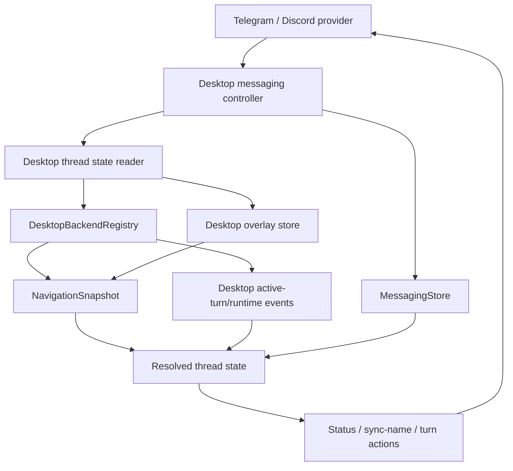
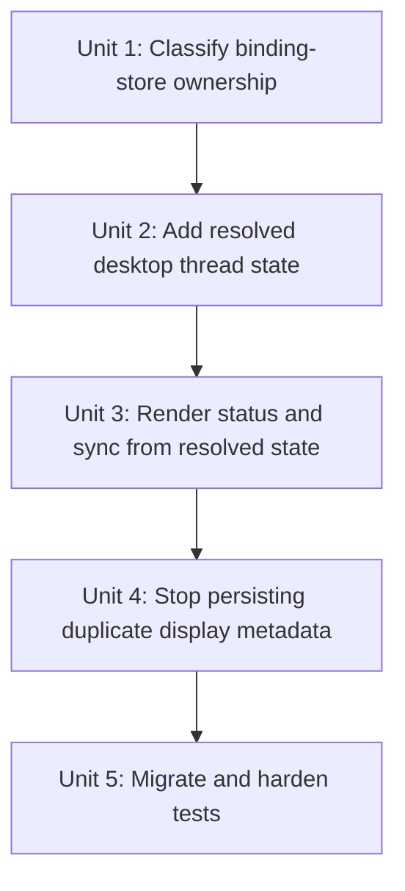

# refactor: Use live desktop thread state for messaging bindings

## Overview

Refactor the messaging binding cache so it stores only messaging-owned routing, authorization, delivery, callback, and preference data. Thread facts shown in messaging surfaces, including thread name, local/worktree identity, working directory, branch state, model, reasoning, permissions, and active turn details, should be read from a desktop-owned thread state projection at render/action time.

The immediate bug is that `/status` can show a stale thread name because `MessagingBindingRecord.threadDisplay.threadTitle` overrides the current `NavigationThreadSummary.title`. The broader fix is to stop treating binding records as a second thread metadata store.

## Problem Frame

The desktop renderer shows renamed threads from the desktop navigation state. Messaging `/status` also fetches navigation state through `DesktopMessagingBackendBridge.getNavigationSnapshot()`, but the current status card prefers persisted binding metadata:

- `apps/desktop/src/main/messaging/core/messaging-status-card.ts` renders `threadDisplay.threadTitle` before `thread.title`.
- `apps/desktop/src/main/messaging/core/messaging-controller.ts` writes `threadDisplay` during browse binding, new-thread binding, and sync-name confirmation.
- `apps/desktop/src/main/messaging/core/messaging-store.ts` persists those values in `messaging-state.json`.

That makes the messaging store an accidental duplicate of desktop thread state. The binding store should identify which platform conversation is bound to which PwrAgent thread, not remember what that PwrAgent thread looked like when the binding was created.

## Requirements Trace

- R1-R6. Preserve channel-agnostic messaging contracts and opaque adapter state, while keeping workflow state distinct from platform payloads.
- R7-R12. Keep binding, detach, restart recovery, and free-form routing working with a minimal binding record.
- R13-R17. Keep `/status`, `/resume`, and rich controls accurate for Telegram and Discord by rendering from the same desktop state used by the app UI.
- R23-R27. Keep provider packages isolated; provider adapters should not learn desktop thread semantics.
- R31-R36. Preserve authorization, callback scoping, revocation, redaction, and audit behavior while reducing duplicated persistent state.

## Scope Boundaries

- In scope: binding-store field audit, live desktop thread state read model, `/status` rendering, sync-name title source, binding metadata writes, migrations, and regression tests.
- In scope: deciding which state belongs in `messaging-state.json` versus desktop navigation/backend state.
- In scope: preserving existing Telegram and Discord provider behavior behind the current adapter interface.
- Out of scope: changing the renderer thread UI, renaming UX, provider SDK choices, hosted bot infrastructure, webhook transport, or a settings screen.
- Out of scope: adding new status fields that desktop state cannot currently provide, except for a small desktop-owned active-turn projection if needed to remove duplicated turn state from bindings.

## Context & Research

### Relevant Code and Patterns

- `apps/desktop/src/main/messaging/desktop-backend-bridge.ts` already mirrors the renderer path by using `DesktopBackendRegistry.listThreads()`, `getDesktopOverlayStore().reconcileNavigationSnapshot()`, and `readDirectoryStatuses()`.
- `apps/desktop/src/main/ipc/app-server.ts` exposes the same navigation snapshot shape to the renderer through `getNavigationSnapshot()`.
- `packages/agent-core/src/domain/navigation-state.ts` materializes thread title, linked directories, execution mode, model, reasoning, fast mode, branch metadata, worktree snapshots, inbox state, and launchpad defaults.
- `packages/shared/src/contracts/navigation.ts` defines `NavigationThreadSummary` and `NavigationDirectorySummary`, which are the desktop thread browsing source shared by renderer and messaging.
- `apps/desktop/src/renderer/src/lib/useThreadNavigation.ts` reads navigation snapshots for the sidebar and applies optimistic rename state before refreshing through the desktop bridge.
- `apps/desktop/src/main/messaging/core/messaging-status-card.ts` currently renders from both `MessagingBindingRecord.threadDisplay` and `NavigationSnapshot`.
- `apps/desktop/src/main/messaging/core/messaging-controller.ts` currently persists display metadata in `threadDisplay` and stores `activeTurn` on the binding.
- `apps/desktop/src/main/messaging/core/messaging-store.ts` is correctly shaped for messaging-owned state: bindings, browse sessions, callback handles, pending intents, deliveries, redaction, and restart-safe callback lookup.
- `packages/messaging/AGENTS.md` requires provider packages to stay channel-focused and isolated from desktop, agent-core, and sibling providers.

### Institutional Learnings

- `docs/plans/2026-04-30-003-refactor-desktop-hosted-messaging-plan.md` superseded the earlier agent-core ownership direction: desktop owns messaging orchestration and uses `DesktopBackendRegistry` as the state/operation boundary.
- `docs/plans/2026-04-30-002-feat-messaging-command-surfaces-plan.md` introduced managed status surfaces and binding preferences, but its `last known thread display metadata` should now be narrowed to fallback-only migration data or removed.
- No `docs/solutions/` directory exists in this worktree, so there are no durable solution notes for this specific state-duplication class.

### External References

- External research is not needed for this plan. The issue is internal state ownership and contract shape, and the repo already has strong local patterns for navigation state, overlay state, messaging store persistence, and provider boundaries.

## Key Technical Decisions

- **Messaging bindings are identity and routing records, not thread snapshots.** Keep channel ref, backend, thread id, actor authorization, provider routing state, surfaces, callbacks, pending intents, deliveries, and messaging preferences. Do not persist thread name, project label, directory path, worktree path, branch name, model, reasoning, permissions, or active turn as authoritative thread display data.
- **Render messaging status from a desktop-owned read model.** The status card should receive a resolved thread state built from `NavigationSnapshot` and any desktop-owned active-turn projection. Binding metadata is fallback-only when the thread cannot be found.
- **Use navigation state as the shared source for desktop facts already present there.** Thread name, linked directories, local/worktree mode, directory path, branch, execution mode, model, reasoning, fast mode, worktree snapshots, and launchpad defaults should come from the same navigation path the renderer uses.
- **Treat active turn state as desktop runtime state, not binding display state.** If messaging still needs a cached active turn for typing/stop behavior, hide that behind a desktop-owned thread activity projection or a clearly named transient runtime cache, not `threadDisplay`.
- **Keep preferences separate from current thread state.** `MessagingBindingPreferences` can remain the user's messaging-side requested defaults or pending settings, but live thread fields win whenever the desktop state has a value.
- **Make sync-name use the resolved desktop title.** The sync action should read the current thread title from the desktop thread state projection and should not write that title back into `threadDisplay`.
- **Provider packages stay unchanged unless the generic contract changes.** Telegram and Discord should continue receiving semantic intents; they should not import navigation, renderer, registry, or desktop state modules.

## Open Questions

### Resolved During Planning

- **Should `/status` prefer persisted binding display metadata or live navigation state?** Live navigation state. Persisted display metadata caused the stale name bug and should be fallback-only during migration.
- **Should providers fetch desktop state directly?** No. Providers render intents and own platform transport. Desktop messaging orchestration resolves thread state before creating intents.
- **Should the messaging store keep provider routing and surface state?** Yes. That is messaging-owned restart state and remains necessary for updates, pins, callbacks, and delivery fallback.
- **Should this change remove binding preferences?** No. Preferences are user-requested messaging settings and launch defaults. They must not override confirmed live thread state when a thread record is available.

### Deferred to Implementation

- Whether to remove `threadDisplay` entirely in one change or keep it as a deprecated migration fallback for one store version.
- Whether active turn state can be read directly from an existing desktop runtime store or needs a small new desktop-owned activity snapshot in `DesktopMessagingBackendBridge`.
- The exact label format for local/worktree and branch lines after the resolver exposes all current desktop fields.

## High-Level Technical Design

> *This illustrates the intended approach and is directional guidance for review, not implementation specification. The implementing agent should treat it as context, not code to reproduce.*

The binding store remains necessary, but its authority is limited:

| State category | Source of truth | Messaging-store role |
| --- | --- | --- |
| Channel conversation, actor authorization, provider routing state | Messaging store/provider adapter | Authoritative |
| Managed status surface, pinned surface, callback handles, deliveries | Messaging store/provider adapter | Authoritative |
| Thread id and backend id for a binding | Messaging store | Authoritative binding identity |
| Thread title, linked directories, worktree/local state, branch, model, reasoning, permissions | Desktop navigation/backend state | Read-only consumer |
| Active turn id/status | Desktop runtime activity projection | Read-only consumer, with transient fallback only if required |
| Messaging preferences | Messaging store | User-requested defaults; live desktop state wins |

## Implementation Units

- [x] **Unit 1: Classify binding-store ownership**

**Goal:** Make the allowed contents of `MessagingBindingRecord` explicit so future changes do not reintroduce desktop thread metadata into the binding cache.

**Requirements:** R1-R6, R7-R12, R31-R36

**Dependencies:** None

**Files:**
- Modify: `packages/shared/src/contracts/messaging.ts`
- Modify: `packages/messaging/interface/src/index.ts`
- Modify: `apps/desktop/src/main/messaging/core/messaging-migrations.ts`
- Test: `packages/messaging/interface/src/__tests__/messaging-contract.test.ts`
- Test: `apps/desktop/src/main/__tests__/messaging-store.test.ts`

**Approach:**
- Document or encode the boundary between messaging-owned state and desktop-owned thread state.
- Deprecate `MessagingThreadDisplaySummary` as authoritative state. If retained, name it as migration/fallback metadata and keep renderers from preferring it over live desktop state.
- Keep `routingState`, `statusSurface`, `pinnedStatusSurface`, `preferences`, authorization, and callback-related data in the messaging store.
- Keep provider-specific routing data opaque; do not move Telegram/Discord IDs into desktop thread state.

**Patterns to follow:**
- `apps/desktop/src/main/messaging/core/messaging-store.ts`
- `apps/desktop/src/main/messaging/core/messaging-migrations.ts`
- `packages/messaging/AGENTS.md`

**Test scenarios:**
- Happy path: a binding record with only channel, backend, thread id, authorization, routing state, surfaces, and preferences remains valid after migration.
- Edge case: an existing binding containing `threadDisplay.threadTitle` migrates without becoming the preferred source for status rendering.
- Regression: provider-facing interface types still compile without importing desktop or agent-core modules.
- Error path: secret-like keys in provider opaque state are still redacted during persistence.

**Verification:**
- A reviewer can tell from the contracts and tests which binding fields are authoritative and which desktop fields must be resolved elsewhere.

- [x] **Unit 2: Add a resolved desktop thread state reader**

**Goal:** Provide a single desktop-owned read model for messaging workflows that need current thread facts.

**Requirements:** R7-R17, R31-R36

**Dependencies:** Unit 1

**Files:**
- Create: `apps/desktop/src/main/messaging/core/messaging-thread-state.ts`
- Modify: `apps/desktop/src/main/messaging/core/messaging-adapter.ts`
- Modify: `apps/desktop/src/main/messaging/desktop-backend-bridge.ts`
- Test: `apps/desktop/src/main/__tests__/messaging-thread-state.test.ts`
- Test: `apps/desktop/src/main/__tests__/messaging-controller.test.ts`

**Approach:**
- Resolve a binding into a current thread state object using `backend`, `threadId`, `NavigationSnapshot.threads`, and `NavigationSnapshot.directories`.
- Include current title, title source, primary project label, primary directory path, local/worktree identity, worktree path, git branch, observed branch, model, reasoning, service tier, fast mode, execution mode, and launchpad defaults where available.
- Include active turn state from a desktop-owned runtime source. Prefer an existing registry/event-derived source if present; otherwise add a narrow bridge-owned activity tracker fed by the same backend events messaging already receives.
- Return explicit missing-thread state when the thread is not found so `/status` can say the binding is stale without inventing a title from the old cache.
- Keep the reader inside desktop messaging/core or the desktop bridge; do not add provider dependencies.

**Patterns to follow:**
- `apps/desktop/src/main/messaging/desktop-backend-bridge.ts`
- `apps/desktop/src/main/ipc/app-server.ts`
- `packages/agent-core/src/domain/navigation-state.ts`
- `apps/desktop/src/renderer/src/lib/useThreadNavigation.ts`

**Test scenarios:**
- Happy path: resolving a binding returns the title and linked directory from a navigation snapshot.
- Happy path: resolving a worktree thread returns worktree path and branch fields from `NavigationThreadSummary`.
- Happy path: live execution mode/model/reasoning/fast mode from the navigation thread wins over stale binding preferences.
- Edge case: a binding whose thread is absent returns a missing state with backend/thread id and no stale display title.
- Integration: a backend turn lifecycle event updates the active-turn projection used by status rendering.

**Verification:**
- Messaging workflows have one helper to ask "what does the desktop currently know about this bound thread?" without reading display fields from the binding record.

- [x] **Unit 3: Render status and sync-name from resolved state**

**Goal:** Make `/status`, status button updates, and "Sync name" use current desktop state rather than cached binding display metadata.

**Requirements:** R13-R17, R23-R27, R31-R36

**Dependencies:** Unit 2

**Files:**
- Modify: `apps/desktop/src/main/messaging/core/messaging-status-card.ts`
- Modify: `apps/desktop/src/main/messaging/core/messaging-controller.ts`
- Test: `apps/desktop/src/main/__tests__/messaging-status-card.test.ts`
- Test: `apps/desktop/src/main/__tests__/messaging-controller.test.ts`

**Approach:**
- Change status intent building to accept resolved thread state, not raw binding plus optional navigation.
- Render title, project, directory, worktree, branch, model, reasoning, fast mode, permissions, and turn lines from resolved desktop state.
- Use binding preferences only when live thread state is absent or when rendering a requested setting that has not yet been confirmed by desktop state.
- Make `status:sync-name` read `resolvedThread.title` and never write the synced name into binding display metadata.
- Preserve status surface update/pin behavior and the existing channel-neutral action list.
- When the thread cannot be resolved, render a clear stale-binding status with backend/thread id and controls for refresh/detach; do not use an old title as if it were current.

**Patterns to follow:**
- `apps/desktop/src/main/messaging/core/messaging-status-card.ts`
- `apps/desktop/src/main/messaging/core/messaging-controller.ts`
- `apps/desktop/src/main/__tests__/messaging-status-card.test.ts`

**Test scenarios:**
- Happy path: `/status` displays a renamed thread title from the navigation snapshot even when the binding has an older fallback title.
- Happy path: `/status` displays local/worktree directory and branch data from `NavigationThreadSummary`.
- Happy path: `status:sync-name` sends the current desktop thread title to the provider.
- Edge case: if navigation cannot find the bound thread, `/status` shows the thread id and stale-binding context without using `threadDisplay.threadTitle`.
- Regression: pinned Telegram/Discord status surfaces still update existing managed messages when the adapter returns an updateable surface.
- Regression: live permissions from the desktop thread continue to beat stale binding preferences.

**Verification:**
- Re-running `/status` after a desktop thread rename shows the new desktop title without rebinding or pressing Sync name.

- [x] **Unit 4: Stop persisting duplicate display metadata during binding flows**

**Goal:** Remove writes that refresh or create duplicate thread display state in `messaging-state.json`.

**Requirements:** R7-R12, R13-R17, R31-R36

**Dependencies:** Unit 3

**Files:**
- Modify: `apps/desktop/src/main/messaging/core/messaging-controller.ts`
- Modify: `apps/desktop/src/main/messaging/core/messaging-resume-browser.ts`
- Test: `apps/desktop/src/main/__tests__/messaging-controller.test.ts`
- Test: `apps/desktop/src/main/__tests__/messaging-resume-browser.test.ts`

**Approach:**
- Update thread binding and new-thread binding paths so they persist binding identity, route state, actor authorization, surfaces, and preferences only.
- Remove or quarantine `applyBrowseBindingMetadata()` so it no longer writes thread title, project label, directory path, or worktree path into the binding as current state.
- Keep `/resume` pickers using navigation snapshots directly; picker labels can still render thread/project names because picker intent data is ephemeral and regenerated from desktop state.
- For newly started threads that are not immediately visible in navigation, render an explicit "starting" or id-based fallback from the start result rather than persisting a project/title snapshot.
- Ensure callback handles and browse sessions continue to carry enough ephemeral picker state to resolve user actions without becoming long-lived thread metadata.

**Patterns to follow:**
- `apps/desktop/src/main/messaging/core/messaging-resume-browser.ts`
- `apps/desktop/src/main/messaging/core/messaging-controller.ts`
- `apps/desktop/src/main/__tests__/messaging-resume-browser.test.ts`

**Test scenarios:**
- Happy path: selecting a thread from `/resume` creates a binding without `threadDisplay.threadTitle`.
- Happy path: starting a new thread from `/resume --new` creates a binding with preferences but without persisted project/title display metadata.
- Happy path: picker labels still show thread and project names because they are regenerated from the navigation snapshot.
- Edge case: after a browse session expires, callbacks still fail closed without relying on binding display metadata.
- Regression: free-form text still routes to the bound thread after restart using only binding identity and routing state.

**Verification:**
- New or refreshed bindings no longer add duplicate desktop thread display data to `messaging-state.json`.

- [x] **Unit 5: Migrate old state and harden cross-surface tests**

**Goal:** Make existing user state safe and add regressions that prove messaging follows the desktop state source.

**Requirements:** R7-R17, R31-R36

**Dependencies:** Units 1-4

**Files:**
- Modify: `apps/desktop/src/main/messaging/core/messaging-migrations.ts`
- Modify: `apps/desktop/src/main/messaging/core/messaging-store.ts`
- Test: `apps/desktop/src/main/__tests__/messaging-store.test.ts`
- Test: `apps/desktop/src/main/__tests__/messaging-status-card.test.ts`
- Test: `apps/desktop/src/main/__tests__/messaging-controller.test.ts`
- Test: `apps/desktop/src/main/__tests__/messaging-runtime.test.ts`

**Approach:**
- Add a migration that either drops deprecated `threadDisplay` values or marks them fallback-only depending on the decision from Unit 1.
- Add regression coverage using a binding with stale `threadDisplay` and a navigation snapshot with a newer title, directory/worktree, and branch.
- Add controller-level coverage for `/status`, refresh, sync-name, and status action flows to ensure each fetches or receives resolved desktop thread state.
- Add store snapshot coverage that verifies old binding records remain loadable and actionable after migration.
- Keep provider tests focused on rendering/delivery; provider packages should not know the new desktop state reader exists.

**Patterns to follow:**
- `apps/desktop/src/main/__tests__/messaging-store.test.ts`
- `apps/desktop/src/main/__tests__/messaging-controller.test.ts`
- `packages/messaging/providers/telegram/src/__tests__/telegram-grammy-adapter.test.ts`
- `packages/messaging/providers/discord/src/__tests__/discord-adapter.test.ts`

**Test scenarios:**
- Happy path: a v2 store with stale `threadDisplay.threadTitle` loads, `/status` renders the live desktop title, and the binding still routes messages.
- Happy path: `status:sync-name` with stale binding metadata renames the platform conversation to the live desktop title.
- Edge case: a missing navigation thread renders stale-binding status and does not mutate platform names.
- Error path: if desktop state lookup fails, the controller delivers a recoverable status error instead of falling back to stale duplicate display state.
- Integration: Telegram and Discord status rendering tests continue to receive the same semantic intent shape, with only text content changing to current desktop data.

**Verification:**
- Existing users do not need to delete `messaging-state.json`, and stale display metadata cannot override the desktop state after migration.

## System-Wide Impact

- **Interaction graph:** `/resume`, `/status`, status callbacks, sync-name, start-turn routing, compact/stop actions, and provider deliveries all depend on the binding-to-thread resolver.
- **Error propagation:** Missing desktop state should become a recoverable messaging error or stale-binding status, not silent fallback to old display metadata.
- **State lifecycle risks:** Binding state must stay restart-safe for platform routing while no longer becoming a stale thread metadata cache.
- **API surface parity:** Telegram and Discord should see the same semantic intents. Provider package APIs should not grow desktop-specific state concepts.
- **Integration coverage:** Controller tests need cross-layer coverage because the bug appears only when store state and desktop navigation state disagree.
- **Unchanged invariants:** Binding authorization, provider opaque routing state, managed surface update/pin behavior, callback expiration, and delivery redaction remain messaging-store responsibilities.

## Risks & Dependencies

| Risk | Mitigation |
| --- | --- |
| Removing `threadDisplay` too aggressively could break old bindings during migration. | Keep old records loadable and add migration tests before deleting or ignoring fields. |
| Active turn id may not have a single existing desktop state source. | Add the smallest desktop-owned runtime activity projection needed, fed by backend events already flowing through `DesktopBackendRegistry`. |
| Preferences could still mask live desktop state after model/reasoning/permissions updates. | Establish resolver precedence in tests: live thread state wins; preferences are fallback or pending-request defaults. |
| Newly started threads may briefly be absent from navigation snapshots. | Render an explicit pending/id fallback for that transient case rather than persisting a fake display snapshot. |
| Provider packages might be pulled across desktop boundaries accidentally. | Keep all resolution in desktop messaging/core and preserve provider tests that compile without desktop imports. |

## Documentation / Operational Notes

- No user-facing docs are required unless the migration changes troubleshooting advice for `messaging-state.json`.
- Add a short code comment or contract note where binding fields are defined so future status fields are added to the desktop state reader, not to binding display metadata.
- Manual validation should include renaming a thread in Desktop, re-running `/status` from Discord and Telegram, pressing Sync name, and confirming both platforms use the renamed desktop title.

## Sources & References

- **Origin document:** [docs/brainstorms/2026-04-30-messaging-platform-integration-requirements.md](../brainstorms/2026-04-30-messaging-platform-integration-requirements.md)
- Related plan: [docs/plans/2026-04-30-003-refactor-desktop-hosted-messaging-plan.md](2026-04-30-003-refactor-desktop-hosted-messaging-plan.md)
- Related plan: [docs/plans/2026-04-30-002-feat-messaging-command-surfaces-plan.md](2026-04-30-002-feat-messaging-command-surfaces-plan.md)
- Related code: `apps/desktop/src/main/messaging/core/messaging-status-card.ts`
- Related code: `apps/desktop/src/main/messaging/core/messaging-controller.ts`
- Related code: `apps/desktop/src/main/messaging/core/messaging-store.ts`
- Related code: `apps/desktop/src/main/messaging/desktop-backend-bridge.ts`
- Related code: `apps/desktop/src/main/ipc/app-server.ts`
- Related code: `packages/agent-core/src/domain/navigation-state.ts`
- Related code: `packages/shared/src/contracts/navigation.ts`
