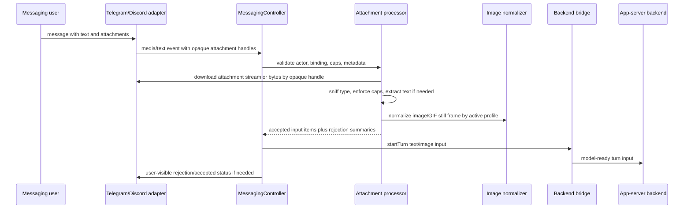
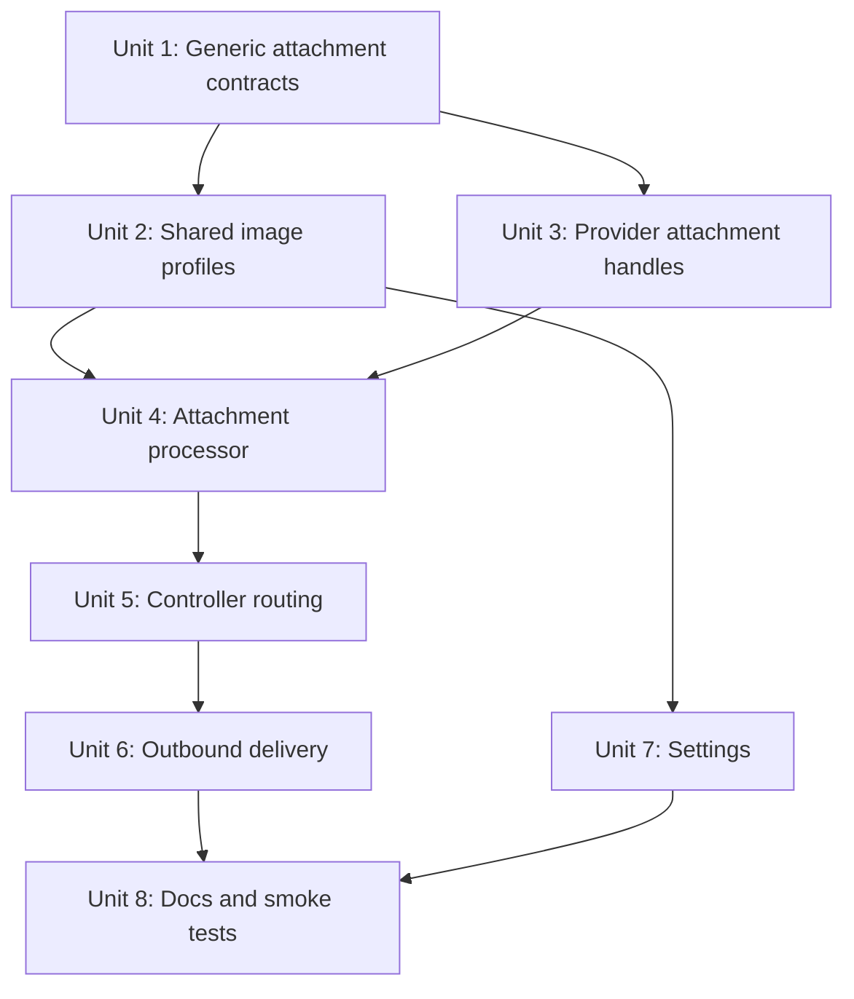

# feat: Add messaging attachment ingestion and response delivery

## Overview

Add first-class attachment handling to the generic messaging interface so Telegram and Discord can accept user-sent files, normalize supported attachments into safe model inputs, and deliver assistant response attachments without leaking provider-specific media rules into workflow code.

This extends the existing text/button messaging MVP. Today inbound media is intentionally rejected, and pasted desktop images are normalized only in the renderer composer path. The target behavior is that messaging attachments go through the same effective model-upload policy as pasted chat images, while response images/files use a single image profile setting that controls resolution and quality.

## Problem Frame

Remote agent control from Telegram and Discord needs attachments to behave like normal chat input. A user should be able to attach a small text file, CSV, JSON, YAML, TOML, image, or GIF from a messaging app and have PwrAgent route it into the bound thread without shipping raw unbounded media to a model.

The trust boundary is different from desktop paste. Messaging attachments arrive from external services, can be large, can have misleading MIME types, can be short-lived CDN URLs, and can include content types the model cannot consume. The generic controller should therefore own validation, caps, normalization, text extraction, audit logging, and user-visible rejection. Provider adapters should only expose platform metadata, opaque download handles, and provider upload/rendering capabilities.

## Requirements Trace

- R1. Extend `MessagingInboundMediaEvent` so inbound attachments can be represented as available, accepted, or rejected work, not only `disposition: "unsupported"` (see origin R1-R6, R26).
- R2. Keep workflow semantics channel-neutral: Telegram and Discord adapters expose attachment metadata and opaque download handles, while controller/core logic decides whether an attachment can enter an agent turn (see origin R2, R5, R26).
- R3. Normalize inbound images through the same policy as desktop-pasted images before model upload, including format conversion, dimensions, JPEG quality, and HEIC fallback where available.
- R4. Add one image profile setting with `low`, `medium`, `high`, and `actual` profiles that applies to messaging image responses and model-upload normalization unless a narrower call site has a hard cap.
- R5. Support bounded text-like attachments by MIME type, extension, and content sniffing: plain text, CSV, JSON, JSONL, TOML, YAML/YML, Markdown, logs, and similar source/code text.
- R6. Support GIFs explicitly: preserve animated GIFs for outbound channel delivery when within provider limits, but convert inbound GIFs to a normalized still image for model upload unless future model capability says animation is supported.
- R7. Treat PDF as a supported attachment category only for bounded text extraction; scanned/OCR-only PDF handling is out of scope for this pass.
- R8. Enforce size, byte, pixel, attachment-count, and extracted-text caps before downloading fully, before decoding, and before sending to model providers.
- R9. Deliver assistant response attachments as provider-native files/images where safe, with channel-specific degradation reported through generic delivery outcomes.
- R10. Preserve authorization, audit, redaction, and restart-safe behavior for external attachment handling.

## Scope Boundaries

- In scope: generic attachment contracts, adapter download capability, desktop/core attachment processor, image profiles, inbound Telegram and Discord attachment ingestion, outbound response image/file delivery, config/docs, and deterministic tests.
- In scope: image normalization for model input using existing Chromium/Electron/macOS `sips` behavior where it already exists or can be shared safely.
- In scope: text extraction for bounded text-like files and non-OCR PDF text when an implementation-time library choice is made.
- Out of scope: accepting arbitrary binary files into agent turns as raw files; the current app-server turn contract only supports text and image inputs.
- Out of scope: malware scanning, OCR, audio/video transcription, ZIP/archive expansion, and persistent cloud object storage.
- Out of scope: making Telegram or Discord provider code decide model-input semantics.
- Out of scope: exact future support for Slack, Mattermost, Feishu/Lark, or iOS. The contract should be reusable, but only Telegram and Discord need implementation now.

## Context & Research

### Relevant Code and Patterns

- `packages/messaging/AGENTS.md` states that attachments and routing should be expressed generically, providers must stay isolated, and provider limitations should be encoded as capabilities or delivery results.
- `packages/messaging/interface/src/index.ts` currently defines `MessagingFilePart`, `MessagingImagePart`, and `MessagingInboundMediaEvent`, but inbound media is only `disposition: "unsupported"`.
- `apps/desktop/src/main/messaging/core/messaging-controller.ts` currently rejects `event.kind === "media"` with "Media is not supported yet" and routes bound text into `StartTurnRequest.input`.
- `packages/messaging/providers/telegram/src/telegram-adapter.ts` already detects Telegram documents/photos/video/voice enough to emit an unsupported media event, but it intentionally does not expose `getFile` download behavior.
- `packages/messaging/providers/discord/src/discord-adapter.ts` already receives attachment metadata and CDN URLs, but emits only the first attachment as unsupported media.
- `apps/desktop/src/renderer/src/lib/image-normalization.ts` contains the current pasted-image policy: normalize to JPEG/PNG, cap dimensions at `2048` long edge and `1024` short edge, and use JPEG quality `0.85`.
- `apps/desktop/src/main/ipc/image-normalization.ts` provides a narrow HEIC/HEIF fallback through Electron `nativeImage` and the macOS `sips` platform tool.
- `packages/agent-core/src/providers/ai-sdk-message-builder.ts` enforces that data URL images must already be normalized to JPEG or PNG before provider submission.
- `apps/desktop/src/main/settings/desktop-config.ts` and `docs/brainstorms/2026-04-30-desktop-settings-config-requirements.md` define the TOML settings pattern for messaging config.
- `docs/messaging-adapter-contract.md` documents the current rejection policy and is the right place to update generic adapter expectations.

### Institutional Learnings

- No `docs/solutions/` artifact exists yet for messaging media ingestion.
- `docs/plans/2026-04-21-001-feat-electron-image-normalization-plan.md` established the existing local image-normalization decisions: avoid `sharp`, prefer Electron/Chromium primitives, use `sips` only as a narrow macOS HEIC/HEIF fallback, and keep provider layers strict.
- `docs/plans/2026-04-30-001-feat-messaging-platform-integration-plan.md` established the channel-neutral surface boundary and explicitly deferred safe inbound media ingestion to a later plan.

### External References

- Telegram Bot API `sendPhoto` documents a 10 MB photo cap plus width/height constraints, and the generic "Sending Files" rules distinguish photo and other file upload caps: https://core.telegram.org/bots/api
- Discord Create Message documents multipart file delivery and a 25 MiB maximum request size when sending messages: https://docs.discord.com/developers/resources/message#create-message

## Key Technical Decisions

- **Add attachment capability to the generic interface first.** The generic event should describe attachment metadata, source trust, size hints, MIME hints, and opaque download handles. Provider adapters should not convert these into model input.
- **Centralize ingestion in desktop main messaging code.** The desktop main process already owns provider adapters, backend bridge, settings, logging, and filesystem access. It can safely download, sniff, normalize, and route attachments without pulling provider SDKs into controller workflow code.
- **Extract a reusable image normalization service from the renderer-only path.** Keep the renderer paste flow working, but move profile definitions, resize math, MIME decisions, and HEIC fallback contracts into shared or main-process modules that messaging can call without DOM assumptions.
- **Default to `medium` image profile.** Preserve the current paste behavior as the default profile: bounded dimensions and lossy JPEG for opaque raster images. `actual` is opt-in and still subject to model and provider hard limits.
- **Use layered MIME detection.** Trust platform MIME only as a hint. Classify by declared MIME, filename extension, magic bytes where available, and text-decoding heuristics. Use the OS `file` command only as an optional best-effort fallback, not a required dependency.
- **Convert text-like attachments into explicit text input blocks.** Since `StartTurnRequest.input` has only text and image items, accepted text files should be converted into bounded text items with filename/type/size headers rather than adding raw file inputs.
- **Preserve outbound file delivery as a messaging concern.** `MessagingFilePart` already exists for assistant response attachments. Providers should upload/render it when within channel limits and return a generic failed/unsupported result when they cannot.
- **Keep rejection user-visible but non-leaky.** Rejections should name the attachment and reason class, such as too large, unsupported type, unreadable, or extracted text too long, without echoing secrets or raw file content into logs.

## Open Questions

### Resolved During Planning

- **Should inbound messaging media continue to be rejected by default?** No. The new default should accept only supported attachment categories after validation and normalization, and reject the rest with clear messages.
- **Should providers own model-upload resizing?** No. Providers expose platform metadata and download/render capabilities; the controller/attachment processor owns model-input policy.
- **Should there be separate resolution and quality settings?** No for the first pass. Use one profile setting that chooses both dimensions and JPEG quality.
- **Should `actual` bypass all limits?** No. `actual` bypasses soft downscaling/compression only where possible. It still respects channel, model, memory, and configured hard caps.
- **Should GIFs be sent to models as animated files?** No for this pass. Inbound GIFs should normalize to a still image for model input; outbound GIF delivery can preserve animation when the channel accepts it and size caps allow.

### Deferred to Implementation

- Exact parser/library choice for PDF text extraction after checking current bundle cost, ESM compatibility, and Electron packaging behavior.
- Whether to add a direct dependency such as `file-type` or reuse a currently transitive magic-byte helper. The plan requires an explicit dependency if the package is imported directly.
- Exact profile numeric values after comparing current paste defaults, provider caps, and model limits. The default must remain no larger than current paste behavior.
- Whether Telegram inbound photo download should prefer the largest platform photo size below the active profile cap or always download the largest then resize locally.
- Final wording for attachment rejection messages after seeing real Telegram and Discord payloads.

## High-Level Technical Design

> *This illustrates the intended approach and is directional guidance for review, not implementation specification. The implementing agent should treat it as context, not code to reproduce.*

Image profile behavior should be data-driven:

| Profile | Intended use | Behavior |
| --- | --- | --- |
| `low` | bandwidth-sensitive mobile messaging | smaller dimensions, lower JPEG quality, never upscale |
| `medium` | default and current paste parity | current `2048` long edge, `1024` short edge, JPEG quality near `0.85` |
| `high` | detailed screenshots and diagrams | larger dimensions and higher JPEG quality within hard caps |
| `actual` | opt-in original fidelity | preserve source dimensions/quality where compatible, but still transcode unsupported formats and reject over hard caps |

## Implementation Units

- [x] **Unit 1: Extend Generic Messaging Attachment Contracts**

**Goal:** Represent inbound and outbound attachments in the generic messaging contract without platform-specific fields or SDK types.

**Requirements:** R1, R2, R5, R6, R7, R9, R10

**Dependencies:** None

**Files:**
- Modify: `packages/messaging/interface/src/index.ts`
- Modify: `packages/messaging/interface/src/__tests__/messaging-contract.test.ts`
- Modify: `packages/shared/src/contracts/messaging.ts` if shared contract duplication is still required by desktop imports

**Approach:**
- Replace the single unsupported `MessagingInboundMediaEvent` shape with a media event that can carry one or more attachment descriptors.
- Add a generic attachment descriptor with name, declared MIME type, size hint, source kind, optional dimensions/duration where provider metadata exists, and opaque adapter state for download.
- Preserve a rejected/unsupported disposition for adapters that cannot expose usable media metadata.
- Add generic provider capability hints for inbound download, outbound image upload, outbound file upload, max attachment count, max upload bytes, and whether remote URLs or byte uploads are supported.
- Keep all provider-specific file IDs, CDN URLs that need auth, Telegram photo size arrays, and Discord attachment IDs inside adapter-owned opaque state.

**Patterns to follow:**
- Existing `MessagingAdapterState`, `MessagingFilePart`, and `MessagingImagePart` in `packages/messaging/interface/src/index.ts`
- Boundary rules in `packages/messaging/AGENTS.md`
- Existing contract tests in `packages/messaging/interface/src/__tests__/messaging-contract.test.ts`

**Test scenarios:**
- Happy path: a media event carries text plus two attachments without any Telegram or Discord fields at the top level.
- Happy path: an attachment descriptor can include filename, declared MIME, size, dimensions, and opaque state.
- Edge case: an adapter can still emit a media event with rejected/unsupported disposition when it lacks download support.
- Regression: provider packages continue importing only `@pwragent/messaging-interface`, not desktop or agent-core modules.

**Verification:**
- Generic contracts can describe Telegram and Discord attachment payloads without platform-specific branches in controller code.

- [x] **Unit 2: Factor Image Normalization Profiles**

**Goal:** Make the existing pasted-image normalization policy reusable by messaging ingestion and outbound response delivery.

**Requirements:** R3, R4, R6, R8

**Dependencies:** Unit 1

**Files:**
- Modify: `apps/desktop/src/renderer/src/lib/image-normalization.ts`
- Modify: `apps/desktop/src/shared/image-normalization.ts`
- Modify: `apps/desktop/src/main/ipc/image-normalization.ts`
- Modify: `apps/desktop/src/renderer/src/lib/__tests__/image-normalization.test.ts`
- Modify: `apps/desktop/src/main/__tests__/image-normalization-ipc.test.ts`
- Create: `apps/desktop/src/main/messaging/attachment-image-normalization.ts`
- Test: `apps/desktop/src/main/__tests__/messaging-attachment-image-normalization.test.ts`

**Approach:**
- Define named image profiles in shared desktop code so renderer paste, messaging inbound upload, and messaging response delivery use the same profile table.
- Preserve the current paste constants as the `medium` profile.
- Keep profile selection data-only: max long edge, max short edge, JPEG quality, whether to preserve source dimensions, and hard safety caps.
- Add a main-process callable normalization path for files/bytes downloaded by messaging providers. Do not require DOM APIs in the messaging path.
- Treat GIF inbound as image-like but normalize to a still PNG/JPEG for model input. Preserve animated GIF only for outbound delivery when channel upload policy allows.
- Keep HEIC/HEIF fallback narrow and do not turn `sips` into a general-purpose converter.

**Patterns to follow:**
- `apps/desktop/src/renderer/src/lib/image-normalization.ts`
- `apps/desktop/src/main/ipc/image-normalization.ts`
- `docs/plans/2026-04-21-001-feat-electron-image-normalization-plan.md`

**Test scenarios:**
- Happy path: `medium` profile exactly matches the current paste bounds and JPEG quality.
- Happy path: `low`, `high`, and `actual` resolve to deterministic profile records.
- Happy path: an opaque PNG source with alpha remains PNG after normalization.
- Happy path: an opaque large JPEG is resized and encoded according to the selected profile.
- Edge case: `actual` preserves dimensions below hard caps and rejects dimensions or byte size above hard caps.
- Edge case: GIF input produces a model-upload-safe still image and records that animation was not preserved.
- Error path: unsupported image bytes fail with a concise, user-safe error.

**Verification:**
- Renderer paste tests still pass conceptually with the `medium` profile, and messaging tests can normalize image bytes without using provider code.

- [x] **Unit 3: Add Telegram and Discord Attachment Handles**

**Goal:** Teach providers to expose download-capable attachment metadata and outbound upload capabilities through the generic adapter surface.

**Requirements:** R1, R2, R5, R6, R8, R9, R10

**Dependencies:** Unit 1

**Files:**
- Modify: `packages/messaging/providers/telegram/src/telegram-adapter.ts`
- Modify: `packages/messaging/providers/telegram/src/__tests__/telegram-grammy-adapter.test.ts`
- Modify: `apps/desktop/src/main/__tests__/telegram-adapter.test.ts`
- Modify: `packages/messaging/providers/discord/src/discord-adapter.ts`
- Modify: `packages/messaging/providers/discord/src/__tests__/discord-adapter.test.ts`
- Modify: `apps/desktop/src/main/__tests__/discord-adapter.test.ts`
- Modify: `apps/desktop/src/main/messaging/provider-loader.ts` if adapter capability wiring needs loader support

**Approach:**
- Telegram should map documents, photos, animations/GIFs, and possibly videos/voice into generic attachment descriptors, but only mark supported categories as available for this plan.
- Telegram download should stay provider-owned because Bot API file IDs and `getFile` paths are platform details.
- Discord should emit all message attachments, not only the first, with CDN URL details hidden behind generic opaque state when appropriate.
- Providers should expose a download method or capability on the adapter object that accepts opaque attachment state and returns bounded bytes/stream plus resolved metadata.
- Providers should expose outbound delivery capabilities for image/file parts, including byte caps and whether they need byte upload or can use remote URLs.
- Do not download media inside provider event normalization unless the controller explicitly accepts the actor/binding and asks for the attachment.

**Patterns to follow:**
- Current unsupported-media tests in `apps/desktop/src/main/__tests__/telegram-adapter.test.ts` and `apps/desktop/src/main/__tests__/discord-adapter.test.ts`
- Typing and delivery capability patterns in `packages/messaging/providers/telegram/src/telegram-adapter.ts` and `packages/messaging/providers/discord/src/discord-adapter.ts`

**Test scenarios:**
- Happy path: Telegram document `streaming-logs.txt` emits an available attachment descriptor with name, MIME hint, size if present, and opaque download state.
- Happy path: Telegram photo emits image attachment metadata with width/height when available and an opaque provider handle.
- Happy path: Discord message with multiple attachments emits all descriptors in one media event.
- Edge case: message with both text and attachments preserves text rather than treating the whole event as media-only.
- Error path: unsupported voice/video attachment emits a rejected descriptor without download.
- Security regression: generic event snapshots do not expose Telegram file IDs or Discord signed CDN URLs outside opaque adapter state.

**Verification:**
- Provider tests prove metadata normalization and download handles without starting agent turns or importing desktop messaging code.

- [x] **Unit 4: Build Main-Process Attachment Processor**

**Goal:** Download, classify, cap, normalize, and convert accepted messaging attachments into `StartTurnRequest.input` items.

**Requirements:** R3, R5, R6, R7, R8, R10

**Dependencies:** Units 1, 2, and 3

**Files:**
- Create: `apps/desktop/src/main/messaging/core/messaging-attachment-processor.ts`
- Create: `apps/desktop/src/main/messaging/core/messaging-attachment-mime.ts`
- Create: `apps/desktop/src/main/__tests__/messaging-attachment-processor.test.ts`
- Create: `apps/desktop/src/main/__tests__/messaging-attachment-mime.test.ts`
- Modify: `apps/desktop/src/main/messaging/core/messaging-adapter.ts`

**Approach:**
- Accept attachment descriptors only after the controller has authorized the actor and found an active binding.
- Enforce metadata-level caps before download: max attachment count, max declared bytes, and unsupported declared type rejection.
- Download through the adapter capability with a maximum byte budget so large files can fail before memory grows without bound.
- Classify type by layered evidence: provider MIME hint, extension, magic bytes where available, text-decoding heuristics, and optional OS `file` fallback when available.
- Treat text-like files as UTF-8 or safely decoded text after enforcing byte and extracted-character caps. Include filename, MIME, byte size, and truncation marker in the generated text item.
- Treat CSV, JSON, JSONL, TOML, YAML/YML, Markdown, logs, and common source-code text as text-like, with validation light enough to avoid rejecting useful malformed logs.
- Treat PDF as text-extraction only. If extraction is unavailable, encrypted, scanned-only, or over cap, reject with a PDF-specific reason.
- Treat images and GIFs through Unit 2 normalization and emit `type: "image"` data URLs plus optional explanatory text when animation or fidelity was reduced.
- Return accepted input items and rejection summaries separately so a mixed message can still start a turn when at least one attachment or text item is valid.

**Patterns to follow:**
- `apps/desktop/src/main/messaging/core/messaging-controller.ts` for controller-facing pure helpers
- `packages/agent-core/src/providers/ai-sdk-message-builder.ts` for strict provider image expectations
- `apps/desktop/src/main/log.ts` for safe logging

**Test scenarios:**
- Happy path: `streaming-logs.txt` with `text/plain` becomes a bounded text input item with a filename header.
- Happy path: JSON, JSONL, CSV, TOML, YAML, YML, Markdown, and `.log` files are classified as text-like by MIME or extension.
- Happy path: an image attachment becomes a normalized JPEG/PNG data URL acceptable to `buildAiSdkMessages()`.
- Happy path: a GIF attachment becomes a normalized still image plus a user-safe note that animation was not sent to the model.
- Happy path: text plus two supported attachments produces ordered text/input items for one turn.
- Edge case: no MIME type and misleading extension still classifies plain UTF-8 text by content heuristics.
- Edge case: binary bytes with `.txt` extension are rejected as non-text.
- Error path: declared size over policy cap is rejected before download.
- Error path: downloaded bytes exceed cap and the adapter download is aborted or discarded without starting a turn.
- Error path: malformed or encrypted PDF is rejected with a reason and no raw content logged.
- Integration: every emitted image input is JPEG/PNG and passes `packages/agent-core/src/providers/ai-sdk-message-builder.ts`.

**Verification:**
- Processor tests prove supported attachments become model-ready text/image items and unsupported attachments produce deterministic rejection summaries.

- [x] **Unit 5: Route Accepted Media Through MessagingController**

**Goal:** Replace the current blanket media rejection with authorized, bound attachment ingestion and mixed text-plus-attachment turn starts.

**Requirements:** R1, R2, R3, R5, R6, R8, R10

**Dependencies:** Units 1 through 4

**Files:**
- Modify: `apps/desktop/src/main/messaging/core/messaging-controller.ts`
- Modify: `apps/desktop/src/main/messaging/core/messaging-renderer.ts`
- Modify: `apps/desktop/src/main/__tests__/messaging-controller.test.ts`
- Modify: `apps/desktop/src/main/messaging/messaging-runtime.ts` if runtime construction needs to inject the attachment processor
- Modify: `apps/desktop/src/main/__tests__/messaging-runtime.test.ts`

**Approach:**
- Add a controller media path that mirrors the text path: authorize actor, handle pending intent if text exists, require active binding, resolve turn settings, process attachments, and start a turn when there is valid input.
- Preserve `/resume` and command behavior for text-only messages. If a platform sends text plus attachments, command handling should win only when the text is clearly a command and attachments should be rejected or ignored with a clear note.
- Send a concise confirmation/error intent when some attachments are rejected. If at least one input item is accepted, still start the turn and include rejection context as user-visible messaging feedback.
- Maintain typing/status lifecycle behavior after a media-driven turn starts.
- Do not store downloaded bytes in `MessagingStore`; persist only audit metadata and delivery status.

**Patterns to follow:**
- Existing `handleText()` flow in `apps/desktop/src/main/messaging/core/messaging-controller.ts`
- Existing unsupported media regression test in `apps/desktop/src/main/__tests__/messaging-controller.test.ts`

**Test scenarios:**
- Happy path: bound conversation sends text plus `streaming-logs.txt`; controller starts a turn with original text and extracted file text.
- Happy path: bound conversation sends image-only attachment; controller starts an image-only turn.
- Happy path: mixed valid image and invalid binary file starts a turn with the image and sends a rejection note for the invalid file.
- Edge case: unbound conversation with attachment receives the same bind-first guidance as text.
- Edge case: unauthorized actor attachment is rejected before adapter download is requested.
- Error path: all attachments rejected results in no `startTurn()` call and a recoverable error intent.
- Security regression: logs and store records contain metadata/reason codes, not attachment contents or secret URLs.

**Verification:**
- Controller tests prove media events now route through the same binding and activity lifecycle as text without forwarding raw file parts to the backend.

- [x] **Unit 6: Deliver Response Images and Files Through Providers**

**Goal:** Make assistant response attachments render as platform-native images/files when safe and degrade predictably when provider limits prevent delivery.

**Requirements:** R4, R6, R8, R9, R10

**Dependencies:** Units 1, 2, and 3

**Files:**
- Modify: `packages/messaging/providers/telegram/src/telegram-adapter.ts`
- Modify: `packages/messaging/providers/telegram/src/telegram-formatting.ts`
- Modify: `packages/messaging/providers/telegram/src/__tests__/telegram-formatting.test.ts`
- Modify: `packages/messaging/providers/discord/src/discord-adapter.ts`
- Modify: `packages/messaging/providers/discord/src/discord-formatting.ts`
- Modify: `packages/messaging/providers/discord/src/__tests__/discord-formatting.test.ts`
- Modify: `apps/desktop/src/main/__tests__/telegram-adapter.test.ts`
- Modify: `apps/desktop/src/main/__tests__/discord-adapter.test.ts`

**Approach:**
- Use the image profile setting for assistant `MessagingImagePart` delivery when the part is a data URL or local/generated byte source that can be normalized before upload.
- Telegram should use photo upload for normal images within photo constraints and document upload for non-photo files or degraded cases when supported by the generic file part.
- Discord should send files through multipart upload when bytes are available and continue using embeds for remote image URLs when that is the better fit.
- Preserve animated GIFs outbound when provider caps allow; otherwise degrade to still image or file rejection based on capability.
- Keep long response text chunking separate from file upload. A file part should not cause text content to exceed provider message limits.
- Return generic delivery results that distinguish presented, unsupported, and failed attachment delivery.

**Patterns to follow:**
- Current Telegram `sendPhoto` behavior in `packages/messaging/providers/telegram/src/telegram-adapter.ts`
- Current Discord image embed behavior in `packages/messaging/providers/discord/src/discord-adapter.ts`
- `docs/messaging-adapter-contract.md` rendering policy

**Test scenarios:**
- Happy path: assistant image data URL is normalized by profile and uploaded/sent through Telegram.
- Happy path: assistant image URL still uses Telegram photo or Discord embed path when no byte upload is needed.
- Happy path: assistant file part `streaming-logs.txt` is uploaded as a provider file with caption/text kept within limits.
- Happy path: outbound GIF within cap is preserved as animated delivery where provider supports it.
- Edge case: file over provider cap returns `unsupported` or `failed` with a useful error message but does not crash delivery of adjacent text chunks.
- Error path: provider upload failure reports a failed delivery result and logs only metadata.

**Verification:**
- Provider adapter tests prove response image/file delivery paths and degradation behavior from generic `MessagingMessageIntent` parts.

- [x] **Unit 7: Add Attachment Settings and Effective Policy Resolution**

**Goal:** Expose durable settings for image profile and attachment caps with environment override behavior consistent with existing desktop settings.

**Requirements:** R4, R8, R10

**Dependencies:** Unit 2

**Files:**
- Modify: `apps/desktop/src/main/settings/desktop-config.ts`
- Modify: `apps/desktop/src/main/settings/desktop-settings-service.ts`
- Modify: `apps/desktop/src/main/messaging/messaging-config.ts`
- Modify: `apps/desktop/src/main/__tests__/desktop-settings-service.test.ts`
- Modify: `apps/desktop/src/main/__tests__/messaging-config.test.ts`
- Modify: `apps/desktop/src/renderer/src/features/settings/MessagingSettings.tsx` if the current settings UI should expose attachment controls
- Modify: `apps/desktop/src/renderer/src/features/settings/__tests__/settings-screen.test.tsx` if settings UI coverage is extended

**Approach:**
- Add a TOML shape under messaging settings for attachment policy, such as image profile and max attachment counts/bytes.
- Add environment overrides for the same settings so automated or bandwidth-sensitive runs can force low-quality behavior.
- Default the image profile to `medium`.
- Keep settings app-level. Per-thread attachment policy is out of scope unless later product work needs it.
- If the settings UI has not yet exposed attachment controls, at minimum support TOML/env configuration and document it. Add UI controls only if the existing settings page has a clear messaging section to extend.

**Patterns to follow:**
- Existing `[messaging.telegram]` and `[messaging.discord]` TOML parsing in `apps/desktop/src/main/settings/desktop-config.ts`
- Existing effective-value tests in `apps/desktop/src/main/__tests__/desktop-settings-service.test.ts`
- `docs/brainstorms/2026-04-30-desktop-settings-config-requirements.md`

**Test scenarios:**
- Happy path: absent config resolves to `medium` image profile and conservative attachment caps.
- Happy path: TOML image profile `low`, `medium`, `high`, and `actual` parse and round-trip.
- Happy path: environment override wins over TOML and is reflected in effective settings metadata.
- Error path: invalid image profile reports a config error and falls back safely.
- Error path: invalid cap values are rejected or ignored with a clear config error.

**Verification:**
- Messaging runtime can resolve one effective attachment policy and pass it to the attachment processor and outbound delivery code.

- [x] **Unit 8: Update Documentation and Smoke Coverage**

**Goal:** Document supported attachment types, limits, settings, provider behavior, and manual smoke flows.

**Requirements:** R1-R10

**Dependencies:** Units 1 through 7

**Files:**
- Modify: `docs/messaging-adapter-contract.md`
- Modify: `docs/messaging-platform-integration.md`
- Modify: `apps/desktop/src/main/__tests__/messaging-docs-links.test.ts`
- Modify: `packages/messaging/AGENTS.md` only if the package boundary text needs an attachment-specific clarification

**Approach:**
- Update adapter contract docs to describe attachment descriptors, opaque download handles, provider-owned download/upload mechanics, and controller-owned ingestion semantics.
- Update integration docs to list supported incoming types: text-like files, images, GIFs as stills for model input, and PDF text extraction when available.
- Document unsupported categories: oversized files, arbitrary binaries, audio/video, archives, OCR-only PDFs, and files with unsafe/misleading content.
- Document image profile behavior and the default `medium` policy.
- Add manual Telegram and Discord smoke steps for incoming text file, incoming image, oversized rejection, response image delivery, and response file delivery.

**Patterns to follow:**
- Existing docs in `docs/messaging-adapter-contract.md`
- Existing smoke checklist in `docs/messaging-platform-integration.md`

**Test scenarios:**
- Happy path: docs link test covers the updated docs.
- Manual smoke: Telegram text file attachment starts a bound turn with extracted text.
- Manual smoke: Discord image attachment starts a bound turn with normalized image input.
- Manual smoke: oversized image/file is rejected before model upload.
- Manual smoke: assistant response file renders as a channel attachment or reports provider degradation.

**Verification:**
- A developer adding a new provider can understand whether attachment handling belongs in the adapter, controller, or processor.

## System-Wide Impact

- **Interaction graph:** Provider inbound events feed `MessagingController`, which calls a new attachment processor, downloads through adapter capabilities, normalizes into `StartTurnRequest.input`, and then uses the existing backend bridge. Outbound assistant `MessagingMessageIntent` parts flow back through provider delivery policy.
- **Error propagation:** Attachment validation errors should become recoverable messaging error/confirmation intents. Provider download/upload failures should become delivery failure results with safe logs.
- **State lifecycle risks:** Downloaded bytes and extracted contents should not persist in `MessagingStore`. Pending events should be processed synchronously enough to avoid stale provider URLs, with clear failures when URLs expire.
- **API surface parity:** Telegram and Discord should expose the same generic attachment descriptors and capability model even though Telegram uses file IDs and Discord uses attachment URLs.
- **Integration coverage:** Unit tests should cover contracts, provider event normalization, processor classification, controller routing, provider outbound delivery, and config resolution. Manual smoke is still needed for real platform download/upload behavior.
- **Unchanged invariants:** Provider packages remain isolated, desktop messaging core does not import provider SDKs, and agent-core/model providers still receive only text and JPEG/PNG image inputs.

## Risks & Dependencies

| Risk | Mitigation |
| --- | --- |
| Large external files exhaust memory or bandwidth | Enforce metadata caps before download, byte caps during download, profile caps during normalization, and hard model/provider caps before delivery. |
| MIME type spoofing causes unsafe or unreadable content to enter model input | Use layered classification and reject conflicting binary/text evidence rather than trusting platform MIME alone. |
| Provider-specific download state leaks into logs or contracts | Keep file IDs, signed URLs, and tokens inside `MessagingAdapterState`; log only safe metadata and reason codes. |
| PDF support grows into OCR/document processing scope | Limit this pass to bounded text extraction and reject encrypted, scanned-only, or oversized PDFs. |
| `actual` profile surprises users with large uploads | Keep default `medium`, document `actual` as opt-in, and preserve hard caps even for `actual`. |
| GIF behavior differs between model input and response delivery | Document the split: inbound model input uses a still image, outbound channel delivery preserves animation when safe. |
| New dependency for MIME/PDF detection affects Electron packaging | Make dependency choice explicit during implementation and cover it in desktop build/typecheck before merging. |

## Documentation / Operational Notes

- The default policy should be conservative enough for mobile messaging and should not send original-resolution images unless the user opts into `actual`.
- Attachment rejection messages should be concise because mobile clients make long diagnostics noisy.
- Manual validation should include the concrete case from the user screenshot: a `.txt` attachment in Telegram should no longer receive "Media is not supported yet" when the conversation is bound and authorized.

## Sources & References

- **Origin document:** [docs/brainstorms/2026-04-30-messaging-platform-integration-requirements.md](../brainstorms/2026-04-30-messaging-platform-integration-requirements.md)
- Related plan: [docs/plans/2026-04-30-001-feat-messaging-platform-integration-plan.md](2026-04-30-001-feat-messaging-platform-integration-plan.md)
- Related plan: [docs/plans/2026-04-21-001-feat-electron-image-normalization-plan.md](2026-04-21-001-feat-electron-image-normalization-plan.md)
- Related docs: [docs/messaging-adapter-contract.md](../messaging-adapter-contract.md)
- Related docs: [docs/messaging-platform-integration.md](../messaging-platform-integration.md)
- Related code: `packages/messaging/interface/src/index.ts`
- Related code: `apps/desktop/src/main/messaging/core/messaging-controller.ts`
- Related code: `apps/desktop/src/renderer/src/lib/image-normalization.ts`
- Related code: `packages/messaging/providers/telegram/src/telegram-adapter.ts`
- Related code: `packages/messaging/providers/discord/src/discord-adapter.ts`
- External docs: Telegram Bot API, https://core.telegram.org/bots/api
- External docs: Discord Message Resource, https://docs.discord.com/developers/resources/message
