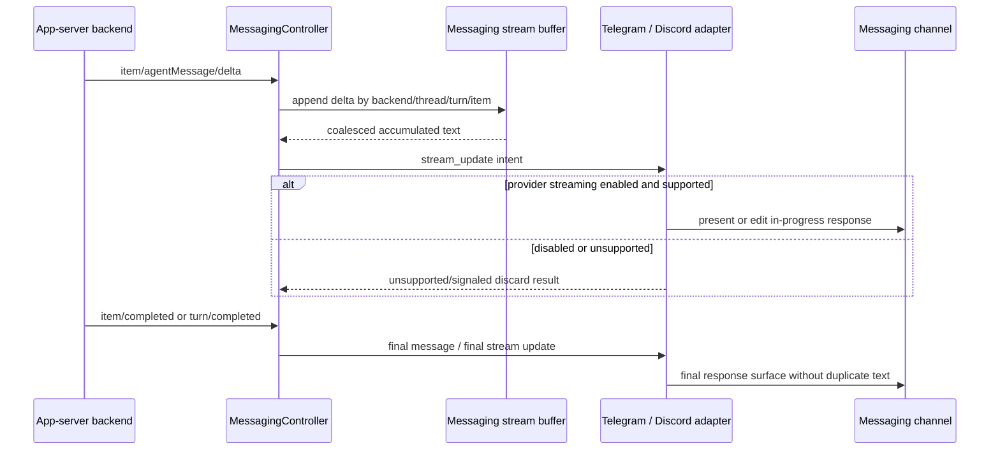
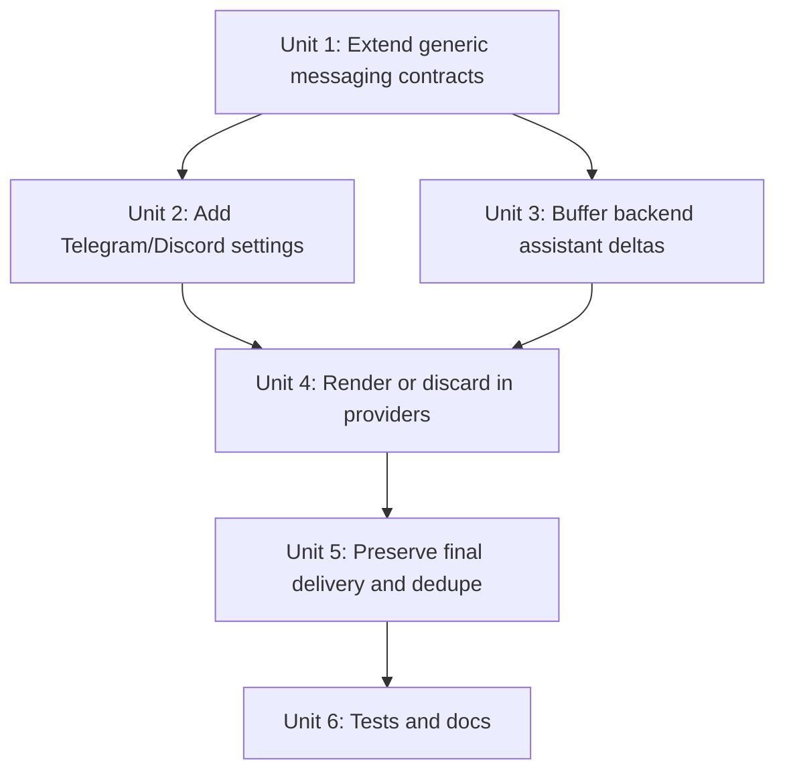

# feat: Add optional messaging streaming responses

## Overview

Add optional live assistant response streaming to the generic messaging surface so Telegram and Discord can show a bound agent response while `item/agentMessage/delta` events are arriving, instead of waiting for `item/completed` or `turn/completed`.

The controller should be able to emit a channel-neutral stream intent for every supported assistant text delta. Provider adapters then decide whether to render it, discard it as unsupported, or discard it because streaming is disabled by provider settings or a future binding/thread-level preference. This keeps streaming as a semantic surface capability rather than another Telegram/Discord branch in desktop workflow code.

## Problem Frame

The captured logs for thread `019dd9ce-7496-74b1-80ff-cc81d5959251` on May 2, 2026 around 8:25 AM show repeated `item/agentMessage/delta` protocol events for one assistant message while Telegram and Discord typing leases continue. The protocol observer can already coalesce those deltas for logs, but the messaging workflow currently delivers assistant text only from completed assistant items or terminal turns.

Typing indicators prove work is happening, but they do not expose live response text to the messaging user. For long answers, a mobile or chat-surface user should be able to watch the response update when the provider supports safe updates and the channel's messaging settings enable the behavior.

## Requirements Trace

- R1. Add a channel-neutral outbound intent for assistant response streaming; workflow logic must not call Telegram or Discord APIs directly.
- R2. Streaming is optional per provider and controlled by desktop settings for Telegram and Discord.
- R3. The controller may emit stream intents for every assistant text delta, but adapters must be able to discard them when unsupported or disabled.
- R4. Final assistant message delivery remains authoritative; streaming must not duplicate final content or stop typing early.
- R5. Telegram and Discord implementations must respect platform limits and degradation policies for edits, message length, markdown, components, and rate/interval behavior.
- R6. Existing messaging requirements still apply: channel state stays opaque, provider packages stay isolated, authorization remains unchanged, and long responses remain chunked or summarized according to adapter policy.
- R7. The design leaves room for a future binding/thread-specific streaming override without requiring that UI in this first settings-level slice.

## Scope Boundaries

- In scope: generic messaging stream intent contract, desktop settings/config for Telegram and Discord streaming responses, runtime config propagation, controller handling of `item/agentMessage/delta`, adapter-side render/discard behavior, tests, and docs.
- In scope: throttling/coalescing policy so delta bursts do not send one provider edit per backend delta.
- In scope: preserving existing final assistant message delivery and deduplication semantics.
- Out of scope: streaming tool output, command output, plan deltas, reasoning deltas, file-change deltas, or realtime audio/transcript events into messaging.
- Out of scope: a full per-thread settings UI. The generic contract may reserve an override, but first delivery is provider settings-level for Telegram and Discord.
- Out of scope: changing the desktop transcript renderer or app-server protocol.
- Out of scope: relying on Vercel Chat SDK or any provider-specific runtime abstraction.

## Context & Research

### Relevant Code and Patterns

- `packages/shared/src/contracts/normalized-app-server.ts` already includes `item/agentMessage/delta` with `threadId`, `turnId`, `itemId`, `delta`, and optional phase data.
- `apps/desktop/src/main/app-server/protocol-log-observer.ts` already demonstrates a local coalescing pattern for streaming deltas and flushes buffers on `item/completed`, `turn/completed`, `turn/failed`, and `turn/cancelled`.
- `apps/desktop/src/main/messaging/core/messaging-controller.ts` owns backend event handling, active turn state, typing activity, assistant message delivery, and final-message deduplication.
- `assistantTextForBackendEvent()` currently extracts completed assistant text from `item/completed` and `turn/completed`; it intentionally ignores `item/agentMessage/delta`.
- `packages/messaging/interface/src/index.ts` and `packages/shared/src/contracts/messaging.ts` define the generic `MessagingSurfaceIntent` union that adapters render.
- `packages/messaging/providers/telegram/src/telegram-adapter.ts` and `packages/messaging/providers/discord/src/discord-adapter.ts` already degrade unsupported intents and own platform message/edit mechanics.
- `apps/desktop/src/main/messaging/messaging-config.ts`, `apps/desktop/src/main/settings/desktop-config.ts`, `apps/desktop/src/main/settings/desktop-settings-env.ts`, `packages/shared/src/contracts/settings.ts`, and `apps/desktop/src/renderer/src/features/settings/MessagingSettings.tsx` are the current settings/config path for Telegram and Discord.
- `docs/messaging-adapter-contract.md` is the right place to document stream intent semantics alongside typing and rendering policy.
- `docs/messaging-platform-integration.md` has the manual smoke checklist for Telegram and Discord messaging behavior.

### Institutional Learnings

- `docs/plans/2026-05-02-001-fix-messaging-typing-indicator-plan.md` established that assistant item delivery and typing lifecycle are separate; streaming deltas must follow that same separation.
- `docs/plans/2026-05-02-001-refactor-messaging-live-thread-state-plan.md` established that messaging bindings should hold routing/preferences, not duplicate desktop thread state.
- `docs/plans/2026-04-30-003-feat-desktop-settings-config-plan.md` established the desktop settings contract, TOML table shape, and environment override model used by messaging settings.
- No `docs/solutions/` directory exists in this worktree, so there are no additional durable solution notes for messaging streaming.

### External References

- External research is not needed for the initial plan. The relevant streaming event and provider edit surfaces are already represented in local contracts and adapter code; the implementation risk is local contract shape, throttling, and adapter policy.

## Key Technical Decisions

- **Add a generic stream intent instead of reusing `message`.** A streaming update is not a finalized assistant message; it needs stream identity, accumulated text, sequence/update metadata, and a finalization signal so adapters can edit or discard safely without confusing completed delivery.
- **Emit stream intents from controller workflow; let adapters gate rendering.** The controller should translate `item/agentMessage/delta` into channel-neutral stream intents for active bindings. Telegram and Discord adapters decide whether the intent is renderable based on provider config and optional binding policy.
- **Default provider streaming off.** Add settings for Telegram and Discord, defaulting to disabled, to avoid surprising edit churn, rate-limit exposure, and chat notification behavior until a user explicitly enables it.
- **Throttle and coalesce before provider calls.** Deltas can arrive faster than Telegram/Discord should be edited. The controller should accumulate per backend/thread/turn/item stream state and emit bounded updates on an interval or on final flush, similar in spirit to the protocol log observer.
- **Final message remains authoritative.** Existing `item/completed` / `turn/completed` assistant message delivery should still send or reconcile the final content. Streaming should update an in-progress surface and mark it final when possible, but must not create duplicate final messages.
- **Keep markdown policy conservative while streaming.** Streaming text can be incomplete markdown. Adapters should use a safe partial-render mode during streaming and may switch to normal message formatting only when final content is known.
- **Keep stream surfaces transient.** Stream buffers and stream-key-to-surface mappings are runtime state. They should not be persisted into `messaging-state.json` or treated as restart-safe managed surfaces; the completed assistant message remains the restart-safe transcript-backed truth.
- **Reserve binding-level override without requiring the UI now.** A future `MessagingBindingPreferences` field can allow `inherit`, `enabled`, or `disabled` per binding/thread. The first implementation can pass no override and rely on provider settings.

## Open Questions

### Resolved During Planning

- **Should streaming be modeled as a generic intent?** Yes. Provider-specific message editing belongs in adapters, but the semantic fact "assistant text stream updated" belongs in the shared messaging contract.
- **Should adapters be allowed to discard stream intents?** Yes. Discarding is the intended degradation path for unsupported providers or disabled provider settings.
- **Should this stream tool output and reasoning too?** No. The requested behavior and captured logs are assistant response text. Tool, command, reasoning, and plan streams can be separate future intents if needed.
- **Should streaming replace completed assistant message delivery?** No. Completed delivery remains the authoritative final response path.
- **Should external OpenAI docs drive this plan?** No. The local normalized app-server contract already exposes the needed `item/agentMessage/delta` event shape from the Codex backend.

### Deferred to Implementation

- Exact stream intent field names and helper names.
- Exact default coalescing interval and max update cadence after observing current tests and adapter behavior.
- Whether Telegram should edit one in-progress message or send a placeholder then final message when markdown/chunking makes editing unsafe.
- Whether Discord should update normal channel messages first or only interaction-originated surfaces where update semantics are already present.

## High-Level Technical Design

> *This illustrates the intended approach and is directional guidance for review, not implementation specification. The implementing agent should treat it as context, not code to reproduce.*

The stream intent should describe accumulated assistant text, not only the raw delta:

| Field concept | Purpose |
| --- | --- |
| Stream key | Correlates backend, thread, turn, item, and stream type without exposing provider state. |
| Delta text | Lets tests prove incremental input was consumed. |
| Accumulated text | Lets adapters render idempotent updates and recover if an earlier edit was skipped. |
| Sequence/update index | Helps adapters ignore stale updates if async edits complete out of order. |
| Final flag | Tells adapters whether to switch from partial streaming formatting to final rendering behavior. |
| Policy hints | Allows controller or binding preferences to communicate `enabled`, `disabled`, or `inherit` without provider-specific branches. |

## Implementation Units

- [x] **Unit 1: Extend generic messaging contracts**

**Goal:** Add a channel-neutral intent for assistant response stream updates and represent provider/binding streaming policy without leaking backend protocol details into adapters.

**Requirements:** R1, R3, R4, R6, R7

**Dependencies:** None

**Files:**
- Modify: `packages/shared/src/contracts/messaging.ts`
- Modify: `packages/messaging/interface/src/index.ts`
- Test: `packages/messaging/interface/src/__tests__/messaging-contract.test.ts`
- Test: `packages/messaging/interface/src/__tests__/messaging-interface.test.ts`
- Test: `packages/shared/src/contracts/__tests__/settings.test.ts` only if the binding preference type is introduced in shared settings contracts

**Approach:**
- Add a new `MessagingSurfaceIntentKind` for streaming assistant response updates.
- Define a stream update intent with channel-neutral fields for stream identity, role, accumulated text, delta text, update sequence, final state, and optional policy hint.
- Keep backend protocol names such as `item/agentMessage/delta` out of provider-facing type names and docs.
- Add an optional binding preference shape that can express future per-binding streaming override as `inherit`, `enabled`, or `disabled`; do not require the UI to set it in this first slice.
- Define or document delivery-result expectations for intentionally discarded stream updates so the controller can distinguish benign unsupported/disabled discards from real delivery failures.
- Ensure adapters that do not know the new intent can return `unsupported` or otherwise no-op without failing the controller flow.

**Patterns to follow:**
- `MessagingActivityIntent` and `MessagingMessageIntent` in `packages/shared/src/contracts/messaging.ts`
- Existing mirrored exports in `packages/messaging/interface/src/index.ts`
- Boundary rules in `packages/messaging/AGENTS.md`

**Test scenarios:**
- Happy path: a stream update intent with accumulated assistant text is accepted by shared/interface type tests and included in the surface intent union.
- Edge case: an intent can represent an empty or whitespace-only delta only if accumulated text remains meaningful; otherwise helpers should avoid emission.
- Edge case: policy override can represent inherited provider setting and explicit disabled state without naming Telegram or Discord.
- Error path: a disabled or unsupported stream update delivery result is distinguishable from a permanent target failure and does not revoke or detach a binding.
- Regression: provider-facing interface package still does not import desktop, agent-core, Telegram, or Discord implementation modules.

**Verification:**
- Shared and interface contract tests prove the new intent is generic, exported, and compatible with existing adapter boundaries.

- [x] **Unit 2: Add Telegram and Discord streaming settings**

**Goal:** Make streaming responses configurable at the desktop settings level for Telegram and Discord, with environment override support and runtime propagation into provider configs.

**Requirements:** R2, R3, R5, R6

**Dependencies:** Unit 1 if provider config types refer to the new policy type; otherwise none.

**Files:**
- Modify: `packages/shared/src/contracts/settings.ts`
- Modify: `apps/desktop/src/main/settings/desktop-config.ts`
- Modify: `apps/desktop/src/main/settings/desktop-settings-env.ts`
- Modify: `apps/desktop/src/main/settings/desktop-settings-service.ts`
- Modify: `apps/desktop/src/main/messaging/messaging-config.ts`
- Modify: `packages/messaging/providers/telegram/src/telegram-config.ts`
- Modify: `packages/messaging/providers/discord/src/discord-config.ts`
- Modify: `apps/desktop/src/renderer/src/features/settings/MessagingSettings.tsx`
- Test: `apps/desktop/src/main/__tests__/desktop-settings-service.test.ts`
- Test: `apps/desktop/src/main/__tests__/messaging-config.test.ts`
- Test: `apps/desktop/src/renderer/src/features/settings/__tests__/settings-screen.test.tsx`

**Approach:**
- Add `messaging.telegram.streaming_responses` and `messaging.discord.streaming_responses` TOML booleans.
- Add environment overrides `PWRAGNT_MESSAGING_TELEGRAM_STREAMING_RESPONSES` and `PWRAGNT_MESSAGING_DISCORD_STREAMING_RESPONSES`.
- Add snapshot fields so the settings screen can show and edit the streaming toggle with source metadata.
- Pass effective booleans into `TelegramMessagingConfig` and `DiscordMessagingConfig`.
- Default both settings to `false` so current messaging behavior does not change unless enabled.

**Patterns to follow:**
- Enabled flag handling in `apps/desktop/src/main/settings/desktop-settings-service.ts`
- TOML table handling in `apps/desktop/src/main/settings/desktop-config.ts`
- Current Telegram/Discord settings groups in `apps/desktop/src/renderer/src/features/settings/MessagingSettings.tsx`

**Test scenarios:**
- Happy path: TOML `streaming_responses = true` for Telegram appears in the settings snapshot and reaches `TelegramMessagingConfig`.
- Happy path: Discord env override `PWRAGNT_MESSAGING_DISCORD_STREAMING_RESPONSES=false` beats TOML `true` and reports env source metadata.
- Edge case: unset streaming settings default to `false` for both providers.
- Error path: invalid boolean env values surface an error in the setting metadata without enabling streaming accidentally.
- Regression: existing token, enabled, authorized user, guild, and supergroup settings continue to parse and save.
- UI: toggling the Telegram or Discord streaming field writes only the matching provider's non-secret config patch.

**Verification:**
- Settings snapshots, TOML round-trips, env overrides, and runtime messaging config all agree on the streaming response setting.

- [x] **Unit 3: Buffer and emit assistant response stream updates**

**Goal:** Translate backend `item/agentMessage/delta` events into bounded generic stream intents for every active binding on the target thread.

**Requirements:** R1, R3, R4, R6

**Dependencies:** Unit 1

**Files:**
- Modify: `apps/desktop/src/main/messaging/core/messaging-controller.ts`
- Test: `apps/desktop/src/main/__tests__/messaging-controller.test.ts`

**Approach:**
- Add a per-stream buffer keyed by backend, thread id, turn id, item id, role/stream type, and binding id where necessary.
- On `item/agentMessage/delta`, append text and emit a stream update only when cadence policy allows, or when the stream is forced to flush.
- Include accumulated text in emitted intents so provider updates are idempotent even if earlier deltas were skipped.
- Flush the matching buffer on `item/completed`, `turn/completed`, `turn/failed`, or `turn/cancelled`.
- Treat streaming as orthogonal to active turn lifecycle. Deltas can refresh typing via existing work-activity logic, but stream delivery must not mark the turn completed or idle.
- Avoid emitting stream intents for non-assistant deltas, unbound threads, unauthorized contexts, or missing stream identity.

**Patterns to follow:**
- Delta coalescing in `apps/desktop/src/main/app-server/protocol-log-observer.ts`
- Active turn handling and assistant delivery in `apps/desktop/src/main/messaging/core/messaging-controller.ts`
- The early-idle separation from `docs/plans/2026-05-02-001-fix-messaging-typing-indicator-plan.md`

**Test scenarios:**
- Happy path: two `item/agentMessage/delta` events for a bound thread emit one or more stream intents with accumulated text in order.
- Happy path: rapid deltas inside the coalescing interval do not cause one adapter delivery per delta.
- Happy path: final `item/completed` flushes the stream buffer and existing assistant message delivery still sends final text.
- Edge case: a delta without `turnId` or `itemId` is ignored or handled by a documented fallback key without crashing.
- Edge case: a delta for an unbound thread does not create a binding or deliver a stream intent.
- Error path: adapter failure for one stream update does not prevent later final assistant message delivery.
- Regression: streaming deltas do not transition `activeTurn.status` to completed or emit idle activity.

**Verification:**
- Controller tests show stream updates are emitted from assistant deltas, bounded by cadence, flushed on completion, and independent from final-message delivery.

- [x] **Unit 4: Render or discard streaming in Telegram and Discord adapters**

**Goal:** Implement provider-side stream intent handling so Telegram and Discord can either update a live response surface when enabled or discard stream updates safely when disabled.

**Requirements:** R2, R3, R5, R6

**Dependencies:** Units 1 and 2; Unit 3 for controller-level integration coverage.

**Files:**
- Modify: `packages/messaging/providers/telegram/src/telegram-adapter.ts`
- Modify: `packages/messaging/providers/telegram/src/telegram-formatting.ts` only if partial streaming text needs a safer format path
- Modify: `packages/messaging/providers/discord/src/discord-adapter.ts`
- Modify: `packages/messaging/providers/discord/src/discord-formatting.ts` only if partial streaming text needs a safer format path
- Test: `packages/messaging/providers/telegram/src/__tests__/telegram-formatting.test.ts`
- Test: `packages/messaging/providers/discord/src/__tests__/discord-formatting.test.ts`
- Test: `apps/desktop/src/main/__tests__/telegram-adapter.test.ts`
- Test: `apps/desktop/src/main/__tests__/discord-adapter.test.ts`

**Approach:**
- If streaming is disabled in provider config or policy override, return a benign delivery result without sending or editing platform messages.
- If streaming is enabled, create or update one in-progress assistant response surface per stream key using adapter-owned opaque state.
- Keep stream-key-to-surface mappings in adapter runtime state only; do not persist them as managed status surfaces or callback-capable surfaces.
- Use accumulated text rather than raw delta text for edits.
- Clamp text to platform limits using existing chunking/formatting helpers. If a stream grows beyond safe edit size, degrade to final-message-only behavior or a documented fresh-message fallback.
- Use conservative partial formatting during streaming because markdown/code fences may be incomplete.
- Ensure Discord keeps defensive `allowed_mentions` for all streamed content.
- Preserve provider isolation: no adapter imports from desktop messaging controller, app-server contracts, or sibling providers.

**Patterns to follow:**
- Telegram `deliver()` update/present paths in `packages/messaging/providers/telegram/src/telegram-adapter.ts`
- Discord `deliver()` update/present paths in `packages/messaging/providers/discord/src/discord-adapter.ts`
- Existing long-message formatting/chunking helpers in Telegram and Discord formatting modules

**Test scenarios:**
- Happy path: Telegram with streaming enabled sends an initial in-progress message and edits it on a later update for the same stream key.
- Happy path: Discord with streaming enabled creates or updates one message for the same stream key and keeps `allowed_mentions` defensive.
- Happy path: streaming disabled for Telegram returns a discard/unsupported-style delivery result without calling `sendMessage` or `editMessageText`.
- Happy path: streaming disabled for Discord returns a discard/unsupported-style delivery result without calling `createMessage` or `updateMessage`.
- Edge case: a process restart during a stream loses the transient in-progress surface but still allows the final completed response to be delivered normally when completion is observed.
- Edge case: out-of-order update sequence numbers do not replace newer accumulated text with older text.
- Edge case: incomplete markdown or an open code fence is rendered safely during streaming.
- Error path: platform edit failure degrades according to adapter policy and does not poison future final delivery.
- Regression: non-streaming message, status, picker, approval, questionnaire, and activity intents still render as before.

**Verification:**
- Provider tests prove both adapters gate streaming by config and can update a stream surface without parsing backend protocol events.

- [x] **Unit 5: Preserve final delivery, dedupe, and cleanup semantics**

**Goal:** Ensure streaming surfaces converge into the final assistant message without duplicate visible responses or leaked stream buffers.

**Requirements:** R4, R5, R6

**Dependencies:** Units 3 and 4

**Files:**
- Modify: `apps/desktop/src/main/messaging/core/messaging-controller.ts`
- Modify: `packages/messaging/providers/telegram/src/telegram-adapter.ts`
- Modify: `packages/messaging/providers/discord/src/discord-adapter.ts`
- Test: `apps/desktop/src/main/__tests__/messaging-controller.test.ts`
- Test: `apps/desktop/src/main/__tests__/telegram-adapter.test.ts`
- Test: `apps/desktop/src/main/__tests__/discord-adapter.test.ts`

**Approach:**
- On final assistant item/turn events, flush any stream update as final before or alongside existing final message delivery.
- Reconcile adapter results so an adapter that successfully finalized a stream surface does not also post a duplicate final assistant message unless its policy requires a fresh final message.
- Treat disabled/unsupported stream delivery results as expected degradation, not as evidence that the final assistant message target is broken.
- Keep `assistantMessageDeliveryKey()` or an equivalent final-content key authoritative for duplicate suppression.
- Clear stream buffers on terminal turn states and adapter failure paths where no more stream updates should arrive.
- Ensure final cleanup works for providers that discarded every stream update because streaming was disabled.

**Patterns to follow:**
- `deliverAssistantMessage()` and `assistantMessageDeliveryKey()` in `apps/desktop/src/main/messaging/core/messaging-controller.ts`
- Existing permanent-target failure handling in the controller
- Adapter delivery result handling for update versus present-new fallback

**Test scenarios:**
- Happy path: streaming enabled produces visible incremental updates and one final visible assistant response.
- Happy path: streaming disabled ignores deltas and still delivers the final assistant message exactly once.
- Edge case: final `turn/completed` output matches streamed accumulated text and does not create a duplicate message.
- Edge case: final `turn/completed` output differs from accumulated streamed text and the final content wins.
- Error path: stream edit failures do not suppress final assistant message delivery.
- Error path: disabled or unsupported stream delivery results do not trigger permanent-target failure handling or binding revocation.
- Error path: `turn/failed` or `turn/cancelled` clears stream state and stops future updates for that stream.
- Regression: final assistant delivery still works for `item/completed` events that arrive without prior deltas.

**Verification:**
- End-to-end controller-plus-adapter tests show no duplicate final responses and no lost final response when streaming is disabled or fails.

- [x] **Unit 6: Document behavior and update manual validation**

**Goal:** Make the streaming contract and operator-facing settings visible in docs and smoke checks.

**Requirements:** R2, R3, R5, R6, R7

**Dependencies:** Units 1-5

**Files:**
- Modify: `docs/messaging-adapter-contract.md`
- Modify: `docs/messaging-platform-integration.md`
- Test: `apps/desktop/src/main/__tests__/messaging-docs-links.test.ts`

**Approach:**
- Document the stream update intent as optional and degradable, with providers allowed to discard unsupported or disabled stream updates.
- Document that final assistant messages remain authoritative and that stream updates do not imply turn completion.
- Add Telegram and Discord settings documentation, including TOML keys and env overrides.
- Extend manual smoke checks to cover streaming enabled and disabled for both providers.
- Note that future binding/thread-specific override can layer onto the generic policy without provider-specific controller branches.

**Patterns to follow:**
- Typing Activity section in `docs/messaging-adapter-contract.md`
- Configuration and Manual Smoke Checklist sections in `docs/messaging-platform-integration.md`

**Test scenarios:**
- Documentation link test: updated docs links still resolve.
- Manual Telegram disabled: with streaming disabled, deltas do not produce live response edits, but the final answer appears once.
- Manual Telegram enabled: with streaming enabled, a long assistant answer updates in place or degrades according to documented Telegram policy, then finalizes once.
- Manual Discord disabled: with streaming disabled, deltas do not produce live response edits, but the final answer appears once.
- Manual Discord enabled: with streaming enabled, a long assistant answer updates in place or degrades according to documented Discord policy, then finalizes once.

**Verification:**
- Docs describe the contract, settings, degradation behavior, and smoke checklist clearly enough for a future adapter to implement or ignore streaming intentionally.

## System-Wide Impact

- **Interaction graph:** Backend `AgentEvent` stream now feeds both typing lifecycle and optional streaming response delivery before final message delivery. The controller remains the only place that understands app-server event methods.
- **Error propagation:** Provider stream update failures should be logged and represented as delivery failures or benign discards, but they must not prevent final assistant message delivery.
- **State lifecycle risks:** Stream buffers are transient runtime state and should not be persisted in `messaging-state.json`; terminal turn events and final item events must clear buffers.
- **API surface parity:** The shared messaging contract and `@pwragnt/messaging-interface` must both expose the new stream intent so future providers can support or discard it consistently.
- **Integration coverage:** Unit tests must cover controller delta handling, settings propagation, provider config gating, provider update behavior, and final dedupe. Manual smoke checks cover actual Telegram/Discord platform behavior.
- **Unchanged invariants:** Authorization, binding lookup, opaque adapter state, typing lifecycle, pending user-input behavior, final assistant message delivery, and provider package isolation remain unchanged.

## Risks & Dependencies

| Risk | Mitigation |
| --- | --- |
| Delta bursts cause Telegram/Discord rate-limit or edit churn | Coalesce in the controller and let providers impose additional update guards. Default streaming off. |
| Streaming incomplete markdown renders broken or unsafe formatting | Use conservative partial formatting during streaming and final formatting only on completed content. |
| Final content duplicates streamed content | Treat completed item/turn delivery as authoritative and explicitly test stream-final reconciliation. |
| Provider adapters leak backend protocol knowledge | Expose a generic stream intent and keep `item/agentMessage/delta` handling inside the controller. |
| Adapter failures hide the final answer | Make stream update failure non-terminal and preserve final message delivery tests. |
| Disabled-stream delivery results are mistaken for channel failure | Define benign discard result semantics and test that they bypass permanent-target failure handling. |
| Settings/env defaults surprise users | Default both provider streaming settings to disabled and show source metadata in Settings. |

## Documentation / Operational Notes

- Add new TOML keys under `[messaging.telegram]` and `[messaging.discord]`.
- Add env overrides `PWRAGNT_MESSAGING_TELEGRAM_STREAMING_RESPONSES` and `PWRAGNT_MESSAGING_DISCORD_STREAMING_RESPONSES`.
- Update the messaging docs to clarify that streaming responses are separate from typing indicators and final assistant delivery.
- No migration is required if default values are computed as `false` when config keys are absent.

## Sources & References

- **Origin document:** [docs/brainstorms/2026-04-30-messaging-platform-integration-requirements.md](../brainstorms/2026-04-30-messaging-platform-integration-requirements.md)
- Related plan: [docs/plans/2026-05-02-001-fix-messaging-typing-indicator-plan.md](2026-05-02-001-fix-messaging-typing-indicator-plan.md)
- Related plan: [docs/plans/2026-05-02-001-refactor-messaging-live-thread-state-plan.md](2026-05-02-001-refactor-messaging-live-thread-state-plan.md)
- Related plan: [docs/plans/2026-04-30-003-feat-desktop-settings-config-plan.md](2026-04-30-003-feat-desktop-settings-config-plan.md)
- Related code: `packages/shared/src/contracts/normalized-app-server.ts`
- Related code: `apps/desktop/src/main/messaging/core/messaging-controller.ts`
- Related code: `apps/desktop/src/main/app-server/protocol-log-observer.ts`
- Related code: `packages/messaging/providers/telegram/src/telegram-adapter.ts`
- Related code: `packages/messaging/providers/discord/src/discord-adapter.ts`
