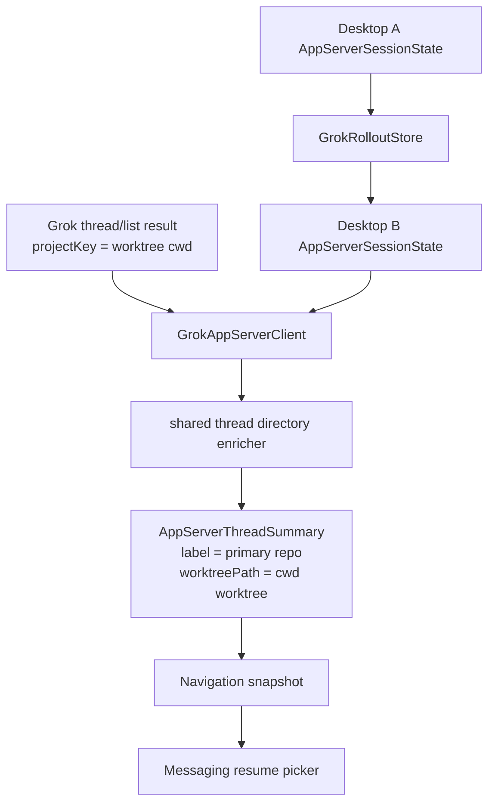

# fix: Normalize Grok messaging thread workspaces

## Overview

Add failing coverage and a focused fix for two Grok-backed messaging regressions:

- Grok threads created in launchpad worktrees are shown in messaging pickers with the worktree directory name instead of the primary project name.
- A Grok thread created by one already-running desktop instance is not visible to another already-running desktop instance until that second instance refreshes its in-memory agent-core state.

This plan deliberately avoids the larger storage redesign. The current fix should keep the existing Grok TOML plus JSONL rollout storage, add characterization tests first, and make the smallest safe refresh/enrichment changes needed for parity with Codex thread browsing.

## Problem Frame

The concrete evidence from the protocol capture and logs is:

- `thread-eksfk3v0` was started through the Grok app server with a `cwd`/`projectKey` ending in `.worktrees/launchpad-pwragnt-main-moohzbj1`.
- Later Grok `thread/list` responses returned the same `projectKey`, so `GrokAppServerClient` built a single linked directory from the worktree path.
- `messaging-resume-browser.ts` formats thread picker labels from `thread.linkedDirectories[0].label`; because the Grok linked directory label was the basename of the worktree path, Telegram showed `Messaging - Streaming Response... (launchpad-pwragnt-main-moohzbj1)` instead of `PwrAgnt`.
- The persisted Grok thread exists under the shared Grok state root, so the cross-instance visibility problem is not inherently separate state roots. The deeper issue is that each embedded `AppServerSessionState` hydrates from `GrokRolloutStore` only in its constructor. A second already-running desktop process keeps serving its stale in-memory map even after another process writes a new thread to disk.

Codex does not have the same symptoms because its thread listing path is backed by the Codex session store and the desktop already uses Git-aware thread directory enrichment for Codex summaries.

## Requirements Trace

- R1. Grok-backed thread picker labels must use the primary Git project label when the thread cwd is a worktree.
- R2. Grok directory grouping must match the thread-centric requirement that navigation groups and labels worktree threads by Git directory, not by worktree path.
- R3. `/resume` from messaging must show Grok and Codex threads using the same project-label semantics.
- R4. Two live desktop instances sharing the same Grok state root must see newly created Grok threads through `thread/list` without requiring a restart.
- R5. The fix must start with failing tests that prove both the project-label regression and the live cross-instance stale-list regression.
- R6. Do not migrate Grok state to SQLite, a new JSONL layout, or a mixed index in this thread.

## Scope Boundaries

- In scope: Grok thread summary normalization, directory enrichment, messaging resume picker labels, and live refresh of persisted Grok threads into `AppServerSessionState`.
- In scope: characterization tests around `thread-eksfk3v0` style worktree paths and two live Grok clients sharing one state root.
- Out of scope: replacing `GrokRolloutStore` with SQLite or a different canonical storage model.
- Out of scope: multi-machine sync, remote account sync, conflict-free concurrent editing, or exact recovery of in-flight turns after process death.
- Out of scope: changing Codex thread persistence or Codex app-server protocol behavior.

## Context & Research

### Relevant Code and Patterns

- `apps/desktop/src/main/grok-app-server/client.ts` currently maps Grok `thread/list` summaries into `AppServerThreadSummary` objects and defaults to `resolveLinkedDirectories`, which only turns `projectKey` into a local directory label.
- `apps/desktop/src/main/grok-app-server/client.ts` also does not preserve the raw `projectKey` on the returned `AppServerThreadSummary`, even though downstream search, diagnostics, and fallback workspace code already understand that field.
- `apps/desktop/src/main/codex-app-server/thread-directory-enricher.ts` already resolves a worktree cwd to the primary repository path, worktree path, `kind: "worktree"`, and primary repo label.
- `apps/desktop/src/main/app-server/backend-registry.ts` creates `GrokAppServerClient` without a Git-aware directory resolver and returns `grokClient.listThreads()` directly for Grok-only listings.
- `packages/agent-core/src/domain/navigation-state.ts` merges backend thread summaries with overlay state before navigation snapshots are used by the renderer and messaging runtime.
- `packages/agent-core/src/domain/directory-navigation.ts` already groups `.worktrees` paths under their repository directory when directory data carries the right path shape.
- `apps/desktop/src/main/messaging/core/messaging-resume-browser.ts` formats thread labels from linked directory labels and project picker contents from navigation directories.
- `packages/agent-core/src/app-server/session-state.ts` hydrates from `AppServerSessionStore` only in the constructor, then serves `listThreads()` from memory.
- `packages/agent-core/src/persistence/grok-rollout-store.ts` already persists `thread.toml` and `rollout.jsonl` per thread under the Grok state root.
- `apps/desktop/src/main/__tests__/grok-app-server-client.test.ts` already has a restart-only durability test where the second client is created after the first client writes the thread. The missing failing case is two clients alive at the same time.

### Institutional Learnings

- No `docs/solutions/` directory exists in this worktree yet.
- `docs/plans/2026-04-16-004-feat-grok-thread-storage-plan.md` established the current Grok storage posture: TOML config, JSONL rollouts as canonical thread artifacts, and SQLite only as a future derived index if needed.
- `docs/plans/2026-04-30-001-feat-messaging-platform-integration-plan.md` established that messaging should reuse navigation/thread contracts instead of inventing channel-specific project logic.

### External References

- External research skipped. This is a local contract and persistence-refresh bug; repo patterns are sufficient.

## Key Technical Decisions

- **Move Git-aware directory enrichment to a backend-neutral desktop module.** The existing Codex enricher is the right behavior but the wrong namespace for reuse. Move or wrap it under `apps/desktop/src/main/app-server/` so both Codex and Grok clients use the same Git-root/worktree resolution.
- **Inject the Git-aware resolver into `GrokAppServerClient` from `DesktopBackendRegistry`.** Keep Grok app-server protocol responses simple. Desktop owns the OS/Git enrichment needed for navigation and messaging labels.
- **Return primary repo path plus worktree path for Grok summaries.** A Grok thread whose cwd is inside a launchpad worktree should produce a linked directory like: `path` = primary repo, `worktreePath` = active worktree, `label` = primary repo basename, `kind` = `worktree`.
- **Preserve the raw Grok `projectKey` separately from display directories.** The display label should come from Git-aware linked directories, while `projectKey` should remain available as the backend cwd for search, diagnostics, and fallback logic.
- **Refresh persisted Grok state on list/read boundaries.** `AppServerSessionState` should merge newer or unknown records from `GrokRolloutStore` before `listThreads()` and before read/resume paths that address a thread id. This gives already-running desktop instances Codex-like visibility without changing the canonical store.
- **Use conservative merge rules.** Imported store state should add unknown threads and update known idle/completed thread metadata, messages, replay items, and response ids when the persisted `updatedAt` is newer. It should not discard active run handles or promise exact concurrent-turn conflict resolution.
- **Keep the storage redesign deferred.** If concurrent writes or query performance become problematic, they belong in the later SQLite/JSONL redesign, not in this targeted messaging consistency fix.

## Open Questions

### Resolved During Planning

- **Is the project-label bug in messaging provider code?** No. Messaging faithfully formats the linked directory label it receives. The wrong label originates from Grok thread summary enrichment.
- **Is `thread-eksfk3v0` missing because it was written to a different state root?** The available evidence says no. It exists in the default Grok state root, and the protocol capture shows the same Grok list path returning it after creation. The stale-live-instance behavior points at one-time hydration in `AppServerSessionState`.
- **Should this plan migrate Grok state to SQLite or a new store?** No. The user explicitly does not want that in this thread.

### Deferred to Implementation

- Whether the refresh path should be called eagerly at the start of every `listThreads()` or guarded by a cheap store revision/mtime check. The test should define behavior; implementation can choose the simplest performant mechanism.
- Exact conflict behavior when two live instances mutate the same Grok thread at nearly the same time. The first fix should avoid data loss in ordinary list/read visibility but does not need full multi-writer conflict resolution.

## High-Level Technical Design

> *This illustrates the intended approach and is directional guidance for review, not implementation specification. The implementing agent should treat it as context, not code to reproduce.*

## Implementation Units

- [x] **Unit 1: Add failing coverage for Grok worktree labels**

**Goal:** Prove that Grok thread summaries and messaging resume labels should use the primary project label for launchpad worktrees.

**Requirements:** R1, R2, R3, R5

**Dependencies:** None

**Files:**
- Modify: `apps/desktop/src/main/__tests__/grok-app-server-client.test.ts`
- Modify: `apps/desktop/src/main/__tests__/messaging-resume-browser.test.ts`
- Modify: `apps/desktop/src/main/__tests__/thread-directory-enricher.test.ts`

**Approach:**
- Add a Grok client test that stubs a worktree cwd ending in a launchpad worktree name and expects `listThreads()` to return a linked directory labeled with the primary repo, not the worktree basename.
- Add a messaging resume browser test where a Grok thread with a worktree linked directory renders as `Messaging - Streaming Responses (PwrAgnt)`.
- Strengthen the enricher test to cover the same launchpad worktree shape seen in the capture.

**Execution note:** Start test-first. These tests should fail against current `GrokAppServerClient` behavior before the enrichment wiring changes.

**Patterns to follow:**
- `apps/desktop/src/main/__tests__/thread-directory-enricher.test.ts`
- `apps/desktop/src/main/__tests__/grok-app-server-client.test.ts`
- `apps/desktop/src/main/__tests__/messaging-resume-browser.test.ts`

**Test scenarios:**
- Happy path: Grok `thread/list` summary with worktree cwd -> linked directory has `kind: "worktree"`, `label: "PwrAgnt"`, primary repo `path`, and worktree `worktreePath`.
- Happy path: messaging thread picker fallback text includes `Messaging - Streaming Responses (PwrAgnt)` for a Grok thread with worktree metadata.
- Edge case: missing cwd or non-Git cwd still falls back to the existing local-directory behavior without throwing.

**Verification:**
- The tests fail before implementation because Grok currently labels from the raw worktree basename.

- [x] **Unit 2: Share Git-aware thread directory enrichment across Codex and Grok**

**Goal:** Route Grok thread summary enrichment through the same Git-root/worktree resolver already used for Codex.

**Requirements:** R1, R2, R3

**Dependencies:** Unit 1

**Files:**
- Move or modify: `apps/desktop/src/main/codex-app-server/thread-directory-enricher.ts`
- Modify: `apps/desktop/src/main/app-server/backend-registry.ts`
- Modify: `apps/desktop/src/main/grok-app-server/client.ts`
- Test: `apps/desktop/src/main/__tests__/thread-directory-enricher.test.ts`
- Test: `apps/desktop/src/main/__tests__/grok-app-server-client.test.ts`

**Approach:**
- Put the directory enricher under a backend-neutral main-process location, or export a backend-neutral wrapper if moving the file would create too much churn.
- Preserve the existing Codex behavior and tests.
- Extend the Grok client resolver contract so it can carry both linked directories and observed branch when useful, or keep branch handling in the registry if that keeps the change smaller.
- Preserve the raw Grok `projectKey` on `AppServerThreadSummary` even after linked directory enrichment succeeds.
- Construct live `GrokAppServerClient` with the shared enricher from `DesktopBackendRegistry`.

**Patterns to follow:**
- `apps/desktop/src/main/codex-app-server/thread-directory-enricher.ts`
- `apps/desktop/src/main/app-server/backend-registry.ts`

**Test scenarios:**
- Happy path: both Codex and Grok clients use the same enrichment result for the same worktree cwd.
- Happy path: Grok summaries retain the raw worktree cwd in `projectKey` while using the primary repo label for linked directories.
- Edge case: the enricher cache deduplicates repeated Grok list calls for the same cwd.
- Error path: Git command failure returns a safe local-directory fallback rather than breaking `thread/list`.
- Integration: `/resume` navigation built from Grok summaries groups the thread under the primary project directory.

**Verification:**
- Grok thread picker labels and project picker grouping match Codex for worktree-backed PwrAgnt threads.

- [x] **Unit 3: Add failing live cross-instance Grok visibility coverage**

**Goal:** Prove that two already-running Grok app-server clients sharing one state root should see each other's completed thread metadata through `thread/list`.

**Requirements:** R4, R5, R6

**Dependencies:** None

**Files:**
- Modify: `packages/agent-core/src/__tests__/session-state.test.ts`
- Modify: `packages/agent-core/src/__tests__/grok-rollout-store.test.ts`
- Modify: `apps/desktop/src/main/__tests__/grok-app-server-client.test.ts`

**Approach:**
- Add an agent-core test with two `AppServerSessionState` instances over the same `GrokRolloutStore`: create a thread in the first after the second has already hydrated, then assert the second sees it on the next list/read boundary.
- Add a desktop Grok client integration test with two `GrokAppServerClient` instances constructed before the first creates a thread.
- Keep the existing restart-after-create test; this new test covers live peer refresh, not restart durability.

**Execution note:** Start test-first. The live two-client test should fail because current state hydration only runs in the constructor.

**Patterns to follow:**
- `packages/agent-core/src/__tests__/session-state.test.ts`
- `packages/agent-core/src/__tests__/grok-rollout-store.test.ts`
- `apps/desktop/src/main/__tests__/grok-app-server-client.test.ts`

**Test scenarios:**
- Happy path: state B is constructed, state A creates and persists `thread-1`, state B `listThreads()` returns `thread-1` without recreating state B.
- Happy path: client B is constructed, client A starts and names `thread-1`, client B `listThreads()` returns the named thread.
- Happy path: client B `readThread()` can read messages persisted by client A after refresh.
- Edge case: archived thread state remains respected after refresh.
- Error path: malformed persisted thread data still reports the existing store parse error rather than silently corrupting the in-memory state.

**Verification:**
- The tests fail before implementation because the second live state/client remains stale.

- [x] **Unit 4: Refresh Grok session state from store on list/read boundaries**

**Goal:** Make live embedded Grok app-server instances import persisted thread changes written by sibling instances.

**Requirements:** R4, R6

**Dependencies:** Unit 3

**Files:**
- Modify: `packages/agent-core/src/app-server/session-state.ts`
- Modify: `packages/agent-core/src/persistence/grok-rollout-store.ts` if a lightweight revision/mtime helper is needed
- Test: `packages/agent-core/src/__tests__/session-state.test.ts`
- Test: `packages/agent-core/src/__tests__/grok-rollout-store.test.ts`
- Test: `apps/desktop/src/main/__tests__/grok-app-server-client.test.ts`

**Approach:**
- Add a small refresh path to `AppServerSessionState` that can re-load the store and merge persisted records into memory.
- Call the refresh path before `listThreads()` and before read/resume operations where a missing thread id might exist on disk.
- Prefer newer persisted `updatedAt` for idle/completed thread metadata and replay data.
- Preserve active run records in the current process and do not attempt exact mid-turn recovery from another process.
- Keep writes through the existing store interface.

**Patterns to follow:**
- `packages/agent-core/src/app-server/session-state.ts`
- `packages/agent-core/src/persistence/grok-rollout-store.ts`

**Test scenarios:**
- Happy path: externally persisted new thread appears in `listThreads()` without reconstructing `AppServerSessionState`.
- Happy path: externally persisted rename and assistant message appear in `listThreads()` summary and `readThread()`.
- Edge case: current process active run handle is not removed by a refresh that loads persisted state.
- Edge case: response ids loaded from disk remain available for later turns.
- Error path: if store refresh fails, callers receive a clear error instead of a partial silent refresh.

**Verification:**
- Two live desktop Grok clients sharing one state root can see each other's completed thread summaries on the next list/read call.

- [x] **Unit 5: Verify messaging resume parity and capture evidence**

**Goal:** Confirm the end-to-end `/resume` path now shows Grok worktree threads under the same project label semantics as Codex.

**Requirements:** R1, R2, R3, R4, R5

**Dependencies:** Units 2 and 4

**Files:**
- Modify: `apps/desktop/src/main/__tests__/messaging-resume-browser.test.ts`
- Modify: `apps/desktop/src/main/__tests__/messaging-runtime.test.ts` if the runtime already has a suitable navigation snapshot test
- Reference: `apps/desktop/src/main/testing/protocol-capture.ts`

**Approach:**
- Add or extend a messaging controller/runtime test that builds a resume picker from a combined navigation snapshot containing both Codex and Grok worktree threads.
- Confirm the picker item and project filter use the primary project label, while preserving worktree path metadata for drift checks and workspace operations.
- Use protocol capture only as diagnostic evidence; do not make tests depend on local `.local` capture files.

**Patterns to follow:**
- `apps/desktop/src/main/messaging/core/messaging-resume-browser.ts`
- `apps/desktop/src/main/__tests__/messaging-resume-browser.test.ts`
- `apps/desktop/src/main/testing/protocol-capture.ts`

**Test scenarios:**
- Happy path: `/resume` recents includes a Grok worktree thread with `(PwrAgnt)` suffix.
- Happy path: `/resume --projects` groups the Grok worktree thread under `PwrAgnt`, not under the launchpad worktree basename.
- Integration: combined Codex plus Grok navigation keeps both sources visible and sorted by recency.
- Edge case: if Grok is temporarily unavailable, existing Codex resume behavior is unchanged.

**Verification:**
- Messaging resume output no longer exposes launchpad worktree names as project labels for Grok threads.

## System-Wide Impact

- **Interaction graph:** Grok `thread/list` -> `GrokAppServerClient` -> directory enrichment -> navigation snapshot -> messaging resume browser.
- **Error propagation:** Git enrichment failures should degrade to a safe local-directory fallback. Store refresh failures should surface as real backend errors because hidden stale state is worse than an actionable failure.
- **State lifecycle risks:** The refresh path introduces multi-process read visibility but not full multi-writer conflict resolution. Active run handles must remain process-local.
- **API surface parity:** No protocol shape change is required. This is normalization and state hydration behind the existing `thread/list` and `thread/read` surfaces.
- **Integration coverage:** Unit tests alone are not enough; the plan needs a combined navigation/messaging resume test because the bug was visible only after backend summaries flowed into messaging labels.
- **Unchanged invariants:** Grok thread ids, existing `thread.toml`/`rollout.jsonl` layout, Codex thread behavior, and messaging provider adapters remain unchanged.

## Risks & Dependencies

| Risk | Mitigation |
|------|------------|
| Refreshing from disk on every list becomes expensive as thread count grows. | Start simple, but allow implementation to add a lightweight store revision/mtime guard if tests remain deterministic. Defer indexing to the future storage redesign. |
| Two live instances edit the same thread concurrently. | Preserve active run handles and prefer newer persisted completed metadata only. Record full conflict resolution as out of scope for the later store redesign. |
| Moving the enricher from a Codex namespace causes import churn. | Keep the move narrow, or add a backend-neutral wrapper first if that is safer. |
| Git-aware enrichment changes labels for existing Grok threads. | This is intended for worktree paths and aligns with the thread-centric requirements. Non-Git and missing paths keep fallback behavior. |

## Documentation / Operational Notes

- No user-facing docs are required for the targeted fix.
- If implementation finds that `GROK_APP_SERVER_STATE_ROOT` or `state_root` config differences are causing a separate local issue, document that as diagnostic output or a follow-up. Do not solve it by changing the storage model in this plan.

## Sources & References

- **Origin document:** `docs/brainstorms/2026-04-16-thread-centric-agent-desktop-requirements.md`
- Related requirements: `docs/brainstorms/2026-04-30-messaging-platform-integration-requirements.md`
- Related plan: `docs/plans/2026-04-16-004-feat-grok-thread-storage-plan.md`
- Related plan: `docs/plans/2026-04-30-001-feat-messaging-platform-integration-plan.md`
- Related code: `apps/desktop/src/main/grok-app-server/client.ts`
- Related code: `apps/desktop/src/main/app-server/backend-registry.ts`
- Related code: `apps/desktop/src/main/codex-app-server/thread-directory-enricher.ts`
- Related code: `apps/desktop/src/main/messaging/core/messaging-resume-browser.ts`
- Related code: `packages/agent-core/src/app-server/session-state.ts`
- Related code: `packages/agent-core/src/persistence/grok-rollout-store.ts`
- Diagnostic capture pattern: `apps/desktop/.local/protocol-captures/2026-05-02T15-26-23-136Z-grok-default.jsonl`
