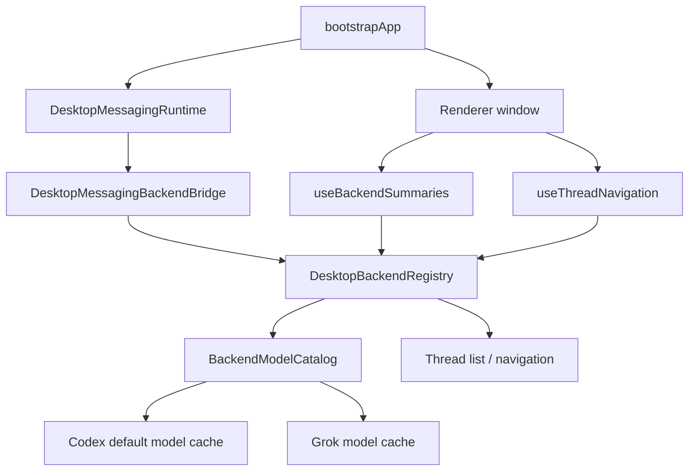
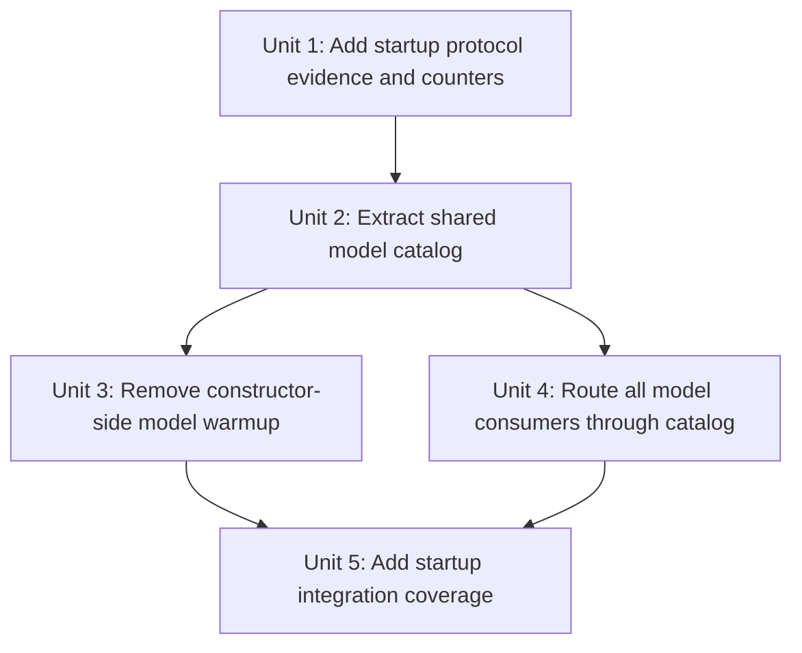

# fix: Stop duplicate Grok startup model chatter

## Overview

Make backend model discovery observable, explicit, and single-flight across startup consumers. Grok should not issue repeated `model/list` requests because messaging startup, renderer backend summaries, launchpad normalization, or thread-start defaults each asks for model options through a different path. For this pass, model discovery should be first-consumer driven rather than constructor-driven: messaging startup may construct backend bridges, but the first real model consumer, such as renderer backend summaries or launchpad model resolution, owns the initial fetch through the shared catalog.

## Implementation Progress

- Implemented protocol diagnostics and capture analysis so backend requests can be counted by method and attributed by caller reason/cache owner when available.
- Implemented `BackendModelCatalog` as the shared Codex/Grok single-flight model cache with cached successes and retry after failed discovery.
- Removed constructor-side model warmup from `DesktopBackendRegistry`; constructing the registry no longer calls Codex or Grok `listModels()`.
- Routed backend summaries, launchpad/default model resolution, thread-start defaults, and settings refresh through the shared catalog with caller reasons.
- Added focused unit coverage for catalog coalescing/retry, registry lazy model discovery, protocol capture analysis, and protocol log diagnostics.
- Deferred the heavier startup E2E capture fixture; the new analyzer provides the manual acceptance workflow for live startup captures.

## Problem Frame

The latest startup log shows Grok being initialized and asked for `model/list` before the renderer window exists. That happens because `bootstrapApp()` starts messaging before `createMainWindow()`, and `DesktopMessagingRuntime` constructs `DesktopMessagingBackendBridge`, whose default constructor calls `getDesktopBackendRegistry()`. The registry constructor currently creates the Grok client and starts model discovery as a constructor side effect.

The pasted log contains one visible Grok `model/list` and multiple Grok `thread/list` calls, while the user report says they are seeing many Grok model-list calls within seconds. This mismatch is itself part of the bug: current protocol logs show backend, method, direction, and rpc id, but not the higher-level registry instance or caller reason that caused a request. The implementation needs to prove whether remaining chatter is duplicate model discovery, duplicate backend registry construction, dev-process restart behavior, or navigation/thread-list fan-out being misread as model-list chatter.

This plan builds on the thread-refresh direction that broad startup work should be scoped, cache-first, and stable rather than eager and repeated (see origin: `docs/brainstorms/2026-04-18-desktop-thread-refresh-model-requirements.md`).

## Requirements Trace

- R1. A single desktop app process must not issue more than one successful Grok `model/list` request during startup unless an explicit invalidation event occurs.
- R2. Messaging startup must not independently trigger Grok model discovery just because it constructs a backend bridge.
- R3. Renderer backend summaries, directory launchpad defaults, and Grok thread creation must share one Grok model catalog cache.
- R4. Every backend model-list request logged or captured in development must be attributable to a caller reason and registry/cache instance.
- R5. When Grok model discovery fails during early startup, later model consumers may retry once the relevant consumer asks again, but failures must not produce tight retry loops.
- R6. Grok thread listing and navigation snapshot refreshes are separate from model discovery; the implementation must classify and verify them separately so `thread/list` fan-out is not mistaken for `model/list`.
- R7. Existing Codex behavior must remain intact: default Codex models are discovered once and full-access Codex does not issue its own model-list request unless explicitly required.

## Scope Boundaries

- This plan does not remove Grok as a configured backend or hide it from provider selectors.
- This plan does not change the Grok app-server protocol contract or the shape of `model/list` responses.
- This plan does not solve all startup `thread/list` or Codex full-access initialization chatter, except where instrumentation needs to distinguish those methods from Grok model discovery.
- This plan does not change messaging provider behavior or channel workflows beyond avoiding accidental backend model discovery from messaging bridge construction.
- This plan does not add user-facing settings for model discovery policy.

## Context & Research

### Relevant Code and Patterns

- `apps/desktop/src/main/index.ts` starts `DesktopMessagingRuntime` before creating the renderer window. Any backend work reachable from messaging startup happens before the user can interact with the UI.
- `apps/desktop/src/main/messaging/messaging-runtime.ts` constructs controllers and subscribes to backend events during `start()`.
- `apps/desktop/src/main/messaging/desktop-backend-bridge.ts` defaults its `registry` constructor argument to `getDesktopBackendRegistry()`, which can instantiate the backend registry even when messaging has not handled an inbound user action.
- `apps/desktop/src/main/app-server/backend-registry.ts` owns Codex/Grok clients, backend summaries, launchpad model option resolution, and thread start defaults. It already has Codex and Grok model memoization, but model warmup still starts from the constructor.
- `apps/desktop/src/main/grok-app-server/client.ts` now coalesces concurrent initialization inside one client, but that does not protect against multiple registry instances, constructor-side warmups, or independent cache objects.
- `apps/desktop/src/renderer/src/lib/useBackendSummaries.ts` calls `listBackends()` on renderer mount, which is a legitimate model-summary consumer if backend summaries include live model options.
- `apps/desktop/src/renderer/src/lib/useThreadNavigation.ts` calls `getNavigationSnapshot()` on renderer mount, which explains startup `thread/list` calls and should be analyzed separately from `model/list`.
- `apps/desktop/src/main/testing/protocol-capture.ts` and `apps/desktop/src/main/app-server/protocol-log-observer.ts` already capture protocol traffic, but they do not attach registry/cache instance ids or caller reasons.
- `apps/desktop/src/main/__tests__/backend-registry.test.ts` already contains focused model-list count coverage for Codex and Grok reuse. That is the primary unit-test pattern to extend.
- `apps/desktop/src/main/__tests__/grok-app-server-client.test.ts` already covers client-level concurrent initialization coalescing. Registry/cache-level duplication needs separate tests.
- `apps/desktop/src/renderer/src/lib/__tests__/useBackendSummaries.test.tsx`, `apps/desktop/src/main/__tests__/messaging-runtime.test.ts`, and `apps/desktop/src/main/__tests__/app-server-ipc.test.ts` cover the startup-adjacent consumers that can accidentally trigger backend work.

### Institutional Learnings

- No `docs/solutions/` directory exists in this worktree, so there are no durable solution learnings to carry forward.
- `docs/plans/2026-04-18-003-fix-desktop-thread-refresh-model-plan.md` established that summary refresh and selected-thread runtime state should be separated. This plan applies the same separation to model metadata: model catalog discovery should not be coupled to generic registry construction or thread-list refresh.
- `docs/plans/2026-04-19-001-fix-desktop-startup-thread-stability-plan.md` identified startup churn caused by broad navigation refresh and expensive main-process fan-out. This plan narrows one remaining startup surface: backend model metadata discovery.

### External References

- None. The problem is local Electron main-process lifecycle, registry caching, and protocol instrumentation. Existing repo patterns are sufficient.

## Key Technical Decisions

- **Move model discovery out of `DesktopBackendRegistry` construction.** Registry construction should wire clients and stores, not issue protocol requests. This keeps messaging bridge creation from causing hidden Grok traffic before the renderer exists.
- **Introduce one process-wide backend model catalog owner.** Codex and Grok model caches should live behind one explicit model catalog service or registry-owned collaborator with single-flight behavior, cached successes, controlled retry after failures, and caller-reason telemetry.
- **Keep live model data available to real model consumers.** `listBackends()`, launchpad model normalization, and Grok `startThread()` may still need model options, but they must ask through the shared catalog and reuse the same result.
- **Use first-consumer discovery, not startup warmup, in this iteration.** Renderer backend summaries are a legitimate model consumer on app mount; messaging bridge construction is not. This makes a no-interaction startup easier to reason about because any Grok `model/list` after the renderer mounts can be attributed to `backend-summary`, not hidden main-process warmup.
- **Tag model discovery by reason, not just backend.** Development protocol logs and capture metadata should identify whether a model fetch came from startup warmup, backend summary rendering, launchpad normalization, thread start defaulting, settings refresh, or explicit invalidation.
- **Separate model-list verification from thread-list verification.** The user-facing complaint is about model chatter, while the pasted trace also shows navigation `thread/list` fan-out. The implementation should report counts by method so the next diagnosis does not collapse them together.
- **Preserve retry semantics for real failures.** A transient failed `model/list` should clear the in-flight promise so a later model consumer can retry, but startup should not immediately re-trigger the same failed request from multiple consumers.

## Open Questions

### Resolved During Planning

- **Should Grok model discovery remain hidden in registry construction?** No. Constructor-side protocol traffic makes it hard to reason about startup and lets messaging trigger model discovery without a user-facing model need.
- **Should the fix focus only on Grok client initialization coalescing?** No. Client-level initialize coalescing is necessary but insufficient; the remaining risk is registry/cache-level fan-out and hidden startup callers.
- **Should `thread/list` be treated as proof that model-list caching failed?** No. The implementation must count `model/list` separately from `thread/list` and explain each request class.

### Deferred to Implementation

- The exact shape of caller-reason propagation through the registry and protocol observer. The implementation should choose the smallest local API that keeps tests readable.
- Whether protocol capture files should store caller reason directly on each JSONL row or whether the reason should be logged through a parallel diagnostic event. The testable requirement is attributable evidence, not a specific storage shape.

## High-Level Technical Design

> *This illustrates the intended approach and is directional guidance for review, not implementation specification. The implementing agent should treat it as context, not code to reproduce.*

| Consumer | Should it trigger Grok `model/list`? | Expected behavior |
|---|---:|---|
| Messaging bridge construction | No | Construct registry/bridge without protocol model traffic |
| Renderer `listBackends()` | Yes, if backend summaries include live model options | First real startup consumer; fetch through shared catalog and label reason as `backend-summary` |
| Navigation snapshot / `thread/list` | No | List threads without touching model catalog |
| Directory launchpad normalization | Yes, if resolving Grok model settings | Reuse shared catalog and fallback models if unavailable |
| Grok `startThread()` without explicit model | Yes, if no cached/default model exists | Reuse shared catalog, with controlled retry after prior failure |
| Settings/discovery refresh | Yes, explicitly | Invalidate or refresh through one named path |

## Implementation Units

- [x] **Unit 1: Add startup protocol evidence and counters**

**Goal:** Make every startup model-list request attributable before changing cache behavior, so the implementation can prove what remains.

**Requirements:** R1, R4, R6

**Dependencies:** None

**Files:**
- Modify: `apps/desktop/src/main/app-server/protocol-log-observer.ts`
- Modify: `apps/desktop/src/main/testing/protocol-capture.ts`
- Modify: `apps/desktop/src/main/testing/capture-store.ts`
- Create: `apps/desktop/scripts/analyze-protocol-capture.ts`
- Test: `apps/desktop/src/main/__tests__/protocol-capture.test.ts`
- Test: `apps/desktop/src/main/__tests__/codex-thread-protocol-analysis.test.ts`

**Approach:**
- Extend development-only protocol diagnostics so captured/logged request rows can be grouped by backend, backend instance, method, registry/cache instance, and caller reason when that metadata is available.
- Add a small capture analysis path that reports method counts and first/last timestamps by backend. This should make `model/list`, `thread/list`, `initialize`, account reads, and rate-limit reads visibly distinct.
- Keep raw JSON-RPC envelopes unchanged; attach diagnostics as capture metadata or sidecar fields that do not alter protocol behavior.

**Execution note:** Characterization-first. Capture the current startup method-count behavior before using the analyzer to validate the later units.

**Patterns to follow:**
- `apps/desktop/src/main/testing/protocol-capture.ts`
- `apps/desktop/src/main/app-server/protocol-log-observer.ts`
- `apps/desktop/scripts/analyze-codex-thread-protocol.ts`

**Test scenarios:**
- Happy path: a capture containing one Grok `initialize`, one Grok `model/list`, and two Grok `thread/list` rows reports those as separate method counts.
- Happy path: protocol log output for a model-list request includes backend, method, request id, and caller reason when supplied.
- Edge case: existing capture files without caller metadata still analyze successfully and report method counts.
- Error path: malformed JSONL rows are skipped with a diagnostic count rather than failing the entire analysis.

**Verification:**
- Developers can point the analyzer at a protocol capture and determine whether Grok made duplicate `model/list` calls or only duplicate `thread/list` calls.

- [x] **Unit 2: Extract a shared backend model catalog**

**Goal:** Centralize Codex and Grok model discovery behind one single-flight cache that all registry paths share.

**Requirements:** R1, R3, R5, R7

**Dependencies:** Unit 1

**Files:**
- Create: `apps/desktop/src/main/app-server/backend-model-catalog.ts`
- Modify: `apps/desktop/src/main/app-server/backend-registry.ts`
- Test: `apps/desktop/src/main/__tests__/backend-model-catalog.test.ts`
- Test: `apps/desktop/src/main/__tests__/backend-registry.test.ts`

**Approach:**
- Move model caching and in-flight promise ownership out of ad hoc registry fields into a focused catalog object.
- Preserve the current successful-cache behavior: once Grok model discovery succeeds, subsequent backend summaries, launchpad normalization, and thread starts reuse the same result.
- Preserve controlled retry after failure: a failed fetch clears only the failed in-flight promise for that backend so a later real consumer can retry.
- Include caller reason in catalog calls so diagnostics can distinguish startup warmup from renderer summaries and thread creation defaults.
- Keep fallback model behavior in `buildLaunchpadOptions()` and model-setting resolution; the catalog should own discovery state, not product fallback rules.

**Patterns to follow:**
- Existing `readCodexDefaultModelsOnce()` and `readGrokDefaultModelsOnce()` behavior in `apps/desktop/src/main/app-server/backend-registry.ts`
- `apps/desktop/src/main/__tests__/backend-registry.test.ts`

**Test scenarios:**
- Happy path: two concurrent Grok model consumers share one in-flight `model/list` request and both receive the same model set.
- Happy path: sequential Grok consumers after a successful discovery do not issue another `model/list`.
- Happy path: Codex default model discovery still hits only the default client and not the full-access client.
- Edge case: Grok discovery returning an empty list caches the successful empty result and lets fallback options be built by existing fallback logic.
- Error path: the first Grok discovery failure does not poison the cache forever; a later consumer can retry and then cache success.
- Integration: `listBackends()`, `ensureDirectoryLaunchpad()`, and Grok `startThread()` share the same catalog result.

**Verification:**
- Model discovery count is bounded by catalog state rather than by how many registry methods request model options.

- [x] **Unit 3: Remove constructor-side model warmup**

**Goal:** Stop backend registry construction from issuing Grok or Codex model-list requests implicitly.

**Requirements:** R1, R2, R4

**Dependencies:** Unit 2

**Files:**
- Modify: `apps/desktop/src/main/app-server/backend-registry.ts`
- Modify: `apps/desktop/src/main/messaging/desktop-backend-bridge.ts`
- Modify: `apps/desktop/src/main/messaging/messaging-runtime.ts`
- Test: `apps/desktop/src/main/__tests__/backend-registry.test.ts`
- Test: `apps/desktop/src/main/__tests__/messaging-runtime.test.ts`

**Approach:**
- Remove eager model-list calls from `DesktopBackendRegistry` construction.
- Do not add a replacement startup warmup path in this pass. Defer model discovery until the first real model consumer asks for it, with renderer backend summaries expected to be the first normal startup consumer.
- Ensure `DesktopMessagingBackendBridge` can be constructed and subscribed to backend events without causing model catalog warmup.
- Keep client construction itself lightweight; constructing a Grok client should not imply `initialize` or `model/list`.

**Patterns to follow:**
- `apps/desktop/src/main/messaging/messaging-runtime.ts`
- `apps/desktop/src/main/messaging/desktop-backend-bridge.ts`
- `apps/desktop/src/main/__tests__/messaging-runtime.test.ts`

**Test scenarios:**
- Happy path: constructing `DesktopBackendRegistry` with mock clients does not call `listModels()` before a model-consuming method is invoked.
- Happy path: constructing `DesktopMessagingBackendBridge` does not call Grok `listModels()`.
- Happy path: starting `DesktopMessagingRuntime` with configured adapters does not call Grok `listModels()` unless an inbound workflow explicitly asks for backend model options.
- Edge case: backend event subscription still works after removing constructor warmup.
- Integration: app startup can create messaging runtime and renderer IPC handlers without hidden model-list side effects before the renderer asks for backend summaries.

**Verification:**
- Pre-renderer startup no longer emits Grok `model/list` solely because messaging created a backend bridge.

- [x] **Unit 4: Route all real model consumers through the catalog**

**Goal:** Make every legitimate model option consumer use the shared catalog and propagate caller reason.

**Requirements:** R1, R3, R4, R5, R7

**Dependencies:** Unit 2

**Files:**
- Modify: `apps/desktop/src/main/app-server/backend-registry.ts`
- Modify: `apps/desktop/src/main/ipc/agent-ipc.ts`
- Modify: `apps/desktop/src/renderer/src/lib/useBackendSummaries.ts`
- Modify: `apps/desktop/src/main/__tests__/backend-registry.test.ts`
- Modify: `apps/desktop/src/renderer/src/lib/__tests__/useBackendSummaries.test.tsx`

**Approach:**
- Route `describeCodexBackend()`, `describeSingleBackend("grok")`, `getBackendLaunchpadOptions()`, `resolveModelSettings()`, and Grok `startThread()` defaulting through the same catalog.
- Keep `listBackends()` as a real model consumer for now so existing provider selectors keep receiving live options on renderer mount, but route it through the catalog and label the caller reason as `backend-summary`.
- Propagate caller reasons such as `backend-summary`, `launchpad-defaults`, `thread-start-defaults`, and `settings-refresh`.
- Ensure settings/discovery refresh events invalidate or refresh the catalog through one path rather than constructing a new registry or bypassing the catalog.

**Patterns to follow:**
- `apps/desktop/src/main/app-server/backend-registry.ts`
- `apps/desktop/src/renderer/src/lib/useBackendSummaries.ts`
- `apps/desktop/src/renderer/src/features/composer/Composer.tsx`

**Test scenarios:**
- Happy path: renderer backend summaries mounting twice still produces at most one Grok `model/list` after successful discovery.
- Happy path: a Grok launchpad opened after backend summaries reuses the backend-summary catalog result.
- Happy path: a Grok thread start without explicit model reuses the existing catalog result and sends the expected default model.
- Edge case: if the user supplies an explicit Grok model, thread start does not need to fetch model options only to echo that explicit model.
- Error path: if backend-summary model discovery fails, the backend remains visible with fallback options and a later Grok thread-start default may retry through the catalog.
- Integration: Codex model-list count remains one on the default client across backend summaries and thread starts, with full-access unchanged.

**Verification:**
- There is exactly one code path that can call Grok `listModels()` for model metadata, and tests cover every current consumer.

- [ ] **Unit 5: Add startup integration coverage and acceptance capture workflow**

**Goal:** Prove the startup contract from the user’s repro shape and make future regressions easy to diagnose.

**Requirements:** R1, R2, R4, R6, R7

**Dependencies:** Units 1 through 4

**Files:**
- Modify: `apps/desktop/src/main/__tests__/index.test.ts`
- Modify: `apps/desktop/src/main/__tests__/messaging-runtime.test.ts`
- Modify: `apps/desktop/e2e/provider-model-selectors.spec.ts`
- Create: `apps/desktop/e2e/fixtures/grok-startup-model-chatter/`
- Test: `apps/desktop/src/main/__tests__/backend-registry.test.ts`
- Test: `apps/desktop/src/main/__tests__/grok-app-server-client.test.ts`

**Approach:**
- Add a main-process startup test that mirrors the important ordering: app ready, IPC handlers registered, messaging runtime starts, window creation follows. Assert that model discovery happens only from the intended owner and not from bridge construction.
- Add a protocol-replay or E2E fixture that captures startup through first renderer mount and asserts Grok request counts by method. The acceptance should explicitly separate `model/list` from `thread/list`.
- Keep provider selector behavior covered so deferring or centralizing model discovery does not leave the composer without model options when the user actually opens a Grok-backed launchpad or thread.
- Document the expected dev repro interpretation in a short test or fixture comment: one intentional model-list is acceptable only after the first real model consumer asks for backend summaries or model defaults; repeated model-list calls without invalidation are not acceptable.

**Patterns to follow:**
- `apps/desktop/src/main/__tests__/index.test.ts`
- `apps/desktop/src/main/__tests__/messaging-runtime.test.ts`
- `apps/desktop/e2e/provider-model-selectors.spec.ts`
- `.agents/skills/desktop-e2e-fixture-seeding/SKILL.md`

**Test scenarios:**
- Happy path: startup with messaging enabled constructs messaging runtime and renderer bridge without Grok `model/list` before the renderer backend-summary request.
- Happy path: startup with messaging disabled follows the same first-consumer model-list policy and does not hide a second code path.
- Happy path: first renderer `listBackends()` receives model options from the shared catalog or fallback policy without causing duplicate Grok discovery.
- Edge case: repeated renderer remount or dev refresh does not reuse stale process-local state across a genuinely new Electron main process; counts are scoped per process/capture.
- Error path: Grok unavailable at startup does not produce repeated failed model-list attempts from messaging plus renderer consumers.
- Integration: protocol capture analysis for a startup run reports Grok `model/list` count within the accepted policy and reports Grok `thread/list` separately.

**Verification:**
- A developer can rerun the original startup repro with protocol logging/capture and see either zero or one intentional Grok `model/list` per process, with all later Grok chatter classified by method and reason.

## System-Wide Impact

- **Interaction graph:** `bootstrapApp()` -> messaging runtime -> backend bridge -> backend registry, plus renderer `useBackendSummaries()` and `useThreadNavigation()` all share the registry. Model discovery must be owned by the catalog, while navigation/thread listing stays in the registry.
- **Error propagation:** model-list failures should degrade model options to fallbacks where possible and clear failed in-flight state for later retry. They should not fail messaging startup or renderer navigation.
- **State lifecycle risks:** caches must be process-scoped and invalidated on explicit settings/discovery refresh. They should not survive a new Electron main process, and tests must not assume cross-process reuse.
- **API surface parity:** Codex and Grok should use the same catalog abstraction, with Codex retaining its default/full-access distinction and Grok retaining one default client.
- **Integration coverage:** unit tests must cover catalog behavior; startup-adjacent integration tests must cover messaging and renderer consumers together; protocol capture analysis must validate real method counts.
- **Unchanged invariants:** Grok `model/list` response normalization, thread listing, thread read/start, and messaging command semantics remain unchanged.

## Risks & Dependencies

| Risk | Mitigation |
|------|------------|
| The implementation fixes model-list count but leaves confusing thread-list chatter. | Add capture analysis that reports method counts separately and include acceptance criteria for both `model/list` and `thread/list` classification. |
| Moving warmup out of the constructor causes model selectors to render fallback options longer than before. | Keep `listBackends()` as a legitimate catalog consumer or provide cached/fallback options with a follow-up refresh event when live models arrive. |
| Multiple registry instances still exist in tests or dev-only paths. | Add registry/cache instance ids in diagnostics and tests that construct messaging plus renderer-adjacent consumers through the same singleton. |
| Transient Grok failures trigger repeated retries from multiple startup consumers. | Use single-flight failure clearing with retry only on later explicit consumer calls, not immediate multi-consumer loops. |
| Codex full-access starts fetching model lists accidentally while refactoring shared catalog code. | Preserve and extend tests asserting only the Codex default client performs model discovery. |

## Documentation / Operational Notes

- Update any startup troubleshooting notes only if the implementation adds a developer-facing capture analyzer or changes expected protocol log interpretation.
- No user-facing documentation is required unless model selector loading behavior visibly changes.
- The final implementation handoff should include a sample startup capture summary showing Grok `initialize`, `model/list`, and `thread/list` counts separately.

## Sources & References

- Origin document: `docs/brainstorms/2026-04-18-desktop-thread-refresh-model-requirements.md`
- Related plan: `docs/plans/2026-04-18-003-fix-desktop-thread-refresh-model-plan.md`
- Related plan: `docs/plans/2026-04-19-001-fix-desktop-startup-thread-stability-plan.md`
- Related code: `apps/desktop/src/main/index.ts`
- Related code: `apps/desktop/src/main/app-server/backend-registry.ts`
- Related code: `apps/desktop/src/main/grok-app-server/client.ts`
- Related code: `apps/desktop/src/main/messaging/desktop-backend-bridge.ts`
- Related code: `apps/desktop/src/main/messaging/messaging-runtime.ts`
- Related code: `apps/desktop/src/renderer/src/lib/useBackendSummaries.ts`
- Related code: `apps/desktop/src/renderer/src/lib/useThreadNavigation.ts`
- Related tests: `apps/desktop/src/main/__tests__/backend-registry.test.ts`
- Related tests: `apps/desktop/src/main/__tests__/grok-app-server-client.test.ts`
- Related tests: `apps/desktop/src/main/__tests__/messaging-runtime.test.ts`
- Related tests: `apps/desktop/src/renderer/src/lib/__tests__/useBackendSummaries.test.tsx`
