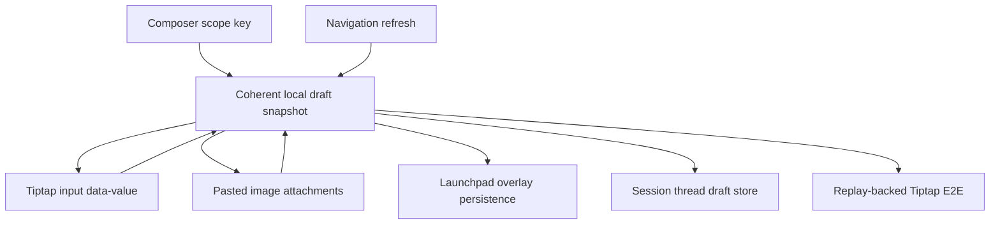
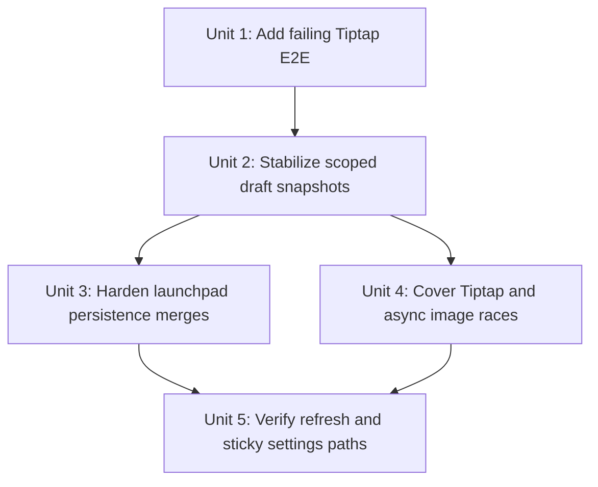

# fix: Preserve composer drafts across navigation

## Overview

Stabilize desktop composer draft ownership so unsent Tiptap text and pasted images survive Directories launchpad navigation, existing-thread switching, settings overlays, and navigation refreshes. The fix should treat draft text, skill tokens, and image attachments as one coherent scoped draft instead of allowing separate save paths to race.

## Problem Frame

The origin report describes user work being lost before send: a Directories `+` launchpad kept a pasted screenshot but dropped text, and an existing thread reply later lost both text and screenshots. Existing tests cover adjacent behaviors, but the full app-level Tiptap flow is not covered. The implementation needs to protect unsent composer content as user data while preserving the current launchpad and thread send semantics. (see origin: `docs/brainstorms/2026-05-02-desktop-composer-draft-persistence-regression-requirements.md`)

## Requirements Trace

- R1, R2, R3. Directories launchpad prompt text and pasted images survive switching away and back as one coherent draft.
- R4, R5, R6. Existing-thread reply text and pasted images survive thread switching, settings overlays, and navigation refreshes as one coherent draft.
- R7, R8, R9. Tiptap composer variants are first-class in tests and behavior, including canonical `data-value`, skill-token text, and multiline content.
- R10, R11, R12. Refresh, debounced autosave, and delayed image normalization cannot overwrite newer local unsent state or split text from images.
- R13. Sticky launchpad setting changes preserve prompt text and image attachments.
- R14, R15, R16, R17. Add app-level replay-backed E2E coverage for the reported Tiptap launchpad and existing-thread workflow, including a refresh-capable boundary.

## Scope Boundaries

- This plan does not redesign the composer UI.
- This plan does not add multiple launchpad drafts per directory.
- This plan does not change how a launchpad becomes a real thread on first send.
- This plan keeps existing-thread reply drafts renderer-session scoped; it does not add cross-app restart persistence for existing-thread reply drafts.
- This plan does not broaden image format support beyond existing pasted-image attachment behavior.

## Context & Research

### Relevant Code and Patterns

- `apps/desktop/src/renderer/src/features/composer/Composer.tsx` owns the draft string, Tiptap/custom/textarea selection, skill tokens, image attachments, launchpad autosave, paste/drop handling, and thread-scoped in-memory draft map.
- `apps/desktop/src/renderer/src/features/composer/ComposerTiptapInput.tsx` exposes the Tiptap canonical draft through `data-value` and handles text/html paste behavior for Tiptap variants.
- `apps/desktop/src/renderer/src/lib/useThreadNavigation.ts` owns Directories launchpad selection, navigation refresh, `ensureDirectoryLaunchpad`, `updateDirectoryLaunchpad`, and local navigation snapshot application through `applyLaunchpadUpdate`.
- `apps/desktop/src/main/app-server/backend-registry.ts` persists launchpad updates through `updateDirectoryLaunchpad` and merges sticky settings defaults into `NavigationLaunchpadDraft`.
- `packages/agent-core/src/persistence/overlay-store.ts` stores `directoryLaunchpads` and `launchpadDefaults`; `packages/shared/src/contracts/navigation.ts` defines `NavigationLaunchpadDraft` and launchpad image attachment shape.
- `apps/desktop/e2e/directory-launchpad-skills.spec.ts` is the strongest existing Tiptap launchpad E2E pattern and already uses `PWRAGNT_EXPERIMENTAL_CHAT_REPLY_COMPOSER` variants plus `composer-tiptap-input` assertions.
- `apps/desktop/e2e/composer-image-thread-switch.spec.ts` covers delayed image normalization after switching away from a newly created thread, but it uses the textarea-oriented paste helper and does not cover launchpad text-plus-image persistence.
- `apps/desktop/e2e/composer-draft-settings.spec.ts` covers Tiptap text draft persistence through settings for an existing thread, but not pasted images or Directories launchpads.
- `apps/desktop/src/renderer/src/features/composer/__tests__/composer.test.tsx` has launchpad pasted-image tests, including delayed normalization, but those tests currently exercise the default composer path rather than the Tiptap path.

### Institutional Learnings

- No `docs/solutions/` directory exists in this worktree, so there are no indexed institutional learnings to apply.
- `docs/plans/2026-04-30-001-fix-composer-skill-autocomplete-plan.md` established the composer invariant that the canonical draft string remains the source of truth for send behavior, draft persistence, launchpad hydration, and thread-scoped draft storage.
- `docs/plans/2026-04-18-003-fix-desktop-thread-refresh-model-plan.md` established that sidebar/navigation refreshes must not destabilize the selected thread surface.

### External References

- External research is not needed. The work is bounded to existing React renderer state, existing Tiptap integration, replay-backed Electron E2E patterns, and existing launchpad overlay persistence.

## Key Technical Decisions

- **Add the failing app-level Tiptap E2E first.** The reported loss crosses composer, navigation, overlay persistence, image normalization, and refresh, so unit tests alone cannot prove the regression is fixed.
- **Make scoped draft state coherent.** Treat `draft`, `skillTokens`, and `imageAttachments` as one snapshot for a composer scope. Any save, restore, paste completion, launchpad update, settings change, or scope switch should operate on that snapshot rather than separate text and image paths.
- **Keep existing-thread drafts renderer-session scoped.** The origin explicitly excludes cross-app restart persistence for existing-thread drafts. The practical fix is to ensure renderer-session thread drafts survive component rerenders, settings overlays, selection changes, and navigation refreshes.
- **Make launchpad local state immediate and persistence merge-safe.** The active UI should not wait on a 250ms debounced IPC write before navigation can preserve prompt text. Persistence can remain asynchronous, but scope changes and refresh merges must not overwrite newer local draft state with stale launchpad data.
- **Use Tiptap canonical values in assertions.** E2Es and component tests should assert `composer-tiptap-input` `data-value` plus visible `Pasted images` attachment previews because that is the editor path currently used in the app.

## Open Questions

### Resolved During Planning

- **Should launchpad autosave become immediate, flush before navigation, or merge after refresh?** Use a combined approach: keep local launchpad draft state immediate, flush the current scope before selection changes or unmounts, and guard async navigation/persistence responses from replacing newer local state.
- **Should existing-thread reply drafts move to persistent overlay storage?** No for this fix. Keep them renderer-session scoped, but hoist or stabilize their storage so refresh and remount boundaries cannot drop them.
- **What refresh-capable E2E boundary should prove the regression?** Use a replayed thread lifecycle or navigation snapshot refresh that exercises the real `useThreadNavigation` refresh path before final draft assertions.
- **Which sticky settings are risky?** Provider, execution mode, model, reasoning, service tier, fast mode, work mode, and branch updates all patch launchpad state; each patch must preserve prompt and image attachments.

### Deferred to Implementation

- Exact helper internals for the scoped draft store.
- Exact stale-response guard shape for launchpad updates, as long as it rejects older async responses in favor of newer local draft state.

## High-Level Technical Design

> *This illustrates the intended approach and is directional guidance for review, not implementation specification. The implementing agent should treat it as context, not code to reproduce.*

The important behavior is that every composer scope has a single local draft snapshot. Launchpad scopes additionally persist that snapshot to the overlay store; thread scopes retain it in renderer session memory. Navigation refresh may update sidebar metadata, but it must not replace a newer local draft snapshot with stale persisted state.

## Implementation Units

- [x] **Unit 1: Add failing Tiptap draft persistence E2E**

**Goal:** Capture the reported regression in a deterministic Electron E2E before changing implementation behavior.

**Requirements:** R1, R2, R3, R4, R5, R6, R7, R8, R14, R15, R16, R17

**Dependencies:** None

**Files:**
- Create: `apps/desktop/e2e/composer-draft-persistence-regression.spec.ts`
- Modify: `apps/desktop/e2e/fixtures/electron-app.ts` only if the replay helper needs a small reusable operation for this fixture
- Test: `apps/desktop/e2e/composer-draft-persistence-regression.spec.ts`

**Approach:**
- Build a replay fixture inline in the spec, following `directory-launchpad-skills.spec.ts` and `composer-image-thread-switch.spec.ts`.
- Seed one Git directory so Directories shows a `+` launchpad and one existing thread linked to that directory or available in Recents.
- Launch with the Tiptap composer variant that matches current app usage, then open Directories, click `+`, type launchpad text, and paste at least one generated PNG image into the Tiptap textbox.
- Switch to an existing thread, type reply text, and paste a different generated PNG image into the reply composer.
- Trigger a refresh-capable boundary through replayed lifecycle or navigation update, then return to the launchpad and existing thread.
- Assert `composer-tiptap-input` `data-value` for each scope and visible `Pasted images` previews for each scope.

**Execution note:** Test-first. This unit should fail against the current broken behavior or prove the suspected gap if the implementation has already changed.

**Patterns to follow:**
- `apps/desktop/e2e/directory-launchpad-skills.spec.ts` for Tiptap launchpad setup and `composer-tiptap-input` assertions.
- `apps/desktop/e2e/composer-image-thread-switch.spec.ts` for generated image paste and delayed image-normalization race coverage.
- `apps/desktop/e2e/composer-draft-settings.spec.ts` for existing-thread Tiptap draft assertions through settings.

**Test scenarios:**
- Integration: launchpad Tiptap text plus image -> switch away -> refresh boundary -> reopen same directory `+` -> same text and image remain.
- Integration: existing-thread Tiptap reply text plus image -> switch away -> refresh boundary -> return to thread -> same text and image remain.
- Edge case: the launchpad image preview remains visible while `data-value` also remains non-empty, proving partial persistence does not pass.
- Edge case: the existing-thread reply image preview remains visible while `data-value` also remains non-empty.
- Regression: the refresh boundary does not change the selected thread unexpectedly or materialize the launchpad before send.

**Verification:**
- The E2E fails if either scope loses text, images, or the pairing of both.

- [x] **Unit 2: Stabilize scoped draft snapshots in the composer**

**Goal:** Make draft save and restore operate on one coherent scoped snapshot for Tiptap text, skill tokens, and pasted images.

**Requirements:** R3, R4, R5, R6, R7, R8, R9, R10, R12

**Dependencies:** Unit 1

**Files:**
- Modify: `apps/desktop/src/renderer/src/features/composer/Composer.tsx`
- Modify: `apps/desktop/src/renderer/src/features/composer/ComposerTiptapInput.tsx` only if Tiptap change timing needs a safer canonical-value callback
- Create: `apps/desktop/src/renderer/src/features/composer/useComposerDraftStore.ts`
- Test: `apps/desktop/src/renderer/src/features/composer/__tests__/composer.test.tsx`
- Test: `apps/desktop/src/renderer/src/features/composer/__tests__/ComposerTiptapInput.test.tsx`

**Approach:**
- Introduce a clear internal draft snapshot concept containing canonical draft text, skill tokens, and image attachments.
- Save the current scope snapshot before switching composer scopes and when the component unmounts.
- Restore from the snapshot for thread scopes and from the local launchpad snapshot for launchpad scopes before falling back to persisted launchpad props.
- Ensure Tiptap text changes update the canonical snapshot promptly enough that a selection change cannot observe stale text.
- Ensure delayed image normalization merges into the original scope snapshot without overwriting newer text for that scope.
- Preserve existing send, steer, slash command, review command, and image attachment behaviors.

**Patterns to follow:**
- Current `composerScopeKey`, `saveThreadComposerDraft`, `pasteScopeRef`, and Tiptap `data-value` flow in `Composer.tsx`.
- Current launchpad delayed image tests in `apps/desktop/src/renderer/src/features/composer/__tests__/composer.test.tsx`.

**Test scenarios:**
- Happy path: Tiptap launchpad text and image are saved as one snapshot when switching to another launchpad or thread.
- Happy path: Tiptap existing-thread reply text and image are restored after switching to another thread and back.
- Edge case: delayed image normalization finishing after scope switch appends to the original scope and preserves that scope's latest text.
- Edge case: skill-token text in a Tiptap draft survives scope switch without losing the selected skill token or plain text around it.
- Edge case: multiline Tiptap content survives scope switch and restore with the same canonical `data-value`.
- Regression: empty draft scopes still clear from the in-memory store so stale images or text do not reappear after explicit clear/send.

**Verification:**
- Composer-level tests prove scope switching cannot separate text, skill tokens, and image attachments for Tiptap scopes.

- [x] **Unit 3: Harden launchpad overlay persistence and navigation refresh merging**

**Goal:** Prevent debounced launchpad autosave, sticky setting patches, and navigation refreshes from replacing newer local launchpad drafts with older persisted state.

**Requirements:** R1, R2, R3, R10, R11, R12, R13

**Dependencies:** Unit 2

**Files:**
- Modify: `apps/desktop/src/renderer/src/lib/useThreadNavigation.ts`
- Modify: `apps/desktop/src/renderer/src/features/composer/Composer.tsx`
- Modify: `apps/desktop/src/main/app-server/backend-registry.ts` only if renderer-side merge protection is insufficient
- Test: `apps/desktop/src/renderer/src/lib/__tests__/useThreadNavigation.test.tsx`
- Test: `apps/desktop/src/renderer/src/features/composer/__tests__/composer.test.tsx`
- Test: `apps/desktop/src/main/__tests__/backend-registry.test.ts` if backend launchpad merge behavior changes

**Approach:**
- Treat launchpad text and images as one patch when persisting to `updateDirectoryLaunchpad`.
- Flush the current launchpad draft before changing selection away from a launchpad or before applying a navigation refresh that could rehydrate the same launchpad.
- Apply launchpad updates optimistically in the renderer so the active UI and navigation snapshot reflect the latest local draft immediately.
- Guard async `updateDirectoryLaunchpad` and `ensureDirectoryLaunchpad` responses so older responses cannot overwrite a newer local snapshot for the same directory key.
- Ensure sticky setting patches merge with current prompt and images instead of patching only settings over a stale launchpad object.
- Keep backend overlay persistence compatible with existing `NavigationLaunchpadDraft` and `UpdateDirectoryLaunchpadRequest`; avoid shared contract changes unless implementation proves they are necessary.

**Patterns to follow:**
- `applyLaunchpadUpdate` and `updateDirectoryLaunchpad` in `apps/desktop/src/renderer/src/lib/useThreadNavigation.ts`.
- `updateDirectoryLaunchpad` in `apps/desktop/src/main/app-server/backend-registry.ts`.
- `OverlayStore.upsertDirectoryLaunchpad` in `packages/agent-core/src/persistence/overlay-store.ts`.

**Test scenarios:**
- Happy path: launchpad text update followed by image update leaves both prompt and image attachment in navigation snapshot.
- Happy path: sticky model or execution-mode update preserves current prompt and image attachments.
- Edge case: a slow `updateDirectoryLaunchpad` response for an older prompt cannot overwrite a newer prompt already typed locally.
- Edge case: reopening an empty launchpad can still adopt current sticky defaults without carrying stale text or images.
- Edge case: reopening a non-empty launchpad preserves its existing prompt/images while normalizing provider/model defaults only where valid.
- Error path: failed launchpad persistence reports `launchpadError` without clearing the visible draft.

**Verification:**
- Launchpad state in the renderer remains monotonic with respect to local user edits: older persistence or refresh data cannot erase newer unsent text or images.

- [x] **Unit 4: Keep existing-thread reply drafts stable through refresh and remount boundaries**

**Goal:** Ensure existing-thread reply drafts survive thread switching, settings overlay transitions, component rerenders, and navigation refreshes without requiring restart persistence.

**Requirements:** R4, R5, R6, R7, R8, R9, R10, R12

**Dependencies:** Unit 2

**Files:**
- Modify: `apps/desktop/src/renderer/src/features/thread-detail/ThreadView.tsx`
- Modify: `apps/desktop/src/renderer/src/features/composer/Composer.tsx`
- Modify: `apps/desktop/src/renderer/src/App.tsx` only if draft storage needs to live above `ThreadView`
- Test: `apps/desktop/src/renderer/src/features/thread-detail/__tests__/thread-view.test.tsx`
- Test: `apps/desktop/src/renderer/src/features/composer/__tests__/composer.test.tsx`
- Test: `apps/desktop/e2e/composer-draft-settings.spec.ts`

**Approach:**
- Keep thread reply drafts in renderer session state, but ensure the storage owner is stable across the UI boundaries that can currently remount or rerender the composer.
- Use thread identity keys, not object identity, as draft keys so navigation snapshot reconciliation cannot orphan an existing draft.
- Save current thread draft snapshots before selecting another thread and before opening settings.
- Restore Tiptap canonical values and pasted image attachments together when returning to a thread.
- Avoid clearing a thread draft on turn lifecycle or navigation refresh unless the user successfully sends that draft or explicitly clears it.

**Patterns to follow:**
- Current `scopedThreadDraftsRef` logic in `Composer.tsx`.
- Existing `composer-draft-settings.spec.ts` Tiptap text-only flow.
- `buildThreadIdentityKey` usage in `useThreadNavigation.ts`.

**Test scenarios:**
- Happy path: existing-thread Tiptap reply text and image survive switching to a second thread and back.
- Happy path: existing-thread Tiptap reply text and image survive opening settings and returning.
- Edge case: navigation refresh that updates another thread does not clear the selected thread draft.
- Edge case: selected thread summary object changes but thread identity key stays the same -> draft remains.
- Edge case: delayed image normalization finishing while another thread is selected attaches to the original thread draft and preserves that draft's latest text.
- Regression: sending a thread reply clears only the sent draft for that thread and does not clear drafts for other threads.

**Verification:**
- Existing-thread drafts behave consistently with launchpad drafts for the current app session, without adding restart persistence.

- [x] **Unit 5: Expand regression coverage around Tiptap variants and sticky settings**

**Goal:** Close the coverage gap that allowed Tiptap-specific and settings-triggered draft loss to escape.

**Requirements:** R7, R8, R9, R13, R14, R15, R16, R17

**Dependencies:** Units 1-4

**Files:**
- Modify: `apps/desktop/e2e/composer-draft-persistence-regression.spec.ts`
- Modify: `apps/desktop/e2e/directory-launchpad-skills.spec.ts`
- Modify: `apps/desktop/src/renderer/src/features/composer/__tests__/composer.test.tsx`
- Test: `apps/desktop/e2e/composer-draft-persistence-regression.spec.ts`

**Approach:**
- Keep one required app-level E2E on the default Tiptap variant used by the app.
- Add focused component coverage for the other Tiptap variant where the difference matters, especially multiline/markdown serialization.
- Extend launchpad component tests so image persistence and delayed normalization run with `composerImplementation="tiptap-chips"` or the current default Tiptap setting, not only the textarea path.
- Add a sticky settings coverage case that changes at least one launchpad setting after text/images exist and asserts both remain.
- Keep textarea/custom-widget coverage only as compatibility regression coverage; it should not be the primary proof for this bug.

**Patterns to follow:**
- Tiptap variant loops and constants in `apps/desktop/e2e/directory-launchpad-skills.spec.ts`.
- Tiptap `data-value` assertions in `apps/desktop/e2e/skill-autocomplete-interactions.spec.ts`.

**Test scenarios:**
- Integration: the main regression E2E runs with the primary Tiptap composer and asserts both launchpad and existing-thread drafts.
- Happy path: launchpad setting change after text/image composition preserves Tiptap `data-value` and image preview.
- Edge case: multiline Tiptap WYSIWYG content persists across launchpad switch or sticky setting update.
- Edge case: selected skill chips in a Tiptap launchpad draft persist across a navigation refresh and still serialize to the same canonical draft.
- Regression: textarea/custom-widget tests still pass but are no longer the only launchpad image persistence coverage.

**Verification:**
- The final coverage matrix includes app-level Tiptap E2E plus focused unit/component tests for launchpad, existing-thread, delayed image, and sticky settings paths.

## System-Wide Impact

- **Interaction graph:** `Sidebar` and `useThreadNavigation` select scopes; `ThreadView` chooses launchpad versus thread composer; `Composer.tsx` owns visible draft interactions; `updateDirectoryLaunchpad` persists launchpad scopes; replay E2Es prove the full path.
- **Error propagation:** Launchpad persistence failures should surface as `launchpadError` while retaining the visible local draft. Image normalization failures should still show composer send errors only for the active scope.
- **State lifecycle risks:** The main risks are partial draft writes, stale async launchpad responses, Tiptap change timing, delayed image normalization, and component remounts. Each implementation unit isolates one of those risks.
- **API surface parity:** No IPC, app-server, or shared contract changes are planned. If implementation discovers a shared contract change is necessary, it should be treated as a scope escalation.
- **Integration coverage:** The app-level E2E must cover the combined workflow because unit tests cannot prove navigation refresh and replay lifecycle interactions.
- **Unchanged invariants:** Start-thread/send semantics, image normalization policy, launchpad one-draft-per-directory behavior, sticky defaults, and current accessible composer names must remain unchanged.

## Risks & Dependencies

| Risk | Mitigation |
|------|------------|
| Fixing launchpad persistence only could leave existing-thread reply drafts vulnerable. | Plan separate launchpad and existing-thread units, both covered by one combined E2E. |
| Persisting every keystroke through IPC could add churn. | Make local state immediate, then flush/merge persistence at safe boundaries rather than relying only on per-keystroke writes. |
| Tiptap `onChange` timing could lag behind navigation clicks. | Tests must assert `data-value` after fast scope changes; implementation should save canonical values from the latest editor state before selection changes. |
| Async image normalization can complete after the user changes scope. | Preserve the original scope key and merge image completion into that scope's current snapshot instead of captured stale text. |
| Older navigation or persistence responses can overwrite newer local drafts. | Add stale-response protection keyed by scope and local revision/updated timestamp semantics. |
| Hoisting draft state too broadly could accidentally add restart persistence or leak drafts between scopes. | Keep existing-thread drafts renderer-session scoped and keyed by thread identity; keep launchpad persistence constrained to the existing overlay store. |

## Documentation / Operational Notes

- No user-facing documentation is required.
- If the E2E fixture needs live replay refresh work, use `.agents/skills/desktop-e2e-fixture-seeding/SKILL.md`; otherwise prefer deterministic inline replay fixture construction as current E2Es do.
- The PR should explicitly call out that the regression E2E covers Tiptap, launchpad text/images, existing-thread text/images, and refresh boundaries.

## Sources & References

- **Origin document:** [docs/brainstorms/2026-05-02-desktop-composer-draft-persistence-regression-requirements.md](../brainstorms/2026-05-02-desktop-composer-draft-persistence-regression-requirements.md)
- Related code: `apps/desktop/src/renderer/src/features/composer/Composer.tsx`
- Related code: `apps/desktop/src/renderer/src/features/composer/ComposerTiptapInput.tsx`
- Related code: `apps/desktop/src/renderer/src/features/thread-detail/ThreadView.tsx`
- Related code: `apps/desktop/src/renderer/src/lib/useThreadNavigation.ts`
- Related code: `apps/desktop/src/main/app-server/backend-registry.ts`
- Related code: `packages/agent-core/src/persistence/overlay-store.ts`
- Related types: `packages/shared/src/contracts/navigation.ts`
- Related E2E: `apps/desktop/e2e/directory-launchpad-skills.spec.ts`
- Related E2E: `apps/desktop/e2e/composer-image-thread-switch.spec.ts`
- Related E2E: `apps/desktop/e2e/composer-draft-settings.spec.ts`
- Related plan: `docs/plans/2026-04-30-001-fix-composer-skill-autocomplete-plan.md`
- Related plan: `docs/plans/2026-04-18-003-fix-desktop-thread-refresh-model-plan.md`
