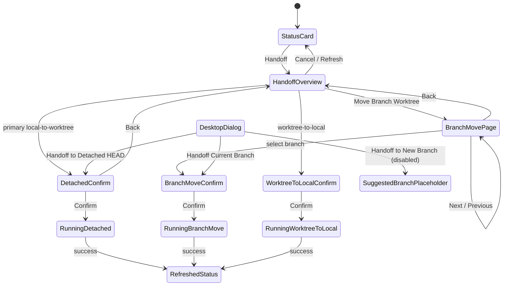
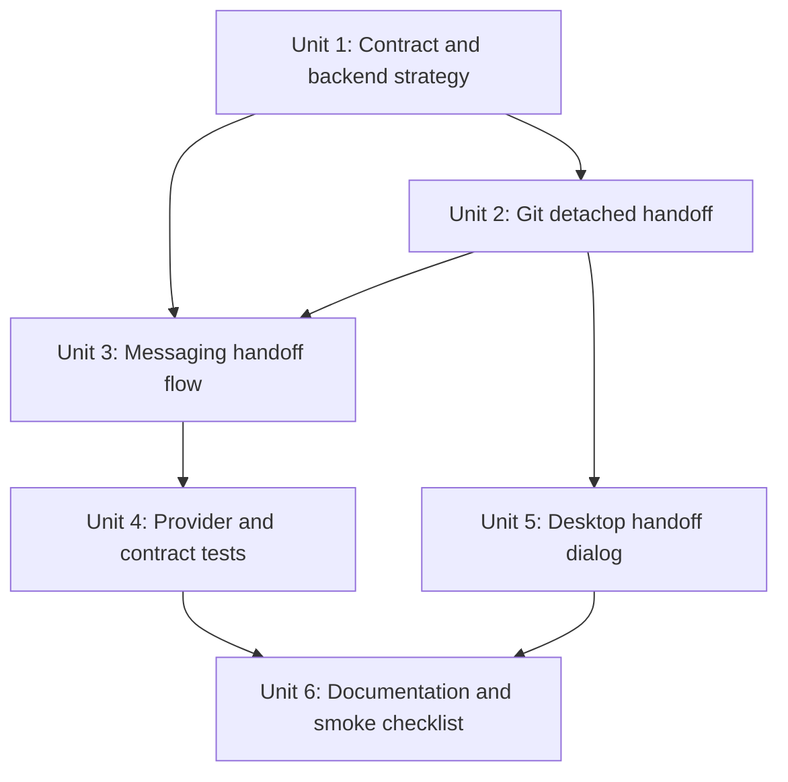

# fix: Tame messaging handoff branch picker

## Overview

Fix the messaging workspace handoff flow so Telegram and Discord do not render
huge branch-choice dialogs during Local-to-worktree handoff. The default
messaging path should become more opinionated: when a bound Local thread is on
a named branch, the primary handoff choice should create a new detached
worktree from the current branch tip and move dirty non-ignored changes there,
without asking which branch Local should switch to.

Keep the existing branch-moving handoff available as a secondary path, but make
any branch picker paged at about eight choices per page with room for Previous,
Next, Back, Refresh, and Cancel.

Also update the desktop handoff dialog so it presents the same product choices
explicitly instead of forcing the current "branch to move / leave Local on"
flow. The dialog should offer:

- `Handoff to Detached HEAD`: leave Local on the current branch, create a new
  detached worktree at the current branch tip, and move dirty non-ignored
  changes on top.
- `Handoff to New Branch`: disabled in this PR; future flow keeps Local where it
  is, creates a new branch in the new worktree, and uses the ephemeral
  branch-name suggestion call.
- `Handoff Current Branch`: move the current branch plus dirty non-ignored
  changes to a new worktree, then switch the current checkout to a selected
  branch.

For Telegram and Discord, use shorter button labels to avoid heavy repeated
prefixes: `Detached Worktree`, `New Branch Worktree`, and `Move Branch
Worktree`. The prompt can carry the full framing: "Choose how to create the new
worktree."

## Problem Frame

Live Telegram testing showed the current Local-to-worktree handoff branch picker
can present dozens of branch buttons at once. In the observed case, the bot
offered 56 branches to leave checked out in Local. That is technically
channel-neutral, but it is a poor remote-control experience and undermines the
messaging MVP requirement that rich workflows stay practical through chat
surfaces.

The deeper issue is product behavior, not only rendering. The existing
branch-moving handoff assumes the user wants to move the current branch to a
worktree, so it must ask what Local should check out afterward. For messaging,
the better default is usually simpler: leave the Local branch alone, create a
new detached worktree from the current branch tip, and move the current dirty
non-ignored working changes into that worktree. This keeps committed branch
context intact while avoiding turning a common remote handoff into a
branch-management prompt.

## Requirements Trace

- R1. Messaging Local-to-worktree handoff must never present an unbounded list
  of branches in a single Telegram or Discord prompt.
- R2. Branch lists used by messaging handoff must paginate when they exceed the
  page size; use eight branch choices per page unless implementation discovers
  an existing shared constant that should be reused directly.
- R3. Each paged branch prompt must reserve room for navigation and escape
  controls: Previous when applicable, Next when applicable, Back, Refresh, and
  Cancel.
- R4. The primary Local-to-worktree messaging path should avoid branch picking
  when the thread is on a named Local branch.
- R5. The primary opinionated path should create a detached worktree at the
  current branch tip, stash/move dirty non-ignored Local changes into that
  worktree, and make the thread point at the new worktree.
- R6. The confirmation copy must state that committed changes reachable from the
  current branch tip are included as the detached worktree base, while ignored
  files are not moved.
- R7. The branch-moving path must remain available for cases where the user
  explicitly wants to move the branch.
- R8. The flow must remain channel-neutral. Telegram and Discord providers
  should render generic intents and opaque callback handles; controller logic
  must not branch on provider identity.
- R9. Text fallback must complete every step: detached handoff confirmation,
  branch-page navigation, branch selection, back, refresh, and cancel.
- R10. Worktree-to-local handoff behavior is not changed by this fix except for
  any shared copy or fallback improvements needed for consistency.
- R11. Desktop Local-to-worktree handoff must present the same two implemented
  strategies explicitly: detached dirty-change handoff, and branch-moving
  handoff with selected leave-current-checkout branch.
- R12. Desktop Local-to-worktree handoff must show a disabled placeholder for a
  future model-suggested branch-name strategy, without making a backend call.
- R13. Desktop confirmation copy must make clear whether the current branch
  stays where it is, whether the branch moves, and whether ignored or committed
  changes are excluded.

## Scope Boundaries

- In scope: desktop and messaging handoff intent/dialog construction, controller handoff callback
  routing, text fallback, branch pagination state, backend contract support for
  a detached-worktree handoff strategy, Git handoff service behavior needed by
  that strategy, and focused Telegram/Discord formatting tests.
- In scope: keeping the existing branch-moving Local-to-worktree path available
  as an explicit secondary or advanced action.
- In scope: changing the desktop renderer composer handoff dialog so it no
  longer presents branch-moving as the only Local-to-worktree choice.
- Out of scope: preserving ignored files. Existing handoff behavior already
  excludes ignored files, and the messaging copy should continue to say so.
- Out of scope: switching Local away from the current branch when the user
  chooses the opinionated detached-worktree path. That path keeps Local on the
  current branch and moves dirty non-ignored working changes to a detached
  worktree based on the current branch tip.
- Out of scope: a generic low-button-count policy for every messaging surface.
  This plan fixes handoff branch lists while reusing existing picker patterns.

## Context & Research

### Relevant Code and Patterns

- `packages/messaging/AGENTS.md` requires workflow semantics to stay
  channel-neutral and provider state to remain opaque.
- `apps/desktop/src/main/messaging/core/messaging-status-card.ts` currently
  builds `buildHandoffBranchPickerIntent` by mapping every
  `leaveLocalBranches` entry directly into `single_select.choices`.
- `apps/desktop/src/main/messaging/core/messaging-controller.ts` routes
  `status:handoff`, `handoff:local-to-worktree`,
  `handoff:select-leave-branch`, and `handoff:confirm` through the managed
  status surface and pending-intent store.
- `apps/desktop/src/main/messaging/core/messaging-resume-browser.ts` already
  has the right pagination shape: `RESUME_BROWSER_PAGE_SIZE = 8`, page-indexed
  sessions, Previous/Next actions, and numeric text fallback.
- `packages/messaging/interface/src/index.ts` already has generic action layout
  hints, picker page types, and `layoutMessagingActionRows`; provider packages
  should not need handoff-specific rendering logic.
- `apps/desktop/src/main/app-server/git-workspace-handoff-service.ts` currently
  requires `leaveLocalBranch` for Local-to-worktree and then moves the current
  branch into a new worktree.
- `apps/desktop/src/renderer/src/features/composer/Composer.tsx` currently
  renders the desktop `Handoff to New Worktree` dialog as a branch-moving flow
  with one `Leave Local on` select and no strategy choice.
- `apps/desktop/src/renderer/src/styles/app.css` owns the existing handoff
  dialog visual treatment; desktop updates should extend those classes rather
  than introducing a new modal system.
- `packages/shared/src/contracts/normalized-app-server.ts` currently has
  `HandoffThreadWorkspaceRequest` with `direction`, `sourceBranch`, and
  `leaveLocalBranch`, but no explicit strategy for detached dirty-change
  handoff.
- Tests already cover the current branch-moving path in
  `apps/desktop/src/main/__tests__/messaging-controller.test.ts`,
  `apps/desktop/src/main/__tests__/messaging-status-card.test.ts`,
  `apps/desktop/src/main/__tests__/git-workspace-handoff-service.test.ts`,
  `packages/messaging/interface/src/__tests__/messaging-contract.test.ts`,
  `packages/messaging/providers/telegram/src/__tests__/telegram-formatting.test.ts`,
  and `packages/messaging/providers/discord/src/__tests__/discord-formatting.test.ts`.

### Institutional Learnings

- `docs/plans/2026-05-02-001-feat-messaging-handoff-surface-plan.md`
  intentionally kept the first handoff flow channel-neutral and deferred broader
  low-button-count policy.
- `docs/plans/2026-04-29-001-feat-thread-workspace-handoff-plan.md`
  established that Git movement belongs in the main-process handoff service,
  not messaging controller code.
- `docs/brainstorms/2026-04-30-messaging-platform-integration-requirements.md`
  requires Telegram and Discord workflow parity, button-driven choices, and text
  fallback without leaking provider specifics into workflow logic.
- No `docs/solutions/` directory exists in this worktree yet.

### External References

- Telegram Bot API `callback_data` remains byte-limited, so opaque callback
  handles and stored action values remain the right pattern:
  https://core.telegram.org/bots/api
- Discord component action rows can hold up to five buttons per row, reinforcing
  the need to keep branch-page controls bounded:
  https://docs.discord.com/developers/components/reference

## Key Technical Decisions

- **Make detached dirty-change handoff the messaging default.** The observed
  Telegram failure comes from asking the user a branch-management question at
  the wrong time. A direct detached-worktree confirmation better matches remote
  handoff intent when the user is moving uncommitted work out of Local.
- **Represent handoff strategy explicitly in shared contracts.** Do not infer
  detached behavior from a missing `leaveLocalBranch`; that would make stale
  callbacks and compatibility paths ambiguous. Add an explicit strategy or mode
  field to the shared handoff request/response contract while keeping the
  existing branch-moving strategy valid.
- **Preserve the branch-moving path as advanced behavior.** Some users do want
  to move a branch into a worktree. The fix should make that path deliberate and
  paged, not delete it.
- **Use eight branch choices per messaging page.** This matches the existing
  resume browser page size and leaves enough space for navigation and cancel
  controls on Telegram and Discord.
- **Keep pagination in the handoff/status-card layer, not provider packages.**
  Providers should receive a bounded generic `single_select` or picker-like
  intent. They should not know that a branch list had 56 total entries.
- **Make copy explicit about what moves.** Detached handoff should say the new
  worktree starts at the current branch tip, dirty tracked and non-ignored
  untracked changes move on top, and ignored files do not.
- **Fail closed when source branch metadata is missing.** If the source checkout
  has no named branch or resolvable `HEAD`, the primary detached path should be
  unavailable rather than guessing across repositories.

## Open Questions

### Resolved During Planning

- **Should this be fixed only in Telegram rendering?** No. The provider rendered
  what the controller asked it to render. The plan changes generic messaging
  handoff behavior and keeps providers bounded.
- **Should branch choices always paginate?** Yes. Any branch list beyond one
  page should use a page size around eight, with navigation and cancel controls.
- **Should the old branch-moving behavior disappear?** No. Keep it as an
  explicit secondary path because moving a branch into a worktree is still a
  valid workflow.
- **Should worktree-to-local change now?** No. The observed problem and new
  product assumption affect Local-to-worktree.
- **Should the desktop dialog change too?** Yes. Desktop should expose the same
  product model so Local-to-worktree is not only branch-moving in one surface and
  detached dirty-change handoff in another.
- **Should the model-suggested branch path be implemented now?** No. Add a
  visible disabled placeholder only; the branch-name suggestion side call is
  being prepared separately.

### Deferred to Implementation

- Exact user-facing labels for the two Local-to-worktree choices should be
  settled while touching the tests. The plan intent is clear: primary detached
  dirty-change handoff, secondary branch-moving handoff.
- Exact shared contract field names are deferred, but the strategy must be
  explicit and serializable through existing callback values.
- Exact future contract for model-suggested branch names is deferred to the
  upcoming ephemeral model side-call work. This plan should only leave a clear
  UI placeholder and avoid fake branch suggestions.

## High-Level Technical Design

> *This illustrates the intended approach and is directional guidance for
> review, not implementation specification. The implementing agent should treat
> it as context, not code to reproduce.*

The branch-moving branch picker should behave like the resume browser: the
controller owns page index and pending intent state, the renderer receives only
the current page of branch choices, and text fallback maps visible numbers and
navigation words to the same action IDs as native buttons.

## Implementation Units

- [x] **Unit 1: Add explicit handoff strategy to shared contracts**

**Goal:** Let callers request either branch-moving handoff or detached
dirty-change handoff without overloading missing fields.

**Requirements:** R4, R5, R6, R7, R8

**Dependencies:** None

**Files:**
- Modify: `packages/shared/src/contracts/normalized-app-server.ts`
- Modify: `apps/desktop/src/main/app-server/backend-registry.ts`
- Modify: `apps/desktop/src/main/messaging/core/messaging-status-card.ts`
- Test: `apps/desktop/src/main/__tests__/backend-registry.test.ts`
- Test: `apps/desktop/src/main/__tests__/app-server-ipc.test.ts`
- Test: `apps/desktop/src/main/__tests__/messaging-status-card.test.ts`

**Approach:**
- Add an explicit Local-to-worktree handoff strategy that distinguishes
  branch-moving behavior from detached dirty-change behavior.
- Keep existing requests without the new field compatible by treating them as
  branch-moving handoff when `leaveLocalBranch` is present.
- Carry source branch information from navigation metadata into the detached
  strategy request value used by messaging callbacks.
- Make validation reject ambiguous detached requests, especially missing
  repository path, missing source path, or missing source branch.

**Patterns to follow:**
- Existing handoff request validation in
  `apps/desktop/src/main/messaging/core/messaging-status-card.ts`
- Backend registry handoff validation in
  `apps/desktop/src/main/app-server/backend-registry.ts`

**Test scenarios:**
- Happy path: a detached Local-to-worktree request serializes through messaging
  action values and parses back with direction, strategy, repository path,
  source path, and source branch.
- Happy path: an existing branch-moving request with `leaveLocalBranch` remains
  valid and is routed as branch-moving handoff.
- Edge case: a detached request without source branch metadata is rejected before
  calling the Git service.
- Error path: a stale callback whose strategy no longer matches current
  workspace metadata is rejected with a refreshable handoff-unavailable message.
- Integration: IPC/backend registry tests prove the new strategy field crosses
  preload and main-process boundaries.

**Verification:**
- Shared contracts can express both handoff modes, and old branch-moving tests
  still pass after compatibility updates.

- [x] **Unit 2: Support detached dirty-change handoff in the Git service**

**Goal:** Add the main-process Git behavior needed by the opinionated messaging
default: create a detached worktree from the current branch tip and move dirty
non-ignored changes from Local into it.

**Requirements:** R4, R5, R6, R10

**Dependencies:** Unit 1

**Files:**
- Modify: `apps/desktop/src/main/app-server/git-workspace-handoff-service.ts`
- Test: `apps/desktop/src/main/__tests__/git-workspace-handoff-service.test.ts`

**Approach:**
- Add a Local-to-worktree strategy branch that does not switch Local to another
  branch and does not check out the current source branch in the new worktree.
- Resolve the source checkout's `HEAD` to a commit before mutation, then create
  the target worktree detached at that commit. This preserves any committed
  branch context that dirty working changes may depend on.
- Stash dirty tracked and non-ignored untracked Local changes, apply them in the
  detached worktree, and drop the stash only after apply succeeds.
- Leave the Local checkout on its current branch after the dirty changes have
  been moved out. The thread's active workspace metadata should point to the new
  detached worktree.
- Return warnings that the new worktree is detached at the current branch tip
  and ignored files were not preserved.
- Preserve existing branch-moving behavior for explicit branch-moving requests.

**Execution note:** Start with temporary Git repository tests. This is easy to
get subtly wrong with branch occupancy, stash behavior, and detached HEAD state.

**Patterns to follow:**
- Existing stash/apply/drop helpers in
  `apps/desktop/src/main/app-server/git-workspace-handoff-service.ts`
- Existing launchpad detached worktree creation pattern in
  `apps/desktop/src/main/app-server/git-directory-service.ts`

**Test scenarios:**
- Happy path: Local on `feature`, dirty tracked file and non-ignored untracked
  file -> new worktree is detached at the `feature` tip, both dirty changes
  appear in the new worktree, Local remains on `feature` and is clean.
- Happy path: Local has no dirty non-ignored changes -> detached worktree is
  still created and the response warns that no working changes were moved, if
  implementation chooses to allow that case.
- Edge case: ignored files under Local are not moved, and the response warns
  that ignored files are excluded.
- Edge case: committed changes reachable only from `feature` do appear in the
  detached worktree because the target starts from the current branch tip.
- Error path: stash apply conflict leaves the stash recoverable and does not
  drop it.
- Error path: missing or unresolvable source `HEAD` fails before stashing or
  creating a worktree.
- Regression: branch-moving Local-to-worktree with `leaveLocalBranch` still
  switches Local to the chosen branch and checks out the moved branch in the
  target worktree.

**Verification:**
- Temporary-repo tests prove the new strategy creates a detached target from the
  current branch tip, moves dirty non-ignored changes, preserves committed
  branch context, and leaves the existing branch-moving strategy intact.

- [ ] **Unit 3: Rework messaging handoff flow and branch pagination**

**Goal:** Make the primary messaging Local-to-worktree flow direct and bounded,
with a paged secondary branch-moving path.

**Requirements:** R1, R2, R3, R4, R6, R7, R8, R9, R10

**Dependencies:** Units 1 and 2

**Files:**
- Modify: `apps/desktop/src/main/messaging/core/messaging-status-card.ts`
- Modify: `apps/desktop/src/main/messaging/core/messaging-controller.ts`
- Modify: `apps/desktop/src/main/messaging/core/messaging-resume-browser.ts`
- Modify: `packages/shared/src/contracts/messaging.ts`
- Test: `apps/desktop/src/main/__tests__/messaging-status-card.test.ts`
- Test: `apps/desktop/src/main/__tests__/messaging-controller.test.ts`

**Approach:**
- Add a handoff branch page size constant near the messaging handoff helpers.
  Prefer reusing or aligning with `RESUME_BROWSER_PAGE_SIZE = 8`.
- Extend handoff pending state/action values with page index for branch-moving
  selection. Keep state generic JSON, not provider-specific state.
- Change Local handoff overview to show a primary detached-worktree action when
  eligible and a secondary `Move Branch Worktree` action that opens the paged
  branch picker.
- Use compact messaging labels: `Detached Worktree`, disabled/follow-up `New
  Branch Worktree`, and `Move Branch Worktree`.
- For branch-moving picker pages, render only the current page of branches plus
  Previous/Next as applicable, Back, Refresh, and Cancel.
- Use page-local numeric fallback for visible branch choices, and show page
  count/total branch count in prompt and fallback text.
- Keep `status:refresh`, `status:handoff`, and `handoff:cancel` semantics
  consistent with the current managed status submode behavior.
- Ensure fallback text says that replying `next`, `previous`, `back`,
  `refresh`, or `cancel` activates the corresponding visible control.
- When the source branch cannot be resolved, skip the detached primary path and
  send the user to the paged branch-moving path with explanatory copy.

**Patterns to follow:**
- Pagination and fallback shape in
  `apps/desktop/src/main/messaging/core/messaging-resume-browser.ts`
- Pending intent lifecycle in
  `apps/desktop/src/main/messaging/core/messaging-controller.ts`
- Current handoff status submode helpers in
  `apps/desktop/src/main/messaging/core/messaging-status-card.ts`

**Test scenarios:**
- Happy path: a Local handoff context with a named source branch and 56
  leave-local branches renders overview with the detached primary action and no
  branch list.
- Happy path: choosing the detached primary action renders confirmation without
  a branch picker and calls `handoffThreadWorkspace` with the detached strategy.
- Happy path: choosing `Move Branch Worktree` renders page 1 with eight branch
  choices, `Next`, `Back`, `Refresh`, and `Cancel`.
- Happy path: pressing `Next` renders page 2 with the next eight branches and
  includes `Previous`.
- Happy path: selecting a branch on page 3 confirms branch-moving handoff with
  the selected `leaveLocalBranch`.
- Edge case: exactly eight branches renders one page with no `Next`.
- Edge case: nine branches renders two pages and never puts all nine branch
  choices on the same prompt.
- Edge case: no source branch metadata skips detached primary action and opens or
  explains the branch-moving fallback.
- Error path: stale page callback after branch metadata changes is rejected with
  a refreshable message.
- Integration: numeric fallback `1` selects only a branch visible on the current
  branch page, while `next`, `previous`, `back`, and `cancel` map to the same
  actions as buttons.
- Regression: worktree-to-local still renders direct confirmation and calls the
  existing strategy.

**Verification:**
- Controller and status-card tests prove the 56-branch case is bounded, the
  detached path is primary, and branch-moving remains available through pages.

- [ ] **Unit 4: Keep provider rendering bounded and generic**

**Goal:** Verify Telegram and Discord render only bounded generic handoff
choices and keep opaque callback handles.

**Requirements:** R1, R2, R3, R8, R9

**Dependencies:** Unit 3

**Files:**
- Modify: `packages/messaging/interface/src/__tests__/messaging-contract.test.ts`
- Modify: `packages/messaging/providers/telegram/src/__tests__/telegram-formatting.test.ts`
- Modify: `packages/messaging/providers/discord/src/__tests__/discord-formatting.test.ts`
- Modify if needed: `packages/messaging/providers/telegram/src/telegram-formatting.ts`
- Modify if needed: `packages/messaging/providers/discord/src/discord-formatting.ts`

**Approach:**
- Prefer no provider source changes. The desired provider behavior should fall
  out of receiving bounded generic intents.
- Extend tests so a 56-branch handoff fixture never produces 56 inline keyboard
  buttons/components.
- Assert Telegram callback data and Discord custom IDs remain opaque handles,
  not branch names or serialized strategy payloads.
- Assert Discord rows remain inside current component limits and Telegram rows
  remain readable.

**Patterns to follow:**
- Existing workspace handoff formatting tests in Telegram and Discord provider
  packages.
- `layoutMessagingActionRows` tests in
  `packages/messaging/interface/src/__tests__/messaging-contract.test.ts`.

**Test scenarios:**
- Happy path: Telegram branch page renders eight branch buttons plus navigation
  and cancel controls, not the full 56 branches.
- Happy path: Discord branch page renders within action-row limits and includes
  Previous/Next only when applicable.
- Edge case: long branch names stay labels only; callback payloads remain short
  opaque handles.
- Regression: existing handoff overview and worktree-to-local confirmation
  rendering still works.

**Verification:**
- Provider tests demonstrate that bounded generic intents solve the Telegram
  problem without adding Telegram/Discord branches to workflow code.

- [x] **Unit 5: Update the desktop handoff dialog**

**Goal:** Replace the current single-path desktop Local-to-worktree dialog with
an explicit strategy choice that supports detached dirty-change handoff,
branch-moving handoff, and a disabled future suggested-branch placeholder.

**Requirements:** R4, R5, R6, R7, R11, R12, R13

**Dependencies:** Units 1 and 2

**Files:**
- Modify: `apps/desktop/src/renderer/src/features/composer/Composer.tsx`
- Modify: `apps/desktop/src/renderer/src/styles/app.css`
- Test: `apps/desktop/src/renderer/src/features/composer/__tests__/composer.test.tsx`

**Approach:**
- Add local dialog state for the selected handoff strategy. Default
  Local-to-worktree to detached dirty-change handoff for named Local branches.
- Render strategy choices as selectable rows inside the existing handoff modal:
  `Handoff to Detached HEAD`, disabled `Handoff to New Branch`, and `Handoff
  Current Branch`.
- Only show `Leave Local on` / `Leave current checkout on` when the
  branch-moving strategy is selected.
- Submit detached handoff with the explicit detached strategy and source branch
  metadata. Submit branch-moving handoff with the explicit branch-moving
  strategy and selected `leaveLocalBranch`.
- Keep existing worktree-to-local confirmation behavior.
- Use existing modal, button, select, and theme classes. Add only scoped styles
  needed for strategy rows and disabled placeholder state.

**Patterns to follow:**
- Existing composer setup controls in
  `apps/desktop/src/renderer/src/features/composer/Composer.tsx`
- Existing workspace handoff modal classes in
  `apps/desktop/src/renderer/src/styles/app.css`

**Test scenarios:**
- Happy path: opening `Handoff to New Worktree` shows three strategy rows, with
  detached dirty-change handoff selected by default and the suggested-branch row
  disabled.
- Happy path: submitting the default selected strategy calls
  `onHandoffThreadWorkspace` with the detached strategy and source branch
  metadata, without `leaveLocalBranch`.
- Happy path: selecting branch-moving handoff reveals the leave-current-checkout
  branch select and submits the branch-moving strategy with `leaveLocalBranch`.
- Edge case: when branch choices are missing, detached strategy remains
  available for a named Local branch and branch-moving is disabled.
- Regression: worktree-to-local still renders direct confirmation and submits
  `worktree-to-local` unchanged.

**Verification:**
- Desktop composer tests prove the dialog exposes the intended choices and sends
  the right strategy-specific request shape.

- [ ] **Unit 6: Update documentation and manual smoke coverage**

**Goal:** Document the new opinionated messaging handoff behavior and the manual
validation case that exposed the bug.

**Requirements:** R1, R4, R5, R6, R7, R9

**Dependencies:** Units 1-5

**Files:**
- Modify: `docs/messaging-platform-integration.md`
- Test expectation: none -- this unit updates operator-facing documentation and
  manual validation steps; behavioral coverage lives in Units 1-4.

**Approach:**
- Update the workspace handoff docs to distinguish:
  - primary messaging Local-to-worktree detached dirty-change handoff;
  - secondary branch-moving handoff with paged branch selection;
  - desktop dialog strategy selection and disabled suggested-branch placeholder;
  - unchanged worktree-to-local confirmation.
- Add a manual Telegram smoke step with a repository that has more than 50
  branches and verify that branch choices are paged.
- Add copy guidance that the detached dirty-change path starts from the current
  branch tip and therefore includes committed branch context.

**Patterns to follow:**
- Existing messaging handoff manual validation section in
  `docs/messaging-platform-integration.md`.

**Test scenarios:**
- Test expectation: none -- documentation only.

**Verification:**
- A maintainer can follow the docs to reproduce the original 56-branch scenario
  and verify the new bounded behavior from Telegram.

## System-Wide Impact

- **Interaction graph:** `/status` still starts the flow, but Local-to-worktree
  now splits into primary detached confirmation and secondary paged branch-moving
  selection. Desktop Local-to-worktree now presents the same strategies inside
  the handoff modal. Existing worktree-to-local flow remains direct confirmation.
- **Error propagation:** Backend strategy validation failures should surface as
  recoverable handoff-unavailable or handoff-failed intents, not provider
  exceptions. Git stash/apply recovery details should pass through existing
  handoff error/success text.
- **State lifecycle risks:** Branch page index must survive through pending
  intents and stale callbacks must fail closed after metadata changes. Do not
  rely on provider process memory.
- **API surface parity:** Desktop IPC, shared app-server contracts, messaging
  controller action values, and provider-facing interface tests all need to
  agree on the new explicit strategy.
- **Integration coverage:** Unit tests need to cover controller-to-bridge
  invocation for detached strategy and provider rendering for bounded branch
  pages. Temporary Git tests need to prove the detached strategy actually moves
  dirty changes.
- **Unchanged invariants:** Providers keep opaque callback handles; messaging
  workflow does not inspect Telegram chat IDs or Discord component IDs; ignored
  files remain excluded from handoff.

## Risks & Dependencies

| Risk | Mitigation |
|------|------------|
| Detached handoff surprises users who expected the branch itself to move | Make confirmation copy explicit that the new worktree is detached at the branch tip and keep branch-moving as a secondary path |
| Strategy contract breaks old desktop branch-moving callers | Treat existing `leaveLocalBranch` requests as branch-moving and preserve old tests |
| Branch pagination state goes stale after repository branch changes | Re-read navigation before confirmation and reject invalid selections with refresh guidance |
| Provider buttons remain too dense despite pagination | Use eight choices per page and reserve rows for navigation/cancel; provider tests assert bounded output |
| Git service drops a stash before apply is safely complete | Reuse apply-then-drop behavior and add temporary Git tests for conflict/recovery paths |
| Dirty changes depend on commits that exist only on the Local branch | Start the detached worktree from the current branch tip before applying dirty changes |
| Desktop and messaging drift into different handoff semantics | Share the explicit strategy contract and cover both surfaces in tests |

## Documentation / Operational Notes

- Update manual smoke tests for both Telegram and Discord, but prioritize
  Telegram because the live failure was observed there.
- Mention that the primary detached path is best for moving uncommitted work out
  of Local, while `Handoff Current Branch` is the branch-history path.
- Mention the desktop placeholder for future model-suggested branch naming so it
  is understood as intentionally disabled.
- No migration is required unless implementation decides to persist a new
  handoff submode/session record shape outside pending intents.

## Sources & References

- **Origin document:** `docs/brainstorms/2026-04-30-messaging-platform-integration-requirements.md`
- Related plan: `docs/plans/2026-05-02-001-feat-messaging-handoff-surface-plan.md`
- Related plan: `docs/plans/2026-04-29-001-feat-thread-workspace-handoff-plan.md`
- Related code: `apps/desktop/src/main/messaging/core/messaging-status-card.ts`
- Related code: `apps/desktop/src/main/messaging/core/messaging-controller.ts`
- Related code: `apps/desktop/src/main/app-server/git-workspace-handoff-service.ts`
- Related code: `apps/desktop/src/main/messaging/core/messaging-resume-browser.ts`
- Package guidance: `packages/messaging/AGENTS.md`
- Telegram Bot API: https://core.telegram.org/bots/api
- Discord component reference: https://docs.discord.com/developers/components/reference
