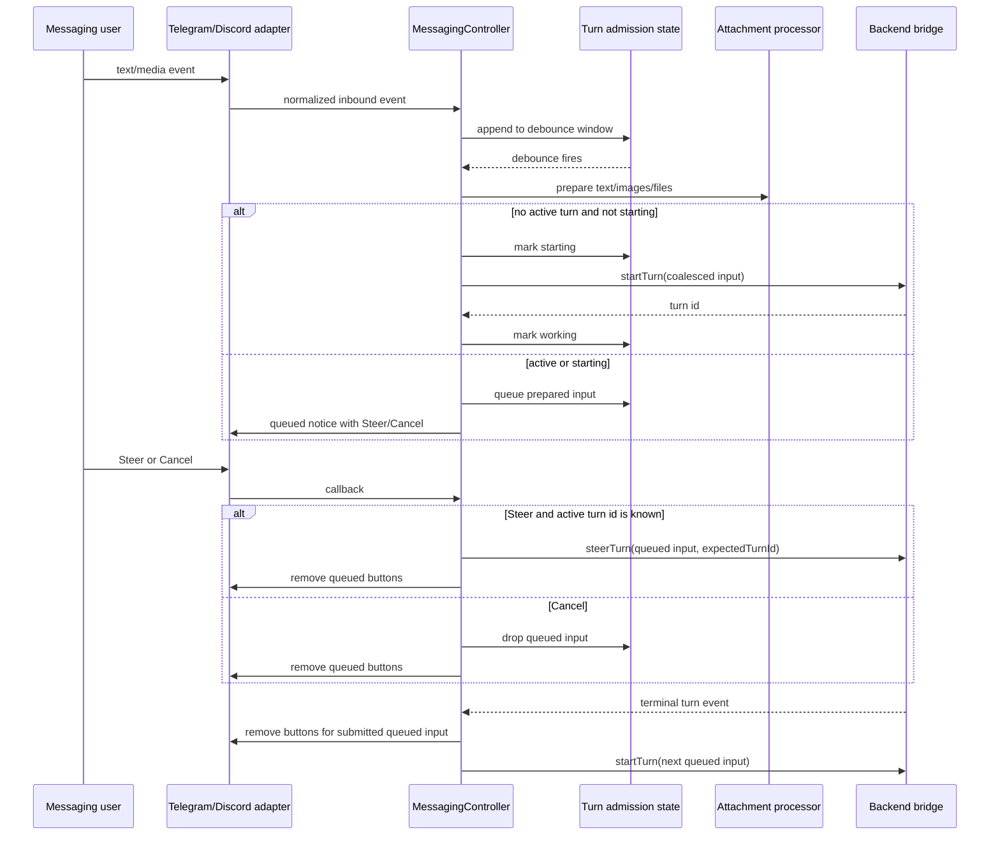
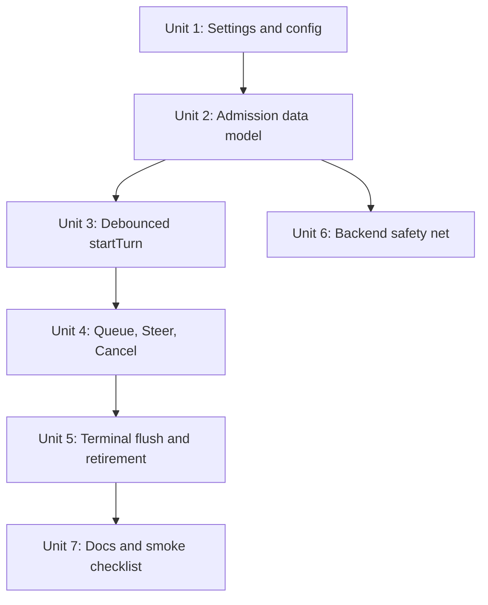

# fix: Add messaging turn admission debouncing and queued follow-ups

## Overview

Prevent bound messaging conversations from starting overlapping agent turns on the
same PwrAgnt thread. Inbound free-form text and media should pass through a
channel-neutral turn admission pipeline that waits briefly for split platform
messages, starts exactly one turn for the coalesced input, and queues or steers
follow-up input when a turn is already in progress.

This directly addresses live messaging behavior where long Telegram input or
client-side code-block/file handling can arrive as multiple inbound events. The
current controller calls `startTurn()` independently for every bound text or
media event, which can submit a second turn before the previous one is
complete. Agent-core turn concurrency is not safe for that usage.

## Problem Frame

Messaging platforms impose and apply their own boundaries. Telegram Bot API
message text is capped at 1-4096 characters after entity parsing, while Discord
message content is capped at 2000 characters. Users and clients may also split
large pasted code blocks into separate messages or attachments. PwrAgnt should
treat a short burst of inbound bound messages as one intended user turn, not as
multiple concurrent agent turns.

There are two distinct cases:

- Split input before a turn starts: debounce for a configurable interval,
  defaulting to 500 ms, and submit the coalesced input as one turn.
- Follow-up input while a turn is already active: acknowledge the message,
  queue it as the next turn, and offer Steer or Cancel actions. If the user
  clicks Steer, send the queued input into the active turn through the backend
  steering path. If they click Cancel, drop it. When the active turn ends,
  submit queued input as the next turn and remove the buttons from the queued
  notice.

## Requirements Trace

- R1. Bound text/media events must no longer call `startTurn()` directly when
  another turn is active or currently being admitted for the same backend/thread.
- R2. Bound inbound events should debounce for a general messaging setting,
  defaulting to 500 ms, before starting a new turn.
- R3. The debounce setting must be general messaging configuration, not
  Telegram- or Discord-specific, and Settings > Messaging should explain that it
  exists for platform/client message splitting.
- R4. Debounced input must preserve text, captions, images, and text-file
  attachments so split requests are submitted as one coherent model input.
- R5. Follow-up input during an active turn must be acknowledged with a quoted
  preview of the user's message, queued for later submission, and offered Steer
  and Cancel actions where the backend can support steering.
- R6. Steer, Cancel, and terminal turn completion must remove action buttons
  from the queued notice by updating or dismissing the generic surface
  best-effort.
- R7. Queue/steer behavior must work for text-only input, image attachments, and
  text-like file attachments without persisting downloaded bytes or file content
  in `messaging-state.json`.
- R8. Commands, callbacks, approval answers, questionnaire answers, and resume
  navigation should keep their existing immediate semantics and must not be
  delayed by turn-input debounce.

## Scope Boundaries

- In scope: desktop messaging controller admission state, inbound text/media
  coalescing, queued follow-up state, Steer/Cancel actions, settings/config/UI,
  provider surface update coverage, docs, and deterministic tests.
- In scope: using existing attachment processing for debounced and queued media
  events before model submission.
- In scope: a defensive backend/agent-core guard that rejects or reports a
  second `turn/start` when an active run already exists for the same thread.
- Out of scope: changing Telegram or Discord platform limits, changing outbound
  long-message chunking policy, changing tool-update verbosity, durable
  persistence of queued attachment bytes across process restarts, or adding a
  general multi-turn job scheduler.
- Out of scope: changing Plan questionnaire, approval, command, callback, or
  `/resume` fallback mapping semantics except where queued Steer/Cancel uses
  the same generic action machinery.

## Context & Research

### Relevant Code and Patterns

- `apps/desktop/src/main/messaging/core/messaging-controller.ts` currently
  routes bound text in `handleText()` and bound media in `handleMedia()` directly
  to `options.backend.startTurn()`.
- The same controller already tracks active turn state in
  `activeTurnsByThreadKey`, updates typing indicators from lifecycle events,
  and has terminal-turn detection in `turnLifecycleForBackendEvent()`.
- `apps/desktop/src/main/messaging/core/messaging-attachment-processor.ts`
  already converts supported messaging attachments into model-safe
  `StartTurnRequest.input` items and returns rejection summaries.
- `apps/desktop/src/main/messaging/core/messaging-renderer.ts` already builds
  confirmation, error, activity, status, approval, and questionnaire intents.
- `MessagingStore` in
  `apps/desktop/src/main/messaging/core/messaging-store.ts` is restart-safe for
  bindings, callback handles, pending intents, browse sessions, and deliveries,
  but intentionally sanitizes persisted state and should not store downloaded
  attachment bytes or extracted file contents.
- `apps/desktop/src/main/settings/desktop-config.ts`,
  `apps/desktop/src/main/settings/desktop-settings-service.ts`,
  `packages/shared/src/contracts/settings.ts`, and
  `apps/desktop/src/renderer/src/features/settings/MessagingSettings.tsx`
  already carry general messaging settings such as tool update mode and
  attachment policy from TOML/env through the Settings UI.
- `apps/desktop/src/main/app-server/backend-registry.ts` centralizes
  `startTurn()`, `steerTurn()`, active Codex turn mode tracking, and backend
  capability metadata.
- `packages/agent-core/src/app-server/codex-app-server.ts` supports
  `turn/start`, `turn/steer`, and `turn/interrupt`, but its current
  `startTurn()` path does not reject an active run on the same thread before
  starting another provider turn.
- `docs/messaging-adapter-contract.md` requires providers to chunk long
  outbound messages according to platform limits and keep workflow semantics
  channel-neutral.

### Institutional Learnings

- `docs/plans/2026-05-02-002-fix-grok-tool-update-summaries-plan.md` explicitly
  split overlapping-turn prevention out as a separate queue/Steer plan.
- `docs/plans/2026-05-02-002-feat-messaging-attachments-plan.md` established
  that desktop messaging core, not providers, owns inbound attachment
  classification, caps, normalization, and model-input conversion.
- `docs/plans/2026-04-30-001-feat-messaging-platform-integration-plan.md`
  established that free-form text can normalize to either `startTurn` or
  `steerTurn`, but channel adapters must remain generic.
- There is no `docs/solutions/` directory in this worktree yet.

### External References

- Telegram Bot API `sendMessage` and edit-message docs cap text at 1-4096
  characters after entity parsing and support reply markup updates:
  https://core.telegram.org/bots/api
- Discord message create docs cap `content` at 2000 characters and support
  components on message payloads:
  https://docs.discord.com/developers/resources/message#create-message

## Key Technical Decisions

- **Put admission in desktop messaging, not providers.** Telegram and Discord
  should continue emitting normalized text/media events immediately. The desktop
  controller owns when those events become `startTurn()` or `steerTurn()`.
- **Use one general debounce setting.** Add `messaging.input_debounce_ms`,
  exposed as `inputDebounceMs` in shared settings and optionally overridden by
  `PWRAGNT_MESSAGING_INPUT_DEBOUNCE_MS`. Default to 500 ms and clamp to
  0-5000 ms during settings resolution; `0` means no pre-start wait while still
  preserving active-turn queueing.
- **Separate ordinary workflow events from turn-input events.** Commands,
  callbacks, pending intent text fallback, approval answers, questionnaire
  answers, and `/status` actions should bypass debounce because they are already
  explicit workflow controls.
- **Model admission state as per binding/thread, not per provider.** The key
  should include backend and thread id so Telegram and Discord bindings to the
  same PwrAgnt thread cannot race each other into overlapping turns.
- **Set a `starting` state before awaiting `startTurn()`.** This closes the
  small race where a second event arrives after the debounce fires but before
  `activeTurnsByThreadKey` has the returned turn id.
- **Process queued attachments immediately, then keep them in memory.** This
  avoids expired provider download handles and preserves the existing rule that
  downloaded bytes and extracted attachment contents are not persisted in
  `messaging-state.json`.
- **Use existing steering when possible.** A queued entry can be steered only
  when there is a known active turn id and the backend exposes `steerTurn`.
  Otherwise it remains queued for the next turn and the notice should not show a
  usable Steer action.
- **Treat unknown active state conservatively.** After restart, the controller
  may know from `readThreadStatus()` that a thread is active without knowing the
  active turn id. In that case it should queue new input and omit Steer until a
  terminal/idle signal or a fresh turn id is available.
- **Retire queued controls best-effort.** Use generic surface update/dismiss
  delivery with `replaceMarkup` or an equivalent no-actions update. Providers
  that cannot edit should return a delivery degradation, but Telegram and
  Discord should have targeted tests for removing buttons from the queued
  notice.
- **Add a backend safety net.** Messaging should prevent overlap before calling
  the backend, but agent-core should still reject a second active `turn/start`
  for the same thread so non-messaging callers cannot corrupt run state.

## Open Questions

### Resolved During Planning

- **Should debounce be provider-specific?** No. The user asked for a general
  messaging setting, and split input can happen in any messaging client.
- **Should queued attachment bytes be persisted for restart recovery?** No for
  this pass. Persisting downloaded bytes or extracted file contents would weaken
  the existing attachment policy and bloat messaging state. Queued entries are
  in-memory runtime work.
- **Should the queue start another turn automatically after completion?** Yes.
  That is the core queued behavior. Steering is an optional user override before
  completion.
- **Should the user be able to cancel queued input?** Yes. Cancel drops the
  queued entry and retires the action buttons.
- **Should commands and pending-intent replies be debounced?** No. Those are
  workflow controls and should keep their existing immediate handling.
- **What clamp should the debounce setting use?** Use 0-5000 ms. This preserves
  a test/local escape hatch with `0`, keeps the default at 500 ms, and prevents
  accidental multi-minute input holds.

### Deferred to Implementation

- Exact formatting of the queued notice after provider markdown escaping. It
  should include a markdown-style block quote of the first 500 characters when
  possible, but providers may render markdown differently.
- Whether multiple queued entries should update one existing notice or produce
  one notice per queued entry. The first implementation should prefer the
  simpler FIFO model and only merge events that arrive within the same debounce
  window.
- Exact provider degradation behavior when action-retirement updates fail.
  Tests should cover successful button removal and a safe fallback path.
- Whether active-turn identity can be recovered from backend status after
  process restart. The plan only requires conservative queueing when active
  status is known but turn id is not known.

## High-Level Technical Design

> *This illustrates the intended approach and is directional guidance for review, not implementation specification. The implementing agent should treat it as context, not code to reproduce.*

Queued notice copy should be generic and bounded. Directionally:

> I got your message, but a turn is already in progress.
>
> > first 500 characters of the queued input
>
> I queued it to send when the turn completes. Choose Steer to submit it to the
> current turn now, or Cancel to drop it.

## Implementation Units

- [x] **Unit 1: Add the General Messaging Input Debounce Setting**

**Goal:** Make the debounce delay configurable through the same settings path as
other general messaging behavior.

**Requirements:** R2, R3

**Dependencies:** None

**Files:**
- Modify: `packages/shared/src/contracts/settings.ts`
- Modify: `apps/desktop/src/main/settings/desktop-config.ts`
- Modify: `apps/desktop/src/main/settings/desktop-settings-env.ts`
- Modify: `apps/desktop/src/main/settings/desktop-settings-service.ts`
- Modify: `apps/desktop/src/main/messaging/messaging-config.ts`
- Modify: `apps/desktop/src/renderer/src/features/settings/MessagingSettings.tsx`
- Test: `packages/shared/src/contracts/__tests__/settings.test.ts`
- Test: `apps/desktop/src/main/__tests__/desktop-settings-service.test.ts`
- Test: `apps/desktop/src/main/__tests__/messaging-config.test.ts`
- Test: `apps/desktop/src/renderer/src/features/settings/__tests__/settings-screen.test.tsx`

**Approach:**
- Add a numeric `inputDebounceMs` value under the shared messaging settings
  snapshot and write patch contract.
- Parse and write TOML as `input_debounce_ms` under `[messaging]`.
- Add `PWRAGNT_MESSAGING_INPUT_DEBOUNCE_MS` as an optional env override using
  the existing integer parser pattern.
- Default to 500 ms in settings resolution and in messaging config loading.
- Add a compact Settings > Messaging > General field near Tool usage
  notifications. The explanatory text should say this wait lets PwrAgnt collect
  split messages and attachments before starting one agent turn.
- Keep the UI consistent with existing settings styling and avoid
  provider-specific labels.

**Patterns to follow:**
- General messaging tool update mode in `MessagingSettings.tsx`
- Attachment policy settings in `desktop-config.ts` and
  `desktop-settings-service.ts`
- `readEnvInteger()` in `desktop-settings-env.ts`

**Test scenarios:**
- Happy path: no config or env produces `inputDebounceMs.value === 500` with
  source `default`.
- Happy path: TOML `input_debounce_ms = 750` round-trips through parse,
  snapshot, write patch, and stringify.
- Happy path: `PWRAGNT_MESSAGING_INPUT_DEBOUNCE_MS=250` overrides TOML and marks
  the value as env-sourced.
- Edge case: invalid or negative env input surfaces a settings error without
  crashing settings loading.
- Edge case: a config value above 5000 ms resolves to the 5000 ms cap or a
  validation error, consistently with the existing settings validation style.
- Edge case: `input_debounce_ms = 0` disables the pre-start wait but does not
  disable active-turn queueing.
- UI: Settings > Messaging shows the field in General and saves a changed value
  in a `messaging.inputDebounceMs` patch.

**Verification:**
- Messaging runtime receives a concrete debounce value from settings/env without
  any Telegram- or Discord-specific configuration.

- [x] **Unit 2: Introduce Turn Admission State and Input Bundles**

**Goal:** Create a controller-owned abstraction for coalesced inbound input,
active/start-in-progress state, and queued follow-up entries.

**Requirements:** R1, R4, R7, R8

**Dependencies:** Unit 1

**Files:**
- Modify: `apps/desktop/src/main/messaging/core/messaging-controller.ts`
- Create: `apps/desktop/src/main/messaging/core/messaging-turn-admission.ts`
- Test: `apps/desktop/src/main/__tests__/messaging-turn-admission.test.ts`
- Test: `apps/desktop/src/main/__tests__/messaging-controller.test.ts`

**Approach:**
- Add a small turn-admission helper owned by desktop messaging core. It should
  key state by backend/thread id and optionally binding id for delivery surfaces.
- Represent an inbound turn bundle as ordered user events that can become
  `StartTurnRequest.input` items plus a bounded preview string for notice copy.
- Track `idle`, `debouncing`, `starting`, `working`, and queued-entry states so
  no path can start two turns for the same backend/thread.
- Keep queue entries in memory. Store only surface refs, ids, previews, and
  status needed to retire buttons; do not persist normalized image data URLs,
  extracted text-file contents, or downloaded bytes.
- Add disposal behavior that clears timers when the controller is disposed.

**Patterns to follow:**
- `MessagingToolUpdatePolicy` for timer ownership and controller callbacks
- `activeTurnsByThreadKey` and `threadKeyForBinding()` in
  `messaging-controller.ts`
- `MessagingStore` queued-write discipline for state mutation style, without
  reusing it for attachment contents

**Test scenarios:**
- Happy path: two text events for the same backend/thread inside the debounce
  window produce one bundle in original event order.
- Happy path: events for different bound threads maintain independent debounce
  windows.
- Edge case: an event arriving after debounce fires but before `startTurn()`
  returns sees `starting` and is queued, not submitted as another turn.
- Edge case: disposing the controller clears pending timers and prevents a late
  `startTurn()` call.
- Regression: command/callback/pending-intent text paths do not enter admission
  state.

**Verification:**
- There is one controller path for "ordinary user input becomes turn input,"
  shared by text and media.

- [x] **Unit 3: Route Bound Text and Media Through Debounced Start**

**Goal:** Replace direct `startTurn()` calls in `handleText()` and `handleMedia()`
with debounced, attachment-aware turn admission.

**Requirements:** R1, R2, R4, R7, R8

**Dependencies:** Units 1 and 2

**Files:**
- Modify: `apps/desktop/src/main/messaging/core/messaging-controller.ts`
- Modify: `apps/desktop/src/main/messaging/core/messaging-attachment-processor.ts`
  only if its result shape needs a preview or source label
- Test: `apps/desktop/src/main/__tests__/messaging-controller.test.ts`
- Test: `apps/desktop/src/main/__tests__/messaging-attachment-processor.test.ts`
  only if the processor contract changes

**Approach:**
- Preserve existing early handling for commands, pending intent text fallback,
  missing binding, and tool-update fallback text.
- For bound ordinary text, append a text item to the admission debounce window
  instead of calling `startTurn()` immediately.
- For bound media, append the media event to the debounce window first, then
  validate/process the batch through the existing processor when the window
  fires. This lets a split text message and its companion attachment enter the
  same admission decision.
- For media that arrives while the target thread is already active or starting,
  validate/process the queued batch immediately when its debounce window fires.
  If all attachments are rejected and no text remains, deliver the current
  recoverable error and do not create a queued entry.
- When the debounce fires and the thread is idle, mark admission `starting`,
  fetch navigation/turn settings once, call `backend.startTurn()` with all
  coalesced input, set active turn state from the returned turn id, signal
  typing, and render status.
- If `startTurn()` fails, clear `starting`, deliver a recoverable error, and
  leave later queued entries untouched.

**Patterns to follow:**
- Current `handleText()` and `handleMedia()` start-turn setup in
  `messaging-controller.ts`
- Existing attachment rejection copy in `formatAttachmentRejections()`
- Turn settings resolution through `turnSettingsForBinding()`

**Test scenarios:**
- Happy path: two bound text events within 500 ms call `startTurn()` once with a
  single input sequence that contains both messages.
- Happy path: a text event and a media event with caption plus image inside the
  debounce window call `startTurn()` once with text and normalized image input.
- Happy path: a `.txt` attachment plus follow-up text inside the debounce window
  starts one turn with extracted file text and the follow-up text.
- Edge case: an unsupported attachment in a debounced batch produces a partial
  skip notice while still submitting accepted input.
- Edge case: all attachments rejected produces no `startTurn()` call and no
  queued entry.
- Regression: `/resume`, `/status`, numeric picker replies, approval text
  fallback, and questionnaire text fallback still bypass debounce.

**Verification:**
- Split platform input before a turn starts produces one agent turn with all
  accepted content.

- [x] **Unit 4: Add Queued Follow-Up Notices with Steer and Cancel**

**Goal:** When ordinary input arrives during an active or starting turn,
acknowledge it, queue it, and offer action buttons to steer or cancel.

**Requirements:** R1, R5, R6, R7

**Dependencies:** Units 2 and 3

**Files:**
- Modify: `apps/desktop/src/main/messaging/core/messaging-controller.ts`
- Modify: `apps/desktop/src/main/messaging/core/messaging-renderer.ts`
- Modify: `packages/shared/src/contracts/messaging.ts` only if generic actions
  need a small additional hint such as disabled/unavailable reason
- Test: `packages/messaging/providers/telegram/src/__tests__/telegram-grammy-adapter.test.ts`
- Test: `packages/messaging/providers/discord/src/__tests__/discord-adapter.test.ts`
- Test: `apps/desktop/src/main/__tests__/messaging-controller.test.ts`
- Test: `packages/messaging/interface/src/__tests__/messaging-contract.test.ts`
  only if the generic contract changes

**Approach:**
- Create a queued follow-up entry after its debounce window fires and admission
  sees the target thread is `starting` or `working`.
- Build a confirmation intent with bounded copy:
  - title such as `Message queued`
  - body that includes a block-quote-style preview of the first 500 characters
  - Steer and Cancel actions when steering can be attempted
  - Cancel only or disabled Steer when the backend has no steering capability or
    the active turn id is unknown
- Store the delivered surface ref on the in-memory queued entry so it can be
  updated later.
- Add callback handling for queued action ids before expired-callback fallback.
- Cancel drops the entry and updates the notice with no buttons.
- Steer calls `backend.steerTurn()` with the queued input and active turn id,
  marks the entry steered, removes buttons, and does not submit it after
  completion.
- If steering fails because the turn ended or the expected turn id is stale,
  keep the entry queued and update the notice with recoverable copy.

**Patterns to follow:**
- Approval retirement in `retireApprovalIntent()`
- Status action handling in `handleStatusCallback()`
- Existing backend `steerTurn` capability in `MessagingBackendBridge` and
  `DesktopBackendRegistry`

**Test scenarios:**
- Happy path: a bound text event while active emits one queued confirmation with
  a block quote preview and Steer/Cancel actions.
- Happy path: clicking Cancel removes the queued entry and updates the notice so
  actions are empty.
- Happy path: clicking Steer calls `backend.steerTurn()` with the queued input,
  expected turn id, backend, and thread id, then retires buttons.
- Happy path: image attachment input during an active turn is processed once,
  queued, and later steered without re-downloading the attachment.
- Happy path: text-file attachment input during an active turn queues extracted
  text and can be cancelled without persisting file contents.
- Edge case: active backend lacks steering support or active turn id is unknown;
  notice still queues the message but does not offer a working Steer action.
- Edge case: after restart, `readThreadStatus()` reports active for the bound
  thread but the controller has no active turn id; incoming input queues without
  a working Steer action and starts only after idle/terminal reconciliation.
- Error path: failed steering leaves the entry queued for next-turn submission
  and reports the recoverable condition.
- Security regression: queued notice preview is capped at 500 characters and
  does not include raw provider opaque state or attachment bytes.
- Provider regression: Telegram and Discord can update the queued notice to
  remove buttons when the controller sends a no-actions update or dismiss
  policy for the delivered surface.

**Verification:**
- Follow-up messages no longer call `startTurn()` while an active turn is
  running, and users can deliberately steer or cancel the queued input.

- [x] **Unit 5: Flush Queued Input After Terminal Turn Events and Retire Buttons**

**Goal:** Automatically submit queued follow-up input when a turn completes,
fails, or is interrupted, while retiring stale action buttons.

**Requirements:** R1, R5, R6, R7

**Dependencies:** Unit 4

**Files:**
- Modify: `apps/desktop/src/main/messaging/core/messaging-controller.ts`
- Test: `apps/desktop/src/main/__tests__/messaging-controller.test.ts`
- Test: `apps/desktop/src/main/__tests__/messaging-runtime.test.ts`
- Test: `packages/messaging/providers/telegram/src/__tests__/telegram-grammy-adapter.test.ts`
- Test: `packages/messaging/providers/discord/src/__tests__/discord-adapter.test.ts`

**Approach:**
- Hook queue flushing into existing terminal lifecycle handling in
  `handleBackendEvent()`, after tool updates flush and status/typing state is
  made idle for the completed turn.
- Retire queued notice controls before or immediately after the queued entry is
  submitted as the next turn. The final copy should make clear the message was
  sent, cancelled, steered, or expired.
- Submit queued entries FIFO. Each queued entry starts a new turn only after the
  previous turn is terminal. If multiple queued entries exist, the next one
  remains queued until the newly started turn completes unless the user steers
  it.
- Do not flush entries that were cancelled or steered.
- If the controller observes backend idle status for an active turn without a
  terminal event, treat that as a terminal condition for queue flushing, matching
  existing status reconciliation.

**Patterns to follow:**
- `isTerminalTurnLifecycle()`
- `isThreadStatusIdleEvent()`
- `flushToolUpdatesForBinding()`
- `renderBindingStatus()`

**Test scenarios:**
- Happy path: queued text starts as the next turn after `turn/completed`, and
  the queued notice loses its actions.
- Happy path: queued image/file input starts as the next turn after completion
  with already processed input.
- Happy path: `turn/failed` and `turn/cancelled` also flush queued input because
  the thread is no longer occupied.
- Edge case: two queued entries submit FIFO across two terminal turn events,
  never both at once.
- Edge case: queue flushing after a backend idle-status reconciliation does not
  start a duplicate turn if a terminal event also arrives.
- Edge case: if process restart loses the in-memory queued content, later stale
  callbacks for its old notice return an expired/recoverable action response
  rather than attempting to reconstruct attachments from persisted state.
- Error path: if starting the queued turn fails, the entry stays queued or is
  marked failed with a user-visible recoverable message; later entries are not
  skipped silently.

**Verification:**
- Terminal lifecycle events advance the queue without creating overlapping
  turns or leaving stale buttons behind.

- [x] **Unit 6: Add a Backend and Agent-Core Overlap Safety Net**

**Goal:** Ensure non-messaging callers cannot start a second active turn on the
same thread while another run is active.

**Requirements:** R1

**Dependencies:** Unit 2

**Files:**
- Modify: `packages/agent-core/src/app-server/codex-app-server.ts`
- Modify: `packages/agent-core/src/app-server/session-state.ts` if a helper is
  needed to query active runs by thread
- Modify: `apps/desktop/src/main/app-server/backend-registry.ts` if desktop
  should also normalize/report active-thread rejection before client calls
- Test: `packages/agent-core/src/__tests__/codex-turn-lifecycle.test.ts`
- Test: `apps/desktop/src/main/__tests__/backend-registry.test.ts`

**Approach:**
- Add a narrow app-server check before provider `startTurn()` that rejects
  `turn/start` when `sessionState` already has an active run for the requested
  thread.
- Keep the rejection deterministic and protocol-safe so callers can surface
  "turn already in progress" rather than corrupting run state.
- Do not change `turn/steer` or `turn/interrupt` semantics; those are the
  intentional paths for interacting with an active turn.
- If backend registry can identify the same condition across Codex/Grok
  clients, normalize the error enough for messaging tests to assert queued
  behavior without depending on backend-specific error text.

**Patterns to follow:**
- `turn/steer` inactive-turn validation in
  `packages/agent-core/src/app-server/codex-app-server.ts`
- Existing backend registry client capability and error tests

**Test scenarios:**
- Happy path: starting a turn on an idle thread still works.
- Error path: starting a second turn on the same thread while the first run is
  active rejects before provider `startTurn()` is called.
- Happy path: `turn/steer` still reaches the active run with the expected turn
  id.
- Regression: completed, failed, cancelled, or interrupted runs no longer block
  a later `turn/start`.

**Verification:**
- Even if messaging admission regresses, agent-core will not intentionally run
  two active turns for the same thread.

- [x] **Unit 7: Update Messaging Documentation and Manual Smoke Coverage**

**Goal:** Document the new admission behavior, setting, and manual verification
steps for Telegram and Discord.

**Requirements:** R2, R3, R5, R6, R7, R8

**Dependencies:** Units 1-6

**Files:**
- Modify: `docs/messaging-platform-integration.md`
- Modify: `docs/messaging-adapter-contract.md`
- Modify: `docs/plans/2026-05-02-002-fix-grok-tool-update-summaries-plan.md`
  only if adding a backlink to this plan is useful
- Test: `apps/desktop/src/main/__tests__/messaging-docs-links.test.ts`

**Approach:**
- Add a short "Turn Admission" or "Input Debouncing and Follow-ups" section to
  the integration docs.
- Document `input_debounce_ms` and
  `PWRAGNT_MESSAGING_INPUT_DEBOUNCE_MS` in the configuration section.
- Extend Telegram and Discord smoke checklists with:
  - split long text/code input starts one turn
  - text attachment plus follow-up text inside debounce starts one turn
  - follow-up during active turn shows queued notice
  - Steer sends into the current turn
  - Cancel drops queued input
  - turn completion retires queued buttons and starts queued input
- Update the adapter contract to clarify that providers emit inbound events
  immediately; controller admission owns debounce, queue, and steer decisions.

**Patterns to follow:**
- Existing `Tool Update Verbosity`, `Attachments`, and smoke checklist sections
  in `docs/messaging-platform-integration.md`
- Existing channel-neutral adapter language in `docs/messaging-adapter-contract.md`

**Test scenarios:**
- Test expectation: none -- documentation-only behavior, with link tests updated
  if docs path/link assertions change.

**Verification:**
- Docs explain the behavior well enough for a tester to reproduce the original
  race and verify the fix with text, image, and text-file inputs.

## System-Wide Impact

- **Interaction graph:** Provider inbound events still enter
  `MessagingController.handleInboundEvent()`, but ordinary bound text/media now
  pass through admission state before calling `DesktopMessagingBackendBridge`.
  Backend events then drive active-turn state, typing, queued control retirement,
  and queue flushing.
- **Error propagation:** Attachment rejection remains user-visible before model
  upload. `startTurn()` and `steerTurn()` failures should become recoverable
  messaging errors tied to the queued entry or current inbound event.
- **State lifecycle risks:** The most important risks are timer cleanup, the
  `starting` race, active-turn reconciliation after restart, and button surfaces
  outliving queued entries. Queue contents are intentionally memory-only.
- **API surface parity:** Telegram and Discord continue using generic
  `MessagingSurfaceIntent` actions. If a contract addition is needed, it should
  be generic and provider-neutral.
- **Integration coverage:** Unit tests must cover controller admission and
  attachment processing, while provider adapter tests should cover action
  retirement/update behavior for queued notices.
- **Unchanged invariants:** Bindings remain restart-safe, provider state remains
  opaque, downloaded attachments are not persisted in messaging state, and
  commands/callbacks remain immediate workflow controls.

## Risks & Dependencies

| Risk | Mitigation |
|------|------------|
| Debounce delays explicit commands or approval responses | Keep command, callback, pending-intent, approval, questionnaire, and status paths outside admission tests |
| A second event arrives while `startTurn()` is in flight | Mark per-thread admission state as `starting` before awaiting backend response |
| Queued attachment download handles expire | Process supported attachments immediately before queuing, then keep model-safe input in memory |
| Queued content is lost on app restart | Accept as first-pass scope; do not persist downloaded bytes or extracted file contents in `messaging-state.json`; clear or expire in-memory queued entries on shutdown |
| Steer sends to the wrong active turn | Require known active turn id and call backend steering with expected turn id; on stale-turn failure, keep entry queued |
| Provider cannot remove buttons | Use generic update/dismiss best-effort and provider tests for Telegram/Discord; degrade with a short status if update is unsupported |
| Backend safety net changes valid sequential turn behavior | Only reject when a run for the same thread is currently active; add tests for completed/failed/cancelled runs permitting later starts |

## Documentation / Operational Notes

- No feature flag is needed because the change fixes unsafe behavior.
- The default 500 ms setting should be visible and editable in Settings >
  Messaging, with TOML/env override for local testing.
- Manual validation should use both Telegram and Discord because their message
  limits and client split behavior differ, but the controller behavior should be
  identical.

## Sources & References

- Origin document: `docs/brainstorms/2026-04-30-messaging-platform-integration-requirements.md`
- Related docs: `docs/messaging-platform-integration.md`
- Related docs: `docs/messaging-adapter-contract.md`
- Related plan: `docs/plans/2026-05-02-002-feat-messaging-attachments-plan.md`
- Related plan: `docs/plans/2026-05-02-002-fix-grok-tool-update-summaries-plan.md`
- Related code: `apps/desktop/src/main/messaging/core/messaging-controller.ts`
- Related code: `apps/desktop/src/main/messaging/core/messaging-attachment-processor.ts`
- Related code: `apps/desktop/src/main/app-server/backend-registry.ts`
- Related code: `packages/agent-core/src/app-server/codex-app-server.ts`
- Telegram Bot API: https://core.telegram.org/bots/api
- Discord Create Message API: https://docs.discord.com/developers/resources/message#create-message
