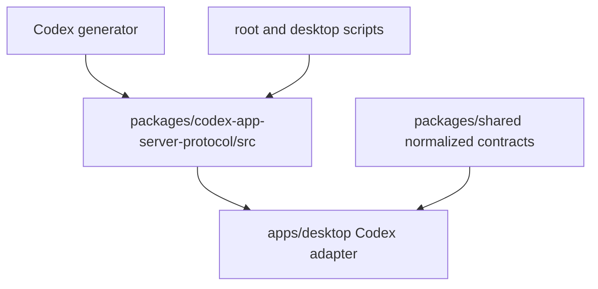
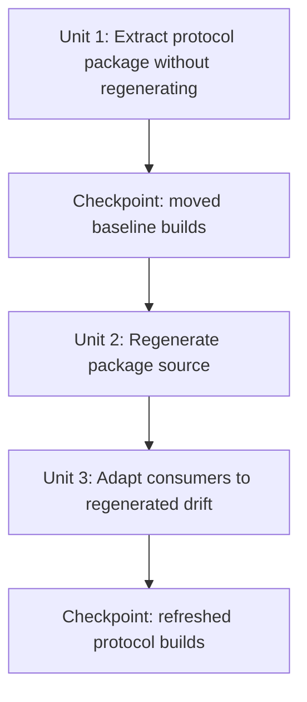

# refactor: Extract Codex App Server protocol package

## Overview

Move the generated Codex App Server TypeScript protocol bindings out of `@pwragent/shared` and into a dedicated leaf package, then refresh those generated bindings from the current Codex Desktop bundled generator. The first phase should preserve the existing generated files while changing package boundaries and imports; after that baseline builds cleanly, the second phase can delete and regenerate the package's generated `src/` contents and adapt consumers to any upstream protocol drift.

## Problem Frame

The Codex App Server wire protocol types are currently generated under `packages/shared/src/generated/codex-app-server-protocol/` and exported as `@pwragent/shared/codex-app-server-protocol` plus `@pwragent/shared/codex-app-server-protocol/v2`. That makes `@pwragent/shared` carry two different responsibilities: normalized PwrAgent contracts and generated Codex wire bindings.

The user wants the generated protocol moved into a package shaped like the PwrSnap precedent: a package such as `packages/codex-app-server-protocol` whose source directory is only generator output, with a package-local regeneration script. This keeps generated protocol bindings as a leaf-level dependency and makes future generator refreshes easier to review as generated-only changes.

This plan is driven by the user's package-extraction request, with the existing protocol-parity requirements document used only as related context. It does not change Codex runtime behavior, thread grouping, or protocol normalization semantics; it only changes where the generated protocol types live, how they are imported, and how they are refreshed. The related parity context still matters because the generated Codex protocol surface is part of the supported-protocol boundary for desktop parity.

## Requirements Trace

- R1. Generated Codex App Server bindings live in a dedicated workspace package named `@pwragent/codex-app-server-protocol`.
- R2. `@pwragent/shared` stops exporting generated Codex protocol subpaths and remains focused on normalized PwrAgent contracts.
- R3. Existing consumers import wire protocol types from `@pwragent/codex-app-server-protocol` and `@pwragent/codex-app-server-protocol/v2`.
- R4. The first delivery phase moves existing generated files without intentionally changing generated content, then verifies the workspace builds cleanly.
- R5. The first delivery phase is suitable for a checkpoint commit before regeneration.
- R6. The second delivery phase wipes only the new package's generated `src/` contents, regenerates from the package script, updates documentation metadata, and verifies the workspace again.
- R7. The second delivery phase is suitable for a checkpoint commit after any consumer adaptations required by regenerated protocol drift.
- R8. The generated package's committed `src/` tree contains only generator output; handwritten package metadata and README content stay outside `src/`.
- R9. The regeneration path is package-local and also reachable through root and desktop convenience scripts.

## Scope Boundaries

- In scope: workspace package metadata, generated-file relocation, imports, generation scripts, package docs/guidance, lockfile updates, and verification coverage for package resolution.
- In scope: adapting desktop Codex adapter code only when the regenerated protocol changes type names or shapes used by current code.
- Out of scope: changing normalized app-server contracts in `packages/shared/src/contracts/`.
- Out of scope: changing runtime Codex JSON-RPC behavior, thread list semantics, app-server request ordering, or protocol capture fixtures.
- Out of scope: adding OSS license language. This repo remains proprietary and `UNLICENSED`.
- Out of scope: hand-editing generated protocol files.

## Context & Research

### Relevant Code and Patterns

- `packages/shared/package.json` currently exports `./codex-app-server-protocol` and `./codex-app-server-protocol/v2` from `packages/shared/src/generated/codex-app-server-protocol/`.
- `packages/shared/src/generated/AGENTS.md` documents that generated protocol files are produced by `pnpm codex:generate-app-server-protocol` and should not be edited by hand.
- `apps/desktop/src/main/codex-app-server/client.ts` imports v1 and v2 generated protocol types from `@pwragent/shared/codex-app-server-protocol` subpaths.
- `apps/desktop/src/main/codex-app-server/AGENTS.md` tells desktop Codex adapter code to use generated wire types and keep normalized desktop-facing contracts in `@pwragent/shared`.
- `package.json` currently routes `codex:generate-app-server-protocol` through `@pwragent/shared`.
- `apps/desktop/package.json` currently exposes `codex:generate-protocol` and routes it through `@pwragent/shared`.
- `apps/desktop/electron.vite.config.ts` excludes workspace packages such as `@pwragent/shared` from dependency externalization in the main/preload builds; the new package may need the same treatment if it is bundled through TS source exports.
- The PwrSnap precedent uses `packages/codex-app-server-protocol` with `exports` for `.` and `./v2`, a package-local `generate` script, and a README explaining that `src/` is generator output.

### Institutional Learnings

- No `docs/solutions/` artifacts exist yet for this repository, so there are no prior institutional learnings to carry forward.

### External References

- No web research used. The plan is grounded in local repo structure and the PwrSnap package precedent.

## Key Technical Decisions

- **Use a dedicated package named `@pwragent/codex-app-server-protocol`.** This mirrors the PwrSnap package pattern and makes the dependency graph honest: desktop code depends on Codex wire bindings directly, while `@pwragent/shared` remains the normalized PwrAgent contract package.
- **Keep `src/` generated-only.** The new package should not introduce handwritten wrapper modules under `src/`; its package `exports` should point directly to generated `src/index.ts` and `src/v2/index.ts`.
- **Preserve the existing root script name.** Keep `pnpm codex:generate-app-server-protocol` working by retargeting it to the new package, so existing guidance and muscle memory do not break. The desktop convenience script can keep its current name while changing its filter target.
- **Use the Codex Desktop bundled binary by default for refreshes.** Local research found `codex` on PATH reports `codex-cli 0.125.0`, while the installed Codex Desktop bundled binary reports `codex-cli 0.128.0-alpha.1`, matching the PwrSnap precedent. Defaulting the package script to the Desktop bundled binary makes the regeneration phase update to the protocol surface the desktop integration most likely needs, while an env-var override can still support custom or CI generators.
- **Split relocation and regeneration into separate checkpoints.** The first checkpoint should be package-boundary churn with no intentional generated-content delta. The second checkpoint should be the generated refresh plus any required type-consumer adaptations.
- **Remove protocol subpath exports from `@pwragent/shared`.** Keeping compatibility re-exports would preserve the old coupling and weaken the leaf-package boundary. Consumers should update to the new package import paths.

## Open Questions

### Resolved During Planning

- **Should the generated protocol remain reachable through `@pwragent/shared`?** No. The goal is a leaf-level import package, so consumers should import `@pwragent/codex-app-server-protocol` directly.
- **Should generation happen into a nested `codex-app-server-protocol/` directory inside the new package?** No. The PwrSnap pattern writes directly into package `src/`, with `src/index.ts` and `src/v2/index.ts` as exported generated barrels.
- **Should the new package use MIT licensing?** No. Repo guidance says v1.0 is proprietary and package `license: "UNLICENSED"` markings are load-bearing.
- **Should the first checkpoint regenerate files?** No. The first checkpoint should prove the move/import/package-boundary change independently.

### Deferred to Implementation

- Whether regenerated protocol drift requires changes beyond `apps/desktop/src/main/codex-app-server/client.ts`; this depends on the generator output delta.
- Whether the package manager lockfile records the new workspace dependency without manual intervention; this should be verified during implementation.
- Whether `electron.vite.config.ts` needs explicit exclusion for `@pwragent/codex-app-server-protocol`; this should be decided from build behavior after the new package dependency is wired.

## High-Level Technical Design

> *This illustrates the intended approach and is directional guidance for review, not implementation specification. The implementing agent should treat it as context, not code to reproduce.*

The important boundary is that `@pwragent/shared` and `@pwragent/codex-app-server-protocol` become sibling dependencies. `@pwragent/shared` does not wrap or re-export generated Codex wire types, and the generated package does not import normalized PwrAgent contracts.

## Implementation Units

- [x] **Unit 1: Extract protocol package without regenerating**

**Goal:** Move the existing generated protocol files into a dedicated workspace package, update imports/scripts/docs, and prove the unchanged generated baseline still builds.

**Requirements:** R1, R2, R3, R4, R5, R8, R9

**Dependencies:** None

**Files:**
- Create: `packages/codex-app-server-protocol/package.json`
- Create: `packages/codex-app-server-protocol/tsconfig.json`
- Create: `packages/codex-app-server-protocol/README.md`
- Create: `packages/codex-app-server-protocol/AGENTS.md`
- Create symlink: `packages/codex-app-server-protocol/CLAUDE.md`
- Move: `packages/shared/src/generated/codex-app-server-protocol/` to `packages/codex-app-server-protocol/src/`
- Modify: `packages/shared/package.json`
- Modify: `package.json`
- Modify: `apps/desktop/package.json`
- Modify: `apps/desktop/src/main/codex-app-server/client.ts`
- Modify: `apps/desktop/src/main/codex-app-server/AGENTS.md`
- Modify: `apps/desktop/electron.vite.config.ts`
- Modify: `pnpm-lock.yaml`
- Test: `packages/codex-app-server-protocol/tsconfig.json`
- Test: `apps/desktop/src/main/codex-app-server/client.ts`

**Approach:**
- Create `@pwragent/codex-app-server-protocol` as a private ESM workspace package with `exports` for `.` and `./v2`, pointing at generated `src/index.ts` and `src/v2/index.ts`.
- Move the existing generated tree as-is so the first diff is dominated by file moves and import/package updates, not upstream generator changes.
- Remove generated-protocol exports and generator script ownership from `@pwragent/shared`.
- Add `@pwragent/codex-app-server-protocol` as a direct dependency of `@pwragent/desktop`, because `apps/desktop/src/main/codex-app-server/client.ts` is the current consumer.
- Retarget the root and desktop generation scripts to the new package while preserving existing command names.
- Update guidance files so future Codex adapter work imports generated wire types from the new package and keeps normalized app contracts in `@pwragent/shared`.
- Mirror the repo guidance by creating a `CLAUDE.md` sibling symlink that points at the package `AGENTS.md`.
- Keep package metadata proprietary with `license: "UNLICENSED"`.

**Patterns to follow:**
- `packages/shared/package.json`
- `apps/desktop/package.json`
- `apps/desktop/src/main/codex-app-server/AGENTS.md`
- PwrSnap precedent: `packages/codex-app-server-protocol/package.json` and README shape

**Test scenarios:**
- Happy path: `apps/desktop/src/main/codex-app-server/client.ts` resolves v1 generated types from `@pwragent/codex-app-server-protocol`.
- Happy path: `apps/desktop/src/main/codex-app-server/client.ts` resolves v2 generated types from `@pwragent/codex-app-server-protocol/v2`.
- Integration: desktop typechecking sees both `@pwragent/shared` normalized contracts and `@pwragent/codex-app-server-protocol` wire types as separate workspace dependencies.
- Integration: the desktop production build resolves the new workspace package without externalization or bundling errors.
- Regression: no source import remains for `@pwragent/shared/codex-app-server-protocol` or `@pwragent/shared/codex-app-server-protocol/v2`.
- Regression: `packages/shared` no longer contains generated Codex protocol files or generated-protocol subpath exports.

**Verification:**
- The workspace builds and typechecks against the moved generated files before any regeneration occurs.
- The diff is suitable for a checkpoint commit representing only package extraction and import updates.

- [x] **Unit 2: Regenerate package source from the package script**

**Goal:** Refresh the dedicated package's generated `src/` tree from the current Codex Desktop generator and document the generator source/version used.

**Requirements:** R6, R7, R8, R9

**Dependencies:** Unit 1 checkpoint complete

**Files:**
- Modify: `packages/codex-app-server-protocol/src/`
- Modify: `packages/codex-app-server-protocol/README.md`
- Test: `packages/codex-app-server-protocol/tsconfig.json`

**Approach:**
- Delete only `packages/codex-app-server-protocol/src/` generated contents before regeneration so removed upstream types disappear from git rather than lingering.
- Regenerate through the package-local script, with the root and desktop convenience scripts delegating to the same package entry point.
- Default the generator script to the Codex Desktop bundled binary, while supporting a `PWRAGENT_CODEX_BIN` override for custom or CI use.
- Update README metadata with the observed generator version and generated file count after refresh.
- Review the generated diff as generator output only; do not hand-edit generated files to fix consumer compile errors.

**Patterns to follow:**
- `packages/codex-app-server-protocol/README.md`
- PwrSnap precedent: package-local `generate` script and generated source documentation

**Test scenarios:**
- Happy path: regenerating from the package script recreates `src/index.ts` and `src/v2/index.ts`.
- Happy path: package typechecking succeeds against the regenerated `src/` tree alone.
- Regression: every committed file under `packages/codex-app-server-protocol/src/` is generated output, not handwritten glue.
- Edge case: if the Desktop bundled binary is absent in another environment, the documented env-var override provides a clear supported path.

**Verification:**
- The package can regenerate from an empty generated `src/` tree and typecheck by itself.
- README metadata matches the generator version and generated file count used in the refresh.

- [x] **Unit 3: Adapt consumers to regenerated protocol drift**

**Goal:** Make current PwrAgent consumers compile and behave the same after the regenerated protocol update.

**Requirements:** R3, R6, R7

**Dependencies:** Unit 2

**Files:**
- Modify: `apps/desktop/src/main/codex-app-server/client.ts`
- Modify: `apps/desktop/src/main/__tests__/codex-client.test.ts`
- Modify: `apps/desktop/src/main/__tests__/codex-thread-protocol-analysis.test.ts`
- Modify: `apps/desktop/src/main/testing/codex-thread-protocol-analysis.ts`
- Test: `apps/desktop/src/main/__tests__/codex-client.test.ts`
- Test: `apps/desktop/src/main/__tests__/codex-thread-protocol-analysis.test.ts`

**Approach:**
- Treat generated type changes as upstream protocol drift and adapt only the handwritten consumer code that fails to compile or has explicitly stale type assumptions.
- Keep runtime JSON-RPC normalization behavior unchanged unless a regenerated type proves the existing alias or payload handling is stale.
- Prefer small adapter-boundary changes in `apps/desktop/src/main/codex-app-server/client.ts` over leaking Codex-specific protocol details into shared normalized contracts.
- Do not update replay fixtures unless regenerated type drift exposes a real fixture-shape mismatch in tests already focused on protocol analysis.

**Patterns to follow:**
- `apps/desktop/src/main/codex-app-server/client.ts`
- `apps/desktop/src/main/codex-app-server/AGENTS.md`
- `apps/desktop/src/main/testing/codex-thread-protocol-analysis.ts`

**Test scenarios:**
- Happy path: existing Codex client tests still compile and pass with regenerated v1/v2 type names.
- Happy path: protocol analysis tests still recognize the same request/response methods from captured fixtures after type import changes.
- Regression: no handwritten file reintroduces imports from `@pwragent/shared/codex-app-server-protocol`.
- Regression: normalized desktop-facing app-server contracts continue to come from `@pwragent/shared`.
- Edge case: if a regenerated type is renamed or removed, the adapter preserves runtime behavior through local normalization rather than changing shared PwrAgent contracts unnecessarily.

**Verification:**
- Desktop typechecking, targeted Codex adapter tests, and the desktop build all pass against the regenerated protocol package.
- The diff is suitable for a checkpoint commit representing generated refresh plus any necessary consumer adaptations.

## System-Wide Impact

- **Interaction graph:** The main affected import surface is `apps/desktop/src/main/codex-app-server/client.ts`. Normalized app-server contracts continue flowing from `@pwragent/shared` into desktop, renderer, messaging, and `agent-core`.
- **Error propagation:** Runtime error propagation should not change. Any errors introduced by this work should be build-time/package-resolution failures or type errors, not new runtime JSON-RPC behavior.
- **State lifecycle risks:** None expected. This refactor does not touch persistent state, config, sqlite, or thread storage.
- **API surface parity:** Public workspace import paths change from `@pwragent/shared/codex-app-server-protocol` to `@pwragent/codex-app-server-protocol`. No external npm consumers exist because the package is private, but all in-repo consumers must move together.
- **Integration coverage:** Package extraction needs both package-level typechecking and desktop build coverage because TS source exports can interact with electron-vite dependency handling.
- **Unchanged invariants:** `@pwragent/shared` remains the source of PwrAgent-normalized contracts, generated protocol files remain committed, and generated files are not edited by hand.

## Risks & Dependencies

| Risk | Mitigation |
|------|------------|
| File moves obscure regenerated protocol drift. | Split relocation and regeneration into separate checkpoints so reviewers can inspect package-boundary churn separately from upstream generator output. |
| `@pwragent/shared` compatibility exports linger and keep the old dependency boundary alive. | Remove the generated subpath exports and update all in-repo consumers to the new package import paths in the first phase. |
| Electron build tooling mishandles the new TS-source workspace package. | Verify desktop typecheck and production build after the move; update `electron.vite.config.ts` only if package resolution requires it. |
| Regenerating with PATH `codex` produces an older protocol than Codex Desktop. | Default the package script to the Codex Desktop bundled binary and document `PWRAGENT_CODEX_BIN` for overrides. |
| Generated upstream drift breaks adapter code in ways that look like runtime behavior changes. | Adapt drift at the Codex adapter boundary and keep normalized shared contracts unchanged unless a deliberate product/API decision is made separately. |

## Documentation / Operational Notes

- `packages/codex-app-server-protocol/README.md` should explain why the package exists, how to refresh it, which binary/version generated the current files, and why `src/` must remain generated-only.
- `packages/codex-app-server-protocol/AGENTS.md` should be the local generated-protocol guidance for future agents, with `CLAUDE.md` kept as a sibling symlink to the same guidance.
- `apps/desktop/src/main/codex-app-server/AGENTS.md` should name `@pwragent/codex-app-server-protocol` as the Codex wire type source and keep the normalized-contract boundary explicit.
- Root and desktop package scripts should preserve the commands developers already know while delegating to the new package-local generation script.

## Sources & References

- Related requirements context: `docs/brainstorms/2026-04-19-codex-desktop-protocol-parity-requirements.md`
- Related plan: `docs/plans/2026-04-19-003-fix-codex-desktop-protocol-parity-plan.md`
- Current generated package location: `packages/shared/src/generated/codex-app-server-protocol/`
- Current generated exports: `packages/shared/package.json`
- Current consumer imports: `apps/desktop/src/main/codex-app-server/client.ts`
- Current adapter guidance: `apps/desktop/src/main/codex-app-server/AGENTS.md`
- PwrSnap precedent: `packages/codex-app-server-protocol/package.json` and README in the sibling PwrSnap repo
