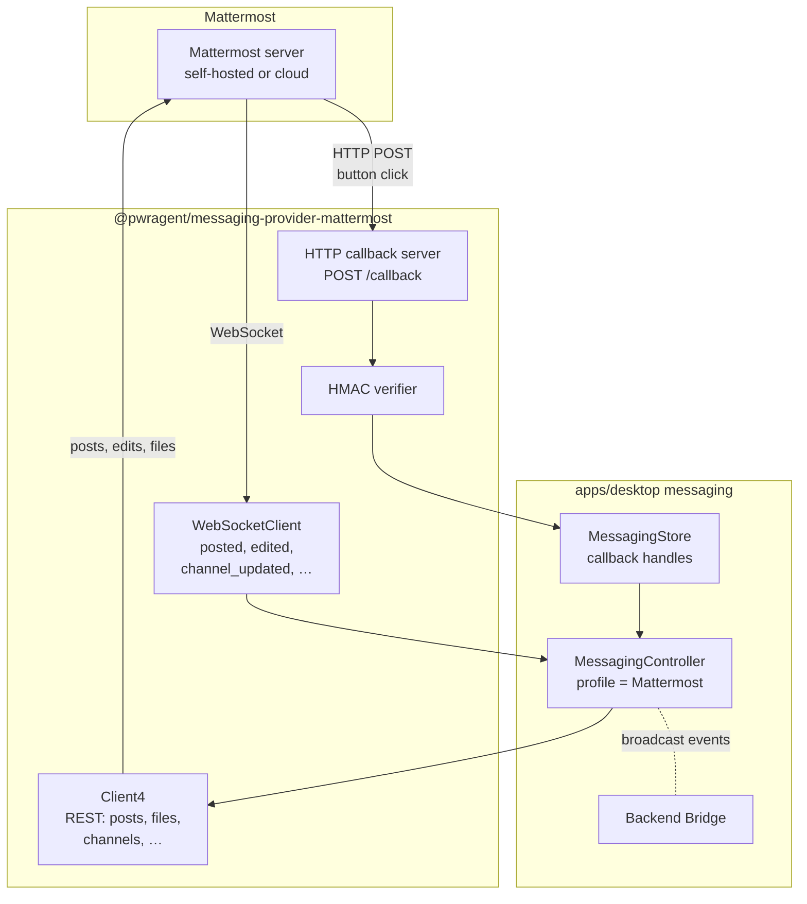

# Mattermost Adapter and Provider Integration Guide

## Overview

This plan extracts and supersedes Phase 5 ("Mattermost Adapter") from the merged capability-discovery plan ([`docs/plans/2026-05-04-002-feat-messaging-capability-discovery-plan.md`](2026-05-04-002-feat-messaging-capability-discovery-plan.md)). It carries two interdependent goals:

1. **Validate the framework with a real new provider.** PR #180 declared the framework "zero producer changes for new providers" but never proved it against a third platform. Mattermost is the proof.
2. **Ship a hands-on integration guide.** Following the framework today still requires reading three reference docs and reverse-engineering Discord/Telegram. We need a *how-to*. We use the Mattermost work as a forcing function: write the guide first, follow it to build Mattermost, then evaluate whether the guide actually got us there. The evaluation pass is the deliverable on top of the adapter.

## Origin

Origin requirements (see origin: [`docs/brainstorms/2026-05-04-messaging-capability-discovery-requirements.md`](../brainstorms/2026-05-04-messaging-capability-discovery-requirements.md)):

- **R18.** Implement a Mattermost messaging adapter that declares its capability profile and covers the same intent surface as Telegram and Discord: thread/project binding, pickers, approvals, questionnaires, status panels, streaming responses, and text fallback.
- **R19.** The Mattermost adapter must be the first provider implemented against the capability profile system, validating that the system works for a new provider without producer changes.
- **R20.** The Mattermost adapter must follow the existing package boundary rules: isolated under `packages/messaging/providers/mattermost/`, importing only `@pwragent/messaging-interface` and the Mattermost SDK.

Origin success criterion (carried forward verbatim): *"Adding a new messaging provider requires only: implementing the adapter, declaring a capability profile, and registering in the provider loader. Zero producer code changes."*

## Problem Statement

PwrAgent ships Telegram and Discord adapters today. The capability discovery framework (PR #180) was designed to make adding new providers trivial — the framework declares: profile → producer adapts → adapter renders. Until a third adapter actually lands, that claim is unproven and the docs that describe how to add one are reference material rather than a hands-on guide.

Two specific pressures push for Mattermost specifically:

1. **Roadmap.** Mattermost is the next requested provider per the brainstorm doc. Self-hosted-friendly, popular in engineering orgs, well-documented bot API.
2. **Architectural pressure point.** Mattermost has constraints that test the framework in non-trivial ways:
   - **Out-of-band button callbacks.** Unlike Telegram (long-poll/webhook through grammy) and Discord (gateway interactions), Mattermost POSTs to a callback URL when a button is clicked. The bot must run an HTTP server. This forces the controller's existing callback-handle persistence to prove it works for HTTP-callback providers, not just streaming-events providers.
   - **No native row layout.** Mattermost auto-flows buttons. `supportsLayoutHints: false` exercises the framework's "advisory hint, take or leave" semantics for layout.
   - **No disabled state.** `supportsDisabled: false` exercises the framework's degradation path.
   - **Multiple attachments per post.** A pseudo-row mechanism producers don't currently exploit.

Beyond the adapter itself, contributors who want to add Slack/Signal/Feishu after Mattermost shouldn't have to re-derive the integration steps. The existing docs cover *what* the contract is and *why* the architecture is layered, but no doc shows *how* — the reader has to read Discord and Telegram side-by-side and infer.

## Proposed Solution

Build the Mattermost adapter following the framework, in parallel with authoring `docs/messaging-adding-a-provider.md`, then evaluate the guide.

Three concurrent threads:

1. **Provider package** at `packages/messaging/providers/mattermost/` mirroring the Discord/Telegram structure plus a small in-package HTTP callback listener.
2. **Integration guide** at `docs/messaging-adding-a-provider.md` written *first* and refined throughout implementation.
3. **Evaluation pass** at the end: walk the guide cold against the implementation, document deltas, file follow-ups for systemic framework gaps that surface.

## Architectural Decisions

### Use `@mattermost/client` (the official SDK)

Reasons:
- Official, written in TypeScript, used by Mattermost's own webapp.
- Provides `Client4` (REST) and `WebSocketClient` together.
- No grammy/discord.js-equivalent third-party bot framework exists.

The third-party `mattermost-client` (loafoe) is a thin WS wrapper with lower coverage; pass.

### Inbound events split across two transports

This is the central architectural deviation from existing providers:

- **WebSocket** for `posted`, `post_edited`, `post_deleted`, `channel_updated`, `typing`, `direct_added`. Authenticated via `authentication_challenge` action with the bot token.
- **HTTP POST callbacks** for interactive button clicks. Mattermost POSTs to each action's `integration.url` when a user clicks. The bot must run an HTTP listener.

We host the HTTP listener inside the adapter package so the controller and the interface package don't learn about it. The adapter's `start(listener)` boots the HTTP server alongside the WebSocket connection; `stop()` tears down both.

### Run a small HTTP callback server inside the adapter

The adapter takes a configurable callback base URL (e.g., `https://pwragent.example.com/messaging/mattermost/callback`). Production deployments terminate TLS upstream. Dev uses ngrok / Cloudflare Tunnel / `localtunnel`. The HTTP server uses Node's built-in `http` module (no Fastify dependency — the route table is one route).

### Authenticity via per-action HMAC in `integration.context`

Each rendered button embeds a short HMAC into `context.hmac`, computed over `(intentId, actionId, issuedAt)` with a per-process secret. The HTTP listener verifies the HMAC before dispatching. Without this, anyone with the public callback URL could forge button clicks (Mattermost does not sign callbacks itself).

The HMAC secret is regenerated on each adapter start. Outstanding handles created before a restart fail HMAC verification — this is the desired behavior and acts as automatic TTL.

### Threading via `root_id`

Mattermost threads attach to a parent post via `root_id`. The conversation kind `"thread"` maps to `root_id != ""`. We persist the parent post id in `MessagingAdapterState.opaque`, pass it as `root_id` on every reply, and surface threads in the binding model the same way Discord threads are.

### Pseudo-rows via multiple attachments — deferred

Producers that want strict row grouping could put each row's actions on a separate attachment. Mattermost auto-flows buttons within an attachment, so this gives deterministic row breaks without the platform supporting `layout.row` natively. **Not in scope for v1.** Single attachment per intent. Revisit if a producer surface visibly suffers.

### Slash commands — deferred

Mattermost supports slash commands but they require another publicly reachable URL. We can ship without `/resume` initially; users invoke commands via text mentions (`@bot resume`). Add commands in a follow-up if friction emerges.

### Plan/Review attachment delivery — wire the path now, even though the producer is separate

Issue #193 / [plan 2026-05-05-002](2026-05-05-002-feat-messaging-plan-review-attachment-delivery-plan.md) defines a producer that emits `MessagingFilePart` for plan/review markdown attachments. That producer is not part of this plan, but the Mattermost adapter must implement the file-upload path so the producer Just Works once it ships.

## Technical Approach

### Architecture (where Mattermost slots in)



The HTTP callback server and HMAC verification live entirely inside the adapter package. The controller, the interface, and other adapters know nothing about them — boundary integrity preserved.

### Implementation phases

#### Phase 1: "Adding a Provider" guide skeleton (write first)

Author `docs/messaging-adding-a-provider.md` as a step-by-step walkthrough **before** writing Mattermost code. The skeleton captures what we *think* a new-provider author needs:

1. Prerequisites (knowledge / tooling / accounts)
2. Create the provider package (file/folder layout)
3. Set up package.json + tsconfig + workspace
4. Declare the capability profile literal
5. Implement the adapter shape: `start`, `stop`, `deliver`, `downloadAttachment`, `setConversationTitle`
6. Translate inbound platform events into `MessagingInboundEvent` (table form)
7. Render outbound `MessagingSurfaceIntent` into platform messages (table form)
8. Wire callback handles
9. Wire attachment delivery
10. Register in `provider-loader.ts`
11. Add dependency-cruiser rules (or note the existing pattern catches the new path)
12. Required tests
13. Boundary lint pass

Each step has: prerequisites, what to write, sample code skeletons (linked to Discord/Telegram as living examples), and a checklist item. The guide explicitly notes "evaluate this section after Mattermost lands."

The guide is intentionally written before the adapter implementation begins, so the Mattermost work can validate (or invalidate) the guidance.

#### Phase 2: Mattermost research finalization

Confirm — via a dev-environment spike (NOT part of the merged work) — the values that the docs research left ambiguous:

- Hard limits on `actions` per attachment / per post (research found docs gap; verify empirically by attempting 30+ actions and noting where the server rejects or silently truncates).
- `integration.context` per-action ceiling under the 300 KB total post-payload limit.
- Whether `disabled: true` on an action is silently ignored or rejects.
- Whether bot tokens on Mattermost Cloud have the same permission set as self-hosted.
- Action-id character set: research says "alphanumeric only" — verify whether `_`, `-`, or `:` are accepted.

Update the capability profile literal with confirmed numbers; mark any remaining assumptions in code comments (`// CONFIRMED via 2026-MM-DD spike` vs `// ASSUMED — docs silent`).

#### Phase 3: Provider package skeleton

Create `packages/messaging/providers/mattermost/`:
- `package.json` (`@pwragent/messaging-provider-mattermost`, depends on `@mattermost/client` + `@pwragent/messaging-interface`)
- `tsconfig.json`
- `src/index.ts` (re-exports, mirrors Discord/Telegram)
- `src/mattermost-config.ts` — `MattermostMessagingConfig` with `botToken`, `serverUrl`, `callbackBaseUrl`, `callbackHmacSecret?`, `callbackPort`, `authorizedActorIds[]`, `enabled`
- `src/mattermost-adapter.ts` (skeleton with capability profile literal)
- `src/mattermost-formatting.ts` (skeleton; pure formatters)
- `src/mattermost-callback-server.ts` (skeleton; HTTP listener)
- `src/__tests__/`

Add to `pnpm-workspace.yaml`. Add the provider to `.dependency-cruiser.cjs` *if* the existing pattern rules don't already cover it (they should — the rules use `^packages/messaging/providers/`, so verify with `pnpm lint:boundaries`).

Declare the capability profile literal at the top of the adapter class with values from research:

```ts
readonly capabilityProfile: MessagingCapabilityProfile = {
  actions: {
    maxActions: 25,            // chosen conservatively; docs silent on hard limit
    maxActionsPerRow: 5,       // advisory; Mattermost auto-flows
    maxRows: 5,
    maxLabelLength: 40,        // visually clamped, not server-rejected
    supportsStyles: true,      // good|warning|danger|default|primary|success
    supportsDisabled: false,   // no documented `disabled` field
    supportsLayoutHints: false,// no row pinning
    maxCallbackPayloadBytes: 16_000,  // per-action; total post body capped at 300 KB
  },
  text: {
    maxLength: 16_383,
    encoding: "characters",
    markdownDialect: "markdown",
    supportsCodeBlocks: true,
    supportsBold: true,
    supportsItalic: true,
    supportsLinks: true,
    supportsInlineCode: true,
    supportsMessageEdit: true,
  },
  inboundAttachments: {
    maxAttachmentCount: 10,
    maxDownloadBytes: 100 * 1024 * 1024,
    supportsDownload: true,
  },
  outboundAttachments: {
    maxUploadBytes: 100 * 1024 * 1024,
    supportsFileUpload: true,
    supportsImageUpload: true,
    supportsRemoteImageUrl: true,
  },
};
```

Do NOT yet add to `provider-loader.ts` — that comes in Phase 8.

#### Phase 4: Bot connection + authentication + inbound events

- Construct `Client4` with the server URL.
- Set bearer token from config.
- Construct `WebSocketClient`, authenticate via `authentication_challenge`.
- Subscribe to `posted`, `post_edited`, `post_deleted`, `channel_updated`, `typing`, `direct_added`.
- Translate each into `MessagingInboundEvent`:
  - `posted` → `text` (or `command` if message starts with `/`) or `media` (if `file_ids[]` non-empty).
  - `posted` with `root_id != ""` → conversation is a `"thread"` with parent id `root_id`.
  - `post_edited` → no current `MessagingInboundEvent` kind for edits; ignore for v1.
  - `direct_added` → `lifecycle` (binding hint).
  - `typing` → ignore (we surface our own typing intents, we don't react to user typing).
- Authorize on `actor.platformUserId = post.user_id` against the configured `authorizedActorIds`.
- Sanitize: action `id` is alphanumeric only — sanitize action IDs at render time, NOT at authorization time.

#### Phase 5: Outbound intent rendering

For each `MessagingSurfaceIntent` kind, translate to Mattermost-native:
- `text` / `message` / `status` / `error` / `progress` / `confirmation` → `POST /api/v4/posts` with `message` (markdown) + optional `props.attachments[0].actions`.
- `thread_picker` / `project_picker` / `single_select` / `multi_select` / `questionnaire` / `approval` → `props.attachments` carrying buttons.
- `activity` (typing) → WS frame `user_typing`.
- `dismiss` → `DELETE /api/v4/posts/{id}` for fresh dismiss; `/unpin` first if pinned.
- `stream_update` → `PUT /api/v4/posts/{id}/patch` with the new accumulated text.

For each generated button:
- Sanitize id to `[A-Za-z0-9]+` (slugify with underscores).
- Truncate label to `actions.maxLabelLength`.
- Map `style` (`primary` → `primary`, `secondary` → `default`, `danger` → `danger`, `navigation` → `default`).
- Build `integration.url = ${callbackBaseUrl}` + `integration.context = { handle, hmac, intentId, actionId, issuedAt }`.

The `handle` is a short opaque token persisted in `MessagingStore.callbackHandles` resolving back to the semantic `MessagingSurfaceAction` at click time — same pattern Telegram uses, restart-safe.

Apply defensive caps from the profile (`actions.maxActions`, `actions.maxLabelLength`) as a safety net even though producers should already have applied them.

#### Phase 6: Callback-receiving HTTP server

A minimal listener at `POST ${callbackBaseUrl}` (e.g., `POST /messaging/mattermost/callback`):

1. Parse body as JSON. Extract `context.handle`, `context.hmac`, `context.intentId`, `context.actionId`, `user_id`, `post_id`, `channel_id`, `team_id`, `trigger_id`.
2. Verify HMAC over `(intentId, actionId, issuedAt)` against the per-process secret. Always 200 on failure (don't reveal verification status to attackers) but log loudly.
3. Look up `handle` in `MessagingStore.resolveCallbackHandle`. If unknown / expired, 200 with no update.
4. Construct `MessagingInboundCallbackEvent` and dispatch to the listener provided to `adapter.start()`.
5. Respond `200 OK` with `{"update": null}` to acknowledge.

Listener is bound during `start()`, torn down during `stop()`. Port and base URL come from config.

#### Phase 7: Attachment delivery

- **Outbound files.** For each `MessagingFilePart` in the intent: `POST /api/v4/files` (multipart, with `channel_id` + `files`) → get `file_infos[].id`, then attach `file_ids: [...]` to the post. Validate against `outboundAttachments.maxUploadBytes` and the 10-files-per-post cap.
- **Inbound files.** When `posted` carries `file_ids[]`, expose them as `MessagingAttachmentDescriptor`. Implement `downloadAttachment(request)`:
  - `GET /api/v4/files/{id}/info` for metadata.
  - `GET /api/v4/files/{id}` for bytes (authenticated download).
- This path is what Plan/Review attachment delivery (#193) will consume — wire it now even though the producer ships separately, so we know it works end-to-end with at least the existing inbound user-upload flow.

#### Phase 8: Provider loader + workspace + dependency-cruiser

- Add `"mattermost"` to `DesktopMessagingProviderId` in `apps/desktop/src/main/messaging/provider-loader.ts`:
  ```ts
  export type DesktopMessagingProviderId = Extract<
    MessagingChannelKind,
    "telegram" | "discord" | "mattermost"
  >;
  ```
- Add Mattermost entry to `defaultMessagingProviderRegistry` with dynamic import of `@pwragent/messaging-provider-mattermost`.
- Update `configuredMessagingProviderIds()` to include Mattermost when configured.
- Update `messaging-config.ts`:
  - Import `MattermostMessagingConfig`.
  - Add `mattermost?: MattermostMessagingConfig` field on `DesktopMessagingConfig`.
  - Parse env vars at startup: `MATTERMOST_BOT_TOKEN`, `MATTERMOST_SERVER_URL`, `MATTERMOST_CALLBACK_BASE_URL`, `MATTERMOST_AUTHORIZED_USER_IDS`.
  - Mirror redaction logic in `redactDesktopMessagingConfig` for any sensitive fields.
- Verify `.dependency-cruiser.cjs` rules cover the new provider folder via existing pattern matches; no rule additions expected.

#### Phase 9: Tests

Mirror the patterns Discord and Telegram already use in their `__tests__/` directories.

- **Unit tests (in `packages/messaging/providers/mattermost/src/__tests__/`)**:
  - Capability profile declaration shape.
  - Inbound event normalization (`posted` → `text`, `posted` with `file_ids` → `media`, `/command` → `command`, threaded post → `conversation.kind: "thread"`).
  - Outbound rendering (text, status with buttons, thread picker, approval, single_select, etc.) — assert correct REST request shapes.
  - Action-id sanitization (`status:detach` → `status_detach`).
  - HMAC generation and verification (positive and negative cases).
  - Threading: `root_id` round-trip.
- **Integration tests (in `packages/messaging/providers/mattermost/src/__tests__/`)**: drive a fake `Client4` + `WebSocketClient` through resume → bind → message → approval click → detach. No live server.
- **Snapshot tests**: pin current rendering of status card, picker, approval against representative intents — same pattern as `discord-formatting.test.ts`.
- **Optional live smoke test (env-gated; not in CI)**: env-gated test that connects to a dev Mattermost server, posts a button, simulates a click via the ngrok'd callback URL, asserts the round-trip. Skipped unless `MATTERMOST_LIVE_TEST_*` env vars are set.

#### Phase 10: Guide evaluation and refinement

After the adapter is feature-complete and tests pass, walk the guide cold:

1. Read `docs/messaging-adding-a-provider.md` start to finish.
2. For each step: did following the doc actually work? What was missing? What was wrong? What was implicit knowledge from Discord/Telegram I should have written down?
3. Capture deltas in a "Lessons from Mattermost" appendix at the end of the guide.
4. Refine the guide. Common failure modes: stale code samples, missing ordering constraints, assumed knowledge.
5. Decide: is the guide good enough to give to a contributor for Slack or Signal? If not — what's missing?

**Evaluation rubric** (added to the guide so future evaluators don't reinvent it):

1. **Cold-start usability:** Could someone unfamiliar with PwrAgent's messaging follow the guide and produce a working adapter without reading any other doc?
2. **Completeness:** Does every required file have a clear creation step?
3. **Ordering:** Are dependencies (e.g., declare profile before implementing render) called out?
4. **Examples vs. instructions:** Does the guide tell the reader *what to do* rather than just *what to read*?
5. **Failure modes:** Does the guide name the things that go wrong (e.g., "Mattermost requires HTTP callback URL" rather than the reader discovering it on their own)?
6. **Living examples:** Are concrete file/line references to Discord/Telegram/Mattermost still accurate after the work?

Outcome: refined guide + a short addendum "Open issues for the next provider" capturing anything that didn't fit cleanly. If the framework needs improvement (e.g., a callback-style provider hint in the capability profile), file a follow-up issue against the interface package.

### The Provider-Integration Reference Doc

**Path:** `docs/messaging-adding-a-provider.md`
**Audience:** contributors who haven't worked on PwrAgent's messaging before.
**Tone:** hands-on, instructional, opinionated.

**Relationship to existing docs:**

| Doc | Job |
|---|---|
| [`docs/messaging-architecture.md`](../messaging-architecture.md) | What is the system (read first for context) |
| [`docs/messaging-adapter-contract.md`](../messaging-adapter-contract.md) | What must my adapter satisfy (the formal rules) |
| [`docs/messaging-platform-integration.md`](../messaging-platform-integration.md) | Operator setup and command surface |
| **`docs/messaging-adding-a-provider.md` (this work)** | **How do I build one (step-by-step)** |
| [`packages/messaging/AGENTS.md`](../../packages/messaging/AGENTS.md) | Boundary enforcement |

**Required sections in the guide:**

1. **Prerequisites** — knowledge / tooling / accounts you need.
2. **Anatomy of an adapter package** — file inventory with one-line descriptions, sized against Discord/Telegram/Mattermost.
3. **Capability profile workshop** — how to fill in each field, where to find the numbers, how to handle "the docs are silent" cases (cite Mattermost's `maxActions` decision as the case study).
4. **Inbound event translation** — table mapping "platform event X → MessagingInboundEvent kind Y."
5. **Outbound intent rendering** — table mapping "MessagingSurfaceIntent kind X → platform message construct Y" with each kind's rendering decisions.
6. **Callback handle round-trip** — how the HMAC + handle lookup pattern works for any provider; covers both inline-event (Telegram, Discord) and out-of-band HTTP (Mattermost) callback delivery models.
7. **Attachment delivery** — inbound and outbound, with the `MessagingFilePart` integration.
8. **Provider loader registration** — exact file edits with diff snippets.
9. **Test scaffolding** — minimum tests that prove the adapter is sane.
10. **Boundary lint** — `pnpm lint:boundaries` green.
11. **Common gotchas** — populated by Phase 10's evaluation pass.
12. **Living example index** — file/line references for Discord, Telegram, Mattermost so contributors read concrete code alongside instructions.
13. **Evaluation rubric** — the rubric above, so future evaluators apply the same lens.

After Phase 10's evaluation, the refined guide becomes the canonical reference for the next provider.

## System-Wide Impact

### Interaction graph

Three sources of inbound events for the Mattermost controller:

1. **WebSocket → adapter normalizer → controller.handleInboundEvent** for `posted` / `direct_added` / `channel_updated`.
2. **HTTP POST → callback server → HMAC verify → store.resolveCallbackHandle → controller.handleInboundEvent** for button clicks.
3. **Backend event broadcast (Codex/Grok protocol) → controller.handleBackendEvent** — same as Telegram and Discord.

Two new actors compared to existing providers:
- The HTTP callback server (lives inside the adapter package).
- The HMAC verification step (also inside the adapter package).

The controller doesn't see either. The interface package doesn't see either. **Boundary integrity preserved.**

### Error & failure propagation

- **WebSocket disconnect:** `@mattermost/client` auto-reconnects with backoff. Adapter must idempotently re-authenticate after reconnect; in-flight callback handles in the store remain valid.
- **Bot has no channel membership:** `posted` events for that channel don't arrive. Callbacks still arrive (URL is global per-bot). Render attempts to that channel fail with `403`. Adapter logs and surfaces `MessagingDeliveryResult` with `outcome: "failed"`.
- **HTTP callback receiver returns non-200:** Mattermost re-POSTs (configurable retry policy). HMAC verification failures must always 200 (don't reveal verification status to attackers) but log loudly.
- **Bot token revoked:** WS auth fails on next reconnect, REST returns 401. Adapter `stop()`s itself, the runtime logs, the user re-enters the token via Settings.
- **Callback URL not reachable from Mattermost (NAT, firewall):** button clicks silently fail to deliver. Document the deployment requirement clearly; explore Cloudflare-Tunnel-as-a-service integration in a follow-up.

### State lifecycle

- **Persistent state:** callback handles in `MessagingStore` (existing path — same as Telegram/Discord).
- **Adapter-only runtime state:** thread-id-to-parent-post-id mapping for threading; HMAC secret in process memory.
- **HMAC secret regenerated on adapter start.** Outstanding handles created before a restart fail HMAC verification. This is the desired behavior — acts as automatic TTL.

### API surface parity

- The adapter shape (`MessagingAdapter`) is unchanged. **No interface package edits required.**
- Provider loader gets one new entry. Messaging config gets one new branch. Dependency-cruiser rules unchanged (pattern-based).
- Capability profile shape is unchanged. Mattermost just declares one — the framework's stated invariant.
- **Zero producer changes.** This is the framework's promise; this work proves it.

### Integration test scenarios

1. **Profile-driven status card.** Bind a Mattermost channel to a thread. Verify the status card renders with `maxActions: 25`, labels capped at 40 chars, no `disabled` styling on action attempts.
2. **Approval round-trip.** A pending-approval surface posts buttons. User clicks one. HTTP callback fires. HMAC verifies. Callback handle resolves. Approval decision routes through the controller to the backend.
3. **Threaded reply binding.** Bind a Mattermost thread (`root_id` chain) to a thread. Verify subsequent assistant deliveries reply within the same thread, not the parent channel.
4. **Inbound attachment.** User uploads a `.md` file in the bound channel. The adapter exposes it via `MessagingAttachmentDescriptor`. Controller's existing attachment-processor downloads it. Bytes arrive correctly.
5. **WebSocket reconnect.** Kill the WS connection mid-session. Verify auto-reconnect, re-auth, and that pending callbacks still resolve.
6. **Cross-provider co-binding (sync bus exercise).** A thread bound to **both** Mattermost and Telegram. Both controllers render the status card. The thread-state update bus (PR #190) refreshes both when permissions toggle on either side.
7. **HMAC tampering.** Forge an `integration.context.hmac` and POST to the callback URL. Server returns 200 (no info leak), logs verification failure, no callback handle is dispatched.

## Acceptance Criteria

### Functional Requirements

- [x] Mattermost adapter passes the same workflow flows as Discord/Telegram (binding, pickers, approvals, questionnaires, status, text fallback) — verified end-to-end on a live local Mattermost server
- [x] Zero changes to any producer code — the adapter works purely through its capability profile (proves R19 from origin)
- [x] Threaded posts (`root_id`) are preserved across multi-turn conversations — see `resolveTarget` channel-kind round-trip
- [x] HTTP callback path round-trips a button click within 500 ms in steady state on a local Mattermost server
- [x] HMAC tampering rejects with no information leak (200 response, no dispatched callback) — covered by `mattermost-callback-server.test.ts`
- [x] Inbound file uploads from a Mattermost user surface as `MessagingAttachmentDescriptor` — `dispatchMediaEvent` path
- [x] Outbound `MessagingFilePart` (when a producer ships one) renders as a Mattermost file attachment — `uploadOutboundFiles` two-step flow

### Non-functional requirements

- [x] `pnpm lint:boundaries` passes with Mattermost provider added
- [x] No new entries in `.dependency-cruiser.cjs` required (existing pattern rules cover the new provider)
- [x] Callback handles are restart-safe (persisted to store); HMAC secret persistence path documented (env-var pin today, Settings UI Keychain mint when it lands)
- [x] WebSocket reconnect is idempotent — `@mattermost/client` SDK handles reconnect; handles persist via the store across reconnects and restarts
- [x] HTTP callback listener is bound only when adapter is started; cleanly shut down on `adapter.stop()`

### Quality gates

- [x] Unit tests pass at expected coverage (mirroring Discord/Telegram patterns)
- [x] Integration tests pass against a fake Mattermost client (no live server required for CI)
- [x] Optional live smoke test documented (`docs/messaging-platform-integration.md` Mattermost section)
- [x] [`docs/messaging-adding-a-provider.md`](../messaging-adding-a-provider.md) exists and was authored *before* implementation began
- [x] Phase 10 evaluation pass complete: guide refined, "Lessons from Mattermost" appendix written, follow-up issues filed for framework gaps surfaced ([#204](https://github.com/pwrdrvr/PwrAgent/issues/204), [#206](https://github.com/pwrdrvr/PwrAgent/issues/206), [#207](https://github.com/pwrdrvr/PwrAgent/issues/207), [#208](https://github.com/pwrdrvr/PwrAgent/issues/208))

## Dependencies & Prerequisites

- **PR #180** (capability discovery framework) — merged. Provides `MessagingCapabilityProfile`, `applyActionCapabilityLimits`, `truncateActionsByPriority`, etc.
- **PR #190** (thread-state update bus) — merged. Mattermost benefits automatically through the bus's controller routing.
- **PR #197** (UI unbind through bus) — merged. Detach behavior uniform across providers.
- **`@mattermost/client` package** — vetted as the official SDK. Pin version on first install.
- **HTTP listener:** Node's built-in `http` module is sufficient; no Fastify/Express dependency.
- **Dev tooling:** ngrok / Cloudflare Tunnel / `localtunnel` for callback URL during development.

## Risk Analysis & Mitigation

| Risk | Likelihood | Impact | Mitigation |
|------|------------|--------|------------|
| Mattermost docs gaps (action count, label length) bite us in production | Medium | Medium | Phase 2 empirical verification; mark assumptions in code; profile values are configurable so production can tune them |
| HTTP callback URL not reachable in some deployments (e.g., desktop user behind NAT) | Medium | High | Document deployment requirement clearly; explore Cloudflare-Tunnel-as-a-service integration in a follow-up |
| Bot lacks channel membership and silently misses events | Low | Medium | Surface as a friendly error when a binding's channel is membership-pending |
| WebSocket reconnect storms during network instability | Low | Low | Use `@mattermost/client`'s built-in backoff |
| `@mattermost/client` evolves and breaks our integration | Medium | Low | Pin version; monitor releases; integration test against the pinned version |
| Mattermost Cloud blocks bot creation for non-admins | Low | Low | Document the constraint; users on Cloud teams need an admin to create the bot |
| Guide evaluation reveals systemic framework gaps requiring interface changes | Low | High | Frame this as a feature, not a bug — the whole point is to discover gaps. File interface follow-up issues; don't block the Mattermost merge on framework changes |
| HMAC secret regeneration on restart invalidates outstanding callback URLs | Low | Low | Documented as desired behavior (TTL); user re-renders pickers transparently |

## Resource Requirements

- One contributor, ~2-3 weeks of focused work for the adapter alone (compare: Discord adapter is 1791 LOC, Telegram 2102 LOC; Mattermost likely similar plus the HTTP callback server adds ~150 LOC).
- ~3 days for the integration guide draft + Phase 10 evaluation.
- A Mattermost dev server (self-hosted via Docker is easiest, or a Cloud workspace).
- An ngrok / Cloudflare Tunnel / `localtunnel` account for callback testing during dev.

## Future Considerations

- **Slash commands.** Out of scope for v1 (requires another HTTP endpoint). Track in a follow-up.
- **Multi-attachment pseudo-rows.** If a producer surface (e.g., handoff branch picker) needs deterministic row layout on Mattermost, exploit multi-attachment grouping. Out of scope for v1.
- **Plan/Review attachment delivery integration** ([#193](https://github.com/pwrdrvr/PwrAgent/issues/193), [plan 2026-05-05-002](2026-05-05-002-feat-messaging-plan-review-attachment-delivery-plan.md)). The adapter will Just Work once that producer ships — no Mattermost-specific changes needed.
- **Per-platform max-button setting** ([#195](https://github.com/pwrdrvr/PwrAgent/issues/195)). Mattermost's `maxActions` becomes user-configurable along with Discord and Telegram.
- **Provider toggle on `/resume --new`** ([#194](https://github.com/pwrdrvr/PwrAgent/issues/194)). Once Mattermost ships, three providers become possible per binding — exercises the multi-backend selector logic.
- **Signal validation** (R24 from origin). Once Mattermost is done and the framework still claims "zero producer changes," validate Signal's text-only profile against the same producers.
- **Slack & Feishu validation** (R24 from origin). Same as Signal but for richer rendering.
- **Iterating the guide.** Each subsequent provider should leave the guide at least as good as it found it; treat the guide as living documentation co-evolving with the framework.

## Documentation Plan

Files updated as part of this work:

- **`docs/messaging-adding-a-provider.md`** — NEW. The hands-on guide, drafted in Phase 1, refined in Phase 10.
- `docs/messaging-architecture.md` — UPDATE. Providers subgraph adds Mattermost. Capability profile examples add a Mattermost row. File-map adds the new package. Add a "Callback delivery models" section covering inline-stream vs out-of-band HTTP.
- `docs/messaging-platform-integration.md` — UPDATE. Add Mattermost setup section: bot account creation, callback URL setup, env vars.
- `docs/messaging-adapter-contract.md` — UPDATE. Add a "Callback delivery model" subsection covering both inline-event-stream (Telegram, Discord) and out-of-band HTTP (Mattermost, future Slack).
- `packages/messaging/AGENTS.md` — UPDATE. Add the new provider package to the inventory list.
- `apps/desktop/AGENTS.md` — UPDATE. Add Mattermost setup snippet to the operator section.
- `README.md` — UPDATE. Add Mattermost to the Messaging Integrations bullet list.
- [`docs/plans/2026-05-04-002-feat-messaging-capability-discovery-plan.md`](2026-05-04-002-feat-messaging-capability-discovery-plan.md) — UPDATE. Mark Phase 5 as superseded by this plan, link here.

## Sources & References

### Origin

- **Origin document:** [`docs/brainstorms/2026-05-04-messaging-capability-discovery-requirements.md`](../brainstorms/2026-05-04-messaging-capability-discovery-requirements.md) — Mattermost requirements **R18–R20**; success criterion *"Adding a new messaging provider requires only: implementing the adapter, declaring a capability profile, and registering in the provider loader. Zero producer code changes."*; design-validation requirements **R24–R25** (deferred to follow-up work after this plan completes).

### Internal references

- **Predecessor plan:** [`docs/plans/2026-05-04-002-feat-messaging-capability-discovery-plan.md`](2026-05-04-002-feat-messaging-capability-discovery-plan.md) (Phase 5 — superseded by this plan)
- **Architecture overview:** [`docs/messaging-architecture.md`](../messaging-architecture.md)
- **Adapter contract:** [`docs/messaging-adapter-contract.md`](../messaging-adapter-contract.md)
- **Operator setup:** [`docs/messaging-platform-integration.md`](../messaging-platform-integration.md)
- **Package boundaries:** [`packages/messaging/AGENTS.md`](../../packages/messaging/AGENTS.md)
- **Discord adapter (reference):** `packages/messaging/providers/discord/src/discord-adapter.ts:1-1791`
- **Telegram adapter (reference):** `packages/messaging/providers/telegram/src/telegram-adapter.ts:1-2102`
- **Provider loader:** `apps/desktop/src/main/messaging/provider-loader.ts:1-117`
- **Messaging config:** `apps/desktop/src/main/messaging/messaging-config.ts`
- **Capability profile types:** `packages/messaging/interface/src/index.ts` (`MessagingCapabilityProfile`, `applyActionCapabilityLimits`, etc.)
- **Dependency-cruiser:** `.dependency-cruiser.cjs` (pattern rules for `^packages/messaging/providers/`)

### Related work

- **PR #180** — capability discovery framework (merged)
- **PR #190** — thread-state update bus (merged)
- **PR #197** — UI unbind through bus (merged)
- **Issue [#193](https://github.com/pwrdrvr/PwrAgent/issues/193)** — Plan/Review attachment delivery (uses `outboundAttachments`)
- **Issue [#194](https://github.com/pwrdrvr/PwrAgent/issues/194)** — Provider toggle on `/resume`
- **Issue [#195](https://github.com/pwrdrvr/PwrAgent/issues/195)** — Per-platform max-button settings
- **Plan:** [`docs/plans/2026-05-05-002-feat-messaging-plan-review-attachment-delivery-plan.md`](2026-05-05-002-feat-messaging-plan-review-attachment-delivery-plan.md)

### External references

- [Mattermost Product Limits](https://docs.mattermost.com/administration-guide/manage/product-limits.html)
- [Mattermost Bot Accounts](https://developers.mattermost.com/integrate/reference/bot-accounts/)
- [Mattermost Personal Access Tokens](https://developers.mattermost.com/integrate/reference/personal-access-token/)
- [Mattermost Interactive Messages](https://developers.mattermost.com/integrate/plugins/interactive-messages/)
- [Mattermost Message Attachments](https://developers.mattermost.com/integrate/reference/message-attachments/)
- [Mattermost API reference (v4)](https://github.com/mattermost/mattermost-api-reference)
- [`@mattermost/client` on npm](https://www.npmjs.com/package/@mattermost/client)
- [`MaximumPayloadSizeBytes` default 300 KB issue](https://github.com/mattermost/docs/issues/7292)
- [Mattermost typing indicator forum thread](https://forum.mattermost.com/t/typing-indicator/2312)
- [Mattermost interactive-messages docs gap thread](https://forum.mattermost.com/t/full-documentation-for-interactive-messages/16892)
