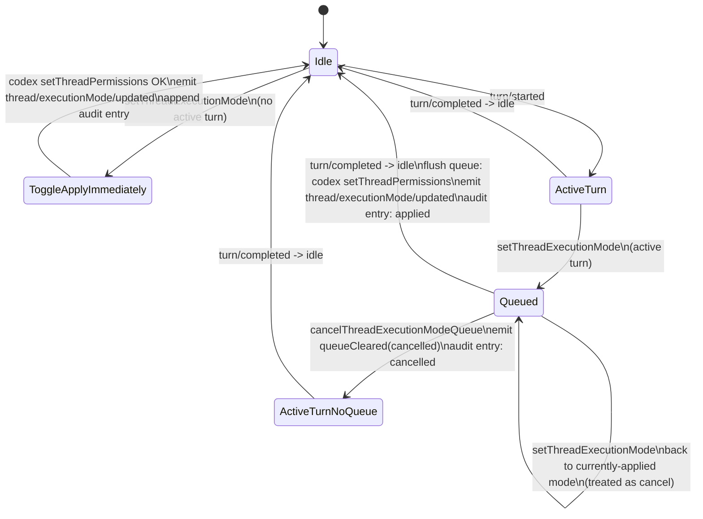

# Single-instance Codex App Server with queued permission-mode changes

## Overview

Two coupled changes ship in one feature:

1. **Collapse** the dual `codexDefaultClient` / `codexFullAccessClient` architecture to a **single Codex App Server child process**. Per-thread `PermissionProfile` plus per-turn `approvalPolicy` / `sandboxPolicy` overrides have been wire-supported since 2026-02-01 — the dual-process workaround for process-level sandbox is no longer load-bearing and now actively causes cross-process state divergence (see PR #217 thread for the bug).

2. **Treat the resume boundary (turn-end) as the only legal moment to change a thread's permission mode**. Mid-turn toggle attempts on the desktop or via messaging buttons are **queued**, surfaced visibly in the same composer-queue affordance the user already understands for queued reply messages, and **applied automatically when the in-flight turn ends**. Each queued/applied/cancelled transition writes a timestamped audit entry into the transcript on every bound surface (desktop transcript, Telegram, Discord, Mattermost-when-bound).

The end result: PwrAgent's expected execution mode and codex's per-thread profile cannot silently diverge during a turn, the user gets an honest "you have to wait until this turn ends" UX with a Cancel escape hatch, and the audit trail of mode changes is persistent and visible on every surface the user is reading the thread on.

## Problem Statement

### Why two processes existed

When access modes were introduced (`docs/plans/2026-04-16-004-feat-codex-access-mode-toggle-plan.md`), the codex CLI's sandbox was process-level: launching with `-c sandbox_mode="workspace-write"` bound *every* thread in that process to workspace-write. To support both Default Access and Full Access concurrently, PwrAgent spawned two children with different `-c` args and routed each thread to whichever child matched its overlay's `executionMode`.

### What changed in upstream codex

The protocol moved permission state to a per-thread `PermissionProfile` (`#18278`, `#19773-19776`, `#20106`):

- `TurnStartParams.approvalPolicy` and `TurnStartParams.sandboxPolicy` (V2, available since 2026-02-01) override "for this turn and subsequent turns".
- `ThreadStartResponse` / `ThreadResumeResponse` / `ThreadForkResponse` echo the canonical `approvalPolicy` + `sandbox` so clients can detect drift (already wired through PR #217).
- An upcoming change (PR #21250 on `feat/messaging-mattermost-adapter`'s parent) makes raw `sandboxPolicy` on `turn/start` and raw `sandbox` on `thread/resume` server-rejected — the canonical mechanism becomes named-profile selection via the experimental `permissions: PermissionProfileSelectionParams` field. This is forward-compatible with our single-instance plan but **not** with the dual-process model.

### Why the dual-process model is now actively harmful

A single codex process can host threads with **mixed** permission profiles safely (each turn carries its own override). The dual-process model introduces a class of bugs that single-process eliminates:

- **No file lock on rollout.** Both processes share `~/.codex/sessions/` and can technically write the same file. Today we're only safe because PwrAgent routes each turn to exactly one process at a time.
- **No `thread/unload` RPC.** Once process A has loaded a thread into memory, process A keeps the cached `CodexThread` forever; codex has no API to evict.
- **No history reload on resume of a cached thread.** When `thread/resume` lands on a process that already has the thread cached, codex returns the disk's current history *to the client* but continues using its **in-memory copy** for subsequent turns (`thread_processor.rs:2607-2624` upstream). Round-trip toggle (Default → Full → Default) leaves process A's cache stale by all the turns process B served, and the next turn on A is built on outdated context.
- **Drift surface.** Cross-process state divergence is exactly what the PR #213-#217 chain was fighting. The drift detector catches the *symptom* on focus, but the underlying split-brain remains.

### Why the queue at the resume boundary

Codex's `thread/resume` is the canonical "set this thread's permission profile" mechanism. Mid-turn `thread/resume` is documented to either reject or warn-and-ignore overrides ("thread/resume overrides ignored for running thread", `thread_processor.rs:2646`). The honest answer is that **a thread's permission profile is immutable while a turn is running**. Pretending otherwise (the previous "toggle takes effect immediately" UX) creates the silent-divergence bugs we've been chasing. Queueing the change and visibly waiting for turn-end matches codex's actual semantics and matches the user's existing mental model for queued reply messages.

## Proposed Solution



### Single-instance Codex App Server

- One child process. Spawned with `-c approval_policy="on-request" -c sandbox_mode="workspace-write"` so newly created threads default to Default Access. Existing threads carry their persisted profile.
- Routing in `withCodexThreadClient` becomes a passthrough.
- `EXECUTION_MODE_SUMMARIES` stays — we still need the mapping from PwrAgent's `default | full-access` enum to codex's `(approvalPolicy, sandbox)` pair when calling `client.setThreadPermissions(...)`.
- `activeCodexTurnModes` stays — it now records the **executing** mode of the in-flight turn (vs. queued / overlay) so the renderer can surface "Default Access (running) → Full Access (queued after this turn)" if needed.
- Per-turn override on `turn/start` (already added in PR #213) is unchanged. With the single process this is defense-in-depth: codex's persisted profile is the canonical state; per-turn override re-asserts it on every wire call.

### Queued mode-change semantics

- New overlay-store-side state (in registry memory, exposed via navigation snapshot — see Decisions §1):
  - `queuedExecutionMode?: ThreadExecutionMode`
  - `queuedExecutionModeAt?: number` (epoch ms — used for the transcript audit entry)
- New IPC: `agent:queue-thread-execution-mode` and `agent:cancel-thread-execution-mode-queue`. (We keep `agent:set-thread-execution-mode` as the single user-facing entry point — the registry decides queue-vs-apply based on whether a turn is active.)
- New bus notifications:
  - `thread/executionMode/queued` — params `{ threadId, queuedExecutionMode, queuedAt }`
  - `thread/executionMode/queueCleared` — params `{ threadId, reason: "applied" | "cancelled" }`
  - `thread/executionMode/updated` — already exists. Continues to fire on apply (whether direct or via queue flush) and remains the trigger for messaging refresh + drift recheck.

### Audit log

- Persistent per-thread transition log on overlay state: `permissionTransitionLog: ThreadPermissionTransition[]` capped at 100 entries (LRU).
- `ThreadPermissionTransition` shape:
  ```ts
  type ThreadPermissionTransitionStatus = "queued" | "applied" | "cancelled";
  type ThreadPermissionTransition = {
    id: string;          // ULID, used as React key + dedupe
    fromExecutionMode: ThreadExecutionMode;
    toExecutionMode: ThreadExecutionMode;
    status: ThreadPermissionTransitionStatus;
    occurredAt: number;  // epoch ms
    queueId?: string;    // links queued + applied/cancelled entries together
  };
  ```
- Renderer materializes log entries as `AppServerThreadActivityEntry`-shaped objects at transcript-build time, splicing them into the entry array ordered by `occurredAt`.
- Messaging surfaces post the transition as a fresh chat message in the bound conversation (rich text formatted, with timestamp and from/to labels).

## Technical Approach

### Architecture

#### Layer-by-layer changes

| Layer | File | Change |
|---|---|---|
| Type contracts | `packages/shared/src/contracts/navigation.ts` | Add `queuedExecutionMode`, `queuedExecutionModeAt`, `permissionTransitionLog` to `NavigationThreadSummary` and `ThreadOverlayState`. Add `ThreadPermissionTransition` and `ThreadPermissionTransitionStatus` types. |
| Type contracts | `packages/shared/src/contracts/normalized-app-server.ts` | Add `thread/executionMode/queued` and `thread/executionMode/queueCleared` to `AppServerNotification` union. |
| Type contracts | `packages/shared/src/contracts/agent.ts` | Add `QueueThreadExecutionModeRequest`, `CancelThreadExecutionModeQueueRequest` and matching response types. |
| Backend registry | `apps/desktop/src/main/app-server/backend-registry.ts` | Drop `codexFullAccessClient`. Simplify `getClient`, `withCodexThreadClient`, `setThreadExecutionMode`. Add queue state machine. Add turn-end queue-flush hook. Append transitions to log. |
| Codex client | `apps/desktop/src/main/codex-app-server/client.ts` | No structural changes. The per-turn override and resume-failure logging from PR #213 are unchanged. |
| Overlay store | `apps/desktop/src/main/state/overlay-store-sqlite.ts` | Persist `permissionTransitionLog` (capped at 100). Queue itself stays in-memory. |
| Renderer overlay snapshot | `packages/agent-core/src/domain/navigation-state.ts` | Materialize permission transitions into the navigation snapshot. |
| IPC | `apps/desktop/src/main/ipc/agent-ipc.ts`, `apps/desktop/src/preload/index.ts`, `apps/desktop/src/renderer/src/lib/desktop-api.ts`, `apps/desktop/src/shared/ipc.ts` | Wire two new channels (queue, cancel). |
| Renderer composer | `apps/desktop/src/renderer/src/features/composer/Composer.tsx` | Access-mode picker calls a new prop `onSetExecutionMode` (existing) but the registry decides queue/apply. Render queue indicator block in the composer queue affordance with one Cancel button. |
| Renderer transcript | `apps/desktop/src/renderer/src/features/thread-detail/TranscriptList.tsx`, `TranscriptActivity.tsx` (or new `TranscriptPermissionTransition.tsx`) | Render `ThreadPermissionTransition` entries inline as compact warning-tone activities. |
| Messaging controller | `apps/desktop/src/main/messaging/core/messaging-controller.ts` | `togglePermissionsMode` calls `setThreadExecutionMode`. `handleBackendEvent` reacts to new queued / queueCleared notifications by editing/posting in the bound conversation. |
| Messaging status card | `apps/desktop/src/main/messaging/core/messaging-status-card.ts` | When queue is set, label shows `Permissions: Default → Full (queued)`. |
| Tests | `backend-registry.test.ts`, `backend-registry-replay-isolation.test.ts`, `messaging-controller.test.ts`, `Composer.test.tsx`, replay E2E specs | Mass update for single-process expectations + new queue assertions + new audit-trail assertions. |

#### `withCodexThreadClient` post-collapse

```ts
// before — see backend-registry.ts:2833-2880
private async withCodexThreadClient<T>(
  threadId: string,
  operation: (client: BackendClient, mode: ThreadExecutionMode) => Promise<T>,
  requestedMode?: ThreadExecutionMode,
): Promise<T> {
  // routing fork between codexDefaultClient and codexFullAccessClient
}

// after — collapses to a passthrough; mode is used only by callers that
// want to know what the active overlay says (so they can pass it to
// codex's per-turn override in turn/start).
private async withCodexThreadClient<T>(
  threadId: string,
  operation: (client: BackendClient, mode: ThreadExecutionMode) => Promise<T>,
  requestedMode?: ThreadExecutionMode,
): Promise<T> {
  const overlay = await this.overlayStore.getThreadOverlayState({
    backend: "codex",
    threadId,
  });
  const mode = requestedMode ?? overlay?.executionMode ?? "default";
  backendRegistryLog.debug("codex thread client routing", {
    threadId,
    mode,
    source: requestedMode ? "explicit" : overlay?.executionMode ? "overlay" : "default-fallback",
  });
  return await operation(this.codexClient, mode);
}
```

#### `setThreadExecutionMode` post-collapse with queueing

```ts
async setThreadExecutionMode(
  params: SetThreadExecutionModeRequest
): Promise<SetThreadExecutionModeResponse> {
  if (params.backend !== "codex") {
    // grok no-op (unchanged)
    return { ...params };
  }

  const overlay = await this.overlayStore.getThreadOverlayState({
    backend: "codex", threadId: params.threadId,
  });
  const currentApplied = overlay?.executionMode ?? "default";
  const hasActiveTurn = this.threadHasActiveTurn(params.threadId);

  // Toggling back to currently-applied mode while a queue is pending is a cancel.
  if (
    hasActiveTurn &&
    overlay?.queuedExecutionMode &&
    params.executionMode === currentApplied
  ) {
    await this.cancelThreadExecutionModeQueue({
      backend: "codex", threadId: params.threadId,
    });
    return {
      backend: "codex", threadId: params.threadId, executionMode: currentApplied,
    };
  }

  // Active turn → queue. No codex call, no overlay executionMode flip.
  if (hasActiveTurn && params.executionMode !== currentApplied) {
    return await this.queueThreadExecutionMode(params);
  }

  // No active turn → existing apply path (drop the cross-mode fallback).
  return await this.applyThreadExecutionMode(params);
}
```

#### Turn-end queue flush

The registry already listens for codex `thread/status/changed` events to maintain `activeCodexTurnModes` (`backend-registry.ts:3387-3412`). Add a flush hook in the same listener:

```ts
private onThreadIdle(threadId: ThreadId): void {
  const overlay = this.overlayStore.getThreadOverlayStateSync(threadId);
  const queued = overlay?.queuedExecutionMode;
  if (!queued) return;
  void this.applyThreadExecutionMode({
    backend: "codex",
    threadId,
    executionMode: queued,
    _appliedFromQueue: true,  // internal flag suppresses re-queueing
  }).then(() => this.clearQueueAndEmit(threadId, "applied"))
    .catch((err) => backendRegistryLog.error("queued mode flush failed", { threadId, err }));
}
```

The flush is idempotent: if no queue exists, it's a no-op. If a queue exists but the user immediately cancelled before the idle event landed, the cancel wins (cancel emits `queueCleared` and clears overlay).

#### Audit transition log materialization

```ts
// packages/agent-core/src/domain/navigation-state.ts
function buildNavigationThreadSummary(thread, overlay) {
  return {
    ...thread,
    executionMode: overlay?.executionMode ?? thread.executionMode ?? "default",
    queuedExecutionMode: overlay?.queuedExecutionMode,
    queuedExecutionModeAt: overlay?.queuedExecutionModeAt,
    permissionTransitionLog: overlay?.permissionTransitionLog ?? [],
    // ... existing fields ...
  };
}

// apps/desktop/src/renderer/src/features/thread-detail/TranscriptList.tsx
// At entry-build time, splice transitions into the entries array sorted by occurredAt.
function injectPermissionTransitions(
  entries: AppServerThreadEntry[],
  transitions: ThreadPermissionTransition[],
): AppServerThreadEntry[] {
  if (transitions.length === 0) return entries;
  const transitionEntries = transitions.map(toActivityEntry);
  return mergeByCreatedAt([...entries, ...transitionEntries]);
}
```

### Implementation Phases

#### Phase 1: Single-instance foundation (no UX changes yet)

**Goal:** prove that one codex process can host threads with mixed permission profiles, with no behavior change visible to users.

- [ ] Drop `codexFullAccessClient` instantiation (`backend-registry.ts:1108-1124`).
- [ ] Simplify `getClient` and `withCodexThreadClient` to single-client passthrough.
- [ ] Update `backend-registry-replay-isolation.test.ts:250-272` to assert `codexCount === 1` and one expected arg array.
- [ ] Update `backend-registry.test.ts:2536` (and friends) to remove dual-client setup; collapse mock client expectations.
- [ ] Update `replay-runtime.ts` / `replay-client.ts:189` to provide a single replay client.
- [ ] Run full test suite. Build + typecheck.
- [ ] **Acceptance:** all existing tests pass; PwrAgent functionally indistinguishable to a user.

#### Phase 2: Queue state machine (registry-only, no UI yet)

**Goal:** queue logic is correct and observable in logs, with no user-visible changes yet.

- [ ] Add overlay shape: `queuedExecutionMode`, `queuedExecutionModeAt`, `permissionTransitionLog` in shared contracts and overlay-store-sqlite.
- [ ] Add registry methods: `queueThreadExecutionMode`, `cancelThreadExecutionModeQueue`, `applyThreadExecutionMode` (extracted from existing `setThreadExecutionMode`).
- [ ] Refactor `setThreadExecutionMode` to dispatch queue-vs-apply based on `threadHasActiveTurn(threadId)`.
- [ ] Hook `onThreadIdle` into the existing turn-status listener to flush queues.
- [ ] Append `permissionTransitionLog` entries on every transition (queued, applied, cancelled), capped at 100 LRU.
- [ ] Emit `thread/executionMode/queued` and `thread/executionMode/queueCleared` notifications.
- [ ] Tests: registry queue state machine + flush flow + log eviction (target ~15 unit tests in `backend-registry.test.ts`).

#### Phase 3: Renderer surface (desktop)

**Goal:** desktop user sees the queue in the same place they see queued messages today; can cancel; sees audit entries inline in the transcript.

- [ ] `useThreadNavigation`: handle new bus notifications (queued, queueCleared) by patching `NavigationThreadSummary.queuedExecutionMode` and `permissionTransitionLog` immutably (mirroring `applyThreadExecutionModeUpdate` at `useThreadNavigation.ts:1262-1281`).
- [ ] `Composer.tsx`: render a permission-queue block in the same `composer__queued` surface (`Composer.tsx:3102-3147`), styled distinctly from queued reply messages, with one Cancel button.
- [ ] Access-mode picker (`Composer.tsx:3563-3595`): no behavior change at the click site — registry decides. Add a "Queued → Full Access" subtitle on the chip when overlay's `queuedExecutionMode` is set.
- [ ] `TranscriptList.tsx`: extend the entry-type dispatch (`TranscriptList.tsx:710-712`) with a new branch for permission transitions. Render via a new `TranscriptPermissionTransition` component (or extend `TranscriptActivity` with a discriminated variant).
- [ ] Renderer test (`Composer.test.tsx`): toggle during active turn → queue indicator visible; click Cancel → queue cleared; advance to idle → indicator gone, audit entry visible.
- [ ] Replay E2E test (`apps/desktop/e2e/permissions-queue-replay.spec.ts`): start turn, toggle Full while running, advance through turn-end → assert audit-entry rendered + queue indicator gone.

#### Phase 4: Messaging integration

**Goal:** messaging surfaces (Telegram, Discord) reflect the queue and audit log identically to desktop.

- [ ] `messaging-controller.ts:togglePermissionsMode` (`:2750-2774`): no change at the call site — registry decides. The per-binding preferences write at `:2763-2766` is now skipped if the change is going to be queued (the binding prefs flip only on apply, mirroring overlay).
- [ ] `messaging-controller.ts:handleBackendEvent`: branch on `thread/executionMode/queued` and `queueCleared`, post the audit chat message via the binding's `MessagingDeliveryService`.
- [ ] `messaging-status-card.ts:163-172`: when overlay has a queued mode, label becomes `Permissions: Default → Full (queued)` and the action's secondary label invites Cancel.
- [ ] Audit message format: rich Markdown with timestamp, from/to mode labels, status emoji.
- [ ] Discord + Telegram support `supportsMessageEdit` (`discord-adapter.ts:267`, `telegram-adapter.ts:365`) — edit the queued message in place on apply or cancel. On edit failure (per `2026-04-30-002-feat-messaging-command-surfaces-plan.md:280` learning) fall back to fresh-message.
- [ ] Messaging-controller tests: queue-during-turn → controller posts queued message + edits to apply on idle; cancel button click → edits to cancelled state + clears queue.

#### Phase 5: Tests, docs, runbook

- [ ] Update `docs/messaging-architecture.md` to document the new bus notifications.
- [ ] Update `apps/desktop/CLAUDE.md` "Thread-State Update Bus" section to add `thread/executionMode/queued` and `queueCleared` to the documented method-name branches.
- [ ] Write a `docs/solutions/` retrospective (the codebase has been promising this since `2026-04-16-004` line 313 — see the Learnings Researcher findings) capturing what we learned through #209 → #213 → #217 → this collapse.
- [ ] Validate against the upcoming codex `permissions: PermissionProfileSelectionParams` field landing on `origin/main` (via `feat/messaging-mattermost-adapter`'s parent). Confirm that single-instance is forward-compatible with that protocol shift.

## Alternative Approaches Considered

### A. Stay with two processes; fix divergence with explicit handoff orchestration

Add a "drain process A's cache for thread X" step before routing to process B. Codex has no `thread/unload` RPC, so the only mechanism is restart-the-process. Restart kills *all* threads in that process, not just the one being toggled. Rejected.

### B. Two processes; refuse round-trip toggles

Detect when a toggle would route a thread back to a process whose cache is now stale, and refuse the toggle. Possible, but creates surprising user-visible failures ("you can't go back to Default Access on this thread because reasons") and still leaves single-direction toggles vulnerable to in-flight races. Rejected.

### C. Single process, immediate apply (no queue)

Skip the queue entirely; collapse to one process and apply mode changes immediately even mid-turn. Codex's `thread/resume` mid-turn either rejects or warn-and-ignores overrides, so the apply silently no-ops. The user thinks they switched to Full Access, the in-flight turn is still running with Default Access. Same drift class as today. Rejected — the queue is what makes this honest.

### D. Single process, immediate apply via per-turn override

Skip the queue, send the new policy via `turn/start`'s `approvalPolicy`/`sandboxPolicy` override on the next turn. **The active turn that just had its toggle clicked** is unchanged, but the next turn picks up the new mode automatically. This is closer to what we already do today (PR #213). The downside: zero feedback to the user that their click "didn't take effect right now". The visible surfaces still say the new mode. Rejected because honest UX > clever silent recovery.

### E. Selected approach: single process + queue + audit log

Captures what codex actually does (immutable mid-turn profile), gives the user a Cancel escape, and produces a persistent audit trail.

## System-Wide Impact

### Interaction Graph

```
[user clicks Access toggle]
    └─> Composer.onSetExecutionMode
        └─> ThreadView.onSetExecutionMode
            └─> useThreadNavigation.updateThreadExecutionMode  (optimistic — patches snapshot)
                └─> desktopApi.setThreadExecutionMode  (IPC)
                    └─> AGENT_SET_THREAD_EXECUTION_MODE_CHANNEL handler
                        └─> registry.setThreadExecutionMode
                            ├─> [active turn]
                            │   └─> queueThreadExecutionMode
                            │       ├─> overlayStore.setThreadExecutionModeQueue (in-memory)
                            │       ├─> appendPermissionTransition("queued")  (persisted)
                            │       └─> emit thread/executionMode/queued
                            │           └─> [renderer] applyThreadExecutionModeQueueUpdate
                            │           └─> [messaging] handleBackendEvent → post audit chat msg
                            │
                            └─> [idle]
                                └─> applyThreadExecutionMode
                                    ├─> withCodexThreadClient → client.setThreadPermissions → thread/resume
                                    ├─> overlayStore.setThreadExecutionMode (apply)
                                    ├─> appendPermissionTransition("applied")
                                    └─> emit thread/executionMode/updated
                                        ├─> [renderer] applyThreadExecutionModeUpdate
                                        ├─> [messaging] refreshStatusSurfacesForThread
                                        └─> [messaging] post audit chat msg

[turn ends — codex emits thread/status/changed → idle]
    └─> registry.emit() listener
        ├─> activeCodexTurnModes.delete(...)
        └─> [if overlay has queue]
            └─> applyThreadExecutionMode (same path as immediate-apply above)
                └─> emit queueCleared(reason: "applied") AFTER thread/executionMode/updated
                    └─> [renderer] removes queue indicator
                    └─> [messaging] edits queued chat msg → "submitted"

[user clicks Cancel on queue indicator]
    └─> desktopApi.cancelThreadExecutionModeQueue (IPC)
        └─> registry.cancelThreadExecutionModeQueue
            ├─> overlayStore clears queue
            ├─> appendPermissionTransition("cancelled")
            └─> emit queueCleared(reason: "cancelled")
                └─> [renderer] removes queue indicator
                └─> [messaging] edits queued chat msg → "cancelled"
```

### Error & Failure Propagation

- **`client.setThreadPermissions` (i.e., `thread/resume`) failure on apply.** Already partially handled by PR #213's resume-failure logger — the per-turn override on the next `turn/start` re-asserts the policy. For queue-flush, additionally: keep the queue, log error, retry on next idle. After 3 consecutive failures, surface as a warning-tone audit transition ("Failed to apply queued change to Full Access").
- **Queue-flush race with new turn submit.** User toggles during turn → queue set. Turn ends → flush starts (asynchronously). User immediately submits another message → new turn starts. The flush and the new turn race. Resolution: flush before turn-start. Insert flush as the FIRST hook on the idle notification, before the next turn start can be accepted. The turn-admission machinery (already documented as `starting` race in `2026-05-03-001-fix-messaging-turn-admission-plan.md:162-167`) ensures the flush completes before turn/start fires.
- **Queue exists at app-restart with no active turn.** Drain on first navigation reconcile — apply immediately, log audit transition with status `applied` and a note "(applied on restart)". Alternative: clear without applying; rejected because it'd silently swallow the user's prior intent.
- **Codex App Server crash.** Single-process model: the entire codex child is gone. The desktop-side queue state survives in registry memory. Codex restarts via existing crash-recovery; the queue applies on the first idle after the new codex finishes loading. (Same as today — handle inherits from existing crash recovery.)

### State Lifecycle Risks

- **Queue + active-turn-mode mismatch.** `activeCodexTurnModes` records the executing mode; overlay records the applied mode (which equals executing because we never apply mid-turn); queue records the pending target. Three slots, one source of truth per slot. Audit: every state mutation must update exactly one slot atomically.
- **Audit log unbounded growth.** Capped at 100 entries per thread, evicted oldest-first on append. Entries are tiny (~150 bytes each) — 15KB ceiling per thread is acceptable.
- **Drift detector (#217) interaction.** Drift compares overlay's `executionMode` against codex's observed value. Queue does NOT flip overlay's `executionMode`, so during a queued state, drift detector sees no change (correctly — codex is still on the old mode). On apply, both flip together. No new drift surface.
- **Overlay write contention.** Registry serializes overlay writes via the existing sqlite-store mutex. Queue writes are short. No new contention.

### API Surface Parity

Three surfaces, identical conceptual model:

- **Desktop transcript.** Inline activity entries, ordered by `occurredAt`.
- **Telegram.** Chat messages in the bound conversation, with edit-on-state-change for the queued message.
- **Discord.** Same as Telegram.
- **Mattermost (when adapter lands).** Same — capability profile already declares `supportsMessageEdit`.

The capability-profile system gracefully degrades on text-only providers (e.g., Signal): no buttons; the toggle has to be initiated from the desktop or via a `/access` slash command.

### Integration Test Scenarios

1. **Toggle while turn active → cancel before idle.** Submit msg, toggle Full mid-turn, click Cancel before turn ends, verify codex was never asked to switch and only "queued" + "cancelled" entries appear in transcript.
2. **Toggle while turn active → wait for idle.** Submit msg, toggle Full mid-turn, advance through turn-end, verify codex called once with new permissions and "queued" + "applied" entries appear.
3. **Round-trip toggle while turn active.** Submit msg, toggle Full → toggle Default → wait for idle. Verify codex was never called (the second toggle cancels the first), only "queued" + "cancelled" entries.
4. **Toggle while idle → applies immediately.** No turn running, toggle Full, verify codex called once and only an "applied" entry.
5. **Cross-surface visibility.** Bind thread to Telegram + Discord. Toggle from desktop during active turn. Verify both messaging surfaces post the queued audit message; on apply, both edit the queued message to "submitted".
6. **Audit log eviction.** 101 transitions in one thread → oldest evicted; transcript renders the most-recent 100.
7. **Restart with pending queue, no active turn.** Set queue, kill app (simulate crash), restart. Queue applies on first navigation reconcile, transcript shows "applied (on restart)".

## Acceptance Criteria

### Functional Requirements

- [ ] PwrAgent spawns exactly one codex child process at startup (verifiable via `ps`).
- [ ] `EXECUTION_MODE_SUMMARIES` mapping intact and used by `setThreadPermissions` and the per-turn override.
- [ ] Toggling permission mode while a turn is running queues the change instead of applying it.
- [ ] Composer queue surface shows the queued mode change distinctly from a queued reply message, with a single "Cancel" button.
- [ ] Cancelling the queue removes the indicator and emits a "cancelled" audit transition.
- [ ] On turn-end, queued changes apply automatically: codex `setThreadPermissions` is called once, overlay's `executionMode` flips, "applied" audit transition is appended, queue is cleared.
- [ ] Toggling permission mode while idle applies immediately (no queue).
- [ ] Toggling back to the currently-applied mode during a queued state cancels the queue.
- [ ] Each transition produces a transcript audit entry rendered inline on every bound surface (desktop transcript, Telegram chat, Discord chat).
- [ ] Audit entries persist across thread reload and app restart.
- [ ] Audit log is capped at 100 entries per thread, oldest evicted on append.

### Non-Functional Requirements

- [ ] No regression in existing tests (current full-suite count: ~896 backend + ~348 renderer).
- [ ] Typecheck clean.
- [ ] Dependency boundary lint clean.
- [ ] Codex spawn arg pinning test (`backend-registry-replay-isolation.test.ts`) updated to assert single-process spawn with workspace-write/on-request defaults.

### Quality Gates

- [ ] New unit tests cover queue state-machine transitions (queue, replace queue, cancel-via-toggle-back, apply-on-idle, eviction at cap).
- [ ] New replay E2E test covers desktop end-to-end queue flow.
- [ ] New messaging-controller tests cover audit-message edit on apply / cancel and edit-failure fallback.
- [ ] Documentation updated: `docs/messaging-architecture.md`, `apps/desktop/CLAUDE.md` Thread-State Update Bus section.

## Success Metrics

- **Drift detector firing rate (#217).** Should approach zero for permission-mode-related drift after this lands. (Existing telemetry from `codex thread client routing` and `checked thread execution mode drift` log lines.)
- **User support burden.** No more "I toggled to Full Access but it ran with Default permissions" reports.
- **Forward compatibility readiness.** Plan to opt into codex's experimental `permissions: PermissionProfileSelectionParams` once the deprecation in PR #21250 lands on `origin/main` becomes a small, isolated follow-up rather than a full re-architecture.

## Dependencies & Prerequisites

- **PR #213 (per-turn `approvalPolicy`/`sandboxPolicy` override on `turn/start` + resume-failure logging)** — landed with this plan or before. The single-process model relies on the per-turn override as defense-in-depth.
- **PR #217 (drift detection)** — already merged into `origin/main` (commit `393fe71a`). Drift detection becomes the safety net even after this plan lands.
- **No external dependencies.** Codex App Server protocol is already supported.

## Risk Analysis & Mitigation

| Risk | Likelihood | Impact | Mitigation |
|---|---|---|---|
| Removing the second codex client breaks an existing workflow we forgot about | Low | Medium | Phase 1 ships behind a passthrough; full E2E suite must pass before phase 2 starts. Inventory all 12 `withCodexThreadClient` callers (already mapped in the research). |
| Audit log feels noisy in transcripts | Medium | Low | Render with subdued styling (warning tone optional, smaller font, dimmed). User feedback after a week of internal use; can fold into a collapsed group if too noisy. |
| Queue UX confused with steer / queued message | Low | Medium | Visually distinct treatment in the composer queue surface. Different icon. Different copy ("Permissions queued" vs. "Message queued"). |
| Codex's upcoming `permissions` profile selection lands and we have to migrate | Medium | Low | Single-process is the prerequisite for that migration. We'd switch from raw `approvalPolicy`/`sandbox` to `permissions: { type: "profile", id }` in `client.setThreadPermissions` and per-turn override. Localized change. |
| Edit-failure on Telegram/Discord queued message | Low | Low | Fall back to posting fresh "cancelled/applied" message per `2026-04-30-002-feat-messaging-command-surfaces-plan.md:280` learning. |
| Race: queue set + immediate user message submit + turn ends quickly | Low | Medium | Flush hook runs BEFORE next turn-start admission. Already required for correctness; documented in the messaging turn-admission plan as the `starting` sentinel pattern. |

## Resource Requirements

- **Engineering:** ~3–4 days of focused work for one engineer. Phase 1 is ~½ day (mostly test updates). Phase 2 is ~1 day (state machine + tests). Phase 3 is ~1 day (renderer + e2e). Phase 4 is ~½ day (messaging adapter + tests). Phase 5 is ~½ day (docs).
- **Testing:** Manual validation against a live codex (the original repro thread `019dee7f-3708-76d3-8fb4-9fb3e9db7d83` and the `019df34d-d561-7763-b1a0-6591048e7e55` permission-prompt repro). The user has indicated they'll test before push: **do not push without explicit user approval**.
- **No infra changes.**

## Future Considerations

- **Migration to codex's experimental `permissions: PermissionProfileSelectionParams` field.** Once that lands on `origin/main`, replace raw policy values in `setThreadPermissions` and per-turn override with named-profile selection. The drift detector and audit-log machinery are unchanged.
- **Multi-mode support.** Codex's named-profile model supports arbitrary user-defined profiles, not just two. The execution-mode enum could be replaced with a profile-id string in a future iteration. Out of scope here.
- **Per-binding queue overrides on messaging.** A user could potentially queue a mode change "for messaging X but not the desktop". Out of scope; the overlay model is currently per-thread, not per-binding.

## Documentation Plan

- Update `apps/desktop/CLAUDE.md` "Thread-State Update Bus" section: add new methods.
- Update `docs/messaging-architecture.md`: document audit-chat-message lifecycle, edit-on-state-change semantics.
- Write `docs/solutions/2026-05-DD-codex-permission-mode-state-machine.md`: the long-promised post-mortem capturing the #209 → #213 → #217 → this-plan story for institutional memory.
- Update `docs/desktop-codex-protocol-parity.md` (if it exists; otherwise leave) — note the single-process architecture and forward-compat plan.

## Sources & References

### Internal References

- **Repository research (recent agent run):** Composer queue mechanism at `apps/desktop/src/renderer/src/features/composer/Composer.tsx:907, 1711-1740, 3102-3147, 3563-3595`; transcript activity entries at `packages/shared/src/contracts/normalized-app-server.ts:227-236`, `apps/desktop/src/renderer/src/features/thread-detail/TranscriptActivity.tsx`, `TranscriptList.tsx:710-712`; codex two-process at `apps/desktop/src/main/app-server/backend-registry.ts:529-545, 1001-1002, 1108-1124, 1830-1889, 2587-2598, 2833-2880, 3387-3412`; `setThreadExecutionMode` flow through `useThreadNavigation.ts:2071-2121, 1262-1281`, `agent-ipc.ts:331-340`, `messaging-controller.ts:142-148, 2750-2774`; messaging buttons at `messaging-status-card.ts:163-172`, capability profiles at `packages/messaging/interface/src/index.ts:848-859`, `discord-adapter.ts:267`, `telegram-adapter.ts:365`.
- **Pinned dual-spawn tests** that need updating: `apps/desktop/src/main/__tests__/backend-registry-replay-isolation.test.ts:250-272`, `apps/desktop/src/main/__tests__/backend-registry.test.ts:436, 593-604, 2536`, `apps/desktop/src/main/testing/replay-runtime.ts`, `replay-client.ts:189`.

### Related Plans

- `docs/plans/2026-04-16-004-feat-codex-access-mode-toggle-plan.md` — origin of the dual-process architecture; the design we're replacing. Lines 75–82, 226–227 for the original constraints (which no longer apply).
- `docs/plans/2026-05-03-001-fix-messaging-turn-admission-plan.md:162-176, 588-633` — the `starting` race pattern we mirror for queue-flush ordering.
- `docs/plans/2026-05-02-001-fix-transcript-temporal-order-invariant-plan.md` — temporal-order ledger pattern; audit-entry insertion follows the same rules (assign order before grouping).
- `docs/plans/2026-04-30-002-feat-messaging-command-surfaces-plan.md:280` — edit-failure → `presented_new` fallback pattern for messaging surfaces.
- `docs/plans/2026-05-04-002-fix-thread-branch-drift-detection-plan.md:19-27, 87-98` — drift-dialog suppression-during-active-turn pattern; we adopt the same guard.

### Recent Related PRs

- [pwrdrvr/PwrAgent#203](https://github.com/pwrdrvr/PwrAgent/pull/203) (merged) — Composer dropping `executionMode`, registry cross-mode fallback fix.
- [pwrdrvr/PwrAgent#209](https://github.com/pwrdrvr/PwrAgent/pull/209) (merged) — codex client spawn-args fix.
- [pwrdrvr/PwrAgent#213](https://github.com/pwrdrvr/PwrAgent/pull/213) (open at time of writing) — per-turn `approvalPolicy`/`sandboxPolicy` on `turn/start` + resume-failure logging.
- [pwrdrvr/PwrAgent#217](https://github.com/pwrdrvr/PwrAgent/pull/217) (merged) — codex permission-mode drift detection.

### Upstream Codex References

- Per-turn override fields available since `974355cfdd` (2026-02-01).
- Per-thread `PermissionProfile` consolidation: upstream PRs `#18278`, `#19773-19776`, `#20106`.
- Upcoming raw-field deprecation (not yet on `origin/main`): commit `1cf571b200` on `feat/messaging-mattermost-adapter`'s parent — `sandboxPolicy` on `turn/start` and `sandbox` on `thread/resume` to be server-rejected, replaced by experimental `permissions: PermissionProfileSelectionParams`.

### Key Decisions Carried Forward

1. **Two processes were a workaround, not an invariant.** Once per-thread profiles landed in codex (Q1 2026), the dual-process architecture became technical debt.
2. **Codex's `thread/resume` is the canonical "set permissions" boundary.** Mid-turn resume overrides are documented as ignored. The queue model honors codex's actual semantics.
3. **Audit transitions need persistence.** Activity entries in PwrAgent's transcript today are renderer-derived from notifications and don't survive reload. The audit log requires its own persistence path (overlay-store-backed transition log, materialized into the transcript at render time).
4. **Bus is the single refresh source.** Per `apps/desktop/CLAUDE.md`, all cross-surface refresh goes through `AppServerNotification` events. New queued/queueCleared notifications follow this pattern.
