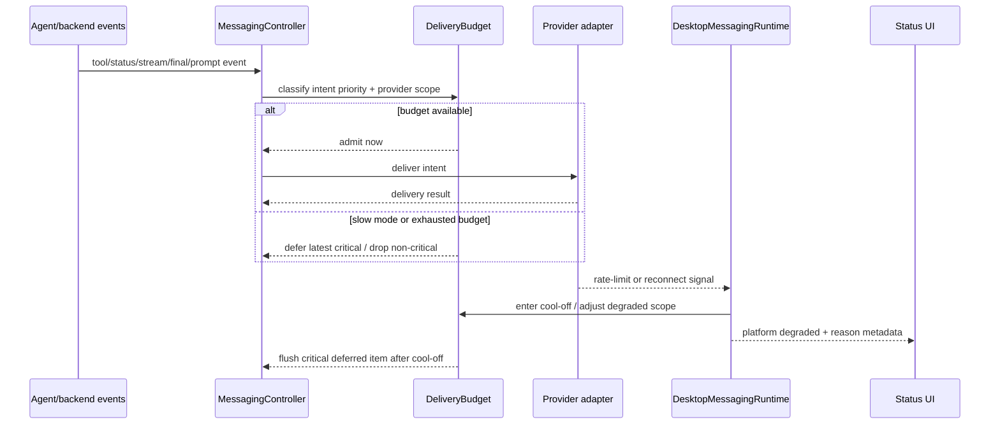
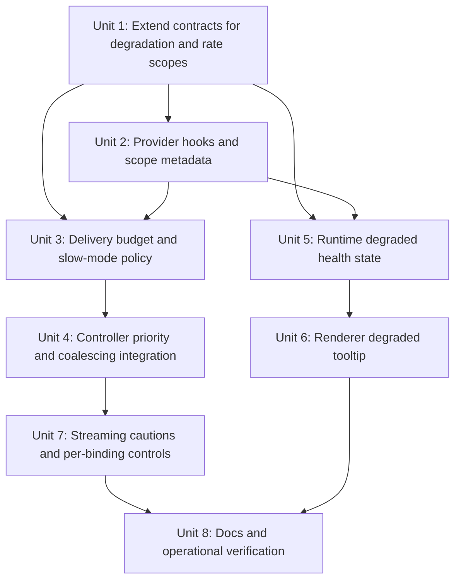
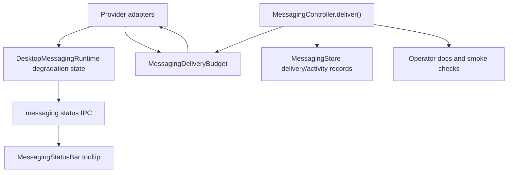

# feat: Add messaging rate-limit slow mode and degraded health

## Overview

Add one shared messaging delivery budget per provider-defined rate-limit scope, enter a conservative slow mode after provider 429s, prioritize turn-completed and user-response-critical messages, and surface transient degradation in the desktop status bar. At the same time, make Streaming Responses visibly advanced and cautioned because streaming edits are not agent progress updates; they repeatedly edit the same response text and consume the same platform write budgets that final messages, questions, status cards, and tool updates need.

This plan combines GitHub issues #220, #230, and #218 because the work shares the same delivery paths. Splitting it would create conflicting edits around `MessagingController.deliver()`, provider delivery results, runtime health state, and Settings copy.

## Problem Frame

PwrAgent's messaging integration is designed for remote agent operation, including mobile and voice-reader workflows (see origin: `docs/brainstorms/2026-04-30-messaging-platform-integration-requirements.md`). The current streaming and tool-update behavior can defeat that goal:

- Streaming response edits consume platform write budget rapidly and break tools that read messages on receipt but do not observe later edits.
- Tool update messages, status card edits, streaming edits, and final assistant messages are all admitted through separate local policies even when a provider rate limit applies across all writes to the same chat or channel.
- Telegram 429s currently slow only a stream-specific path; fresh messages, status posts, and tool updates can keep arriving and retrigger the same limit.
- The renderer has no `degraded` health state for "connected but cooling off" or "reconnecting", so the user sees either green silence or red overstatement.

## Requirements Trace

- R1. Preserve the channel-agnostic surface boundary: workflow code must not import provider SDKs or parse provider payloads (origin R1-R6, R25-R27).
- R2. Add shared delivery-budget admission across status, message, stream update, tool update, confirmation, questionnaire, approval, and error intents for the same provider-defined rate-limit scope (#220).
- R3. On provider rate-limit feedback, halt sends to that scope until the retry window clears, then enter slow mode with stricter coalescing and drop policy (#220).
- R4. Reserve limited budget for turn-completed assistant messages and user-response-critical prompts; non-terminal tool/status/stream updates may be dropped while slow mode is active (#220).
- R5. Stop avoidable per-turn status-message churn in slow mode, and reduce status-card "turn started/turn completed" edits where they are not product-critical (#220).
- R6. Add `degraded` platform health with structured degradation reasons, auto-recovery, and rich renderer tooltip behavior (#230).
- R7. Add provider hooks for rate-limit and reconnect signals without leaking provider SDK errors into shared contracts (#230).
- R8. Mark Streaming Responses as Advanced / Cautioned in Settings and docs, including voice-reader and rate-limit tradeoffs (#218).
- R9. Expose per-binding streaming controls through existing binding preference/status-card command surfaces, defaulting to inherited/global behavior (#218).
- R10. Keep final assistant message delivery authoritative; streaming must never suppress or delay the completed turn answer (#218, #220).

## Scope Boundaries

- In scope: generic messaging interface extensions, desktop runtime status contract, delivery admission/budgeting, slow-mode policy, provider rate-limit/reconnect hooks, Telegram/Discord/Mattermost/Slack adapter participation where current adapters make it straightforward, renderer degraded status UI, Settings caution copy, per-binding streaming preference control, docs, and tests.
- In scope: replacing Telegram's stream-only limiter with, or subordinating it to, the shared budget so all Telegram writes for the same scope compete fairly.
- Out of scope: paid Telegram broadcasts, operator-managed manual degradation overrides, historical degradation trend charts, cross-platform aggregate health rollups, and exact production tuning of every platform threshold.
- Out of scope: changing the app-server protocol or desktop transcript renderer.
- Out of scope: persisting slow-mode queues across app restart. Restart may drop non-critical queued updates; completed transcript state remains authoritative.

## Context & Research

### Relevant Code and Patterns

- `apps/desktop/src/main/messaging/core/messaging-controller.ts` owns backend event handling, active-turn lifecycle, tool update delivery, status rendering, assistant stream delivery, and the central `deliver()` wrapper.
- `apps/desktop/src/main/messaging/core/messaging-tool-update-policy.ts` already implements `Show Some` / `Show Less` batching, but it is per-binding and unaware of platform budget pressure.
- `packages/messaging/providers/telegram/src/telegram-adapter.ts` has stream-only rate tracking keyed by chat id; it detects Telegram retry-after only in `deliverStreamUpdate()`.
- `packages/messaging/providers/discord/src/discord-adapter.ts`, `packages/messaging/providers/slack/src/slack-adapter.ts`, and `packages/messaging/providers/mattermost/src/mattermost-adapter.ts` return failed delivery results but do not currently expose structured rate-limit events to the runtime.
- `apps/desktop/src/main/messaging/messaging-runtime.ts` owns per-platform health snapshots, runtime error hooks, activity events, and renderer-facing status events.
- `packages/shared/src/contracts/messaging.ts` currently defines `MessagingPlatformHealth` without `degraded`.
- `apps/desktop/src/renderer/src/features/messaging-status/MessagingStatusBar.tsx` maps health states to status dots and currently uses a plain `title` tooltip.
- `docs/UI-THEME.md` already defines `--status-warning` and `.status-dot--warning`, which is the right token path for degraded/orange health.
- `apps/desktop/src/renderer/src/features/settings/MessagingSettings.tsx` already exposes Streaming Responses toggles and has warning/help text plumbing.
- `packages/messaging/interface/src/index.ts` already has `MessagingStreamingResponseMode = "inherit" | "enabled" | "disabled"` and binding preferences already participate in stream policy.
- `apps/desktop/AGENTS.md` and `packages/messaging/AGENTS.md` require channel-neutral workflow semantics, provider SDK isolation, and the existing thread-state update bus for persistent thread state.

### Institutional Learnings

- `docs/solutions/2026-05-07-codex-permission-mode-state-machine.md` says UX must be honest when upstream semantics impose waiting: queue or delay visibly instead of pretending changes are immediate.
- `docs/plans/2026-05-02-002-feat-messaging-streaming-responses-plan.md` established that stream updates are optional, degradable, transient, and subordinate to final assistant delivery.
- `docs/plans/2026-05-02-001-feat-messaging-tool-update-verbosity-plan.md` established `Show Some` as the default tool-update posture; slow mode should become stricter than `Show Less`, not invent another user-visible verbosity mode.
- `docs/plans/2026-05-03-001-fix-messaging-turn-admission-plan.md` established queued messaging inputs and turn-completion handoff as a priority workflow; delivery budget should reserve space for those completion and prompt surfaces.

### External References

- Telegram Bot FAQ documents bot send limits: avoid more than one message per second in one chat, no more than 20 messages per minute in groups, and about 30 messages per second for bulk notifications unless paid broadcasts are enabled.
- Discord's rate-limit docs say limits are per route and global, should not be hard-coded, and clients should use rate-limit headers and 429 `retry_after` data.
- Slack's Web API docs say writes are generally one message per second per channel, with 429 `Retry-After` on HTTP APIs.
- Mattermost server rate limiting is deployment-configurable, defaults to off, and may throttle APIs by requests per second when enabled.

## Key Technical Decisions

- **Centralize admission in desktop messaging orchestration.** Providers know how to define rate-limit scopes and detect provider feedback, but `MessagingController.deliver()` is the only shared place where all outbound intent kinds meet before persistence, activity logging, and permanent-target handling.
- **Provider scopes, not workflow branches.** Adapters should expose channel-neutral scope metadata such as platform, scope id, scope kind, and conservative default capacity. The controller/runtime can budget against that without learning Telegram topics, Discord buckets, Slack thread timestamps, or Mattermost server configuration.
- **Use priority classes instead of independent queues per message kind.** Final assistant messages, questionnaires, approvals, and queued-input notices outrank streaming edits, tool progress, and routine status refreshes. This lets slow mode preserve useful turn-completed and action-required messages while dropping noisy intermediate updates.
- **Slow mode drops non-essential messages instead of building unbounded backlog.** Streaming partials, routine turn status edits, and low-priority tool updates are stale by the time the provider cool-off ends. The correct output is the latest/final aggregate, not delayed noise.
- **Degraded health is platform-level, reasons are structured.** Platform chips should turn orange when any active reason exists and health is not already `errored`. `errored` still wins because it means the adapter is offline or fatally failed.
- **Streaming remains available but visually discouraged.** A power user can enable it globally or per binding, but Settings and docs should make the tradeoff explicit: streaming response text is edit churn, not the same as agent turn progress or tool update coalescing.
- **Status churn is not guaranteed delivery.** In slow mode, the plan should avoid editing status cards just to say "turn started" and then "turn completed"; typing indicators and final messages carry the important user signal. Explicit prompts, queued-input notices, binding changes, and `/status` requests still deserve delivery attempts.

## Open Questions

### Resolved During Planning

- **Should the rate budget live in providers?** No. Providers cannot see the full cross-kind traffic mix and should not own tool/status/final-message priority decisions.
- **Should streaming be disabled completely?** No. Keep it as an advanced capability with warnings and per-binding control, because some desktop-visible chat workflows may still value it.
- **Should slow mode queue every skipped update?** No. Queue only latest/final aggregates and action-required surfaces. Drop obsolete intermediate tool/status/stream updates.
- **Should degraded be a replacement for errored?** No. `degraded` is transient and auto-clearing; `errored` remains sticky for sustained adapter failure.

### Deferred to Implementation

- Exact default token-bucket numbers for Discord, Slack, and Mattermost after inspecting SDK response metadata and existing tests.
- Whether Telegram topic-scoped deliveries should reserve at supergroup scope only or at both supergroup and topic scopes. Start with supergroup-level budget because the documented group limit is the safest constraint.
- Exact UI placement for the advanced streaming caution within the current Settings layout after seeing how much copy fits without clutter.
- Whether the first implementation stores per-binding streaming controls only in status-card actions or also adds a dedicated settings affordance later.

## High-Level Technical Design

> *This illustrates the intended approach and is directional guidance for review, not implementation specification. The implementing agent should treat it as context, not code to reproduce.*

Priority classes:

| Class | Examples | Slow-mode behavior |
| --- | --- | --- |
| Critical interactive | approval, questionnaire, pending request, queued-input controls | reserve budget; queue latest until cool-off ends |
| Final turn result | completed assistant message, terminal failure/cancel notice | reserve budget; queue latest per turn |
| User-command response | `/status`, `/resume`, `/detach`, explicit errors | admit when possible; queue briefly if actionable |
| Routine status | turn started/working/completed status-card refresh | skip unless user requested or binding state changed |
| Tool progress | generated tool updates | batch at turn boundary; drop non-terminal batches in slow mode |
| Streaming partial | non-final `stream_update` | drop while slow mode active; final aggregate may use final-turn class |

## Implementation Units

- [x] **Unit 1: Extend messaging contracts for degradation and delivery scopes**

**Goal:** Add channel-neutral types for degraded health reasons, rate-limit scope metadata, and outbound priority hints without importing provider SDKs into shared packages.

**Requirements:** R1, R2, R6, R7

**Dependencies:** None

**Files:**
- Modify: `packages/shared/src/contracts/messaging.ts`
- Modify: `packages/messaging/interface/src/index.ts`
- Test: `packages/shared/src/contracts/__tests__/settings.test.ts`
- Test: `packages/messaging/interface/src/__tests__/messaging-contract.test.ts`

**Approach:**
- Add `degraded` to `MessagingPlatformHealth`.
- Add structured `MessagingDegradationReason` entries for rate-limited, reconnecting, missing-permission, and warning-style conditions.
- Extend `MessagingPlatformStatus` and `MessagingPlatformStatusEvent` so renderer consumers receive reason lists, expiry metadata, and optional sanitized scope labels.
- Add generic delivery scope metadata that providers can attach or expose through an adapter helper: platform, scope id, scope kind, conservative capacity, and optional provider bucket id.
- Add or document priority classifications for outbound intents at the interface level only if the controller needs to pass them through tests; keep most priority logic in desktop core.

**Patterns to follow:**
- Current shared/interface type mirroring in `packages/shared/src/contracts/messaging.ts` and `packages/messaging/interface/src/index.ts`.
- Existing `MessagingStreamingResponseMode` policy vocabulary.
- Boundary rules in `packages/messaging/AGENTS.md`.

**Test scenarios:**
- Happy path: `MessagingPlatformHealth` accepts `degraded` and platform status snapshots can carry multiple degradation reasons.
- Happy path: a rate-limited reason includes retry/cool-off expiry metadata and a provider-neutral scope label.
- Edge case: an expired reason can be represented without requiring platform-specific fields.
- Error path: a reason detail with long provider-sourced text is clipped or marked for renderer sanitization before display.
- Regression: `packages/messaging/interface` still imports only allowed lower-layer packages and no provider package.

**Verification:**
- Contract tests prove the new status and scope shapes are exported, serializable through IPC-facing shared contracts, and provider-neutral.

- [x] **Unit 2: Add provider rate-limit/reconnect hooks and scope metadata**

**Goal:** Let adapters report 429/cool-off and reconnect-in-progress signals while declaring the rate-limit scope that should govern each outbound delivery.

**Requirements:** R1, R2, R3, R6, R7

**Dependencies:** Unit 1

**Files:**
- Modify: `apps/desktop/src/main/messaging/messaging-runtime.ts`
- Modify: `apps/desktop/src/main/messaging/core/messaging-adapter.ts`
- Modify: `packages/messaging/providers/telegram/src/telegram-adapter.ts`
- Modify: `packages/messaging/providers/discord/src/discord-adapter.ts`
- Modify: `packages/messaging/providers/mattermost/src/mattermost-adapter.ts`
- Modify: `packages/messaging/providers/slack/src/slack-adapter.ts`
- Test: `apps/desktop/src/main/__tests__/messaging-runtime.test.ts`
- Test: `apps/desktop/src/main/__tests__/telegram-adapter.test.ts`
- Test: `packages/messaging/providers/discord/src/__tests__/discord-adapter.test.ts`
- Test: `packages/messaging/providers/mattermost/src/__tests__/mattermost-adapter.test.ts`
- Test: `packages/messaging/providers/slack/src/__tests__/slack-adapter.test.ts`

**Approach:**
- Extend the desktop adapter interface with optional `resolveDeliveryScope(intent)` and rate/reconnect subscriptions.
- Telegram scope should start at chat/supergroup granularity for group/topic traffic and DM granularity for private chat traffic. It should report `retry_after` from any send/edit/pin path, not only streaming.
- Discord should surface rate-limit metadata from REST failures where the SDK/API wrapper exposes 429, retry-after, route bucket, scope, or global flags. If the current wrapper hides headers, the first slice should still support generic failed-result parsing and leave fuller bucket extraction deferred.
- Slack should map channel/thread deliveries to a channel-level write scope and report `Retry-After` when API errors expose it.
- Mattermost should report reconnecting for websocket reconnect attempts below the fatal threshold and rate-limited when HTTP responses or API wrappers surface throttling.
- Keep provider-specific identifiers opaque in persisted state and logs; scope labels may be sanitized summaries for diagnostics/UI.

**Patterns to follow:**
- Existing `onRuntimeError` hook in `apps/desktop/src/main/messaging/messaging-runtime.ts`.
- Telegram stream retry-after detection in `packages/messaging/providers/telegram/src/telegram-adapter.ts`.
- Mattermost websocket reconnect/fail threshold behavior in `packages/messaging/providers/mattermost/src/mattermost-adapter.ts`.

**Test scenarios:**
- Happy path: Telegram send/edit 429 emits one rate-limit event with retry-after and the supergroup-level scope.
- Happy path: a Telegram topic target maps to a supergroup scope so sibling topics share conservative group budget.
- Happy path: Mattermost reconnect attempt 1 or 2 emits reconnecting degradation and the threshold transition emits errored instead.
- Edge case: a provider without structured headers still returns a normal delivery failure and does not crash budget resolution.
- Error path: provider-sourced scope labels are clipped and do not echo untrusted raw text into renderer status.
- Regression: normal successful deliveries do not emit degradation signals.

**Verification:**
- Provider and runtime tests show hooks fire for rate-limit/reconnect conditions and remain optional for providers that cannot yet expose detailed metadata.

- [x] **Unit 3: Add shared delivery budget and slow-mode policy**

**Goal:** Implement a reusable desktop-main budget service that admits, queues, or drops outbound intents across all message kinds for the same provider-defined scope.

**Requirements:** R2, R3, R4, R5, R10

**Dependencies:** Units 1 and 2

**Files:**
- Create: `apps/desktop/src/main/messaging/core/messaging-delivery-budget.ts`
- Modify: `apps/desktop/src/main/messaging/messaging-runtime.ts`
- Test: `apps/desktop/src/main/__tests__/messaging-delivery-budget.test.ts`
- Test: `apps/desktop/src/main/__tests__/messaging-runtime.test.ts`

**Approach:**
- Model each provider scope as a token/window budget with reserved capacity for critical interactive and final-turn messages.
- Track hard cool-off windows from provider rate-limit events: no sends until `retryAfter + safety buffer`, then slow mode for a bounded recovery period.
- Have the runtime construct one budget coordinator per running adapter/platform and inject it into that adapter's controller so multiple bindings on the same platform share one scope map.
- During slow mode, admit final assistant messages and user-response-critical prompts first, coalesce one latest item per turn/scope where possible, and drop stale routine items.
- Treat non-final stream updates as immediately discardable in slow mode.
- Treat tool-update deliveries as coalescible by turn; allow one terminal batch only if budget remains after final/prompt reservations.
- Keep the service deterministic and easy to test with injected clock/timers.
- Return explicit admission outcomes: admitted, deferred, coalesced, dropped, and reason.

**Patterns to follow:**
- Timer/clock injection style in `apps/desktop/src/main/messaging/core/messaging-tool-update-policy.ts`.
- Queue lifecycle style from `apps/desktop/src/main/messaging/core/messaging-turn-admission.ts`.

**Test scenarios:**
- Happy path: under budget, status/message/stream/tool intents are admitted in arrival order.
- Happy path: when the scope has limited remaining budget, a final assistant message is admitted while routine status and stream partials are dropped.
- Happy path: a 429 event halts all sends for the scope until retry-after plus buffer, then enters slow mode.
- Edge case: ten active turns in one Telegram supergroup reserve capacity for terminal messages and force tool/stream traffic into drop/coalesce outcomes.
- Edge case: two independent scopes do not throttle each other.
- Error path: a deferred critical item is replaced by the latest item for the same turn where replacement is safe, avoiding unbounded memory growth.
- Regression: disposing the budget service clears timers and deferred queues.

**Verification:**
- Unit tests prove budget state transitions, reservation behavior, slow-mode drop policy, and auto-recovery are deterministic without provider SDKs.

- [x] **Unit 4: Integrate budget admission into controller delivery paths**

**Goal:** Route every outbound messaging intent through the shared budget, classify priority correctly, and reduce status/tool/stream churn while preserving final responses.

**Requirements:** R2, R3, R4, R5, R10

**Dependencies:** Unit 3

**Files:**
- Modify: `apps/desktop/src/main/messaging/core/messaging-controller.ts`
- Modify: `apps/desktop/src/main/messaging/core/messaging-tool-update-policy.ts`
- Modify: `apps/desktop/src/main/messaging/core/messaging-renderer.ts`
- Modify: `apps/desktop/src/main/messaging/messaging-runtime.ts`
- Test: `apps/desktop/src/main/__tests__/messaging-controller.test.ts`
- Test: `apps/desktop/src/main/__tests__/messaging-tool-update-policy.test.ts`
- Test: `apps/desktop/src/main/__tests__/messaging-runtime.test.ts`

**Approach:**
- Inject the delivery budget into `MessagingController` and make the private `deliver()` wrapper the single admission gate before `adapter.deliver()`.
- Classify intent priority from intent kind plus context: final assistant messages, pending requests, queued-turn notices, approvals, questionnaires, explicit command replies, routine status refreshes, tool updates, and stream updates.
- Ensure `flushToolUpdatesForBinding()` can ask the budget whether slow mode is active and either emit one terminal batch or drop pending non-terminal updates.
- For `renderBindingStatus()`, suppress routine active/completed status-card updates in slow mode unless triggered by explicit `/status`, binding preference mutation, permission queue action, handoff, or other user-actionable state.
- Preserve the existing "flush tool updates before final assistant/prompt" invariant only when budget admission says the tool flush should still be sent; otherwise log/drop the flush and send the final/prompt.
- Treat a final stream update as subordinate to final assistant delivery. If the stream final cannot be admitted, send the completed assistant message path instead.
- Record dropped/deferred outcomes in activity/logging without treating them as permanent target failures or revoking bindings.

**Patterns to follow:**
- Current `MessagingController.deliver()` wrapper for delivery records, activity logging, and permanent target failure handling.
- `shouldFlushToolUpdatesBeforeIntent()` ordering.
- Existing final-message dedupe via `assistantMessageDeliveryKey()`.

**Test scenarios:**
- Happy path: ordinary traffic below budget behaves as before and records deliveries.
- Happy path: slow mode drops non-final stream updates and still delivers the final assistant response exactly once.
- Happy path: slow mode with pending tool updates sends the final assistant response before any optional terminal tool batch.
- Happy path: explicit `/status` still gets a response when budget is available, while automatic turn-start/turn-complete status refreshes are skipped in slow mode.
- Edge case: a questionnaire or approval prompt during cool-off is deferred and sent when the scope reopens rather than being dropped.
- Edge case: adapter delivery failure after budget admission reports rate-limited and causes subsequent same-scope intents to slow down.
- Error path: dropped/coalesced intents do not call `recordDelivery()` as successful provider deliveries and do not revoke bindings.
- Regression: queued-turn notices, permission queue audit messages, and final assistant dedupe still work when budget is inactive.

**Verification:**
- Controller tests demonstrate cross-kind budget sharing, priority behavior, no lost final responses, and no accidental permanent-target revocation for budget drops.

- [x] **Unit 5: Add runtime degraded health state and auto-recovery**

**Goal:** Track structured transient degradation reasons in the desktop runtime and publish orange `degraded` platform status events to the renderer.

**Requirements:** R6, R7

**Dependencies:** Units 1 and 2

**Files:**
- Modify: `apps/desktop/src/main/messaging/messaging-runtime.ts`
- Modify: `apps/desktop/src/main/ipc/messaging-status.ts`
- Test: `apps/desktop/src/main/__tests__/messaging-runtime.test.ts`
- Test: `apps/desktop/src/main/__tests__/messaging-status-ipc.test.ts`

**Approach:**
- Add runtime APIs for adding, replacing, and clearing degradation reasons by platform and reason key.
- Subscribe to provider rate-limit/reconnect hooks after adapter start, similar to `onRuntimeError`.
- Convert active reasons into effective platform health: `errored` wins, `suspended` remains suspended, otherwise non-empty reasons produce `degraded`, and empty reasons return to `enabled`.
- Clear rate-limit reasons automatically at their expiry and reconnecting reasons when providers report recovery.
- Drop stale reasons before `getPlatformStatuses()` returns snapshots so renderer initial paint is accurate.
- Record compact activity entries for rate-limit and recovery transitions when they help operators diagnose message delays.

**Patterns to follow:**
- Existing `platformStatuses` and `broadcastPlatformStatus()` lifecycle in `messaging-runtime.ts`.
- Existing runtime-error subscription handling.
- Messaging Activity logging for inbound/outbound observability.

**Test scenarios:**
- Happy path: enabled -> degraded(rate-limited) -> enabled after expiry emits health transitions.
- Happy path: enabled -> degraded(reconnecting) -> enabled on recovered event.
- Happy path: two concurrent reasons keep the platform degraded until both clear.
- Edge case: `errored` supersedes active degradation reasons and red health remains sticky.
- Edge case: `suspended` platform does not appear green/orange while messaging is intentionally off.
- Error path: provider hook listener throwing is logged and does not stop runtime lifecycle.
- Regression: existing enabled/suspended/errored status snapshots remain compatible except for the added reason fields.

**Verification:**
- Runtime and IPC tests show status snapshots and events carry effective health plus reason detail through auto-recovery.

- [x] **Unit 6: Build degraded status chip tooltip**

**Goal:** Replace the status chip's plain title tooltip with a keyboard-accessible tooltip that explains degraded reasons while keeping click-through to Messaging Activity.

**Requirements:** R6

**Dependencies:** Unit 5

**Files:**
- Modify: `apps/desktop/src/renderer/src/features/messaging-status/MessagingStatusBar.tsx`
- Modify: `apps/desktop/src/renderer/src/features/messaging-status/useMessagingPlatformStatuses.ts`
- Modify: `apps/desktop/src/renderer/src/styles/app.css`
- Test: `apps/desktop/src/renderer/src/features/settings/__tests__/settings-screen.test.tsx`
- Test: `apps/desktop/src/renderer/src/features/messaging-status/MessagingStatusBar.test.tsx`

**Approach:**
- Map `degraded` to `status-dot--warning` and a `messaging-status-chip--degraded` text/border treatment using existing `--status-warning`.
- Add a small tooltip that opens on hover/focus and includes structured degradation reason lines.
- Render a platform summary plus each active degradation reason with sanitized, clipped text and retry duration when available.
- Keep click behavior compatible with existing activity navigation.
- Preserve vendor logo rendering as `` where current icons require it and avoid recoloring brand assets.

**Patterns to follow:**
- Tooltip guidance in `docs/UI-THEME.md`.
- Existing status dot utility classes in `apps/desktop/src/renderer/src/styles/app.css`.
- Existing `MessagingStatusBar` mounting in the Settings titlebar tests.

**Test scenarios:**
- Happy path: degraded Telegram renders orange dot and warning-toned chip.
- Happy path: hovering or focusing a degraded chip exposes a tooltip with the rate-limit reason and retry duration.
- Edge case: multiple reasons render as separate clipped rows.
- Edge case: expired reasons are not shown after the hook receives a cleared status.
- Accessibility: chip has an informative accessible label and uses `aria-describedby` for the tooltip.
- Regression: enabled/suspended/errored/unknown chips retain existing visual behavior.

**Verification:**
- Renderer tests prove the tooltip content and degraded visual state without relying on native `title` tooltips.

- [x] **Unit 7: Mark streaming as advanced/cautioned and expose per-binding control**

**Goal:** Make streaming opt-in feel like an advanced power-user setting and let individual bindings override inherited streaming behavior.

**Requirements:** R8, R9, R10

**Dependencies:** Units 3 and 4

**Files:**
- Modify: `apps/desktop/src/renderer/src/features/settings/MessagingSettings.tsx`
- Modify: `apps/desktop/src/main/messaging/core/messaging-status-card.ts`
- Modify: `apps/desktop/src/main/messaging/core/messaging-controller.ts`
- Modify: `packages/messaging/interface/src/index.ts`
- Modify: `packages/shared/src/contracts/messaging.ts` only if binding summaries need to expose the effective streaming mode to renderer/navigation surfaces.
- Test: `apps/desktop/src/renderer/src/features/settings/__tests__/settings-screen.test.tsx`
- Test: `apps/desktop/src/main/__tests__/messaging-status-card.test.ts`
- Test: `apps/desktop/src/main/__tests__/messaging-controller.test.ts`

**Approach:**
- Change Settings label/copy from a neutral toggle to an Advanced / Cautioned control. The copy should state that streaming edits the same message repeatedly, can trigger provider rate limits sooner, and is poor for voice readers that announce messages when first received.
- Keep global provider defaults off.
- Add a binding status-card action that cycles `Streaming: Auto`, `Streaming: Off`, and `Streaming: On`, using existing `binding.preferences.streamingResponses` where possible.
- Ensure `/status` or status-card text fallback can change the binding preference without a desktop-only path.
- Use existing binding-local mutation patterns: update store/preferences and re-render binding status inline because this does not flow through the thread-state bus.
- In slow mode, effective streaming should behave as disabled even when global or binding preference says enabled, with degraded/slow-mode docs explaining why.
- Do not add edit-rate floor or first-edit delay settings in this pass; the shared budget and slow mode supersede them for the observed storm.

**Patterns to follow:**
- Tool update mode action cycle in `apps/desktop/src/main/messaging/core/messaging-status-card.ts`.
- `cycleToolUpdateMode` handling in `MessagingController`.
- Existing streaming policy resolution in `deliverAssistantStreamBuffer()`.

**Test scenarios:**
- Happy path: Settings renders Streaming Responses as advanced/cautioned with warning text about voice readers and rate limits.
- Happy path: status-card action cycles inherited -> disabled -> enabled -> inherited and persists the binding preference.
- Happy path: a binding with `Streaming: Off` discards stream updates even if provider global streaming is enabled.
- Edge case: slow mode forces non-final streaming off while preserving final assistant delivery.
- Error path: invalid callback/text fallback for streaming mode returns a recoverable error without changing the binding.
- Regression: existing Tool Updates cycle and status-card actions remain within provider action limits.

**Verification:**
- Settings and controller tests prove the warning is visible, per-binding control works, and streaming cannot outrank final response delivery under slow mode.

- [x] **Unit 8: Update docs, smoke checks, and operational guidance**

**Goal:** Document the new streaming cautions, delivery budget behavior, degraded health semantics, and manual validation flow for provider rate limits.

**Requirements:** R3, R4, R5, R6, R8, R9, R10

**Dependencies:** Units 1-7

**Files:**
- Modify: `docs/messaging-adapter-contract.md`
- Modify: `docs/messaging-platform-integration.md`
- Modify: `docs/UI-THEME.md` only if degraded status wording needs to clarify the warning token usage.
- Test: `apps/desktop/src/main/__tests__/messaging-docs-links.test.ts`

**Approach:**
- Update adapter contract docs with delivery scope metadata, rate-limit hooks, benign drop/defer outcomes, and the rule that final assistant delivery remains authoritative.
- Update platform integration docs to explain slow mode, reserved budget, dropped intermediate updates, and user-visible degraded health.
- Rewrite Streaming Responses docs to say streaming is advanced/cautioned, separate from tool updates and typing, and usually not what users want for mobile/voice-reader workflows.
- Document per-binding streaming controls and how they interact with global provider defaults.
- Update Telegram/Discord/Mattermost/Slack smoke checks with a controlled noisy-turn scenario and expected no-message-loss behavior.
- Add manual checks that a rate-limit/reconnect degradation turns the status chip orange and then auto-recovers.

**Patterns to follow:**
- Current Streaming Responses and Tool Update Verbosity sections in `docs/messaging-platform-integration.md`.
- Current adapter Rendering Policy and Streaming Responses sections in `docs/messaging-adapter-contract.md`.

**Test scenarios:**
- Documentation link test: new docs links resolve and existing links stay valid.
- Manual Telegram: noisy long response plus tool activity in a supergroup/topic sends final completion and avoids repeated 429 storms; intermediate tool/stream updates may be dropped in slow mode.
- Manual Discord: simulated or observed 429 produces degraded status and retry-based recovery without losing final assistant response.
- Manual Mattermost: reconnect attempts below fatal threshold show degraded/reconnecting; fatal threshold still shows errored.
- Manual Settings: Streaming Responses warning is visible and per-binding override appears on the status surface.

**Verification:**
- Docs explain the operator-visible behavior well enough that delayed or dropped intermediate updates are understood as intentional slow-mode behavior, not silent message loss.

## System-Wide Impact

- **Interaction graph:** Backend events, inbound commands, status-card callbacks, pending requests, and provider reconnect/rate-limit events now converge through budgeted outbound delivery.
- **Error propagation:** Provider 429s should produce rate-limit degradation and budget cool-off, not permanent binding revocation. True 403/404-style target failures still revoke through existing permanent-failure logic.
- **State lifecycle risks:** Budget queues and stream buffers remain runtime state; final assistant content and thread transcript remain the restart-safe source of truth.
- **API surface parity:** Telegram, Discord, Mattermost, and Slack should all use the same hook/scope vocabulary even if provider-specific metadata is richer for some adapters.
- **Integration coverage:** Unit tests must cover the budget service in isolation plus controller integration across stream/tool/status/final/prompt kinds.
- **Unchanged invariants:** Provider packages remain isolated; shared workflow code remains channel-neutral; authorization, callback handle security, attachment ingestion, and final assistant dedupe do not change.

## Risks & Dependencies

| Risk | Mitigation |
| --- | --- |
| Provider rate-limit metadata is incomplete or SDK-hidden | Design hooks as optional and fall back to conservative static scopes plus failed-result parsing; defer richer bucket extraction per provider. |
| Slow mode drops an update the user expected | Restrict dropping to non-final stream, routine status, and intermediate tool progress; preserve final and action-required messages. |
| Final assistant message is delayed behind lower-priority backlog | Budget service reserves capacity and controller sends final/prompt before optional tool/status flushes. |
| Degraded status becomes noisy or flaps | Reasons have expiry/recovery semantics; runtime coalesces health transitions and `errored` remains sticky. |
| UI tooltip grows too complex | Keep one compact tooltip, no new positioning library, and reuse existing tokens. |
| Per-binding streaming controls inflate status-card actions | Follow existing action priority/capability limits and text fallback patterns. |
| Hard-coded platform limits drift | Use documented limits as conservative defaults, parse provider retry metadata when present, and document that exact tuning is operational. |

## Alternative Approaches Considered

- **Leave rate limiting inside each provider adapter.** Rejected because providers cannot see status, tool, prompt, final-response, and stream traffic as one priority queue. This would preserve the current failure mode where each kind behaves correctly in isolation but overloads the shared provider limit.
- **Disable Streaming Responses globally and remove the setting.** Rejected because streaming is still a valid advanced preference for some low-volume bindings. The safer product posture is strong warning, per-binding control, and automatic slow-mode override.
- **Queue every outbound intent until the provider recovers.** Rejected because intermediate stream/status/tool updates become stale quickly and can create a second storm after cool-off. The plan keeps only critical/final/latest aggregates.
- **Represent degraded health only in logs or Messaging Activity.** Rejected because users need immediate status-bar feedback when messages are delayed but the adapter is not dead.

## Success Metrics

- A noisy Telegram supergroup/topic turn with streaming enabled and tool activity delivers the final assistant response and any action-required prompt without repeated 429 storms.
- A provider 429 produces a visible degraded/orange platform status with a bounded recovery time and no red/offline false alarm.
- Slow mode demonstrably drops or coalesces non-terminal stream/tool/status traffic while preserving final turn output.
- Settings and docs make Streaming Responses read as an advanced, cautioned option rather than a normal recommended mode.

## Documentation / Operational Notes

- Streaming Responses should remain default off at provider level.
- In slow mode, "message loss" means non-authoritative progress surfaces were intentionally dropped; final assistant responses and pending user prompts are the protected outputs.
- Telegram group/topic budgets should be treated conservatively because the documented group limit is low and issue #220 observed topic traffic hitting 429s.
- Rate-limit and degraded events should be visible in Messaging Activity for post-incident diagnosis without exposing raw provider secrets or oversized scope labels.

## Sources & References

- **Origin document:** [docs/brainstorms/2026-04-30-messaging-platform-integration-requirements.md](../brainstorms/2026-04-30-messaging-platform-integration-requirements.md)
- Related issue: [#220 messaging rate-limit storm](https://github.com/pwrdrvr/PwrAgent/issues/220)
- Related issue: [#230 degraded messaging health](https://github.com/pwrdrvr/PwrAgent/issues/230)
- Related issue: [#218 streaming response tradeoffs](https://github.com/pwrdrvr/PwrAgent/issues/218)
- Related plan: [docs/plans/2026-05-02-002-feat-messaging-streaming-responses-plan.md](2026-05-02-002-feat-messaging-streaming-responses-plan.md)
- Related learning: [docs/solutions/2026-05-07-codex-permission-mode-state-machine.md](../solutions/2026-05-07-codex-permission-mode-state-machine.md)
- Related code: `apps/desktop/src/main/messaging/core/messaging-controller.ts`
- Related code: `apps/desktop/src/main/messaging/core/messaging-tool-update-policy.ts`
- Related code: `apps/desktop/src/main/messaging/messaging-runtime.ts`
- Related code: `packages/messaging/providers/telegram/src/telegram-adapter.ts`
- Related code: `packages/messaging/providers/discord/src/discord-adapter.ts`
- Related code: `packages/messaging/providers/mattermost/src/mattermost-adapter.ts`
- Related code: `packages/messaging/providers/slack/src/slack-adapter.ts`
- External docs: [Telegram Bot FAQ - limits](https://core.telegram.org/bots/faq#my-bot-is-hitting-limits-how-do-i-avoid-this)
- External docs: [Discord rate limits](https://docs.discord.com/developers/topics/rate-limits)
- External docs: [Slack Web API rate limits](https://docs.slack.dev/apis/web-api/rate-limits/)
- External docs: [Mattermost rate limiting configuration](https://docs.mattermost.com/administration-guide/configure/rate-limiting-configuration-settings.html)
