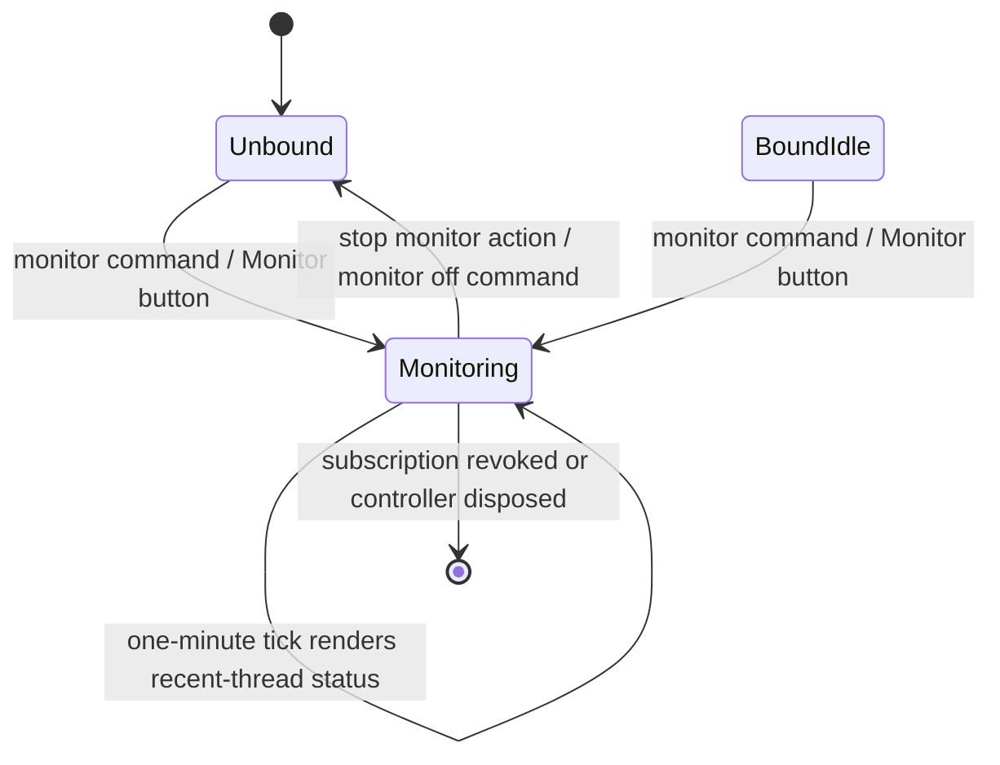
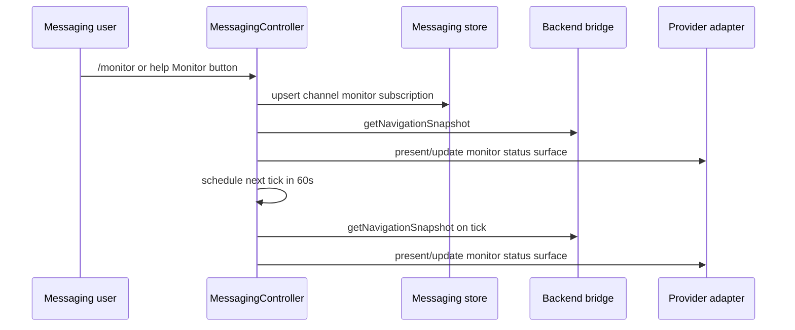
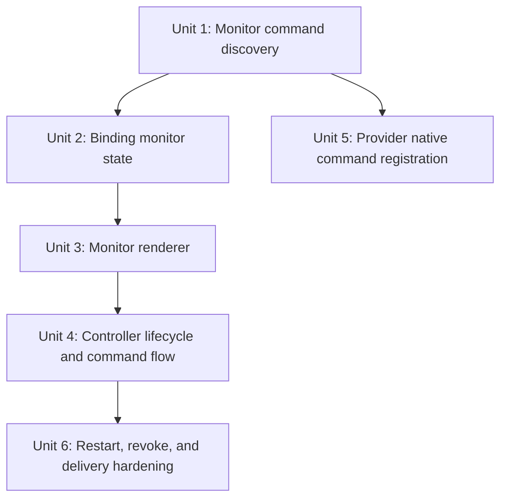

# feat: Add messaging monitor command

## Overview

Add a channel-bound `monitor` command to the messaging help surface so any authorized conversation can receive a once-per-minute "Monitor the Situation" snapshot of recent PwrAgent threads. The command should be discoverable from `/help`, usable from slash commands or bot mentions where the provider supports them, and scoped to the messaging conversation, not to a single thread binding.

The native Electron Help menu is intentionally not the first implementation target. It has no channel or binding context, while the messaging `/help` surface already owns command discovery, command buttons, and channel-bound workflow entry points.

## Problem Frame

PwrAgent messaging can already bind a conversation to a thread, show that bound thread's `/status`, and keep status surfaces fresh when backend events arrive. What is missing is a lightweight remote monitoring mode: when the user is away from the desktop, a clean monitoring channel should be able to ask PwrAgent to periodically summarize the current state of recent threads without requiring a thread binding, manual `/status` refreshes, or opening the desktop.

The feature should feel like a messaging command, not a provider feature. The controller should decide what "recent threads" means from the same navigation snapshot that powers Recents, then deliver a compact generic status surface through the existing adapter abstraction.

## Requirements Trace

- R1. Add a user-facing `monitor` command surfaced as `Monitor` in the messaging help command list and help action row.
- R2. `/monitor` or `@<bot> monitor` in an unbound conversation starts channel monitoring and immediately renders the first recent-thread status snapshot.
- R3. `/monitor` in any authorized conversation toggles monitoring on and starts a once-per-minute refresh loop for that conversation.
- R4. A conversation can stop monitoring without detaching from any thread binding it may also have.
- R5. The monitor snapshot summarizes recent threads, not only the single bound thread, using the same backend/navigation state that powers the desktop Recents lens.
- R6. The implementation remains channel-neutral: no Telegram, Discord, Slack, Mattermost, or LINE SDK types or platform IDs leak into controller or shared workflow logic.
- R7. Monitoring state is bound to the messaging conversation, survives controller/runtime restart where practical, and remains independent from thread binding/revoke lifecycle.
- R8. Periodic delivery avoids unbounded timers and duplicate loops; platforms that support surface updates should update the monitor surface in place, while non-editing platforms may post a fresh snapshot each minute.
- R9. Existing status-card behavior, thread event refreshes, assistant delivery, queued turns, and provider authorization behavior remain unchanged.

## Scope Boundaries

- In scope: messaging command catalog, command dispatch, help buttons, provider native command registration where currently supported, channel-level monitor state, controller timer lifecycle, monitor status rendering, and focused tests.
- In scope: compact recent-thread snapshot with thread title, backend, project/directory label when available, turn/activity state, permission queue hint, and last-updated time.
- In scope: a Stop Monitor action on the monitor surface plus text fallback through the existing command parser.
- Out of scope: native Electron Help menu integration, desktop renderer UI for monitoring, user-configurable interval, configurable thread count, notifications outside messaging channels, and historical monitoring logs.
- Out of scope: changing provider authorization, binding semantics, or the app-server protocol.

## Context & Research

### Relevant Code and Patterns

- `apps/desktop/src/main/messaging/core/messaging-command-catalog.ts` is the canonical source for messaging command verbs, `/help` body text, help action buttons, and command matching.
- `apps/desktop/src/main/messaging/core/messaging-controller.ts` owns command dispatch, binding lookup, backend navigation access, status rendering, timers for pending prompt debounce, and `dispose()` cleanup.
- `apps/desktop/src/main/messaging/core/messaging-status-card.ts` builds the current bound-thread status surface with managed delivery, target-surface updates, and action rows.
- `apps/desktop/src/main/messaging/core/messaging-thread-state.ts` resolves per-thread display state from `NavigationSnapshot` plus binding state.
- `packages/messaging/interface/src/index.ts` defines generic binding records, binding preferences, surface refs, status intents, confirmation intents, message intents, and callback/action shapes.
- `apps/desktop/src/main/state/messaging-store-sqlite.ts` persists binding records as sanitized JSON payloads and already preserves binding preferences and status surfaces.
- `apps/desktop/src/main/messaging/messaging-runtime.ts` constructs one `MessagingController` per active adapter, routes backend events to controllers, stops controllers on runtime shutdown, and broadcasts binding-change events.
- Provider command registration is split today: Telegram and Discord hardcode native command lists, Mattermost has `CANONICAL_COMMAND_BASES`, and Slack/LINE rely on inbound slash/text parsing rather than a shared provider command catalog.
- Tests to extend include `apps/desktop/src/main/__tests__/messaging-command-catalog.test.ts`, `apps/desktop/src/main/__tests__/messaging-controller.test.ts`, `apps/desktop/src/main/__tests__/messaging-status-card.test.ts`, and provider command/adapter tests under `packages/messaging/providers/*/src/__tests__/`.

### Institutional Learnings

- `docs/solutions/2026-05-07-codex-permission-mode-state-machine.md` warns against pretending state changes are immediate when the underlying lifecycle says otherwise; monitor enable/disable should surface the actual bound-channel state and cleanly stop future ticks.
- `apps/desktop/AGENTS.md` and `packages/messaging/AGENTS.md` require channel-neutral messaging workflow logic and provider SDK isolation.
- Prior messaging plans establish the managed status-surface pattern: update in place when possible, use provider fallbacks when update is unavailable, and keep text fallback available for low-button or text-only contexts.

### External References

- External research skipped. The repo already has direct patterns for messaging commands, help surfaces, status cards, binding persistence, controller timers, and provider command registration.

## Key Technical Decisions

- **Implement Monitor as a messaging command, not a native app Help item.** The requested behavior depends on a channel binding. The Electron Help menu in `apps/desktop/src/main/index.ts` has no active messaging channel context and would require a separate selection flow before it could act.
- **Use one monitor loop per active channel monitor subscription.** Monitoring is a conversation-level preference, so the timer should key by monitor subscription id and be created, restored, and disposed with the controller that owns that provider.
- **Persist monitor intent separately from thread bindings.** Monitor can be useful in a clean channel that is not bound to any thread. A provider-neutral monitor subscription record keeps the delivery channel, authorized actors, interval, and surface ref without making `/status` or normal message routing think the conversation is thread-bound.
- **Render a managed monitor status surface.** The monitor output should use the generic status intent shape and store a monitor-specific surface ref so subsequent minute ticks update the same post when adapters can edit. Fallback delivery may present a fresh message on providers that cannot update.
- **Reuse navigation snapshots for "recent threads."** The monitor should ask the existing backend bridge for a navigation snapshot and summarize its `threads` in Recents order. Do not add a new backend RPC for this first slice.
- **Keep `/status` unchanged.** The existing status card remains a bound-thread control surface. Monitor is a separate periodic summary and should not overload the existing `statusSurface` or `pinnedStatusSurface`.
- **Keep the default interval fixed at 60 seconds.** The user asked for once per minute. Configuration can come later if real use shows that the interval needs tuning.

## Open Questions

### Resolved During Planning

- **Does "Help menu" mean the Electron Help menu?** No for this slice. Because the requested output is bound-channel behavior, the plan treats "Help menu" as the messaging `/help` command surface and leaves native Electron Help unchanged.
- **Should Monitor start only after `/resume` binds a channel?** No. The intended workflow is `/monitor` in an otherwise unbound monitoring channel so it can summarize all recent threads.
- **Should Monitor summarize only the bound thread?** No. The user asked for recent threads, so the monitor should summarize the same recent-thread set the desktop navigation snapshot exposes, independent from any current thread binding.
- **Should the first implementation add interval or count settings?** No. Keep the first slice fixed and small: once per minute, compact recent list.

### Deferred to Implementation

- Exact maximum number of recent threads in the summary. Start with a compact top-five default unless tests or real provider formatting constraints suggest a smaller number.
- Exact wording and ordering of each thread line after seeing current provider rendering limits in Telegram, Discord, Slack, Mattermost, and LINE formatters.
- Whether the first monitor tick should update an existing previous monitor surface after restart if the stored surface is too old for a provider to edit. Adapter fallback should handle this, but provider-specific stale-edit behavior may require small adjustments.

## High-Level Technical Design

> *This illustrates the intended approach and is directional guidance for review, not implementation specification. The implementing agent should treat it as context, not code to reproduce.*

## Implementation Units

- [x] **Unit 1: Add Monitor to messaging command discovery**

**Goal:** Make `monitor` a canonical messaging command that appears in the `/help` body and help action row as `Monitor`.

**Requirements:** R1, R2, R9

**Dependencies:** None

**Files:**
- Modify: `apps/desktop/src/main/messaging/core/messaging-command-catalog.ts`
- Modify: `apps/desktop/src/main/messaging/core/messaging-controller.ts`
- Test: `apps/desktop/src/main/__tests__/messaging-command-catalog.test.ts`
- Test: `apps/desktop/src/main/__tests__/messaging-controller.test.ts`

**Approach:**
- Extend the canonical command verb set and catalog with `monitor`.
- Add command matching coverage so `/monitor`, provider-normalized bot mentions, repeated slash prefixes, and case-insensitive variants route to the same verb.
- Add controller dispatch for `monitor` without changing how unknown commands fall through to help.
- Keep `Resume` as the only primary-styled help action; `Monitor` should be a neutral command button like `Status` and `Detach`.

**Patterns to follow:**
- `MESSAGING_COMMAND_CATALOG`, `matchMessagingCommandVerb`, `paginateHelpCatalog`, and `buildHelpActions` in `apps/desktop/src/main/messaging/core/messaging-command-catalog.ts`.
- Help callback routing through `command:<verb>` in `apps/desktop/src/main/messaging/core/messaging-controller.ts`.

**Test scenarios:**
- Happy path: `/help` body contains `monitor` with a one-line description.
- Happy path: help actions include `command:monitor` in catalog order and keep `command:resume` as the primary action.
- Happy path: clicking the Monitor help button dispatches to the monitor handler.
- Edge case: `/MONITOR`, provider-normalized `@<bot> monitor`, and command callback dispatch all resolve to the canonical monitor verb.
- Regression: unknown commands still render help and do not trigger monitoring.

**Verification:**
- Command catalog tests and controller help-surface tests prove Monitor is discoverable and routable without drifting from the catalog.

- [x] **Unit 2: Add provider-neutral monitor state to channels**

**Goal:** Persist whether a messaging conversation is being monitored and remember the monitor surface used for in-place updates.

**Requirements:** R3, R4, R7, R8

**Dependencies:** Unit 1

**Files:**
- Modify: `packages/messaging/interface/src/index.ts`
- Modify: `apps/desktop/src/main/state/messaging-store-sqlite.ts`
- Modify: `apps/desktop/src/main/messaging/core/messaging-store.ts`
- Test: `packages/messaging/interface/src/__tests__/messaging-contract.test.ts`
- Test: `apps/desktop/src/main/__tests__/messaging-store-sqlite.test.ts`

**Approach:**
- Add channel-level monitor subscription metadata in the provider-neutral interface, including enabled state, interval, last-render timestamp, authorized actors, channel ref, and an optional monitor surface reference.
- Keep thread bindings and monitor subscriptions separate so `/monitor` does not make `/status` or normal text routing think the conversation is bound to a thread.
- Update store sanitization so monitor surface refs are sanitized through the same helper as `statusSurface` and `pinnedStatusSurface`.
- Add sqlite persistence for monitor subscriptions.

**Patterns to follow:**
- `MessagingBindingPreferences`, `MessagingBindingRecord`, and `MessagingSurfaceRef` in `packages/messaging/interface/src/index.ts`.
- `sanitizeBinding` in `apps/desktop/src/main/state/messaging-store-sqlite.ts`.
- Existing `statusSurface` / `pinnedStatusSurface` persistence.

**Test scenarios:**
- Happy path: a channel monitor subscription with monitor enabled and a monitor surface round-trips through the sqlite store.
- Happy path: monitor preferences update without dropping existing model, reasoning, execution mode, streaming, or tool-update preferences.
- Edge case: a malformed or incomplete monitor surface is sanitized out rather than persisted.
- Regression: revoked bindings keep enough historical payload for audit but do not remain active monitor candidates.
- Regression: interface contract tests prove the shape is provider-neutral and serializable.

**Verification:**
- Store tests prove monitor state persists independently from thread bindings and does not corrupt existing status or preference fields.

- [x] **Unit 3: Build a compact recent-thread monitor status surface**

**Goal:** Render a generic status intent that summarizes recent threads and exposes a Stop Monitor action.

**Requirements:** R3, R4, R5, R6, R8

**Dependencies:** Unit 2

**Files:**
- Create: `apps/desktop/src/main/messaging/core/messaging-monitor-card.ts`
- Modify: `apps/desktop/src/main/messaging/core/messaging-thread-state.ts`
- Test: `apps/desktop/src/main/__tests__/messaging-monitor-card.test.ts`
- Test: `apps/desktop/src/main/__tests__/messaging-status-card.test.ts`

**Approach:**
- Add a small renderer module rather than bloating the existing bound-thread status card.
- Accept the binding, navigation snapshot, current time, capability profile, and optional active-turn map data.
- Summarize recent threads from `navigation.threads` in current snapshot order, capped to a compact default.
- Include enough per-thread fields to be actionable from a phone: title or fallback id, backend, project label when available, active/idle/waiting state, queued permission hint when present, and relative last-updated text.
- Use `MessagingStatusIntent` with managed delivery: present when no monitor surface exists, update when one exists, and include a Stop Monitor action.
- Keep the text readable without buttons so text-only providers still show useful monitoring output.

**Patterns to follow:**
- `buildBindingStatusIntent` in `apps/desktop/src/main/messaging/core/messaging-status-card.ts`.
- `resolveMessagingThreadState` in `apps/desktop/src/main/messaging/core/messaging-thread-state.ts`.
- Existing status action fallback text and capability action limiting.

**Test scenarios:**
- Happy path: a navigation snapshot with multiple threads renders a monitor status containing the top recent thread lines.
- Happy path: an existing monitor surface makes the intent target and update that surface.
- Happy path: the status includes a Stop Monitor action with text fallback.
- Edge case: empty thread list renders an explicit "no recent threads" state rather than throwing.
- Edge case: missing directory/project metadata falls back to thread title/backend/id without leaking undefined values.
- Edge case: queued execution mode appears as a compact queued hint.
- Regression: regular bound-thread status card tests stay unchanged.

**Verification:**
- Renderer tests prove the monitor card is compact, provider-neutral, and independent from the existing status card.

- [x] **Unit 4: Wire monitor command flow and timer lifecycle**

**Goal:** Let a conversation start, stop, and periodically refresh monitoring without leaking timers or duplicating loops.

**Requirements:** R2, R3, R4, R5, R7, R8, R9

**Dependencies:** Units 1-3

**Files:**
- Modify: `apps/desktop/src/main/messaging/core/messaging-controller.ts`
- Test: `apps/desktop/src/main/__tests__/messaging-controller.test.ts`

**Approach:**
- Add monitor command handling:
  - Unbound channel: persist a channel monitor subscription, render immediately, and schedule the next tick.
  - Bound channel: do the same without modifying or revoking the thread binding.
  - Conversation with monitoring on: refresh without creating a second timer.
- Add monitor callback handling for Stop Monitor and optional Refresh Monitor.
- Add a controller map of monitor timers keyed by subscription id. Timer creation should be idempotent.
- On each tick, re-read the subscription, verify it is active and monitor-enabled, fetch a fresh navigation snapshot, render/update the monitor surface, persist the new surface and timestamp, then schedule the next tick.
- Ensure `dispose()` clears monitor timers alongside existing turn admission, prompt debounce, and tool-update policy cleanup.
- Reuse the controller's logger for tick failures and avoid throwing out of timer callbacks.

**Patterns to follow:**
- `presentStatus`, `renderBindingStatus`, `refreshStatusSurfacesForThread`, `updateBindingPreferences`, and `dispose()` in `apps/desktop/src/main/messaging/core/messaging-controller.ts`.
- Existing pending new-thread prompt timer cleanup in the same controller.
- Active binding filtering and revoked-binding checks used by status refresh paths.

**Test scenarios:**
- Happy path: `/monitor` on an unbound channel persists enabled state, renders immediately, and schedules exactly one timer.
- Happy path: a timer tick fetches a fresh navigation snapshot and updates the stored monitor surface.
- Happy path: Stop Monitor clears enabled state and cancels the timer without revoking any thread binding.
- Edge case: `/monitor` on a bound channel leaves the thread binding unchanged.
- Edge case: repeated `/monitor` while already enabled does not create duplicate timers.
- Error path: backend navigation failure logs and leaves the loop recoverable for the next tick.
- Error path: delivery failure does not crash the controller or clear monitoring unless the binding is gone.
- Regression: controller `dispose()` clears all monitor timers.

**Verification:**
- Controller tests with fake timers prove the one-minute loop, immediate first render, stop behavior, duplicate-loop prevention, and cleanup behavior.

- [x] **Unit 5: Register Monitor with provider command surfaces**

**Goal:** Make native slash-command discovery match the generic help/catalog behavior where providers currently register commands.

**Requirements:** R1, R6, R9

**Dependencies:** Unit 1

**Files:**
- Modify: `packages/messaging/providers/telegram/src/telegram-adapter.ts`
- Modify: `packages/messaging/providers/discord/src/discord-commands.ts`
- Modify: `packages/messaging/providers/mattermost/src/mattermost-commands.ts`
- Review: `packages/messaging/providers/slack/src/slack-adapter.ts`
- Review: `packages/messaging/providers/line/src/line-adapter.ts`
- Test: `packages/messaging/providers/telegram/src/__tests__/telegram-grammy-adapter.test.ts`
- Test: `packages/messaging/providers/discord/src/__tests__/discord-adapter.test.ts`
- Test: `packages/messaging/providers/mattermost/src/__tests__/mattermost-commands.test.ts`
- Test: `packages/messaging/providers/slack/src/__tests__/slack-adapter.test.ts`
- Test: `packages/messaging/providers/line/src/__tests__/line-adapter.test.ts`

**Approach:**
- Add Monitor to providers that own native command registration lists today.
- Keep provider registration descriptions short and imperative.
- For Slack and LINE, verify existing slash/text command parsing routes `monitor` through the generic command event without separate registration work. Add tests if the parser path is currently untested.
- Do not move provider command registration to a shared catalog in this feature; note the duplication but keep the edit bounded.

**Patterns to follow:**
- Telegram `setMyCommands` command list in `packages/messaging/providers/telegram/src/telegram-adapter.ts`.
- Discord `DISCORD_APPLICATION_COMMANDS` in `packages/messaging/providers/discord/src/discord-commands.ts`.
- Mattermost `CANONICAL_COMMAND_BASES` in `packages/messaging/providers/mattermost/src/mattermost-commands.ts`.
- Slack `normalizeSlackSlashCommand` path in `packages/messaging/providers/slack/src/slack-adapter.ts`.

**Test scenarios:**
- Happy path: Telegram command registration includes `monitor`.
- Happy path: Discord desired application commands include `monitor`.
- Happy path: Mattermost desired commands include the configured-prefix monitor trigger and map it back to the base verb.
- Happy path: Slack prefixed slash command `/pwragent_monitor` normalizes to `monitor`.
- Happy path: LINE `/monitor` text reaches the generic command event path if the provider supports slash-style text commands.
- Regression: provider adapters still emit generic `MessagingInboundCommandEvent` values and do not handle Monitor provider-locally.

**Verification:**
- Provider tests prove platform discovery or parsing can produce the generic `monitor` command without breaking existing commands.

- [x] **Unit 6: Rehydrate and retire monitoring safely**

**Goal:** Make monitoring restart-aware and channel-lifecycle aware so enabled monitors do not silently stop, duplicate, or keep posting after permanent delivery failure.

**Requirements:** R4, R7, R8, R9

**Dependencies:** Units 2-5

**Files:**
- Modify: `apps/desktop/src/main/messaging/messaging-runtime.ts`
- Modify: `apps/desktop/src/main/messaging/core/messaging-controller.ts`
- Modify: `apps/desktop/src/main/state/messaging-store-sqlite.ts`
- Test: `apps/desktop/src/main/__tests__/messaging-controller.test.ts`
- Test: `apps/desktop/src/main/__tests__/messaging-runtime.test.ts`
- Test: `apps/desktop/src/main/__tests__/messaging-store-sqlite.test.ts`

**Approach:**
- Add a controller startup path that schedules timers for active monitor subscriptions on that controller's channel.
- On runtime adapter start/reconfigure, schedule only bindings owned by the adapter/channel instance.
- On permanent monitor delivery failure, revoke the monitor subscription so a dead destination is not retried forever.
- Stopping monitor should update the monitor surface when possible, or post a fresh stop message on non-editing providers, without touching any thread binding.
- Keep monitoring best-effort on restart: if the stored monitor surface can no longer be edited, adapter fallback may present a fresh surface and update the stored ref.

**Patterns to follow:**
- Runtime controller construction and shutdown in `apps/desktop/src/main/messaging/messaging-runtime.ts`.
- Binding revoke flow and status-surface retirement in `apps/desktop/src/main/messaging/core/messaging-controller.ts`.
- Store active-binding queries in `apps/desktop/src/main/state/messaging-store-sqlite.ts`.

**Test scenarios:**
- Happy path: controller/runtime startup schedules monitoring for an active enabled channel monitor subscription.
- Happy path: stopping the runtime disposes controllers and clears all monitor timers.
- Edge case: a stored enabled monitor for a provider that is no longer configured does not schedule a timer.
- Edge case: a revoked monitor subscription is ignored by rehydration.
- Error path: monitor-stop surface delivery failure is logged and stop still succeeds.
- Regression: status surfaces and pinned status surfaces continue to be retired as before.

**Verification:**
- Runtime and controller lifecycle tests prove monitoring survives restart when appropriate and stops cleanly on revoke/stop.

## System-Wide Impact

- **Interaction graph:** User command/help callback -> `MessagingController` -> binding store -> backend navigation snapshot -> monitor status renderer -> generic provider adapter. Runtime start/stop and binding revoke paths also participate by scheduling or clearing timers.
- **Error propagation:** Timer and delivery errors should be logged and contained. User-triggered monitor start/stop errors should render recoverable messaging errors where there is an originating event.
- **State lifecycle risks:** The main risks are duplicate timers, stale monitor surface refs, monitor ticks after detach, and monitor state being overwritten when other binding preferences are updated. Unit tests should cover all four.
- **API surface parity:** Provider-native command registration must be updated where registration exists; text/mention command paths should route through the same generic command verb.
- **Integration coverage:** Unit tests must prove command catalog -> controller dispatch -> binding persistence -> timer tick -> status delivery. Provider tests must prove native command discovery/parsing can produce `monitor`.
- **Unchanged invariants:** Renderer navigation snapshots, existing `/status`, status-card event refreshes, thread-state update bus, provider authorization, and package dependency boundaries should not change.

## Risks & Dependencies

| Risk | Mitigation |
| --- | --- |
| Periodic monitor output spams a channel or hits provider write budgets. | Use managed status updates where possible, keep one surface per subscription on editing providers, and allow fresh per-minute posts on non-editing monitor channels. |
| Duplicate timers produce duplicate minute ticks. | Key timers by subscription id, make scheduler idempotent, and add fake-timer tests for repeated `/monitor` and restart. |
| Thread binding updates clobber monitor state. | Keep channel monitor subscriptions separate from thread bindings and cover both in store/controller tests. |
| Provider command registration drifts from generic help. | Update provider registration tests in the same unit and avoid changing help text outside the command catalog. |
| Stale monitor surface cannot be edited after restart. | Rely on adapter fallback to present a fresh surface and persist the replacement surface ref. |
| Native Electron Help menu expectation remains ambiguous. | Document that this slice targets messaging `/help`; native Help menu integration can be planned separately if the user wants a desktop entry point. |

## Documentation / Operational Notes

- Update operator-facing messaging docs only if they currently enumerate commands. Likely files to review are `docs/messaging-platform-integration.md` and `docs/messaging-adding-a-provider.md`.
- Existing bindings need no conversion; channel monitor subscriptions are stored separately and default to absent/disabled.
- No new license or third-party dependency changes are expected.

## Sources & References

- Relevant code: `apps/desktop/src/main/messaging/core/messaging-command-catalog.ts`
- Relevant code: `apps/desktop/src/main/messaging/core/messaging-controller.ts`
- Relevant code: `apps/desktop/src/main/messaging/core/messaging-status-card.ts`
- Relevant code: `apps/desktop/src/main/messaging/core/messaging-thread-state.ts`
- Relevant code: `apps/desktop/src/main/messaging/messaging-runtime.ts`
- Relevant code: `apps/desktop/src/main/state/messaging-store-sqlite.ts`
- Relevant code: `packages/messaging/interface/src/index.ts`
- Relevant provider code: `packages/messaging/providers/telegram/src/telegram-adapter.ts`
- Relevant provider code: `packages/messaging/providers/discord/src/discord-commands.ts`
- Relevant provider code: `packages/messaging/providers/mattermost/src/mattermost-commands.ts`
- Institutional learning: `docs/solutions/2026-05-07-codex-permission-mode-state-machine.md`
