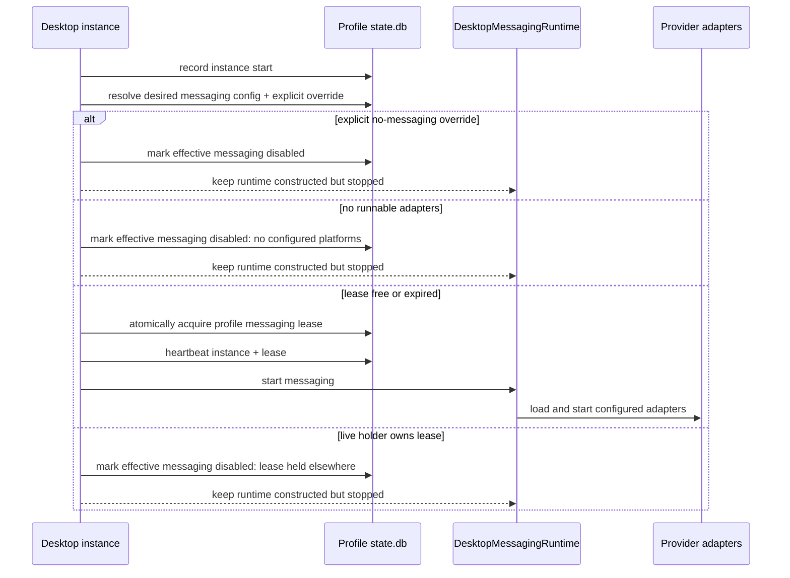

# feat: Add dev profile messaging leases

## Overview

Add a profile-scoped messaging lease so multiple PwrAgent desktop instances can share one profile without every instance trying to start Telegram, Discord, Slack, Mattermost, or LINE adapters. Each app instance records itself in the profile `state.db`, one instance at a time may hold the messaging lease, and stale holders expire when their heartbeat stops. This keeps `dev:no-messaging` available as an explicit opt-out, but makes normal dev launches safer.

## Problem Frame

Today `pnpm dev:no-messaging` exists because `pnpm dev` can start real messaging adapters against the same profile credentials. A second desktop process can collide with the first, causing provider conflicts such as duplicate bot polling or confusing runtime status. The user wants this solved as developer/runtime infrastructure rather than a broad user-facing feature: log instance starts, know whether messaging is effective for that instance, and let a new process take over when the old holder is gone.

## Requirements Trace

- R1. Record every desktop app instance startup in the profile database with enough safe metadata to identify it during development.
- R2. Record both desired and effective messaging state for each instance so a process can show "wanted messaging, lease held elsewhere" distinctly from "messaging explicitly disabled."
- R3. Allow at most one active messaging-enabled lease holder per profile.
- R4. Expire stale messaging leases after the holder stops heartbeating, so crashed or killed dev instances do not require manual cleanup.
- R5. Keep explicit `--disable-messaging` / `PWRAGENT_DISABLE_MESSAGING` behavior as a stronger session-only opt-out.
- R6. Keep provider packages persistence-free; lease ownership belongs to desktop main process state/orchestration.
- R7. Do not persist secrets, raw env, or full command lines in instance/lease rows.
- R8. Keep second instances useful for desktop browsing and editing even when messaging is suspended by another holder.

## Scope Boundaries

- In scope: desktop main-process instance logging, profile-scoped lease persistence, heartbeat/release lifecycle, settings/status wording for lease-held-disabled state, tests, and developer docs.
- Out of scope: changing provider adapter contracts, adding cross-machine distributed locking, changing profile selection semantics, changing messaging credentials/config shape, or removing `dev:no-messaging`.
- Out of scope for first pass: a force-takeover UI. Lease takeover should happen only when the prior holder is expired.

## Context & Research

### Relevant Code and Patterns

- `apps/desktop/src/main/index.ts` initializes profile state, constructs `DesktopMessagingRuntime`, and currently decides between `resolveRuntimeMessagingOverride()` and `messagingRuntime.start()`.
- `apps/desktop/src/main/runtime-flags.ts` defines the explicit no-messaging override.
- `apps/desktop/src/main/state/app-state.ts` opens the profile `state/state.db`, starts SQLite GC, and exposes `getAppStateDb()`.
- `apps/desktop/src/main/state/state-db.ts` owns SQLite schema migrations, WAL setup, busy timeout, GC, and small state helpers.
- `apps/desktop/src/main/messaging/messaging-runtime.ts` owns adapter lifecycle, platform health, runtime start/stop, and status snapshots.
- `apps/desktop/src/main/ipc/messaging-status.ts` already lets Settings start/stop messaging for the current session without changing saved config when a runtime override is active.
- `apps/desktop/src/main/settings/desktop-settings-service.ts` and `packages/shared/src/contracts/settings.ts` expose `runtime.messaging` to the renderer.
- `apps/desktop/src/renderer/src/features/settings/MessagingSettings.tsx` already has a runtime warning panel for session-only messaging disablement.
- `docs/state-layout.md` currently states multiple instances can share the same profile DB safely via SQLite WAL, but it does not account for singleton messaging adapters.
- `packages/messaging/AGENTS.md` requires providers to stay persistence-free and puts orchestration in `apps/desktop/src/main/messaging`.

### Institutional Learnings

- `docs/solutions/2026-05-07-codex-permission-mode-state-machine.md` reinforces that singleton ownership can simplify runtime behavior when multiple processes would otherwise create conflicting state.
- Existing messaging plans establish that desktop owns messaging orchestration and providers should remain isolated behind the generic interface.

### External References

- External research skipped. The core problem is repo-local runtime coordination over SQLite, and the repository already has the relevant architectural patterns.

## Key Technical Decisions

- Use the profile `state.db` as the lease authority. It is already the shared per-profile coordination point and is opened with WAL plus a busy timeout, so no extra lockfile or process-global IPC is needed.
- Use heartbeat expiry, not PID liveness, as the correctness mechanism. PID and cwd are useful diagnostics, but PID reuse and cross-platform behavior make process checks a weak authority. A lease is valid only while `expires_at` is in the future and the owner keeps renewing it.
- Acquire the lease before starting provider adapters. The second process should never import/load/start configured providers when another live holder owns messaging for that profile.
- Keep explicit no-messaging overrides stronger than leases. If `--disable-messaging` or `PWRAGENT_DISABLE_MESSAGING` is set, the instance logs desired/effective messaging as disabled and does not attempt acquisition.
- Represent lease-held-disabled as runtime state, not saved config. The user's `[messaging] enabled` setting remains the desired default; the lease only affects this process.
- Release only the current holder's lease on orderly shutdown or session stop. Do not delete another instance's row, and do not release the lease merely because one provider adapter fails after startup.
- Keep the first pass passive for second instances. They should show messaging as unavailable because another live instance holds the lease, and should acquire automatically only after expiry or when the user toggles messaging after the lease is free.
- Do not claim the lease when the resolved messaging config has no configured adapters. A profile with the master switch on but no eligible provider credentials should record that messaging was desired but had no runnable platforms; it should not block another instance unnecessarily.
- Centralize lease gating in one desktop main-process coordinator used by startup, `applyLatestConfig`, and Settings IPC. Bootstrap and Settings should not each invent slightly different acquisition/release rules.

## Open Questions

### Resolved During Planning

- Should this be limited to development builds? No. The implementation is a safe profile invariant that prevents duplicate adapter starts anywhere. The feature is developer-motivated, but the invariant protects production-like multi-instance use too.
- Should provider packages participate? No. The lease guards desktop runtime startup before provider loading, preserving the provider persistence boundary.
- Should a second process force-steal the lease? No for the first pass. Stale expiry is enough to reduce `dev:no-messaging` use without adding destructive takeover behavior.

### Deferred to Implementation

- Exact names for the store class and shared DTO fields: choose names that fit nearby desktop state/settings conventions during implementation.
- Exact heartbeat interval constants: the plan recommends a 10-second heartbeat and 30-second lease TTL, but implementation can tune slightly if tests or existing timer conventions suggest better values.

## High-Level Technical Design

> *This illustrates the intended approach and is directional guidance for review, not implementation specification. The implementing agent should treat it as context, not code to reproduce.*

## Implementation Units

- [x] **Unit 1: Add profile instance and lease persistence**

**Goal:** Create the SQLite schema and desktop main-process store that records app instances and manages the single messaging lease for the active profile.

**Requirements:** R1, R2, R3, R4, R6, R7

**Dependencies:** None

**Files:**
- Modify: `apps/desktop/src/main/state/state-db.ts`
- Modify: `apps/desktop/src/main/state/app-state.ts`
- Create: `apps/desktop/src/main/state/app-runtime-instance-store.ts`
- Test: `apps/desktop/src/main/__tests__/app-runtime-instance-store.test.ts`

**Approach:**
- Add a new schema migration with an `app_runtime_instances` table and a singleton/profile-scoped `messaging_runtime_lease` table.
- Instance rows should include a generated instance id, profile name, process id, safe cwd/worktree hint, start timestamp, heartbeat timestamp, optional exit timestamp, desired messaging boolean, effective messaging boolean, and safe disabled reason.
- Lease rows should include the owner instance id, acquired timestamp, last heartbeat timestamp, expires timestamp, and released timestamp or status.
- Implement atomic acquire/renew/release operations inside transactions. Acquisition succeeds when no active lease exists, the existing lease is expired, or the existing owner is the current instance.
- Keep SQL parameterized and keep generated SQL fragments limited to hardcoded structure.
- Add GC for old instance rows and released/expired lease history if the chosen schema retains history.

**Execution note:** Implement the store test-first because the lease race/expiry behavior is the correctness core.

**Patterns to follow:**
- `StateDb.open()` migration style and `cleanupExpired()` retention patterns in `apps/desktop/src/main/state/state-db.ts`.
- `apps/desktop/src/main/messaging/messaging-pairing-store.ts` for focused SQLite store methods around a small table.
- SQLite query rules in `apps/desktop/AGENTS.md`.

**Test scenarios:**
- Happy path: first instance records startup and acquires the messaging lease with effective messaging enabled.
- Happy path: the same instance renews its lease and extends `expires_at`.
- Edge case: a second instance cannot acquire while the first holder's `expires_at` is in the future and records effective messaging disabled with a lease-held reason.
- Edge case: a second instance can acquire after the first holder's lease is expired.
- Edge case: releasing a lease from a non-holder leaves the live holder intact.
- Error path: malformed or missing profile metadata does not persist secrets or raw env values.
- Integration: reopening `state.db` preserves instance/lease rows and allows expiry-based acquisition across processes.

**Verification:**
- The store can deterministically prove single-holder semantics with concurrent-like sequential transactions.
- The schema migration is idempotent for existing profile databases.

- [x] **Unit 2: Gate messaging startup through the lease**

**Goal:** Change desktop bootstrap and runtime lifecycle so provider adapters start only when this instance holds the profile messaging lease.

**Requirements:** R2, R3, R4, R5, R8

**Dependencies:** Unit 1

**Files:**
- Modify: `apps/desktop/src/main/index.ts`
- Modify: `apps/desktop/src/main/messaging/messaging-runtime.ts`
- Modify: `apps/desktop/src/main/runtime-flags.ts` only if the override type needs a broader disabled-reason model.
- Test: `apps/desktop/src/main/__tests__/index.test.ts`
- Test: `apps/desktop/src/main/__tests__/messaging-runtime.test.ts`
- Test: `apps/desktop/src/main/__tests__/runtime-flags.test.ts` if the override type changes.

**Approach:**
- Generate the instance id after `initializeAppState()` and record startup before making the messaging startup decision.
- Resolve explicit no-messaging override first. If present, mark the instance as disabled and skip lease acquisition.
- Load the desktop messaging config before acquisition so the coordinator can distinguish "master enabled with runnable adapters" from "master enabled but no configured platforms."
- If desired messaging is enabled, at least one adapter config is present, and no explicit override is active, attempt lease acquisition before calling `messagingRuntime.start()` or `messagingRuntime.applyConfig()`.
- Put this preflight in a shared coordinator path that startup and Settings IPC both use; avoid duplicating lease conditions in two call sites.
- Start a heartbeat timer only for the current lease holder. The heartbeat should renew both the instance heartbeat and lease expiry.
- On `before-quit`, stop messaging and release the lease only when this process is the holder; mark the instance exited before closing `state.db`.
- If lease acquisition fails, keep the runtime constructed and status IPC registered, but do not load providers or start adapters.
- Preserve the existing `messagingRuntime.start().catch(...)` background-start behavior, but ensure failed startup updates instance effective state without corrupting another holder's lease.

**Patterns to follow:**
- Existing bootstrap order in `apps/desktop/src/main/index.ts`.
- Runtime lifecycle queue in `DesktopMessagingRuntime`.
- Existing explicit override behavior in `resolveRuntimeMessagingOverride()`.

**Test scenarios:**
- Happy path: without override and with a free lease, bootstrap attempts messaging startup.
- Happy path: with `PWRAGENT_DISABLE_MESSAGING`, bootstrap records disabled state and never calls runtime start or lease acquire.
- Edge case: with the master switch enabled but no configured adapter credentials, bootstrap records no runnable platforms and does not claim the lease.
- Edge case: when lease acquisition fails because another live holder exists, provider loading is not invoked and the app still registers messaging status IPC.
- Edge case: when a stale lease exists, bootstrap acquires and starts messaging.
- Error path: if runtime start fails after lease acquisition, the error is logged and the lease remains owned until the runtime/instance stops.
- Integration: before-quit releases only the current holder's lease and marks the instance exited.

**Verification:**
- A second desktop instance with the same profile no longer starts provider adapters while the first holder is live.
- Explicit no-messaging behavior remains unchanged except for instance logging.

- [x] **Unit 3: Make session enable/disable lease-aware**

**Goal:** Keep the Settings master toggle and IPC behavior correct when messaging is disabled because another instance holds the lease.

**Requirements:** R2, R3, R4, R5, R8

**Dependencies:** Units 1 and 2

**Files:**
- Modify: `apps/desktop/src/main/ipc/messaging-status.ts`
- Modify: `apps/desktop/src/main/settings/desktop-settings-service.ts`
- Modify: `packages/shared/src/contracts/settings.ts`
- Modify: `packages/shared/src/contracts/messaging.ts`
- Test: `apps/desktop/src/main/__tests__/messaging-status-ipc.test.ts`
- Test: `apps/desktop/src/main/__tests__/desktop-settings-service.test.ts`

**Approach:**
- Extend runtime messaging snapshot data with a disabled reason category that can distinguish explicit override from lease-held-disabled.
- When Settings calls `setMessagingEnabled({ enabled: true })`, attempt lease acquisition before applying config with `allowStart: true`.
- Reuse the same coordinator path as startup so a config with no runnable adapters does not claim the lease and a config with runnable adapters cannot bypass the lease.
- If acquisition succeeds, start/renew heartbeat and apply config as today.
- If acquisition fails because a live holder exists, return effective disabled state and the holder metadata that is safe to show or log.
- When Settings disables messaging for the session, stop the runtime and release this instance's lease if held; do not change saved config when the disabled state is lease/session-only.

**Patterns to follow:**
- Existing `MESSAGING_SET_ENABLED_CHANNEL` flow in `apps/desktop/src/main/ipc/messaging-status.ts`.
- Existing runtime messaging snapshot shape in `DesktopSettingsSnapshot`.
- Current session-only override handling in `MessagingSettings.tsx`.

**Test scenarios:**
- Happy path: enabling messaging from a lease-disabled instance acquires a now-free lease and starts runtime.
- Happy path: enabling messaging when no adapters are configured returns a coherent disabled/no-platforms state without claiming the lease.
- Edge case: enabling messaging while another live holder exists returns disabled state with a lease-held reason and does not start providers.
- Edge case: disabling messaging from the lease holder stops runtime and releases the lease.
- Edge case: disabling messaging from a non-holder is a no-op for the lease and still returns a coherent effective disabled state.
- Integration: `readSettings()` reports explicit no-messaging and lease-held-disabled as distinct runtime conditions.

**Verification:**
- Settings can recover automatically once the prior holder expires, without requiring `dev:no-messaging`.
- Saved `config.toml` messaging settings are unchanged by lease-only state.

- [x] **Unit 4: Surface lease-held state in developer-facing UI/status**

**Goal:** Make lease-disabled state understandable without turning it into a prominent end-user feature.

**Requirements:** R2, R8

**Dependencies:** Unit 3

**Files:**
- Modify: `apps/desktop/src/renderer/src/features/settings/MessagingSettings.tsx`
- Modify: `apps/desktop/src/renderer/src/features/settings/SettingsScreen.tsx` only if the master toggle callback needs adjusted state handling.
- Modify: `apps/desktop/src/renderer/src/features/messaging-status/MessagingStatusBar.tsx` only if status chips need a suspended-by-lease tooltip.
- Modify: `apps/desktop/src/renderer/src/lib/desktop-api.ts` only if preload contract types change locally.
- Modify: `apps/desktop/src/preload/index.ts` if IPC response fields change.
- Test: `apps/desktop/src/renderer/src/features/settings/__tests__/settings-screen.test.tsx`
- Test: `apps/desktop/src/renderer/src/features/messaging-status/MessagingStatusBar.test.tsx` if status chip behavior changes.

**Approach:**
- Reuse the existing runtime warning panel shape in Messaging Settings, but change copy and source labeling when disabled because another profile instance holds the lease.
- Keep the master toggle semantics effective-state based: on means this instance is the holder and runtime is started; off can mean explicit override, lease held elsewhere, or user stopped the session.
- Avoid broad new navigation or dashboard surfaces. This is developer/runtime status, not a new product workflow.
- If safe holder metadata is exposed, show only coarse information such as start time, pid, or cwd basename/worktree hint, not raw env or full argv.

**Patterns to follow:**
- Existing `MessagingSettings.tsx` runtime override panel and source badges.
- Desktop style guidance in `apps/desktop/AGENTS.md`: no placeholder or implementation-status narration in user-facing UI.

**Test scenarios:**
- Happy path: Settings shows the existing explicit no-messaging warning when launched with `dev:no-messaging`.
- Happy path: Settings shows a distinct lease-held message when another live instance owns messaging.
- Edge case: the master toggle is disabled or returns to off when an enable attempt cannot acquire the lease.
- Edge case: once IPC reports enabled after acquisition, the warning disappears and platform controls become enabled.

**Verification:**
- Developers can tell why messaging is off in the current process and whether retrying after the other instance exits should work.
- No provider-specific wording leaks into the generic messaging settings panel.

- [x] **Unit 5: Update docs and operational guidance**

**Goal:** Document the new lease behavior so developers know when `dev`, `dev:no-messaging`, and profile isolation are appropriate.

**Requirements:** R1, R3, R4, R5, R8

**Dependencies:** Units 1-4

**Files:**
- Modify: `docs/state-layout.md`
- Modify: `apps/desktop/AGENTS.md`
- Modify: `docs/messaging-platform-integration.md` if its dev commands still imply `dev:no-messaging` is the default safest path.
- Test: `apps/desktop/src/main/__tests__/messaging-docs-links.test.ts` if docs links are added or changed.

**Approach:**
- Update the multi-instance section to state that SQLite still supports shared profile access, but messaging adapters are single-holder per profile.
- Keep `dev:no-messaging` documented as an explicit opt-out for visual/UI work or when the developer never wants adapters to start.
- Document that stale leases expire automatically after missed heartbeats and that deleting rows manually should not be normal workflow.
- Do not imply cross-machine safety; the lease coordinates processes sharing the same local profile database.

**Patterns to follow:**
- Current `docs/state-layout.md` profile and dev profile sections.
- Existing concise dev-command guidance in `apps/desktop/AGENTS.md`.

**Test scenarios:**
- Test expectation: none for prose itself, except existing documentation link tests if modified docs introduce links.

**Verification:**
- Developer docs no longer present `dev:no-messaging` as required for every normal dev launch.
- Multi-instance behavior is documented with the same state layout vocabulary used elsewhere.

## System-Wide Impact

- **Interaction graph:** Bootstrap, app state, messaging runtime, settings IPC, renderer settings, and status chips are affected. Provider packages should be unaffected except that they load less often.
- **Error propagation:** Lease acquisition failures should produce an effective disabled state, not startup crashes. Runtime adapter errors after acquisition should continue through existing platform health/error logging.
- **State lifecycle risks:** The main risk is a stale lease that blocks messaging too long or expires too quickly. Use a heartbeat interval substantially shorter than TTL and test expiry deterministically with injected clocks.
- **API surface parity:** Shared settings/messaging contracts may gain reason fields; preload and renderer DTOs must stay aligned.
- **Integration coverage:** Unit tests should cover persistence and IPC behavior. A manual two-instance check should verify that only the first live profile instance starts messaging adapters and the second can acquire after the first exits or the lease expires.
- **Unchanged invariants:** Messaging providers remain persistence-free, renderer imports remain limited by desktop boundaries, saved messaging config remains the desired default, and explicit no-messaging overrides continue to work.

## Risks & Dependencies

| Risk | Mitigation |
|------|------------|
| Lease expiry is too short and causes duplicate adapter starts during brief event-loop stalls | Use a conservative TTL such as 30 seconds with a faster heartbeat such as 10 seconds, and renew from a lightweight timer. |
| Lease expiry is too long and crashed dev instances block messaging annoyingly | Keep TTL short enough for developer recovery and expose a clear lease-held reason in Settings. |
| Instance rows accidentally persist secrets or sensitive command-line data | Store only allowlisted metadata; never store env values, tokens, or raw argv. |
| A provider conflict can still happen with another profile or an external bot process using the same token | Treat this lease as same-profile coordination only; keep existing adapter runtime error health handling for external conflicts. |
| Shutdown ordering closes SQLite before lease release | Release/mark exited before `disposeAppState()` closes `state.db`, and make release best-effort/logged. |
| Settings toggle appears to save config when it only changes session state | Keep lease-disabled and override-disabled states under `runtime.messaging`, not persisted `messaging.enabled`. |

## Documentation / Operational Notes

- Update developer guidance so `pnpm --filter @pwragent/desktop dev` becomes reasonable when a profile already has a live holder; `dev:no-messaging` remains useful when the developer wants to guarantee no adapter startup.
- Avoid adding manual SQL cleanup guidance unless implementation discovers a real recovery need.
- Logs should include instance id and safe reason fields so developers can correlate startup/lease decisions without inspecting SQLite.

## Sources & References

- Related code: `apps/desktop/src/main/index.ts`
- Related code: `apps/desktop/src/main/runtime-flags.ts`
- Related code: `apps/desktop/src/main/state/state-db.ts`
- Related code: `apps/desktop/src/main/state/app-state.ts`
- Related code: `apps/desktop/src/main/messaging/messaging-runtime.ts`
- Related code: `apps/desktop/src/main/ipc/messaging-status.ts`
- Related code: `apps/desktop/src/main/settings/desktop-settings-service.ts`
- Related code: `apps/desktop/src/renderer/src/features/settings/MessagingSettings.tsx`
- Related docs: `docs/state-layout.md`
- Related docs: `docs/messaging-architecture.md`
- Related docs: `packages/messaging/AGENTS.md`
- Institutional learning: `docs/solutions/2026-05-07-codex-permission-mode-state-machine.md`
