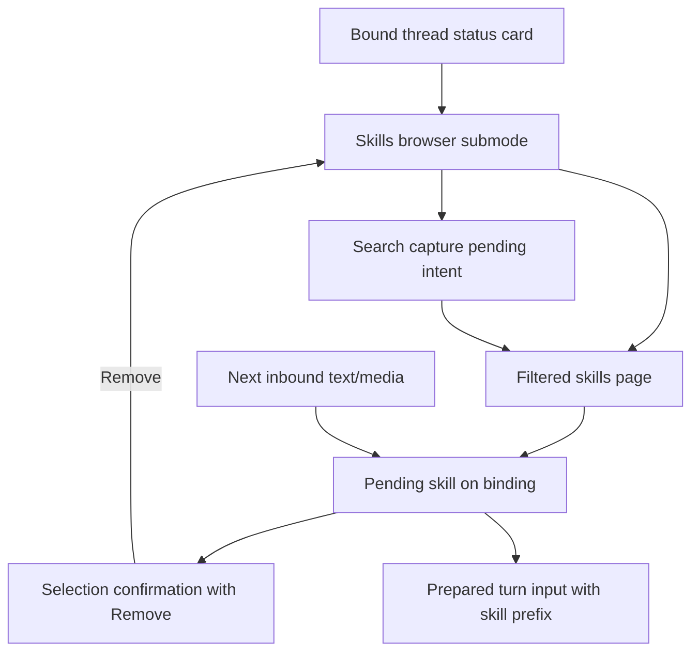
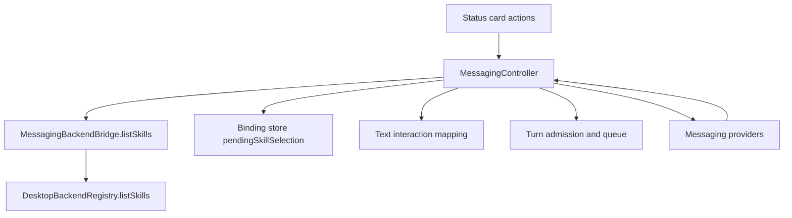

# feat: Add messaging Skills browser

## Overview

Add a Skills browser to the messaging thread status menu. The browser should let a user open Skills from the status card, page through available skills, search by sending the next free-text reply as the query, choose a skill, and have that skill prepended to the next user request. Selecting a skill should not immediately start a turn; it should post a confirmation with the full skill name, available help text, and a Remove button.

## Problem Frame

PwrAgent already supports skill metadata and desktop composer skill mentions, but remote messaging users do not have an ergonomic status-card path for browsing and staging a skill for their next instruction. OpenClaw had a useful predecessor in its status menu, with a Skills button, paged picker, search/filtering, and help mode. PwrAgent should recover that interaction while fitting the current channel-neutral messaging architecture, persistent binding store, pending-intent model, and status-card submode patterns.

## Requirements Trace

- R1. The bound thread status card exposes a Skills action when the channel capability profile has enough action budget.
- R2. Clicking Skills opens a channel-neutral, paged Skills browser with navigation controls.
- R3. The browser has a Search action that makes the next free-text response a skill search query rather than a normal turn instruction.
- R4. Search results support navigation, empty-result feedback, and a Back action to return to unfiltered browsing.
- R5. Selecting a skill posts a confirmation instead of starting a turn.
- R6. The selection confirmation displays the full skill name and available help text, including description, workspace/context, status, and path when present.
- R7. The selection confirmation includes a Remove action that clears the staged skill.
- R8. The next user request sent to the bound thread consumes the staged skill once and prepends it to the turn input.
- R9. The behavior works for text and media requests, respects existing turn admission/queueing behavior, and degrades to text fallback on low-capability channels.

## Scope Boundaries

- This plan covers messaging status-card interactions, not the desktop renderer composer autocomplete UI.
- This plan does not add skill installation, enable/disable management, or config editing.
- This plan does not add semantic search; search is lexical over skill name, description/help metadata, path, and cwd.
- This plan does not require a new Codex app-server protocol method for reading full `SKILL.md` bodies. Use metadata returned by `skills/list`; preserve a future path for richer help if the protocol exposes it.
- This plan stages one pending skill per messaging binding. Multi-skill staging is a future extension.

## Context & Research

### Relevant Code and Patterns

- `apps/desktop/src/main/messaging/core/messaging-status-card.ts` builds status-card actions and existing status submodes such as model, reasoning, streaming, and handoff.
- `apps/desktop/src/main/messaging/core/messaging-controller.ts` handles inbound text, status callbacks, pending intents, status submode delivery, turn input preparation, and turn admission.
- `apps/desktop/src/main/messaging/core/deterministic-interaction-mapper.ts` maps free-text replies to pending actions, but currently lets likely new instructions pass through.
- `apps/desktop/src/main/messaging/core/messaging-renderer.ts` already has generic confirmation/status builders that can carry channel-neutral actions.
- `apps/desktop/src/main/messaging/core/messaging-adapter.ts` defines `MessagingBackendBridge`; it currently lacks `listSkills` even though `DesktopBackendRegistry` exposes it.
- `apps/desktop/src/main/messaging/desktop-backend-bridge.ts` forwards backend bridge calls to the registry and is the right desktop-side place to expose `listSkills`.
- `packages/shared/src/contracts/normalized-app-server.ts` defines `AppServerSkillSummary`, `AppServerListSkillsRequest`, and `AppServerListSkillsResponse`.
- `apps/desktop/src/main/state/messaging-store-sqlite.ts`, `apps/desktop/src/main/messaging/core/messaging-store.ts`, and `apps/desktop/src/main/messaging/core/messaging-migrations.ts` sanitize and migrate persisted binding payloads.
- `apps/desktop/src/main/__tests__/messaging-controller.test.ts`, `apps/desktop/src/main/__tests__/messaging-status-card.test.ts`, and messaging store tests already cover status-card submodes, pending intents, and persisted binding behavior.
- Reference repo `openclaw-app-server`: `src/controller.ts` implemented a status-card Skills button, paged skill picker, mode toggle, search/filter flow, and run/help callbacks; `src/format.ts` held skill filtering and help formatting helpers.
- `docs/brainstorms/2026-04-16-thread-centric-agent-desktop-requirements.md` requires a real skills/plugins capability in the first milestone.
- `docs/brainstorms/2026-04-18-desktop-thread-refresh-model-requirements.md` establishes that skills should load lazily and be cached after first use, which argues against eager loading outside the explicit Skills browser action.

### Institutional Learnings

- `docs/solutions/2026-05-07-codex-permission-mode-state-machine.md` is about permissions rather than skills, but the relevant lesson applies here: do not hide state transitions behind implicit side effects. The selected skill should be explicit binding state, consumed deterministically, and removable.

### External References

- External research is not needed. The feature is shaped by existing PwrAgent messaging architecture and the local OpenClaw reference implementation.

## Key Technical Decisions

- Add Skills as a channel-neutral status submode, not as provider-specific callback logic. This keeps Telegram, Discord, Slack, Mattermost, Line, and future providers on the same workflow path.
- Add `listSkills` to `MessagingBackendBridge` and implement it in `DesktopMessagingBackendBridge` by delegating to `DesktopBackendRegistry.listSkills`. Providers must not call app-server skill APIs directly.
- Store the selected skill on the `MessagingBindingRecord` as explicit pending skill state. A pending intent alone is too ephemeral for "prepend onto the next user request" and makes Remove harder to reason about.
- Use pending intents for the interactive browser and search prompt. Represent search capture as a binding-scoped confirmation intent in the `skills:search` action namespace, then special-case that pending intent in `handleText` so the next free-text reply is captured as a query before `DeterministicInteractionMapper` can treat it as a normal instruction.
- Prepend the selected skill using the same text-compatible skill mention shape the desktop composer already sends, such as `Use [$ce:plan](path)` when a path exists and `$ce:plan` when it does not. Defer a true `AppServerTurnInputItem` skill item until the normalized contract supports it.
- Consume the staged skill only when a user request is admitted into a turn bundle or queue. Failed unsupported-media preparation should not silently clear the selection.
- Keep skill help to metadata available from `skills/list`: full name, description or short description, cwd, path, and enabled status. Do not read arbitrary local `SKILL.md` paths from messaging workflow code in this slice.
- Deduplicate skills by normalized name and keep deterministic ordering: name-prefix matches first during search, then description/path/cwd matches, preserving list order within equal match classes.

## Open Questions

### Resolved During Planning

- **Was the old reference actually the user-mentioned codex-app-server checkout?** No. That checkout path is absent in this environment. The matching local predecessor is `openclaw-app-server`, which contains the status-card Skills picker behavior the request describes.
- **Should selecting a skill start a turn immediately?** No. The user explicitly wants the skill prepended onto the next user request and a Remove button, so selection stages state rather than sending `$skill` as a prompt.
- **Should the implementation read full skill files for help text?** No for this slice. The existing normalized API exposes metadata, not full skill bodies, and messaging workflow code should not grow local filesystem reads for app-server-owned skill discovery.

### Deferred to Implementation

- **Exact mention formatting:** If implementation discovers an existing shared helper for desktop composer skill mentions that can be used without violating renderer/main boundaries, use it. Otherwise keep a local formatter matching the current send payload shape.
- **Exact action budget placement:** Final priorities for Skills relative to Handoff, Stream, and Sync name should be tuned against existing capability-profile tests.

## High-Level Technical Design

> *This illustrates the intended approach and is directional guidance for review, not implementation specification. The implementing agent should treat it as context, not code to reproduce.*

The browser and search prompt are transient surfaces. The selected skill is durable binding state until it is removed or consumed by the next request.

## Implementation Units

- [x] **Unit 1: Expose skills to messaging workflow**

**Goal:** Let the messaging controller list skills through the desktop backend bridge without provider-specific app-server access.

**Requirements:** R1, R2, R8

**Dependencies:** None

**Files:**
- Modify: `apps/desktop/src/main/messaging/core/messaging-adapter.ts`
- Modify: `apps/desktop/src/main/messaging/desktop-backend-bridge.ts`
- Modify: `apps/desktop/src/main/__tests__/messaging-controller.test.ts`

**Approach:**
- Add an optional `listSkills` method to `MessagingBackendBridge` that accepts backend and cwd/cwds parameters compatible with `AppServerListSkillsRequest`.
- Implement the bridge method by delegating to `DesktopBackendRegistry.listSkills`.
- Update controller harness mocks to expose deterministic skills across one or more cwd buckets.
- Treat a missing bridge method as a recoverable "Skills unavailable" message so non-Codex or future restricted backends fail cleanly.

**Patterns to follow:**
- `DesktopMessagingBackendBridge.getNavigationSnapshot`, `setThreadModelSettings`, and `startTurn` delegation patterns.
- Existing status model/reasoning picker tests in `apps/desktop/src/main/__tests__/messaging-controller.test.ts`.

**Test scenarios:**
- Happy path: a controller harness with `listSkills` returns skills and the Skills browser can use them.
- Error path: when `listSkills` is absent, clicking Skills delivers a recoverable unavailable message and does not throw.
- Error path: when `listSkills` rejects, the controller posts a recoverable error and leaves the status card usable.

**Verification:**
- Messaging workflow code can list skill metadata without importing provider SDKs or crossing dependency boundaries.

- [x] **Unit 2: Build the Skills browser and search flow**

**Goal:** Add the status-card Skills action and a paged browser with navigation, Search, result pages, Back, and Cancel.

**Requirements:** R1, R2, R3, R4, R6, R9

**Dependencies:** Unit 1

**Files:**
- Create: `apps/desktop/src/main/messaging/core/messaging-skills-browser.ts`
- Modify: `apps/desktop/src/main/messaging/core/messaging-status-card.ts`
- Modify: `apps/desktop/src/main/messaging/core/messaging-controller.ts`
- Test: `apps/desktop/src/main/__tests__/messaging-status-card.test.ts`
- Test: `apps/desktop/src/main/__tests__/messaging-controller.test.ts`
- Test: `apps/desktop/src/main/__tests__/messaging-interaction-mapper.test.ts`

**Approach:**
- Add `status:skills` to status actions with conservative priority so critical actions like Stop, Refresh, Detach, Permissions, and active handoff controls remain available first.
- Build skill browser helpers that flatten `skills/list` entries into skill rows containing name, description/help metadata, path, cwd, enabled state, and match metadata.
- Render browser pages as `single_select` or `confirmation` intents with skill choices plus navigation actions (`skills:previous`, `skills:next`, `skills:search`, `skills:back`, `skills:cancel`).
- Use `targetSurface` and update delivery when the binding has a status surface, matching model/reasoning/handoff submode behavior.
- When Search is clicked, store a binding-scoped pending confirmation intent whose id or action namespace is `skills:search`, with `skills:search:cancel` and `status:skills`/Back controls, and deliver a prompt explaining that the next reply is the search text.
- In `handleText`, detect the active `skills:search` pending intent before normal interaction mapping and turn admission, consume that text as a query, delete the search pending intent, and render filtered results.
- Keep filter matching lexical and deterministic: normalized name prefix, normalized name substring, then description/path/cwd substring.

**Patterns to follow:**
- Handoff branch picker pagination in `apps/desktop/src/main/messaging/core/messaging-status-card.ts`.
- Existing pending intent lifecycle around `deliverAndStoreStatusSubmode` in `apps/desktop/src/main/messaging/core/messaging-controller.ts`.
- OpenClaw reference repo `src/controller.ts` `buildSkillsPicker` and `src/format.ts` `filterSkillsByQuery` / `formatSkillsPickerText`, adapted to PwrAgent's generic intent model.

**Test scenarios:**
- Happy path: status card includes `status:skills` when capability limits allow it.
- Happy path: clicking `status:skills` delivers a page containing skill choices and Search/Cancel actions.
- Happy path: browser pagination moves between pages and preserves an active search query.
- Happy path: clicking Search makes the next text reply `review` render filtered skills matching `review`.
- Edge case: an empty search result renders "No skills matched" with Back and Search Again actions.
- Edge case: Back from search results returns to unfiltered browsing.
- Regression: a normal pending model/reasoning picker still treats likely new instructions as pass-through; only the skills search prompt captures free text.

**Verification:**
- Users can browse, page, search, and return without starting a turn or losing the bound status surface.

- [x] **Unit 3: Persist and display pending skill selection**

**Goal:** Selecting a skill stores one pending skill on the binding and posts a confirmation with help text and a Remove button.

**Requirements:** R5, R6, R7

**Dependencies:** Unit 2

**Files:**
- Modify: `packages/messaging/interface/src/index.ts`
- Modify: `packages/messaging/interface/src/__tests__/messaging-contract.test.ts`
- Modify: `apps/desktop/src/main/messaging/core/messaging-store.ts`
- Modify: `apps/desktop/src/main/state/messaging-store-sqlite.ts`
- Modify: `apps/desktop/src/main/messaging/core/messaging-migrations.ts`
- Modify: `apps/desktop/src/main/messaging/core/messaging-status-card.ts`
- Modify: `apps/desktop/src/main/messaging/core/messaging-controller.ts`
- Test: `apps/desktop/src/main/__tests__/messaging-store.test.ts`
- Test: `apps/desktop/src/main/__tests__/messaging-store-sqlite.test.ts`
- Test: `apps/desktop/src/main/__tests__/messaging-status-card.test.ts`
- Test: `apps/desktop/src/main/__tests__/messaging-controller.test.ts`

**Approach:**
- Add a `pendingSkillSelection` field to `MessagingBindingRecord` with skill name, path, description/help text, cwd, enabled state, selected actor, and selected timestamp.
- Preserve this field through binding sanitizers and migrations while continuing to strip deprecated `activeTurn` and `threadDisplay`.
- Add a helper to format selected-skill confirmation text with the full `$name`, description/help metadata, cwd, path, enabled state, and "will be prepended to your next request" language.
- Add `skills:select` to persist the selection and deliver a confirmation with `skills:remove` and `status:skills`/Back actions.
- Add `skills:remove` to clear pending skill state and deliver an acknowledgement or refreshed browser/status submode.
- Consider showing a short pending-skill line on the status card text while a skill is staged so users can see the state without reopening the browser.

**Patterns to follow:**
- Binding preference updates in `MessagingController.updateBindingPreferences`.
- Store sanitizer tests that preserve intended binding state while dropping deprecated cached state.
- Existing confirmation intents with actions, such as queued turn notices and handoff confirmations.

**Test scenarios:**
- Happy path: selecting `ce:plan` persists `pendingSkillSelection` on the active binding.
- Happy path: the confirmation includes `$ce:plan`, description/help text, cwd/path when present, and a Remove action.
- Happy path: the pending skill survives store reload in both JSON and sqlite stores.
- Happy path: clicking Remove clears `pendingSkillSelection`.
- Edge case: selecting a disabled skill either prevents staging with a clear message or stages it with explicit disabled status, based on the existing `enabled` metadata semantics.
- Regression: sanitizers still remove deprecated `activeTurn` and `threadDisplay` without dropping `pendingSkillSelection`.

**Verification:**
- Pending skill state is visible, removable, and restart-safe.

- [x] **Unit 4: Prepend the staged skill to the next request**

**Goal:** Consume the pending skill once when the next user request is accepted into normal turn flow, including queued-turn flow.

**Requirements:** R8, R9

**Dependencies:** Unit 3

**Files:**
- Modify: `apps/desktop/src/main/messaging/core/messaging-controller.ts`
- Test: `apps/desktop/src/main/__tests__/messaging-controller.test.ts`

**Approach:**
- When preparing an admitted turn bundle, inspect the latest binding record for `pendingSkillSelection`.
- Prepend a skill mention text item ahead of the user's text/media input using the selected skill name and path when available.
- Include the pending skill in the queued-turn preview so users can tell the queued message will use that skill.
- Clear the pending skill only after the request is successfully admitted into start or queue flow. If input preparation fails because attachments are unsupported, keep the selection.
- For an active turn, attach the skill to the queued message rather than steering the currently running turn, because the requirement is "next user request."
- Prevent commands such as `/status`, browser navigation callbacks, and search queries from consuming the pending skill.

**Patterns to follow:**
- `prepareTurnInput`, `handleAdmittedTurnBundle`, `queuePreparedInput`, and queued-turn preview construction in `apps/desktop/src/main/messaging/core/messaging-controller.ts`.
- Desktop composer skill mention payload expectations in `apps/desktop/src/renderer/src/features/composer/__tests__/composer.test.tsx`.

**Test scenarios:**
- Happy path: after selecting `ce:plan`, the next text message starts a turn whose first text input contains the skill mention before the user instruction.
- Happy path: after consumption, the binding no longer has `pendingSkillSelection`.
- Happy path: when a thread is active, the next text message queues with the skill prefix and clears the selection once queued.
- Integration: a media message with caption consumes the pending skill and preserves attachment input.
- Edge case: `/status` after selecting a skill does not consume it.
- Edge case: replying to a skills-search prompt after selecting a skill does not consume it as a turn request.
- Error path: unsupported media does not clear the pending skill.

**Verification:**
- The selected skill is applied exactly once to the next real user request and never to status/browser control traffic.

- [x] **Unit 5: Cross-channel degradation and regression coverage**

**Goal:** Ensure the browser works through the generic messaging contract and degrades cleanly on platforms with tighter action limits or text-only behavior.

**Requirements:** R1, R2, R3, R4, R9

**Dependencies:** Unit 4

**Files:**
- Modify: `packages/messaging/interface/src/__tests__/messaging-contract.test.ts`
- Modify: `packages/messaging/providers/discord/src/__tests__/discord-adapter.test.ts`
- Modify: `packages/messaging/providers/slack/src/__tests__/slack-formatting.test.ts`
- Modify: `packages/messaging/providers/line/src/__tests__/line-adapter.test.ts`
- Modify: `apps/desktop/src/main/__tests__/telegram-adapter.test.ts`
- Modify: `apps/desktop/src/main/__tests__/discord-adapter.test.ts`
- Test: `apps/desktop/src/main/__tests__/messaging-controller.test.ts`

**Approach:**
- Keep browser and confirmation surfaces within existing `MessagingSurfaceIntent` and `MessagingSurfaceAction` primitives; the `skills:search` pending intent should be handled in controller workflow rather than by extending provider contracts.
- Verify action labels and fallback text are useful when providers collapse buttons, truncate labels, or require typed replies.
- Make Search, Back, Remove, and skill choices resolvable from fallback text where buttons are not available.
- Confirm callback handle persistence still works for providers that sign or store callbacks externally.

**Patterns to follow:**
- Existing provider tests around status-card callbacks and generic action rendering.
- Capability-profile truncation and action-budget helpers in `@pwragent/messaging-interface`.

**Test scenarios:**
- Happy path: Discord/Telegram callback action for a skill selection reaches `skills:select` with the expected value.
- Happy path: Slack/Line formatting includes Search/Remove fallback labels in a usable form.
- Edge case: low action-count capability profiles drop lower-priority browser actions before critical actions and still expose text fallback.
- Regression: existing status actions for model, reasoning, permissions, tool updates, streaming, compact, stop, refresh, and detach still render or degrade as before.

**Verification:**
- The feature is channel-neutral and does not require provider-specific workflow branches.

## System-Wide Impact

- **Interaction graph:** Status callbacks route through `MessagingController.handleStatusCallback`; browser/search/selection flows update pending intents, binding state, and provider surfaces through the existing adapter delivery path.
- **Error propagation:** Backend skill-list failures should become recoverable messaging errors. Search with zero results should be a normal browser state, not an error.
- **State lifecycle risks:** Pending skill state must clear on remove, binding revoke, and successful next-request consumption. It must not clear on status refresh, search, unsupported input, or expired browser callbacks.
- **API surface parity:** The bridge gains `listSkills`; providers stay on existing generic intent/action APIs.
- **Integration coverage:** Controller tests must prove cross-layer behavior: status action -> skill list -> browser -> search -> select -> binding state -> next turn input.
- **Unchanged invariants:** Providers do not import desktop/app-server code, renderer imports remain untouched, dependency-cruiser boundaries stay strict, and `skills/list` remains lazily called only when the user opens the browser or refreshes it.

## Risks & Dependencies

| Risk | Mitigation |
|------|------------|
| Search prompt text is accidentally treated as a user turn instruction | Detect the active skills-search pending intent before normal text mapping and turn admission; cover with controller tests. |
| Pending skill state becomes invisible stale state | Show it in the selection confirmation, provide Remove, consider a status-card line, and clear on binding revoke/next request. |
| The skill prefix format drifts from desktop composer behavior | Reuse the composer-compatible markdown mention shape and test the exact `startTurn` input produced by messaging. |
| Action budgets make Skills unreachable on some channels | Assign priorities deliberately and verify capability-profile truncation/fallback behavior. |
| Disabled or duplicate skills confuse the browser | Deduplicate by normalized name and make disabled status explicit in text or prevent staging disabled entries. |
| Adding binding state breaks store sanitization or migrations | Add contract, JSON store, and sqlite store tests that preserve `pendingSkillSelection`. |

## Documentation / Operational Notes

- Update `docs/messaging-platform-integration.md` after implementation to mention the status-card Skills browser, search flow, selection staging, and Remove action.
- No operator config changes are expected.
- No desktop visual design docs need updates because this is a messaging surface feature.

## Sources & References

- Related requirements: `docs/brainstorms/2026-04-16-thread-centric-agent-desktop-requirements.md`
- Related requirements: `docs/brainstorms/2026-04-18-desktop-thread-refresh-model-requirements.md`
- Related plan: `docs/plans/2026-05-02-001-fix-skill-autocomplete-regression-plan.md`
- Related learning: `docs/solutions/2026-05-07-codex-permission-mode-state-machine.md`
- Related code: `apps/desktop/src/main/messaging/core/messaging-status-card.ts`
- Related code: `apps/desktop/src/main/messaging/core/messaging-controller.ts`
- Related code: `apps/desktop/src/main/messaging/core/deterministic-interaction-mapper.ts`
- Related code: `apps/desktop/src/main/messaging/desktop-backend-bridge.ts`
- Related code: `packages/shared/src/contracts/normalized-app-server.ts`
- Reference repo: `openclaw-app-server` `src/controller.ts`
- Reference repo: `openclaw-app-server` `src/format.ts`
