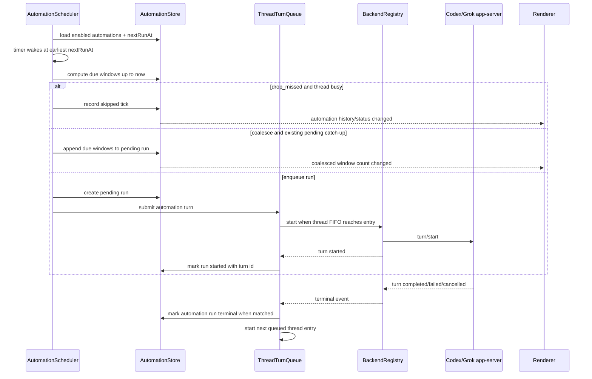
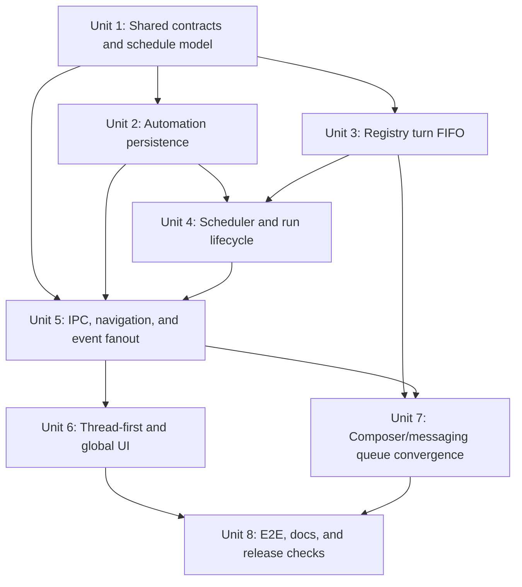

# feat: Add thread-assigned automation scheduling

## Overview

Add local desktop scheduling for recurring automations assigned to existing
threads. Each automation has a friendly schedule, task prompt, backlog policy,
run history, and thread assignment. Scheduled runs, manual desktop messages, and
messaging follow-up submissions must converge on one per-thread turn admission
queue so the product can honestly say that one agent handles one queue serially.

The first version is local-only: schedules fire while PwrAgent is running, do
not backfill closed-app ticks on launch, and do not create detached background
workers. `coalesce` is the default backlog policy; `drop_missed` is the
freshness-oriented alternative.

## Problem Frame

The origin requirements define the product contract: automations are assigned to
threads, scheduled ticks enter the same serial queue as manual thread work, and
users must be able to inspect what happened without reading logs (see origin:
`docs/brainstorms/2026-05-13-automation-scheduling-requirements.md`). The hard
part is not firing a timer. The hard part is making contention, skipped ticks,
coalesced catch-up windows, and manual interference visible while preserving the
existing thread-first desktop model.

## Requirements Trace

- R1. Create recurring automations assigned to existing threads.
- R2. Support friendly interval/calendar schedule inputs without exposing raw
  cron in V1.
- R3. Run schedules only while the desktop app is running; skip closed-app
  backfill on launch.
- R4. Expose next run, last run, enabled/paused state, and assigned thread.
- R5. Execute at most one agent turn at a time per thread.
- R6. Order manual messages and scheduled automation runs through one FIFO queue.
- R7. Make clear that automation threads are normal threads, and manual
  interaction changes the same context and queue used by the automation.
- R8. Let users inspect automation threads to ask what happened.
- R9-R14. Support `coalesce` and `drop_missed`, default to `coalesce`, merge
  later missed ticks into the pending catch-up run, include catch-up metadata in
  the agent prompt, and exclude run-all-stale-ticks mode.
- R15-R18. Provide thread-first automation management plus a secondary global
  Automations view that preserves thread assignment.
- R19-R21. Persist and display run history for completed, failed, skipped,
  pending coalesced, and manually-triggered runs.
- R22-R24. Defer personality profile management while leaving room for short
  future context files such as `SOUL.md`.

## Scope Boundaries

- In scope: local desktop scheduler, constrained friendly schedule model,
  profile-local persistence, per-thread turn queue admission, automation run
  lifecycle, thread-first UI, secondary global view, run history, and tests.
- Out of scope: raw cron entry, cloud scheduling, daemon scheduling while the
  app is closed, replaying closed-app ticks on startup, detached background
  automation runs, automation-specific priorities, run-every-missed-tick mode,
  and personality profile management.
- Out of scope: changing Codex/Grok app-server protocol semantics beyond
  passing ordinary turn input through the existing `turn/start` surface.

## Context & Research

### Relevant Code and Patterns

- `apps/desktop/src/main/state/state-db.ts` owns profile-local sqlite schema and
  migrations. Automations should live in the same profile database as thread
  overlays, messaging bindings, and launchpads.
- `apps/desktop/src/main/state/overlay-store-sqlite.ts` stores thread overlay
  payloads and demonstrates capped audit logs for permission transitions. Use
  this as the pattern for summary data exposed on navigation snapshots, but
  store automation records in dedicated tables instead of expanding the thread
  overlay blob indefinitely.
- `packages/agent-core/src/domain/navigation-state.ts` materializes desktop-only
  per-thread extras such as messaging bindings into `NavigationThreadSummary`
  without violating renderer dependency boundaries. Automation summaries should
  follow the same optional-by-thread map pattern.
- `apps/desktop/src/main/app-server/backend-registry.ts` already owns app-server
  clients, active-turn tracking, permission queue flushing, and backend event
  fanout.
- `apps/desktop/src/renderer/src/lib/useQueuedTurnRelease.ts` and
  `apps/desktop/src/renderer/src/features/composer/Composer.tsx` implement the
  current desktop composer queue. This must be reconciled with the new
  main-process FIFO queue so scheduled and manual work do not race.
- `apps/desktop/src/main/messaging/core/messaging-turn-admission.ts` and
  `apps/desktop/src/main/messaging/core/messaging-controller.ts` provide a
  useful model for debouncing, queued follow-up entries, and Steer/Cancel
  affordances, but the automation scheduler needs a shared registry-level queue
  rather than another caller-specific queue.
- `apps/desktop/src/main/ipc/app-server.ts`, `apps/desktop/src/main/ipc/agent-ipc.ts`,
  `apps/desktop/src/preload/index.ts`, and
  `apps/desktop/src/renderer/src/lib/desktop-api.ts` show the IPC/preload/shared
  API wiring pattern.
- `apps/desktop/src/renderer/src/features/thread-detail/ThreadContextPanel.tsx`,
  `ThreadHeader.tsx`, and `ThreadView.tsx` are the right thread-first surfaces
  for automation status and history. The global view should be a secondary main
  view from `App.tsx`, not a third Recents/Directories lens.
- `docs/UI-THEME.md` and `docs/design/desktop-style-guide.md` require the
  sidebar to remain a thread operating surface, with only Recents and
  Directories in the thread lens switch.

### Institutional Learnings

- `docs/solutions/2026-05-07-codex-permission-mode-state-machine.md` says the UX
  should queue or delay visibly when upstream semantics impose waiting. This is
  directly applicable to schedule ticks that fire while a thread is active.
- `docs/plans/2026-05-03-001-fix-messaging-turn-admission-plan.md` established
  that overlapping turns are unsafe and that queued work should be visible,
  cancellable when user-originated, and flushed from terminal turn events.
- `docs/plans/2026-05-09-001-feat-messaging-rate-limit-slow-mode-plan.md`
  established drop/coalesce as an explicit admission outcome vocabulary for
  stale work rather than silently building unbounded queues.

### External References

- OpenAI Codex Automations frames scheduled work as recurring Codex tasks that
  can run from a conversation context:
  https://openai.com/academy/codex-automations/
- OpenClaw queue docs describe explicit queue modes, including collect/coalesce
  style behavior, caps, and overflow outcomes:
  https://docs.openclaw.ai/concepts/queue
- OpenClaw task docs distinguish tracked background tasks from ordinary command
  queueing: https://docs.openclaw.ai/automation/tasks
- `rrule` was checked as a possible recurrence helper. It can compute
  occurrences and parse/serialize RFC-style recurrence strings, but the package
  is BSD-3-Clause, not MIT, and would introduce RFC/timezone complexity beyond
  V1's constrained schedule shapes. Prefer a small explicit schedule model first.

## Key Technical Decisions

- **Use dedicated automation tables, not thread overlay blobs.** Automations and
  run history are first-class profile data with their own lifecycle, queries,
  and retention needs. Thread summaries should receive compact derived summaries
  from the automation store.
- **Use a constrained schedule model instead of free-form parsing.** The UI can
  present friendly interval/calendar controls and render summaries such as
  `every 5 minutes` or `Fridays at 4 PM`. Internally store typed schedule
  definitions so validation and next-run calculation stay deterministic.
- **Keep schedule evaluation in the desktop main process.** Renderer timers
  would stop when windows are hidden or replaced, and renderer ownership would
  force the UI to know about backend admission. The scheduler belongs next to
  state, app-server clients, and runtime lifecycle.
- **Introduce one registry-level thread turn queue.** The scheduler, desktop
  composer, and messaging follow-up flushes should all submit to one
  per-backend/thread FIFO queue. Low-level app-server `startTurn` remains the
  execution primitive; the new admission API decides whether work starts now or
  waits.
- **Persist run/audit history, not queued turn payloads across restart.** A
  restart cancels pending/in-flight local automation work with a visible history
  entry and computes the next future schedule. This preserves the local-only
  closed-app policy while keeping history honest.
- **Treat OS sleep as app-running delay, not closed-app backfill.** If the
  process remains alive and timers wake late, compute due schedule windows up to
  `now` and apply the automation's backlog policy. If the process restarts,
  advance to the next future tick without replaying closed-app windows.
- **Do not add an Automations thread lens.** The global view is secondary and
  should be reachable as a global app surface. Recents/Directories remains the
  thread lens switch.

## Open Questions

### Resolved During Planning

- **Should V1 use a third-party recurrence parser?** No. A constrained typed
  schedule model is enough for interval and weekly/calendar schedules, keeps the
  UI honest, and avoids cron/RFC recurrence semantics that are explicitly out of
  scope.
- **Should queued automation payloads survive app restart?** No. Persist the
  audit trail and mark interrupted/pending local runs as cancelled on startup;
  do not replay closed-app ticks.
- **Should "Run now" bypass the queue?** No. It enqueues through the same FIFO
  turn queue and is recorded as a manually-triggered automation run.
- **Should the global Automations view be a sidebar lens?** No. Preserve the
  two-lens Recents/Directories contract and expose Automations as a secondary
  global surface.

### Deferred to Implementation

- Exact CSS/layout details for the thread automation panel and global
  Automations view after the components are rendered against real data.
- Exact retention cap for detailed run history. Start with a conservative cap
  in the store and tune only if UI/tests show the history is too shallow.
- Exact wake-from-sleep timing edge cases. Unit tests should cover late timer
  evaluation; implementation can refine timestamp names while preserving the
  product rule above.

## High-Level Technical Design

> *This illustrates the intended approach and is directional guidance for review, not implementation specification. The implementing agent should treat it as context, not code to reproduce.*

Schedule shapes for V1:

| Shape | Example summaries | Notes |
|---|---|---|
| Interval | `every 5 minutes`, `hourly`, `every 2 hours` | Minimum interval should be clamped to avoid accidental tight loops. |
| Weekly calendar | `Fridays at 4 PM`, `Mondays and Wednesdays at 9 AM` | Store selected weekdays and local wall-clock time. |
| Weekdays calendar | `weekdays at 9 AM` | Convenience wrapper around Monday-Friday weekly calendar. |

Thread-turn admission states:

| State | Meaning | Next transition |
|---|---|---|
| idle | No active turn and no queued entry for thread | Start first submitted entry immediately. |
| starting | Low-level `turn/start` is in flight | Later entries queue FIFO. |
| working | Backend emitted active turn state | Later entries queue FIFO. |
| queued | One or more entries waiting for this thread | Start next entry after terminal/idle signal. |
| terminal-releasing | Terminal event is retiring current entry and waking next | Idempotent guard prevents double-start on duplicate terminal signals. |

## Delivery Gates

- **Gate 1: Internal foundations only.** Units 1-5 can land behind internal
  APIs and tests, but no user-facing automation UI should ship until the shared
  turn FIFO is the normal submission path for manual desktop sends, scheduler
  runs, and messaging queued follow-ups.
- **Gate 2: FIFO truth before scheduler UI.** Unit 7 is a release blocker for
  Unit 6 if the UI is enabled by default. This prevents a visible scheduling
  surface from promising one serial thread queue while old composer or messaging
  paths can still bypass it.
- **Gate 3: Local-only semantics verified.** Before enabling the feature, tests
  must cover app restart no-backfill, late timer coalescing while the process
  remains alive, `drop_missed` skip history, and run-now FIFO ordering.

## Implementation Units

- [x] **Unit 1: Define Shared Automation Contracts and Schedule Model**

**Goal:** Add provider-neutral automation types, schedule definitions, backlog
policy vocabulary, run statuses, IPC request/response contracts, and thread
summary fields.

**Requirements:** R1-R4, R9-R14, R17-R21, R22-R24

**Dependencies:** None

**Files:**
- Create: `packages/shared/src/contracts/automations.ts`
- Modify: `packages/shared/src/contracts/navigation.ts`
- Modify: `packages/shared/src/contracts/normalized-app-server.ts`
- Modify: `packages/shared/src/index.ts`
- Modify: `packages/agent-core/src/domain/navigation-state.ts`
- Test: `packages/shared/src/contracts/__tests__/automations.test.ts`
- Test: `packages/agent-core/src/__tests__/navigation-state.test.ts`

**Approach:**
- Define `AutomationBacklogPolicy` as `coalesce | drop_missed`.
- Define V1 schedule definitions as explicit structured shapes: interval,
  weekly calendar, and weekdays calendar. Include timezone/local-time metadata
  only as needed to state that schedules evaluate in the user's local desktop
  timezone.
- Define automation summaries for thread/global lists separately from detailed
  records and run-history rows.
- Add optional `automations` or `automationSummary` data to
  `NavigationThreadSummary`, populated from a desktop-supplied
  `automationsByThreadKey` map in `buildNavigationSnapshot`.
- Add app-server notification methods such as `thread/automations/updated` and
  `automation/run/updated` only for renderer/messaging fanout; keep detailed
  CRUD on dedicated automation IPC.
- Preserve personality profile fields as deferred metadata or future-facing
  notes only. Do not define `SOUL.md` loading behavior in V1.

**Patterns to follow:**
- Optional desktop-only maps in `packages/agent-core/src/domain/navigation-state.ts`
  for messaging bindings.
- Permission queue notification shape in
  `packages/shared/src/contracts/normalized-app-server.ts`.
- Shared package leaf rules in `packages/shared/AGENTS.md`.

**Test scenarios:**
- Happy path: interval schedule summaries and definitions round-trip through
  shared contract helpers.
- Happy path: weekly and weekdays schedules validate selected day/time fields
  and reject empty day sets.
- Edge case: unsupported raw cron-like input is not representable as a V1
  schedule definition.
- Edge case: navigation snapshot hash changes when a thread's automation summary
  changes, so renderer refreshes are not skipped.
- Regression: shared exports remain leaf-package safe and do not import desktop
  or agent-core modules.

**Verification:**
- Shared contracts compile, navigation snapshot materialization can carry compact
  automation summaries, and no implementation unit needs to invent type names or
  status vocabulary.

- [x] **Unit 2: Add Profile-Local Automation Persistence**

**Goal:** Store automation definitions, pending/coalesced run state, and run
history in `state.db` with restart reconciliation rules.

**Requirements:** R1, R3-R4, R11-R13, R17-R21

**Dependencies:** Unit 1

**Files:**
- Modify: `apps/desktop/src/main/state/state-db.ts`
- Create: `apps/desktop/src/main/automations/automation-store.ts`
- Test: `apps/desktop/src/main/__tests__/automation-store.test.ts`
- Test: `apps/desktop/src/main/__tests__/state-migration.test.ts`

**Approach:**
- Add a new schema migration for automation tables. Use dedicated tables for
  automation records and run history; avoid embedding this data in the thread
  overlay payload.
- Store enough on each automation to evaluate schedules locally: id, backend,
  thread id, name, task prompt, schedule definition, backlog policy, enabled
  state, next run time, last run summary, created/updated timestamps.
- Store run history rows for pending, started, completed, failed, cancelled,
  skipped, and coalesced states. Include scheduled window timestamps so
  catch-up runs can explain what they cover.
- On startup, reconcile rows left pending/started by a previous process into a
  terminal local-cancelled/interrupted status, then compute the next future run
  without replaying closed-app ticks.
- Cap detailed history per automation while preserving the latest state needed
  for thread/global summaries.
- Use prepared statements only; do not interpolate user prompt, automation name,
  or thread ids into SQL strings.

**Patterns to follow:**
- Migration structure in `apps/desktop/src/main/state/state-db.ts`.
- SQLite store style in `apps/desktop/src/main/state/overlay-store-sqlite.ts`
  and messaging store tests.
- SQL safety guidance in `apps/desktop/AGENTS.md`.

**Test scenarios:**
- Happy path: create/update/pause/resume/delete automation records and read them
  by id, by thread, and globally.
- Happy path: append run history, update a pending run to started/terminal, and
  read latest summary fields.
- Happy path: coalescing a second due window updates the existing pending run
  rather than creating a second pending run for the same automation.
- Edge case: startup reconciliation converts stale pending/started local runs to
  cancelled/interrupted and advances next run to the future without creating a
  catch-up run.
- Edge case: history cap evicts oldest detailed rows without losing the latest
  automation summary.
- Error path: malformed persisted payload is handled with a recoverable store
  error rather than crashing scheduler startup.
- Security regression: names/prompts containing quotes or SQL-looking text are
  persisted through bound parameters and read back unchanged.

**Verification:**
- State migration is idempotent, automation CRUD and run history are durable
  across database reopen, and closed-app ticks are not replayed during startup
  reconciliation.

- [x] **Unit 3: Introduce Registry-Level Per-Thread Turn FIFO**

**Goal:** Provide one main-process admission queue for desktop manual turns,
scheduled automation turns, and messaging queued follow-up submissions.

**Requirements:** R5-R6, R16

**Dependencies:** Unit 1

**Files:**
- Create: `apps/desktop/src/main/app-server/thread-turn-queue.ts`
- Modify: `apps/desktop/src/main/app-server/backend-registry.ts`
- Modify: `apps/desktop/src/main/messaging/desktop-backend-bridge.ts`
- Modify: `packages/shared/src/contracts/normalized-app-server.ts`
- Test: `apps/desktop/src/main/__tests__/thread-turn-queue.test.ts`
- Test: `apps/desktop/src/main/__tests__/backend-registry.test.ts`
- Test: `apps/desktop/src/main/__tests__/messaging-controller.test.ts`

**Approach:**
- Add a high-level turn submission path that returns either started or queued
  metadata. The low-level app-server `turn/start` call remains internal to the
  queue runner.
- Expose an internal queue inspection method for scheduler decisions, for
  example "can this backend/thread start a turn immediately with no active,
  starting, or earlier queued work?" The `drop_missed` policy should use this
  check before deciding whether to skip a due window.
- Key FIFO state by backend/thread identity. Track `starting`, active turn id,
  queued entries, and terminal-release guards so duplicate terminal notifications
  do not start two queued entries.
- Queue entries should include origin (`manual`, `automation`, `messaging`),
  input, resolved turn settings, created timestamp, and optional automation run
  id. Keep input payloads memory-only while the app is running.
- Preserve existing Codex permission-mode queue flushing before starting the
  next queued turn. The permission queue must apply before an automation or
  manual turn starts, just like today's `startTurn` path.
- Emit queue lifecycle notifications for UI refresh and automation run tracking:
  queued, started, cancelled/interrupted, and terminal when applicable.
- Keep backend/agent-core overlap rejection as a safety net. The queue should
  prevent overlap before calling the backend; app-server rejection still protects
  unexpected callers.

**Patterns to follow:**
- Permission queue idempotent claim/flush in
  `apps/desktop/src/main/app-server/backend-registry.ts`.
- Messaging turn admission state machine in
  `apps/desktop/src/main/messaging/core/messaging-turn-admission.ts`.
- Agent-core overlap rejection in `packages/agent-core/src/app-server/codex-app-server.ts`.

**Test scenarios:**
- Happy path: an idle thread submission starts immediately and returns a started
  turn id.
- Happy path: while a turn is active, manual then automation submissions queue
  FIFO and start in enqueue order after terminal events.
- Happy path: while a turn is active, automation then manual submissions queue
  FIFO and start in enqueue order after terminal events.
- Happy path: a pending permission-mode queue flushes before the next queued
  automation turn starts.
- Edge case: duplicate `turn/completed` and `thread/status/changed` idle signals
  release at most one queued entry.
- Edge case: backend `turn/start` rejects due to active turn despite queue state;
  the entry remains queued or terminal-failed without dropping later entries.
- Error path: invalid thread/backend submission fails the specific queue entry
  and does not poison the thread queue.
- Integration: messaging queued follow-up flushes call the shared turn queue
  instead of racing scheduled/manual queued entries.

**Verification:**
- Tests demonstrate that all main-process ordinary turn origins serialize through
  the same per-thread FIFO and that low-level overlap errors become exceptional
  safety-net paths, not normal control flow.

- [x] **Unit 4: Implement Scheduler Evaluation and Automation Run Lifecycle**

**Goal:** Evaluate due schedules while the app is running, apply backlog policy,
enqueue automation runs, and update run history from queue/backend events.

**Requirements:** R1-R4, R9-R14, R16-R21

**Dependencies:** Units 2 and 3

**Files:**
- Create: `apps/desktop/src/main/automations/automation-schedule.ts`
- Create: `apps/desktop/src/main/automations/automation-prompt.ts`
- Create: `apps/desktop/src/main/automations/automation-scheduler.ts`
- Modify: `apps/desktop/src/main/app-server/backend-registry.ts`
- Test: `apps/desktop/src/main/__tests__/automation-schedule.test.ts`
- Test: `apps/desktop/src/main/__tests__/automation-prompt.test.ts`
- Test: `apps/desktop/src/main/__tests__/automation-scheduler.test.ts`
- Test: `apps/desktop/src/main/__tests__/backend-registry.test.ts`

**Approach:**
- Use one scheduler service in the main process with a single timer set to the
  earliest enabled `nextRunAt`, recalculated after every automation mutation or
  run-history update.
- On app startup, ask the store to reconcile stale local runs and advance all
  enabled automations to their next future occurrence without replaying ticks
  missed while the app was closed.
- Track a scheduler session start timestamp in memory. Due-window evaluation
  should distinguish windows missed before this process was running from windows
  delayed while this process stayed alive, so restart no-backfill and
  wake-from-sleep catch-up do not collapse into the same behavior.
- On late timer wake while the process stayed alive, compute all due schedule
  windows up to `now` and apply the automation's backlog policy.
- For `coalesce`, create one pending run when no pending run exists; if one is
  already pending for that automation, append the new scheduled windows to it.
- For `drop_missed`, if the assigned thread cannot start immediately because it
  is active, starting, or has earlier queued entries, record skipped windows
  instead of queuing stale work.
- Build automation turn input with clear metadata before the user task prompt:
  automation name, trigger type, scheduled windows covered, coalesced count, and
  why the run is executing now.
- Track queue submission id and backend turn id on the run row. Mark terminal
  status from queue/backend events.
- A manual "Run now" creates a manually-triggered run row and submits it through
  the same queue; it does not alter the recurring schedule's next automatic run
  except for last-run summary fields.

**Patterns to follow:**
- Timer ownership/disposal in `MessagingTurnAdmission`.
- Backend terminal lifecycle handling in `BackendRegistry.emit`.
- Permission transition audit language for honest queued/applied/cancelled
  lifecycle.

**Test scenarios:**
- Happy path: `every 5 minutes` due on an idle thread creates a pending run,
  starts it immediately, and computes the next run.
- Happy path: if a 5-minute automation is busy through two windows, `coalesce`
  produces one pending catch-up run whose prompt metadata covers both windows.
- Happy path: while a coalesced catch-up is pending, a later due window merges
  into the same run rather than adding a second queued run.
- Happy path: `drop_missed` records a skipped run when the thread is occupied
  and advances to the next future occurrence.
- Happy path: "Run now" enqueues a manually-triggered run behind any earlier
  queued entries and records it distinctly from scheduled runs.
- Edge case: app startup with `nextRunAt` in the past advances to the next
  future occurrence without creating skipped/catch-up rows for closed-app time.
- Edge case: process sleep/timer delay while running evaluates due windows up to
  `now` and applies backlog policy.
- Error path: backend start failure marks that automation run failed and leaves
  later queued entries intact.
- Regression: `coalesce` remains the default when a new automation is created
  without an explicit backlog policy.

**Verification:**
- Scheduler tests prove due-window calculation, backlog policy outcomes,
  prompt metadata, and queue handoff without needing a live Electron window.

- [x] **Unit 5: Wire Automation IPC, Navigation Summaries, and Events**

**Goal:** Expose automation CRUD, run-now, pause/resume, history, and global list
operations to the renderer while keeping snapshots and secondary windows fresh.

**Requirements:** R1-R4, R15-R21

**Dependencies:** Units 1, 2, and 4

**Files:**
- Create: `apps/desktop/src/main/ipc/automation-ipc.ts`
- Modify: `apps/desktop/src/main/ipc/index.ts`
- Modify: `apps/desktop/src/main/ipc/app-server.ts`
- Modify: `apps/desktop/src/shared/ipc.ts`
- Modify: `apps/desktop/src/preload/index.ts`
- Modify: `apps/desktop/src/renderer/src/lib/desktop-api.ts`
- Modify: `apps/desktop/src/renderer/src/lib/useThreadNavigation.ts`
- Test: `apps/desktop/src/main/__tests__/automation-ipc.test.ts`
- Test: `apps/desktop/src/main/__tests__/app-server-ipc.test.ts`
- Test: `apps/desktop/src/renderer/src/lib/__tests__/useThreadNavigation.test.tsx`

**Approach:**
- Add IPC methods for create/update/delete/list/list-by-thread/list-runs/run-now
  and pause/resume. Keep requests/responses typed through `@pwragent/shared`.
- Add a main-process automation service accessor near existing app-server/state
  services so startup/shutdown can start and dispose scheduler timers
  deterministically.
- Feed compact automation summaries into navigation snapshot reconciliation,
  mirroring the `messagingBindingsByThreadKey` pattern.
- Emit a lightweight automation-changed event after store mutations and run
  lifecycle changes. Renderer listeners should refetch or patch summaries rather
  than inventing partial state.
- Add `useThreadNavigation` handling for automation-related backend events so
  the selected thread and global list stay fresh after scheduled runs, skip
  events, and coalesced pending window updates.
- Make delete/pause behavior explicit: pausing stops future scheduling but does
  not cancel an already-started turn; deleting cancels pending unstarted
  automation queue entries when possible and preserves completed history only if
  the store model chooses soft deletion.

**Patterns to follow:**
- IPC channel constants in `apps/desktop/src/shared/ipc.ts`.
- Preload method wiring in `apps/desktop/src/preload/index.ts`.
- Navigation refresh and patch handling in
  `apps/desktop/src/renderer/src/lib/useThreadNavigation.ts`.
- Messaging bindings changed event for refetch-oriented renderer updates.

**Test scenarios:**
- Happy path: create automation through IPC, list it globally, and see it in the
  assigned thread's navigation summary.
- Happy path: pause/resume updates scheduler state and notifies the renderer.
- Happy path: run-now creates a manually-triggered run and returns queued/started
  status metadata.
- Happy path: list-runs returns newest-first run history for a thread automation.
- Edge case: deleting an automation with a pending unstarted queue entry marks
  the pending run cancelled and emits a refresh event.
- Error path: creating with an unknown thread id returns a recoverable validation
  error and does not persist a dangling automation.
- Integration: automation summary changes affect navigation snapshot hash so a
  normal refresh updates the UI.

**Verification:**
- Renderer-facing API can manage automations without importing desktop main
  modules, and navigation summaries refresh after automation mutations.

- [x] **Unit 6: Build Thread-First and Secondary Global Automation UI**

**Goal:** Add UI for creating, inspecting, pausing/resuming, running, deleting,
and scanning automations without making Automations a primary thread lens.

**Requirements:** R4, R7-R8, R15-R21, R22-R24

**Dependencies:** Unit 5

**Files:**
- Create: `apps/desktop/src/renderer/src/features/automations/useAutomations.ts`
- Create: `apps/desktop/src/renderer/src/features/automations/AutomationEditor.tsx`
- Create: `apps/desktop/src/renderer/src/features/automations/ThreadAutomationsPanel.tsx`
- Create: `apps/desktop/src/renderer/src/features/automations/AutomationsScreen.tsx`
- Modify: `apps/desktop/src/renderer/src/features/thread-detail/ThreadContextPanel.tsx`
- Modify: `apps/desktop/src/renderer/src/features/thread-detail/ThreadHeader.tsx`
- Modify: `apps/desktop/src/renderer/src/features/navigation/Sidebar.tsx`
- Modify: `apps/desktop/src/renderer/src/App.tsx`
- Modify: `apps/desktop/src/renderer/src/styles/app.css`
- Test: `apps/desktop/src/renderer/src/features/automations/__tests__/automation-editor.test.tsx`
- Test: `apps/desktop/src/renderer/src/features/automations/__tests__/automations-screen.test.tsx`
- Test: `apps/desktop/src/renderer/src/features/thread-detail/__tests__/ThreadContextPanel.test.tsx`
- Test: `apps/desktop/src/renderer/src/features/navigation/__tests__/sidebar.test.tsx`
- Test: `apps/desktop/src/renderer/src/__tests__/app-shell.test.tsx`

**Approach:**
- Put the thread-first management surface in the thread detail context rail or
  an adjacent inspector-style panel. It should show active automations for the
  selected thread, next run, last run, current pending/coalesced state, pause or
  resume, run now, delete, and recent history.
- Add a compact header/status signal only when a thread has automations or a
  pending/skipped state worth surfacing. Avoid cluttering every thread header.
- Add a global Automations screen as a secondary app surface reachable from a
  global sidebar action. Do not add a third tab to the Recents/Directories lens
  switch.
- Provide creation/editing controls as structured inputs: task prompt, schedule
  shape, interval value/unit or weekday/time selection, backlog policy, enabled
  state, and assigned thread. Do not ship a raw cron text box.
- Copy should be direct and operational: explain that automation threads are
  ordinary threads and manual messages enter the same queue. Avoid scaffold
  narration or implementation language.
- Include deferred personality profile guidance only as future-facing copy where
  appropriate; do not expose profile selection controls in V1.
- Keep controls stable and compact, use existing buttons/tokens, and avoid card
  nesting. Long automation names/prompts should truncate or wrap without
  shifting fixed controls.

**Patterns to follow:**
- Context rail layout in `ThreadContextPanel.tsx`.
- Settings-style grouped controls in `apps/desktop/src/renderer/src/features/settings`.
- Sidebar global action treatment in `Sidebar.tsx`.
- Visual constraints in `docs/UI-THEME.md` and
  `docs/design/desktop-style-guide.md`.

**Test scenarios:**
- Happy path: selected thread with no automations shows an intentional empty
  state and a create action.
- Happy path: selected thread with an enabled automation shows next run, last
  run, policy, and run-now/pause/delete actions.
- Happy path: global Automations screen lists automations grouped or filterable
  by assigned thread and can navigate back to the thread.
- Happy path: creating "every 5 minutes" defaults policy to `coalesce` and
  persists via `desktopApi`.
- Happy path: editing to `drop_missed` updates the displayed policy and summary.
- Edge case: a pending coalesced run shows the number or list of covered windows
  without creating multiple visible queued runs.
- Edge case: very long names/prompts do not overflow action buttons or occlude
  neighboring UI.
- Error path: validation failures for invalid interval/time/day combinations
  are shown inline and do not call create/update IPC.
- Accessibility: schedule controls, pause/resume, run now, and delete are
  keyboard reachable with clear accessible labels.
- Regression: sidebar lens switch still contains only Recents and Directories.

**Verification:**
- Thread-first and global views make automation state visible, preserve the
  existing shell hierarchy, and give users enough history to ask "what
  happened?" from the thread context.

- [x] **Unit 7: Converge Existing Composer and Messaging Queue Paths**

**Goal:** Move manual desktop turn queue release and messaging queued follow-up
submission onto the shared turn FIFO while preserving their existing UX.

**Requirements:** R5-R8, R16

**Dependencies:** Units 3 and 5

**Files:**
- Modify: `apps/desktop/src/renderer/src/features/composer/Composer.tsx`
- Modify: `apps/desktop/src/renderer/src/lib/useQueuedTurnRelease.ts`
- Modify: `apps/desktop/src/main/messaging/core/messaging-controller.ts`
- Modify: `apps/desktop/src/main/messaging/desktop-backend-bridge.ts`
- Test: `apps/desktop/src/renderer/src/features/composer/__tests__/composer.test.tsx`
- Test: `apps/desktop/src/renderer/src/lib/__tests__/useQueuedTurnRelease.test.tsx`
- Test: `apps/desktop/src/main/__tests__/messaging-controller.test.ts`
- Test: `apps/desktop/src/main/__tests__/messaging-turn-admission.test.ts`

**Approach:**
- Keep the composer visible queued-draft affordance for selected-thread UX, but
  make the actual release path submit through the shared main-process queue so
  scheduled runs and manual queued drafts cannot leapfrog each other.
- When the shared queue returns queued metadata for a desktop manual submission,
  update composer queue state from that response rather than assuming a turn id
  exists immediately.
- Preserve Steer behavior for active turns. Steering remains a deliberate
  injection into the current turn; ordinary "send as next turn" uses FIFO.
- Messaging should keep its debounce and Steer/Cancel notice behavior, but when
  a queued follow-up is submitted as the next turn, it should call the shared
  queue rather than the low-level backend start path.
- Ensure queue entries from different origins have enough display metadata for
  debugging without leaking full prompt text into unrelated surfaces.

**Patterns to follow:**
- Existing composer queued draft UI in `Composer.tsx`.
- `MessagingTurnAdmission` queue entry lifecycle.
- Shared turn queue notifications from Unit 3.

**Test scenarios:**
- Happy path: while a turn is active, a manual desktop draft and then a due
  automation run start in FIFO order after the active turn completes.
- Happy path: while a turn is active, a due automation run and then a manual
  desktop draft start in FIFO order after the active turn completes.
- Happy path: messaging queued follow-up preserves Steer/Cancel actions, and
  choosing "send after turn" participates in FIFO with automation entries.
- Edge case: steering a queued manual or messaging draft removes it from the
  normal FIFO release path.
- Edge case: selected-thread composer state remains accurate when a queued
  automation starts first because it was enqueued earlier.
- Error path: if the shared queue rejects a queued manual entry, composer keeps
  the draft visible with a recoverable error rather than dropping it.
- Regression: branch drift preflight still blocks manual turn submission when it
  should, before the manual entry reaches the shared queue.

**Verification:**
- Manual desktop, scheduled automation, and messaging follow-up next-turn paths
  no longer maintain competing FIFO queues for the same thread.

- [x] **Unit 8: Add Integration Coverage, Docs, and Release Checks**

**Goal:** Prove the feature across persistence, scheduling, queue admission, and
UI surfaces; document the local-only scheduling contract.

**Requirements:** All requirements, especially success criteria

**Dependencies:** Units 1-7

**Files:**
- Create or modify: `apps/desktop/e2e/automation-scheduling.spec.ts`
- Modify: `docs/desktop-release-runbook.md` if automation state or release
  notes need operator awareness
- Create: `docs/automation-scheduling.md`
- Modify: `README.md` only if the user-facing feature list mentions
  automations
- Test: `apps/desktop/e2e/automation-scheduling.spec.ts`
- Test: targeted unit tests from Units 1-7

**Approach:**
- Add replay/state-seeded E2E coverage for creating an automation, seeing it on
  the thread surface, opening the global view, pausing/resuming, and run-now
  queueing behind an active turn.
- Add deterministic main-process integration tests for schedule due windows,
  startup no-backfill, coalescing, drop-missed, and FIFO ordering.
- Document local-only behavior, closed-app no-backfill, OS sleep/late timer
  treatment, backlog policies, and the warning that manual interaction changes
  the automation thread's context.
- Include personality profile guidance as future-facing documentation only:
  profiles are deferred, and any future custom instruction files should stay
  short, around 300 total lines.
- Update license/dependency artifacts only if implementation adds a package. If
  the constrained parser approach holds, no third-party scheduling dependency is
  needed.

**Patterns to follow:**
- Existing replay-backed E2E conventions under `apps/desktop/e2e`.
- Documentation style in `docs/messaging-platform-integration.md` and release
  runbooks.
- Project guidance for `pnpm test:desktop-e2e` from the repo root.

**Test scenarios:**
- Happy path: create an enabled interval automation from a thread, observe it in
  thread and global views, and verify next run/last run summaries update.
- Happy path: run-now while the thread is active queues behind the active turn
  and records a manually-triggered run.
- Happy path: coalesced missed windows appear as one pending catch-up run with
  explicit covered-window metadata.
- Happy path: drop-missed records skipped history while busy and does not enqueue
  stale work.
- Edge case: app startup with past `nextRunAt` shows no launch-time backfill.
- Edge case: deleting or pausing an automation updates both thread and global
  views without leaving stale actions.
- Error path: failed backend start surfaces failed run history and does not
  block later queued thread work.
- Regression: existing permission-mode queue, branch-drift checks, composer
  queued turns, and messaging queued turns still work with the new shared queue.

**Verification:**
- Unit and E2E coverage demonstrate the user-facing example from the origin:
  "check email every 5 minutes" taking 8 minutes produces an understandable
  coalesced catch-up rather than overlapping or unbounded stale runs.

## System-Wide Impact

- **Interaction graph:** Automation CRUD flows through renderer components,
  preload IPC, main-process automation service/store, scheduler timers, the
  shared turn queue, `BackendRegistry`, backend app-server events, navigation
  snapshots, and renderer refresh hooks.
- **Error propagation:** Validation errors should stay on create/edit controls;
  scheduler/store errors should mark affected automation runs failed or paused
  with visible history; backend start failures should terminal-fail only the
  relevant queue entry.
- **State lifecycle risks:** Timer wake, app restart, stale pending queue entries,
  duplicate terminal notifications, and history retention need explicit tests.
  Restart must not replay closed-app ticks.
- **API surface parity:** Shared contracts, IPC channels, preload, desktop API,
  navigation summaries, and renderer hooks must be updated together. The
  renderer must continue importing only `@pwragent/shared`.
- **Integration coverage:** Unit tests alone are not enough; at least one E2E or
  integration flow should cover create → schedule/run-now → queue → history →
  UI refresh.
- **Unchanged invariants:** Recents/Directories remain the only thread lens
  switch options; first-party licensing remains MIT; dependency boundaries must
  not be loosened; raw cron and daemon/cloud scheduling remain out of scope.

## Risks & Dependencies

| Risk | Mitigation |
|------|------------|
| Competing queues make FIFO claims false | Introduce the registry-level turn FIFO before shipping scheduler UI, then migrate composer and messaging next-turn release paths onto it. |
| Scheduler replays closed-app ticks on launch | Store startup reconciliation explicitly advances to the next future occurrence and marks stale local runs cancelled/interrupted. |
| Schedule parsing becomes vague natural language | Use structured controls and typed schedule definitions, with generated friendly summaries. |
| Coalesced runs lose auditability | Persist scheduled windows covered by each run and inject that metadata into the automation turn prompt. |
| `drop_missed` hides skipped work | Record skipped history rows and show them in thread/global history. |
| UI violates thread-first navigation | Put management on the thread surface and expose global Automations as a secondary app view, not a third thread lens. |
| Persistent prompt/history data grows without bound | Cap detailed run history per automation and keep summaries compact. |
| New sqlite code introduces SQL injection risk | Use prepared statements for all user-controlled values and run SQL-template lint after implementation. |
| Added dependency violates licensing preference | Prefer no scheduling dependency for V1. If a dependency becomes necessary, verify permissive licensing and update third-party license artifacts. |

## Documentation / Operational Notes

- Add user/operator documentation for local-only scheduling semantics, backlog
  policies, and the no-backfill-on-launch rule.
- Document that automation threads are ordinary threads; manual messages enter
  the same context and queue.
- Document that personality profiles are deferred and that future context files
  should stay short, around 300 total lines, to avoid instruction dilution.
- No release pipeline change is expected unless implementation adds a new
  dependency; if it does, run the repository license checks and update generated
  third-party license disclosures.

## Sources & References

- **Origin document:** `docs/brainstorms/2026-05-13-automation-scheduling-requirements.md`
- Relevant code: `apps/desktop/src/main/state/state-db.ts`
- Relevant code: `apps/desktop/src/main/app-server/backend-registry.ts`
- Relevant code: `apps/desktop/src/main/messaging/core/messaging-turn-admission.ts`
- Relevant code: `apps/desktop/src/renderer/src/features/composer/Composer.tsx`
- Relevant code: `apps/desktop/src/renderer/src/lib/useQueuedTurnRelease.ts`
- Relevant code: `packages/agent-core/src/domain/navigation-state.ts`
- Institutional learning: `docs/solutions/2026-05-07-codex-permission-mode-state-machine.md`
- Prior plan: `docs/plans/2026-05-03-001-fix-messaging-turn-admission-plan.md`
- Prior plan: `docs/plans/2026-05-09-001-feat-messaging-rate-limit-slow-mode-plan.md`
- OpenAI Codex Automations: https://openai.com/academy/codex-automations/
- OpenClaw queue docs: https://docs.openclaw.ai/concepts/queue
- OpenClaw task docs: https://docs.openclaw.ai/automation/tasks
- `rrule` documentation checked through Context7: `/jkbrzt/rrule`
