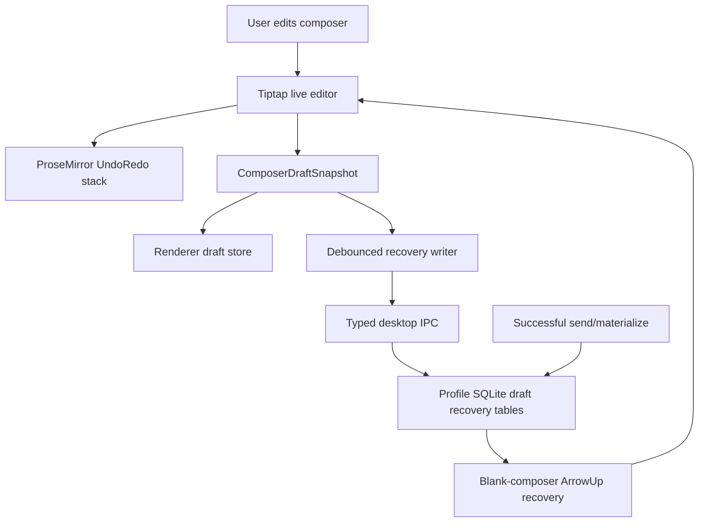
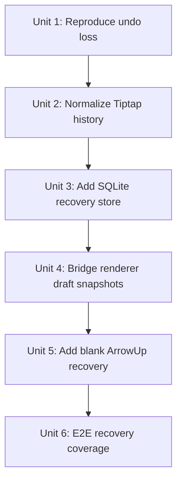
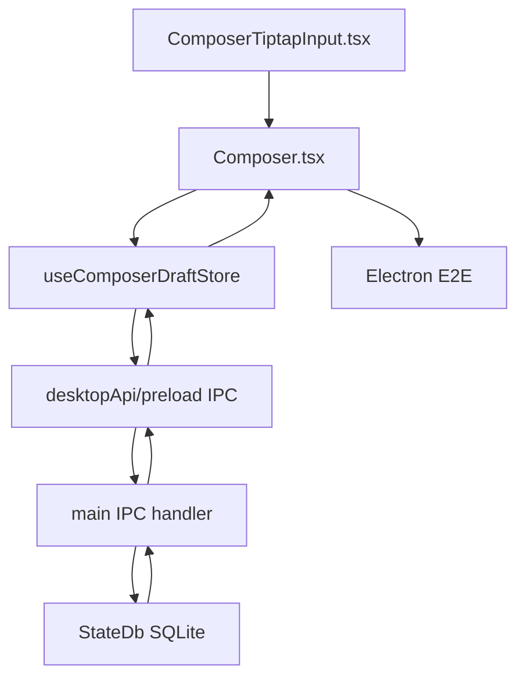

# fix: Protect composer undo and draft recovery

## Overview

Make long composer drafts recoverable when Tiptap undo history, skill-token insertion, navigation, or remount behavior goes wrong. The live editor should keep an aggressive undo/redo stack for normal editing, while PwrAgent keeps a profile-scoped durable draft journal that can restore complete unsent drafts and recently sent prompts from a blank composer.

## Problem Frame

The reported failure happened in the new-thread launchpad after inserting a skill through autocomplete, typing a lengthy multi-paragraph message, and pressing `Cmd+Z`. Instead of undoing the most recent text operation, the editor deleted everything after the inserted skill. `Cmd+Y` did not recover it, and navigating away/back recreated the entry enough to lose the only possible in-memory recovery path.

This extends the existing draft-persistence concern from the origin document: unsent composer content is user data and must not be treated as disposable UI state. The prior work protects text/images across navigation, but it does not provide a recoverable history of complete drafts or explicitly constrain Tiptap undo/redo semantics around programmatic skill insertion and external document sync. (see origin: `docs/brainstorms/2026-05-02-desktop-composer-draft-persistence-regression-requirements.md`)

## Requirements Trace

- R1. `Cmd/Ctrl+Z` in Tiptap composers undoes the latest user edit or atomic skill-token edit, not the whole post-skill draft.
- R2. Redo works with `Cmd/Ctrl+Shift+Z`; add `Cmd/Ctrl+Y` as a compatibility redo shortcut when focus is inside the composer.
- R3. Programmatic composer hydration, scope switching, launchpad autosave echoes, and durable recovery restores do not pollute or collapse the live undo history.
- R4. Skill autocomplete insertion is one atomic undo step that can be undone/redone without losing later text or leaving broken mention state.
- R5. PwrAgent stores complete draft snapshots durably enough to survive renderer remounts, navigation away/back, window reloads, and app restart for unsent drafts.
- R6. PwrAgent stores enough recent sent and abandoned draft snapshots to recover a long message from a blank composer using keyboard cycling.
- R7. Durable storage is profile-scoped, bounded by retention, and does not introduce dependency-boundary violations from the renderer.
- R8. Draft recovery covers launchpad and existing-thread reply composers, including text, Tiptap JSON document, skill tokens, image attachments metadata, timestamps, and sent/unsent status.
- R9. Recovery UX is discoverable but quiet: on ArrowUp in a blank composer, cycle through recoverable drafts for the current scope first, then recent sent prompts where appropriate.
- R10. Tests reproduce the reported skill autocomplete + long multiline message + undo/redo failure and prove recovery after navigation/restart boundaries.

## Scope Boundaries

- This plan does not redesign the composer UI or transcript.
- This plan does not attempt to persist ProseMirror's internal undo/redo stack across app restarts.
- This plan does not store image binary data beyond the attachment metadata/data URLs already used by the composer.
- This plan does not add cloud sync or cross-profile draft sharing.
- This plan does not change send payload semantics, launchpad materialization semantics, or the existing one-launchpad-per-directory model.

## Context & Research

### Relevant Code and Patterns

- `apps/desktop/src/renderer/src/features/composer/ComposerTiptapInput.tsx` builds the Tiptap editor with `StarterKit`, a custom mention extension, `setContent`-based external sync, and a custom one-off single-skill delete undo workaround.
- `apps/desktop/src/renderer/src/features/composer/Composer.tsx` owns composer scope keys, skill autocomplete insertion, canonical draft serialization, image attachments, launchpad persistence flushes, and the current draft store integration.
- `apps/desktop/src/renderer/src/features/composer/useComposerDraftStore.ts` is an in-memory app-level store for scoped draft snapshots, queued turns, and pending steer state.
- `apps/desktop/src/renderer/src/App.tsx` creates one `useComposerDraftStore` at the shell level and passes it into `ThreadView`, so it is stable across normal thread view remounts but not app restarts.
- `apps/desktop/src/main/state/state-db.ts` owns the profile-scoped SQLite database at `~/.pwragent/profiles/<name>/state/state.db`, current migrations, WAL settings, and bounded GC patterns.
- `apps/desktop/src/main/ipc/agent-ipc.ts`, `apps/desktop/src/preload/index.ts`, `apps/desktop/src/renderer/src/lib/desktop-api.ts`, and `apps/desktop/src/shared/ipc.ts` are the existing renderer-main IPC pattern for typed desktop capabilities.
- `apps/desktop/e2e/composer-draft-persistence-regression.spec.ts` already exercises Tiptap launchpad/reply draft persistence with pasted images across switching and refresh.
- `apps/desktop/src/renderer/src/features/composer/__tests__/ComposerTiptapInput.test.tsx` and `apps/desktop/src/renderer/src/features/composer/__tests__/composer.test.tsx` are the right home for editor behavior and composer integration tests.

### Institutional Learnings

- `docs/solutions/2026-05-07-codex-permission-mode-state-machine.md` is relevant by pattern, not domain: eliminate split-brain state where possible, and prefer structural fixes over drift detection. For this plan, the structural boundary is that Tiptap owns live undo/redo, while PwrAgent owns durable recovery snapshots.
- `docs/plans/2026-05-02-003-fix-composer-draft-persistence-plan.md` established that draft text, Tiptap JSON, skill tokens, and image attachments should move as one coherent scoped snapshot.
- `docs/plans/2026-04-30-001-fix-composer-skill-autocomplete-plan.md` established that the canonical draft string remains the send source of truth even when the visual composer renders skill tokens.

### External References

- Tiptap UndoRedo docs: `https://github.com/ueberdosis/tiptap-docs/blob/main/src/content/editor/extensions/functionality/undo-redo.mdx`
- Tiptap v3 upgrade docs: `https://github.com/ueberdosis/tiptap-docs/blob/main/src/content/guides/upgrade-tiptap-v2.mdx`
- ProseMirror history reference: `https://prosemirror.net/docs/ref/#history`
- ProseMirror guide keymap/history example: `https://prosemirror.net/docs/guide/`

Tiptap v3 uses `UndoRedo` through `StarterKit` unless disabled with `undoRedo: false`; the old `history` StarterKit option was renamed. `UndoRedo` exposes `depth` and `newGroupDelay`. ProseMirror history defaults to depth 100 and 500ms grouping, supports `undo`/`redo`, `undoDepth`/`redoDepth`, `closeHistory`, and `addToHistory: false` transaction metadata for changes that should not be user-undoable.

## Key Technical Decisions

- **Keep live undo/redo inside Tiptap/ProseMirror.** The editor history is the right primitive for same-focus editing, cursor-aware undo, and redo. Configure it aggressively, but do not replace it with app-level snapshot replay.
- **Do not persist ProseMirror history as the recovery format.** The durable layer should store PwrAgent-owned composer snapshots and journal entries. That avoids coupling recovery to ProseMirror plugin internals and lets recovery work after remounts, restarts, or future editor changes.
- **Persist recovery in profile SQLite, not renderer `localStorage`.** SQLite is already profile-scoped, migratable, testable, included in backup/state semantics, and accessible from the main process without renderer storage quirks. `localStorage` can remain an implementation fallback only if implementation proves IPC latency is a problem, but it should not be the source of truth.
- **Separate current draft from recovery history.** The current in-memory draft snapshot should keep composer reads synchronous and make reopening a scope immediate. The durable journal should mirror those snapshots asynchronously and retain complete versions of long drafts, recently sent prompts, and abandoned drafts for bounded recovery.
- **Treat skill insertion and restore operations as explicit history boundaries.** Skill autocomplete insertion should be a normal user history item, external prop sync should use non-history transactions, and recovery restore should start a fresh history group so one undo does not erase the restored document.
- **Prefer complete snapshots over text diffs.** Drafts are small compared with transcript history, and snapshot storage is simpler, safer, and easier to recover than custom diff chains for Tiptap JSON plus skill/image state.
- **Expose recovery through existing composer ergonomics first.** ArrowUp on a blank composer is the initial retrieval path because it is already a familiar chat-composer convention and does not add persistent UI chrome.

## Open Questions

### Resolved During Planning

- **Where should durable recovery live?** Profile SQLite in the main process. It aligns with existing state storage and avoids renderer-only durability.
- **Should we persist ProseMirror undo history?** No. Store app-level snapshots and keep ProseMirror history for live in-editor undo/redo only.
- **Should `Cmd+Y` work on macOS?** Yes as composer-local compatibility. Keep `Cmd/Ctrl+Shift+Z` as the documented redo path, but support `Cmd/Ctrl+Y` while focus is inside the editor because users expect it after a destructive undo.
- **Should sent messages be recoverable too?** Yes, bounded recent sent prompts should be available from a blank composer after unsent scope-local candidates, because a user often wants to resend or recover the just-sent full text.

### Deferred to Implementation

- Exact retention numbers for max rows and max age may be tuned after measuring snapshot size. Start with conservative caps and make them constants.
- Exact IPC method grouping may be adjusted if the existing preload API organization suggests a better split.
- Exact ArrowUp candidate ordering within equal timestamps can be decided while writing tests, as long as scope-local unsent drafts precede global recent sent prompts.
- Exact completeness thresholds for journal candidates may be tuned during implementation. Start by always keeping latest unsent scope state, and only adding recovery-history rows for non-empty snapshots that cross a modest text length, have skill tokens, have image attachments, are sent, or are flushed on focus/scope loss.

## High-Level Technical Design

> *This illustrates the intended approach and is directional guidance for review, not implementation specification. The implementing agent should treat it as context, not code to reproduce.*

The live editor stack and durable recovery store are deliberately different systems. Undo/redo handles immediate editing. The recovery journal handles complete-draft restoration when the editor history is gone, corrupted, or the user navigated away.

## Implementation Units

- [ ] **Unit 1: Reproduce the skill autocomplete undo failure**

**Goal:** Capture the reported destructive undo/redo behavior before changing editor history semantics.

**Requirements:** R1, R2, R4, R10

**Dependencies:** None

**Files:**
- Modify: `apps/desktop/src/renderer/src/features/composer/__tests__/ComposerTiptapInput.test.tsx`
- Modify: `apps/desktop/src/renderer/src/features/composer/__tests__/composer.test.tsx`
- Modify: `apps/desktop/e2e/directory-launchpad-skills.spec.ts` or `apps/desktop/e2e/composer-draft-persistence-regression.spec.ts`

**Approach:**
- Build a test draft that matches the report: start in a launchpad, insert a skill through autocomplete, type a lengthy multiline body after it, delete a small recent text span, then press undo.
- Assert undo restores only the recent deleted span, not the entire post-skill body.
- Assert redo through `Cmd/Ctrl+Shift+Z` and `Cmd/Ctrl+Y` restores the undone state while focus remains in the composer.
- Include a component-level test for fast feedback and one Electron-level scenario for the real Tiptap keyboard path.

**Execution note:** Characterization-first. The first tests should fail or clearly document the current behavior if implementation has already drifted.

**Patterns to follow:**
- Current reported multiline skill tests near the end of `apps/desktop/src/renderer/src/features/composer/__tests__/composer.test.tsx`.
- Tiptap `data-value` assertions in `apps/desktop/e2e/composer-draft-persistence-regression.spec.ts`.

**Test scenarios:**
- Integration: launchpad skill autocomplete insertion -> lengthy multiline text -> small deletion -> `Cmd+Z` restores only the small deletion.
- Integration: after that undo, `Cmd+Shift+Z` redoes the small deletion without clearing the body.
- Integration: after that undo, `Cmd+Y` also redoes while composer focus is active.
- Edge case: undoing the skill insertion itself removes only the skill token and leaves later manually typed text intact according to normal editor selection/history semantics.
- Regression: navigation away/back after the destructive undo test does not silently clear the durable recovery candidate created before undo.

**Verification:**
- The test suite fails on the exact destructive-history class: a single undo cannot delete all post-skill long-form text.

- [ ] **Unit 2: Normalize Tiptap undo/redo configuration and transaction boundaries**

**Goal:** Make Tiptap history behavior predictable for skill insertion, external sync, restore, and keyboard redo.

**Requirements:** R1, R2, R3, R4

**Dependencies:** Unit 1

**Files:**
- Modify: `apps/desktop/src/renderer/src/features/composer/ComposerTiptapInput.tsx`
- Modify: `apps/desktop/src/renderer/src/features/composer/Composer.tsx`
- Modify: `apps/desktop/src/renderer/src/features/composer/ComposerInputTypes.ts` only if the input handle needs explicit undo/redo diagnostics
- Test: `apps/desktop/src/renderer/src/features/composer/__tests__/ComposerTiptapInput.test.tsx`
- Test: `apps/desktop/src/renderer/src/features/composer/__tests__/composer.test.tsx`

**Approach:**
- Configure Tiptap v3 `UndoRedo` through `StarterKit` or an explicit extension with a larger history `depth` and a `newGroupDelay` tuned for prose composition.
- Audit every `setContent` and external sync path. Hydration from props, launchpad autosave echoes, scope restore, and recovery restore should not append stale synthetic changes to the user's undo stack.
- Prefer ProseMirror transactions for skill insertion/deletion over React-state-driven full document replacement when the change is a user action.
- Use history boundaries around skill insertion and recovery restore so undo steps are atomic and legible.
- Add composer-local key handling for `Cmd/Ctrl+Y` redo, preserving existing `Cmd/Ctrl+Shift+Z`.
- Remove or subsume the bespoke `deletedSingleSkillRef` workaround if normalized history makes it redundant; keep it only if tests prove the mention extension still needs a narrowly scoped guard.

**Patterns to follow:**
- Current `pendingExternalSignatureRef` and `props.editorDocument` synchronization in `ComposerTiptapInput.tsx`.
- Existing `applyExternalSkillInsertion` and mention-node helpers in `ComposerTiptapInput.tsx`.

**Test scenarios:**
- Happy path: consecutive prose typing groups into sensible undo steps instead of one giant document wipe.
- Happy path: selecting a skill from autocomplete is one undoable user transaction.
- Happy path: `Cmd+Y` triggers redo in the Tiptap editor while focus is inside the composer.
- Edge case: prop hydration for the same saved draft does not create an undo step that clears the whole document.
- Edge case: restoring a durable draft starts a clean history group; the first undo after restore does not jump back to the pre-restore empty composer.
- Error path: malformed or missing `editorDocument` falls back to canonical text without crashing and without poisoning the undo stack.

**Verification:**
- Tiptap-specific tests prove undo/redo depth, grouping, and keyboard handling around skill mentions and external restores.

- [ ] **Unit 3: Add a profile-scoped SQLite draft recovery store**

**Goal:** Persist current draft snapshots and bounded recovery history in the existing profile state database.

**Requirements:** R5, R6, R7, R8

**Dependencies:** Unit 2

**Files:**
- Modify: `apps/desktop/src/main/state/state-db.ts`
- Create: `apps/desktop/src/main/state/composer-draft-recovery-store.ts`
- Modify: `apps/desktop/src/main/state/app-state.ts`
- Create: `packages/shared/src/contracts/composer-drafts.ts`
- Modify: `packages/shared/src/contracts/index.ts` or the package's existing export surface for shared contracts
- Test: `apps/desktop/src/main/__tests__/state-migration.test.ts`
- Test: `apps/desktop/src/main/__tests__/composer-draft-recovery-store.test.ts`

**Approach:**
- Add SQLite tables for the latest draft per scope and a bounded draft recovery journal. Keep rows profile-local because the DB path is profile-local.
- Store scope key, scope kind, backend/thread/directory identifiers where known, canonical text, Tiptap JSON document, skill token metadata, image attachment metadata, lifecycle state (`unsent`, `sent`, `abandoned`, `cleared`), timestamps, content hash, and an approximate character count.
- Define `abandoned` narrowly as a non-empty unsent snapshot superseded by scope change, app shutdown, or explicit blank-composer replacement. Do not mark active current drafts abandoned while they remain the latest state for that scope.
- Deduplicate journal entries by scope/content hash so continuous typing does not flood the table with identical snapshots.
- Keep writes transactional and retention bounded. Suggested initial retention: latest per active scope plus a per-profile journal cap and max age, enforced from `StateDb.cleanupExpired`.
- Avoid storing secrets beyond what the user typed into the draft. Do not encrypt these rows in this phase because existing transcript and launchpad state are not encrypted, but name the privacy implication in PR notes.

**Patterns to follow:**
- `apps/desktop/src/main/messaging/messaging-activity-log.ts` for bounded append-only activity storage.
- `apps/desktop/src/main/state/state-db.ts` migration and GC style.
- `apps/desktop/src/main/state/overlay-store-sqlite.ts` for JSON payload storage over typed contracts.

**Test scenarios:**
- Happy path: saving a current launchpad draft and reopening the DB restores the same text, editor document, skill tokens, and image metadata.
- Happy path: appending multiple versions of a long draft keeps ordered recovery candidates.
- Happy path: marking a draft as sent preserves it as a recent sent recovery candidate but clears it as the latest unsent draft.
- Edge case: repeated identical snapshots update metadata or no-op without adding duplicate journal rows.
- Edge case: retention deletes oldest journal rows beyond the cap while preserving the latest current draft per scope.
- Error path: malformed JSON payload rows are skipped with a logged warning instead of crashing app startup.

**Verification:**
- Main-process unit tests prove schema migration, persistence across handles, retention, and malformed-row resilience.

- [ ] **Unit 4: Bridge renderer draft snapshots to durable recovery IPC**

**Goal:** Feed the SQLite recovery store from the existing renderer draft snapshot lifecycle without blocking typing or violating renderer boundaries.

**Requirements:** R5, R7, R8

**Dependencies:** Unit 3

**Files:**
- Modify: `apps/desktop/src/shared/ipc.ts`
- Modify: `apps/desktop/src/preload/index.ts`
- Modify: `apps/desktop/src/renderer/src/lib/desktop-api.ts`
- Create: `apps/desktop/src/main/ipc/composer-drafts.ts`
- Modify: `apps/desktop/src/main/index.ts`
- Modify: `apps/desktop/src/renderer/src/features/composer/useComposerDraftStore.ts`
- Create: `apps/desktop/src/renderer/src/features/composer/useDurableComposerDraftStore.ts`
- Modify: `apps/desktop/src/renderer/src/App.tsx`
- Test: `apps/desktop/src/main/__tests__/composer-drafts-ipc.test.ts`
- Test: `apps/desktop/src/renderer/src/features/composer/__tests__/composer.test.tsx`

**Approach:**
- Add typed IPC for saving current snapshots, recording sent/abandoned snapshots, listing recovery candidates, and clearing specific latest drafts.
- Keep the existing `ComposerDraftStore` read/write methods synchronous. Add a durable wrapper hook at the app-shell level that writes through to the in-memory store immediately, mirrors changes to IPC asynchronously, and exposes separate async recovery-candidate methods.
- Prime the in-memory store from durable latest-draft rows during app-shell startup or before first recovery interaction, but do not make every composer render wait on SQLite.
- Debounce durable writes during typing, but flush immediately on scope switch, unmount, successful send/materialize, and before clearing a submitted draft.
- Treat IPC failure as recoverable: keep the in-memory draft and surface diagnostic logging, but do not block typing or sending.
- Keep renderer imports limited to `@pwragent/shared` and local renderer modules; all SQLite access stays in main.

**Patterns to follow:**
- Existing `desktopApi` optional-method style in `apps/desktop/src/renderer/src/lib/desktop-api.ts`.
- Existing renderer error/logging IPC patterns for best-effort diagnostics.
- Current `flushComposerDraftSnapshot` and `markComposerDraftSubmitted` behavior in `Composer.tsx`.

**Test scenarios:**
- Happy path: typing a long launchpad draft schedules a durable save and scope switch flushes it immediately.
- Happy path: successful thread reply send records a sent snapshot and clears the latest unsent snapshot for that scope.
- Happy path: app restart hydration requests latest unsent drafts before rendering a blank composer.
- Edge case: IPC save rejects -> in-memory draft remains visible and usable.
- Edge case: two rapid scope switches persist both scopes without overwriting one with the other.
- Integration: renderer tests prove `Composer.tsx` still uses the draft store abstraction and does not import main-process persistence.

**Verification:**
- Renderer-main boundary remains clean, and draft persistence failures are non-destructive.

- [ ] **Unit 5: Add blank-composer ArrowUp recovery cycling**

**Goal:** Let users recover recent unsent or sent drafts from a blank composer without opening a separate recovery screen.

**Requirements:** R6, R8, R9

**Dependencies:** Unit 4

**Files:**
- Modify: `apps/desktop/src/renderer/src/features/composer/Composer.tsx`
- Modify: `apps/desktop/src/renderer/src/features/composer/useComposerDraftStore.ts`
- Modify: `apps/desktop/src/renderer/src/features/composer/ComposerTiptapInput.tsx` only if restore needs an explicit input-handle method
- Test: `apps/desktop/src/renderer/src/features/composer/__tests__/composer.test.tsx`

**Approach:**
- When the composer is blank and the caret is at the start, intercept ArrowUp to request recovery candidates.
- Candidate order should be current-scope unsent drafts first, then current-directory/thread related unsent drafts, then recent sent prompts for the same thread/directory/backend, then broader recent sent prompts if still useful.
- Restoring a candidate should restore the full snapshot: text, editor document, skill tokens, and image metadata.
- Restoring a candidate must place the caret at draft index `0`, not at the end. While the caret remains exactly at `0..0`, repeated ArrowUp continues cycling through recovery candidates.
- While recovery mode is active, the caret remains at `0..0`, and the composer is non-empty, ArrowDown moves back toward the newest/first recovery candidate. ArrowDown from the newest candidate returns the composer to blank and ends the active cycle, matching shell history behavior.
- Once the caret leaves `0..0` in a restored draft, the active recovery cycle is over. ArrowUp must return to normal editor navigation and must not cycle drafts again until the composer is fully blank.
- Any key other than ArrowUp/ArrowDown while a restored non-empty draft is active breaks recovery mode. That includes typing, ArrowRight, Ctrl/Command-end movement, mouse movement, or any selection-changing command; after that, ArrowUp/ArrowDown behave as normal editor navigation until the composer is blank again.
- Recovery-history rows should represent coherent drafts, not every edit step. Record them at explicit boundaries: successful send, queue/steer handoff, lifecycle flush of a complete unsent draft, or whole-composer deletion that transitions from non-empty to empty.
- The recovery store should collapse near-repeat unsubmitted drafts: if the last unsubmitted history item for the same scope is a prefix of the next unsubmitted item, replace the older item with the longer one. Sent prompts are immutable shell-style history entries and must not be replaced by later longer drafts.
- Provide a small quiet inline status or accessible announcement indicating which candidate was restored and how to cycle, without adding persistent explanatory copy.
- Do not override ArrowUp when the composer has content, autocomplete is open, or the caret is not at the start.
- Add a clear path to return to blank after cycling, either by cycling past the last candidate or using normal select/delete behavior.

**Patterns to follow:**
- Existing autocomplete key handling and active index management in `Composer.tsx`.
- Existing queued-turn recovery/preview affordances for compact composer state.

**Test scenarios:**
- Happy path: blank launchpad composer + ArrowUp restores the most recent unsent launchpad draft for that directory.
- Happy path: blank thread reply composer + ArrowUp restores the most recent unsent reply draft for that thread.
- Happy path: blank composer + repeated ArrowUp cycles from unsent candidates into recent sent candidates.
- Happy path: after ArrowUp restores a candidate, the caret is at the top-left/start position and a second ArrowUp cycles to the next candidate.
- Happy path: after repeated ArrowUp reaches an older candidate, ArrowDown returns toward the newest candidate and ArrowDown from the newest candidate returns to a blank composer.
- Edge case: after a restored candidate's caret moves away from the start position, ArrowUp does not cycle recovery candidates again while that draft remains non-empty.
- Edge case: after a restored candidate's caret moves away from the start position, ArrowDown does not cycle or clear recovery candidates while that draft remains non-empty.
- Edge case: unsubmitted prefix drafts are collapsed in recovery history, while sent prompts remain as separate recoverable entries.
- Edge case: nonblank composer + ArrowUp preserves normal editor navigation and does not replace content.
- Edge case: autocomplete open + ArrowUp moves autocomplete selection, not recovery.
- Edge case: restored candidate with skill tokens rehydrates the Tiptap mention nodes and serializes to the same canonical draft on send.
- Error path: no candidates available leaves the composer blank and does not show an error.

**Verification:**
- Users can recover a recent long draft from an empty composer using keyboard-only interaction.

- [ ] **Unit 6: Add restart and destructive-undo E2E coverage**

**Goal:** Prove the full protection story at the Electron level: live undo does not destroy long drafts, and durable recovery works after navigation/restart.

**Requirements:** R1, R2, R5, R6, R8, R9, R10

**Dependencies:** Units 1-5

**Files:**
- Modify: `apps/desktop/e2e/composer-draft-persistence-regression.spec.ts`
- Create or modify: `apps/desktop/e2e/composer-draft-recovery-history.spec.ts`
- Modify: `apps/desktop/e2e/fixtures/electron-app.ts` only if app restart with preserved `PWRAGENT_HOME` needs a reusable helper

**Approach:**
- Extend or add a replay-backed spec that uses a persistent temp `PWRAGENT_HOME`/profile directory across app relaunch.
- Cover the reported flow with skill autocomplete, long multiline text, undo, redo, navigation away/back, and recovery candidate availability.
- Cover a sent-message recovery flow: send a long prompt, open a blank composer in the same scope, press ArrowUp, and verify the sent text can be restored as a candidate.
- Keep assertions semantic: Tiptap `data-value`, visible skill mention/chip, attachment previews, and successful send payload where relevant.

**Patterns to follow:**
- `apps/desktop/e2e/composer-draft-persistence-regression.spec.ts` for persistent temp root, replay fixture, and Tiptap assertions.
- `apps/desktop/e2e/directory-launchpad-skills.spec.ts` for skill autocomplete setup.

**Test scenarios:**
- Integration: destructive-undo reproduction flow -> `Cmd+Z`/redo preserve the long post-skill message.
- Integration: long unsent launchpad draft -> navigate away -> relaunch app with same profile -> blank composer ArrowUp restores the draft.
- Integration: long sent thread reply -> clear composer -> ArrowUp restores recent sent text as a candidate.
- Edge case: recovery candidate with skill mention still sends path-bearing skill markdown.
- Edge case: recovery retention does not surface a draft explicitly cleared after successful submission as an unsent candidate.

**Verification:**
- Electron coverage proves the feature across Tiptap, IPC, SQLite, navigation, relaunch, and keyboard recovery.

## System-Wide Impact

- **Interaction graph:** Tiptap handles live edit history; `Composer.tsx` owns scope and send lifecycle; the draft store bridges to durable IPC; the main process owns SQLite persistence.
- **Error propagation:** Durable-save failures should be logged and should not clear visible in-memory drafts. Recovery-list failures should simply produce no candidates plus diagnostic logging.
- **State lifecycle risks:** The risky transitions are skill insertion, external `setContent`, scope switch, app relaunch, successful send clearing, explicit clear, delayed image normalization, and recovery restore.
- **API surface parity:** Add desktop renderer IPC only; no app-server or backend protocol changes are planned.
- **Integration coverage:** Unit tests cover editor history boundaries and store behavior; E2E covers real keyboard shortcuts, relaunch, and SQLite-backed recovery.
- **Unchanged invariants:** Composer send payloads, launchpad materialization, image normalization policy, thread navigation ordering, and dependency boundaries remain unchanged.

## Risks & Dependencies

| Risk | Mitigation |
|------|------------|
| Programmatic `setContent` continues to collapse Tiptap history. | Audit every external sync path and test history behavior around skill insertion, restore, and scope hydration. |
| Durable writes on every keystroke hurt responsiveness. | Debounce normal typing writes, dedupe by content hash, and flush at lifecycle boundaries. |
| Recovery store grows without bound. | Add per-profile caps, max-age retention, and GC from `StateDb.cleanupExpired`. |
| Draft rows contain sensitive user text. | Keep storage profile-local, avoid extra copies beyond retention, document privacy implication in PR notes, and provide explicit clear behavior. |
| ArrowUp recovery conflicts with editor navigation or autocomplete. | Trigger when blank, or while an active recovery cycle has focus at `0..0`; clear the cycle as soon as the caret leaves that position. |
| Sent-message recovery could surprise users by resurrecting already-sent content. | Scope it behind blank-composer ArrowUp and order unsent drafts before sent candidates. |
| Persisting image data URLs increases DB size. | Store current attachment metadata as-is initially, measure row size, and cap retention; do not expand binary support in this plan. |
| Main/renderer contracts drift or violate boundaries. | Put shared request/response types in `@pwragent/shared` and keep SQLite access in main only. |

## Documentation / Operational Notes

- Add PR notes explaining that live undo history is intentionally not persisted; durable recovery uses complete draft snapshots.
- No user-facing help page is required for the first pass, but release notes should mention ArrowUp draft recovery if the interaction ships.
- If retention constants are tuned during implementation, record the rationale in code comments near the constants and in the PR summary.

## Sources & References

- **Origin document:** [docs/brainstorms/2026-05-02-desktop-composer-draft-persistence-regression-requirements.md](../brainstorms/2026-05-02-desktop-composer-draft-persistence-regression-requirements.md)
- Related plan: [docs/plans/2026-05-02-003-fix-composer-draft-persistence-plan.md](2026-05-02-003-fix-composer-draft-persistence-plan.md)
- Related plan: [docs/plans/2026-04-30-001-fix-composer-skill-autocomplete-plan.md](2026-04-30-001-fix-composer-skill-autocomplete-plan.md)
- Related learning: [docs/solutions/2026-05-07-codex-permission-mode-state-machine.md](../solutions/2026-05-07-codex-permission-mode-state-machine.md)
- Related code: `apps/desktop/src/renderer/src/features/composer/ComposerTiptapInput.tsx`
- Related code: `apps/desktop/src/renderer/src/features/composer/Composer.tsx`
- Related code: `apps/desktop/src/renderer/src/features/composer/useComposerDraftStore.ts`
- Related code: `apps/desktop/src/main/state/state-db.ts`
- Related tests: `apps/desktop/src/renderer/src/features/composer/__tests__/ComposerTiptapInput.test.tsx`
- Related tests: `apps/desktop/src/renderer/src/features/composer/__tests__/composer.test.tsx`
- Related E2E: `apps/desktop/e2e/composer-draft-persistence-regression.spec.ts`
- External docs: Tiptap UndoRedo extension, `https://github.com/ueberdosis/tiptap-docs/blob/main/src/content/editor/extensions/functionality/undo-redo.mdx`
- External docs: Tiptap v3 StarterKit undo/redo rename, `https://github.com/ueberdosis/tiptap-docs/blob/main/src/content/guides/upgrade-tiptap-v2.mdx`
- External docs: ProseMirror history reference, `https://prosemirror.net/docs/ref/#history`
