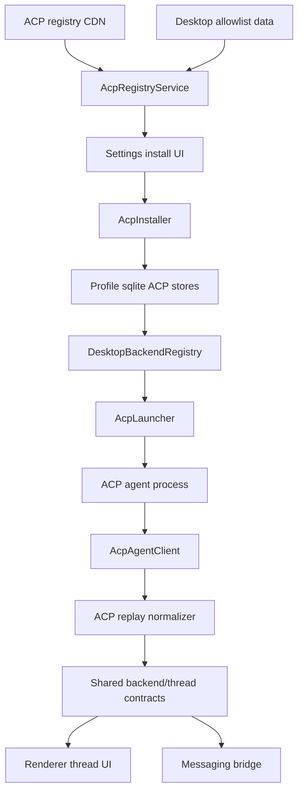
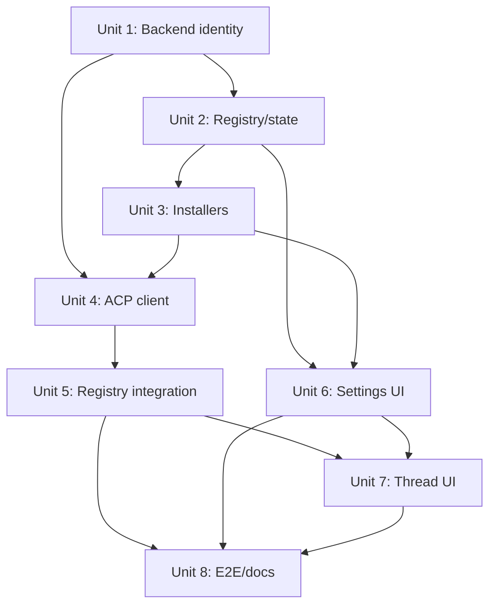

# feat: Add ACP registry backends

## Overview

Add Agent Client Protocol (ACP) as a registry-backed desktop backend family so
PwrAgent can discover, install, launch, and run allowlisted ACP-compatible
coding agents as first-class backends next to Codex and Grok.

This is not a raw model-provider integration. ACP gives PwrAgent access to
external coding agents that speak ACP. Each installed ACP registry agent should
appear as its own backend, with its own label, trust/provenance state,
capabilities, session list, transcript stream, and access-mode behavior (see
origin: `docs/brainstorms/2026-05-17-acp-registry-backends-requirements.md`).

## Problem Frame

PwrAgent currently has a normalized app-server contract that assumes two
built-in backend kinds: `codex` and `grok`. That works for fixed first-party
or bundled integrations, but ACP registry adoption makes backend identity
dynamic: PwrAgent needs to run arbitrary installed agents without weakening
thread navigation, messaging, execution modes, provenance, or security posture.

The first product slice is a PwrAgent client adapter for external ACP agents.
Exporting PwrAgent or Agent Core over ACP is deliberately out of scope.

## Requirements Trace

- R1-R4. Fetch the ACP registry, normalize entries, cache registry state, and
  expose only entries allowed by a PwrAgent-controlled launch allowlist.
- R5-R11. Support `npx`, `uvx`, and platform binary distributions with explicit
  install confirmation, prerequisite detection, provenance records, integrity
  handling when metadata exists, and clear unavailable states when it does not.
- R12-R16. Represent each installed ACP agent as a distinct backend that feeds
  the existing PwrAgent thread, transcript, capability, and navigation models.
- R17-R21. Map PwrAgent Default Access and Full Access onto ACP client-owned
  filesystem, terminal, and permission request flows while clearly disclosing
  behavior PwrAgent cannot enforce.
- R22-R24. Keep ACP as a desktop-side ecosystem-agent adapter. Do not move
  ACP ownership into `packages/agent-core`, do not replace the normalized
  PwrAgent backend contract, and do not position ACP as instant raw-model
  access.

## Scope Boundaries

- No raw LLM provider work in `packages/agent-core`.
- No ACP server/export layer for PwrAgent or Grok.
- No automatic exposure of the full public registry; launch exposure is gated
  by PwrAgent allowlist policy.
- No claim that PwrAgent can sandbox or mediate behavior an ACP agent performs
  internally outside ACP client-owned APIs.
- No dependency-boundary exceptions in `.dependency-cruiser.cjs`.
- No renderer import of desktop main-process or ACP SDK code. Renderer changes
  must continue to go through shared contracts and IPC.

## Context & Research

### Relevant Code and Patterns

- `packages/shared/src/contracts/normalized-app-server.ts` defines
  `AppServerBackendKind = "codex" | "grok"` and threads, events, requests,
  worktree snapshots, and navigation scopes depend on it.
- `packages/shared/src/contracts/backend.ts` exposes `BackendSummary` and
  capability metadata consumed by renderer and messaging surfaces.
- `apps/desktop/src/main/app-server/backend-registry.ts` owns current Codex/Grok
  backend routing, capability summaries, event forwarding, execution modes,
  active-thread tracking, model settings, thread list caching, and user-facing
  backend labels.
- `apps/desktop/src/main/codex-app-server/json-rpc.ts` and
  `apps/desktop/src/main/codex-app-server/stdio-transport.ts` provide the local
  JSON-RPC over stdio pattern, but the transport is Codex-command specific and
  should be generalized or wrapped for ACP.
- `apps/desktop/src/main/codex-app-server/client.ts` is the closest example of
  translating streamed protocol events into PwrAgent thread replay state.
- `apps/desktop/src/main/grok-app-server/client.ts` shows the opposite boundary:
  desktop wraps `packages/agent-core` in-process, while Agent Core remains below
  the desktop package layer.
- `apps/desktop/src/main/settings/desktop-config.ts` preserves user-editable
  TOML shape and comments. Per `docs/config-file-evolution.md`, new mutable
  runtime/install records should prefer sqlite state unless they are intended
  as hand-editable config.
- `apps/desktop/src/main/state/state-db.ts` centralizes profile sqlite schema
  creation, migrations, and retention.
- `apps/desktop/src/main/messaging/core/messaging-controller.ts` still parses
  binding action ids with a `codex|grok` allowlist, so messaging parity needs
  dynamic backend id handling rather than a desktop-only change.
- `apps/desktop/src/renderer/src/lib/backend-label.ts`,
  `apps/desktop/src/renderer/src/lib/useBackendSummaries.ts`,
  `apps/desktop/src/renderer/src/features/composer/Composer.tsx`, navigation,
  settings, and thread-detail surfaces currently assume fixed backend labels in
  several places.
- `packages/agent-core/src/domain/navigation-state.ts` and related navigation
  modules can consume dynamic backend ids through shared contracts, but should
  not import desktop ACP code.

### Institutional Learnings

- `docs/solutions/2026-05-07-codex-permission-mode-state-machine.md` is directly
  relevant: security-relevant routing should not silently fall back, upstream
  sandbox defaults should be pinned explicitly, protocol state should not be
  misrepresented while a turn is running, and typed backend notifications should
  drive cross-surface refresh.
- `docs/plans/2026-04-16-004-feat-codex-access-mode-toggle-plan.md` provides
  the execution-mode overlay pattern and confirms that access mode belongs in
  the normalized backend/thread model, not only in one client adapter.
- `docs/plans/2026-05-04-002-feat-messaging-capability-discovery-plan.md`
  provides the capability-honesty pattern: producers and UI surfaces should
  adapt to declared capabilities instead of pretending parity exists.

### External References

- ACP introduction: `https://agentclientprotocol.com/get-started/introduction`
- ACP registry docs: `https://agentclientprotocol.com/get-started/registry`
- ACP initialization docs: `https://agentclientprotocol.com/protocol/initialization`
- ACP prompt turn docs: `https://agentclientprotocol.com/protocol/prompt-turn`
- ACP filesystem docs: `https://agentclientprotocol.com/protocol/file-system`
- ACP terminal docs: `https://agentclientprotocol.com/protocol/terminals`
- ACP TypeScript SDK docs: `https://agentclientprotocol.com/libraries/typescript`
- Registry endpoint:
  `https://cdn.agentclientprotocol.com/registry/v1/latest/registry.json`

Current registry sampling on 2026-05-17 found 35 entries using `binary`, `npx`,
and `uvx` distributions. Binary entries sampled from the public registry did
not expose checksum or signature metadata, so the plan treats cryptographic
verification as conditional on available metadata and requires allowlist-backed
disclosure for unverified binary sources.

## Key Technical Decisions

- **Use dynamic backend ids while preserving built-in backend kinds.** Introduce
  a shared backend id concept that can represent `codex`, `grok`, and installed
  ACP ids such as `acp:<registry-id>`. Keep helper predicates for built-ins so
  Codex/Grok-only code remains explicit instead of accepting arbitrary strings.
- **Keep ACP implementation in the desktop app.** ACP process launching,
  registry installation, filesystem/terminal mediation, and protocol adapters
  belong in `apps/desktop/src/main/acp/`. Shared packages get only portable
  contracts. `packages/agent-core` should only see normalized thread/backend
  data.
- **Use sqlite for install/runtime provenance and a repo-owned allowlist for
  launch policy.** Installed agent records, registry cache, provenance, and
  session metadata are profile state. The launch allowlist should be a
  reviewable data file under desktop source, with optional future TOML override
  deferred unless launch needs user-editable policy.
- **Treat each installed ACP agent as a backend.** Do not add one generic ACP
  backend with an internal agent picker. Thread ownership, messaging bindings,
  trust decisions, and backend chips should carry the concrete agent identity.
- **Use official ACP SDK types where helpful, but do not leak them into shared
  contracts.** Add `@agentclientprotocol/sdk` to the desktop app if it provides
  current protocol types and ergonomic helpers. Continue normalizing to
  `@pwragent/shared` contracts at the app boundary.
- **Make access-mode mediation honest.** Default Access and Full Access apply to
  ACP client-owned filesystem, terminal, and permission flows. Internal actions
  performed by the agent process are audit/display data only unless ACP gives
  PwrAgent a direct enforcement point.
- **Block GPL-family registry exposure by default.** The launch allowlist should
  follow the project preference for permissive/non-GPL exposure unless PwrDrvr
  explicitly approves a specific exception later.

## Open Questions

### Resolved During Planning

- **Where does the allowlist live?** Use a desktop-owned allowlist data file
  read by an allowlist service, not hard-coded conditionals in the ACP adapter.
  This satisfies launch tweakability without adding config-evolution complexity
  before the first release.
- **Where does installed-agent state live?** Use profile sqlite state, not TOML,
  because install provenance, cached registry entries, and session metadata are
  runtime state rather than hand-edited settings.
- **Does ACP belong in Agent Core?** No for this slice. Desktop consumes ACP and
  normalizes to existing contracts; Agent Core remains the Grok-backed engine
  and shared navigation consumer.
- **Can ACP be mapped to existing transcript surfaces?** Yes for the first
  slice. Messages, plan updates, tool calls/statuses, filesystem events, and
  terminal events can map to existing replay/activity structures with explicit
  fallback entries for variants that lack enough detail.

### Deferred to Implementation

- **Exact SDK surface versus local JSON-RPC wrapper.** Decide after checking the
  installed SDK API ergonomics. The plan requires current ACP protocol typing,
  not a specific helper class.
- **Exact ACP event-to-replay field mapping for every update variant.** Create
  fixtures from the current protocol and agents during implementation; preserve
  unknown variants as structured activity rather than dropping them.
- **Archive extraction helper choice.** Support `.zip` and `.tar.gz` registry
  samples first, but choose the smallest maintainable library or Node/Electron
  facility during implementation.
- **Agent-specific auth UX details.** The plan requires ACP authentication
  lifecycle support, but exact prompts, browser handoffs, and terminal-auth copy
  should be shaped from real registry agents and fake-agent fixtures during
  implementation.
- **Optional user-editable allowlist override.** Defer until product launch
  policy requires users or operators to edit ACP exposure outside the app bundle.

## High-Level Technical Design

> *This illustrates the intended approach and is directional guidance for
> review, not implementation specification. The implementing agent should treat
> it as context, not code to reproduce.*

The important boundary is that ACP-specific registry, install, process, and
protocol code stays above the shared contract layer. Renderer, messaging, and
Agent Core only consume normalized backend ids, summaries, events, and thread
replay data.

## Implementation Units

- [x] **Unit 1: Generalize Backend Identity Contracts**

**Goal:** Make the normalized PwrAgent contract capable of representing
installed ACP backends without losing explicit Codex/Grok handling.

**Requirements:** R12-R16, R23

**Dependencies:** None

**Files:**
- Modify: `packages/shared/src/contracts/normalized-app-server.ts`
- Modify: `packages/shared/src/contracts/backend.ts`
- Modify: `packages/shared/src/contracts/agent.ts`
- Modify: `packages/shared/src/index.ts`
- Modify: `packages/agent-core/src/domain/navigation-state.ts`
- Modify: `packages/agent-core/src/domain/directory-navigation.ts`
- Modify: `packages/agent-core/src/domain/inbox.ts`
- Modify: `packages/agent-core/src/persistence/migrations.ts`
- Modify: `apps/desktop/src/main/state/overlay-store-sqlite.ts`
- Modify: `apps/desktop/src/renderer/src/lib/useDurableComposerDraftStore.ts`
- Test: `packages/shared/src/contracts/__tests__/backend-id.test.ts`
- Test: `packages/agent-core/src/domain/__tests__/navigation-state.test.ts`
- Test: `apps/desktop/src/main/__tests__/overlay-store.test.ts`

**Approach:**
- Add a shared dynamic backend id type while retaining a named built-in kind
  type for code that truly only supports Codex/Grok.
- Use a stable ACP namespace such as `acp:<registry-id>` for installed ACP
  backend ids. Treat the namespace as a contract, not a display string.
- Update thread identity keys, draft scopes, overlay scopes, navigation
  snapshots, launchpad defaults, pins, and messaging binding transitions to
  preserve full backend ids.
- Keep `all` as a scope sentinel separate from concrete backend ids.
- Add parser/formatter helpers so existing colon-delimited keys do not split
  incorrectly when the backend id itself contains a colon.

**Execution note:** Add characterization coverage for existing `codex` and
`grok` navigation/overlay behavior before changing the shared backend type.

**Patterns to follow:**
- Existing thread identity and overlay persistence behavior in
  `apps/desktop/src/main/state/overlay-store-sqlite.ts`.
- Existing navigation contract flow from shared contracts into
  `packages/agent-core/src/domain/navigation-state.ts`.

**Test scenarios:**
- Happy path: a thread with source `acp:gemini` builds a durable thread key,
  appears in navigation snapshots, and remains distinct from `codex` and `grok`.
- Happy path: existing `codex` and `grok` thread keys load without migration
  behavior changes.
- Edge case: a backend id containing the ACP namespace separator does not break
  thread key parsing or draft recovery.
- Error path: an invalid backend id from persisted state is ignored or marked
  unavailable without crashing navigation reconciliation.
- Integration: overlay store pins and launchpad defaults can persist and reload
  an ACP backend id across sqlite reopen.

**Verification:**
- Shared contracts compile with dynamic backend ids.
- Existing Codex/Grok navigation behavior is unchanged.
- No dependency-cruiser rule is loosened or violated.

- [x] **Unit 2: Add ACP Registry, Allowlist, and Profile State Stores**

**Goal:** Fetch and normalize ACP registry entries, apply PwrAgent launch
allowlist policy, cache registry metadata, and persist installed-agent
provenance in profile state.

**Requirements:** R1-R4, R7, R11, R21

**Dependencies:** Unit 1

**Files:**
- Create: `apps/desktop/src/main/acp/acp-registry-service.ts`
- Create: `apps/desktop/src/main/acp/acp-registry-types.ts`
- Create: `apps/desktop/src/main/acp/acp-agent-allowlist.ts`
- Create: `apps/desktop/src/main/acp/acp-agent-store.ts`
- Create: `apps/desktop/src/main/acp/acp-install-provenance.ts`
- Modify: `apps/desktop/src/main/state/state-db.ts`
- Modify: `apps/desktop/src/main/state/migration.ts`
- Modify: `packages/shared/src/contracts/settings.ts`
- Modify: `packages/shared/src/contracts/backend.ts`
- Test: `apps/desktop/src/main/acp/__tests__/acp-registry-service.test.ts`
- Test: `apps/desktop/src/main/acp/__tests__/acp-agent-store.test.ts`
- Test: `apps/desktop/src/main/__tests__/state-db.test.ts`

**Approach:**
- Normalize registry entries into a desktop-owned shape that captures id, name,
  version, license, authors, links, auth descriptors, distributions, and platform
  compatibility.
- Apply allowlist policy before anything becomes installable. The allowlist
  should support registry id, version constraint or exact version, distribution
  type, expected package/archive source, license policy, and optional
  unverified-binary permission.
- Store registry cache and installed-agent records in profile sqlite tables.
  Installed records should include registry id, backend id, version,
  distribution source, install path or package spec, install timestamp,
  allowlist rule id, verification status, and last launch/auth status.
- Model auth/setup state separately from install state so an installed agent can
  be "installed but unauthenticated", "auth in progress", "auth failed",
  "launchable", or "unavailable due to prerequisite".
- Treat stale registry cache as display data only. Installed ACP backends must
  continue to launch from their installed records when the registry is
  unreachable.

**Patterns to follow:**
- Profile sqlite schema and migration style in
  `apps/desktop/src/main/state/state-db.ts`.
- Config/state split described in `docs/config-file-evolution.md`.
- Capability-profile honesty from
  `docs/plans/2026-05-04-002-feat-messaging-capability-discovery-plan.md`.

**Test scenarios:**
- Happy path: a fetched registry entry allowed by policy is normalized with
  trust/provenance fields and marked installable.
- Happy path: an already-installed agent remains available when registry fetch
  fails and a cached registry snapshot exists.
- Edge case: an entry with unsupported platform binary distribution is visible
  as unavailable but not installable.
- Edge case: license policy blocks GPL-family entries unless the allowlist rule
  explicitly permits the exact entry.
- Edge case: installed but unauthenticated agent remains listed with setup
  action and does not appear as ready for new turns.
- Error path: malformed registry JSON returns a recoverable registry error and
  does not clear installed-agent records.
- Error path: binary distribution without checksum metadata is installable only
  when the allowlist rule explicitly permits unverified binary source.
- Integration: profile sqlite migration creates ACP tables for fresh and
  existing databases without disturbing existing overlay, messaging, or secret
  tables.

**Verification:**
- Registry and install state can be read without network access after an initial
  cache.
- Allowlist decisions are auditable and not embedded as scattered conditionals.

- [x] **Unit 3: Implement ACP Installers and Launch Descriptors**

**Goal:** Install or prepare launch descriptors for `npx`, `uvx`, and supported
binary registry distributions with explicit confirmation and provenance.

**Requirements:** R5-R11, R21

**Dependencies:** Unit 2

**Files:**
- Create: `apps/desktop/src/main/acp/acp-installer.ts`
- Create: `apps/desktop/src/main/acp/acp-launch-descriptor.ts`
- Create: `apps/desktop/src/main/acp/acp-prerequisites.ts`
- Create: `apps/desktop/src/main/acp/acp-binary-installer.ts`
- Create: `apps/desktop/src/main/acp/acp-package-installer.ts`
- Modify: `apps/desktop/src/main/ipc/settings.ts`
- Modify: `apps/desktop/src/preload/index.ts`
- Modify: `packages/shared/src/contracts/settings.ts`
- Test: `apps/desktop/src/main/acp/__tests__/acp-installer.test.ts`
- Test: `apps/desktop/src/main/acp/__tests__/acp-prerequisites.test.ts`
- Test: `apps/desktop/src/main/ipc/__tests__/settings-ipc.test.ts`

**Approach:**
- For `npx` and `uvx`, detect runtime prerequisites and store deterministic
  launch descriptors rather than shell strings. Spawn through argument arrays
  later, not through a shell.
- For binary distributions, download only allowlisted archive URLs, extract into
  a per-profile ACP agent install directory, resolve the platform command from
  registry metadata, and record executable path plus verification status.
- Verify checksum/signature metadata when present. When not present, require the
  allowlist record to permit the exact unverified source and surface that state
  in install UI.
- Use a staging directory and atomic promotion for binary installs. Failed
  downloads, failed extraction, failed verification, rejected path traversal, or
  launch descriptor errors must leave no promoted executable behind.
- Preserve macOS platform reality in the installer design: downloaded binaries
  may carry quarantine or code-signing/notarization consequences, and the UI
  should surface launch failures from the OS distinctly from protocol failures.
- Require explicit user confirmation before first install or first launch of a
  prepared package manager descriptor.
- Do not store ACP agent credentials in PwrAgent for this slice unless a future
  registry entry requires a documented client-owned credential flow.

**Patterns to follow:**
- Command discovery and unavailable-state patterns in
  `apps/desktop/src/main/settings/command-discovery.ts`.
- Existing IPC request/response contract style in
  `apps/desktop/src/main/ipc/app-server.ts` and settings IPC modules.

**Test scenarios:**
- Happy path: an allowed `npx` entry with available `npx` creates a launch
  descriptor and provenance record without executing through a shell.
- Happy path: an allowed `uvx` entry with available `uvx` creates a launch
  descriptor and records prerequisite status.
- Happy path: a platform binary archive installs into the profile ACP directory,
  resolves its executable, and records archive URL and install path.
- Edge case: Windows-style binary command paths in registry metadata normalize
  without corrupting non-Windows platform records.
- Error path: missing `uvx` marks the install unavailable with remediation text
  and does not create a partial installed-agent record.
- Error path: download failure leaves no executable marked launchable and keeps
  enough provenance for retry.
- Error path: archive path traversal attempts are rejected during extraction.
- Error path: macOS denies a downloaded binary launch; backend status reports an
  OS launch/trust failure rather than an ACP protocol failure.
- Integration: settings IPC can list registry entries, start install, report
  progress/error, and return updated installed-agent summaries.

**Verification:**
- No installer path executes arbitrary shell strings.
- Failed installs are recoverable and do not create launchable partial state.

- [x] **Unit 4: Build the ACP JSON-RPC Client and Session Normalizer**

**Goal:** Launch ACP agent processes, initialize sessions, send prompts, handle
client requests, and normalize streamed ACP updates into PwrAgent thread replay
state.

**Requirements:** R13-R20, R23-R24

**Dependencies:** Units 1-3

**Files:**
- Create: `apps/desktop/src/main/acp/acp-client.ts`
- Create: `apps/desktop/src/main/acp/acp-stdio-transport.ts`
- Create: `apps/desktop/src/main/acp/acp-session-store.ts`
- Create: `apps/desktop/src/main/acp/acp-session-normalizer.ts`
- Create: `apps/desktop/src/main/acp/acp-client-request-handler.ts`
- Create: `apps/desktop/src/main/acp/testing/fake-acp-agent.ts`
- Modify: `apps/desktop/src/main/codex-app-server/json-rpc.ts`
- Modify: `apps/desktop/src/main/codex-app-server/stdio-transport.ts`
- Test: `apps/desktop/src/main/acp/__tests__/acp-client.test.ts`
- Test: `apps/desktop/src/main/acp/__tests__/acp-session-normalizer.test.ts`
- Test: `apps/desktop/src/main/acp/__tests__/acp-client-request-handler.test.ts`

**Approach:**
- Add `@agentclientprotocol/sdk` to the desktop app if it gives current ACP
  protocol types. Keep ACP SDK types internal to desktop main code.
- Generalize or parallel the existing JSON-RPC stdio transport so ACP launch
  descriptors can spawn arbitrary allowed commands without Codex-specific
  `app-server` arguments.
- Initialize ACP agents with the client capabilities PwrAgent can actually
  support. Advertise filesystem and terminal capabilities only when the request
  handler can mediate them for the selected access mode.
- Run the ACP auth lifecycle when the agent requires it, including advertised
  authenticate flows and terminal-auth flows. Persist auth status as setup state
  and keep unauthenticated agents installed but not ready for prompt turns.
- Persist ACP session metadata needed by PwrAgent when ACP agents do not provide
  enough list metadata: title, cwd, linked directories, timestamps,
  execution mode, model-like launch options, and last known status.
- Support ACP session lifecycle methods behind capabilities: new session for
  thread creation, load/read for existing thread view, resume when available,
  and explicit unavailable behavior for unsupported resume/fork/close flows.
- Normalize `session/update` variants into existing replay messages, plan
  entries, activity entries, file activity, terminal activity, and structured
  fallback entries for unknown variants.
- Implement ACP permission requests through the existing pending request/user
  decision flow where possible. Default Access should prompt or deny writes and
  terminal creation according to PwrAgent policy; Full Access should grant the
  broader behavior the UI says it grants, bounded by the selected workspace
  roots PwrAgent controls.
- Clearly mark internal reported tool activity as non-enforced when it did not
  pass through client-owned filesystem/terminal APIs.

**Patterns to follow:**
- Event normalization in `apps/desktop/src/main/codex-app-server/client.ts`.
- Permission mode queue and audit posture from
  `docs/solutions/2026-05-07-codex-permission-mode-state-machine.md`.
- Stdio JSON-RPC lifecycle in Codex app-server transport files.

**Test scenarios:**
- Happy path: fake ACP agent initializes, creates a session, accepts a prompt,
  streams assistant chunks, and produces a PwrAgent replay with assistant text.
- Happy path: fake ACP agent that requires auth reports setup-required state,
  completes an auth flow, and becomes launchable without reinstalling.
- Happy path: loading an existing ACP session reconstructs thread replay from
  persisted session metadata plus agent-provided updates.
- Happy path: ACP resume is offered only when the agent advertises it and
  returns a resumed active turn.
- Happy path: ACP plan updates map to PwrAgent plan entries and update existing
  plan state instead of duplicating stale entries.
- Happy path: ACP tool call and tool status updates render as activity entries
  with stable ids.
- Happy path: ACP filesystem write request in Default Access creates a
  user-visible permission request and only writes after approval.
- Happy path: ACP terminal creation in Full Access is allowed for a linked
  workspace and recorded as terminal activity.
- Edge case: an ACP session without title metadata gets a derived/fallback
  PwrAgent title and later title updates replace it.
- Edge case: unknown `session/update` variant is preserved as structured
  activity and does not crash replay normalization.
- Error path: agent process exits during a turn; active turn state clears,
  backend becomes unavailable or degraded, and the thread replay includes an
  error activity.
- Error path: auth failure leaves the backend installed but setup-blocked and
  preserves a retry action.
- Error path: file or terminal request outside allowed workspace roots is denied
  even in Full Access unless policy explicitly permits it.
- Integration: interruption/cancellation calls reach the fake ACP agent when it
  advertises support and are hidden or unavailable otherwise.

**Verification:**
- A fake ACP agent can drive a complete prompt turn through normalized replay.
- Access-mode enforcement points are covered by tests and do not silently fall
  back across modes.

- [x] **Unit 5: Integrate ACP Backends into Desktop Backend Registry and Messaging**

**Goal:** Make installed ACP agents participate in backend listing, thread
creation, thread reading, turn lifecycle, notifications, navigation, and
messaging bindings.

**Requirements:** R12-R20, R23

**Dependencies:** Units 1-4

**Files:**
- Modify: `apps/desktop/src/main/app-server/backend-registry.ts`
- Modify: `apps/desktop/src/main/app-server/thread-title-generation-service.ts`
- Modify: `apps/desktop/src/main/app-server/git-directory-service.ts`
- Modify: `apps/desktop/src/main/app-server/directory-registration-service.ts`
- Modify: `apps/desktop/src/main/app-server/worktree-archive-service.ts`
- Modify: `apps/desktop/src/main/ipc/app-server.ts`
- Modify: `apps/desktop/src/main/messaging/desktop-backend-bridge.ts`
- Modify: `apps/desktop/src/main/messaging/core/messaging-adapter.ts`
- Modify: `apps/desktop/src/main/messaging/core/messaging-controller.ts`
- Test: `apps/desktop/src/main/app-server/__tests__/backend-registry.test.ts`
- Test: `apps/desktop/src/main/messaging/__tests__/messaging-controller.test.ts`

**Approach:**
- Introduce a registry-internal backend client map keyed by dynamic backend id.
  Built-in Codex/Grok clients remain registered explicitly; installed ACP
  clients are loaded from profile state.
- Replace hard-coded backend label and capability branches with backend summary
  metadata, while keeping Codex/Grok-specific code behind built-in predicates.
- Ensure `listBackends({ includeUnavailable: true })` returns built-ins and
  installed ACP agents with accurate availability, provenance, capability,
  auth/setup, execution-mode, and launchpad metadata.
- Update list/read/start/turn/interrupt/steer paths to route through dynamic
  clients where capabilities allow, returning capability-specific unavailable
  responses otherwise.
- Emit typed backend events for ACP session changes so renderer navigation,
  activity surfaces, and messaging monitors refresh through existing event bus
  paths.
- Update messaging binding parsing so action payloads can carry dynamic backend
  ids. Keep legacy `bind:codex:<id>` and `bind:grok:<id>` forms readable for
  old interactive messages, but prefer structured callback values for new ones.

**Patterns to follow:**
- Dynamic capability handling in `BackendSummary`.
- Existing typed backend notification flow referenced by `apps/desktop/AGENTS.md`.
- Messaging backend bridge abstraction in
  `apps/desktop/src/main/messaging/desktop-backend-bridge.ts`.

**Test scenarios:**
- Happy path: `listBackends` returns `codex`, `grok`, and an installed
  `acp:gemini` backend with the configured label and capabilities.
- Happy path: starting a thread with `acp:gemini` creates an ACP session and
  emits navigation-refresh events.
- Happy path: reading all threads combines Codex, Grok, and ACP thread summaries
  and sorts them without losing source identity.
- Happy path: messaging can bind to an ACP thread through structured callback
  value and later resume the same thread.
- Edge case: an installed ACP backend with missing runtime prerequisite appears
  unavailable but does not block Codex/Grok backend operations.
- Edge case: an installed ACP backend that is unauthenticated appears in
  Settings and backend summaries but is disabled for new turns with setup copy.
- Error path: starting a turn against an ACP backend without `startTurn`
  capability returns a clear capability error.
- Error path: legacy callback action ids for Codex/Grok still parse after
  dynamic backend support lands.
- Integration: a session update from ACP updates navigation, thread detail, and
  messaging monitor subscribers through one typed event path.

**Verification:**
- Codex and Grok behavior remains unchanged except where shared UI now accepts
  dynamic backend ids.
- Messaging parity works for dynamic backend ids without special ACP-only paths.

- [x] **Unit 6: Add Settings Registry and Installation UI**

**Goal:** Provide a user-facing Settings surface for ACP registry discovery,
trust/provenance review, install confirmation, auth/setup status, and retry.

**Requirements:** R1-R11, R21

**Dependencies:** Units 2-3, partial Unit 5 backend summaries

**Files:**
- Create: `apps/desktop/src/renderer/src/features/settings/AcpAgentsSettings.tsx`
- Create: `apps/desktop/src/renderer/src/features/settings/acp-agent-copy.ts`
- Modify: `apps/desktop/src/renderer/src/features/settings/SettingsScreen.tsx`
- Modify: `apps/desktop/src/renderer/src/features/settings/ModelsSettings.tsx`
- Modify: `apps/desktop/src/renderer/src/lib/desktop-api.ts`
- Modify: `apps/desktop/src/preload/index.ts`
- Modify: `apps/desktop/src/renderer/src/styles/app.css`
- Test: `apps/desktop/src/renderer/src/features/settings/__tests__/settings-screen.test.tsx`
- Test: `apps/desktop/src/renderer/src/features/settings/__tests__/acp-agents-settings.test.tsx`

**Approach:**
- Add a Settings section for ACP agents under the existing model/backend setup
  area or a sibling "Agents" pane, using existing Settings UI primitives.
- Show allowed registry entries with name, version, license, distribution type,
  platform support, install status, auth/setup status, verification state, and
  provenance links.
- Require explicit confirmation before executing third-party code. Confirmation
  copy should disclose package/binary source, unverified binary status when
  applicable, and that ACP agents are third-party executables with possible
  internal tool/credential behavior.
- Surface missing prerequisites such as `uvx` as unavailable states with retry,
  not as generic install failures.
- Keep UI dense and operational. This is settings/product control UI, not a
  landing-page or marketing surface.

**Patterns to follow:**
- Existing Settings layouts and screenshots referenced by `docs-site/settings.md`.
- Desktop visual guidance in `docs/UI-THEME.md` and
  `docs/design/desktop-style-guide.md`.
- Settings path-row/chrome token guidance from `AGENTS.md`.

**Test scenarios:**
- Happy path: allowed registry entry renders with install button, license,
  version, distribution type, and provenance link.
- Happy path: installed ACP backend renders as installed with backend label,
  verification state, and retry/reinstall affordance.
- Happy path: installed ACP backend that needs auth renders setup action and
  moves to ready state after auth completes.
- Happy path: clicking install opens confirmation before IPC install starts.
- Edge case: unavailable platform entry renders disabled with an explanation.
- Edge case: unverified binary entry shows explicit unverified source disclosure
  before install confirmation.
- Error path: failed install displays recoverable error state without removing
  the registry entry.
- Integration: successful install updates backend summaries so the Composer
  backend picker can use the installed agent without restarting the app.

**Verification:**
- A user can inspect provenance and install status before any ACP agent command
  executes.
- Renderer continues to use shared/preload contracts only.

- [x] **Unit 7: Make Thread, Composer, Navigation, and Backend Labels Dynamic**

**Goal:** Ensure the everyday PwrAgent workflow can create, browse, read, and
send turns to installed ACP backends without Codex/Grok label assumptions.

**Requirements:** R12-R16, R19, R23-R24

**Dependencies:** Units 1 and 5, with Unit 6 for install-driven refresh

**Files:**
- Modify: `apps/desktop/src/renderer/src/lib/backend-label.ts`
- Modify: `apps/desktop/src/renderer/src/lib/useBackendSummaries.ts`
- Modify: `apps/desktop/src/renderer/src/features/composer/Composer.tsx`
- Modify: `apps/desktop/src/renderer/src/features/navigation/Sidebar.tsx`
- Modify: `apps/desktop/src/renderer/src/features/navigation/DirectoriesList.tsx`
- Modify: `apps/desktop/src/renderer/src/features/thread-detail/ThreadContextPanel.tsx`
- Modify: `apps/desktop/src/renderer/src/features/thread-detail/ThreadView.tsx`
- Test: `apps/desktop/src/renderer/src/__tests__/app-shell.test.tsx`
- Test: `apps/desktop/src/renderer/src/features/navigation/__tests__/sidebar.test.tsx`
- Test: `apps/desktop/src/renderer/src/features/thread-detail/__tests__/ThreadContextPanel.test.tsx`

**Approach:**
- Replace fixed label helper behavior with summary-driven labels. The fallback
  for unknown dynamic backend ids should be stable and non-misleading.
- Populate composer backend picker from available backend summaries, including
  installed ACP agents. Hide or disable capabilities per backend rather than
  assuming Codex/Grok option sets.
- Show ACP backend execution mode, unavailable reason, and auth/setup state in
  thread and composer surfaces where Codex/Grok already show equivalent status.
- Preserve `codex` and `grok` specialized affordances only where their
  capabilities explicitly justify them, such as Codex account/rate-limit details
  or Grok API key setup.

**Patterns to follow:**
- Existing backend summary fetching in
  `apps/desktop/src/renderer/src/lib/useBackendSummaries.ts`.
- Existing capability-driven archive action behavior in navigation tests.

**Test scenarios:**
- Happy path: Composer lists an installed `acp:opencode` backend with its
  configured label and can start a new thread against it.
- Happy path: ACP thread rows and context panel show the ACP backend label, not
  "OpenAI" or "Grok".
- Happy path: backend unavailable reason disables send while preserving draft
  text for the selected ACP backend.
- Edge case: backend summary missing from cache falls back to a stable backend
  id label without crashing.
- Error path: ACP backend without model options hides model controls but still
  allows prompt submission when `startTurn` is available.
- Integration: after installing an ACP agent from Settings, the backend picker
  refreshes from backend summaries and shows the new backend.

**Verification:**
- No renderer surface assumes backend identity is exactly `codex` or `grok`
  unless guarded by a built-in predicate.
- Existing Codex/Grok account and model UI still works.

- [ ] **Unit 8: Add Replay Fixtures, E2E Coverage, Docs, and Rollout Guardrails**

**Goal:** Prove the ACP backend path end-to-end with deterministic fixtures,
document the user/operator flow, and define rollout controls for launch.

**Requirements:** All success criteria, especially R3, R8-R11, R17-R21, R24

**Dependencies:** Units 1-7

**Files:**
- Create: `apps/desktop/e2e/fixtures/acp/fake-agent-session.json`
- Create: `apps/desktop/e2e/acp-backend.spec.ts`
- Modify: `apps/desktop/src/main/__tests__/protocol-capture-fixtures.test.ts`
- Modify: `docs/messaging-architecture.md`
- Modify: `docs-site/settings.md`
- Modify: `docs-site/using-codex.md`
- Create: `docs/acp-registry-backends.md`
- Test: `apps/desktop/e2e/acp-backend.spec.ts`

**Approach:**
- Use a fake ACP agent or replay fixture to exercise install/list/start
  thread/send prompt/update transcript/cancel paths without depending on a live
  public registry agent during CI.
- Add fixture coverage for plan updates, tool calls, filesystem request,
  terminal request, unknown update variant, and process exit.
- Document ACP as third-party coding-agent support, not raw model support.
- Document allowlist policy, install provenance, unverified binary disclosure,
  prerequisites for `npx`/`uvx`, and the access-mode trust boundary.
- Add rollout notes for initially shipping with a narrow allowlist and expanding
  only after agent-specific smoke testing.

**Patterns to follow:**
- Desktop E2E fixture guidance in `apps/desktop/AGENTS.md`.
- Operator-facing docs structure in `docs-site/`.
- Contributor-facing architecture docs in `docs/`.

**Test scenarios:**
- Happy path: E2E fixture installs or enables a fake ACP backend, creates a
  thread, sends a prompt, and renders assistant text plus activity.
- Happy path: fixture-backed filesystem permission request appears in the
  transcript and can be approved or denied.
- Happy path: cancellation from the UI reaches the fake agent and clears active
  turn state.
- Edge case: registry unavailable during app start still shows installed fake
  ACP backend from profile state.
- Error path: fake agent exits mid-turn and the UI shows a recoverable backend
  error without breaking Codex/Grok navigation.
- Integration: docs mention the same trust boundaries and distribution support
  that Settings UI exposes.

**Verification:**
- The ACP path has deterministic CI coverage independent of public registry
  uptime.
- Docs and UI do not overpromise sandboxing or raw-model access.

## Unit Dependency Graph

## System-Wide Impact

- **Interaction graph:** Registry/settings IPC, backend registry, ACP process
  lifecycle, normalized app-server events, renderer navigation, composer,
  thread detail, and messaging bindings all become dynamic-backend aware.
- **Error propagation:** Registry failures should degrade discovery only.
  Install failures should produce retryable installed-agent state. Launch or
  turn failures should mark that backend/session unavailable without affecting
  Codex/Grok clients.
- **State lifecycle risks:** ACP records add profile sqlite migrations,
  registry cache staleness, partial install cleanup, per-session metadata, and
  dynamic backend ids in overlay/draft/pin/messaging state.
- **API surface parity:** Renderer preload APIs, shared contracts, messaging
  bridge types, settings snapshots, backend summaries, and app-server IPC all
  need dynamic backend id parity.
- **Integration coverage:** Unit tests are not enough. The fake ACP agent and
  E2E fixture must prove the cross-layer path from install and backend listing
  through a streamed prompt turn and access-mode request.
- **Unchanged invariants:** `packages/agent-core` remains below desktop and
  imports only shared contracts. Renderer remains isolated from desktop main
  modules. Existing Codex/Grok thread behavior and execution modes remain
  source-compatible unless a surface is intentionally generalized.

## Risks & Dependencies

| Risk | Likelihood | Impact | Mitigation |
|------|------------|--------|------------|
| Dynamic backend ids break persisted thread keys or pins | Medium | High | Add shared parsing helpers and characterization tests before changing contract types. |
| Public registry entries lack binary integrity metadata | High | High | Verify when metadata exists; otherwise require exact allowlist permission and disclose unverified source before install. |
| ACP agents execute internal tools outside client mediation | High | High | Disclose trust boundary, mediate only client-owned APIs, and label reported internal tool activity honestly. |
| Installer executes unsafe shell strings | Medium | High | Store launch descriptors as command plus argv arrays and spawn without shell. |
| Registry outage blocks installed agents | Medium | Medium | Persist installed-agent launch descriptors and use registry cache only for discovery/display. |
| Capability mismatch causes UI to overpromise parity | Medium | Medium | Drive UI off backend summaries and per-backend capabilities; add tests for unavailable features. |
| Shared type migration balloons into unrelated cleanup | Medium | Medium | Keep Unit 1 focused on backend id contracts and preserve Codex/Grok built-in predicates. |
| ACP SDK API changes or is too thin for client needs | Medium | Medium | Use SDK types where useful but keep a local JSON-RPC transport/normalization boundary. |

## Documentation / Operational Notes

- Update contributor docs with ACP architecture, registry/cache/install state,
  allowlist policy, and the trust boundary between client-owned APIs and
  internal agent behavior.
- Update operator docs in `docs-site/` so users understand prerequisites,
  installation, auth/setup states, and unverified binary disclosure.
- Ship the first release with a narrow allowlist and expand it through reviewed
  allowlist changes after smoke testing specific agents.
- Do not suggest GPL-family registry agents in default launch materials unless
  PwrDrvr explicitly approves an exception.

## Alternative Approaches Considered

- **Manual command-only ACP configuration:** Rejected for the first slice because
  it bypasses registry provenance, install state, allowlist policy, and the
  product requirement for discoverable ACP agents.
- **One generic ACP backend with an agent picker:** Rejected because thread
  ownership, backend labels, trust warnings, messaging bindings, and state
  records need the concrete installed agent identity.
- **Put ACP in `packages/agent-core`:** Rejected because the first slice is a
  desktop client adapter for external processes. Agent Core should not own
  desktop install, process, or registry policy.
- **Expose the whole registry by default:** Rejected for launch risk, licensing
  policy, and binary provenance concerns.

## Success Metrics

- Installed ACP agents appear as distinct backends in `listBackends` and in the
  Composer backend picker.
- A fake ACP agent can complete a prompt turn end-to-end through desktop main,
  shared contracts, renderer transcript, and messaging event paths.
- Registry outage does not prevent an already-installed ACP backend from being
  listed or launched from local provenance.
- Install UI always shows distribution provenance and verification state before
  executing third-party ACP code.
- Default Access and Full Access behavior is visible on ACP threads and tested
  for client-owned filesystem and terminal requests.

## Sources & References

- Origin document:
  `docs/brainstorms/2026-05-17-acp-registry-backends-requirements.md`
- Repo guidance: `AGENTS.md`, `apps/desktop/AGENTS.md`
- Config guidance: `docs/config-file-evolution.md`
- Permission-mode learning:
  `docs/solutions/2026-05-07-codex-permission-mode-state-machine.md`
- ACP introduction:
  `https://agentclientprotocol.com/get-started/introduction`
- ACP registry docs:
  `https://agentclientprotocol.com/get-started/registry`
- ACP initialization docs:
  `https://agentclientprotocol.com/protocol/initialization`
- ACP prompt turn docs:
  `https://agentclientprotocol.com/protocol/prompt-turn`
- ACP filesystem docs:
  `https://agentclientprotocol.com/protocol/file-system`
- ACP terminal docs:
  `https://agentclientprotocol.com/protocol/terminals`
- ACP TypeScript SDK docs:
  `https://agentclientprotocol.com/libraries/typescript`
