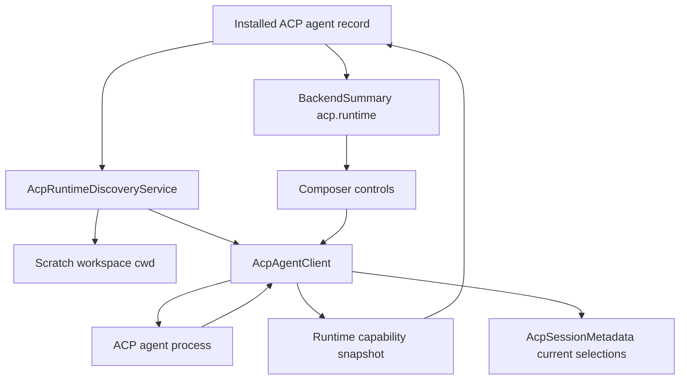

# feat: Discover and expose ACP runtime capabilities

## Overview

Add durable runtime capability discovery for installed ACP agents so PwrAgent can
show the modes, models, and session configuration controls an agent actually
advertises. Discovery should run without creating a user-visible thread by
starting a short-lived ACP session in a dedicated scratch workspace directory,
normalizing the returned `configOptions`, `modes`, `models`, and initialization
capabilities, persisting the result on the installed agent record, and exposing
it through backend summaries.

The important product correction is that ACP "access modes" are not identical
to PwrAgent's `Default Access` / `Full Access` enum. ACP agents expose arbitrary
runtime configuration. Gemini currently exposes agent-specific permission modes
through ACP session responses, and ACP now prefers `configOptions` over the
older `modes` field. PwrAgent should display and apply those ACP runtime choices
as ACP runtime options, while still preserving PwrAgent's own trust boundary
language for what it can and cannot enforce.

## Problem Frame

The ACP registry backend work made installed ACP agents visible and runnable,
but the backend summaries still describe every installed ACP agent as if it only
had PwrAgent's fixed `Default Access` and `Full Access` choices. In practice:

- Gemini advertises runtime choices after `session/new` / `session/load`, not
  through static registry metadata.
- PwrAgent currently throws away those runtime choices, so the composer cannot
  render Gemini's mode selector or model choices.
- The renderer hides the existing access-mode dropdown for ACP threads because
  `Composer.tsx` only allows existing-thread mode changes for Codex.
- `setThreadExecutionMode` intentionally no-ops for non-Codex backends, so even
  if the dropdown were shown it would not change the ACP session.
- `AcpAgentsSettings.tsx` currently starts from an empty in-memory list and then
  populates after `listAcpAgents` returns. That makes known local ACP agents
  look transient even after PwrAgent has already discovered Gemini and its
  capabilities.
- `apps/desktop/src/main/ipc/settings.ts` currently mixes installed records with
  fresh local discovery on each settings list call. The settings page needs a
  durable cached view first, with discovery and version/capability refresh as
  explicit or background updates.
- The current static `AcpAgentCapabilities` catalog only captures
  `liveWorkspaceHandoff`. It is useful for curated, agent-specific product
  assertions, but it is not the right place to store discovered session modes,
  models, or config options.

This creates a mismatch with the origin requirements: ACP capabilities must be
reflected honestly, unsupported features must disappear or be unavailable, and
PwrAgent must not imply it mediates behavior that is internal to the ACP agent
(see origin: `docs/brainstorms/2026-05-17-acp-registry-backends-requirements.md`).

## Requirements Trace

- R12-R16. Installed ACP agents must behave as first-class backends with honest
  per-backend capabilities, including hiding or disabling unsupported resume,
  close, mode switching, terminal, and filesystem behavior.
- R17-R20. PwrAgent must keep its own Default/Full Access trust boundary clear
  while honoring ACP-provided session configuration where the protocol gives the
  client control.
- R21. Settings and backend details must communicate that ACP agents may perform
  internal tool work outside PwrAgent mediation.
- R23-R24. ACP should feed the normalized backend contract without replacing it,
  and additional model access only appears when a selected ACP agent exposes
  models.
- Settings UX. The ACP settings page should read as a durable inventory of known
  ACP agents, not a live-only discovery result. Previously discovered local
  agents such as Gemini should be visible immediately from persisted data, then
  refreshed in the background or by explicit user action.
- Composer UX. The thread tray must be driven by discovered ACP runtime data for
  launchpads and existing threads. If a runtime option is fixed after thread
  creation or temporarily not editable, keep the dropdown visible with the
  selected value and disabled state rather than removing it.

## Scope Boundaries

- Do not move ACP execution into Agent Core as part of this work.
- Do not widen `ThreadExecutionMode` to arbitrary ACP strings. That enum is
  still PwrAgent's own `default` / `full-access` access posture.
- Do not create visible PwrAgent threads during discovery.
- Do not assume all ACP agents support the same runtime options as Gemini.
- Do not block launch or installed-agent availability solely because runtime
  discovery failed; stale or missing discovery should degrade the controls, not
  make an otherwise runnable backend disappear.
- Do not render an empty ACP settings page while rediscovery is running when
  durable known-agent records exist.
- Do not show PwrAgent `Default Access` / `Full Access` as Gemini runtime choices
  unless they are actually wired to an ACP runtime option that affects the
  session.
- Do not claim PwrAgent can enforce an ACP agent's internal tools unless the
  action comes through ACP client-owned filesystem, terminal, or permission
  request APIs.

## Context and Research

### Local Code

- `apps/desktop/src/main/acp/acp-agent-store.ts` persists
  `AcpInstalledAgentRecord` payloads as JSON in `acp_installed_agents`. This is
  the right durable place for agent-wide discovered runtime capability snapshots
  because it does not require a schema migration for payload evolution.
- `apps/desktop/src/main/acp/acp-session-store.ts` persists
  `AcpSessionMetadata` payloads as JSON in `acp_sessions`. This is the right
  place for per-session current runtime selections once a user-visible thread
  exists.
- `apps/desktop/src/main/acp/acp-registry-types.ts` already stores static
  install provenance and optional `capabilities?: AcpAgentCapabilities`.
- `apps/desktop/src/main/acp/acp-agent-capabilities.ts` is currently a small
  curated capability catalog. It should stay focused on static or curated
  product capability assertions such as `liveWorkspaceHandoff`.
- `apps/desktop/src/main/acp/acp-client.ts` calls `initialize`,
  `session/new`, `session/load`, `session/prompt`, and handles
  `session/update`, but currently does not normalize or report runtime
  `configOptions`, `modes`, or `models`.
- `apps/desktop/src/main/app-server/backend-registry.ts` hardcodes ACP
  backend summaries with `Default Access` / `Full Access`, static methods, and
  static capabilities. It also has the existing ACP client lifecycle and is the
  right coordinator for refresh-on-install and lazy discovery.
- `packages/shared/src/contracts/backend.ts` already has `BackendAcpSummary`,
  `BackendLaunchpadOptions`, and `BackendModelOption`. It needs an ACP-specific
  runtime capability shape rather than overloading `executionModes`.
- `apps/desktop/src/renderer/src/features/composer/Composer.tsx` already renders
  provider, model, workspace, and execution-mode dropdowns from backend
  summaries, but its execution-mode path is Codex-specific for existing
  threads.
- `apps/desktop/src/renderer/src/features/settings/AcpAgentsSettings.tsx` owns
  the current ACP settings page. It should be renamed or relabeled to "ACP
  Agents" or "ACP Models" and changed to render persisted known agents before
  kicking off discovery.
- `apps/desktop/src/renderer/src/features/settings/SettingsScreen.tsx` currently
  labels the nav item `Agents`. The user-facing label should become
  "ACP Agents" unless product decides "ACP Models" better matches the rest of
  the settings taxonomy.
- `apps/desktop/src/main/ipc/settings.ts` currently lists installed agents plus
  `discoverLocalAcpAgents()` results on demand. This should split durable reads
  from explicit/background discovery refresh so the settings page is not
  dependent on live discovery to show known Gemini data.
- `docs/solutions/2026-05-07-codex-permission-mode-state-machine.md` warns that
  access-mode UX must not lie when upstream protocol state is only legal at
  certain boundaries. ACP config options can be changed mid-session according to
  the spec, but PwrAgent should still serialize UI updates through a clear
  backend-owned path and avoid optimistic-only no-ops.
- `docs/plans/2026-04-20-001-feat-provider-thread-model-selectors-plan.md`
  established the local pattern that model/reasoning/fast controls should be
  driven by backend capability metadata, not hard-coded frontend catalogs.
- `docs/plans/2026-05-04-002-feat-messaging-capability-discovery-plan.md`
  reinforces the project pattern for capability-driven UI: producers should
  adapt to abstract capabilities instead of branching on provider identity.

### ACP Protocol Findings

- ACP initialization negotiates protocol version, client capabilities, and agent
  capabilities. Capabilities omitted in the initialize request or response are
  unsupported, so PwrAgent should persist what the agent actually returns rather
  than assuming methods exist.
- ACP sessions are created with `session/new` and a `cwd`. The `cwd` must be an
  absolute path and is the file-system context for the session.
- Agents that support `session/load` must advertise `agentCapabilities.loadSession`
  before clients call it. `session/load` replays the conversation as
  `session/update` notifications before responding.
- ACP session setup responses may include `configOptions`, `modes`, and models
  or related session state.
- ACP `Session Config Options` are the preferred runtime-configuration API.
  If an agent provides `configOptions`, clients should use them instead of
  `modes`; ACP says `modes` will be removed in a future protocol version.
- ACP config options currently use `type: "select"`, include `currentValue`, and
  can be categorized as `mode`, `model`, or `thought_level`. Clients change them
  with `session/set_config_option`, and the response returns the complete
  updated config state.
- Older ACP session modes expose `currentModeId` and `availableModes` and are
  changed with `session/set_mode`. Agents may send `current_mode_update`
  notifications.

## Key Decisions

### Runtime Discovery Snapshot, Not Static Catalog

Persist discovered runtime data separately from the curated
`AcpAgentCapabilities` catalog. The catalog should continue to answer questions
PwrAgent decides by policy, such as whether Gemini supports live workspace
handoff. Runtime discovery should answer what the agent advertised on this
machine at this time: initialization capabilities, session lifecycle methods,
config options, modes, model choices, discovery timestamp, source method, and
last discovery error.

### Discovery Uses a Hidden Scratch Session

Add a discovery path that launches the installed ACP agent, initializes it, and
creates a hidden `session/new` in a dedicated scratch workspace directory. The
session is never inserted into `acp_sessions` and never appears in navigation.
The only persisted artifact is the normalized runtime capability snapshot on
the installed agent record.

The scratch workspace should live under app/profile-local state, for example an
ACP discovery directory managed by the desktop app, and should contain a small
README-style marker file during implementation if that helps agent behavior.
The plan does not require checking in that directory.

### Prefer `configOptions`, Fall Back to `modes`

Backend summaries and renderer controls should prefer `configOptions` whenever
present. If an ACP agent only returns the older `modes` object, PwrAgent should
normalize it into the same runtime-option UI model. If both are present, the
stored snapshot may retain both for diagnostics, but the user-facing controls
should be driven by `configOptions`.

### Keep ACP Runtime Options Separate From `ThreadExecutionMode`

Do not expand `ThreadExecutionMode` beyond `default` and `full-access`.
Arbitrary ACP options like Gemini's mode values are agent runtime settings, not
PwrAgent access modes. Add an ACP runtime-options contract under
`BackendAcpSummary` or an adjacent shared type, then add a dedicated IPC path for
changing ACP session runtime options.

### Persist Agent-Wide and Session-Current State Separately

Agent-wide discovery belongs on `AcpInstalledAgentRecord` so settings, backend
lists, and launchpads can render known capabilities before a real thread exists.
Per-session current selections belong on `AcpSessionMetadata` because a user can
change options within one thread without changing sibling ACP sessions.

### Discovery Failure Is Recoverable

Discovery can fail because the agent is not logged in, the executable is broken,
the registry install is stale, or the agent creates persistent local state in a
way PwrAgent cannot fully control. Record `lastDiscoveryError`, keep stale data
with a `discoveredAt` timestamp when available, and show a refresh/retry path in
settings. Do not make already-installed runnable agents unavailable purely
because capability refresh failed.

### Settings Are Durable First, Discovery Second

The ACP settings page should load from persisted known-agent records first. If
PwrAgent already discovered local Gemini, the page should immediately show
Gemini, its last known version, and its last known capabilities. Page load may
start a background refresh that checks the current executable version and
capability snapshot, but that refresh should update an already-populated list
instead of being the source of truth for whether the row exists.

The primary action should be named around discovery, such as "Discover new" or
"Refresh discovery", rather than a generic registry refresh. Registry fetch,
local executable discovery, version check, and capability refresh are related
but distinct states and should be represented separately enough for users to
understand whether they are installing a new agent or refreshing a known one.

### Composer Tray Mirrors ACP Runtime State

The composer tray should render ACP controls from discovered runtime data before
and after thread creation. For Gemini, the launchpad should not show
`Default Access` / `Full Access` as choices unless those values are connected to
actual ACP config options. Once a thread exists, the same selected runtime
option should remain visible. If the option cannot be changed after creation,
the control should be disabled with the current value; it should not disappear.

Permission dialogs remain separate from runtime mode selection. If Gemini still
asks for permission to run `npm view openclaw`, that should be because the
selected ACP runtime mode requires approval, not because PwrAgent showed a mode
selector that was never applied.

## Open Questions

### Resolved During Planning

- **Should this go through Agent Core?** Not for this feature. ACP already gives
  PwrAgent a client adapter boundary, and the origin requirements explicitly say
  ACP should feed the normalized PwrAgent backend contract rather than making
  Agent Core own external ACP behavior.
- **Should the runtime modes use `ThreadExecutionMode`?** No. ACP runtime
  choices are arbitrary and agent-specific; `ThreadExecutionMode` remains
  PwrAgent's own access posture.
- **Where should discovered capabilities persist?** In the installed ACP agent
  JSON payload, with per-session current selections in `AcpSessionMetadata`.
- **Should discovery create a user-visible thread?** No. It should use a hidden
  scratch session and persist only capability metadata.

### Deferred to Implementation

- Exact scratch workspace path and cleanup policy. It should be under
  profile-local app state, not a user's real project.
- Whether discovery should run immediately after install, lazily on backend list,
  or both. The recommended implementation is after install plus lazy stale-data
  refresh, but the exact debounce window can be tuned during implementation.
- How to classify dangerous ACP runtime option values for warning dialogs. Start
  with conservative label/id/description matching for values like `yolo` or
  "auto-accept all actions", then keep the classifier local and auditable.
- Whether ACP model config options should also populate
  `BackendLaunchpadOptions.models` or remain only in the ACP runtime-options
  surface. If a `category: "model"` config option is present, exposing it as the
  normal model dropdown is user-friendly, but the implementation must keep the
  underlying `session/set_config_option` mapping intact.

## High-Level Design



The snapshot shape should be intentionally protocol-shaped but UI-safe. A
directional shape:

```ts
type AcpRuntimeCapabilitiesSnapshot = {
  schemaVersion: 1;
  discoveredAt: number;
  source: "initialize" | "session-new" | "session-load";
  protocolVersion?: number;
  agentInfo?: { name?: string; title?: string; version?: string };
  agentCapabilities?: {
    loadSession?: boolean;
    session?: { resume?: boolean; close?: boolean };
    prompt?: { image?: boolean; audio?: boolean; embeddedContext?: boolean };
    mcp?: { http?: boolean; sse?: boolean };
  };
  configOptions?: AcpRuntimeConfigOption[];
  modes?: AcpRuntimeModeState;
  models?: AcpRuntimeModelState;
  lastError?: string;
};
```

This is not implementation code; it captures the intended separation of
discovered protocol facts from PwrAgent's curated policy facts.

## Implementation Units

### Unit 1: Define ACP Runtime Capability Contracts

**Goal:** Add shared and main-process types for discovered ACP runtime
capabilities without changing `ThreadExecutionMode`.

**Requirements:** R16-R20, R23-R24

**Dependencies:** None

**Files:**

- Modify: `packages/shared/src/contracts/backend.ts`
- Modify: `packages/shared/src/contracts/agent.ts`
- Modify: `apps/desktop/src/main/acp/acp-registry-types.ts`
- Modify: `apps/desktop/src/main/acp/acp-session-store.ts`
- Test: `apps/desktop/src/main/__tests__/acp-agent-store.test.ts`
- Test: `apps/desktop/src/main/__tests__/acp-session-store.test.ts`

**Approach:**

- Add shared ACP runtime types under the backend contract, including config
  option, mode, model, discovery status, and last-error metadata.
- Add `runtimeCapabilities?: AcpRuntimeCapabilitiesSnapshot` to
  `AcpInstalledAgentRecord`.
- Add per-session current runtime state to `AcpSessionMetadata`, keyed by ACP
  config option id and/or mode id.
- Keep old payloads valid by making new fields optional and validating only the
  existing required metadata fields.

**Test Scenarios:**

- Happy path: an installed ACP record with runtime capabilities round-trips
  through `AcpAgentStore`.
- Compatibility: an older installed ACP payload without runtime capabilities
  still parses and lists.
- Happy path: an ACP session with current runtime selections round-trips through
  `AcpSessionStore`.
- Compatibility: an older ACP session payload without current runtime selections
  still parses.

### Unit 2: Normalize Runtime Capabilities in the ACP Client

**Goal:** Teach `AcpAgentClient` to capture initialization and session setup
runtime data, and to apply runtime option changes through ACP methods.

**Requirements:** R13-R20

**Dependencies:** Unit 1

**Files:**

- Modify: `apps/desktop/src/main/acp/acp-client.ts`
- Modify: `apps/desktop/src/main/acp/acp-session-normalizer.ts`
- Modify: `apps/desktop/src/main/acp/testing/fake-acp-agent.ts`
- Test: `apps/desktop/src/main/__tests__/acp-client.test.ts`
- Test: `apps/desktop/src/main/__tests__/acp-session-normalizer.test.ts`

**Approach:**

- Capture `initialize` response data, including protocol version,
  `agentCapabilities`, `agentInfo`, and auth method metadata where available.
- Normalize `configOptions`, `modes`, and any model state from `session/new`,
  `session/load`, and `session/resume` responses.
- Add callbacks such as `onRuntimeCapabilities` and
  `onSessionRuntimeStateChange` so the backend registry can persist agent-wide
  and per-session state.
- Add methods for `session/set_config_option` and `session/set_mode`.
- Handle `config_option_update` and `current_mode_update` notifications without
  rendering them as unknown transcript entries.
- Preserve raw-ish fields enough for protocol debugging, but normalize the
  renderer-facing labels and current values into a stable shape.

**Test Scenarios:**

- Happy path: `session/new` with `configOptions` produces a runtime snapshot.
- Happy path: `session/new` with only `modes` produces a fallback runtime
  snapshot.
- Precedence: when both `configOptions` and `modes` are present, user-facing
  runtime controls prefer `configOptions`.
- Happy path: `session/set_config_option` sends `sessionId`, `configId`, and
  `value`, then persists the complete returned config state.
- Happy path: `session/set_mode` sends `sessionId` and `modeId` when only legacy
  modes are available.
- Notification path: `config_option_update` and `current_mode_update` update
  session runtime state without adding unknown transcript entries.
- Error path: malformed runtime capability payloads are ignored with a logged
  discovery error rather than breaking session creation.

### Unit 3: Add Hidden ACP Runtime Discovery

**Goal:** Discover installed ACP agent runtime capabilities without creating a
visible PwrAgent thread.

**Requirements:** R4, R9-R16, R21

**Dependencies:** Units 1-2

**Files:**

- Add: `apps/desktop/src/main/acp/acp-runtime-discovery.ts`
- Modify: `apps/desktop/src/main/app-server/backend-registry.ts`
- Modify: `apps/desktop/src/main/ipc/settings.ts`
- Test: `apps/desktop/src/main/__tests__/backend-registry.test.ts`
- Test: `apps/desktop/src/main/__tests__/settings-ipc.test.ts`

**Approach:**

- Create a discovery service that receives an installed agent record, launches
  the ACP transport, calls `initialize`, then calls `session/new` with a
  dedicated scratch `cwd`.
- Do not call `AcpSessionStore.upsertSession` for discovery sessions.
- Close the session with `session/close` when the agent advertises support;
  otherwise close the transport after snapshot capture.
- Persist the snapshot and `discoveredAt` on `AcpInstalledAgentRecord`.
- Persist `lastDiscoveryError` separately from install/runtime `lastError` so a
  failed capability refresh does not imply the agent cannot launch.
- Persist local discovery results even when the agent does not come from the
  registry. A locally discovered Gemini executable should become a known ACP
  agent record with version, command path, last-seen timestamp, and runtime
  capabilities instead of existing only in a one-off settings response.
- Trigger discovery after successful install and expose a manual refresh path
  from settings. Optionally refresh stale snapshots lazily when listing
  backends.
- Split durable settings reads from discovery refresh. The default settings page
  load should return persisted installed and known-local records immediately;
  explicit "Discover new" or background refresh may update that cache afterward.
- On refresh, check the local executable version and only re-run expensive
  capability discovery when the executable version, launch descriptor, ACP
  protocol version, or snapshot age says the cached data may be stale.
- Rate-limit discovery per agent so navigation snapshots do not repeatedly
  spawn third-party processes.

**Test Scenarios:**

- Happy path: installing an ACP agent triggers discovery and persists config
  options on the installed agent record.
- Hidden-session invariant: discovery does not create an `acp_sessions` row and
  does not appear in thread lists.
- Scratch-cwd invariant: `session/new` receives an absolute scratch path, not a
  user project directory.
- Cleanup path: discovery calls `session/close` when advertised and always
  closes the transport.
- Error path: discovery failure records `lastDiscoveryError` but the installed
  backend remains listed.
- Staleness path: a stale snapshot can be refreshed manually without duplicating
  installed agent rows.
- Durable local path: a locally discovered Gemini agent is visible from the
  persisted known-agent cache on the next settings page load without waiting for
  `discoverLocalAcpAgents()` to run.
- Version path: when Gemini's version changes, refresh updates the version and
  rechecks runtime capabilities; when the version is unchanged, the cached
  capability snapshot is reused unless it is stale.

### Unit 4: Expose Runtime Capabilities Through Backend Summaries

**Goal:** Let renderer and settings surfaces see discovered ACP runtime options
and models through the normalized backend contract.

**Requirements:** R12-R16, R23-R24

**Dependencies:** Units 1-3

**Files:**

- Modify: `packages/shared/src/contracts/backend.ts`
- Modify: `apps/desktop/src/main/app-server/backend-registry.ts`
- Modify: `apps/desktop/src/renderer/src/lib/useBackendSummaries.ts`
- Test: `apps/desktop/src/main/__tests__/backend-registry.test.ts`
- Test: `apps/desktop/src/renderer/src/lib/__tests__/useBackendSummaries.test.tsx`

**Approach:**

- Add an ACP runtime capabilities field to backend summaries, likely under
  `backend.acp.runtime`.
- Populate `backend.launchpadOptions.models` from an ACP `configOptions`
  `category: "model"` option when it can be safely mapped. Preserve the source
  config option id so changing the dropdown can call `session/set_config_option`
  instead of pretending ACP has a Codex model field.
- Populate ACP runtime option groups from config options in agent-provided
  order. Unknown option categories should still be displayable if the type is
  supported.
- Set capability booleans from initialize and discovery facts where possible.
  For example, do not advertise `resumeThread` via `session/load` unless
  `agentCapabilities.loadSession` is true or the implementation has a local
  fallback with clearly labeled limitations.
- Continue exposing curated static capabilities such as
  `liveWorkspaceHandoff` separately from discovered runtime options.

**Test Scenarios:**

- Happy path: backend summary includes ACP runtime config options in the order
  returned by discovery.
- Happy path: a `category: "model"` config option appears as normal model
  choices without losing the ACP config-option mapping.
- Fallback path: legacy `modes` appear as ACP runtime mode choices when
  `configOptions` are absent.
- Compatibility path: an ACP backend with no discovered snapshot still lists and
  simply omits ACP runtime controls.
- Capability honesty: unsupported session methods are not advertised as
  available solely because PwrAgent has a fallback.

### Unit 5: Wire ACP Runtime Option Changes

**Goal:** Add an explicit app-server and IPC path for applying ACP runtime
option changes on existing ACP sessions and launchpad defaults.

**Requirements:** R17-R20

**Dependencies:** Units 1-4

**Files:**

- Modify: `packages/shared/src/contracts/agent.ts`
- Modify: `apps/desktop/src/main/ipc/agent-ipc.ts`
- Modify: `apps/desktop/src/preload/index.ts`
- Modify: `apps/desktop/src/renderer/src/lib/desktop-api.ts`
- Modify: `apps/desktop/src/main/app-server/backend-registry.ts`
- Modify: `apps/desktop/src/main/acp/acp-client.ts`
- Test: `apps/desktop/src/main/__tests__/backend-registry.test.ts`
- Test: `apps/desktop/src/renderer/src/lib/__tests__/useThreadNavigation.test.tsx`

**Approach:**

- Add a dedicated request such as `setAcpSessionRuntimeOption` or a generic
  backend runtime-option request. It should include backend id, thread id,
  option source (`configOption` or `mode`), option id, value, and expected
  current snapshot version if useful.
- For existing ACP threads, ensure the ACP session is loaded, call
  `session/set_config_option` or `session/set_mode`, persist the returned
  current state in `AcpSessionMetadata`, and emit a thread update so open
  renderer surfaces refresh.
- For launchpad/new-thread drafts, persist the selected option in launchpad state
  and apply it immediately after `session/new` before the first prompt.
- Do not route ACP runtime option changes through `setThreadExecutionMode`
  unless a later implementation deliberately adds a compatibility wrapper. The
  primary API should not be named as if it only handles PwrAgent access modes.
- If an ACP agent rejects an option change mid-turn despite the spec allowing it,
  surface the error and leave the previous current value visible. Do not
  optimistic-only no-op.

**Test Scenarios:**

- Happy path: changing an ACP config option on an idle thread sends
  `session/set_config_option`, updates session metadata, and emits a thread
  update.
- Happy path: changing a legacy ACP mode sends `session/set_mode` when no config
  option equivalent exists.
- Launchpad path: selecting an ACP runtime option before first send applies it
  after `session/new` and before `session/prompt`.
- Error path: a rejected option change reports a user-visible error and keeps
  the previous current value.
- Race path: a runtime option update notification from the agent updates the
  current value even if the user did not initiate the change.

### Unit 6: Render ACP Runtime Controls and Capability State

**Goal:** Show discovered ACP runtime modes/models/config options in the
composer and backend/settings surfaces.

**Requirements:** R12-R21, R24

**Dependencies:** Units 4-5

**Files:**

- Modify: `apps/desktop/src/renderer/src/features/composer/Composer.tsx`
- Modify: `apps/desktop/src/renderer/src/features/thread-detail/ThreadHeader.tsx`
- Modify: `apps/desktop/src/renderer/src/features/thread-detail/ThreadContextPanel.tsx`
- Modify: `apps/desktop/src/renderer/src/features/settings/SettingsScreen.tsx`
- Modify: `apps/desktop/src/renderer/src/features/settings/AcpAgentsSettings.tsx`
- Add or modify: `apps/desktop/src/renderer/src/lib/acp-runtime-options.ts`
- Test: `apps/desktop/src/renderer/src/features/composer/__tests__/composer.test.tsx`
- Test: `apps/desktop/src/renderer/src/features/thread-detail/__tests__/thread-view.test.tsx`
- Test: `apps/desktop/src/renderer/src/features/thread-detail/__tests__/ThreadContextPanel.test.tsx`
- Test: `apps/desktop/src/renderer/src/features/settings/__tests__/settings-screen.test.tsx`

**Approach:**

- Render ACP runtime mode/config dropdowns for ACP backends when runtime options
  are available.
- Keep the existing PwrAgent access-mode dropdown for Codex-specific
  `ThreadExecutionMode` behavior.
- Do not show `Default Access` / `Full Access` for ACP launchpads unless those
  choices are explicitly mapped to real ACP runtime values. For Gemini, the
  visible control should be driven by discovered ACP config options or modes.
- Keep ACP runtime dropdowns visible after thread creation. If a value is not
  editable after creation or during an active turn, render the selected value in
  a disabled dropdown rather than removing the control from the tray.
- For ACP `category: "model"` config options, either render through the existing
  model dropdown or through the ACP runtime option group, but avoid showing the
  same option twice.
- Add a warning dialog for risky ACP runtime option values using a conservative
  classifier. The copy should distinguish "this ACP agent says this option
  auto-approves actions" from "PwrAgent can enforce full filesystem access."
- Rename or relabel the settings nav/page from generic "Agents" to "ACP Agents"
  unless product settles on "ACP Models". The page should read as the durable
  inventory of known ACP agents, not an empty discovery result.
- Show discovery status in settings: discovered, stale, failed, never
  discovered, last error, version, last checked timestamp, and refresh/discover
  actions.
- Render persisted known ACP agents immediately on settings page load, then
  update rows if background rediscovery returns fresher data.
- Show whether the current agent advertised load/resume/close/config options,
  and whether PwrAgent has disabled live workspace handoff by policy.

**Test Scenarios:**

- Happy path: Gemini-like config options render a mode dropdown in the ACP
  composer on a new launchpad.
- Happy path: creating a Gemini thread preserves the selected ACP runtime option
  and the created-thread tray shows the same selected value.
- Happy path: an ACP thread shows the current ACP runtime mode label in the
  header or context panel.
- Happy path: changing an ACP runtime option calls the new runtime-option API,
  not `setThreadExecutionMode`.
- Immutable path: if an ACP runtime option is not editable after thread
  creation, the dropdown remains visible but disabled with the selected value.
- Regression path: ACP launchpads do not show disconnected `Default Access` /
  `Full Access` choices for Gemini.
- Fallback path: legacy ACP modes render when config options are absent.
- Risk path: selecting a dangerous option such as `yolo` opens the warning
  dialog before applying.
- Settings path: installed agent settings show discovery timestamp, advertised
  options, and a refresh action.
- Settings path: the ACP settings nav/page label is `ACP Agents` and persisted
  Gemini data appears before any on-load rediscovery completes.
- Missing-data path: ACP backends without discovery data do not render broken or
  empty dropdowns.

### Unit 7: Add Regression Fixtures and Protocol Capture Coverage

**Goal:** Lock the Gemini behavior we observed so future ACP protocol changes do
not regress discovery, transcript ordering, or runtime option rendering.

**Requirements:** R13-R20

**Dependencies:** Units 2-6

**Files:**

- Modify: `apps/desktop/src/main/__tests__/acp-client.test.ts`
- Modify: `apps/desktop/src/main/__tests__/backend-registry.test.ts`
- Modify: `apps/desktop/src/renderer/src/features/composer/__tests__/composer.test.tsx`
- Optional fixture: `apps/desktop/src/main/acp/testing/fixtures/gemini-config-options.json`
- Optional E2E fixture: `apps/desktop/e2e/fixtures/acp-gemini-runtime-options.json`

**Approach:**

- Convert a small, redacted protocol capture into deterministic test fixture
  data that includes `configOptions`, permission requests, tool calls, and model
  or mode changes.
- Keep fixtures small and focused. Do not check in full `.local` protocol
  captures.
- Add tests proving load replay notifications do not reorder persisted user
  prompts while runtime-option notifications still update session state.

**Test Scenarios:**

- Gemini-like discovery fixture produces a backend summary with runtime mode and
  model options.
- Gemini-like permission-mode fixture produces one visible runtime option
  dropdown and no unknown transcript entries for `config_option_update` or
  `current_mode_update`.
- Replayed `session/load` history does not duplicate or reorder persisted
  PwrAgent prompts.

## System-Wide Impact

- **Desktop main:** Adds an ACP discovery service and expands ACP client
  normalization. Backend summaries become more accurate and less hard-coded.
- **Shared contracts:** Adds ACP runtime capability metadata and a runtime
  option mutation request. Keeps existing `ThreadExecutionMode` stable.
- **Renderer:** Adds ACP runtime controls alongside existing model/workspace
  controls. Existing Codex access-mode behavior should remain unchanged.
- **Settings:** Installed ACP agents gain a capability/debug section showing
  what was discovered and when.
- **Persistence:** Uses existing JSON payload persistence in ACP agent/session
  stores. No SQL migration is required unless implementation chooses to index
  discovery status later.
- **Messaging:** No direct implementation required in this plan, but future
  messaging surfaces should consume the same backend runtime capability summary
  rather than inventing ACP-specific buttons.

## Risks and Mitigations

| Risk | Mitigation |
|---|---|
| Hidden discovery sessions create external agent state | Use a scratch cwd, do not persist an `acp_sessions` row, close sessions when supported, and rate-limit refreshes. |
| ACP config options supersede modes | Prefer `configOptions`, keep `modes` only as fallback and diagnostics. |
| Arbitrary ACP modes contaminate PwrAgent's access-mode enum | Add ACP runtime-option contracts instead of widening `ThreadExecutionMode`. |
| Discovery fails when the agent is unauthenticated | Persist `lastDiscoveryError`, keep stale data if available, and expose retry/auth status in settings. |
| Renderer shows unsafe controls as if PwrAgent enforces them | Label ACP runtime options as agent-provided and keep PwrAgent trust-boundary copy separate. |
| Agent rejects mid-turn option updates | Surface the error, keep previous current value, and add tests; if needed, later introduce queueing for specific agents. |
| Discovery repeatedly launches third-party executables | Trigger on install/manual refresh and throttle stale lazy refreshes. |

## Rollout and Verification

- Implement behind the existing ACP backend feature surface; no separate global
  feature flag is required unless implementation finds discovery too noisy.
- Start with Gemini as the known real-world validation target, but tests should
  use fake ACP agents and compact fixtures so they do not depend on Gemini being
  installed or logged in.
- Verify manually with an installed Gemini CLI ACP backend:
  - Settings shows discovered modes/models/config options.
  - New-thread composer shows the Gemini runtime mode selector.
  - Existing Gemini threads show the current mode and can change it through ACP.
  - Selecting a risky mode produces the warning dialog.
  - Refreshing capabilities does not add a visible thread.
  - Codex/Grok composer behavior is unchanged.

## Sources and References

- Origin requirements:
  `docs/brainstorms/2026-05-17-acp-registry-backends-requirements.md`
- Existing ACP registry plan:
  `docs/plans/2026-05-17-001-feat-acp-registry-backends-plan.md`
- Codex access-mode learning:
  `docs/solutions/2026-05-07-codex-permission-mode-state-machine.md`
- Provider/model capability pattern:
  `docs/plans/2026-04-20-001-feat-provider-thread-model-selectors-plan.md`
- Messaging capability-driven rendering pattern:
  `docs/plans/2026-05-04-002-feat-messaging-capability-discovery-plan.md`
- ACP Initialization:
  https://agentclientprotocol.com/protocol/initialization
- ACP Session Setup:
  https://agentclientprotocol.com/protocol/session-setup
- ACP Session Config Options:
  https://agentclientprotocol.com/protocol/session-config-options
- ACP Session Modes:
  https://agentclientprotocol.com/protocol/session-modes

## Document Review Notes

- Checked file references for repo-relative paths.
- Checked the plan against the origin requirements, especially R16-R20, to keep
  capability honesty and trust-boundary language explicit.
- Checked for the main architectural trap: conflating ACP runtime modes with
  PwrAgent's own `ThreadExecutionMode`.
