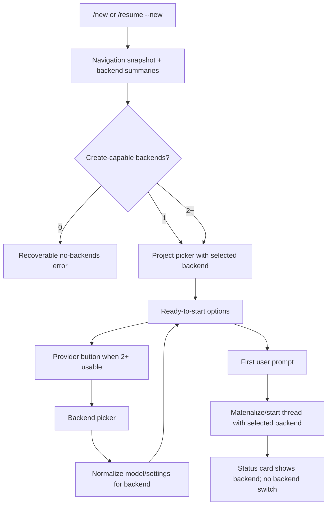

# feat(messaging): Add backend selection to new-thread flow

## Overview

Add backend/provider selection to the messaging `/new` flow before a thread is
created. Messaging should seed the pending thread from the desktop launchpad's
sticky backend/model defaults, allow backend changes when multiple create-capable
backends are available, recompute model/settings options from the selected
backend, and create the thread against that selected backend.

The implementation should extend the existing resume/new-thread browse-session
flow instead of creating provider-specific messaging branches. `/new`, the New
help action, and `/resume --new` remain aliases for the same flow.

## Problem Frame

Issue #194 originally described `/resume --new`, but the product has moved on:
`/new` now exists and routes to the new-thread project picker. The current
messaging flow already has a ready-to-start options surface with Model,
Reasoning, Fast, Streaming, Permissions, and workspace controls, but it still
uses `navigation.launchpadDefaults.backend` when opening model/reasoning pickers
and when materializing or starting the thread.

As Codex, Grok, and upcoming ACP/Gemini backends coexist, invisible backend
selection is no longer acceptable. Messaging should mirror the desktop launchpad
model from the origin document: backend is editable only before the first prompt,
then becomes immutable thread identity shown on the status card.

## Requirements Trace

- R1. `/new`, New button, and `/resume --new` use the same backend-selection behavior.
- R2-R5. Zero/one/multiple usable backend cases are handled from current backend summaries, seeded from launchpad defaults.
- R6, R12-R14. Pending backend changes affect only the browse session and the created thread; existing thread backend switching remains unavailable.
- R7-R10. Model/reasoning/fast and related buttons reflect the selected backend's advertised capabilities.
- R11. The design avoids introducing new hard-coded assumptions that would block ACP/Gemini from joining as another backend kind later.
- R15. Existing status cards continue to identify the owning backend/provider after thread creation.
- R16-R18. Pending new-thread choices read and update launchpad sticky defaults where the desktop launchpad would do the same.
- R19-R22. The flow remains channel-neutral, capability-profile-aware, and scoped to authorized browse sessions.

## Scope Boundaries

- Do not switch an existing thread between Codex, Grok, Gemini, or any future backend.
- Do not define ACP/Gemini protocol shape in this pass.
- Do not redesign the desktop launchpad UI.
- Do not add Telegram/Discord/Slack/Mattermost/LINE/Feishu workflow branches.
- Do not replace the existing `/new` project picker; add backend selection to the existing new-thread flow.

## Context & Research

### Relevant Code and Patterns

- `apps/desktop/src/main/messaging/core/messaging-controller.ts` owns `/new`, `/resume --new`, browse callbacks, the ready-to-start options surface, model/reasoning pickers, and thread creation.
- `apps/desktop/src/main/messaging/core/messaging-resume-browser.ts` parses `--new`, renders project/thread pickers, and validates thread/project selections.
- `packages/messaging/interface/src/index.ts` defines `MessagingBrowseSessionRecord` and `MessagingBindingPreferences`.
- `apps/desktop/src/main/messaging/core/messaging-migrations.ts` and `apps/desktop/src/main/messaging/core/messaging-store.ts` sanitize and retain persisted browse sessions.
- `apps/desktop/src/main/messaging/core/messaging-adapter.ts` already exposes optional backend bridge methods including `listBackends`; it does not yet expose `updateDirectoryLaunchpad`.
- `apps/desktop/src/main/messaging/desktop-backend-bridge.ts` forwards bridge methods to `DesktopBackendRegistry`.
- `apps/desktop/src/main/app-server/backend-registry.ts` has `resolveLaunchpadBackend`, `updateDirectoryLaunchpad`, `materializeDirectoryLaunchpad`, and sticky launchpad default updates via `stickySettingsChanged`.
- `packages/shared/src/contracts/backend.ts` defines `BackendSummary`, `BackendLaunchpadOptions`, and per-model capability flags.
- `packages/shared/src/contracts/navigation.ts` defines `NavigationLaunchpadDefaults` and `NavigationLaunchpadDraft`.
- `docs/messaging-architecture.md` documents that command surfaces, pickers, status cards, and capability profiles must stay channel-neutral.
- `docs/plans/2026-05-12-001-feat-messaging-mention-help-new-plan.md` established `/new` as a first-class shortcut backed by the existing new-thread browser.
- `docs/plans/2026-05-04-002-feat-messaging-capability-discovery-plan.md` established producer-side capability adaptation rather than provider-specific workflow branching.

### Institutional Learnings

- `docs/solutions/2026-05-07-codex-permission-mode-state-machine.md` is relevant by analogy: avoid silent fallbacks across backend/permission routing boundaries, and make state transitions explicit. For this plan, that means thread creation must log/use the selected backend rather than silently falling back to launchpad defaults.

### External References

- Not used. Existing repository patterns and issue context are sufficient.

## Key Technical Decisions

- Store pending backend on `MessagingBrowseSessionRecord`, not `MessagingBindingPreferences`: backend is immutable thread identity after creation, while binding preferences are mutable per-thread settings.
- Add a shared create-capable backend selection helper: renderer and messaging already use the same predicate informally (`available && capabilities.createThread` plus available execution modes). A small shared helper keeps zero/one/many behavior consistent.
- Put backend selection on the ready-to-start options surface: the old issue proposed a mandatory chooser before project selection, but the origin document updates the product direction to match desktop launchpad controls.
- Normalize settings whenever backend changes: incompatible pending model/reasoning/fast values should be dropped or replaced with that backend's valid defaults before display or thread creation.
- Reuse `updateDirectoryLaunchpad` for sticky defaults: it is the existing path that updates directory launchpads and global launchpad defaults when `stickySettingsChanged` is true. Messaging should reach it through `MessagingBackendBridge` rather than writing defaults directly.
- Keep text fallback simple for this pass: button-capable providers get the normal picker; constrained/text fallback should expose numbered backend choices and stable fallback words without adding provider branches.

## Open Questions

### Resolved During Planning

- Where does pending backend live? On `MessagingBrowseSessionRecord`, because it is creation-time state and not a post-creation binding preference.
- Which surface owns backend selection? The new-thread ready/options surface, with a backend picker action when multiple create-capable backends exist.
- How should sticky defaults be updated? Through an optional `updateDirectoryLaunchpad` bridge method with `stickySettingsChanged: true`, matching the desktop launchpad path.
- Should `/new` get a separate flow? No. `/new`, New help action, and `/resume --new` all continue through the existing resume browser new-thread mode.

### Deferred to Implementation

- Exact helper names and module placement for backend selection may adjust after implementation touches shared exports.
- The final ACP/Gemini backend kind is deferred to the ACP work, but implementation should avoid adding new `codex | grok` validation in the new backend-selection path.
- Exact text fallback parsing for backend picker replies should follow the existing pending-intent and fallback mapper behavior once implementation reaches that code.

## High-Level Technical Design

> *This illustrates the intended approach and is directional guidance for review, not implementation specification. The implementing agent should treat it as context, not code to reproduce.*

## Implementation Units

- [x] **Unit 1: Add create-capable backend selection state and helpers**

**Goal:** Represent the pending new-thread backend explicitly and provide one predicate/resolver for usable backend selection.

**Requirements:** R2-R6, R11, R16, R19

**Dependencies:** None.

**Files:**
- Create: `packages/shared/src/backend-selection.ts`
- Modify: `packages/shared/src/index.ts`
- Modify: `packages/messaging/interface/src/index.ts`
- Modify: `apps/desktop/src/main/messaging/core/messaging-migrations.ts`
- Test: `packages/shared/src/__tests__/backend-selection.test.ts`
- Test: `packages/messaging/interface/src/__tests__/messaging-contract.test.ts`

**Approach:**
- Add a shared helper that returns backends usable for new thread creation. It should require `available`, `capabilities.createThread`, and at least one available execution mode.
- Add a resolver that chooses the requested/default backend when usable, otherwise falls back to a create-capable backend using the same Codex-preferred behavior as the launchpad registry where applicable.
- Extend `MessagingBrowseSessionRecord` with optional `backend?: AppServerBackendKind`.
- Keep the migration/sanitization path backward-compatible: old browse sessions without `backend` remain valid and resolve from defaults when loaded.
- Avoid broad ACP type changes here. If `AppServerBackendKind` is still `codex | grok`, keep the helper generic over the current contract and avoid adding new regex-style hard-coding elsewhere.

**Patterns to follow:**
- `apps/desktop/src/main/app-server/backend-registry.ts` `resolveLaunchpadBackend`
- `apps/desktop/src/renderer/src/features/composer/Composer.tsx` provider filtering
- `packages/messaging/interface/src/__tests__/messaging-contract.test.ts`

**Test scenarios:**
- Happy path: helper returns only available create-capable backends with at least one available execution mode.
- Happy path: resolver picks the sticky launchpad default when it is usable.
- Edge case: resolver falls back to another usable backend when the sticky default is unavailable.
- Edge case: helper returns an empty list when all backends are unavailable or lack `createThread`.
- Integration: a serialized browse session without `backend` still passes contract/migration validation.

**Verification:**
- Messaging has an explicit place to store pending backend selection without breaking existing persisted sessions.

- [x] **Unit 2: Add backend preflight and picker to the new-thread messaging flow**

**Goal:** Make `/new`, New button, and `/resume --new` handle zero/one/multiple backend cases and expose backend switching before the first prompt.

**Requirements:** R1-R6, R19-R22

**Dependencies:** Unit 1.

**Files:**
- Modify: `apps/desktop/src/main/messaging/core/messaging-controller.ts`
- Modify: `apps/desktop/src/main/messaging/core/messaging-resume-browser.ts`
- Test: `apps/desktop/src/main/__tests__/messaging-controller.test.ts`
- Test: `apps/desktop/src/main/__tests__/messaging-resume-browser.test.ts`

**Approach:**
- In the new-thread entry path, call `listBackends({ includeUnavailable: true })` and resolve the selected backend before rendering the project picker.
- If no create-capable backend exists, deliver a recoverable error and do not create a browse session or project picker.
- If exactly one create-capable backend exists, store it in the browse session and keep the ready surface free of backend chooser UI.
- If multiple create-capable backends exist, store the resolved sticky default and show a `Provider` action on the ready-to-start options surface.
- Add `browse:new:backend` and `browse:new:set-backend` actions that render a single-select backend picker and return to the ready surface after selection.
- Ensure the picker uses backend labels from `BackendSummary.label`, with any user-facing label mapping handled centrally rather than in provider adapters.
- Preserve the current New/Resume back navigation behavior from nested pickers.
- Treat backend discovery failures like other recoverable browse errors: report that backend choices are unavailable right now rather than falling through to stale launchpad defaults.

**Patterns to follow:**
- `presentNewThreadModelPicker` and `presentNewThreadReasoningPicker` in `apps/desktop/src/main/messaging/core/messaging-controller.ts`
- `buildProjectPickerIntent` navigation actions in `apps/desktop/src/main/messaging/core/messaging-resume-browser.ts`
- capability-profile action budgeting from `docs/plans/2026-05-04-002-feat-messaging-capability-discovery-plan.md`

**Test scenarios:**
- Happy path: `/new` with one create-capable backend opens the project picker and later ready surface without a Provider button.
- Happy path: `/new` with Codex and Grok create-capable backends opens the project picker seeded to the sticky default and ready surface includes `browse:new:backend`.
- Happy path: selecting `browse:new:set-backend` updates the browse session and re-renders ready-to-start with the new provider label.
- Edge case: zero create-capable backends returns a recoverable "No backends available" error and does not render a project picker.
- Error path: `listBackends` failure returns a recoverable backend-discovery error and does not create a project picker with implicit defaults.
- Error path: stale or malformed backend picker callback returns the existing invalid browse selection error.
- Integration: clicking the New help action and `/resume --new` exercise the same backend preflight behavior as `/new`.

**Verification:**
- Users can see and change provider/backend before sending the first prompt when more than one backend can create threads.

- [x] **Unit 3: Normalize backend-specific options and create threads with the selected backend**

**Goal:** Ensure model/reasoning/fast controls and thread creation use the pending backend rather than `navigation.launchpadDefaults.backend`.

**Requirements:** R7-R14, R16, R19-R21

**Dependencies:** Units 1 and 2.

**Files:**
- Modify: `apps/desktop/src/main/messaging/core/messaging-controller.ts`
- Test: `apps/desktop/src/main/__tests__/messaging-controller.test.ts`

**Approach:**
- Add a small controller-local resolver for "effective new-thread backend" that reads `session.backend`, then launchpad defaults, then the shared fallback resolver.
- Update model and reasoning picker calls to use the effective selected backend.
- Build the ready-to-start options from the selected backend's `BackendSummary.launchpadOptions`.
- Hide or omit buttons that the selected backend does not support: for example, hide Fast when neither backend-level nor model-level fast support is advertised; hide Reasoning when no reasoning efforts are available and no selected model supports reasoning.
- When backend changes, normalize pending preferences:
  - model becomes the selected backend's current/default/first model when the previous model is not valid.
  - reasoning effort becomes the selected backend's default or first available effort when unsupported.
  - fast mode is cleared or false when unsupported.
  - service tier is cleared or defaulted when unsupported.
- Pass the selected backend to `materializeDirectoryLaunchpad` launchpad drafts and to the direct `startThread` fallback.
- Update optimistic navigation/status-card creation so the resulting binding and status card reflect the selected backend.
- Revalidate the selected backend immediately before materialize/start. If it is no longer create-capable, show a recoverable error instead of silently switching to another backend.

**Patterns to follow:**
- `newThreadOptionsForSession`, `launchpadForMessagingProject`, and `navigationWithStartedThread` in `apps/desktop/src/main/messaging/core/messaging-controller.ts`
- `buildBindingStatusIntent` in `apps/desktop/src/main/messaging/core/messaging-status-card.ts`
- backend model handling in `apps/desktop/src/renderer/src/features/composer/Composer.tsx`

**Test scenarios:**
- Happy path: selecting Grok then sending the first prompt materializes/starts a Grok thread and starts the turn with `backend: "grok"`.
- Happy path: selecting Codex then choosing a Codex model sends that model to the materialized launchpad and subsequent turn.
- Edge case: changing from Codex to Grok drops a Codex-only model and renders a Grok-valid model choice.
- Edge case: a backend with no model choices hides the Model button and still allows thread creation if `createThread` is available.
- Edge case: a backend without fast support hides Fast or clears the pending fast value before creation.
- Error path: a backend that was selectable earlier but becomes unavailable before the first prompt fails recoverably and does not create a thread on a different backend.
- Integration: the final status card text includes the selected backend identity and no Provider action is available after binding.

**Verification:**
- No new-thread creation path uses `navigation.launchpadDefaults.backend` after a session backend has been selected.

- [x] **Unit 4: Preserve launchpad sticky-default parity from messaging**

**Goal:** Make backend/model/settings changes in a pending messaging new-thread flow update the same sticky launchpad defaults used by desktop launchpads.

**Requirements:** R16-R18

**Dependencies:** Units 1-3.

**Files:**
- Modify: `apps/desktop/src/main/messaging/core/messaging-adapter.ts`
- Modify: `apps/desktop/src/main/messaging/desktop-backend-bridge.ts`
- Modify: `apps/desktop/src/main/messaging/core/messaging-controller.ts`
- Test: `apps/desktop/src/main/__tests__/messaging-controller.test.ts`
- Test: `apps/desktop/src/main/__tests__/backend-registry.test.ts` only if implementation needs registry behavior beyond existing coverage.

**Approach:**
- Add optional `updateDirectoryLaunchpad` to `MessagingBackendBridge`, forwarding to `DesktopBackendRegistry.updateDirectoryLaunchpad`.
- On pending new-thread option changes that are equivalent to desktop launchpad sticky settings, call the bridge with `stickySettingsChanged: true`.
- Use the selected project's directory key and existing directory launchpad when available, so messaging does not invent a parallel default store.
- Do not call sticky update paths for existing-thread status-card changes; those remain binding/thread-scoped settings.
- Treat bridge absence as non-fatal in tests or alternate runtimes: the pending session still updates, but sticky default parity depends on the desktop bridge implementation.

**Patterns to follow:**
- `DesktopBackendRegistry.updateDirectoryLaunchpad` sticky patch handling in `apps/desktop/src/main/app-server/backend-registry.ts`
- renderer launchpad update calls through `UpdateDirectoryLaunchpadRequest`
- existing messaging bridge wrappers in `apps/desktop/src/main/messaging/desktop-backend-bridge.ts`

**Test scenarios:**
- Happy path: changing Provider on a pending new-thread session calls `updateDirectoryLaunchpad` with `stickySettingsChanged: true` and the selected backend.
- Happy path: changing Model from the pending new-thread model picker calls the same sticky path with the selected model.
- Edge case: sticky bridge unavailable still updates the pending session and can create the selected backend thread.
- Regression: changing model from an existing thread status card calls `setThreadModelSettings` and does not call `updateDirectoryLaunchpad`.
- Integration: a later `/new` session seeds from the updated sticky backend/default when navigation reflects the updated defaults.

**Verification:**
- Messaging and desktop launchpad defaults stay aligned for pre-thread choices without changing existing thread preferences.

- [x] **Unit 5: Update documentation and lock cross-surface behavior with focused tests**

**Goal:** Document the new backend-selection behavior and ensure future backend additions do not regress the flow.

**Requirements:** R1-R22

**Dependencies:** Units 1-4.

**Files:**
- Modify: `docs/messaging-architecture.md`
- Modify: `docs/messaging-platform-integration.md`
- Test: `apps/desktop/src/main/__tests__/messaging-controller.test.ts`
- Test: `apps/desktop/src/main/__tests__/messaging-resume-browser.test.ts`
- Test: `packages/shared/src/__tests__/backend-selection.test.ts`

**Approach:**
- Update messaging architecture docs to say `/new` starts from launchpad defaults, exposes Provider only when multiple create-capable backends exist, and freezes backend after creation.
- Update operator/manual smoke docs to cover `/new` with one backend, multiple backends, model changes after backend change, and status-card backend confirmation.
- Add regression tests around command parity: `/new`, `command:new`, and `/resume --new` should all reach the same backend-aware path.
- Add tests for capability-profile action budgets if adding the Provider button affects the ready surface's action count on constrained profiles.
- Keep docs channel-neutral and avoid promising ACP/Gemini internals.

**Patterns to follow:**
- command catalog documentation in `docs/messaging-architecture.md`
- manual smoke flow style in `docs/messaging-platform-integration.md`
- command/new tests in `apps/desktop/src/main/__tests__/messaging-controller.test.ts`

**Test scenarios:**
- Happy path: docs and tests agree that `/new` is the primary command and `/resume --new` is compatibility.
- Happy path: constrained capability profile keeps required ready-surface actions reachable after adding Provider.
- Regression: unauthorized actors cannot open the new backend picker or enumerate backend/project choices.
- Regression: project picker pagination and Back/Cancel behavior remain unchanged.

**Verification:**
- The documented operator flow matches tested behavior, and adding another backend kind later has one obvious selection path to extend.

## System-Wide Impact

- **Interaction graph:** Slash command and help actions enter `MessagingController`, which creates a browse session, renders project/options/backend pickers, persists pending selections, materializes a launchpad or starts a thread, binds the conversation, then renders a status card.
- **Error propagation:** Backend discovery failures or zero usable backend states should produce recoverable messaging errors. Invalid callbacks should continue through existing invalid browse/status selection errors.
- **State lifecycle risks:** Browse sessions are temporary and restart-safe enough for callback handles. Adding optional `backend` must preserve old sessions and must not leak into binding preferences after creation.
- **API surface parity:** Desktop launchpad sticky defaults and messaging pre-thread defaults should converge through `updateDirectoryLaunchpad`; existing-thread messaging status controls remain thread/binding scoped.
- **Integration coverage:** Unit tests need to prove the full command -> project picker -> ready options -> backend picker -> prompt -> materialize/start -> status card path.
- **Unchanged invariants:** Messaging providers stay channel-neutral; provider adapters render intents but do not decide backend workflow. Existing thread backend switching stays impossible.

## Risks & Dependencies

| Risk | Mitigation |
| --- | --- |
| Pending backend gets stored as a mutable binding preference | Keep it on `MessagingBrowseSessionRecord`; created bindings already have immutable `backend`. |
| Model/reasoning values from one backend bleed into another | Normalize preferences immediately after backend selection and again before materialize/start. |
| Sticky default updates accidentally mutate existing thread settings | Use `updateDirectoryLaunchpad` only from pending new-thread flows; keep status-card changes on `setThreadModelSettings`. |
| Adding Provider exceeds tight messaging action budgets | Use capability-profile action limiting and add constrained-profile tests. |
| ACP/Gemini introduces new backend kinds after this lands | Avoid new hard-coded `codex | grok` checks in the backend-selection path; defer shared type widening to ACP work. |
| Backend summary is stale between picker and prompt | Re-resolve/normalize against current `listBackends` or navigation defaults before creation; show recoverable error if selected backend is no longer usable. |

## Documentation / Operational Notes

- Update messaging docs with manual smoke coverage for one-backend and multi-backend `/new`.
- Mention that provider/backend is a creation-time choice and appears on the status card after creation.
- Do not document ACP/Gemini setup details until the ACP PR defines them.

## Sources & References

- **Origin document:** `docs/brainstorms/2026-05-22-messaging-new-thread-backend-selection-requirements.md`
- Related issue: `https://github.com/pwrdrvr/PwrAgent/issues/194`
- Related plan: `docs/plans/2026-05-12-001-feat-messaging-mention-help-new-plan.md`
- Related plan: `docs/plans/2026-05-04-002-feat-messaging-capability-discovery-plan.md`
- Related requirements: `docs/brainstorms/2026-04-20-desktop-provider-thread-model-selectors-requirements.md`
- Related code: `apps/desktop/src/main/messaging/core/messaging-controller.ts`
- Related code: `apps/desktop/src/main/messaging/core/messaging-resume-browser.ts`
- Related code: `packages/messaging/interface/src/index.ts`
- Related code: `packages/shared/src/contracts/backend.ts`
- Related code: `apps/desktop/src/main/app-server/backend-registry.ts`
