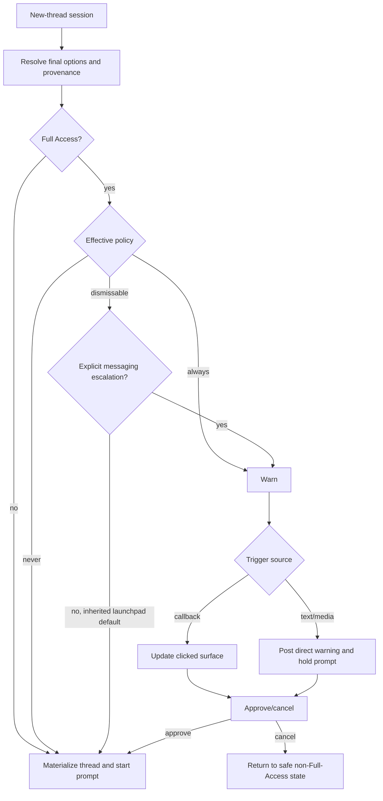

# fix: Stabilize Messaging Full Access Approval

## Overview

Messaging should not surprise a user with a second Full Access warning when a
new thread starts from an already-Full-Access launchpad default. The fix is to
separate inherited Full Access from explicit messaging escalation, keep the
`Always` policy authoritative, and harden the remaining warning path so visible
approval buttons are not invalidated by the short browse-session TTL.

This is a Standard plan: the change is narrowly scoped to desktop messaging
orchestration and tests, but it touches a security-sensitive permission mode
and cross-provider callback behavior.

## Problem Frame

The origin requirements describe a `/new` flow where the settings card showed
Full Access, the user sent the first prompt, and messaging then rewrote the
existing settings card into a Full Access warning instead of starting the
thread. The warning later resolved as a generic "Invalid selection" because the
browse session used the controller's 15-minute pending-intent TTL, even though
provider callback handles are designed to survive much longer.

The product intent is that inherited Full Access defaults under the
dismissable warning policy count as already user-selected for new-thread
startup, while explicit Default Access -> Full Access escalation remains gated
when the effective policy says to warn (see origin:
`docs/brainstorms/2026-05-22-messaging-full-access-approval-requirements.md`).

## Requirements Trace

- R1. Inherited Full Access from launchpad defaults or directory launchpads
  should not trigger a second warning under the dismissable policy.
- R2. The `Always` warning policy must still warn even for inherited Full
  Access.
- R3. Explicit messaging escalation from Default Access to Full Access must keep
  the warning gate.
- R4. Callback-triggered warnings may update the clicked card; non-callback
  warnings must not rewrite older cards.
- R5. Text/media-triggered interlocks must either be avoided for inherited
  defaults or posted as direct responses below the submitted message.
- R6. If a submitted first prompt is legitimately blocked by a warning, approval
  must not silently discard it during the current controller lifetime.
- R7. Visible Full Access warning actions must not expire merely because the
  browse session crossed the 15-minute picker TTL.
- R8. Stale Full Access warnings need Full-Access-specific failure copy rather
  than generic resume-browser invalid-selection copy.
- R9-R12. Regression coverage must lock inherited-default startup, remaining
  warning placement, stale-warning handling, and existing explicit-escalation
  behavior.

## Scope Boundaries

- Do not weaken `allowEscalation`, `allowThreadResume`, or the `Always` warning
  policy.
- Do not redesign the whole `/resume` and `/new` browser.
- Do not add provider-specific policy branches.
- Do not change Codex permission-mode execution semantics or backend registry
  queue behavior.
- Do not persist arbitrary submitted prompts across process restart in this
  pass.

## Context & Research

### Relevant Code and Patterns

- `apps/desktop/src/main/messaging/core/messaging-controller.ts` owns the
  new-thread browser, pending first-prompt debounce, Full Access warning
  presentation, and callback handling.
- `newThreadOptionsForSession` currently resolves `executionMode` from
  `session.preferences?.executionMode ?? navigation.launchpadDefaults.executionMode`;
  it does not expose whether Full Access was explicitly selected in messaging
  or inherited from launchpad state.
- `launchpadForMessagingProject` can materialize from an existing directory
  launchpad whose `executionMode` differs from `navigation.launchpadDefaults`.
  The implementation should reconcile this with the warning check so the mode
  being approved is the mode actually materialized.
- `createNewThreadFromPromptBundle` prepares the submitted prompt, then checks
  `isFullAccessRiskAcceptedForSession`, and only then materializes the thread
  and starts the turn.
- `presentFullAccessRiskWarning` stores the warning as a normal pending intent
  with `this.pendingIntentTtlMs`, currently 15 minutes.
- `resolveFullAccessRiskCallbackContext` looks up new/resume warning context
  through `getBrowseSession`; if the session expired, it falls through to the
  generic browse invalid-selection response.
- `packages/messaging/interface/src/index.ts` defines
  `MESSAGING_CALLBACK_HANDLE_TTL_MS` as 30 days, and provider adapters persist
  callback handles with that TTL while also storing `browseSessionId`.
- Existing controller coverage lives in
  `apps/desktop/src/main/__tests__/messaging-controller.test.ts`, including
  explicit Full Access warning, dismiss, cancel, policy-disabled, and new-thread
  picker-surface behavior.
- Store coverage lives in `apps/desktop/src/main/__tests__/messaging-store.test.ts`
  for file-backed state and `apps/desktop/src/main/__tests__/messaging-store-sqlite.test.ts`
  for profile sqlite state.

### Institutional Learnings

- `docs/solutions/2026-05-07-codex-permission-mode-state-machine.md` is directly
  relevant: permission-mode routing is security-sensitive, silent fallbacks are
  dangerous, and every mode decision should be explicit, observable, and tested.

### External References

- None used. This is repo-specific state orchestration with strong local
  patterns; external framework research would not materially improve the plan.

## Key Technical Decisions

- Track or derive execution-mode provenance for new-thread startup instead of
  treating every Full Access start as escalation. This is the smallest way to
  satisfy R1 without weakening explicit escalation gates.
- Resolve inherited-default acceptance at start time, not by eagerly marking
  every browse session accepted. Start-time resolution has access to the final
  selected directory, directory launchpad, and global launchpad defaults, so it
  can distinguish explicit messaging preferences from inherited launchpad state.
- Keep the existing warning path for explicit escalation, but make warning
  presentation aware of trigger source. Callback-triggered warnings can update
  the clicked surface; text-triggered warnings should be delivered as a new
  direct response.
- Use the existing callback-handle durability model for visible Full Access
  warning actions. Extend the warning's domain state to survive as long as the
  button is meant to work instead of adding provider-specific callback logic.
- Preserve prompt holding in memory for the rare explicit text-triggered warning
  path. Persisting arbitrary first prompts across restart would expand scope and
  data-retention risk; if the in-memory bundle is gone, the user should receive
  Full-Access-specific resubmission copy rather than a generic invalid-selection
  message.

## Open Questions

### Resolved During Planning

- Should implementation mark inherited Full Access sessions accepted at
  creation, or skip warning based on provenance at start time?
  Resolution: skip based on provenance at start time. Directory launchpad
  selection can change which inherited defaults apply, and start-time logic is
  easier to keep honest.
- Should submitted prompts blocked by explicit text-triggered warnings be
  persisted across restart?
  Resolution: no for this pass. Hold them for the current controller lifetime
  and return specific resubmission copy if the prompt bundle is no longer
  available.
- Should Full Access warning actions use a dedicated non-expiring domain record?
  Resolution: no new domain record initially. Reuse pending intent and browse
  session records with a Full Access warning TTL aligned to the provider
  callback-handle TTL, then add specific stale-warning handling for cases where
  state is still missing.

### Deferred to Implementation

- Exact helper names and shape for execution-mode provenance should follow the
  surrounding `newThreadOptionsForSession` and `resolve*` helper style.
- The final in-memory pending-prompt key should be chosen while touching the
  existing `pendingNewThreadPrompts` map to avoid duplicate cleanup paths.

## High-Level Technical Design

> *This illustrates the intended approach and is directional guidance for
> review, not implementation specification. The implementing agent should treat
> it as context, not code to reproduce.*

## Implementation Units

- [x] **Unit 1: Classify New-Thread Full Access Provenance**

**Goal:** Distinguish inherited Full Access defaults from explicit messaging
escalation before deciding whether the warning gate applies.

**Requirements:** R1, R2, R3, R9, R12

**Dependencies:** None

**Files:**
- Modify: `apps/desktop/src/main/messaging/core/messaging-controller.ts`
- Test: `apps/desktop/src/main/__tests__/messaging-controller.test.ts`

**Approach:**
- Extend the new-thread option resolution path so it reports both the resolved
  execution mode and its source: explicit session preference, directory
  launchpad, or global launchpad default.
- Make that resolved execution mode the same mode that will be passed to
  materialization/startup. Avoid a split where the warning check sees the global
  default but materialization later uses a directory launchpad's Full Access
  mode.
- Treat explicit session preference as messaging escalation when it selects Full
  Access from a Default Access baseline. This includes picker toggles and
  command-parsed preferences such as `--yolo`.
- Treat directory/global launchpad Full Access as inherited for `/new`
  startup. Under `dismissable`, inherited Full Access should pass the warning
  check; under `always`, it should still warn.
- Keep `allowEscalation: false` authoritative. Even inherited Full Access from
  messaging should still be blocked when messaging Full Access escalation is
  disabled.

**Execution note:** Implement behavior test-first because this is
security-sensitive permission routing.

**Patterns to follow:**
- `newThreadOptionsForSession` and nearby launchpad helper functions in
  `apps/desktop/src/main/messaging/core/messaging-controller.ts`.
- Existing Full Access warning tests in
  `apps/desktop/src/main/__tests__/messaging-controller.test.ts`.

**Test scenarios:**
- Happy path: `/resume --new` with `launchpadDefaults.executionMode =
  "full-access"` and `warningPolicy = "dismissable"`; selecting a project and
  sending the first prompt starts/materializes a Full Access thread and starts
  the turn without delivering `Enable Full Access?`.
- Happy path: selected directory has a persisted launchpad with
  `executionMode = "full-access"` while global defaults remain Default Access;
  sending the first prompt starts/materializes Full Access without a warning
  under `dismissable`.
- Happy path: same inherited default with `warningPolicy = "never"` also starts
  without a warning.
- Error path: same inherited default with `allowEscalation = false` does not
  start and delivers `Full Access blocked`.
- Edge case: inherited default with `warningPolicy = "always"` still delivers
  `Enable Full Access?`.
- Integration: explicit picker toggle from Default Access to Full Access still
  renders the warning and only applies Full Access after approval.

**Verification:**
- New-thread startup tests show inherited Full Access and explicit escalation
  take different warning paths.
- Existing explicit escalation tests continue to pass without weakening policy
  controls.

- [x] **Unit 2: Make Full Access Warning Presentation Causal and Long-Lived**

**Goal:** Ensure Full Access warnings update only the surface that caused them
and remain actionable beyond the short browse-picker TTL.

**Requirements:** R4, R5, R7, R8, R10, R11

**Dependencies:** Unit 1

**Files:**
- Modify: `apps/desktop/src/main/messaging/core/messaging-controller.ts`
- Modify only if the chosen TTL shape requires shared type/doc adjustment:
  `packages/messaging/interface/src/index.ts`
- Test: `apps/desktop/src/main/__tests__/messaging-controller.test.ts`
- Test if store TTL behavior is adjusted directly:
  `apps/desktop/src/main/__tests__/messaging-store.test.ts`
- Test if sqlite store TTL behavior is adjusted directly:
  `apps/desktop/src/main/__tests__/messaging-store-sqlite.test.ts`

**Approach:**
- Add a trigger-source parameter to Full Access warning presentation, or derive
  it from the call site: status/picker callbacks are interactive-surface
  triggers; text/media prompt submission is conversation-flow triggered.
- For interactive-surface triggers, preserve the existing update-in-place
  behavior.
- For text/media-triggered warnings, deliver a fresh confirmation below the
  submitted message rather than targeting the session surface.
- When a Full Access warning is created for a browse session, extend the
  relevant browse-session and pending-intent expiry to the same long-lived
  window as callback handles, or otherwise make the callback context independent
  of the short picker TTL.
- Replace generic browse invalid-selection handling for missing Full Access
  warning context with copy that names the Full Access warning and tells the
  user whether to retry the command, resubmit the prompt, or refresh the browser.

**Patterns to follow:**
- Provider callback handles already use `MESSAGING_CALLBACK_HANDLE_TTL_MS` in
  Telegram and Discord adapters.
- `findBrowseSessionForCallback` already prefers callback-handle-scoped session
  lookup before falling back to active channel session lookup.
- Existing error intent builders and invalid-selection copy in
  `messaging-controller.ts`.

**Test scenarios:**
- Happy path: explicit `browse:new:permissions` callback warning still updates
  the ready-to-start picker surface.
- Happy path: explicit text-triggered Full Access warning posts as a new
  confirmation without `delivery.mode = "update"` and without targeting the old
  picker surface.
- Edge case: after warning creation, advancing the controller clock beyond 15
  minutes but within callback-handle lifetime still lets `full-access-risk:accept`
  resolve the session instead of returning generic `Invalid selection`.
- Error path: accepting a Full Access warning whose session or pending prompt is
  genuinely gone returns Full-Access-specific stale-warning copy.
- Integration: Telegram/Discord-style callback handle values still route through
  the generic callback handling path with no provider-specific policy branches.

**Verification:**
- Warning placement reflects trigger source.
- Visible warning buttons are not tied to the short picker TTL.
- Stale cases no longer use resume-browser invalid-selection copy.

- [x] **Unit 3: Preserve Submitted Prompt Continuation for Explicit Warning Path**

**Goal:** If a first prompt is blocked by a legitimate explicit Full Access
warning, approval should continue the submitted prompt during the active
controller lifetime instead of returning to the ready card and losing context.

**Requirements:** R6, R10, R11

**Dependencies:** Unit 2

**Files:**
- Modify: `apps/desktop/src/main/messaging/core/messaging-controller.ts`
- Test: `apps/desktop/src/main/__tests__/messaging-controller.test.ts`

**Approach:**
- When `createNewThreadFromPromptBundle` hits a warning for an explicit
  messaging escalation, keep a small in-memory pending bundle keyed by the
  browse session or warning context.
- Include enough warning context to find that bundle after approval.
- On approval, continue through the same thread materialization and
  `startPreparedInput` path using the original prepared prompt events.
- On cancel, clear the pending bundle and return to the safe ready state or
  browser state.
- On cleanup, clear pending warning bundles when the browse session retires,
  when a new prompt supersedes the old one, or when the controller handles a
  stale/missing warning context.
- Do not persist the prompt payload in profile state for this pass; use specific
  resubmission copy if a restart or cleanup removes the in-memory bundle.

**Patterns to follow:**
- Existing `pendingNewThreadPrompts` debounce map and `clearPendingNewThreadPrompt`.
- Existing `createNewThreadFromPromptBundle` path for materialization, binding,
  status-surface preservation, and optimistic navigation.

**Test scenarios:**
- Happy path: explicit text-triggered Full Access warning holds the submitted
  prompt; accepting the warning starts the new Full Access thread and calls
  `startTurn` with the original prompt text.
- Edge case: canceling the warning clears the held prompt and does not create a
  thread or start a turn.
- Error path: accepting after the held prompt bundle is missing returns specific
  resubmission copy and does not create an empty thread.
- Integration: cleanup after successful start deletes the browse session and
  pending prompt bundle.

**Verification:**
- Legitimately blocked first prompts are not dropped during normal long-delay
  approval within one running controller.
- Missing in-memory prompt state fails explicitly and safely.

- [x] **Unit 4: Tighten Regression Coverage and Policy Invariants**

**Goal:** Lock the security and UX invariants across controller, store, and
callback lifecycle tests so future changes do not reintroduce the stale warning
or silent permission escalation behavior.

**Requirements:** R1-R12

**Dependencies:** Units 1-3

**Files:**
- Modify: `apps/desktop/src/main/__tests__/messaging-controller.test.ts`
- Modify if direct store behavior changed:
  `apps/desktop/src/main/__tests__/messaging-store.test.ts`
- Modify if sqlite store behavior changed:
  `apps/desktop/src/main/__tests__/messaging-store-sqlite.test.ts`

**Approach:**
- Add focused controller tests near the existing Full Access warning tests so
  related behavior stays visible in one section.
- Prefer small navigation overrides in the existing harness over broad fixture
  creation.
- Assert both positive behavior and absence of the bad behavior: no warning for
  inherited dismissable defaults, no `Invalid selection` for long-lived visible
  warnings, no start when escalation is disabled.
- Keep store tests only if the implementation changes generic store TTL or
  cleanup behavior. If TTL extension is done by writing longer expiration values
  from the controller, controller tests are enough for store behavior.

**Patterns to follow:**
- Harness helpers in `apps/desktop/src/main/__tests__/messaging-controller.test.ts`.
- File-backed and sqlite store round-trip/expiry tests only if persistence
  contract changes.

**Test scenarios:**
- Happy path: inherited Full Access dismissable startup starts the turn with
  Full Access.
- Edge case: inherited Full Access `Always` warns.
- Error path: inherited Full Access while escalation disabled blocks.
- Happy path: explicit callback escalation preserves the current update-in-place
  warning behavior.
- Happy path: explicit text-triggered warning approval after more than 15
  minutes continues correctly.
- Error path: stale Full Access warning state returns specific stale-warning
  copy.

**Verification:**
- The controller test suite covers every origin regression requirement.
- Store tests, if changed, prove file-backed and sqlite state agree.

## System-Wide Impact

- **Interaction graph:** Inbound command/callback/text events enter
  `MessagingController`, which coordinates browse sessions, pending intents,
  callback handles, and backend thread start/turn start. Provider adapters
  should remain generic button transport layers.
- **Error propagation:** Policy denial remains `Full Access blocked`; stale Full
  Access approval becomes a specific recoverable error; generic browse
  invalid-selection remains for non-Full-Access browser callbacks.
- **State lifecycle risks:** Extending warning state beyond the browse picker
  TTL must not keep obsolete generic browser sessions active indefinitely.
  Restrict longer lifetime to active Full Access warning contexts, and clean
  them up on approval, cancellation, supersession, and browse retirement.
- **API surface parity:** Telegram, Discord, LINE, Slack, Feishu, and Mattermost
  should not need provider-specific policy logic. Any shape changes should stay
  inside the generic messaging contract or desktop controller.
- **Integration coverage:** Controller tests must cover button-style callbacks
  and fallback/stale context behavior. Provider tests are only needed if the
  generic intent shape changes.
- **Unchanged invariants:** Existing thread permission queue behavior, Codex
  sandbox routing, messaging allowlists, and global Full Access policy controls
  remain authoritative.

## Risks & Dependencies

| Risk | Mitigation |
|------|------------|
| Accidentally treating explicit `--yolo` or picker escalation as inherited | Model execution-mode provenance explicitly and test both inherited and explicit paths. |
| Weakening `Always` warning or `allowEscalation: false` | Keep policy checks centralized and add tests for both settings. |
| Long-lived warning state keeps stale browser sessions alive | Extend only Full Access warning-related state and clean it up on terminal transitions. |
| Holding first prompts in memory creates restart ambiguity | Document and test the current-lifetime guarantee; return specific resubmission copy if memory state is gone. |
| Provider-specific behavior drifts | Keep changes in the generic controller/contract layer and rely on existing callback-handle persistence. |

## Documentation / Operational Notes

- No operator-facing docs change is required unless implementation changes the
  wording or semantics of Settings -> Messaging Full Access controls.
- Add a short code comment only where provenance or long-lived warning state
  would otherwise look like an accidental bypass of the warning gate.
- This plan should be executed with focused controller tests before broader
  desktop typecheck/lint gates.

## Sources & References

- Origin document:
  `docs/brainstorms/2026-05-22-messaging-full-access-approval-requirements.md`
- `apps/desktop/src/main/messaging/core/messaging-controller.ts`
- `apps/desktop/src/main/messaging/core/messaging-store.ts`
- `apps/desktop/src/main/state/messaging-store-sqlite.ts`
- `apps/desktop/src/main/__tests__/messaging-controller.test.ts`
- `apps/desktop/src/main/__tests__/messaging-store.test.ts`
- `apps/desktop/src/main/__tests__/messaging-store-sqlite.test.ts`
- `packages/messaging/interface/src/index.ts`
- `packages/messaging/providers/telegram/src/telegram-adapter.ts`
- `packages/messaging/providers/discord/src/discord-adapter.ts`
- `docs/solutions/2026-05-07-codex-permission-mode-state-machine.md`
