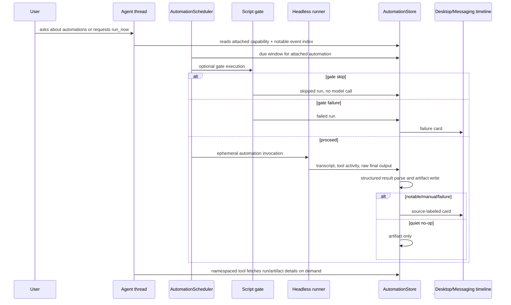
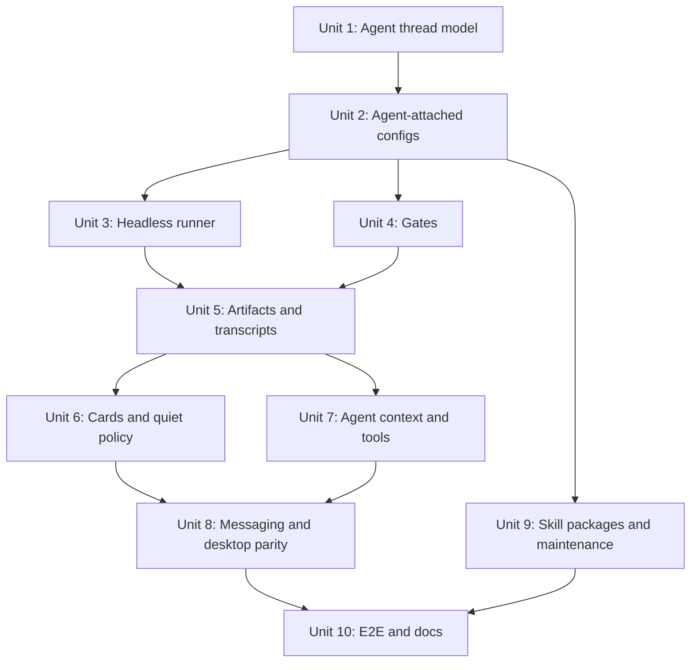
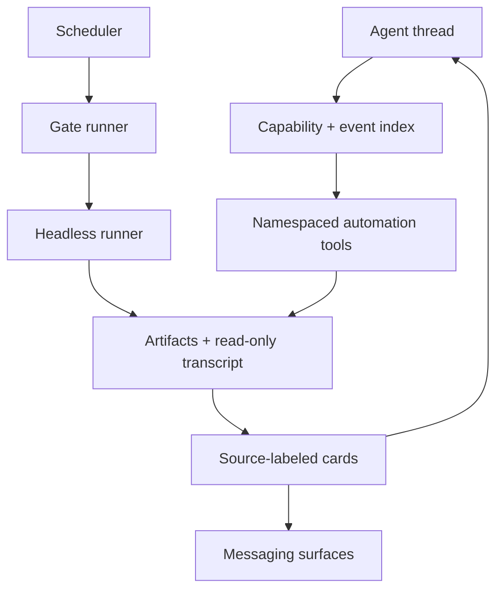

# feat: Close agent-attached automation delta

## Overview

The current `feat/thread-automation-scheduling` branch is a strong scheduling
foundation, but the refined brainstorm changes the product model. The current
branch treats an automation as a recurring turn on an ordinary thread. The
refined model treats an automation as a headless execution configuration
attached to an Agent thread: the Agent thread is the reporting and control
conversation, while scheduled automation runs execute ephemerally, persist
artifacts and read-only transcripts, and post only notable source-labeled cards
back into the Agent timeline.

This plan closes that delta without throwing away the useful work already
landed: typed schedules, sqlite persistence, local scheduler timing,
coalesce/drop behavior, run history, global/thread automation views, and the
shared turn queue remain useful. The major work is to pivot the attachment,
execution, reporting, and tool-access model so the feature matches the refined
Agent-centric requirements.

## Branch Strategy

**Recommendation: create a stacked branch from `feat/thread-automation-scheduling`.**
Do not start from `origin/main` unless the intent is to abandon the current
8k-line scheduling foundation. The current branch already contains the scheduler,
store, IPC, UI, tests, and queue fixes that this plan should reuse.

Do not merge the current branch as a user-facing feature without either hiding
the current ordinary-thread automation UI or completing the Agent-attached pivot.
As-is, the current branch would teach the older mental model: automations belong
to ordinary threads and scheduled runs appear as ordinary transcript turns. That
directly conflicts with the refined brainstorm.

Acceptable paths:

| Path | Recommendation | Tradeoff |
|---|---|---|
| New branch from current branch | Preferred | Preserves reviewable foundation work while isolating the refined-product delta. |
| Continue on current branch | Acceptable if the PR is not intended to merge soon | Avoids stacked PR management, but makes the already-large PR much larger and resets review focus. |
| New branch from `origin/main` | Not recommended | Clean history, but requires reimplementing or cherry-picking the scheduler, store, FIFO, UI, and fixes already built. |

In the stacked path, the current branch can remain the foundation review. The
delta branch should target the current branch while foundation review continues,
then retarget to `main` after the foundation lands. If the foundation branch is
merged before this delta lands, it should either have the old automation entry
points hidden or clearly remain behind a non-default internal gate.

## Problem Frame

The refined brainstorm supersedes the original scheduling requirements (see
origin: `docs/brainstorms/2026-05-22-agent-thread-attached-automations-requirements.md`).
Users should talk to one Agent thread, such as "Jarvis", and ask about attached
email, trading, sprinkler, or other automations from that same conversation.
Automations must remain independently scheduled and headless. They should not
pollute the Agent thread with ordinary assistant/tool chatter, and their runs
should be auditable through artifacts and read-only run transcripts when needed.

The existing branch already proves the local scheduling and backlog mechanics.
The remaining product risk is that the execution model and user-visible surfaces
still match the older "scheduled turn in a normal thread" model instead of the
new "Agent thread with attached automation capabilities and notable cards" model.

## Delta Assessment

| Refined area | Current branch status | Delta to close |
|---|---|---|
| Agent threads/personas | Missing. Automations attach to any existing thread. | Add explicit Agent thread type, compact persona instructions, and Agent picker flows. |
| Automation attachment | Partial. One automation has one thread, but ordinary threads are allowed. | Require exactly one Agent thread and make that Agent the reporting/control target. |
| Headless execution | Missing. Runs submit ordinary turn input to the assigned thread. | Run from automation definition plus invocation metadata, not accumulated Agent chat context. |
| Run artifacts/transcripts | Partial. Run rows track lifecycle and windows. | Persist durable artifacts, final structured result, and read-only per-run transcript/tool activity. |
| Cards/quiet policy | Partial for messaging final/noisy suppression. | Post source-labeled cards for notable/failure/manual runs; never treat cards as Agent assistant messages. |
| Input gates | Missing. | Add script gate runner, bounded stdout/stderr capture, skip/failure handling, and history records. |
| Structured result | Missing. | Add output decision schema, best-effort parsing, parse-failure fallback, and quiet no-op storage. |
| Agent context/tools | Missing. | Add attached capability index, notable event index, and namespaced tools for run/artifact lookup and domain actions. |
| Skill-backed packages | Missing. | Define package/instance split, immutable normal runs, per-instance state, and maintenance workflow audit. |
| Scheduling/backlog | Mostly built. | Retarget coalesce/drop from "busy assigned thread" to the appropriate headless automation execution lane. |

Practical estimate: the current branch closes roughly one third of the refined
requirements directly. It provides the local scheduler, persistence, basic UI,
run history, and queue substrate. The remaining two thirds are the Agent-thread
product model, headless execution/artifacts, card/reporting model, gates,
structured outputs, capability tools, and package maintenance semantics.

## Requirements Trace

- R1-R4. Add intentional Agent/persona threads with compact instructions,
  messaging attachment through an Agent picker, and no new V1 RBAC model.
- R5-R10. Require each automation to attach to exactly one Agent thread, expose
  attached automations and health on that Agent, and keep a secondary global
  Automations view.
- R11-R16. Treat automations as headless execution configs with owned execution
  settings, ephemeral scheduled runs, explicit prior-history fetching, durable
  artifacts, and read-only run transcripts.
- R17-R21. Include a compact attached capability list and notable event index in
  Agent context, expose namespaced tools, and resolve ambiguous destructive
  requests safely.
- R22-R28. Post notable/failure/manual run cards into the Agent timeline without
  triggering automatic Agent turns; keep V1 cards non-executable.
- R29-R34. Support optional script gates with proceed/skip/failure exit mapping,
  bounded output capture, and no model call on skip.
- R35-R37. Store structured result artifacts with output decisions; parse
  failures fall back to raw output and scheduled notable-by-default behavior.
- R38-R43. Support skill-backed automation packages, immutable normal runs,
  per-instance state, and explicit maintenance workflows with audit summaries.

## Scope Boundaries

- In scope: pivoting the current scheduler foundation to Agent-attached,
  headless, artifact-backed automations with cards, gates, structured output,
  capability tools, and package/maintenance semantics.
- Out of scope: cloud scheduling, daemon execution while the app is closed,
  multi-Agent delivery, automatic cross-Agent orchestration, executable card
  buttons, novice automation templates, long persona/context bundles, and new
  RBAC.
- Out of scope: treating automation run outputs as ordinary Agent assistant
  messages or stuffing full run histories into the Agent prompt.

## Context & Research

### Relevant Code and Patterns

- `packages/shared/src/contracts/automations.ts` already defines schedule,
  backlog, run status, IPC, and summary contracts for the current branch.
- `apps/desktop/src/main/automations/automation-store.ts` stores automations and
  run history in profile sqlite tables. This should evolve to include Agent
  attachment, execution settings, artifacts, cards, gates, and package refs.
- `apps/desktop/src/main/automations/automation-scheduler.ts` handles local-only
  due-window evaluation, coalesce/drop behavior, and run lifecycle updates.
- `apps/desktop/src/main/automations/automation-prompt.ts` currently builds an
  ordinary turn prompt. This should become invocation-context construction for
  the headless runner, not Agent transcript input.
- `apps/desktop/src/main/app-server/thread-turn-queue.ts` and
  `apps/desktop/src/main/app-server/backend-registry.ts` provide useful
  admission/lifecycle patterns, but scheduled runs should no longer occupy the
  attached Agent conversation queue.
- `apps/desktop/src/main/codex-app-server/client.ts` has an existing ephemeral
  helper-thread pattern for title generation, including ephemeral thread start,
  output schema, and helper turn result collection.
- `apps/desktop/src/main/app-server/ephemeral-object-call.ts` is an existing
  structured object-call helper for xAI/Grok-side non-chat work.
- `apps/desktop/src/renderer/src/features/automations/*` contains the current
  global/thread automation UI and should be reshaped around Agent attachment
  and run artifacts rather than ordinary thread assignment.
- `apps/desktop/src/renderer/src/features/thread-detail/TranscriptList.tsx`,
  `TranscriptActivity.tsx`, and `transcript-render-items.ts` are the existing
  transcript rendering extension points for source-labeled card-like entries.
- `apps/desktop/src/main/messaging/core/messaging-controller.ts` already has
  status-card, quieting, started-notice, and bound-thread delivery patterns that
  should shape messaging delivery for automation cards.
- `docs/messaging-architecture.md` establishes that workflow decisions belong
  in the desktop controller/runtime, not provider adapters.

### Institutional Learnings

- `docs/solutions/2026-05-07-codex-permission-mode-state-machine.md` emphasizes
  making upstream state constraints structurally impossible to violate instead
  of papering over divergence. Apply the same lesson here: do not let scheduled
  automation runs and Agent conversation turns share confusing context if the
  product model says they are distinct.
- The May 13 automation plan and implementation established visible queueing,
  coalesce/drop vocabulary, local-only scheduler semantics, and run history.
  Preserve those where they still match the refined product model.

### External References

- External research is not needed for this delta plan. The repo has direct
  patterns for sqlite-backed state, navigation snapshots, messaging cards,
  ephemeral helper turns, structured object calls, and desktop renderer
  transcript extensions. The open questions are product/architecture alignment
  questions within this codebase, not library usage questions.

## Key Technical Decisions

- **Treat the current branch as foundation, not final UX.** The scheduler,
  store, IPC, and tests are valuable, but ordinary-thread assignment should not
  be the final user-facing model.
- **Introduce Agent thread identity before retargeting automation creation.**
  R6 depends on the app being able to distinguish Agent threads from ordinary
  work threads; otherwise the UI cannot enforce the refined attachment rule.
- **Scheduled runs should not enqueue ordinary turns on the attached Agent
  thread.** They should run through a headless automation runner and post
  source-labeled cards/artifacts back to the Agent timeline.
- **Keep coalesce/drop, but scope it to the automation execution lane.** The old
  model used thread busy state. The refined model should coalesce or drop when
  an automation already has a pending/running scheduled execution, not because
  the user is chatting with the Agent.
- **Persist cards and artifacts as automation-owned state.** Agent prompts get
  compact capability and notable-event indexes; full run output and transcript
  details are fetched explicitly.
- **Make gates cheaper than model calls.** Gate skip must record history without
  invoking the model, and gate failure must produce a failure card.
- **Start with read-only capability tools, then add domain action tools behind
  explicit package declarations.** Artifact lookup is lower risk than arbitrary
  domain actions and gives the Agent immediate "what happened?" capability.

## Open Questions

### Resolved During Planning

- **Should the refined delta be built from `origin/main`?** No. The current
  branch contains substantial foundation work that should be reused.
- **Can the current branch merge as-is as the refined feature?** No. It exposes
  the older ordinary-thread automation model unless hidden or pivoted.
- **Should scheduled automation cards be assistant messages from the Agent?** No.
  The origin explicitly says cards are not Agent assistant messages and must not
  trigger automatic Agent turns.
- **Should scheduled runs use the attached Agent's accumulated chat context?**
  No. Runs are ephemeral and start from automation definition, invocation
  metadata, gate output, and latest prior summary.

### Deferred to Implementation

- Exact schema names and migration version numbers after rebasing against the
  latest `state-db.ts`.
- Exact helper-runner API shape for Codex versus Grok once the implementation
  probes what each backend can return for ephemeral transcript/tool capture.
- Exact transcript card visual styling after renderer screenshots show how cards
  fit into the existing thread timeline.
- Exact package descriptor shape after comparing current skill metadata with
  the minimum fields automations need.

## High-Level Technical Design

> *This illustrates the intended approach and is directional guidance for review, not implementation specification. The implementing agent should treat it as context, not code to reproduce.*

## Implementation Units

- [ ] **Unit 1: Add Agent Thread Identity and Persona Metadata**

**Goal:** Let PwrAgent distinguish Agent/persona threads from ordinary work
threads, capture compact persona instructions, and expose Agent threads as
messaging-bindable targets.

**Requirements:** R1-R4

**Dependencies:** Current thread navigation and overlay state.

**Files:**
- Modify: `packages/shared/src/contracts/navigation.ts`
- Modify: `packages/shared/src/contracts/agent.ts`
- Modify: `packages/agent-core/src/domain/navigation-state.ts`
- Modify: `apps/desktop/src/main/state/state-db.ts`
- Modify: `apps/desktop/src/main/state/overlay-store-sqlite.ts`
- Modify: `apps/desktop/src/main/app-server/backend-registry.ts`
- Modify: `apps/desktop/src/main/messaging/core/messaging-controller.ts`
- Modify: `apps/desktop/src/renderer/src/features/thread-detail/ThreadHeader.tsx`
- Modify: `apps/desktop/src/renderer/src/features/thread-detail/ThreadContextPanel.tsx`
- Test: `packages/agent-core/src/__tests__/navigation-state.test.ts`
- Test: `apps/desktop/src/main/__tests__/state-migration.test.ts`
- Test: `apps/desktop/src/main/__tests__/backend-registry.test.ts`
- Test: `apps/desktop/src/main/__tests__/messaging-controller.test.ts`
- Test: `apps/desktop/src/renderer/src/features/thread-detail/__tests__/ThreadHeader.test.tsx`

**Approach:**
- Add a compact Agent/persona marker to thread-derived state without changing
  ordinary work-thread behavior.
- Store Agent display name and short persona instructions as profile-local
  metadata associated with the backend/thread identity.
- Enforce guidance that persona instructions are intentionally short; UI copy
  should steer users toward tone, chattiness, priorities, and short examples,
  not large context bundles.
- Update messaging bind/resume/new-thread flows so Agent threads can be selected
  deliberately through an Agent picker without introducing V1 RBAC.

**Patterns to follow:**
- Thread overlay and navigation materialization in
  `apps/desktop/src/main/state/overlay-store-sqlite.ts` and
  `packages/agent-core/src/domain/navigation-state.ts`.
- Messaging `/resume` and `/new` picker flows in
  `apps/desktop/src/main/messaging/core/messaging-controller.ts`.

**Test scenarios:**
- Happy path: marking a thread as an Agent adds Agent metadata to the navigation
  snapshot and renders the Agent affordance in the thread header.
- Happy path: messaging Agent picker lists Agent threads separately from ordinary
  work threads and binds a DM/topic to the selected Agent.
- Edge case: a thread without Agent metadata remains an ordinary work thread and
  is not listed as a valid automation attachment target.
- Edge case: persona instructions over the configured guidance threshold produce
  a visible warning without corrupting saved metadata.
- Integration: navigation hash changes when Agent metadata changes so renderer
  subscribers refresh.

**Verification:**
- Agent threads are discoverable and bindable, ordinary threads remain
  unchanged, and no new permission model is introduced.

- [ ] **Unit 2: Retarget Automation Configs to Agent Attachments**

**Goal:** Change automation ownership from "assigned ordinary thread" to
"attached Agent thread", and expand automation configuration to include the
execution settings required by headless runs.

**Requirements:** R5-R12

**Dependencies:** Unit 1

**Files:**
- Modify: `packages/shared/src/contracts/automations.ts`
- Modify: `apps/desktop/src/main/automations/automation-store.ts`
- Modify: `apps/desktop/src/main/automations/desktop-automation-service.ts`
- Modify: `apps/desktop/src/main/automations/automation-scheduler.ts`
- Modify: `apps/desktop/src/main/state/state-db.ts`
- Modify: `apps/desktop/src/main/ipc/automation-ipc.ts`
- Modify: `apps/desktop/src/preload/index.ts`
- Modify: `apps/desktop/src/renderer/src/lib/desktop-api.ts`
- Modify: `apps/desktop/src/renderer/src/features/automations/AutomationEditor.tsx`
- Modify: `apps/desktop/src/renderer/src/features/automations/AutomationsScreen.tsx`
- Modify: `apps/desktop/src/renderer/src/features/automations/ThreadAutomationsPanel.tsx`
- Test: `packages/shared/src/contracts/__tests__/automations.test.ts`
- Test: `apps/desktop/src/main/__tests__/automation-store.test.ts`
- Test: `apps/desktop/src/main/__tests__/desktop-automation-service.test.ts`
- Test: `apps/desktop/src/renderer/src/features/automations/__tests__/automation-editor.test.tsx`
- Test: `apps/desktop/src/renderer/src/features/automations/__tests__/automations-screen.test.tsx`

**Approach:**
- Replace ordinary `threadId` assignment semantics with required Agent
  attachment semantics in contracts and validation.
- Preserve backend/thread identity internally because the Agent itself still
  maps to a backend thread, but make that identity explicitly an Agent target.
- Add automation-owned execution settings: backend/provider, model, reasoning
  effort, fast mode, access mode, working directory or linked resource refs,
  system instructions, task prompt, schedule, gates, output policy, and package
  ref when present.
- Update creation flows so a user can create a new Agent inline if no suitable
  Agent exists.
- Maintain a migration path for any current-branch dev automation records:
  either mark them legacy/hidden until attached to an Agent, or map them to
  Agent metadata when the assigned thread is promoted.

**Patterns to follow:**
- Current automation CRUD and schedule validation in
  `apps/desktop/src/main/automations/desktop-automation-service.ts`.
- Thread model/reasoning/fast-mode preference propagation in
  `apps/desktop/src/renderer/src/lib/useThreadNavigation.ts` and
  `apps/desktop/src/main/messaging/core/messaging-status-card.ts`.

**Test scenarios:**
- Happy path: creating an automation requires an Agent target and persists the
  Agent attachment plus execution settings.
- Happy path: creating from an Agent thread preselects that Agent and does not
  show ordinary thread targets.
- Edge case: creating an automation against an ordinary thread is rejected with
  a recoverable validation error.
- Edge case: updating schedule or enabling from paused recomputes the next run
  from now, not from stale paused timestamps.
- Integration: global Automations view groups or labels rows by Agent, and the
  Agent thread context panel shows attached automations and last/next health.

**Verification:**
- Automations can only attach to Agent threads, and the old ordinary-thread
  mental model is no longer exposed as the primary UX.

- [ ] **Unit 3: Add Headless Ephemeral Automation Runner**

**Goal:** Run scheduled automations from definition and invocation metadata
instead of submitting ordinary user turns into the attached Agent transcript.

**Requirements:** R11-R16, R24, R26

**Dependencies:** Unit 2

**Files:**
- Create: `apps/desktop/src/main/automations/automation-runner.ts`
- Modify: `apps/desktop/src/main/automations/automation-scheduler.ts`
- Modify: `apps/desktop/src/main/automations/automation-prompt.ts`
- Modify: `apps/desktop/src/main/automations/desktop-automation-service.ts`
- Modify: `apps/desktop/src/main/app-server/backend-registry.ts`
- Modify: `apps/desktop/src/main/codex-app-server/client.ts`
- Modify: `apps/desktop/src/main/grok-app-server/client.ts`
- Modify: `apps/desktop/src/main/app-server/thread-turn-queue.ts`
- Test: `apps/desktop/src/main/__tests__/automation-scheduler.test.ts`
- Test: `apps/desktop/src/main/__tests__/automation-prompt.test.ts`
- Test: `apps/desktop/src/main/__tests__/desktop-automation-service.test.ts`
- Test: `apps/desktop/src/main/__tests__/codex-client.test.ts`
- Test: `apps/desktop/src/main/__tests__/backend-registry.test.ts`

**Approach:**
- Introduce a backend-neutral runner abstraction that accepts an automation
  definition, run metadata, optional gate output, latest prior summary, and
  execution settings.
- For Codex, reuse the existing ephemeral helper-thread pattern where possible
  rather than contaminating the attached Agent thread.
- For Grok/xAI, reuse existing object-call or app-server client patterns where
  they fit, and record any capability gaps as backend-specific limitations.
- Preserve coalesce/drop behavior, but key "busy" against the automation
  execution lane or run state rather than the attached Agent conversation.
- Manual `run_now` should enqueue asynchronous automation execution and produce
  a completion/failure card, not block the Agent thread turn.

**Patterns to follow:**
- Ephemeral title-generation flow in `apps/desktop/src/main/codex-app-server/client.ts`.
- Structured object-call helper in `apps/desktop/src/main/app-server/ephemeral-object-call.ts`.
- Current scheduler due-window and coalescing tests.

**Test scenarios:**
- Happy path: a scheduled run invokes the headless runner and does not append a
  user message to the Agent transcript.
- Happy path: a manual run returns immediately as queued/running and later emits
  completion or failure state.
- Edge case: a second due window for the same automation coalesces into the
  pending scheduled run while the first headless execution is not done.
- Edge case: `drop_missed` records skipped scheduled windows when the automation
  execution lane is busy.
- Error path: backend runner failure records a failed run and leaves the
  scheduler able to compute the next run.
- Integration: the user can continue chatting with the Agent while a scheduled
  automation run is executing.

**Verification:**
- Automation execution is independent from Agent chat context, while schedule
  history and backlog semantics remain observable.

- [ ] **Unit 4: Add Script Gates**

**Goal:** Support optional pre-invocation scripts that can proceed, skip, or
fail before any model call happens.

**Requirements:** R29-R34

**Dependencies:** Unit 2

**Files:**
- Create: `apps/desktop/src/main/automations/automation-gate-runner.ts`
- Modify: `packages/shared/src/contracts/automations.ts`
- Modify: `apps/desktop/src/main/automations/automation-store.ts`
- Modify: `apps/desktop/src/main/automations/automation-scheduler.ts`
- Modify: `apps/desktop/src/main/automations/automation-prompt.ts`
- Modify: `apps/desktop/src/main/state/state-db.ts`
- Modify: `apps/desktop/src/renderer/src/features/automations/AutomationEditor.tsx`
- Test: `apps/desktop/src/main/__tests__/automation-gate-runner.test.ts`
- Test: `apps/desktop/src/main/__tests__/automation-scheduler.test.ts`
- Test: `apps/desktop/src/main/__tests__/automation-store.test.ts`
- Test: `apps/desktop/src/renderer/src/features/automations/__tests__/automation-editor.test.tsx`

**Approach:**
- Model gate config as an optional script command plus working directory,
  timeout, and output caps.
- Execute gates under the automation's configured working directory/access
  environment.
- Map exit code `0` to proceed, `10` to skip/no input, and other non-zero exits
  to gate failure.
- Store bounded stdout/stderr metadata with explicit truncation flags.
- Include bounded proceed output in invocation context; never invoke the model
  for skip.
- Gate failures always produce a failure card.

**Patterns to follow:**
- Existing environment/setup execution and output-capping patterns in
  `apps/desktop/src/main/app-server/codex-environment-runtime.ts`.
- Current automation run terminal status handling in
  `apps/desktop/src/main/automations/automation-store.ts`.

**Test scenarios:**
- Happy path: exit `0` proceeds and bounded stdout is available to the runner.
- Happy path: exit `10` records a skipped run and does not call the runner.
- Error path: exit `1` records a failed run with capped diagnostics and posts a
  failure card.
- Edge case: stdout/stderr over caps are truncated and marked as truncated.
- Edge case: gate timeout records failure and does not invoke the model.
- Integration: gate state paths are per automation instance, not package files.

**Verification:**
- Gates reduce unnecessary model calls and failures remain visible to the user.

- [ ] **Unit 5: Persist Run Artifacts and Read-Only Transcripts**

**Goal:** Store durable run artifacts and inspectable run transcripts containing
invocation metadata, gate output, assistant output, tool activity, errors, and
structured result.

**Requirements:** R13-R16, R35-R37

**Dependencies:** Units 3 and 4

**Files:**
- Create: `apps/desktop/src/main/automations/automation-artifacts.ts`
- Modify: `packages/shared/src/contracts/automations.ts`
- Modify: `apps/desktop/src/main/automations/automation-store.ts`
- Modify: `apps/desktop/src/main/automations/desktop-automation-service.ts`
- Modify: `apps/desktop/src/main/state/state-db.ts`
- Modify: `apps/desktop/src/main/ipc/automation-ipc.ts`
- Modify: `apps/desktop/src/preload/index.ts`
- Modify: `apps/desktop/src/renderer/src/features/automations/ThreadAutomationsPanel.tsx`
- Modify: `apps/desktop/src/renderer/src/features/automations/AutomationsScreen.tsx`
- Test: `packages/shared/src/contracts/__tests__/automations.test.ts`
- Test: `apps/desktop/src/main/__tests__/automation-store.test.ts`
- Test: `apps/desktop/src/main/__tests__/desktop-automation-service.test.ts`
- Test: `apps/desktop/src/renderer/src/features/automations/__tests__/automations-screen.test.tsx`

**Approach:**
- Extend run persistence beyond lifecycle rows into artifact and transcript
  records with retention/capping rules.
- Store raw final output even when structured parsing fails.
- Store read-only transcript events separately from Agent thread transcript
  events so normal conversation remains clean.
- Include scheduled windows, trigger, gate result, runner status, tool activity,
  errors, output decision, and detail references in the artifact model.
- Expose detail/read APIs through automation IPC rather than embedding full run
  data in navigation snapshots.

**Patterns to follow:**
- Current capped run history in `apps/desktop/src/main/automations/automation-store.ts`.
- Transcript rendering and replay extraction patterns in
  `apps/desktop/src/renderer/src/features/thread-detail/transcript-render-items.ts`.

**Test scenarios:**
- Happy path: successful run stores artifact, read-only transcript, raw final
  output, and parsed structured result.
- Happy path: quiet no-op scheduled run stores artifact without posting a card.
- Edge case: parse failure stores raw output, marks parse-failed, and treats a
  scheduled result as notable by default.
- Error path: failed runner stores error artifact and failure transcript entry.
- Integration: opening run detail reads artifact/transcript by run id without
  requiring the Agent thread transcript.

**Verification:**
- A user can inspect why a card was produced without polluting normal Agent chat.

- [ ] **Unit 6: Post Source-Labeled Cards and Enforce Quiet Policy**

**Goal:** Render automation outcomes as source-labeled cards in the Agent
timeline according to structured output decisions, not as Agent assistant
messages.

**Requirements:** R22-R28, R35-R37

**Dependencies:** Unit 5

**Files:**
- Create: `apps/desktop/src/main/automations/automation-cards.ts`
- Modify: `packages/shared/src/contracts/normalized-app-server.ts`
- Modify: `packages/shared/src/contracts/navigation.ts`
- Modify: `apps/desktop/src/main/automations/desktop-automation-service.ts`
- Modify: `apps/desktop/src/main/state/overlay-store-sqlite.ts`
- Modify: `apps/desktop/src/renderer/src/features/thread-detail/TranscriptList.tsx`
- Modify: `apps/desktop/src/renderer/src/features/thread-detail/TranscriptActivity.tsx`
- Modify: `apps/desktop/src/renderer/src/features/thread-detail/transcript-render-items.ts`
- Modify: `apps/desktop/src/renderer/src/features/automations/automation-format.ts`
- Test: `apps/desktop/src/main/__tests__/desktop-automation-service.test.ts`
- Test: `apps/desktop/src/renderer/src/features/thread-detail/__tests__/transcript-render-items.test.ts`
- Test: `apps/desktop/src/renderer/src/features/thread-detail/__tests__/transcript-list.test.tsx`

**Approach:**
- Define an automation card event shape with source automation, run time, status
  or severity, summary, expandable detail reference, and suggested actions as
  text.
- Post cards for manual runs, failures, and scheduled runs whose structured
  result says `post_card`.
- Do not post cards for quiet successful scheduled no-ops, but keep artifacts.
- Ensure card events do not trigger automatic Agent turns and are not attributed
  as Agent assistant messages.
- Keep V1 card actions as suggested text, not executable buttons.

**Patterns to follow:**
- Permission/messaging transition synthetic transcript entries in
  `apps/desktop/src/renderer/src/features/thread-detail/permission-transition-entries.ts`
  and `messaging-binding-transition-entries.ts`.
- Messaging status-card source labeling in
  `apps/desktop/src/main/messaging/core/messaging-status-card.ts`.

**Test scenarios:**
- Happy path: notable scheduled result appears as an automation card with source
  label, status, summary, run time, and detail affordance.
- Happy path: manual run always produces completion or failure notice.
- Happy path: quiet scheduled no-op stores artifact and does not add a timeline
  card.
- Error path: scheduled failure always posts a failure card even when output
  policy is otherwise quiet.
- Integration: receiving an automation card does not start an Agent turn.

**Verification:**
- Agent timelines stay readable: users see notable results and failures without
  intermediate tool/activity spam.

- [ ] **Unit 7: Add Agent Context Index and Namespaced Automation Tools**

**Goal:** Give Agent turns a compact attached-automation context and tools for
fetching details or invoking allowed automation/domain actions.

**Requirements:** R17-R21

**Dependencies:** Units 1, 2, 5, and 6

**Files:**
- Create: `apps/desktop/src/main/automations/automation-capabilities.ts`
- Modify: `packages/shared/src/contracts/automations.ts`
- Modify: `packages/shared/src/contracts/agent.ts`
- Modify: `apps/desktop/src/main/app-server/backend-registry.ts`
- Modify: `apps/desktop/src/main/codex-app-server/client.ts`
- Modify: `apps/desktop/src/main/grok-app-server/client.ts`
- Modify: `apps/desktop/src/main/automations/desktop-automation-service.ts`
- Test: `apps/desktop/src/main/__tests__/desktop-automation-service.test.ts`
- Test: `apps/desktop/src/main/__tests__/backend-registry.test.ts`
- Test: `apps/desktop/src/main/__tests__/codex-client.test.ts`

**Approach:**
- Build a compact Agent context block from attached automation capability
  summaries and recent notable event index only.
- Add namespaced read tools first, such as latest result and run artifact
  lookup, backed by automation store APIs.
- Add a domain-action registration surface for package-declared tools, but
  require destructive ambiguity checks before invocation.
- Keep full histories and domain state out of the Agent prompt.
- Use recent card focus, reply target, or explicit user language to infer the
  automation/run target; ask before destructive ambiguous actions.

**Patterns to follow:**
- Skill metadata and composer skill selection patterns in
  `apps/desktop/src/renderer/src/features/composer/Composer.tsx`.
- Messaging skills browser plan for staged tool/capability selection:
  `docs/plans/2026-05-12-001-feat-messaging-skills-browser-plan.md`.

**Test scenarios:**
- Happy path: an Agent thread with two attached automations receives a compact
  capability list and recent notable event index.
- Happy path: asking "what happened with email triage?" invokes the namespaced
  read tool and returns details from the artifact store.
- Edge case: full run output is not embedded in prompt context unless fetched.
- Error path: ambiguous destructive request across two automations asks for
  clarification rather than choosing one.
- Integration: deleting or detaching an automation removes its capability from
  subsequent Agent context.

**Verification:**
- The Agent can answer "what happened?" through tools without large prompt
  stuffing or hidden transcript dependence.

- [ ] **Unit 8: Align Messaging and Desktop Notification Policy**

**Goal:** Make automation starts, completions, failures, and quiet runs coherent
across desktop and messaging surfaces without noisy intermediate output.

**Requirements:** R3, R8, R22-R28

**Dependencies:** Units 6 and 7

**Files:**
- Modify: `apps/desktop/src/main/messaging/core/messaging-controller.ts`
- Modify: `apps/desktop/src/main/messaging/core/messaging-status-card.ts`
- Modify: `apps/desktop/src/main/messaging/desktop-backend-bridge.ts`
- Modify: `packages/messaging/interface/src/index.ts`
- Modify: `apps/desktop/src/renderer/src/features/automations/useAutomations.ts`
- Modify: `apps/desktop/src/renderer/src/lib/useThreadSessionState.ts`
- Test: `apps/desktop/src/main/__tests__/messaging-controller.test.ts`
- Test: `apps/desktop/src/main/__tests__/messaging-status-card.test.ts`
- Test: `apps/desktop/src/renderer/src/lib/__tests__/useThreadSessionState.test.tsx`

**Approach:**
- Preserve the already-added "automation started" messaging notice, but retarget
  it to headless run lifecycle rather than ordinary turn queue lifecycle.
- Suppress non-final automation chatter by default for messaging and desktop
  cards. Tool/intermediate output belongs in run transcript detail, not the main
  chat surface.
- Make output verbosity an automation output-policy default with operator
  override where existing messaging tool-update preferences can support it.
- Ensure desktop live updates refresh Agent timeline cards when runs start or
  complete, without requiring users to leave and reopen the thread.

**Patterns to follow:**
- Current branch messaging automation quieting in
  `apps/desktop/src/main/messaging/core/messaging-controller.ts`.
- Existing messaging tool update mode in shared settings and status-card code.

**Test scenarios:**
- Happy path: messaging user sees "automation started" for a manual or notable
  scheduled run, then sees the completion/failure card.
- Happy path: intermediate tool output is stored in run detail but not delivered
  to messaging by default.
- Edge case: desktop thread remains focused and receives a completed automation
  card live without requiring navigation away/back.
- Error path: messaging delivery failure for a card is logged and does not mark
  the automation run itself as failed.
- Integration: changing output verbosity affects future runs without rewriting
  historical artifacts.

**Verification:**
- Users get enough progress feedback to trust that a run started, without chat
  history being polluted by low-value intermediate output.

- [ ] **Unit 9: Add Skill-Backed Automation Packages and Maintenance Audit**

**Goal:** Define reusable automation packages and separate package authoring
from normal immutable scheduled runs.

**Requirements:** R38-R43

**Dependencies:** Units 2, 5, and 7

**Files:**
- Create: `apps/desktop/src/main/automations/automation-package-store.ts`
- Create: `apps/desktop/src/main/automations/automation-maintenance.ts`
- Modify: `packages/shared/src/contracts/automations.ts`
- Modify: `apps/desktop/src/main/automations/automation-store.ts`
- Modify: `apps/desktop/src/main/automations/automation-runner.ts`
- Modify: `apps/desktop/src/renderer/src/features/automations/AutomationEditor.tsx`
- Modify: `apps/desktop/src/renderer/src/features/automations/AutomationsScreen.tsx`
- Test: `apps/desktop/src/main/__tests__/automation-package-store.test.ts`
- Test: `apps/desktop/src/main/__tests__/automation-maintenance.test.ts`
- Test: `apps/desktop/src/main/__tests__/desktop-automation-service.test.ts`

**Approach:**
- Model package files as immutable inputs for normal scheduled runs: prompts,
  scripts, tool declarations, docs, default output schema, and setup guidance.
- Store per-instance state, artifacts, and history outside package directories.
- Let automation instances configure schedule, attached Agent, execution
  settings, output policy, local state path, and user configuration.
- Add explicit maintenance workflows that may edit package files and instance
  config, preferably through a separate maintenance thread/workspace in desktop.
- Persist maintenance audit summary: trigger, recent failures inspected,
  files/config changed, validation run, and future-run behavior.

**Patterns to follow:**
- Existing skill discovery and skill-chip UX in composer code.
- Git workspace handoff/audit patterns in
  `apps/desktop/src/main/app-server/git-workspace-handoff-service.ts`.

**Test scenarios:**
- Happy path: normal scheduled run reads package prompt/script/tool metadata but
  writes state only to per-instance paths.
- Happy path: maintenance workflow records an audit summary after modifying a
  package and instance config.
- Edge case: package file mutation attempted during normal run is rejected or
  ignored and recorded as a runner error.
- Error path: failed maintenance validation records failure and does not mark
  the package as ready for future runs.
- Integration: Agent context advertises package-declared capabilities after the
  package is attached to an automation instance.

**Verification:**
- Reusable automation packages remain inspectable and stable during normal runs,
  while explicit maintenance has an audit trail.

- [ ] **Unit 10: Update E2E Coverage, Operator Docs, and Release Notes**

**Goal:** Prove the refined workflow end to end and replace older documentation
that describes ordinary-thread automation semantics.

**Requirements:** All refined requirements, especially success criteria

**Dependencies:** Units 1-9

**Files:**
- Modify: `docs/automation-scheduling.md`
- Modify: `docs/desktop-release-runbook.md`
- Modify: `apps/desktop/e2e/queued-review-release.spec.ts`
- Create or modify: `apps/desktop/e2e/automation-agent-thread.spec.ts`
- Create or modify: `apps/desktop/e2e/fixtures/automation-agent-thread/`
- Test: `apps/desktop/e2e/automation-agent-thread.spec.ts`
- Test: `apps/desktop/e2e/queued-review-release.spec.ts`

**Approach:**
- Replace docs that say automations are assigned to ordinary threads with
  Agent-attached, headless execution language.
- Add replay-backed E2E for creating an Agent, attaching an automation, firing a
  scheduled/manual run, posting a card, opening run detail, and asking the Agent
  about the artifact.
- Preserve regression coverage for shared queue behavior where it still applies
  to manual/messaging turns.
- Document local-only scheduling, gates, quiet/no-op behavior, failure cards,
  and package immutability.

**Patterns to follow:**
- Desktop replay fixture guidance in `apps/desktop/AGENTS.md`.
- Existing E2E fixture structure under `apps/desktop/e2e/fixtures/`.

**Test scenarios:**
- Happy path: Telegram DM bound to an Agent receives an automation started
  notice and completion card for a manual run.
- Happy path: scheduled notable result posts a card while the user is conversing
  with the Agent.
- Happy path: user asks "what happened?" and the Agent fetches the artifact
  through a namespaced tool.
- Edge case: quiet scheduled no-op stores an artifact and does not spam desktop
  or messaging timelines.
- Error path: gate failure posts a failure card and no model invocation occurs.
- Regression: ordinary manual turns still serialize correctly through the
  existing thread queue.

**Verification:**
- The refined success criteria are demonstrable through unit tests, integration
  tests, and one replay-backed desktop/messaging workflow.

## System-Wide Impact

- **Interaction graph:** Scheduler, gate runner, headless runner, automation
  store, Agent prompt context, transcript renderer, desktop automation UI, and
  messaging controller all participate. The key boundary is that Agent thread
  conversation and automation execution are connected by artifacts/cards/tools,
  not by shared chat transcript turns.
- **Error propagation:** Gate skip is not an error; gate failure and runner
  failure record failed runs and post failure cards. Messaging delivery failure
  is a notification problem, not an automation execution failure.
- **State lifecycle risks:** Schema migrations must preserve current-branch
  dev records, cancel stale local pending work on startup, and avoid storing
  large transcripts in navigation snapshots.
- **API surface parity:** Desktop IPC, preload API, renderer hooks, messaging
  controller, and app-server notification contracts all need matching support
  for cards, artifacts, run detail, and Agent attachments.
- **Integration coverage:** Unit tests alone will not prove that focused Agent
  threads receive live cards, that messaging receives started/completion notices,
  or that the Agent can fetch artifacts. E2E/replay coverage is required.
- **Unchanged invariants:** Local-only scheduler semantics remain: no closed-app
  backfill, no daemon execution, and no raw cron in V1. Existing manual and
  messaging turns must continue to serialize per thread.

## Risks & Dependencies

| Risk | Mitigation |
|---|---|
| Current branch ships the wrong mental model before the pivot lands. | Use a stacked branch and avoid merging user-facing ordinary-thread automation UI unless hidden or converted. |
| Headless runner cannot capture enough transcript/tool detail from every backend. | Start with explicit backend capability flags and store raw final output plus partial transcript when full capture is unavailable. |
| Agent prompts become bloated with automation histories. | Store only compact capability and notable-event indexes in prompt context; require tools for details. |
| Cards accidentally trigger Agent turns or render as assistant messages. | Use a separate card event type and renderer path, with tests proving no automatic turn starts. |
| Gate scripts become a security footgun. | Run under the automation's configured access/working-directory environment, cap output, time out, and record audit metadata. |
| Package maintenance blurs normal-run immutability. | Separate package files from per-instance state and require explicit maintenance workflows with audit summaries. |
| The plan expands the already-large PR. | Prefer a stacked branch from the current branch, and keep the current branch as foundation unless the team decides to fold everything into one PR. |

## Documentation / Operational Notes

- Update `docs/automation-scheduling.md` after implementation so it no longer
  describes automations as ordinary thread turns.
- The release runbook should call out that automations are local-only while the
  desktop app is running, and that queued/pending local work is cancelled on
  restart rather than replayed.
- User-facing copy should keep persona/profile guidance short. If future
  `SOUL.md`-style files are supported, warn users to keep total persona/context
  files around 300 lines or less.

## Sources & References

- **Origin document:** [docs/brainstorms/2026-05-22-agent-thread-attached-automations-requirements.md](../brainstorms/2026-05-22-agent-thread-attached-automations-requirements.md)
- Superseded requirements: [docs/brainstorms/2026-05-13-automation-scheduling-requirements.md](../brainstorms/2026-05-13-automation-scheduling-requirements.md)
- Current foundation plan: [docs/plans/2026-05-13-001-feat-thread-automation-scheduling-plan.md](2026-05-13-001-feat-thread-automation-scheduling-plan.md)
- Current scheduling docs: [docs/automation-scheduling.md](../automation-scheduling.md)
- Related learning: [docs/solutions/2026-05-07-codex-permission-mode-state-machine.md](../solutions/2026-05-07-codex-permission-mode-state-machine.md)
- Related code: `packages/shared/src/contracts/automations.ts`
- Related code: `apps/desktop/src/main/automations/automation-store.ts`
- Related code: `apps/desktop/src/main/automations/automation-scheduler.ts`
- Related code: `apps/desktop/src/main/app-server/thread-turn-queue.ts`
- Related code: `apps/desktop/src/main/codex-app-server/client.ts`
- Related code: `apps/desktop/src/main/messaging/core/messaging-controller.ts`
