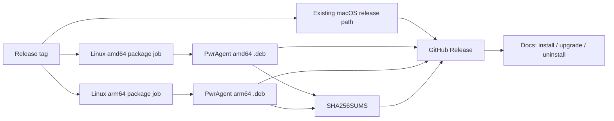

# Linux DEB Distribution

## Summary

Add Ubuntu/Debian `.deb` distribution as a first-class release artifact beside
the existing macOS release path. The implementation extends the current
electron-builder packaging pipeline for Linux metadata, produces `amd64` and
`arm64` `.deb` packages on native GitHub-hosted Linux runners, publishes
checksums, disables Linux auto-update for this manual channel, and documents
install/upgrade/uninstall for operators.

---

## Problem Frame

The app now runs on Ubuntu, but the release machinery is still macOS-centered:
`apps/desktop/scripts/release.mjs` invokes macOS-only electron-builder targets,
`.github/workflows/release.yml` runs on macOS, and the docs only describe the
desktop product rather than Linux installation. The first Linux release should
avoid new hosting and store infrastructure while still feeling like a normal
Ubuntu install.

---

## Requirements

- R1. Produce Linux `.deb` artifacts for both `amd64` and `arm64` on public
  desktop releases.
- R2. Publish Linux artifacts on the existing public GitHub Releases page,
  alongside macOS artifacts for the same version.
- R3. Install PwrAgent only. Do not install Codex CLI, 1Password, OpenAI/xAI
  credentials, messaging credentials, or other user-managed prerequisites.
- R4. Install desktop launcher/menu integration so Linux users can open
  PwrAgent graphically after package installation.
- R5. Support manual upgrade by installing a newer `.deb` over an existing
  package.
- R6. Support clean package and launcher removal, with docs distinguishing app
  removal from optional `~/.pwragent/` data deletion.
- R7. Document Ubuntu/Debian install steps, architecture selection, launch, and
  Codex CLI as a separate prerequisite.
- R8. Document manual upgrade and uninstall steps.
- R9. Publish checksums for Linux artifacts.
- R10. Release notes must say Linux is manual download/install, not apt repo or
  app-store distribution.
- R11. Do not require a new hosting service, CDN, R2 bucket, S3 bucket, or
  custom download service.
- R12. Do not add apt repository, Snap, Flatpak, AppImage, or Linux auto-update
  in this first pass.
- R13. Preserve manual maintainer smoke-testing as the acceptance gate before
  announcing Linux support.

**Origin actors:** A1 Linux developer, A2 Maintainer, A3 PwrAgent app

**Origin flows:** F1 First Linux install, F2 Manual Linux upgrade, F3 Linux
uninstall

**Origin acceptance examples:** AE1 Ubuntu `amd64` install, AE2 Ubuntu `arm64`
install, AE3 Codex CLI remains user-managed, AE4 manual upgrade, AE5 uninstall
data-retention clarity

---

## Scope Boundaries

- No Snap Store, Flatpak, Flathub, AppImage, apt repository, or Linux
  auto-update implementation.
- No custom hosting, CDN, Cloudflare R2, AWS S3, or download service.
- No package-script installation of Codex CLI or credential-management tools.
- No automated install-and-launch smoke-test workflow in this pass.

### Deferred to Follow-Up Work

- AppImage: add only after concrete non-Debian user demand.
- Apt repository: add only when manual `.deb` upgrades become painful enough
  to justify repository signing, metadata generation, hosting, and docs.
- Linux package smoke CI: add after the first manual Linux release proves the
  package shape and if repeated manual testing becomes costly.

---

## Context & Research

### Relevant Code and Patterns

- `apps/desktop/electron-builder.yml` already centralizes product metadata,
  file inclusion/exclusion, ASAR integrity, macOS targets, and GitHub release
  publishing.
- `apps/desktop/scripts/release.mjs` already solves the pnpm workspace problem
  by building, running `pnpm deploy --prod` into `apps/desktop/release-stage/`,
  copying builder inputs, invoking electron-builder from the flat stage, and
  verifying packaged ASAR contents.
- `.github/workflows/release.yml` already uses a two-stage macOS release flow:
  a no-secret prepare job and an environment-gated signing/publish job.
- `.github/workflows/preview-build.yml` shows the current PR-label pattern for
  packaging preview artifacts without changing normal CI.
- `apps/desktop/src/main/auto-updater.ts` currently enables production update
  checks on every platform. Linux needs an explicit skip path because the first
  Linux channel is manual package download/install.
- `docs-site/desktop.md`, `docs-site/settings.md`, and
  `docs-site/_layouts/default.html` are the operator-facing surfaces for
  install/setup guidance and top-level docs navigation.
- `apps/desktop/src/main/__tests__/auto-updater.test.ts` is the existing unit
  seam for update gating behavior.

### Institutional Learnings

- `docs/plans/2026-05-02-004-feat-desktop-release-packaging-plan.md` established
  the release-stage approach specifically because pnpm's symlinked workspace
  graph does not package cleanly through electron-builder's default walk.
- `docs/desktop-release-runbook.md` is the canonical release operator document;
  Linux release steps should extend it rather than create a competing ritual.
- `docs/plans/2026-04-18-002-feat-desktop-e2e-ci-seeding-plan.md` already
  records that replay-backed Electron CI runs successfully on Linux under Xvfb,
  but this Linux package plan intentionally does not add install-and-launch
  smoke CI.
- `docs/solutions/2026-05-07-codex-permission-mode-state-machine.md` reinforces
  that silent routing decisions are a source of bugs. The Linux update skip
  should be explicit and logged, not an accidental fallthrough.

### External References

- Electron Builder supports Linux package targets such as `deb`, Linux metadata
  (`category`, `synopsis`, `description`, desktop-entry fields), and GitHub
  publishing.
- GitHub-hosted runners include native Linux `x64` and Linux `arm64` runner
  labels, including `ubuntu-24.04` and `ubuntu-24.04-arm`, which avoids
  cross-building native Electron modules for the first release.
- GitHub Releases support up to 1000 assets per release and individual assets
  under 2 GiB, enough for this package set.

---

## Key Technical Decisions

- Native Linux builds per architecture: use `ubuntu-24.04` for `amd64` and
  `ubuntu-24.04-arm` for `arm64` so Electron and native modules are packaged on
  matching architecture runners rather than relying on cross-build behavior.
- Release script grows platform selection: keep the existing macOS behavior as
  the default release path, add Linux package modes for `.deb` generation, and
  keep publishing through GitHub Releases.
- Linux updater is explicitly skipped: production Linux packages should not
  invoke electron-updater until an apt repository or Linux auto-update channel
  is intentionally designed.
- Checksums are release artifacts: generate one `SHA256SUMS` file covering the
  Linux `.deb` files and publish it with the release.
- Static release checks over package smoke CI: add assertions that the package
  config/workflow/docs remain aligned, while leaving real install/open testing
  to the maintainer for the first pass.

---

## Open Questions

### Resolved During Planning

- **Where do Linux builds run?** Use native GitHub-hosted Linux runners for both
  architectures, because current GitHub runner docs support `ubuntu-24.04` and
  `ubuntu-24.04-arm`.
- **Should Linux auto-update run?** No. The origin explicitly chose manual
  downloads first, so production Linux builds should report skipped updates
  rather than checking an update feed.
- **Should the package install Codex CLI?** No. The package only installs
  PwrAgent; onboarding and docs cover Codex CLI discovery separately.

### Deferred to Implementation

- Exact system package dependencies for the generated `.deb`: let
  electron-builder's generated package and real Ubuntu install testing reveal
  whether additional `deb.depends` entries are required.
- Exact desktop-entry icon layout: start from `apps/desktop/build/icon.png`,
  then adjust to electron-builder's Linux icon expectations if package
  inspection shows missing launcher icons.
- Exact release-asset naming: preserve the existing PwrAgent naming style while
  ensuring architecture is unambiguous in the `.deb` filename and checksum file.

---

## High-Level Technical Design

> *This illustrates the intended approach and is directional guidance for
> review, not implementation specification. The implementing agent should treat
> it as context, not code to reproduce.*

The Linux path reuses the same release-stage packaging concept as macOS, but
does not enter the macOS signing/notarization job. Linux jobs build native
architecture packages, publish `.deb` artifacts and checksums to the release,
and leave final install/open verification to the maintainer.

---

## Implementation Units

### U1. Gate Production Auto-Updates On Linux

**Goal:** Make the first Linux release explicitly manual-update only, without
accidental electron-updater checks or confusing Settings states.

**Requirements:** R10, R12; supports AE4 by making manual upgrade the only
Linux update path.

**Dependencies:** None

**Files:**
- Modify: `apps/desktop/src/main/auto-updater.ts`
- Modify: `apps/desktop/src/main/__tests__/auto-updater.test.ts`
- Modify: `apps/desktop/src/renderer/src/features/update/AppUpdateBanner.tsx`
- Modify: `apps/desktop/src/renderer/src/features/update/__tests__/AppUpdateBanner.test.tsx`

**Approach:**
- Add a production Linux skip path that returns a clear "manual Linux package
  updates" result instead of calling electron-updater.
- Keep macOS update behavior unchanged.
- Ensure any visible update surface treats this skip as a non-error state.
- Log the skip with enough structured context to distinguish "manual Linux
  channel" from update failures.

**Patterns to follow:**
- Existing development skip behavior in `auto-updater.ts`.
- Existing update status tests in `auto-updater.test.ts`.
- Logging discipline from `docs/solutions/2026-05-07-codex-permission-mode-state-machine.md`.

**Test scenarios:**
- Happy path: given `process.platform` is Linux and production updates are
  enabled, startup update checks return a skipped/manual-channel result and do
  not call electron-updater.
- Happy path: given `process.platform` is macOS and production updates are
  enabled, existing update checks still call electron-updater.
- Integration: Settings/About or update banner surfaces the Linux manual-update
  state without presenting it as an error.
- Edge case: repeated manual checks on Linux stay idempotent and do not start
  an in-flight update request.

**Verification:**
- Linux production update checks are visibly/manual skipped in tests.
- Existing macOS updater tests continue to pass without behavior changes.

---

### U2. Add Linux DEB Packaging Metadata

**Goal:** Teach electron-builder how to create Ubuntu/Debian `.deb` packages
with launcher integration and PwrAgent metadata.

**Requirements:** R1, R3, R4, R5, R6; covers F1, F2, F3 and AE1, AE2, AE3, AE5.

**Dependencies:** U1

**Files:**
- Modify: `apps/desktop/electron-builder.yml`
- Modify: `apps/desktop/package.json`
- Modify: `apps/desktop/build/icon.png`
- Test: `apps/desktop/src/main/__tests__/linux-packaging-config.test.ts`

**Approach:**
- Add a `linux` electron-builder section for product category, synopsis,
  description, vendor/maintainer metadata, icon source, and desktop-entry
  fields such as startup class/comment.
- Add `deb` configuration for package priority and any confirmed runtime
  system dependencies.
- Configure artifact naming so release assets clearly include product, version,
  Linux package format, and architecture.
- Keep target set to `.deb` only. Do not add Snap, Flatpak, AppImage, RPM, or
  Pacman targets.
- Do not add package scripts that install Codex CLI or credential tools.

**Patterns to follow:**
- Existing macOS metadata in `electron-builder.yml`.
- Existing package ownership/license metadata in `apps/desktop/package.json`.
- Electron Builder Linux metadata docs.

**Test scenarios:**
- Happy path: static config test confirms Linux packaging target is `.deb` and
  no other Linux target is enabled.
- Happy path: static config test confirms Linux metadata includes desktop-entry
  fields needed for launcher integration.
- Edge case: static config test confirms artifact naming includes architecture
  so `amd64` and `arm64` files cannot overwrite each other.
- Error path: static config test fails if package scripts or package metadata
  introduce Codex CLI installation behavior.

**Verification:**
- Electron-builder config has a Linux `.deb` target and launcher metadata.
- Static packaging config tests protect the scope boundaries.

---

### U3. Extend Release Orchestration For Linux Packages And Checksums

**Goal:** Reuse the existing release-stage approach to build Linux packages and
generate checksums without disturbing the macOS signing path.

**Requirements:** R1, R2, R5, R9, R13; covers F2 and AE4.

**Dependencies:** U2

**Files:**
- Modify: `apps/desktop/scripts/release.mjs`
- Modify: `apps/desktop/scripts/verify-asar-contents.mjs`
- Modify: `apps/desktop/package.json`
- Test: `apps/desktop/src/main/__tests__/release-packaging-scripts.test.ts`

**Approach:**
- Add Linux package mode to the release orchestrator while keeping the existing
  macOS default behavior stable.
- Preserve the current build/deploy/stage pattern so Linux packaging gets the
  same flat `node_modules` and ASAR filtering as macOS.
- Invoke electron-builder with Linux `.deb` targets and the current runner
  architecture.
- Extend ASAR verification so it can validate the Linux unpacked app output as
  well as macOS `.app` output.
- Generate a `SHA256SUMS` artifact for Linux `.deb` files after package
  creation.
- Add package scripts for local Linux package generation, named clearly enough
  that they are not confused with macOS signing/release commands.

**Patterns to follow:**
- Existing `release.mjs` stage preparation and Apple API key isolation.
- Existing `verify-asar-contents.mjs` forbidden-file checks.
- Existing package script naming in `apps/desktop/package.json`.

**Test scenarios:**
- Happy path: release script option parsing selects existing macOS packaging
  when no Linux mode is requested.
- Happy path: release script option parsing selects Linux `.deb` packaging
  without macOS signing/notarization inputs.
- Edge case: checksum generation includes every `.deb` artifact in the package
  output and excludes non-package debug files.
- Error path: ASAR verification fails clearly when a Linux package output is
  missing the expected ASAR location.

**Verification:**
- Local Linux packaging can produce a `.deb` and `SHA256SUMS` from the staged
  app.
- Existing macOS release modes remain represented and protected by tests.

---

### U4. Publish Linux Artifacts From Native GitHub Runners

**Goal:** Add release jobs that build and upload native `amd64` and `arm64`
Linux `.deb` artifacts to the same GitHub Release as macOS, without adding
install/open smoke CI.

**Requirements:** R1, R2, R9, R11, R13; covers AE1 and AE2 at artifact
production level, with manual install/open verification remaining outside CI.

**Dependencies:** U3

**Files:**
- Modify: `.github/workflows/release.yml`
- Modify: `.github/workflows/README.md`
- Test: `apps/desktop/src/main/__tests__/release-workflow.test.ts`

**Approach:**
- Add Linux package jobs to the existing release workflow using native
  `ubuntu-24.04` and `ubuntu-24.04-arm` runners.
- Keep these jobs separate from the macOS signing/notarization environment so
  Apple secrets are never exposed to Linux packaging.
- Publish `.deb` files and `SHA256SUMS` through GitHub Releases using the same
  release tag.
- Upload Linux artifacts as workflow artifacts for debugging even when publish
  fails.
- Avoid adding install-and-launch smoke tests in CI; the maintainer remains the
  first Linux release smoke-test gate.

**Patterns to follow:**
- Existing release workflow's separation between no-secret preparation and
  environment-gated macOS signing.
- Existing `.github/workflows/README.md` table for CI-triggering labels and
  workflow behavior.
- GitHub Actions runner docs for native arm64 Linux labels.

**Test scenarios:**
- Happy path: static workflow test confirms release workflow contains separate
  Linux package jobs for `amd64` and `arm64`.
- Happy path: static workflow test confirms Linux jobs do not reference Apple
  signing/notarization secrets.
- Happy path: static workflow test confirms Linux jobs upload `.deb` artifacts
  and checksum artifacts to the release.
- Edge case: static workflow test confirms Linux jobs use architecture-specific
  runner labels rather than cross-building both artifacts on one runner.

**Verification:**
- Release workflow can produce and publish Linux `.deb` assets for both
  architectures on a tag.
- The workflow does not create a new hosting surface or package repository.

---

### U5. Document Linux Install, Upgrade, Uninstall, And Release Ops

**Goal:** Make Linux installation understandable from the public docs and keep
release operations aligned with the new artifacts.

**Requirements:** R5, R6, R7, R8, R10, R13; covers F1, F2, F3 and AE1-AE5.

**Dependencies:** U1, U2, U3

**Files:**
- Create: `docs-site/linux.md`
- Modify: `docs-site/_layouts/default.html`
- Modify: `docs-site/desktop.md`
- Modify: `docs/desktop-release-runbook.md`
- Modify: `CHANGELOG.md`
- Test: `docs-site/.pa11yci.json`

**Approach:**
- Add a Linux docs page focused on Ubuntu/Debian `.deb` install, architecture
  selection, first launch, Codex CLI prerequisite handling, manual upgrade,
  uninstall, and optional `~/.pwragent/` data deletion.
- Add top-nav or desktop-nav entry points so Linux docs are discoverable without
  burying them under an unrelated setup section.
- Update the desktop page to point Linux users to the dedicated install page.
- Update the release runbook with Linux artifact expectations, checksum
  generation, manual smoke-test checklist, and release-note expectations.
- Add release-note wording for the first Linux manual channel once the exact
  target release is known.

**Patterns to follow:**
- Operator-facing tone and accessibility rules in `docs-site/AGENTS.md`.
- Existing docs-site page frontmatter and nav structure.
- Existing release ritual in `docs/desktop-release-runbook.md`.

**Test scenarios:**
- Happy path: docs-site accessibility config includes the new Linux page for
  audit coverage.
- Happy path: docs content includes install, upgrade, uninstall, architecture
  choice, checksum verification, and Codex CLI prerequisite guidance.
- Edge case: uninstall docs distinguish package removal from optional
  `~/.pwragent/` data deletion.
- Error path: docs explain what it means if Codex CLI is missing after PwrAgent
  is installed.

**Verification:**
- The public docs can guide a user through install, manual upgrade, uninstall,
  and first launch without maintainer handholding.
- Release runbook gives the maintainer a manual Linux smoke-test checklist.

---

### U6. Add Release Alignment Checks

**Goal:** Catch drift between the requirements, package config, release
workflow, and docs without adding full package smoke CI.

**Requirements:** R1-R13; protects all origin flows and acceptance examples at
the static-contract level.

**Dependencies:** U2, U3, U4, U5

**Files:**
- Modify: `scripts/check-desktop-release-metadata.mjs`
- Modify: `package.json`
- Test: `apps/desktop/src/main/__tests__/release-metadata-config.test.ts`

**Approach:**
- Extend release metadata checks to assert Linux artifact expectations that can
  be verified statically: version/tag alignment, package scripts present,
  Linux `.deb` target configured, release workflow has native Linux jobs, and
  docs contain install/upgrade/uninstall anchors.
- Keep checks deterministic and fast so they can run in existing CI/release
  metadata validation.
- Do not make these checks depend on actually building or installing Linux
  packages.

**Patterns to follow:**
- Existing `scripts/check-desktop-release-metadata.mjs` tag/version/changelog
  validation.
- Existing CI release metadata check in `.github/workflows/release.yml`.

**Test scenarios:**
- Happy path: release metadata test passes when Linux package config, workflow,
  package scripts, docs, and changelog are aligned.
- Edge case: metadata test fails if the workflow has only `amd64` or only
  `arm64` Linux packaging.
- Error path: metadata test fails if release notes omit the manual Linux
  channel wording for a release that includes Linux artifacts.
- Error path: metadata test fails if Linux package config adds a forbidden
  target such as Snap, Flatpak, AppImage, or RPM in the first-pass scope.

**Verification:**
- Existing release checks fail loudly when the Linux release contract drifts.
- Static checks run without package build, install, or external service access.

---

## System-Wide Impact

- **Interaction graph:** Release tags now fan out to macOS signing and Linux
  package jobs. Linux jobs publish unsigned package artifacts and checksums;
  macOS jobs retain Apple signing/notarization isolation.
- **Error propagation:** Linux packaging failures should fail the release
  workflow without affecting Apple signing secrets. Checksum generation failure
  should block publishing Linux packages.
- **State lifecycle risks:** Installing or uninstalling the `.deb` must not
  delete `~/.pwragent/` by default; docs own the user-data cleanup distinction.
- **API surface parity:** The app remains the same runtime product across macOS
  and Linux, but update behavior intentionally differs: macOS can auto-update,
  Linux manual packages skip auto-update.
- **Integration coverage:** Manual smoke testing must cover install, launcher
  appearance, first launch, onboarding with missing Codex CLI, upgrade, and
  uninstall on Ubuntu.
- **Unchanged invariants:** No Codex CLI installation, no credential mutation,
  no new hosting provider, and no store packaging.

---

## Risks & Dependencies

| Risk | Mitigation |
|------|------------|
| Native module packaging differs between architectures | Build on native `ubuntu-24.04` and `ubuntu-24.04-arm` runners rather than cross-building. |
| Linux auto-updater accidentally checks a feed despite manual-channel scope | Add explicit Linux skip behavior and tests before packaging. |
| Desktop launcher entry exists but icon/startup class is poor | Include launcher metadata in package config and manual smoke-test the installed menu entry. |
| Release workflow uploads incomplete Linux assets | Generate checksums after package creation and add static workflow/config checks for both architectures. |
| Docs imply package install configures Codex CLI | Make Codex CLI a separate prerequisite in Linux docs and test static docs content. |
| Linux package dependencies are incomplete on fresh Ubuntu | Defer exact dependency list to implementation-time package inspection and maintainer smoke-test, then encode confirmed dependencies in `deb.depends`. |

---

## Documentation / Operational Notes

- The Linux docs page should be operator-facing, not implementation-facing.
  Avoid electron-builder details there.
- The release runbook should clearly mark Linux as manual package distribution,
  separate from macOS auto-update.
- Release notes for the first Linux build should include architecture-specific
  downloads, checksum file location, and the manual upgrade model.
- The maintainer smoke-test checklist should include both `amd64` and `arm64`
  where hardware/VM access is available.

---

## Alternative Approaches Considered

- AppImage in the first pass: rejected for now because Ubuntu/Debian `.deb`
  install gives better native launcher and uninstall behavior for the tested
  path.
- Apt repository in the first pass: rejected because repository signing,
  metadata generation, hosting, and update docs are carrying cost before demand
  is proven.
- Snap/Flatpak first: rejected because sandbox/store constraints are a poor
  first fit for a development agent that needs host filesystem, shell, Git, and
  user-installed CLI access.
- Release-only public repo: rejected because the source repository is already
  public, so the main repo's GitHub Releases page is the simplest zero-cost
  channel.
- Cross-building both `.deb` artifacts on one runner: rejected as the default
  because native Electron modules make architecture-specific native runners the
  lower-risk first implementation.

---

## Sources & References

- **Origin document:** [docs/brainstorms/2026-05-23-linux-packaging-distribution-requirements.md](../brainstorms/2026-05-23-linux-packaging-distribution-requirements.md)
- Existing release config: `apps/desktop/electron-builder.yml`
- Existing release orchestrator: `apps/desktop/scripts/release.mjs`
- Existing ASAR guard: `apps/desktop/scripts/verify-asar-contents.mjs`
- Existing release workflow: `.github/workflows/release.yml`
- Existing release runbook: `docs/desktop-release-runbook.md`
- Existing release packaging plan: `docs/plans/2026-05-02-004-feat-desktop-release-packaging-plan.md`
- Electron Builder docs: Linux targets and metadata options
- GitHub Docs: GitHub-hosted runner labels and GitHub Releases asset limits
