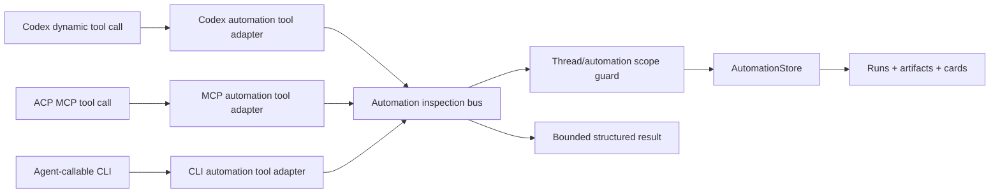

# feat: Expose automation history through agent tools

## Summary

Build one shared read-only automation inspection substrate, then expose it to
Agent threads through Codex dynamic tools and ACP-compatible MCP/CLI adapters.
This replaces the temporary synthetic "automation context" user-message bridge
with an explicit tool surface: automation cards and run artifacts remain
out-of-band, and the Agent asks PwrAgent for details only when needed.

---

## Problem Frame

PR #552 made Agent-attached automations usable, but it also introduced a
short-term bridge that prepends recent automation results into the next
non-automation turn. That helped the Agent answer "did the weather checker run?"
but made the operator's actual user message dirty and represented automation
history as fake user-provided context.

The refined automation requirements are different: the Agent should discover
attached automation capabilities and fetch recent run artifacts through tools.
Automation cards stay source-labeled timeline items, not assistant messages, and
not every automation result should be shoved into the prompt.

## Requirements

- R1. Agent turns must preserve the real user message without prepending recent
  automation output as a synthetic user message.
- R2. PwrAgent must expose read-only automation inspection operations for an
  Agent's attached automations: list automations, list runs, inspect a run,
  inspect a run artifact, and summarize current automation status.
- R3. The operation implementation must be shared across exposure paths so Codex
  dynamic tools and ACP/MCP/CLI adapters cannot drift in behavior.
- R4. Tool results must be scoped to the current Agent thread by default and
  must not allow one Agent to enumerate or inspect another Agent's automation
  history accidentally.
- R5. Tool outputs must be bounded and structured for agent use: compact lists by
  default, explicit limits for run history and captured transcript events, and
  artifact detail only on request.
- R6. Codex Agent threads must receive PwrAgent automation inspection tools
  through the Codex dynamic tools protocol where the protocol supports it.
- R7. ACP-backed Agent threads must have an equivalent MCP-first exposure plan,
  with a CLI fallback for ACP bridges that cannot accept per-session MCP server
  configuration.
- R8. The existing automation cards, run artifacts, run history UI, and
  messaging notifications must keep working while the prompt-injection bridge is
  removed.
- R9. This plan must remain read-only. Mutation/domain action tools such as
  pause, resume, run-now, delete, or package maintenance are explicitly deferred.

**Origin actors:** Agent thread user, attached automation, Codex backend, ACP backend.
**Origin flows:** Agent asks about recent automation output; scheduled automation
posts an out-of-band card; Agent fetches run/artifact details through a tool.
**Origin acceptance examples:** Agent can answer questions about recent
automation outputs by discovering attached automation capabilities and fetching
artifacts by tool.

## Scope Boundaries

- In scope: shared read-only inspection operations, Codex dynamic tool specs and
  call handling, ACP MCP/CLI exposure strategy, bounded outputs, thread scoping,
  and removal of the synthetic automation-history turn-input bridge.
- Out of scope: automation mutation tools, executable card buttons, domain
  action tools, changing schedule/backlog semantics, cloud/daemon execution, and
  adding new RBAC semantics.
- Out of scope: treating automation cards as assistant messages or replaying all
  automation outputs into every Agent prompt.

### Deferred to Follow-Up Work

- Domain action tools: separate plan/issue after read-only inspection is proven.
- Per-automation package-defined tool catalogs: separate package/skills work once
  reusable automation packages exist.
- ACP bridge enhancements for per-session MCP injection if the active ACP bridge
  rejects that capability; this plan should add a compatible path, not silently
  assume support.

## Context & Research

### Relevant Code and Patterns

- `packages/shared/src/contracts/automations.ts` already defines automation
  details, run summaries, run artifacts, cards, output decisions, and IPC shapes.
- `apps/desktop/src/main/automations/automation-store.ts` persists automations,
  runs, latest-run lookup, thread-scoped run lists, and run artifacts.
- `apps/desktop/src/main/automations/desktop-automation-service.ts` owns the
  desktop automation orchestration and currently registers the temporary
  automation turn context provider.
- `apps/desktop/src/main/app-server/backend-registry.ts` owns thread admission,
  server request handling, Codex start/resume flows, and the temporary
  `AutomationTurnContextProvider`.
- `apps/desktop/src/main/codex-app-server/client.ts` already receives generated
  `item/tool/call` server requests, but currently treats only approval,
  user-input, and MCP elicitation requests as handled.
- `packages/codex-app-server-protocol/src/v2/ThreadStartParams.ts` includes
  `dynamicTools`, while `TurnStartParams.ts` does not. Dynamic tools are a
  thread-start capability, not a per-turn attachment.
- `apps/desktop/src/main/acp/acp-client.ts` currently sends `mcpServers: []` for
  `session/new` and `session/load`.
- OpenClaw's Codex integration exposes plugin tools through dynamic tool specs,
  handles `item/tool/call`, fingerprints tool catalogs, and uses MCP server
  config for other runtimes. That pattern maps well to PwrAgent's split between
  Codex dynamic tools and ACP MCP/CLI adapters.
- OpenClaw's ACP bridge currently rejects non-empty per-session `mcpServers`.
  PwrAgent should plan for that kind of backend capability variance.
- `apps/desktop/src/main/messaging/core/messaging-controller.ts` is the right
  architectural analogy: transport adapters should be thin, while domain
  decisions live in desktop-owned services. The automation inspection bus should
  copy that separation, not the full messaging runtime size.

### Institutional Learnings

- `docs/solutions/2026-05-07-codex-permission-mode-state-machine.md` emphasizes
  removing structurally-confusing state paths instead of compensating for them
  later. Apply that here by removing the prompt-context shim once tools exist,
  rather than trying to make fake user messages less bad.
- The merged automation scheduling work established local scheduler semantics,
  run artifacts, card publication, and Agent thread attachment. This plan should
  reuse that foundation and avoid reopening the scheduler model.

### External References

- OpenClaw local source:
  - `/Users/huntharo/github/openclaw/extensions/codex/src/app-server/dynamic-tools.ts`
  - `/Users/huntharo/github/openclaw/extensions/codex/src/app-server/run-attempt.ts`
  - `/Users/huntharo/github/openclaw/src/agents/codex-mcp-config.ts`
  - `/Users/huntharo/github/openclaw/src/acp/translator.ts`
- GitHub issue: [#555 Expose automation history through agent-callable tools](https://github.com/pwrdrvr/PwrAgent/issues/555)

## Key Technical Decisions

- **One domain bus, multiple transport adapters.** Implement a small typed
  automation inspection service/bus that accepts an operation name, scoped
  caller context, and JSON-like arguments. Codex dynamic tools, MCP tools, and
  CLI commands adapt into that service instead of querying the store directly.
- **Read-only first.** The first tool catalog only inspects attached automation
  state and run artifacts. This avoids approval semantics and destructive
  ambiguity while proving the Agent-discovery model.
- **Thread-scoped by construction.** Adapters supply the current backend/thread
  context. The bus verifies that requested automation/run ids belong to that
  context before returning data.
- **Codex uses dynamic tools, not MCP, for the first-class path.** PwrAgent's
  Codex app-server protocol already supports `dynamicTools` and
  `item/tool/call`; this avoids requiring Codex to discover an additional local
  MCP server for the in-app backend.
- **ACP uses MCP when the backend can accept it, CLI/config fallback otherwise.**
  ACP backends are not uniform. The plan should add an MCP-compatible adapter,
  but also expose the same operations through a local CLI fallback so ACP agents
  without per-session MCP injection still have a path.
- **No more automation-history user-message bridge.** Once tool exposure is
  available, remove or disable the temporary `AutomationTurnContextProvider`.
  Capability discovery belongs in tool catalogs and compact tool descriptions,
  not in fake user input.
- **Bounded outputs are part of the contract.** List operations return compact
  summaries by default. Artifact inspection can return richer details but still
  applies limits to transcript events, rollout snippets, and raw text.

## Open Questions

### Resolved During Planning

- **Should this plan include mutation tools?** No. Keep the first implementation
  read-only and defer domain action tools.
- **Should PwrAgent use Codex dynamic tools or MCP for Codex?** Use dynamic tools
  first. The protocol is already present, and OpenClaw has validated the pattern.
- **Can dynamic tools be attached on every Codex turn?** Not through the current
  generated `TurnStartParams`. Plan around thread-start/resume behavior and
  catalog fingerprinting instead of assuming per-turn tool attachment.
- **Should the shared code be a full messaging-runtime clone?** No. Reuse the
  separation pattern, not the implementation size: a focused inspection bus with
  thin adapters is enough.

### Deferred to Implementation

- Exact Codex dynamic-tool catalog refresh behavior for already-started threads
  after automation attachments change. Implementation should characterize
  whether thread resume can refresh the catalog or whether tool changes require a
  new thread-start path/fingerprint warning.
- Exact ACP MCP transport for each backend. If an ACP backend rejects per-session
  MCP servers, the implementation should leave MCP available where supported and
  use the CLI fallback/documented config path for that backend.
- Exact output size caps after inspecting current artifact sizes in dev profile
  data. Defaults should be conservative and test-covered.

## Output Structure

    packages/shared/src/contracts/
      automation-tools.ts
      __tests__/automation-tools.test.ts
    apps/desktop/src/main/automations/
      automation-inspection-bus.ts
      automation-inspection-codex-tools.ts
      automation-inspection-mcp.ts
      automation-inspection-cli.ts
    apps/desktop/src/main/codex-app-server/
      client.ts
    apps/desktop/src/main/app-server/
      backend-registry.ts
    apps/desktop/src/main/acp/
      acp-client.ts

The exact filenames may change during implementation, but the shape should stay
the same: shared contracts, one domain bus, and separate transport adapters.

## High-Level Technical Design

> *This illustrates the intended approach and is directional guidance for review, not implementation specification. The implementing agent should treat it as context, not code to reproduce.*

The bus should expose stable operations such as:

- `list_automations`: compact attached automation summaries for the current
  Agent thread.
- `summarize_automation_status`: convenience status for common user questions.
- `list_automation_runs`: recent runs for one automation or the current Agent
  thread, bounded by limit/since filters.
- `get_automation_run`: one run's status, trigger, timing, output decision, and
  error metadata.
- `get_automation_run_artifact`: one run's stored output card, final response,
  transcript/event excerpt, and rollout/debug metadata within caps.

Tool names should be namespace-stable and easy for agents to discover. The
first pass can use a single PwrAgent automation namespace rather than generating
one physical dynamic tool per automation; per-automation names can be layered on
later when package-defined tools exist.

## Implementation Units

### U1. Shared Automation Inspection Contracts

**Goal:** Define the read-only operation catalog, argument/result shapes, scoped
caller context, and output caps shared by all adapters.

**Requirements:** R2, R3, R4, R5, R9

**Dependencies:** None

**Files:**
- Create: `packages/shared/src/contracts/automation-tools.ts`
- Modify: `packages/shared/src/contracts/__tests__/automations.test.ts`
- Test: `packages/shared/src/contracts/__tests__/automation-tools.test.ts`

**Approach:**
- Add operation names and TypeScript contracts for request context, request
  args, normalized results, and structured errors.
- Keep contracts JSON-serializable so the same shapes work for Codex dynamic
  tool responses, MCP JSON-RPC, and a CLI.
- Include default limits in the contract layer, but keep enforcement in the bus.

**Patterns to follow:**
- `packages/shared/src/contracts/automations.ts`
- `packages/shared/src/contracts/normalized-app-server.ts`

**Test scenarios:**
- Happy path: each operation name has a stable schema and default limit metadata.
- Edge case: invalid limit/since/filter values normalize or reject consistently.
- Error path: cross-thread and not-found errors have stable machine-readable
  codes without leaking unrelated automation details.

**Verification:**
- Shared contract tests pass and no renderer imports from desktop main code are
  introduced.

### U2. Automation Inspection Bus

**Goal:** Implement the shared read-only domain service that resolves operation
requests against `AutomationStore`, enforces Agent-thread scoping, and returns
bounded structured results.

**Requirements:** R2, R3, R4, R5, R8, R9

**Dependencies:** U1

**Files:**
- Create: `apps/desktop/src/main/automations/automation-inspection-bus.ts`
- Modify: `apps/desktop/src/main/automations/desktop-automation-service.ts`
- Test: `apps/desktop/src/main/__tests__/desktop-automation-service.test.ts`
- Test: `apps/desktop/src/main/__tests__/automation-inspection-bus.test.ts`

**Approach:**
- Wire the bus near `DesktopAutomationService` so it can reuse the existing store
  and publication lifecycle without duplicating persistence logic.
- Require caller context with backend id and Agent thread id.
- Verify requested automation ids and run ids belong to the caller's Agent thread
  before returning details.
- Produce compact summaries by default and richer artifact details only through
  explicit artifact inspection.

**Patterns to follow:**
- `apps/desktop/src/main/automations/automation-store.ts`
- `apps/desktop/src/main/automations/desktop-automation-service.ts`

**Test scenarios:**
- Happy path: an Agent with two attached automations can list them, list recent
  runs, and inspect an artifact.
- Edge case: limit caps prevent huge transcripts or rollout details from
  returning unbounded text.
- Error path: an Agent cannot inspect another thread's automation or run id.
- Error path: deleted/missing automations return stable not-found results.

**Verification:**
- The same bus tests exercise all operations without using Codex, ACP, renderer,
  or messaging adapters.

### U3. Codex Dynamic Tool Adapter

**Goal:** Expose the shared inspection bus to Codex Agent threads through Codex
dynamic tools and handle `item/tool/call` requests inside PwrAgent.

**Requirements:** R3, R4, R5, R6, R8

**Dependencies:** U1, U2

**Files:**
- Create: `apps/desktop/src/main/automations/automation-inspection-codex-tools.ts`
- Modify: `apps/desktop/src/main/codex-app-server/client.ts`
- Modify: `apps/desktop/src/main/app-server/backend-registry.ts`
- Test: `apps/desktop/src/main/__tests__/codex-client.test.ts`
- Test: `apps/desktop/src/main/__tests__/backend-registry.test.ts`

**Approach:**
- Add `dynamicTools` plumbing to Codex thread start where it is currently
  missing in the desktop client.
- Treat `item/tool/call` as a handled server request and route matching
  PwrAgent automation tool calls to the adapter.
- Build tool specs from the shared operation catalog with concise descriptions
  and JSON schemas.
- Scope tool calls to the active Agent thread context and return Codex dynamic
  tool response content from the shared bus result.
- Add catalog fingerprint/logging so attachment changes are observable when a
  thread's tool catalog may be stale.

**Patterns to follow:**
- OpenClaw `extensions/codex/src/app-server/dynamic-tools.ts`
- OpenClaw `extensions/codex/src/app-server/run-attempt.ts`
- Existing PwrAgent request handling in `backend-registry.ts`

**Test scenarios:**
- Happy path: starting a Codex Agent thread includes automation dynamic tool
  specs when automations are attached.
- Happy path: a matching `item/tool/call` returns bounded automation data.
- Edge case: an unknown PwrAgent automation tool returns a tool error rather than
  falling through to generic request handling.
- Error path: a tool call for the wrong thread id or non-Agent thread is rejected.
- Integration: existing approval/user-input/MCP elicitation server requests still
  route as before.

**Verification:**
- Backend-registry tests prove Codex dynamic tool calls can answer "what happened
  with my automation?" without mutating the user turn input.

### U4. ACP MCP and CLI Exposure Adapter

**Goal:** Expose the same read-only inspection operations to ACP agents through
an MCP-compatible surface where supported and a CLI fallback where per-session
MCP injection is unavailable.

**Requirements:** R3, R4, R5, R7, R8, R9

**Dependencies:** U1, U2

**Files:**
- Create: `apps/desktop/src/main/automations/automation-inspection-mcp.ts`
- Create: `apps/desktop/src/main/automations/automation-inspection-cli.ts`
- Modify: `apps/desktop/src/main/acp/acp-client.ts`
- Test: `apps/desktop/src/main/__tests__/acp-client.test.ts`
- Test: `apps/desktop/src/main/__tests__/automation-inspection-mcp.test.ts`
- Test: `apps/desktop/src/main/__tests__/automation-inspection-cli.test.ts`

**Approach:**
- Implement MCP tool list/call handling over the same operation catalog and bus.
- Add ACP capability detection/configuration so PwrAgent only passes MCP server
  config when the target backend accepts it.
- For ACP bridges that reject per-session MCP servers, expose a local
  agent-callable CLI using the same operation names and JSON outputs.
- Ensure both MCP and CLI paths require enough thread context to preserve the
  same scope guard as the Codex dynamic tool path.

**Patterns to follow:**
- `apps/desktop/src/main/acp/acp-client.ts`
- OpenClaw `src/agents/codex-mcp-config.ts`
- OpenClaw `src/acp/translator.ts`

**Test scenarios:**
- Happy path: MCP `tools/list` and `tools/call` expose the same operations and
  return the same normalized data as the bus.
- Happy path: CLI command returns JSON for a valid Agent thread context.
- Edge case: ACP backend that rejects per-session MCP servers does not fail
  session creation because of an unconditional non-empty `mcpServers` payload.
- Error path: missing/invalid thread context fails closed.

**Verification:**
- ACP client tests cover both supported-MCP and fallback/no-MCP backend behavior.

### U5. Remove Synthetic Automation Context Injection

**Goal:** Retire the temporary bridge that prepends recent automation history to
the next user turn once tool access exists.

**Requirements:** R1, R6, R7, R8

**Dependencies:** U2, U3

**Files:**
- Modify: `apps/desktop/src/main/automations/desktop-automation-service.ts`
- Modify: `apps/desktop/src/main/app-server/backend-registry.ts`
- Modify: `apps/desktop/src/main/__tests__/desktop-automation-service.test.ts`
- Modify: `apps/desktop/src/main/__tests__/backend-registry.test.ts`
- Modify: `apps/desktop/src/renderer/src/lib/__tests__/useThreadSessionState.test.tsx`

**Approach:**
- Remove or disable `AutomationTurnContextProvider` registration.
- Delete the turn-input formatting helper if it is no longer used.
- Replace tests that assert context injection with tests that assert the user
  message remains unchanged and tool discovery is available.
- Keep transcript cards and messaging delivery paths unchanged; only remove the
  fake user-message context.

**Patterns to follow:**
- Existing `thread/automations/updated` and `automation/run/updated` events.
- Existing transcript-card rendering from #552.

**Test scenarios:**
- Happy path: user sends "did the weather checker run?" and the submitted user
  message remains exactly that text.
- Happy path: the Agent can still answer after calling the inspection tool.
- Edge case: no attached automations means no synthetic context and no tool
  catalog beyond the safe empty-state behavior.
- Integration: automation cards still appear in the thread timeline and
  messaging surfaces.

**Verification:**
- No test or runtime path constructs a fake `## Automation Context` user message
  for ordinary user turns.

### U6. Documentation, Logging, and Manual Test Path

**Goal:** Make the feature observable enough to debug agent tool access without
digging through protocol dumps.

**Requirements:** R5, R6, R7, R8

**Dependencies:** U3, U4, U5

**Files:**
- Modify: `docs/brainstorms/2026-05-22-agent-thread-attached-automations-requirements.md` only if a confirmed requirement correction is needed; otherwise do not edit the brainstorm.
- Modify: relevant desktop developer docs if an automation testing note already exists.
- Test: focused unit/integration tests from U3-U5.

**Approach:**
- Add structured logs for tool catalog attachment, tool calls, scope denials,
  and bus operation results with bounded lengths.
- Add a short manual test recipe in the implementation PR description or docs:
  create an Agent thread, attach a weather-like automation, let it run, ask the
  Agent what happened, and confirm the answer comes from a tool call rather than
  injected user context.
- Keep logs free of full artifact bodies unless protocol/debug logging is
  explicitly enabled.

**Patterns to follow:**
- Existing `pwragent:automations`, `pwragent:backend-registry`, and
  `pwragent:messaging` structured log style.

**Test scenarios:**
- Integration: a tool call produces useful greppable logs with thread id,
  automation id/run id when present, operation name, and bounded result size.
- Error path: scope-denied tool calls log enough to debug without leaking the
  denied artifact.

**Verification:**
- CI passes and the manual test path can distinguish "Agent used tool" from
  "Agent saw injected prompt context."

## System-Wide Impact

- **Interaction graph:** Codex server request handling gains a new handled path
  for `item/tool/call`; ACP session setup may gain conditional MCP configuration
  or CLI instructions; automation service becomes the owner of read-only tool
  operations.
- **Error propagation:** Tool errors should return structured tool-call errors,
  not crash turns or fall through to pending server-request UI. Scope denials
  fail closed.
- **State lifecycle risks:** Dynamic tool catalogs can become stale if
  automations are attached/detached after a Codex thread starts. The
  implementation must log/fingerprint catalog state and avoid pretending tools
  updated when the upstream protocol did not accept an update.
- **API surface parity:** Codex dynamic tools, ACP MCP, and CLI should all map to
  the same bus operations and result contracts.
- **Integration coverage:** Unit tests alone will not prove the Agent uses the
  tools. Manual or replay-backed integration should verify the submitted user
  message is clean and the Agent can fetch automation history.
- **Unchanged invariants:** Automation schedules, coalesce/drop behavior,
  persisted run artifacts, card publication, and messaging delivery semantics
  should not change in this plan.

## Risks & Dependencies

| Risk | Mitigation |
|------|------------|
| Codex dynamic tool catalogs are thread-start scoped and may not refresh for existing threads. | Add catalog fingerprint logging and implementation-time characterization; do not reintroduce prompt injection as the fallback. |
| ACP backends differ in MCP support. | Capability-gate per-session MCP config and provide a CLI/config fallback using the same bus. |
| Tool output leaks another Agent's automation history. | Make backend/thread context required and verify every requested automation/run against it. |
| Tool outputs get too large and become another prompt-stuffing path. | Enforce default limits and require explicit artifact inspection for detailed output. |
| Three exposure paths drift. | Keep all domain logic in the shared bus and test adapters against the same contract fixtures. |

## Documentation / Operational Notes

- PR notes should explicitly say the synthetic automation context bridge is
  removed or disabled, and explain how to test by inspecting tool-call logs.
- The user-facing behavior should remain: automation cards appear in the Agent
  timeline and messaging surfaces; asking the Agent about them should work after
  the Agent calls a tool.
- Avoid editing the origin brainstorm unless the product decision changes; this
  plan is the implementation artifact for issue #555.

## Sources & References

- **Origin document:** [docs/brainstorms/2026-05-22-agent-thread-attached-automations-requirements.md](../brainstorms/2026-05-22-agent-thread-attached-automations-requirements.md)
- Related plan: [docs/plans/2026-05-23-001-feat-agent-attached-automation-delta-plan.md](2026-05-23-001-feat-agent-attached-automation-delta-plan.md)
- Related issue: [#555 Expose automation history through agent-callable tools](https://github.com/pwrdrvr/PwrAgent/issues/555)
- Related code: `apps/desktop/src/main/automations/desktop-automation-service.ts`
- Related code: `apps/desktop/src/main/app-server/backend-registry.ts`
- Related code: `apps/desktop/src/main/codex-app-server/client.ts`
- Related code: `apps/desktop/src/main/acp/acp-client.ts`
- Institutional learning: [docs/solutions/2026-05-07-codex-permission-mode-state-machine.md](../solutions/2026-05-07-codex-permission-mode-state-machine.md)
- OpenClaw reference: `/Users/huntharo/github/openclaw/extensions/codex/src/app-server/dynamic-tools.ts`
- OpenClaw reference: `/Users/huntharo/github/openclaw/src/agents/codex-mcp-config.ts`
