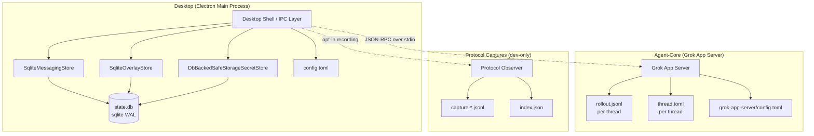

# State Layout

All PwrAgnt desktop state lives under a single root directory, defaulting to `~/.pwragnt/`.

## Component Storage Overview



**Desktop** uses sqlite for all structured persistent state (messaging, overlay, secrets). **Agent-Core** uses append-only JSONL files for thread conversation history and flat TOML for per-thread configuration. The two layers communicate over JSON-RPC via stdio — they do not share a database.

## Directory Structure

```
~/.pwragnt/
├── profiles.toml                          # profile registry (name, display_name, last_used)
└── profiles/
    └── default/
        ├── config.toml                    # desktop settings (messaging, models, worktrees)
        └── state/
            ├── state.db                   # sqlite: all persistent state (WAL mode)
            ├── state.db-wal               # sqlite write-ahead log
            ├── state.db-shm               # sqlite shared memory
            └── protocol-captures/         # dev-only: captured protocol sessions
```

## Environment Variables

| Variable | Purpose |
|----------|---------|
| `PWRAGNT_HOME` | Override the root directory (default: `~/.pwragnt/`) |
| `PWRAGNT_PROFILE` | Select a named profile (default: `default`) |

## sqlite Database (`state.db`)

Single database containing all persistent state. Opened with WAL mode, `synchronous=NORMAL`, `busy_timeout=5000ms`, `auto_vacuum=INCREMENTAL`.

### Tables

| Table | Contents |
|-------|----------|
| `meta` | Schema version, profile name, migration timestamp |
| `bindings` | Messaging channel-to-thread bindings |
| `pending_intents` | Queued messaging intents awaiting delivery |
| `browse_sessions` | Active messaging browse sessions |
| `callback_handles` | Messaging callback handles |
| `deliveries` | Sent message delivery records |
| `backends` | Backend scope state (known thread keys, snapshot hash) |
| `launchpad_defaults` | Sticky defaults for new thread launchpad |
| `directory_launchpads` | Per-directory launchpad drafts and settings |
| `threads` | Thread overlay state (seen timestamps, git branch, linked dirs) |
| `secrets` | `safeStorage`-encrypted secrets (bot tokens, API keys) |

## Multi-Instance Access

Multiple desktop instances can share the same profile's `state.db` safely. sqlite WAL mode serializes writes automatically. No external lockfile is required.

## Migration

On first launch after upgrade, the app migrates legacy JSON state files from their XDG locations into `state.db`:

- `~/.local/state/pwragnt/messaging-state.json` → messaging tables
- `~/.local/state/pwragnt/overlay-state.json` → overlay tables
- `~/.local/state/pwragnt/settings-secrets.json` → secrets table

Legacy files are left in place (not renamed or deleted) so older app versions can still read them during the transition.

## Dev Profile Recipe

Run a second isolated instance for testing:

```bash
PWRAGNT_HOME=~/.pwragnt-dev pnpm --filter @pwragnt/desktop dev
```

This creates a fully independent state directory with its own `state.db`, config, and secrets.
